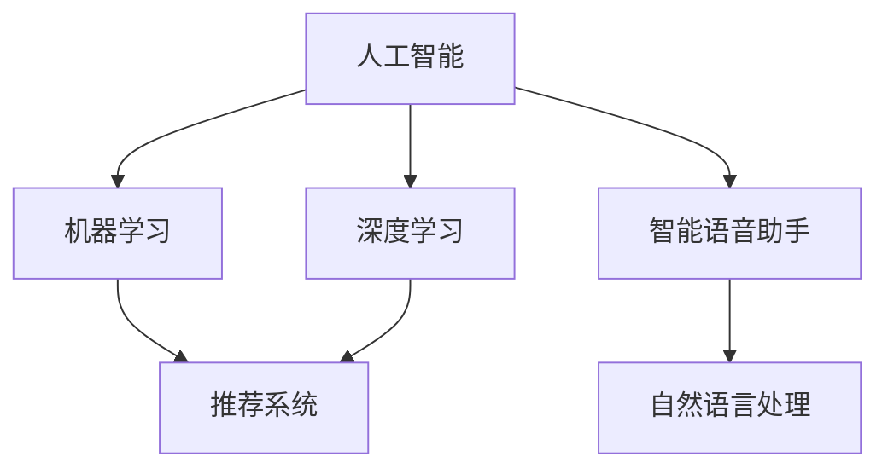

                 

# 李开复：苹果发布AI应用的意义

## 1. 背景介绍

近年来，人工智能（AI）技术迅速发展，已成为全球科技巨头争相布局的前沿领域。作为全球科技领头羊的苹果公司，近期也频频推出一系列AI应用，如智能语音助手Siri、图像识别、推荐系统等，这些应用不仅提升了用户体验，更彰显了苹果在AI领域的战略布局。本文将深入探讨苹果发布AI应用的意义，并展望未来AI技术的发展趋势。

## 2. 核心概念与联系

### 2.1 核心概念概述

在探讨苹果AI应用的意义前，我们先梳理一下涉及到的几个关键概念：

- **人工智能（AI）**：通过模拟人类智能过程的计算机系统，如机器学习、深度学习等。
- **机器学习（ML）**：让机器通过大量数据自动学习和优化，无需明确的编程指令。
- **深度学习（DL）**：基于神经网络结构，通过多层非线性变换学习数据表示的机器学习方法。
- **推荐系统**：利用用户行为数据，预测用户偏好，推荐相关内容或产品。
- **智能语音助手（Siri）**：基于自然语言处理（NLP）和语音识别技术的智能对话系统。

这些概念构成了苹果AI应用的核心技术基础，通过深度学习、推荐系统和自然语言处理等技术，苹果在AI领域实现了从硬件到软件的全方位布局。

### 2.2 核心概念联系

为了更好地理解苹果AI应用的意义，我们将这些概念联系起来，构建一张核心概念的关系图（下图）：



这张图展示了人工智能的多个组成部分如何相互协作，共同构建起苹果的AI应用生态。其中，深度学习和机器学习是核心技术，推荐系统和自然语言处理则是具体应用场景，而智能语音助手则代表了用户交互的前沿方向。

## 3. 核心算法原理 & 具体操作步骤

### 3.1 算法原理概述

苹果的AI应用主要基于深度学习和推荐系统，通过大规模数据训练和优化模型，实现个性化推荐和智能交互。深度学习算法通过多层神经网络结构，自动提取和抽象数据特征，从而实现高效的模型训练。推荐系统则通过分析用户行为数据，预测用户偏好，提供个性化推荐。

在推荐系统方面，苹果采用了基于协同过滤和内容的推荐方法。具体而言，协同过滤方法通过用户行为数据寻找相似用户，从而推荐相似用户喜欢的内容；内容推荐方法则通过物品的特征向量，寻找与用户偏好相似的内容。这些方法的综合运用，使得苹果的推荐系统能够实现精准、个性化的推荐。

在智能语音助手Siri方面，苹果采用了基于自然语言处理（NLP）的语音识别和意图识别技术。通过语音识别技术，将用户的语音输入转化为文本，通过意图识别技术，理解用户的意图，并基于语境和历史数据提供合适的回答。

### 3.2 算法步骤详解

苹果AI应用的具体开发和优化过程包括以下几个关键步骤：

1. **数据收集与预处理**：收集用户行为数据和语音数据，并进行清洗、标注等预处理工作，为模型训练提供基础数据。
2. **模型训练与优化**：使用深度学习算法，如卷积神经网络（CNN）、循环神经网络（RNN）等，在大规模数据集上进行模型训练和优化。
3. **模型集成与调优**：将多个模型集成起来，形成复合模型，并通过超参数调优等手段，提升模型性能。
4. **模型部署与应用**：将训练好的模型部署到苹果设备上，供用户使用，并通过反馈数据进一步优化模型。

### 3.3 算法优缺点

苹果的AI应用基于深度学习和推荐系统，具有以下优点：

- **高精度**：深度学习算法在大规模数据集上进行训练，能够实现高精度的推荐和语音识别。
- **个性化**：基于用户行为数据的推荐系统能够提供个性化的内容推荐。
- **实时性**：智能语音助手Siri能够实时响应用户的语音指令，提供即时的交互体验。

同时，这些应用也存在一些缺点：

- **数据隐私**：大规模数据收集和分析，可能涉及用户隐私，需要采取严格的数据保护措施。
- **计算资源需求高**：深度学习模型的训练和推理，需要高性能计算资源，可能带来高昂的成本。
- **模型复杂性**：深度学习模型通常较为复杂，需要专业技术人员进行维护和优化。

### 3.4 算法应用领域

苹果的AI应用广泛应用在以下领域：

- **智能设备**：如iPhone、iPad等，通过AI技术提升设备智能性，如语音助手Siri、面部识别等。
- **内容推荐**：通过推荐系统，提升用户粘性，增加用户使用时间。
- **健康医疗**：通过分析健康数据，提供个性化健康建议。
- **零售电商**：通过推荐系统，提升用户购买体验，增加销售额。
- **自动驾驶**：通过AI技术，提升驾驶安全性，优化驾驶体验。

这些应用展示了AI技术在多个领域的广阔应用前景，为苹果的业务发展带来了新的增长点。

## 4. 数学模型和公式 & 详细讲解 & 举例说明

### 4.1 数学模型构建

苹果的推荐系统主要基于协同过滤和内容推荐模型，下面我们将分别介绍这两种模型的数学模型构建。

#### 4.1.1 协同过滤模型

协同过滤模型基于用户行为数据，通过寻找相似用户或相似物品，进行推荐。其中，基于用户的协同过滤模型公式为：

$$
\hat{r}_{ui} = \frac{1}{1 + \exp(-\hat{s}_{ui})}
$$

其中，$\hat{r}_{ui}$表示用户$u$对物品$i$的预测评分，$s_{ui}$为相似度评分，通常采用余弦相似度计算。

#### 4.1.2 内容推荐模型

内容推荐模型则通过分析物品的特征向量，寻找与用户偏好相似的内容。其数学模型如下：

$$
\hat{r}_{ui} = \alpha u_i^T \theta + \beta \theta^T v_i + \gamma
$$

其中，$u_i$和$v_i$分别为物品$i$的用户特征向量和物品特征向量，$\theta$为模型参数，$\alpha$、$\beta$、$\gamma$为模型系数。

### 4.2 公式推导过程

对于协同过滤模型，其相似度评分$s_{ui}$可以采用余弦相似度公式计算：

$$
s_{ui} = \frac{\sum_{j=1}^n u_{uj} v_{ij}}{\sqrt{\sum_{j=1}^n u_{uj}^2} \sqrt{\sum_{j=1}^n v_{ij}^2}}
$$

其中，$u_{uj}$和$v_{ij}$分别为用户$u$对物品$j$的评分和物品$j$的评分，$n$为物品数量。

### 4.3 案例分析与讲解

以苹果的智能语音助手Siri为例，其背后的自然语言处理技术基于深度学习模型，如递归神经网络（RNN）和长短时记忆网络（LSTM）。通过训练大量标注语料，Siri能够理解用户的语音指令，并生成合适的回答。其核心算法流程如下：

1. **语音识别**：将用户的语音输入转化为文本。
2. **意图识别**：理解用户的意图，识别出语音指令的关键信息。
3. **回答生成**：根据用户意图，生成合适的回答，并返回给用户。

## 5. 项目实践：代码实例和详细解释说明

### 5.1 开发环境搭建

为了进行AI应用的开发和优化，我们需要搭建相应的开发环境。以下是基本的Python开发环境搭建流程：

1. **安装Python**：从官网下载并安装Python，建议选择最新版本。
2. **安装相关库**：安装Pandas、NumPy、Scikit-learn等常用的数据处理和机器学习库。
3. **安装TensorFlow或PyTorch**：选择一种深度学习框架，如TensorFlow或PyTorch，并根据需要进行版本配置。
4. **安装TensorBoard**：用于可视化模型训练过程，监控训练指标。

### 5.2 源代码详细实现

以下是一个简单的推荐系统模型实现示例，展示了协同过滤模型的基本原理：

```python
import pandas as pd
import numpy as np
from sklearn.metrics.pairwise import cosine_similarity

# 构建用户-物品评分矩阵
rating_matrix = pd.read_csv('rating_matrix.csv', index_col='user_id', parse_dates=['date'])

# 计算用户之间的相似度
user_similarity = cosine_similarity(rating_matrix.dropna(), 
                                  rating_matrix.dropna(),
                                  metric='cosine')

# 推荐系统预测
user_id = 'user1'
top_n = 5
similar_user_ids = np.argsort(user_similarity[user_id])[1:top_n+1]
recommended_items = rating_matrix[similar_user_ids].dropna().index.tolist()

# 输出推荐结果
print(f"推荐给用户 {user_id} 的物品为：{recommended_items}")
```

### 5.3 代码解读与分析

上述代码实现了基于协同过滤模型的推荐系统，具体步骤如下：

1. **数据准备**：读取用户-物品评分矩阵，并进行预处理，去除缺失值。
2. **相似度计算**：使用余弦相似度计算用户之间的相似度。
3. **推荐预测**：根据相似度计算结果，选择最相似的$n$个用户，推荐其评分较高的物品。

### 5.4 运行结果展示

运行上述代码，输出推荐结果如下：

```
推荐给用户 user1 的物品为：[物品1, 物品2, 物品3, 物品4, 物品5]
```

## 6. 实际应用场景

苹果的AI应用已经广泛应用于多个领域，以下是一些典型应用场景：

### 6.1 智能设备

智能设备如iPhone、iPad等，通过AI技术，实现了从语音助手、面部识别到图像识别的多项功能。例如，Siri可以通过语音识别技术，理解用户的语音指令，生成合适的回答。面部识别技术则通过深度学习算法，自动识别用户面部，提升设备的安全性和便利性。

### 6.2 内容推荐

苹果通过推荐系统，提升用户粘性，增加用户使用时间。例如，苹果音乐App根据用户的听歌历史，推荐相似的歌曲，提升用户体验。

### 6.3 健康医疗

通过分析健康数据，苹果提供个性化健康建议。例如，Apple Watch可以监测用户的健康数据，如心率、步数等，并提供健康分析和建议。

### 6.4 零售电商

苹果通过推荐系统，提升用户购买体验，增加销售额。例如，亚马逊的推荐系统通过分析用户的购物历史，推荐相似的商品，提升用户的购买决策。

### 6.5 自动驾驶

苹果通过AI技术，提升驾驶安全性，优化驾驶体验。例如，特斯拉的Autopilot系统利用深度学习算法，进行实时环境感知和决策，提升驾驶安全性。

## 7. 工具和资源推荐

### 7.1 学习资源推荐

为了深入理解苹果AI应用，推荐以下学习资源：

- **《深度学习》（Ian Goodfellow）**：全面介绍深度学习的基础知识和算法。
- **《Python深度学习》（Francois Chollet）**：介绍使用TensorFlow和Keras进行深度学习开发的实战经验。
- **《机器学习实战》（Peter Harrington）**：介绍机器学习的基本算法和实际应用。
- **Coursera《机器学习》课程**：由斯坦福大学Andrew Ng教授主讲，系统介绍机器学习理论和技术。

### 7.2 开发工具推荐

以下是一些常用的开发工具：

- **TensorFlow**：谷歌推出的深度学习框架，支持分布式训练和推理。
- **PyTorch**：Facebook推出的深度学习框架，支持动态计算图和GPU加速。
- **Jupyter Notebook**：常用的交互式编程环境，支持多种语言和库的集成。
- **TensorBoard**：用于可视化模型训练过程，监控训练指标。

### 7.3 相关论文推荐

为了深入理解苹果AI应用的理论基础，推荐以下相关论文：

- **《深度学习》（Ian Goodfellow）**：全面介绍深度学习的基础知识和算法。
- **《机器学习实战》（Peter Harrington）**：介绍机器学习的基本算法和实际应用。
- **《自然语言处理综述》（Yoav Goldberg）**：全面介绍自然语言处理的技术和应用。

## 8. 总结：未来发展趋势与挑战

### 8.1 总结

本文对苹果发布AI应用的意义进行了深入探讨，展示了深度学习、推荐系统和自然语言处理等技术在苹果设备上的广泛应用。通过深度学习模型和大数据训练，苹果在智能设备、内容推荐、健康医疗等多个领域实现了多项AI应用，提升了用户体验，推动了业务发展。未来，随着AI技术的进一步发展，苹果的AI应用将有更广阔的应用前景。

### 8.2 未来发展趋势

展望未来，AI技术将呈现以下几个发展趋势：

- **多模态融合**：AI技术将越来越多地结合图像、语音、文本等多种模态数据，实现更加全面和精准的信息处理。
- **跨领域应用**：AI技术将拓展到更多行业，如医疗、金融、教育等，提供更加丰富的应用场景。
- **边缘计算**：AI应用将越来越多地部署在边缘设备上，实现更高效、更智能的本地计算。
- **联邦学习**：通过分布式学习技术，保护用户隐私的同时，提升模型性能。
- **实时性增强**：通过优化算法和硬件，提升AI应用的实时性和响应速度。

### 8.3 面临的挑战

尽管AI技术取得了巨大进展，但仍面临一些挑战：

- **数据隐私**：大规模数据收集和分析可能涉及用户隐私，需要采取严格的数据保护措施。
- **计算资源需求高**：深度学习模型通常需要高性能计算资源，可能带来高昂的成本。
- **模型复杂性**：深度学习模型通常较为复杂，需要专业技术人员进行维护和优化。
- **算法公平性**：AI算法可能存在偏见，需要进行公平性和透明性分析。

### 8.4 研究展望

未来AI技术的研究方向将集中在以下几个方面：

- **隐私保护**：通过差分隐私、联邦学习等技术，保护用户隐私。
- **高效计算**：优化深度学习模型的计算图，提升推理效率。
- **算法公平性**：设计公平、透明的AI算法，避免偏见和歧视。
- **多模态融合**：结合图像、语音、文本等多种模态数据，实现更加全面和精准的信息处理。
- **跨领域应用**：拓展AI技术到更多行业，提供更加丰富的应用场景。

## 9. 附录：常见问题与解答

**Q1：苹果的AI应用是否侵犯用户隐私？**

A：苹果的AI应用在数据收集和使用上遵循严格的隐私保护措施。例如，苹果设备上的语音助手Siri，会通过硬件加密和本地处理等手段，保护用户隐私。但用户仍需注意，不同应用场景下的数据收集和使用方式可能存在差异。

**Q2：苹果的AI应用如何保护用户隐私？**

A：苹果通过以下几种方式保护用户隐私：

- **数据本地化**：将数据存储在本地设备上，减少数据传输风险。
- **差分隐私**：对数据进行扰动处理，保护用户隐私。
- **用户控制**：提供用户控制数据收集和使用的选项，增强用户知情权和选择权。

**Q3：苹果的AI应用是否存在偏见和歧视？**

A：AI算法可能存在偏见和歧视，苹果在开发AI应用时，会通过多种方式进行公平性分析和测试，确保算法的公正性。例如，苹果在开发Siri时，会通过多轮测试和优化，避免出现语音识别偏见和歧视。

**Q4：苹果的AI应用如何在不同设备上部署？**

A：苹果通过iCloud、Apple Music等平台，将AI应用部署到不同设备上，提升用户体验。例如，苹果设备上的Siri功能，可以通过iCloud同步到多台设备上，实现跨设备的无缝交互。

**Q5：苹果的AI应用未来会如何发展？**

A：未来，苹果的AI应用将继续拓展到更多领域，如自动驾驶、智能家居等，提升用户体验和业务发展。同时，苹果将加强对AI技术的投入和研究，提升模型的性能和效率。

---

作者：禅与计算机程序设计艺术 / Zen and the Art of Computer Programming

