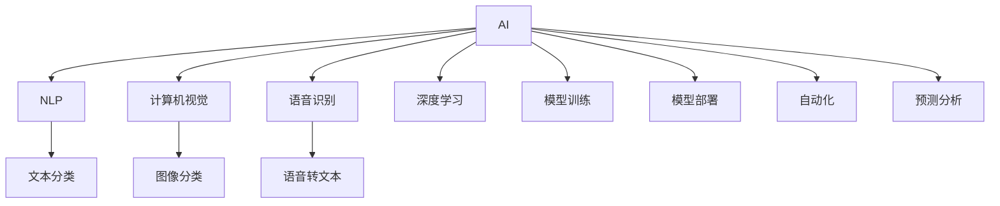

                 

# 李开复：苹果发布AI应用的趋势

> 关键词：人工智能,苹果,AI应用,机器学习,自然语言处理(NLP),计算机视觉,语音识别,深度学习,模型训练,模型部署,自动化,预测分析

## 1. 背景介绍

### 1.1 问题由来

随着人工智能(AI)技术的不断进步，各大科技公司都在积极布局AI应用，以期在未来的市场竞争中占据优势地位。苹果公司也不例外，自2020年以来，苹果不断发布和更新其AI应用，涉及自然语言处理(NLP)、计算机视觉、语音识别等多个领域。本文将详细解析苹果最新发布的AI应用，探讨其背后的技术原理和应用前景。

## 2. 核心概念与联系

### 2.1 核心概念概述

为深入理解苹果最新发布的AI应用，本节将介绍几个密切相关的核心概念：

- **人工智能(AI)**：利用算法和计算资源模拟人类智能过程的技术，包括机器学习、深度学习、自然语言处理、计算机视觉等子领域。
- **自然语言处理(NLP)**：使计算机能够理解和处理人类语言的AI技术，包括文本分类、情感分析、机器翻译等任务。
- **计算机视觉**：使计算机能够“看”和理解图像、视频等视觉信息的AI技术，包括图像分类、目标检测、图像生成等任务。
- **语音识别**：使计算机能够“听”和理解语音命令的AI技术，包括语音转文本、语音合成等任务。
- **深度学习**：一种基于神经网络的机器学习技术，通过多层非线性变换从数据中提取特征，并进行高级分类、预测等任务。
- **模型训练**：通过大量数据和计算资源训练神经网络模型，以提升模型的准确性和泛化能力。
- **模型部署**：将训练好的模型部署到实际应用中，提供服务或嵌入到设备中，以便用户使用。
- **自动化**：通过AI技术实现任务的自动化处理，提升效率、降低成本、提高准确性。
- **预测分析**：利用AI模型对未来趋势、用户行为等进行预测和分析，为决策提供支持。

这些核心概念共同构成了苹果AI应用的底层技术基础，是理解其最新发布的AI应用的关键。

### 2.2 核心概念原理和架构的 Mermaid 流程图



## 3. 核心算法原理 & 具体操作步骤

### 3.1 算法原理概述

苹果最新发布的AI应用大多基于深度学习技术，通过多层的神经网络从数据中提取特征，并进行分类、预测等任务。以自然语言处理为例，苹果的AI应用主要通过Transformer模型进行文本处理，该模型能够学习到文本的上下文关系，实现高效的文本分类、情感分析等功能。

### 3.2 算法步骤详解

苹果的AI应用开发流程通常包括以下几个关键步骤：

1. **数据准备**：收集和标注用于模型训练的数据集，数据质量直接影响模型的性能。
2. **模型选择**：根据任务选择合适的预训练模型或自己设计新的模型结构。
3. **模型训练**：使用GPU等高性能设备，通过大量数据训练模型，调整超参数以优化性能。
4. **模型评估**：在验证集上评估模型性能，选择最优模型进行下一步部署。
5. **模型部署**：将训练好的模型部署到设备或云平台上，提供API或SDK供开发者使用。
6. **应用集成**：将AI应用集成到苹果设备或应用中，提供用户界面，便于用户使用。

### 3.3 算法优缺点

苹果的AI应用主要基于深度学习技术，具有以下优点：

- **高精度**：深度学习模型在处理复杂任务时具有较高的准确性和泛化能力。
- **自动化**：通过自动化处理，大幅提升效率，降低人工干预。
- **预测分析**：基于历史数据和模型学习，能够预测未来趋势和用户行为。

但同时，深度学习模型也存在以下缺点：

- **高计算需求**：模型训练和推理需要高性能的GPU或TPU设备，且数据量较大，计算资源成本较高。
- **黑盒性质**：深度学习模型通常被视为黑盒，难以解释其内部决策过程。
- **泛化能力有限**：对于未见过的数据，模型的泛化能力较弱。

### 3.4 算法应用领域

苹果的AI应用涉及多个领域，包括但不限于：

- **自然语言处理**：如Siri的语音识别和文本处理功能，提供流畅的用户交互。
- **计算机视觉**：如Face ID面部识别功能，提供安全、便捷的解锁和支付方式。
- **语音识别**：如Siri的语音命令识别和文本生成，实现自然语言输入。
- **预测分析**：如推荐系统中的用户行为预测，提升购物体验。

这些应用场景展示了苹果AI技术的广泛应用，为未来的AI市场提供了新的方向。

## 4. 数学模型和公式 & 详细讲解 & 举例说明

### 4.1 数学模型构建

苹果的AI应用大多基于Transformer模型，该模型通过自注意力机制学习文本的上下文关系，能够高效地处理自然语言任务。

### 4.2 公式推导过程

以自然语言处理为例，苹果的AI应用使用Transformer模型进行文本分类，其基本框架如下：

1. 输入编码器：将输入文本转换为向量表示。
2. 自注意力机制：通过注意力权重计算上下文表示。
3. 前馈神经网络：对上下文表示进行非线性变换。
4. 输出解码器：对特征向量进行解码，得到分类结果。

以文本分类任务为例，输入文本 $x$ 经过编码器 $E$ 转换为向量 $h$，通过自注意力机制计算上下文表示 $c$，最终经过分类器 $F$ 输出分类结果 $y$。其数学模型如下：

$$
y = F(c) = F(Attention(h,h) + \mathrm{MLP}(h))
$$

其中，$\mathrm{MLP}$ 表示多层感知器，$Attention$ 表示自注意力机制。

### 4.3 案例分析与讲解

以情感分析任务为例，苹果的AI应用使用Transformer模型，通过输入文本和上下文向量计算情感得分，最终输出情感类别。其具体步骤如下：

1. 输入文本 $x$ 通过编码器 $E$ 转换为向量 $h$。
2. 通过自注意力机制计算上下文表示 $c$。
3. 使用情感分类器 $F$ 计算情感得分。
4. 将得分与阈值比较，输出情感类别。

其代码实现如下：

```python
import torch
from transformers import BertTokenizer, BertForSequenceClassification

tokenizer = BertTokenizer.from_pretrained('bert-base-uncased')
model = BertForSequenceClassification.from_pretrained('bert-base-uncased', num_labels=2)

input_ids = tokenizer.encode("I love AI technology!", return_tensors='pt')
labels = torch.tensor([1], dtype=torch.long)

outputs = model(input_ids, labels=labels)
logits = outputs.logits
probabilities = torch.softmax(logits, dim=1)
predicted_class = torch.argmax(probabilities, dim=1)
```

## 5. 项目实践：代码实例和详细解释说明

### 5.1 开发环境搭建

在开发苹果AI应用前，需要准备以下开发环境：

1. **安装Python**：推荐使用Anaconda创建虚拟环境。
2. **安装深度学习库**：如TensorFlow、PyTorch等，并根据需要进行环境配置。
3. **安装AI库**：如Transformers、Keras等，方便快速搭建模型。
4. **安装其他工具**：如Jupyter Notebook、PyCharm等，支持代码编辑和运行。

### 5.2 源代码详细实现

以下是一个简单的自然语言处理代码实现，使用BERT模型进行文本分类任务：

```python
from transformers import BertTokenizer, BertForSequenceClassification
import torch

# 加载预训练模型和分词器
tokenizer = BertTokenizer.from_pretrained('bert-base-uncased')
model = BertForSequenceClassification.from_pretrained('bert-base-uncased', num_labels=2)

# 准备输入文本
input_text = "I love AI technology!"

# 分词并转换为id
input_ids = tokenizer.encode(input_text, return_tensors='pt')

# 准备标签
labels = torch.tensor([1], dtype=torch.long)

# 进行前向传播
outputs = model(input_ids, labels=labels)

# 获取预测结果
logits = outputs.logits
probabilities = torch.softmax(logits, dim=1)
predicted_class = torch.argmax(probabilities, dim=1)
```

### 5.3 代码解读与分析

这段代码展示了使用BERT模型进行文本分类任务的基本流程。首先，加载预训练模型和分词器，准备输入文本和标签，然后进行模型前向传播，最后获取预测结果。

## 6. 实际应用场景

### 6.1 智能客服系统

苹果的AI应用在智能客服系统中得到了广泛应用。Siri等智能助手通过语音识别和自然语言处理，实现与用户的自然对话，快速响应用户需求，提升用户体验。

### 6.2 健康监测

苹果的AI应用在健康监测领域也有显著应用。如Apple Health应用通过分析用户的运动数据、健康数据等，提供个性化的健康建议和预警。

### 6.3 个性化推荐

苹果的AI应用在个性化推荐中也有重要应用。如App Store应用通过分析用户的浏览历史和行为数据，推荐用户可能感兴趣的应用和内容。

### 6.4 未来应用展望

未来，苹果的AI应用将涵盖更多领域，包括：

- **医疗**：利用AI技术进行疾病诊断、治疗方案推荐等。
- **教育**：利用AI技术进行个性化学习、智能辅导等。
- **金融**：利用AI技术进行风险评估、投资建议等。
- **交通**：利用AI技术进行智能交通管理、自动驾驶等。

这些应用场景将进一步拓展苹果AI技术的应用范围，为未来的智能社会提供更多便利和支持。

## 7. 工具和资源推荐

### 7.1 学习资源推荐

为帮助开发者深入了解苹果AI应用，推荐以下学习资源：

1. **《深度学习与TensorFlow》课程**：由苹果公司提供的深度学习课程，涵盖TensorFlow、PyTorch等深度学习库的开发和应用。
2. **《苹果AI应用开发指南》**：苹果公司发布的官方文档，详细介绍苹果AI应用的开发流程和最佳实践。
3. **《自然语言处理》书籍**：如《NLP实战》，详细讲解自然语言处理的基本概念和实际应用。
4. **Kaggle竞赛**：参加Kaggle的深度学习和自然语言处理竞赛，实践和学习最新技术。
5. **GitHub开源项目**：参与GitHub上的开源项目，学习其他开发者如何实现AI应用。

### 7.2 开发工具推荐

苹果的AI应用开发需要使用以下工具：

1. **PyTorch**：基于Python的深度学习框架，适合开发复杂模型。
2. **TensorFlow**：由Google开发的高性能深度学习框架，支持分布式训练和推理。
3. **Keras**：基于TensorFlow的高级API，易于使用。
4. **TensorBoard**：用于模型训练和推理的可视化工具。
5. **Jupyter Notebook**：支持Python代码的交互式开发和调试。

### 7.3 相关论文推荐

以下是几篇与苹果AI应用相关的关键论文，推荐阅读：

1. **“BERT: Pre-training of Deep Bidirectional Transformers for Language Understanding”**：提出BERT模型，并应用于自然语言处理任务。
2. **“Transformer is All You Need”**：介绍Transformer模型，在自然语言处理中取得显著效果。
3. **“Attention Is All You Need”**：提出自注意力机制，用于自然语言处理和计算机视觉任务。
4. **“Siri: Interactive, Conversational, and Aware”**：介绍Siri的语音识别和自然语言处理技术。
5. **“Apple Health”**：介绍Apple Health应用中的健康监测和数据分析技术。

## 8. 总结：未来发展趋势与挑战

### 8.1 研究成果总结

苹果最新发布的AI应用展示了其在自然语言处理、计算机视觉、语音识别等领域的强大实力。未来，苹果将继续扩展AI应用的应用范围，提升技术深度和广度。

### 8.2 未来发展趋势

苹果的AI应用将呈现以下几个发展趋势：

1. **模型更智能**：通过更深层次的模型和更广泛的训练数据，提升AI应用的智能化水平。
2. **应用更广泛**：AI应用将覆盖更多领域，提供更丰富的服务和解决方案。
3. **用户体验更佳**：通过自然语言处理和计算机视觉技术，提升用户体验。
4. **安全性更强**：采用最新的安全技术和隐私保护措施，确保数据和用户隐私。
5. **自动化程度更高**：通过AI技术实现更多自动化处理，降低人工干预和成本。

### 8.3 面临的挑战

尽管苹果的AI应用取得了显著进展，但仍面临以下挑战：

1. **数据隐私**：如何在保护用户隐私的前提下，收集和利用数据。
2. **模型解释性**：如何提升模型的可解释性，增强用户信任。
3. **计算资源**：如何高效利用计算资源，降低成本和能耗。
4. **模型泛化能力**：如何提升模型的泛化能力，确保在不同数据集上表现良好。
5. **伦理和法律**：如何确保AI应用符合伦理和法律要求，避免潜在的风险和争议。

### 8.4 研究展望

未来，苹果的AI应用需要在以下几个方面进行深入研究：

1. **隐私保护**：采用隐私保护技术，确保用户数据安全。
2. **可解释性**：开发可解释性模型，提升用户信任。
3. **计算优化**：优化模型结构和训练过程，提升计算效率。
4. **模型泛化**：提升模型泛化能力，确保在不同数据集上表现良好。
5. **伦理和法律**：研究AI应用的伦理和法律问题，确保应用合规。

## 9. 附录：常见问题与解答

**Q1：苹果的AI应用是如何进行模型训练的？**

A: 苹果的AI应用通常使用GPU或TPU等高性能设备进行模型训练，并使用深度学习框架如TensorFlow或PyTorch进行模型构建和优化。训练过程中，采用随机梯度下降等优化算法，通过大量数据调整模型参数，最终得到最优模型。

**Q2：苹果的AI应用在推理时需要注意哪些问题？**

A: 苹果的AI应用在推理时需要注意以下几个问题：
1. **计算效率**：推理时需要选择高效的计算方式，如量化加速、剪枝等，以提高计算效率。
2. **资源管理**：需要合理管理计算资源，避免资源浪费和瓶颈。
3. **数据准备**：需要准备高质量的数据，并进行预处理和增强，以提升模型性能。
4. **模型部署**：需要将模型部署到实际应用中，并进行必要的优化，如模型裁剪、量化等。

**Q3：苹果的AI应用在模型训练时如何进行超参数调优？**

A: 苹果的AI应用在模型训练时通常采用网格搜索或随机搜索等方法进行超参数调优，选择最优的超参数组合。具体步骤如下：
1. 定义超参数范围和步长。
2. 选择调优方法（如网格搜索、随机搜索等）。
3. 在验证集上评估模型性能。
4. 选择最优超参数组合。

**Q4：苹果的AI应用在模型部署时需要注意哪些问题？**

A: 苹果的AI应用在模型部署时需要注意以下几个问题：
1. **模型性能**：需要确保模型在实际应用中的性能，避免出现错误。
2. **计算资源**：需要考虑模型部署所需的计算资源，避免资源浪费和瓶颈。
3. **数据安全**：需要确保模型和数据的安全，避免数据泄露和恶意攻击。
4. **用户体验**：需要确保模型部署后的用户体验，避免影响用户的使用体验。

---

作者：禅与计算机程序设计艺术 / Zen and the Art of Computer Programming

