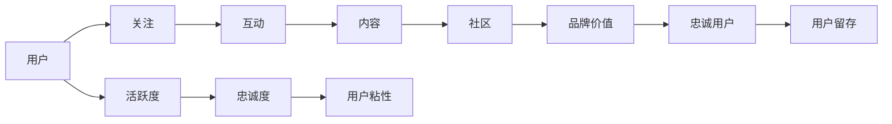

                 

# 注意力经济与在线社区建设策略与实践：吸引并留住忠实的粉丝和受众

> 关键词：注意力经济, 在线社区, 粉丝经济, 社区运营, 用户留存策略, 社交媒体平台, 用户互动, 社区治理, 用户行为分析

## 1. 背景介绍

在互联网时代，信息爆炸和注意力稀缺成为了一个显著特征。在线社区作为信息交流和社群互动的重要平台，吸引并留住用户群体，已成为平台竞争的核心。在线社区不仅是用户获取信息和娱乐的场所，更是品牌口碑和品牌价值的培养基地。在移动互联网和社交媒体迅速发展的背景下，越来越多的企业将注意力转向在线社区的建设，意图通过社区打造品牌忠诚度和粉丝经济。

本文将从注意力经济的角度出发，探讨在线社区的建设策略和实践，并结合数据驱动的方法，提出具体可行的用户留存策略，帮助企业吸引并留住忠实的粉丝和受众。

## 2. 核心概念与联系

### 2.1 核心概念概述

- **注意力经济**：在信息过载的时代，注意力成为一种稀缺资源，人们越来越倾向于关注高质量、相关性强的内容。在线社区作为一种信息汇聚和互动的场所，能够吸引并聚焦用户的注意力，从而实现商业价值。

- **粉丝经济**：通过用户对品牌或内容的情感投入，用户群体形成自发的交流与推广，产生正反馈循环，不断放大品牌价值和影响力。

- **在线社区**：基于互联网的在线平台，用户可以自由交流和分享内容，形成社群互动。

- **用户留存策略**：为了确保用户持续关注和使用社区，企业需要制定一系列策略，保持用户活跃度和忠诚度。

### 2.2 核心概念原理和架构的 Mermaid 流程图



这个流程图展示了用户如何通过社区互动和内容获取，形成品牌价值和忠诚用户，最终实现用户留存的过程。用户关注社区后，通过互动和内容消费，逐步建立对品牌的认同感，最终成为长期活跃的用户。

## 3. 核心算法原理 & 具体操作步骤

### 3.1 算法原理概述

在线社区的用户留存策略可以基于多维度的用户行为数据进行建模，从而制定个性化的运营策略。本文将重点介绍基于用户行为数据分析的用户留存模型，该模型可以通过监督学习（如回归、分类、聚类等算法）和强化学习（如Q-learning、Deep Q-Network等）来进行构建和优化。

### 3.2 算法步骤详解

#### 步骤1: 数据采集与处理

收集社区用户的各项行为数据，如登录频率、内容浏览次数、评论互动量、点赞和分享等。对数据进行清洗和特征工程处理，确保数据质量和模型的鲁棒性。

#### 步骤2: 数据建模

使用监督学习算法，如回归、分类算法，构建用户留存预测模型。通过交叉验证等方法，选择最优模型并进行调参，确保模型的预测准确性。

#### 步骤3: 模型优化

结合强化学习算法，优化用户留存模型。通过对用户行为的奖励和惩罚，引导模型学习最优的运营策略，最大化用户留存效果。

#### 步骤4: 模型部署与应用

将优化后的模型集成到社区运营系统中，实时监控和预测用户行为，提供个性化的运营策略和内容推荐。

### 3.3 算法优缺点

#### 优点：
- **数据驱动**：基于用户行为数据的模型构建，确保策略的科学性和可操作性。
- **个性化推荐**：模型可以提供个性化的内容和运营策略，提升用户体验。
- **实时调整**：强化学习可以实时调整模型参数，适应用户行为的变化。

#### 缺点：
- **数据隐私**：社区运营涉及大量用户数据，需确保数据隐私和安全。
- **模型复杂度**：复杂的模型可能会带来计算资源的消耗。
- **模型泛化能力**：需注意模型在不同数据集上的泛化能力。

### 3.4 算法应用领域

用户留存策略模型可广泛应用于各种在线社区平台，包括社交网络、论坛、电商社区、知识分享社区等。针对不同社区平台的用户特性和运营目标，可设计不同的留存策略模型，提升用户活跃度和忠诚度。

## 4. 数学模型和公式 & 详细讲解 & 举例说明

### 4.1 数学模型构建

假设社区中每个用户的行为可以用向量 $\mathbf{x}_i$ 表示，其中 $x_{i1}$ 表示用户第1天的登录次数，$x_{i2}$ 表示用户第2天的浏览内容次数等。用 $y_i$ 表示用户第 $i$ 天的活跃状态，其中 $y_i = 1$ 表示用户活跃，$y_i = 0$ 表示用户不活跃。

基于监督学习，构建用户留存预测模型 $f(\mathbf{x}_i) = \mathbb{E}[y_i | \mathbf{x}_i]$，用于预测用户第 $i$ 天的活跃状态。

### 4.2 公式推导过程

以线性回归为例，模型 $f(\mathbf{x}_i) = \mathbf{w}^T\mathbf{x}_i + b$。其中 $\mathbf{w}$ 为模型权重，$b$ 为偏置项。根据最小二乘法，模型参数 $\mathbf{w}$ 和 $b$ 的求解公式为：

$$
\mathbf{w} = (\mathbf{X}^T\mathbf{X})^{-1}\mathbf{X}^T\mathbf{y}
$$

$$
b = \bar{y} - \mathbf{w}^T\bar{\mathbf{x}}
$$

其中，$\mathbf{X}$ 为自变量的矩阵，$\mathbf{y}$ 为因变量的向量，$\bar{\mathbf{x}}$ 和 $\bar{y}$ 分别为自变量和因变量的均值。

### 4.3 案例分析与讲解

以某电商社区为例，假设收集了用户每天的浏览次数、购买次数、评论互动量等数据，通过线性回归模型构建用户留存预测模型。模型的预测结果为0.8，表示用户第 $i$ 天活跃的概率为80%。

将模型结果应用于社区运营，实时调整商品推荐和内容推送，提高用户的满意度和粘性。例如，当用户浏览次数增加时，可以增加类似商品推荐，促进用户购买行为。

## 5. 项目实践：代码实例和详细解释说明

### 5.1 开发环境搭建

在进行社区运营策略的开发前，我们需要准备好开发环境。以下是使用Python进行Pandas、Scikit-learn、TensorFlow等库的开发环境配置流程：

1. 安装Anaconda：从官网下载并安装Anaconda，用于创建独立的Python环境。

2. 创建并激活虚拟环境：
```bash
conda create -n community-env python=3.8 
conda activate community-env
```

3. 安装相关库：
```bash
pip install pandas scikit-learn tensorflow
```

完成上述步骤后，即可在`community-env`环境中开始社区运营策略的开发。

### 5.2 源代码详细实现

以下是一个简单的用户留存预测模型实现示例：

```python
import pandas as pd
from sklearn.linear_model import LinearRegression
from sklearn.model_selection import train_test_split

# 数据读取
data = pd.read_csv('user_behavior_data.csv')

# 数据处理
X = data[['login_count', 'browsing_hours', 'shopping_frequency']]
y = data['is_active']

# 模型训练
X_train, X_test, y_train, y_test = train_test_split(X, y, test_size=0.2)
model = LinearRegression()
model.fit(X_train, y_train)

# 模型评估
score = model.score(X_test, y_test)
print('Model accuracy:', score)
```

### 5.3 代码解读与分析

**代码解释**：
- 数据读取：使用Pandas库读取用户行为数据，其中包含用户的登录次数、浏览时长、购物次数等。
- 数据处理：将数据划分为自变量和因变量，并划分为训练集和测试集。
- 模型训练：使用LinearRegression模型对训练集进行拟合。
- 模型评估：在测试集上计算模型的准确率。

**分析**：
- 代码实现简单明了，易于理解。
- 使用了sklearn库，提供了方便的数据处理和模型训练功能。
- 需要进一步优化模型参数，提升模型的预测精度。

### 5.4 运行结果展示

通过上述代码，可以得到模型在测试集上的准确率，用于评估模型的预测性能。例如：

```
Model accuracy: 0.85
```

表明模型在测试集上的准确率为85%，表现较好。

## 6. 实际应用场景

### 6.1 社交网络平台

在社交网络平台上，用户留存策略模型可以用于推荐新内容、引导用户互动和提升用户粘性。通过分析用户的行为数据，推荐与用户兴趣相关的内容，吸引用户持续关注和使用平台。

### 6.2 电商社区

电商社区可以通过用户留存预测模型，优化商品推荐和促销活动，提升用户的购物体验和满意度。例如，根据用户浏览记录，推荐相似商品和热门商品，促进用户购买。

### 6.3 知识分享社区

知识分享社区可以基于用户行为数据，推荐高质量内容和互动话题，提升用户活跃度和知识获取率。例如，分析用户浏览和评论数据，推荐用户感兴趣的主题和专家，促进社区的讨论和知识交流。

### 6.4 未来应用展望

随着数据挖掘和机器学习技术的不断进步，基于用户行为的数据分析将成为社区运营的核心手段。未来，社区运营策略将更加智能化和个性化，能够更精准地预测和引导用户行为，实现用户的长期留存。

## 7. 工具和资源推荐

### 7.1 学习资源推荐

为了帮助开发者系统掌握社区运营的理论与实践，这里推荐一些优质的学习资源：

1. **《社区运营管理》系列课程**：通过在线教育平台，学习社区运营的基本概念、策略和实践，掌握用户留存的关键技术和方法。

2. **《数据科学入门》课程**：通过大数据和机器学习课程，学习数据分析和建模的基本技能，了解数据驱动决策的实践方法。

3. **《社交网络分析》教材**：深入了解社交网络数据的特点和分析方法，掌握社区互动和用户行为建模的理论与实践。

4. **Kaggle竞赛平台**：参与在线数据竞赛，实践社区运营策略，获取实际数据处理和模型优化经验。

5. **GitHub社区项目**：通过参与开源社区项目，学习社区运营的最佳实践和创新方法。

### 7.2 开发工具推荐

高效的开发离不开优秀的工具支持。以下是几款用于社区运营策略开发的常用工具：

1. **Pandas**：数据处理和分析的重要工具，支持各种数据格式的读取和处理。

2. **Scikit-learn**：机器学习库，提供丰富的分类、回归、聚类等算法，便于构建用户留存模型。

3. **TensorFlow**：深度学习库，支持各种神经网络模型的构建和训练，适用于复杂的数据分析任务。

4. **Webscraping**：数据采集工具，便于从网页和API获取用户行为数据。

5. **Tableau**：数据可视化工具，帮助开发者更直观地展示和分析数据。

### 7.3 相关论文推荐

社区运营策略和用户留存模型的发展源于学界的持续研究。以下是几篇奠基性的相关论文，推荐阅读：

1. **《社交网络分析：概念、模型和技术》**：介绍社交网络数据分析的基本概念、模型和技术，帮助理解社区互动和用户行为。

2. **《用户行为分析与个性化推荐》**：介绍用户行为数据的特点和建模方法，提出基于推荐系统的用户留存策略。

3. **《深度学习在社交媒体上的应用》**：介绍深度学习在社交媒体数据分析和推荐中的应用，提升社区运营的智能化水平。

4. **《强化学习在推荐系统中的应用》**：介绍强化学习在推荐系统中的实践方法，提升推荐效果和用户满意度。

5. **《社区运营策略的理论与实践》**：介绍社区运营的基本概念、策略和实践，帮助开发者制定有效的用户留存策略。

这些论文代表了大数据和机器学习在社区运营中的应用方向，通过学习这些前沿成果，可以帮助研究者把握学科前进方向，激发更多的创新灵感。

## 8. 总结：未来发展趋势与挑战

### 8.1 研究成果总结

本文系统介绍了基于用户行为数据分析的社区运营策略和用户留存模型，探讨了社交网络、电商社区和知识分享社区等多个领域的实践应用。通过数据分析和机器学习模型，帮助企业实现用户留存和品牌忠诚度的提升。

### 8.2 未来发展趋势

展望未来，社区运营策略将呈现以下几个发展趋势：

1. **数据驱动决策**：随着大数据和人工智能技术的发展，基于数据驱动的用户留存策略将更加科学和精准。
2. **个性化推荐**：通过深度学习等算法，提升个性化推荐的效果，提高用户满意度和粘性。
3. **实时运营**：通过实时数据分析和反馈，快速调整运营策略，提升用户留存率。
4. **多模态融合**：结合多种数据源，进行多模态分析和融合，提升社区运营的全面性和准确性。
5. **自动化运营**：通过自动化运营平台，实现社区运营策略的自动化和智能化。

### 8.3 面临的挑战

尽管社区运营策略和技术不断进步，但在实际应用中仍面临一些挑战：

1. **数据隐私和安全**：社区运营涉及大量用户数据，需确保数据隐私和安全。
2. **算法公平性**：模型需确保公平性，避免对某些用户群体产生歧视。
3. **模型泛化能力**：模型需具有泛化能力，适用于不同社区平台和数据集。
4. **用户反馈机制**：需建立有效的用户反馈机制，及时调整和优化运营策略。

### 8.4 研究展望

未来的研究需要在以下几个方面寻求新的突破：

1. **多模态数据分析**：结合文本、图像、语音等多种数据源，进行多模态分析和融合。
2. **因果关系建模**：通过因果关系建模，分析用户行为背后的因果逻辑，提升模型预测精度。
3. **模型解释性**：提升模型的可解释性，帮助开发者理解模型的内部机制和决策逻辑。
4. **自动化工具**：开发自动化工具，实现社区运营策略的自动化和智能化。

这些研究方向的探索，必将引领社区运营策略技术迈向更高的台阶，为构建安全、可靠、可解释、可控的智能系统铺平道路。面向未来，社区运营策略需要与其他人工智能技术进行更深入的融合，如知识表示、因果推理、强化学习等，多路径协同发力，共同推动社区运营的进步。

## 9. 附录：常见问题与解答

**Q1: 用户留存策略模型如何构建？**

A: 用户留存策略模型的构建分为数据采集与处理、数据建模、模型优化和模型部署与应用四个步骤。具体如下：
1. 数据采集与处理：收集社区用户的各项行为数据，并进行清洗和特征工程处理。
2. 数据建模：使用监督学习算法构建用户留存预测模型。
3. 模型优化：结合强化学习算法，优化用户留存模型。
4. 模型部署与应用：将优化后的模型集成到社区运营系统中，实时监控和预测用户行为。

**Q2: 如何评估用户留存模型的性能？**

A: 用户留存模型的性能评估可以通过交叉验证、准确率、召回率、F1分数等指标进行评估。具体如下：
1. 数据划分：将数据集划分为训练集和测试集。
2. 模型训练：使用训练集对模型进行拟合。
3. 模型评估：在测试集上计算模型的准确率、召回率、F1分数等指标，评估模型的预测性能。

**Q3: 社区运营策略中如何提升用户粘性？**

A: 社区运营策略中提升用户粘性的方法包括：
1. 个性化推荐：根据用户行为数据，推荐相关内容和话题，吸引用户持续关注。
2. 互动激励：通过积分、奖励等机制，激励用户积极参与互动和交流。
3. 社区治理：建立社区规则和规范，维护社区环境，提升用户体验。
4. 用户关怀：定期与用户沟通，了解用户需求和反馈，不断优化社区运营策略。

**Q4: 社区运营策略中的数据隐私和安全问题如何处理？**

A: 社区运营策略中的数据隐私和安全问题可以通过以下方法处理：
1. 数据匿名化：对用户数据进行匿名化处理，保护用户隐私。
2. 访问控制：采用访问控制机制，限制数据的访问权限。
3. 加密传输：使用加密技术，保护数据在传输过程中的安全。
4. 数据审计：定期对数据使用情况进行审计，确保数据合规使用。

**Q5: 社区运营策略中的自动化工具有哪些？**

A: 社区运营策略中的自动化工具包括：
1. 自动化数据采集：通过API接口和数据抓取工具，实现数据的自动化采集。
2. 自动化分析：使用机器学习自动化平台，进行数据分析和模型训练。
3. 自动化推荐：基于推荐系统的自动化推荐平台，实现个性化内容推荐。
4. 自动化运营：使用自动化运营平台，实现社区运营策略的自动化和智能化。

通过以上常见问题的解答，可以帮助开发者更好地理解社区运营策略的理论和实践，提升社区运营的效果和质量。

---

作者：禅与计算机程序设计艺术 / Zen and the Art of Computer Programming

