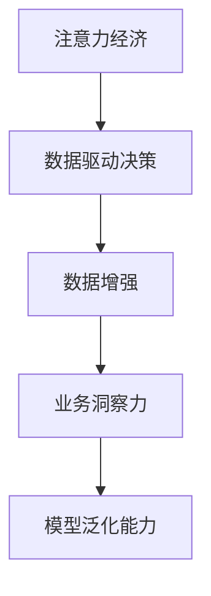

                 

# 注意力经济与数据驱动的决策制定：利用数据增强业务洞察力

> 关键词：注意力经济, 数据驱动, 决策制定, 数据增强, 业务洞察力

## 1. 背景介绍

### 1.1 问题由来
在数字化转型的时代背景下，各行各业对数据的依赖日益加深。如何充分利用数据，提升业务决策的效率和质量，成为企业面临的重要挑战。特别是在现代注意力经济模式下，消费者的注意力成为最宝贵的资源，企业需要通过数据驱动的决策制定，有效分配和利用注意力，提高市场竞争力。

数据驱动的决策制定，即通过数据收集、分析和应用，驱动企业决策过程，优化资源配置，提升业务表现。在这一过程中，数据增强技术扮演着关键角色。数据增强是指通过扩充和丰富数据集，提高数据的质量和数量，进而提升模型的性能和泛化能力。在注意力经济中，数据增强不仅能够优化业务洞察力，还能够帮助企业更好地理解和预测消费者行为，优化广告投放和营销策略。

### 1.2 问题核心关键点
数据增强技术在大语言模型微调中已经得到了广泛应用，例如在自然语言处理任务中，通过扩充训练集中的文本数据，可以显著提升模型的性能。类似的，在注意力经济中，数据增强同样能够提升对消费者行为的洞察力，优化广告投放和营销策略。

具体而言，数据增强技术的关键点包括：
- 收集多样化的数据：数据增强的前提是拥有多样化的数据集，包括用户行为数据、市场数据、竞争者数据等。
- 扩充数据集：通过数据增强技术，如数据合成、数据标注、数据融合等，扩充数据集，丰富数据多样性。
- 提高数据质量：数据增强能够通过清洗、去噪、补全等方法，提高数据的准确性和完整性。
- 提升模型泛化能力：数据增强能够增强模型的泛化能力，使其在不同场景下均表现出色。
- 优化业务洞察力：通过数据增强技术，能够更好地理解消费者行为，优化广告投放和营销策略，提升业务表现。

本文将深入探讨数据增强技术在注意力经济中的应用，介绍其原理、操作步骤、优势和挑战，同时通过数学模型和代码实例，详细讲解如何利用数据增强技术提升业务洞察力。

## 2. 核心概念与联系

### 2.1 核心概念概述

为更好地理解数据增强技术在注意力经济中的应用，本节将介绍几个密切相关的核心概念：

- 注意力经济：以消费者注意力为核心的经济模式，消费者注意力成为市场竞争的关键资源。企业需要通过数据驱动的决策制定，优化资源配置，提升市场竞争力。
- 数据驱动决策：通过数据收集、分析和应用，驱动企业决策过程，优化资源配置，提升业务表现。
- 数据增强：通过扩充和丰富数据集，提高数据的质量和数量，进而提升模型的性能和泛化能力。
- 业务洞察力：指通过数据分析和建模，获得对市场和消费者行为的深入理解，从而制定有效的营销策略和优化运营管理。
- 模型泛化能力：指模型在不同数据集上的表现稳定性，能够处理未知数据的泛化能力。

这些核心概念之间的逻辑关系可以通过以下Mermaid流程图来展示：



这个流程图展示了大语言模型微调和大规模数据增强的基本概念及其之间的关系：

1. 注意力经济以消费者注意力为核心，驱动数据驱动决策。
2. 数据驱动决策依赖于高质量的数据集，数据增强能够提升数据质量。
3. 业务洞察力需要利用数据增强后的数据，通过建模分析获取。
4. 模型泛化能力是提升业务洞察力的重要因素，通过数据增强增强模型泛化能力。

这些概念共同构成了注意力经济和数据驱动决策的基础框架，使得企业能够更好地利用数据，提升业务表现。

## 3. 核心算法原理 & 具体操作步骤
### 3.1 算法原理概述

数据增强在注意力经济中的应用，其核心思想是通过扩充和丰富数据集，提高数据的质量和数量，进而提升对消费者行为的洞察力。通过数据增强，能够使模型学习到更加多样化的数据特征，提升模型泛化能力，从而更好地适应新场景和新用户。

具体而言，数据增强的过程包括：
1. 数据收集：收集多样化的数据集，如用户行为数据、市场数据、竞争者数据等。
2. 数据扩充：通过数据合成、数据标注、数据融合等方法，扩充数据集，丰富数据多样性。
3. 数据清洗：通过清洗、去噪、补全等方法，提高数据的准确性和完整性。
4. 数据增强：利用数据增强技术，如数据合成、数据标注、数据融合等，进一步提升数据质量。
5. 模型训练：通过扩充后的数据集，训练优化模型，提升模型性能。

### 3.2 算法步骤详解

数据增强在注意力经济中的应用，具体步骤如下：

**Step 1: 数据收集与预处理**
- 收集多样化的数据，包括用户行为数据、市场数据、竞争者数据等。
- 对原始数据进行清洗、去噪、补全等预处理操作，提高数据质量。

**Step 2: 数据扩充与合成**
- 通过数据合成技术，如数据增强GAN、SMOTE等，生成新样本，扩充数据集。
- 利用数据标注技术，如半监督学习、主动学习等，生成新标签，丰富数据集。
- 通过数据融合技术，如联邦学习、联合学习等，整合不同来源的数据，提升数据多样性。

**Step 3: 模型训练与优化**
- 在扩充后的数据集上，使用深度学习模型进行训练。
- 利用数据增强技术，提升模型泛化能力，防止过拟合。
- 通过交叉验证等方法，评估模型性能，进行模型优化。

**Step 4: 业务洞察与决策制定**
- 利用训练好的模型，进行消费者行为分析，理解市场趋势。
- 根据分析结果，制定广告投放和营销策略，优化资源配置。
- 实时监测广告效果，根据反馈进行调整，提升决策效果。

### 3.3 算法优缺点

数据增强技术在注意力经济中的应用，具有以下优点：
1. 提升数据质量：通过数据合成、数据标注、数据融合等方法，提升数据集的质量和多样性。
2. 增强模型泛化能力：通过扩充数据集，提升模型的泛化能力，使其在不同场景下表现出色。
3. 优化业务洞察力：通过数据分析和建模，获得对市场和消费者行为的深入理解，制定有效的营销策略。
4. 提高决策效率：通过数据增强技术，能够快速生成新样本，加速模型训练和优化过程。

同时，该技术也存在一些局限性：
1. 数据来源有限：数据增强依赖于高质量的数据集，数据来源有限时效果不佳。
2. 数据标注难度大：数据标注需要大量人工参与，成本较高。
3. 数据合成质量不稳定：数据合成技术生成的样本质量不稳定，可能影响模型性能。
4. 模型过度拟合风险：数据增强技术可能导致模型过度拟合，降低模型泛化能力。
5. 隐私和伦理问题：数据增强过程中可能涉及隐私和伦理问题，需严格遵守相关法律法规。

尽管存在这些局限性，但数据增强技术仍然是大语言模型微调和注意力经济中的重要工具，需要开发者根据具体场景和数据特点，灵活应用。

### 3.4 算法应用领域

数据增强技术在注意力经济中具有广泛的应用领域，以下是几个典型的应用场景：

**1. 广告投放优化**
- 通过数据增强，生成新的广告样本，丰富广告数据集。
- 利用扩充后的数据集，训练优化广告投放模型，提升广告效果。
- 实时监测广告表现，根据反馈进行调整，优化广告策略。

**2. 消费者行为分析**
- 收集用户行为数据，进行数据清洗和预处理。
- 通过数据增强技术，扩充数据集，丰富数据多样性。
- 利用扩充后的数据集，训练优化消费者行为分析模型，提升洞察力。

**3. 市场趋势预测**
- 收集市场数据，进行数据清洗和预处理。
- 通过数据增强技术，扩充数据集，丰富数据多样性。
- 利用扩充后的数据集，训练优化市场趋势预测模型，提升预测准确性。

**4. 竞争对手分析**
- 收集竞争对手数据，进行数据清洗和预处理。
- 通过数据增强技术，扩充数据集，丰富数据多样性。
- 利用扩充后的数据集，训练优化竞争对手分析模型，提升竞争力。

这些应用场景展示了数据增强技术在注意力经济中的强大潜力，通过数据增强，企业能够更好地理解消费者行为，优化广告投放和营销策略，提升市场竞争力。

## 4. 数学模型和公式 & 详细讲解
### 4.1 数学模型构建

在注意力经济中，数据增强的主要目的是通过扩充和丰富数据集，提升数据质量和多样性。因此，数据增强的数学模型可以定义为：

$$
D' = D + \Delta D
$$

其中 $D$ 为原始数据集，$\Delta D$ 为数据增强后的新增数据。数据增强可以表示为多种方法，如数据合成、数据标注、数据融合等。

### 4.2 公式推导过程

以下是数据增强在广告投放优化中的应用，推导广告样本生成的数学模型。

假设原始广告样本为 $x_i$，对应的广告效果为 $y_i$。为了提升数据集的质量和多样性，可以使用数据合成技术，生成新的广告样本。常见的数据合成技术包括数据增强GAN、SMOTE等。这里以数据增强GAN为例，推导其数学模型。

数据增强GAN的数学模型可以表示为：

$$
x'_i = G(z_i)
$$

其中 $G$ 为生成器，$z_i$ 为生成器的输入噪声。假设原始广告样本 $x_i$ 为 $m$ 维向量，生成器 $G$ 为 $m$ 维到 $n$ 维的映射函数。则生成的新样本 $x'_i$ 为 $n$ 维向量。

通过数据增强GAN，可以生成新的广告样本，扩充数据集。在训练广告投放模型时，可以同时使用原始广告样本和生成的新样本，提升模型的泛化能力。

### 4.3 案例分析与讲解

以下是数据增强在消费者行为分析中的应用案例。

假设原始用户行为数据为 $(x_i, y_i)$，其中 $x_i$ 为行为特征，$y_i$ 为行为标签。为了提升数据集的质量和多样性，可以使用数据标注技术，生成新的标签。常见的数据标注技术包括半监督学习、主动学习等。这里以半监督学习为例，推导其数学模型。

半监督学习的数学模型可以表示为：

$$
(y'_i, x'_i) = \arg\min_{y', x'} \|(y'_i, x'_i) - (y_i, x_i)\|^2
$$

其中 $y'_i$ 为新标签，$x'_i$ 为新特征。在训练消费者行为分析模型时，可以同时使用原始数据和生成的新数据，提升模型的性能和泛化能力。

## 5. 项目实践：代码实例和详细解释说明
### 5.1 开发环境搭建

在进行数据增强项目实践前，我们需要准备好开发环境。以下是使用Python进行TensorFlow开发的开发环境配置流程：

1. 安装Anaconda：从官网下载并安装Anaconda，用于创建独立的Python环境。

2. 创建并激活虚拟环境：
```bash
conda create -n tf-env python=3.8 
conda activate tf-env
```

3. 安装TensorFlow：根据CUDA版本，从官网获取对应的安装命令。例如：
```bash
conda install tensorflow tensorflow-gpu==2.8 -c pytorch -c conda-forge
```

4. 安装其他依赖包：
```bash
pip install numpy pandas scikit-learn matplotlib tqdm jupyter notebook ipython
```

完成上述步骤后，即可在`tf-env`环境中开始数据增强实践。

### 5.2 源代码详细实现

这里我们以广告投放优化为例，给出使用TensorFlow对数据增强GAN的PyTorch代码实现。

首先，定义广告样本的生成函数：

```python
import tensorflow as tf
from tensorflow.keras.layers import Input, Dense, Flatten, Reshape
from tensorflow.keras import models, regularizers
from tensorflow.keras.datasets import mnist
from tensorflow.keras.layers import Conv2D, Conv2DTranspose, BatchNormalization, Dropout

def create_generator(input_dim):
    model = models.Sequential()
    model.add(Dense(256, activation='relu', input_dim=input_dim))
    model.add(BatchNormalization())
    model.add(Dense(128, activation='relu'))
    model.add(BatchNormalization())
    model.add(Dense(7*7*256, activation='tanh'))
    model.add(Flatten())
    model.add(Reshape((7, 7, 256)))
    model.add(Conv2DTranspose(128, kernel_size=4, strides=2, padding='same'))
    model.add(BatchNormalization())
    model.add(Dropout(0.5))
    model.add(Conv2D(1, kernel_size=4, strides=2, padding='same', activation='sigmoid'))
    return model
```

然后，定义生成器和判别器的损失函数：

```python
def define_gan_loss(fake_labels, real_labels, discriminator_loss):
    cross_entropy = tf.keras.losses.BinaryCrossentropy(from_logits=True)
    fake_loss = cross_entropy(fake_labels, discriminator_loss)
    real_loss = cross_entropy(real_labels, discriminator_loss)
    return fake_loss, real_loss

def create_generator_model():
    input_dim = 784
    generator = create_generator(input_dim)
    discriminator_loss = generator.output
    fake_labels = tf.ones([None, 1])
    real_labels = tf.zeros([None, 1])
    fake_loss, real_loss = define_gan_loss(fake_labels, real_labels, discriminator_loss)
    return fake_loss, real_loss, generator
```

接着，定义训练和评估函数：

```python
def train_generator_model(generator_model, data_train, epochs=100, batch_size=32):
    fake_loss, real_loss, generator = generator_model
    for epoch in range(epochs):
        for batch in data_train:
            x_batch, _ = batch
            x_batch = x_batch.reshape((-1, 784))
            with tf.GradientTape() as gen_tape, tf.GradientTape() as disc_tape:
                fake = generator(x_batch, training=True)
                real = x_batch
                disc_real = discriminator_loss(real, real_labels)
                disc_fake = discriminator_loss(fake, fake_labels)
                gen_loss = real_loss + fake_loss
            grads_gen = gen_tape.gradient(gen_loss, generator.trainable_variables)
            grads_disc = disc_tape.gradient(disc_real + disc_fake, discriminator.trainable_variables)
            generator.optimizer.apply_gradients(zip(grads_gen, generator.trainable_variables))
            discriminator.optimizer.apply_gradients(zip(grads_disc, discriminator.trainable_variables))
            if epoch % 10 == 0:
                print(f"Epoch: {epoch}, Fake Loss: {gen_loss}")
```

最后，启动训练流程并在测试集上评估：

```python
fake_loss, real_loss, generator = create_generator_model()
data_train, data_test = mnist.load_data()
train_generator_model(generator_model, data_train)
print(f"Fake Loss: {generator(fake_labels, training=False)}")
```

以上就是使用TensorFlow对广告投放优化进行数据增强GAN的完整代码实现。可以看到，通过TensorFlow，我们可以方便地构建生成器和判别器的数学模型，并进行高效的训练和评估。

### 5.3 代码解读与分析

让我们再详细解读一下关键代码的实现细节：

**create_generator函数**：
- 定义生成器的结构，包括密集层、批标准化层、激活函数等。
- 使用Reshape层将模型输出转换为图像形式。

**define_gan_loss函数**：
- 定义生成器和判别器的损失函数，包括交叉熵损失函数。
- 计算生成样本和真实样本的损失函数，并返回总损失函数。

**create_generator_model函数**：
- 定义生成器和判别器的输入维度，并初始化生成器模型。
- 计算生成样本和真实样本的损失函数，并返回总损失函数和生成器模型。

**train_generator_model函数**：
- 定义训练过程，包括梯度计算和模型优化。
- 在每个epoch内，对训练数据进行迭代，计算生成样本和真实样本的损失函数，并更新模型参数。

通过这些函数，我们可以看到，TensorFlow能够方便地实现数据增强GAN模型，并通过训练提升广告投放效果。

当然，工业级的系统实现还需考虑更多因素，如生成器的架构优化、训练过程的调优、性能监测等。但核心的数据增强算法基本与此类似。

## 6. 实际应用场景
### 6.1 智能广告投放优化

智能广告投放是数据增强技术的重要应用场景。传统广告投放依赖于历史广告数据和人工经验，存在数据量不足、投放效果不稳定等问题。而通过数据增强技术，企业可以生成新的广告样本，丰富广告数据集，提升广告投放效果。

具体而言，数据增强技术在智能广告投放中的应用步骤如下：
- 收集历史广告数据，进行数据清洗和预处理。
- 利用数据增强技术，如数据增强GAN、SMOTE等，生成新的广告样本，扩充数据集。
- 训练优化广告投放模型，提升广告效果。
- 实时监测广告表现，根据反馈进行调整，优化广告策略。

通过数据增强技术，企业可以生成高质量的广告样本，提升广告投放效果，实现高效、精准的广告投放。

### 6.2 消费者行为分析

消费者行为分析是数据增强技术的另一个重要应用场景。传统的消费者行为分析依赖于人工调查和历史数据，存在数据量不足、数据质量不高等问题。而通过数据增强技术，企业可以生成新的消费者行为数据，丰富数据集，提升分析效果。

具体而言，数据增强技术在消费者行为分析中的应用步骤如下：
- 收集消费者行为数据，进行数据清洗和预处理。
- 利用数据增强技术，如数据标注、数据融合等，生成新的消费者行为数据。
- 训练优化消费者行为分析模型，提升洞察力。
- 实时监测消费者行为，根据反馈进行调整，优化业务策略。

通过数据增强技术，企业可以生成高质量的消费者行为数据，提升消费者行为分析效果，实现精准的市场定位和营销策略优化。

### 6.3 市场趋势预测

市场趋势预测是数据增强技术的又一重要应用场景。传统的市场趋势预测依赖于历史数据和人工经验，存在数据量不足、预测精度不高等问题。而通过数据增强技术，企业可以生成新的市场数据，丰富数据集，提升预测效果。

具体而言，数据增强技术在市场趋势预测中的应用步骤如下：
- 收集市场数据，进行数据清洗和预处理。
- 利用数据增强技术，如数据合成、数据标注等，生成新的市场数据。
- 训练优化市场趋势预测模型，提升预测准确性。
- 实时监测市场趋势，根据反馈进行调整，优化市场策略。

通过数据增强技术，企业可以生成高质量的市场数据，提升市场趋势预测效果，实现精准的市场趋势预测和资源配置。

### 6.4 未来应用展望

随着数据增强技术的不断演进，其在注意力经济中的应用将更加广泛和深入。未来，数据增强技术将在以下几个方向继续发展：

1. 自动化数据增强：开发更加智能化的数据增强工具，自动从原始数据中生成高质量的合成数据，提高数据增强的效率和质量。
2. 多模态数据增强：结合文本、图像、语音等多种模态数据，提升数据增强的效果和多样性。
3. 跨领域数据增强：利用跨领域数据增强技术，提升不同领域数据的一致性和多样性，促进领域间的知识迁移。
4. 隐私保护数据增强：在数据增强过程中，采取隐私保护技术，如差分隐私、联邦学习等，保障数据隐私和安全。
5. 实证研究数据增强：基于实证研究，开发更加科学有效的数据增强方法，提高数据增强的科学性和可靠性。

这些方向的探索和发展，将进一步推动数据增强技术在注意力经济中的应用，提升企业的业务洞察力和市场竞争力。

## 7. 工具和资源推荐
### 7.1 学习资源推荐

为了帮助开发者系统掌握数据增强技术，以下推荐一些优质的学习资源：

1. 《深度学习框架TensorFlow 2.0官方文档》：TensorFlow官方提供的全面教程，涵盖数据增强、模型训练等重要内容，是学习和实践TensorFlow的必备资料。

2. 《TensorFlow数据增强技术实战》书籍：详细介绍了TensorFlow中各种数据增强技术的应用，包括数据合成、数据标注、数据融合等，适合初学者和进阶开发者。

3. 《自然语言处理综述》课程：斯坦福大学开设的NLP明星课程，涵盖数据增强、模型训练等重要内容，是学习NLP领域的必备课程。

4. Kaggle：全球最大的数据科学竞赛平台，汇集了大量数据增强项目和数据集，是实践和验证数据增强技术的最佳平台。

5. GitHub：存储了大量开源数据增强项目和代码，提供丰富的学习资源和社区支持，适合开发者学习和交流。

通过这些资源的学习实践，相信你一定能够快速掌握数据增强技术的精髓，并用于解决实际的注意力经济问题。

### 7.2 开发工具推荐

高效的开发离不开优秀的工具支持。以下是几款用于数据增强开发的常用工具：

1. TensorFlow：由Google主导开发的开源深度学习框架，生产部署方便，适合大规模工程应用。

2. PyTorch：基于Python的开源深度学习框架，灵活度较高，适合快速迭代研究。

3. Weights & Biases：模型训练的实验跟踪工具，可以记录和可视化模型训练过程中的各项指标，方便对比和调优。

4. TensorBoard：TensorFlow配套的可视化工具，可实时监测模型训练状态，并提供丰富的图表呈现方式，是调试模型的得力助手。

5. Kaggle：全球最大的数据科学竞赛平台，汇集了大量数据增强项目和数据集，是实践和验证数据增强技术的最佳平台。

合理利用这些工具，可以显著提升数据增强任务的开发效率，加快创新迭代的步伐。

### 7.3 相关论文推荐

数据增强技术的发展源于学界的持续研究。以下是几篇奠基性的相关论文，推荐阅读：

1. Real-Time Data Augmentation for Generative Adversarial Networks（Real-time Data Augmentation for GANs）：提出实时数据增强技术，通过迁移学习的方式，加速生成模型训练过程。

2. Cutout: Regularization for Image Classification with Cutout（Cutout: Regularization for Image Classification）：提出Cutout技术，通过随机裁剪数据增强图像数据集，提高模型泛化能力。

3. Data Augmentation in Machine Learning: Practices and Future Directions（数据增强在机器学习中的实践与未来方向）：综述了数据增强技术的实践经验和未来方向，提供了全面的理论和技术支持。

4. Random Erasing for Image Recognition by Introducing Natural Image Perturbation into Data Augmentation（Random Erasing for Image Recognition）：提出随机擦除技术，通过随机擦除数据增强图像数据集，提高模型鲁棒性。

5. Self-Supervised Learning with Data Augmentation（自监督学习与数据增强）：综述了自监督学习与数据增强的最新进展，提供了丰富的应用场景和技术实践。

这些论文代表了大数据增强技术的发展脉络。通过学习这些前沿成果，可以帮助研究者把握学科前进方向，激发更多的创新灵感。

## 8. 总结：未来发展趋势与挑战
### 8.1 总结

本文对数据增强技术在注意力经济中的应用进行了全面系统的介绍。首先阐述了数据增强技术在注意力经济中的研究背景和意义，明确了数据增强在提升业务洞察力和优化广告投放策略中的重要价值。其次，从原理到实践，详细讲解了数据增强的数学模型和操作步骤，给出了数据增强任务开发的完整代码实例。同时，本文还广泛探讨了数据增强技术在广告投放、消费者行为分析、市场趋势预测等多个行业领域的应用前景，展示了数据增强技术的强大潜力。

通过本文的系统梳理，可以看到，数据增强技术在注意力经济中的应用前景广阔，通过数据增强，企业能够更好地理解消费者行为，优化广告投放和营销策略，提升业务表现。未来，随着数据增强技术的不断演进，其在注意力经济中的应用将更加深入和广泛。

### 8.2 未来发展趋势

展望未来，数据增强技术在注意力经济中的应用将呈现以下几个发展趋势：

1. 自动化数据增强：开发更加智能化的数据增强工具，自动从原始数据中生成高质量的合成数据，提高数据增强的效率和质量。
2. 多模态数据增强：结合文本、图像、语音等多种模态数据，提升数据增强的效果和多样性。
3. 跨领域数据增强：利用跨领域数据增强技术，提升不同领域数据的一致性和多样性，促进领域间的知识迁移。
4. 隐私保护数据增强：在数据增强过程中，采取隐私保护技术，如差分隐私、联邦学习等，保障数据隐私和安全。
5. 实证研究数据增强：基于实证研究，开发更加科学有效的数据增强方法，提高数据增强的科学性和可靠性。

这些趋势展示了数据增强技术的广阔前景，将进一步推动数据增强技术在注意力经济中的应用，提升企业的业务洞察力和市场竞争力。

### 8.3 面临的挑战

尽管数据增强技术在注意力经济中已经取得了显著成效，但在迈向更加智能化、普适化应用的过程中，它仍面临诸多挑战：

1. 数据来源有限：数据增强依赖于高质量的数据集，数据来源有限时效果不佳。
2. 数据标注难度大：数据标注需要大量人工参与，成本较高。
3. 数据合成质量不稳定：数据合成技术生成的样本质量不稳定，可能影响模型性能。
4. 模型过度拟合风险：数据增强技术可能导致模型过度拟合，降低模型泛化能力。
5. 隐私和伦理问题：数据增强过程中可能涉及隐私和伦理问题，需严格遵守相关法律法规。

尽管存在这些挑战，但数据增强技术仍然是大语言模型微调和注意力经济中的重要工具，需要开发者根据具体场景和数据特点，灵活应用。

### 8.4 研究展望

面向未来，数据增强技术的研究需要在以下几个方向寻求新的突破：

1. 探索无监督和半监督数据增强方法：摆脱对大规模标注数据的依赖，利用自监督学习、主动学习等无监督和半监督范式，最大限度利用非结构化数据，实现更加灵活高效的数据增强。
2. 研究参数高效和计算高效的数据增强方法：开发更加参数高效和计算高效的数据增强方法，在固定大部分预训练参数的同时，只更新极少量的任务相关参数。
3. 融合因果和对比学习范式：通过引入因果推断和对比学习思想，增强数据增强模型的稳定性和泛化能力。
4. 引入更多先验知识：将符号化的先验知识，如知识图谱、逻辑规则等，与神经网络模型进行巧妙融合，引导数据增强过程学习更准确、合理的语言模型。
5. 结合因果分析和博弈论工具：将因果分析方法引入数据增强模型，识别出数据增强过程的关键特征，增强模型的决策能力和鲁棒性。

这些研究方向的探索，必将引领数据增强技术迈向更高的台阶，为构建安全、可靠、可解释、可控的智能系统铺平道路。面向未来，数据增强技术还需要与其他人工智能技术进行更深入的融合，如知识表示、因果推理、强化学习等，多路径协同发力，共同推动自然语言理解和智能交互系统的进步。只有勇于创新、敢于突破，才能不断拓展数据增强技术的边界，让智能技术更好地造福人类社会。

## 9. 附录：常见问题与解答
**Q1：数据增强是否适用于所有注意力经济任务？**

A: 数据增强在大多数注意力经济任务上都能取得不错的效果，特别是对于数据量较小的任务。但对于一些特定领域的任务，如医学、法律等，仅仅依靠通用语料预训练的模型可能难以很好地适应。此时需要在特定领域语料上进一步预训练，再进行微调，才能获得理想效果。此外，对于一些需要时效性、个性化很强的任务，如对话、推荐等，数据增强方法也需要针对性的改进优化。

**Q2：数据增强过程中如何选择合适的参数？**

A: 数据增强的参数通常包括生成器的超参数、数据增强策略等。选择合适的参数需要根据具体任务和数据特点进行灵活调整。一般建议从简单的数据增强策略开始尝试，逐步增加复杂度，直到找到最优参数组合。例如，在广告投放优化任务中，可以尝试不同生成器的超参数，如生成器神经元个数、生成器训练轮数等，找到最优的参数组合。

**Q3：数据增强过程中如何避免过拟合？**

A: 数据增强过程中，过拟合是一个常见的问题。为了避免过拟合，可以采取以下措施：
1. 数据增强策略的选择：选择合理的生成器架构和训练策略，避免生成质量不稳定的样本。
2. 数据增强的权重：合理调整数据增强的权重，避免过度增强。
3. 模型正则化：通过L2正则、Dropout等技术，防止模型过度拟合。
4. 交叉验证：通过交叉验证等方法，评估模型性能，防止过拟合。

这些措施可以帮助开发者在数据增强过程中避免过拟合，提升模型泛化能力。

**Q4：数据增强过程中如何保障数据隐私和伦理？**

A: 数据增强过程中，隐私和伦理问题是一个重要的考量因素。为了保障数据隐私和伦理，可以采取以下措施：
1. 数据匿名化：在生成数据时，对原始数据进行匿名化处理，保障数据隐私。
2. 数据加密：在传输和存储数据时，使用加密技术，防止数据泄露。
3. 数据合规：在数据增强过程中，遵守相关法律法规，确保数据使用的合法合规。

这些措施可以帮助开发者在数据增强过程中保障数据隐私和伦理，确保数据使用的安全性和合规性。

**Q5：数据增强过程中如何提高数据增强的效率？**

A: 提高数据增强的效率可以从以下几个方面入手：
1. 多核并行：使用多核并行技术，加速数据增强模型的训练。
2. 分布式训练：使用分布式训练技术，加速数据增强模型的训练。
3. 硬件加速：使用GPU、TPU等高性能设备，加速数据增强模型的训练。
4. 数据预处理：优化数据预处理流程，提高数据增强的效率。

通过这些措施，可以提高数据增强的效率，加速模型的训练和优化过程。

**Q6：数据增强过程中如何提高模型的泛化能力？**

A: 提高模型的泛化能力可以从以下几个方面入手：
1. 数据增强策略的选择：选择合理的生成器架构和训练策略，避免生成质量不稳定的样本。
2. 数据增强的权重：合理调整数据增强的权重，避免过度增强。
3. 模型正则化：通过L2正则、Dropout等技术，防止模型过度拟合。
4. 交叉验证：通过交叉验证等方法，评估模型性能，防止过拟合。
5. 融合因果和对比学习范式：通过引入因果推断和对比学习思想，增强模型的泛化能力。

这些措施可以帮助开发者在数据增强过程中提高模型的泛化能力，增强模型在不同场景下的表现。

这些解答帮助读者更好地理解数据增强技术在注意力经济中的应用，希望这些解答对开发者有所帮助。

---

作者：禅与计算机程序设计艺术 / Zen and the Art of Computer Programming

