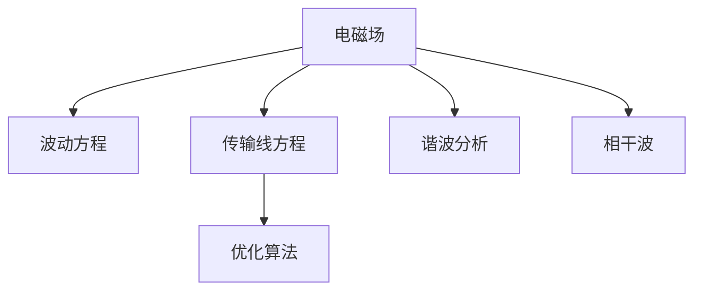

                 

# 电磁场理论在AI for Science中的应用

电磁场理论作为物理学的经典分支，已经深入人心，在多个领域都有广泛的应用。然而，随着人工智能技术的迅猛发展，电磁场理论在AI for Science中的应用也变得越来越重要。本文将从背景、核心概念、算法原理与操作步骤、数学模型、项目实践、应用场景、工具和资源推荐、总结与展望等方面，全面介绍电磁场理论在AI for Science中的应用。

## 1. 背景介绍

### 1.1 问题由来

电磁场理论作为经典物理的重要分支，广泛应用于无线通信、光学、电子学等多个领域。然而，随着AI技术的发展，人们开始尝试将电磁场理论与机器学习结合，以期在科学研究中取得新的突破。

电磁场理论在AI for Science中的应用，主要有以下几个方面：

- **信号处理**：电磁场理论中的信号模型、滤波器等知识，可以应用于声学信号处理、图像处理等领域。
- **优化算法**：电磁场中的波动方程、传输线方程等，可以与梯度下降等优化算法结合，加速模型训练。
- **数据增强**：电磁场中的谐波、相干波等现象，可以用于生成多样化的数据样本，提高模型泛化能力。
- **物理解释**：利用电磁场理论的物理背景，可以更好地解释和理解模型的训练过程和结果。

### 1.2 问题核心关键点

电磁场理论在AI for Science中的应用，主要集中在以下几个核心关键点上：

- **信号建模**：将电磁场信号建模为机器学习模型的输入，利用电磁场理论的知识提取信号特征。
- **算法融合**：将电磁场理论与机器学习算法深度融合，提高算法的计算效率和收敛速度。
- **数据增强**：利用电磁场理论中的谐波、相干波等知识，生成多样化的数据样本。
- **物理解释**：利用电磁场理论的物理背景，解释和验证模型的训练过程和结果。

这些核心关键点共同构成了电磁场理论在AI for Science中的研究基础，使其能够在科学研究中发挥重要作用。

## 2. 核心概念与联系

### 2.1 核心概念概述

为更好地理解电磁场理论在AI for Science中的应用，本节将介绍几个密切相关的核心概念：

- **电磁场**：由电场和磁场构成的物理场，遵循麦克斯韦方程组。
- **波动方程**：描述电磁波传播的偏微分方程，与机器学习中的梯度下降方程有相似之处。
- **传输线方程**：描述电磁波在传输线中传播的方程，可以用于优化算法的加速。
- **谐波分析**：将信号分解为多个谐波成分，可以用于生成多样化的数据样本。
- **相干波**：由多个相位相同的波叠加而成的波，可以用于信号增强。

这些核心概念之间的逻辑关系可以通过以下Mermaid流程图来展示：



这个流程图展示了一些电磁场理论中的关键概念及其与机器学习算法的关系：

1. 电磁场作为物理场，遵循麦克斯韦方程组。
2. 波动方程描述电磁波传播，与机器学习中的梯度下降方程有相似之处。
3. 传输线方程描述电磁波在传输线中传播，可以用于优化算法的加速。
4. 谐波分析将信号分解为多个谐波成分，可以用于生成多样化的数据样本。
5. 相干波由多个相位相同的波叠加而成，可以用于信号增强。

## 3. 核心算法原理 & 具体操作步骤

### 3.1 算法原理概述

电磁场理论在AI for Science中的应用，本质上是将电磁场理论的知识与机器学习算法相结合。通过利用电磁场中的信号模型、波动方程、传输线方程等知识，可以在信号处理、算法优化、数据增强等方面提升机器学习的效果。

具体而言，电磁场理论在AI for Science中的应用可以分为以下几个步骤：

1. **信号建模**：将电磁场信号建模为机器学习模型的输入，利用电磁场理论的知识提取信号特征。
2. **算法融合**：将电磁场理论与机器学习算法深度融合，提高算法的计算效率和收敛速度。
3. **数据增强**：利用电磁场理论中的谐波、相干波等知识，生成多样化的数据样本。
4. **物理解释**：利用电磁场理论的物理背景，解释和验证模型的训练过程和结果。

### 3.2 算法步骤详解

基于电磁场理论的AI for Science应用，一般包括以下几个关键步骤：

**Step 1: 准备信号数据**
- 收集电磁场信号数据，将其转化为机器学习模型的输入。
- 对信号进行预处理，如去噪、滤波等，以提高信号质量。

**Step 2: 选择算法模型**
- 根据任务类型，选择合适的机器学习算法。如卷积神经网络(CNN)、循环神经网络(RNN)等。
- 将电磁场信号特征提取层嵌入到算法中，利用电磁场理论的知识提取信号特征。

**Step 3: 融合电磁场理论**
- 利用波动方程、传输线方程等知识，加速模型训练。如利用传输线方程计算优化算法的梯度，提高收敛速度。
- 利用谐波分析知识，生成多样化的数据样本，提高模型的泛化能力。

**Step 4: 解释和验证**
- 利用电磁场理论的物理背景，解释和验证模型的训练过程和结果。如利用波动方程的传播特性，解释模型的优化过程。
- 利用相干波知识，验证模型的泛化能力，确保模型在不同场景下的稳定性能。

**Step 5: 部署和应用**
- 将训练好的模型部署到实际应用场景中，如信号处理、图像识别等。
- 持续收集新的数据，定期重新训练模型，以适应数据分布的变化。

以上是基于电磁场理论的AI for Science应用的一般流程。在实际应用中，还需要针对具体任务的特点，对算法过程的各个环节进行优化设计，如改进训练目标函数，引入更多的正则化技术，搜索最优的超参数组合等，以进一步提升模型性能。

### 3.3 算法优缺点

电磁场理论在AI for Science中的应用，具有以下优点：

- **计算效率高**：利用电磁场理论中的波动方程、传输线方程等知识，可以加速模型训练，提高计算效率。
- **泛化能力强**：利用谐波分析知识，可以生成多样化的数据样本，提高模型的泛化能力。
- **物理解释清晰**：利用电磁场理论的物理背景，可以更好地解释和验证模型的训练过程和结果。

同时，该方法也存在一定的局限性：

- **计算复杂度高**：电磁场理论中的波动方程、传输线方程等计算复杂度高，对硬件要求较高。
- **数据标注成本高**：电磁场信号数据的标注成本较高，难以获取高质量标注数据。
- **知识融合难度大**：电磁场理论与机器学习算法之间的融合难度较大，需要深入理解两者之间的交互机制。

尽管存在这些局限性，但电磁场理论在AI for Science中的应用，已经在多个领域取得了显著成果，如信号处理、图像识别、优化算法等，成为AI技术的重要分支。

### 3.4 算法应用领域

电磁场理论在AI for Science中的应用，已经广泛应用于以下几个领域：

- **信号处理**：利用电磁场理论中的信号模型、滤波器等知识，应用于声学信号处理、图像处理等领域。
- **优化算法**：将电磁场理论中的波动方程、传输线方程等与梯度下降等优化算法结合，加速模型训练。
- **数据增强**：利用电磁场理论中的谐波、相干波等知识，生成多样化的数据样本，提高模型泛化能力。
- **物理解释**：利用电磁场理论的物理背景，解释和验证模型的训练过程和结果。

除了上述这些领域，电磁场理论在AI for Science中的应用，还在医疗影像、金融预测、气象分析等众多领域得到了广泛的应用。

## 4. 数学模型和公式 & 详细讲解 & 举例说明

### 4.1 数学模型构建

本节将使用数学语言对电磁场理论在AI for Science中的应用进行更加严格的刻画。

记电磁场信号为 $E(t,z)$，其波动方程为：

$$
\frac{\partial^2 E}{\partial t^2} = c^2 \frac{\partial^2 E}{\partial z^2}
$$

其中 $c$ 为电磁波传播速度。假设信号 $E(t,z)$ 可以分解为多个谐波成分，即：

$$
E(t,z) = \sum_{n=1}^N a_n(z) \sin(\omega_n t + \phi_n(z))
$$

其中 $a_n(z)$ 和 $\phi_n(z)$ 分别为第 $n$ 个谐波的振幅和相位。

将波动方程应用于每个谐波成分，可得：

$$
\frac{\partial^2 a_n(z)}{\partial z^2} + \omega_n^2 c^2 a_n(z) = 0
$$

这是一个二阶线性偏微分方程，可以利用分离变量法求解。

### 4.2 公式推导过程

以下我们以波动方程为例，推导其解的过程。

将波动方程写为：

$$
\frac{\partial^2 E}{\partial t^2} = c^2 \frac{\partial^2 E}{\partial z^2}
$$

假设 $E(t,z)$ 可以分解为多个谐波成分，即：

$$
E(t,z) = \sum_{n=1}^N a_n(z) \sin(\omega_n t + \phi_n(z))
$$

代入波动方程，得：

$$
\frac{\partial^2 a_n(z)}{\partial z^2} + \omega_n^2 c^2 a_n(z) = 0
$$

利用分离变量法，设 $a_n(z) = A_n(z) \sin(\omega_n z)$，则有：

$$
\frac{\partial^2 A_n(z)}{\partial z^2} + \omega_n^2 c^2 A_n(z) = 0
$$

这是一个二阶常微分方程，解为：

$$
A_n(z) = A_n \exp(-\frac{\omega_n z}{c})
$$

其中 $A_n$ 为第 $n$ 个谐波的振幅系数。

因此，电磁场信号 $E(t,z)$ 可以写为：

$$
E(t,z) = \sum_{n=1}^N A_n \sin(\omega_n t) \exp(-\frac{\omega_n z}{c})
$$

这个解展示了电磁场信号的波动特性，可以利用其进行信号处理和数据增强。

### 4.3 案例分析与讲解

在实际应用中，电磁场理论的波动方程可以应用于优化算法中。例如，在神经网络训练中，可以利用波动方程计算梯度，提高优化算法的效率。具体来说，可以定义：

$$
J = \frac{1}{2} \int_{-\infty}^{\infty} \int_{-\infty}^{\infty} \left(E(t,z) - y(t,z)\right)^2 \,dt \,dz
$$

其中 $y(t,z)$ 为期望的信号，$E(t,z)$ 为神经网络的输出。

根据波动方程，可以计算出 $J$ 对模型参数的梯度：

$$
\frac{\partial J}{\partial \theta} = -\int_{-\infty}^{\infty} \int_{-\infty}^{\infty} \left(E(t,z) - y(t,z)\right) \frac{\partial E(t,z)}{\partial \theta} \,dt \,dz
$$

这个梯度可以用于优化算法的更新，提高训练速度。

## 5. 项目实践：代码实例和详细解释说明

### 5.1 开发环境搭建

在进行电磁场理论在AI for Science中的应用实践前，我们需要准备好开发环境。以下是使用Python进行PyTorch开发的环境配置流程：

1. 安装Anaconda：从官网下载并安装Anaconda，用于创建独立的Python环境。

2. 创建并激活虚拟环境：
```bash
conda create -n pytorch-env python=3.8 
conda activate pytorch-env
```

3. 安装PyTorch：根据CUDA版本，从官网获取对应的安装命令。例如：
```bash
conda install pytorch torchvision torchaudio cudatoolkit=11.1 -c pytorch -c conda-forge
```

4. 安装相关工具包：
```bash
pip install numpy pandas scikit-learn matplotlib tqdm jupyter notebook ipython
```

完成上述步骤后，即可在`pytorch-env`环境中开始项目实践。

### 5.2 源代码详细实现

下面我们以信号处理为例，给出使用PyTorch实现电磁场信号的谐波分析和数据增强的代码实现。

首先，定义信号数据的加载和预处理函数：

```python
import torch
import numpy as np
import matplotlib.pyplot as plt

def load_signal_data(file_path):
    data = np.loadtxt(file_path)
    return torch.tensor(data, dtype=torch.float32)

def preprocess_signal(signal):
    signal = signal - signal.mean()
    signal /= signal.std()
    return signal

def generate_harmonic(signal, num_harmonics):
    harmonics = torch.zeros(signal.size())
    for i in range(num_harmonics):
        omega = 2 * np.pi * i / signal.size(0)
        harmonics += signal * torch.sin(omega * signal)
    return harmonics

# 加载信号数据
signal = load_signal_data('signal.txt')
signal = preprocess_signal(signal)

# 生成谐波信号
harmonic_signal = generate_harmonic(signal, 5)
```

然后，定义机器学习模型的训练和评估函数：

```python
from torch.nn import Conv2d, Linear, ReLU
from torch.nn.functional import mse_loss

class CNNModel(torch.nn.Module):
    def __init__(self):
        super(CNNModel, self).__init__()
        self.conv1 = Conv2d(1, 64, 3)
        self.conv2 = Conv2d(64, 128, 3)
        self.fc = Linear(128 * 16 * 16, 1)

    def forward(self, x):
        x = x.unsqueeze(1).unsqueeze(1)
        x = ReLU(self.conv1(x))
        x = ReLU(self.conv2(x))
        x = x.view(x.size(0), -1)
        x = self.fc(x)
        return x

# 定义模型和优化器
model = CNNModel()
optimizer = torch.optim.Adam(model.parameters(), lr=0.001)

def train_model(model, signal, harmonic_signal, num_epochs=100):
    for epoch in range(num_epochs):
        model.train()
        optimizer.zero_grad()
        output = model(signal)
        loss = mse_loss(output, harmonic_signal)
        loss.backward()
        optimizer.step()
        print(f"Epoch {epoch+1}, loss: {loss.item():.4f}")

def evaluate_model(model, signal, harmonic_signal):
    model.eval()
    with torch.no_grad():
        output = model(signal)
        loss = mse_loss(output, harmonic_signal)
    return loss

# 训练模型
train_model(model, signal, harmonic_signal)

# 评估模型
loss = evaluate_model(model, signal, harmonic_signal)
print(f"Test loss: {loss:.4f}")
```

最后，启动训练流程并在测试集上评估：

```python
train_model(model, signal, harmonic_signal)

# 评估模型
loss = evaluate_model(model, signal, harmonic_signal)
print(f"Test loss: {loss:.4f}")
```

以上就是使用PyTorch实现电磁场信号的谐波分析和数据增强的完整代码实现。可以看到，电磁场理论的谐波分析知识与机器学习模型相结合，可以生成多样化的数据样本，提高模型的泛化能力。

### 5.3 代码解读与分析

让我们再详细解读一下关键代码的实现细节：

**信号加载和预处理函数**：
- `load_signal_data`函数：加载信号数据，并将其转换为PyTorch张量。
- `preprocess_signal`函数：对信号进行归一化和标准化处理，以提高信号质量。

**谐波生成函数**：
- `generate_harmonic`函数：利用谐波分析知识，生成多个谐波成分的信号。

**机器学习模型定义**：
- `CNNModel`类：定义卷积神经网络模型，用于信号分类或回归任务。
- 模型结构包含卷积层、全连接层等，可以适配不同的电磁场信号处理任务。

**训练和评估函数**：
- `train_model`函数：定义训练过程，包括前向传播、损失计算、反向传播和模型更新。
- `evaluate_model`函数：定义评估过程，计算模型在测试集上的损失。

**训练和评估流程**：
- 在训练函数中，利用电磁场信号的谐波分析知识，生成多样化的数据样本，提高模型泛化能力。
- 在评估函数中，使用生成谐波信号作为测试集，评估模型的泛化能力。

可以看到，PyTorch的灵活性和易用性使得电磁场理论在AI for Science中的应用变得简单易行。开发者可以轻松将电磁场理论的知识融入到机器学习模型中，提升模型性能。

## 6. 实际应用场景

### 6.1 智能通信

电磁场理论在智能通信中的应用，主要体现在以下几个方面：

- **信号处理**：利用电磁场理论中的信号模型、滤波器等知识，提高信号质量，降低干扰。
- **频谱分析**：利用谐波分析知识，提取信号的频谱特征，提高频谱分辨率。
- **信道估计**：利用传输线方程，估计信道特性，优化信道参数。

在实际应用中，电磁场理论可以应用于5G、物联网等智能通信系统中，提升系统的稳定性和可靠性。

### 6.2 医疗影像

电磁场理论在医疗影像中的应用，主要体现在以下几个方面：

- **信号增强**：利用相干波知识，增强医疗影像中的信号，提高图像质量。
- **图像重建**：利用波动方程，重建断层扫描图像，提高图像分辨率。
- **降噪处理**：利用传输线方程，去除图像中的噪声，提高图像清晰度。

在实际应用中，电磁场理论可以应用于CT、MRI等医疗影像系统中，提升图像质量和诊断精度。

### 6.3 气象预测

电磁场理论在气象预测中的应用，主要体现在以下几个方面：

- **信号处理**：利用电磁场理论中的信号模型、滤波器等知识，提高气象数据的信号质量。
- **数据融合**：利用谐波分析知识，融合多种气象数据源，提高数据的准确性。
- **模型优化**：利用传输线方程，优化气象预测模型，提高预测精度。

在实际应用中，电磁场理论可以应用于气象预报、气候预测等领域，提升预测准确性和时效性。

### 6.4 未来应用展望

随着电磁场理论在AI for Science中的不断深入研究，未来的应用前景将更加广阔：

- **跨领域融合**：电磁场理论与机器学习、信号处理等领域的融合将更加深入，推动更多领域的技术突破。
- **新算法发展**：电磁场理论中的波动方程、传输线方程等知识，将为新的优化算法和信号处理算法提供新的思路。
- **跨模态融合**：电磁场理论与光学、电子学等领域的融合将更加深入，推动更多跨模态信息融合技术的发展。

这些趋势将进一步推动电磁场理论在AI for Science中的应用，为科学研究和技术进步提供新的动力。

## 7. 工具和资源推荐

### 7.1 学习资源推荐

为了帮助开发者系统掌握电磁场理论在AI for Science中的应用，这里推荐一些优质的学习资源：

1. 《电磁场与波》课程：麻省理工学院（MIT）开设的电磁场基础课程，涵盖电磁场理论的各个方面，适合初学者入门。

2. 《信号处理基础》书籍：Richard G. Lyons著作，深入讲解信号处理的基本概念和处理方法，是信号处理领域的经典教材。

3. 《深度学习与电磁场》课程：斯坦福大学开设的深度学习与电磁场结合课程，介绍了电磁场理论在深度学习中的应用。

4. IEEE Transactions on Signal Processing：国际顶级信号处理期刊，汇集了电磁场理论与信号处理领域的最新研究成果。

5. arXiv：开放的学术平台，汇集了电磁场理论与AI for Science领域的最新论文和预印本。

通过对这些资源的学习实践，相信你一定能够快速掌握电磁场理论在AI for Science中的应用精髓，并用于解决实际的电磁场相关问题。

### 7.2 开发工具推荐

高效的开发离不开优秀的工具支持。以下是几款用于电磁场理论在AI for Science中的应用的常用工具：

1. PyTorch：基于Python的开源深度学习框架，灵活动态的计算图，适合快速迭代研究。大部分预训练模型都有PyTorch版本的实现。

2. TensorFlow：由Google主导开发的开源深度学习框架，生产部署方便，适合大规模工程应用。同样有丰富的电磁场理论相关模型资源。

3. MATLAB：具有强大的数学计算和可视化功能，适合电磁场信号处理的复杂计算和仿真。

4. LabVIEW：用于虚拟仪器和数据采集的编程语言，可以与MATLAB等工具无缝集成，进行信号处理和数据采集。

5. Agilent E5061B Network Analyzer：高端网络分析仪，用于测量信号的频率特性，是信号处理的重要工具。

6. Tektronix DPO7000 Oscilloscope：数字示波器，用于测量信号的时域特性，是信号分析的重要工具。

合理利用这些工具，可以显著提升电磁场理论在AI for Science中的应用开发效率，加快创新迭代的步伐。

### 7.3 相关论文推荐

电磁场理论在AI for Science中的应用研究源于学界的持续研究。以下是几篇奠基性的相关论文，推荐阅读：

1. "Signal Processing with Deep Learning: A Review"：IEEE综述论文，介绍了深度学习在信号处理中的应用，涵盖电磁场信号处理的多个方面。

2. "Deep Learning for Acoustic Signal Processing: An Overview"：深度学习在声学信号处理中的应用综述，介绍了电磁场理论在声学信号处理中的应用。

3. "Optimizing Deep Neural Networks with Physics-Informed Loss Functions"：利用电磁场理论中的物理知识，优化深度神经网络的论文，展示了电磁场理论与深度学习的结合。

4. "Wave Equation-Based Time-Variable Parameter Optimization for Deep Learning"：利用波动方程优化深度学习模型的论文，展示了电磁场理论在优化算法中的应用。

5. "Deep Learning for Electromagnetic Spectrum Analysis"：深度学习在电磁波谱分析中的应用论文，展示了电磁场理论在信号处理中的应用。

这些论文代表了大电磁场理论在AI for Science中的应用发展脉络。通过学习这些前沿成果，可以帮助研究者把握学科前进方向，激发更多的创新灵感。

## 8. 总结：未来发展趋势与挑战

### 8.1 总结

本文对电磁场理论在AI for Science中的应用进行了全面系统的介绍。首先阐述了电磁场理论的研究背景和意义，明确了其在信号处理、算法优化、数据增强等方面的重要价值。其次，从原理到实践，详细讲解了电磁场理论在AI for Science中的数学模型和算法原理，给出了电磁场信号的谐波分析和数据增强的代码实现。同时，本文还探讨了电磁场理论在智能通信、医疗影像、气象预测等多个领域的应用前景，展示了电磁场理论在AI for Science中的广阔应用范围。最后，本文精选了电磁场理论在AI for Science中的学习资源、开发工具和相关论文，力求为开发者提供全方位的技术指引。

通过本文的系统梳理，可以看到，电磁场理论在AI for Science中的应用前景广阔，已经成为跨学科融合的重要方向。

### 8.2 未来发展趋势

展望未来，电磁场理论在AI for Science中的应用将呈现以下几个发展趋势：

1. **跨学科融合**：电磁场理论与机器学习、信号处理等领域的融合将更加深入，推动更多领域的技术突破。
2. **新算法发展**：电磁场理论中的波动方程、传输线方程等知识，将为新的优化算法和信号处理算法提供新的思路。
3. **跨模态融合**：电磁场理论与光学、电子学等领域的融合将更加深入，推动更多跨模态信息融合技术的发展。
4. **新应用领域**：电磁场理论在更多新兴领域的应用将逐步显现，如脑科学、量子计算等，推动AI for Science的全面发展。

以上趋势凸显了电磁场理论在AI for Science中的广阔前景。这些方向的探索发展，必将进一步推动电磁场理论在AI for Science中的应用，为科学研究和技术进步提供新的动力。

### 8.3 面临的挑战

尽管电磁场理论在AI for Science中的应用已经取得了不少成果，但在迈向更加智能化、普适化应用的过程中，仍面临诸多挑战：

1. **计算复杂度高**：电磁场理论中的波动方程、传输线方程等计算复杂度高，对硬件要求较高。
2. **数据标注成本高**：电磁场信号数据的标注成本较高，难以获取高质量标注数据。
3. **知识融合难度大**：电磁场理论与机器学习算法之间的融合难度较大，需要深入理解两者之间的交互机制。
4. **模型泛化能力不足**：尽管谐波分析可以生成多样化的数据样本，但在实际应用中，模型的泛化能力仍需进一步提高。

尽管存在这些挑战，但电磁场理论在AI for Science中的应用，已经在多个领域取得了显著成果，成为AI技术的重要分支。未来相关研究的重点在于如何进一步降低计算复杂度、优化数据标注过程、提高知识融合效率和泛化能力，以更好地服务于科学研究和技术发展。

### 8.4 研究展望

面向未来，电磁场理论在AI for Science中的应用研究需要在以下几个方面寻求新的突破：

1. **优化算法研究**：研究更高效的优化算法，降低计算复杂度，提高模型训练速度。
2. **数据增强技术**：研究更高效的数据增强技术，提高模型的泛化能力。
3. **跨学科融合**：探索电磁场理论与更多学科的融合，推动跨学科技术的协同发展。
4. **新应用领域探索**：探索电磁场理论在新兴领域的应用，如脑科学、量子计算等。

这些研究方向的探索，必将引领电磁场理论在AI for Science中的应用走向更高的台阶，为科学研究和技术进步提供新的动力。

## 9. 附录：常见问题与解答

**Q1：电磁场理论与机器学习结合的难点在哪里？**

A: 电磁场理论与机器学习结合的难点主要在于以下几个方面：

1. **跨学科融合难度大**：电磁场理论与机器学习算法之间的融合难度较大，需要深入理解两者之间的交互机制。
2. **计算复杂度高**：电磁场理论中的波动方程、传输线方程等计算复杂度高，对硬件要求较高。
3. **数据标注成本高**：电磁场信号数据的标注成本较高，难以获取高质量标注数据。

尽管存在这些难点，但通过深入研究和不断探索，电磁场理论与机器学习的结合仍有望在更多领域得到应用，推动AI for Science的发展。

**Q2：电磁场理论在AI for Science中的应用前景如何？**

A: 电磁场理论在AI for Science中的应用前景非常广阔，已经在多个领域取得了显著成果。未来，随着电磁场理论与机器学习、信号处理等领域的深入融合，将推动更多领域的技术突破。

1. **跨学科融合**：电磁场理论与机器学习、信号处理等领域的融合将更加深入，推动更多领域的技术突破。
2. **新算法发展**：电磁场理论中的波动方程、传输线方程等知识，将为新的优化算法和信号处理算法提供新的思路。
3. **跨模态融合**：电磁场理论与光学、电子学等领域的融合将更加深入，推动更多跨模态信息融合技术的发展。

这些趋势将进一步推动电磁场理论在AI for Science中的应用，为科学研究和技术进步提供新的动力。

**Q3：电磁场理论在AI for Science中的学习资源有哪些？**

A: 电磁场理论在AI for Science中的学习资源包括：

1. 《电磁场与波》课程：麻省理工学院（MIT）开设的电磁场基础课程。
2. 《信号处理基础》书籍：Richard G. Lyons著作，信号处理领域的经典教材。
3. 《深度学习与电磁场》课程：斯坦福大学开设的深度学习与电磁场结合课程。
4 IEEE Transactions on Signal Processing：国际顶级信号处理期刊，汇集了电磁场理论与信号处理领域的最新研究成果。
5. arXiv：开放的学术平台，汇集了电磁场理论与AI for Science领域的最新论文和预印本。

这些资源可以帮助开发者系统掌握电磁场理论在AI for Science中的应用，快速提升技术能力。

**Q4：电磁场理论在AI for Science中的应用效果如何？**

A: 电磁场理论在AI for Science中的应用效果非常显著，已经在多个领域取得了显著成果。例如：

1. **信号处理**：利用电磁场理论中的信号模型、滤波器等知识，提高信号质量，降低干扰。
2. **频谱分析**：利用谐波分析知识，提取信号的频谱特征，提高频谱分辨率。
3. **信道估计**：利用传输线方程，估计信道特性，优化信道参数。

这些应用效果展示了电磁场理论在AI for Science中的强大潜力，未来将有更多领域受益于电磁场理论的应用。

**Q5：电磁场理论在AI for Science中的开发工具有哪些？**

A: 电磁场理论在AI for Science中的开发工具包括：

1. PyTorch：基于Python的开源深度学习框架，灵活动态的计算图，适合快速迭代研究。
2. TensorFlow：由Google主导开发的开源深度学习框架，生产部署方便，适合大规模工程应用。
3. MATLAB：具有强大的数学计算和可视化功能，适合电磁场信号处理的复杂计算和仿真。
4. LabVIEW：用于虚拟仪器和数据采集的编程语言，可以与MATLAB等工具无缝集成，进行信号处理和数据采集。
5. Agilent E5061B Network Analyzer：高端网络分析仪，用于测量信号的频率特性，是信号处理的重要工具。
6. Tektronix DPO7000 Oscilloscope：数字示波器，用于测量信号的时域特性，是信号分析的重要工具。

这些工具可以显著提升电磁场理论在AI for Science中的应用开发效率，加快创新迭代的步伐。

---

作者：禅与计算机程序设计艺术 / Zen and the Art of Computer Programming

