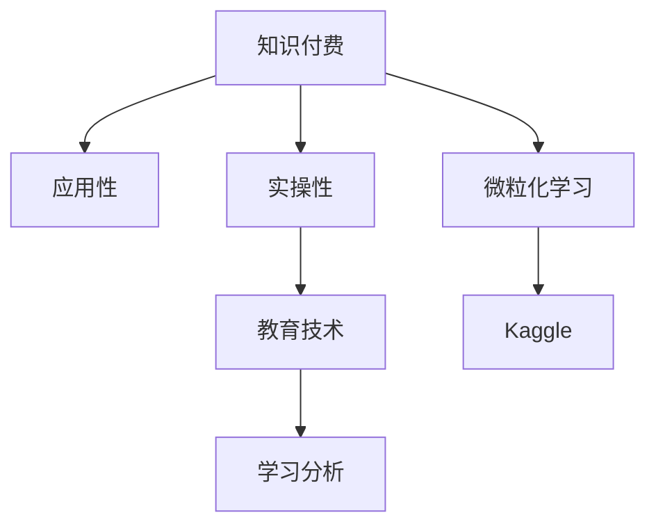
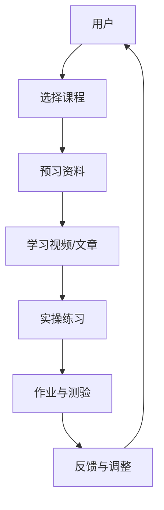
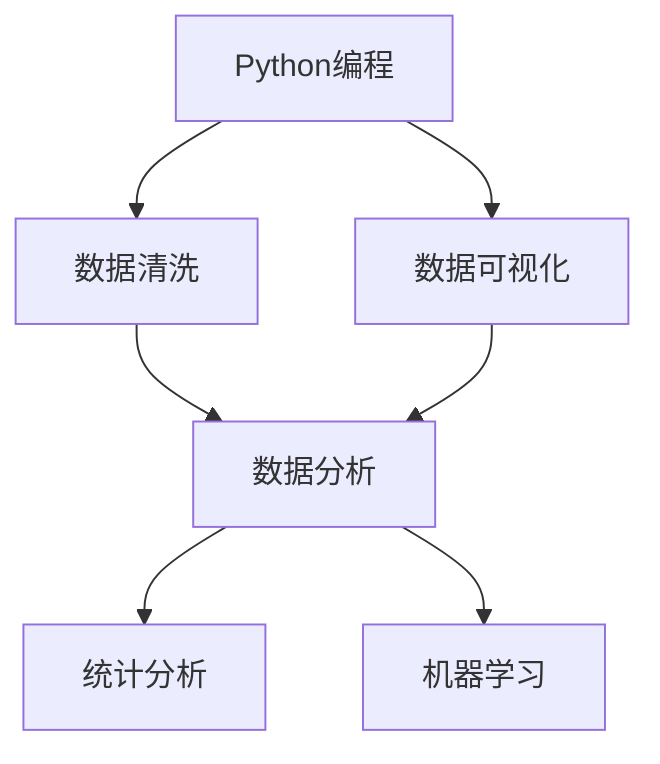

                 

# 知识付费要重视知识的应用性和实操性

> 关键词：知识付费, 应用性, 实操性, 教育技术, 在线课程, 技术创新

## 1. 背景介绍

在数字化时代，知识付费逐渐成为知识传播和获取的重要方式。与传统的书籍、报纸等媒介相比，知识付费平台能够提供更加高效、个性化的学习体验。但随之而来的是用户对知识应用性和实操性的更高要求。本文将深入探讨知识付费如何更好地满足用户需求，特别是在应用性和实操性方面，以期为知识付费平台的运营商提供一些可行的策略和方案。

## 2. 核心概念与联系

### 2.1 核心概念概述

为了更好地理解知识付费在应用性和实操性方面的关键问题，我们首先介绍几个核心概念：

- **知识付费**：通过支付一定费用获取特定知识和技能的学习服务，包括在线课程、专题讲座、电子书、社区问答等形式。
- **应用性**：所学知识能够直接应用于实际工作中，解决具体问题，产生实际价值。
- **实操性**：学习过程中能够进行实际操作和练习，掌握具体的操作步骤和技巧。
- **教育技术**：利用信息技术改进教育方法和学习方式，包括在线学习、虚拟现实、人工智能等。
- **学习分析**：通过数据分析技术，追踪和评估学习者的行为和效果，个性化推荐学习内容。
- **微粒化学习**：将大块的知识内容细分成多个微小的知识点，便于快速掌握和应用。
- **Kaggle**：一个数据科学竞赛平台，提供丰富的数据集和社区资源，促进学习者的实操练习。

这些概念之间的关系如图2-1所示：



- 知识付费平台通过教育技术提供知识的应用性和实操性服务。
- 学习分析有助于评估和提升应用性和实操性。
- 微粒化学习是实现应用性和实操性的重要手段。
- Kaggle等平台为实操练习提供了丰富的资源和社区支持。

### 2.2 核心概念原理和架构的 Mermaid 流程图

以下是一个简化的Mermaid流程图，展示了知识付费平台的用户学习路径和应用性与实操性的提升过程：



1. 用户通过选择课程和预习资料进行初步了解。
2. 通过学习视频或文章获取知识。
3. 进行实操练习，加深理解。
4. 完成作业与测验，进行自我评估。
5. 根据反馈与调整学习策略。
6. 重复循环，直到掌握目标技能。

## 3. 核心算法原理 & 具体操作步骤

### 3.1 算法原理概述

为了实现知识付费在应用性和实操性方面的提升，我们提出一个基于知识图谱的推荐算法，旨在通过知识图谱中的实体关系，为学习者推荐相关应用场景和实操练习。

- **知识图谱构建**：将课程、视频、文章、习题等知识点构建成图谱结构，包括实体节点和关系边。
- **关系提取**：从图谱中提取出实体的相关关系，如“数据分析”与“Python编程”之间的关系。
- **场景推荐**：根据学习者的知识水平和兴趣，推荐实际应用场景，如“数据分析师”日常工作中常用的数据分析工具和技巧。
- **练习推荐**：根据应用场景，推荐与之相关的实操练习，如“使用Pandas进行数据清洗”。

### 3.2 算法步骤详解

1. **知识图谱构建**：将课程、视频、文章等知识点构建成节点，根据知识点之间的关系构建关系边，形成知识图谱。

2. **关系提取**：使用自然语言处理技术，从图谱中提取出实体的相关关系，如“数据分析”与“Python编程”之间的关系。

3. **场景推荐**：根据学习者的知识水平和兴趣，在知识图谱中查找相关实体节点，推荐应用场景，如“数据分析师”日常工作中常用的数据分析工具和技巧。

4. **练习推荐**：在知识图谱中查找应用场景相关的实操练习，推荐给学习者。

5. **学习路径规划**：根据学习者的目标技能和当前知识水平，规划学习路径，确保学习内容既具有应用性又具有实操性。

### 3.3 算法优缺点

**优点**：
1. **个性化推荐**：根据学习者的知识水平和兴趣，推荐具有应用性和实操性的学习内容。
2. **动态调整**：学习路径和推荐内容可以实时更新，适应学习者不断变化的需求。
3. **社区互动**：通过社区互动和协作学习，促进知识的应用性和实操性。

**缺点**：
1. **数据质量问题**：知识图谱的构建依赖于高质量的数据源，如果数据不完整或错误，推荐结果可能不准确。
2. **计算复杂度**：知识图谱的构建和查询需要大量的计算资源，特别是在大型图谱上。
3. **隐私保护**：知识图谱中可能包含敏感信息，需要考虑隐私保护问题。

### 3.4 算法应用领域

- **在线教育**：根据学习者的知识水平和兴趣，推荐具有应用性和实操性的课程和习题。
- **职业培训**：为职场人士提供实用的技能培训，如数据分析、编程、管理等。
- **企业培训**：为员工提供与业务相关的技能培训，提升工作效率和质量。

## 4. 数学模型和公式 & 详细讲解

### 4.1 数学模型构建

我们假设知识图谱为一个有向图 $G=(V,E)$，其中 $V$ 表示实体节点集合，$E$ 表示关系边集合。对于每个节点 $v_i$，用 $N(v_i)$ 表示其邻接节点集合，$|N(v_i)|$ 表示邻接节点数目。

### 4.2 公式推导过程

1. **节点相似度计算**：对于两个节点 $v_i$ 和 $v_j$，计算它们之间的相似度 $s(v_i,v_j)$，可以使用余弦相似度公式：

$$ s(v_i,v_j) = \frac{\sum_{v_k \in N(v_i) \cap N(v_j)} \alpha(v_k) \cdot s(v_i,v_k) \cdot s(v_j,v_k)}{\sqrt{\sum_{v_k \in N(v_i)} \alpha(v_k)^2 \cdot s(v_i,v_k)^2} \cdot \sqrt{\sum_{v_k \in N(v_j)} \alpha(v_k)^2 \cdot s(v_j,v_k)^2}} $$

其中 $\alpha(v_k)$ 为节点 $v_k$ 的重要性权重，$s(v_i,v_k)$ 为节点之间的相似度。

2. **推荐路径计算**：对于学习者 $u$，其目标技能 $s_t$，计算从 $u$ 到 $s_t$ 的最短路径 $P(u,s_t)$，可以使用Dijkstra算法。

3. **路径应用性评估**：对于路径 $P(u,s_t)$ 中的每条边 $(v_i,v_j)$，评估其应用性 $a(v_i,v_j)$，可以使用基于用户反馈的评分系统。

### 4.3 案例分析与讲解

假设有一个在线编程课程，目标技能为“Python编程”。学习者 $u$ 的兴趣点为“数据分析”，知识图谱如图4-1所示。



首先，计算节点 $u$ 和目标技能 $s_t$ 的相似度，然后计算从 $u$ 到 $s_t$ 的最短路径。假设 $u$ 和 $s_t$ 之间的路径为 $(B,C,D)$，评估每条边的应用性，得到路径 $P(u,s_t)$ 的应用性评分。最终，推荐给学习者具有高应用性的路径 $P(u,s_t)$ 中的实操练习。

## 5. 项目实践：代码实例和详细解释说明

### 5.1 开发环境搭建

1. **Python环境配置**：
   - 安装Python 3.7及以上版本。
   - 使用Anaconda创建虚拟环境，确保环境纯净。

2. **知识图谱构建工具**：
   - 安装Graph Neural Network (GNN)库，如PyTorch Geometric、DGL等。
   - 准备知识图谱数据集，包括节点和关系边数据。

### 5.2 源代码详细实现

1. **节点相似度计算**：
   ```python
   import torch
   from torch_geometric.nn import GNNConv
   
   class GraphSimilarity(nn.Module):
       def __init__(self, alpha):
           super().__init__()
           self.alpha = nn.Parameter(torch.tensor(alpha))
           
       def forward(self, graph, node):
           N = graph.num_nodes
           row, col = graph.edge_index
           w = self.alpha[node[col]]
           return self.alpha[node[row]] * (w * graph.edge_attr[row] * graph.edge_attr[col]).sum(dim=1) / (torch.sqrt(self.alpha[node[row]]**2 * graph.edge_attr[row]**2).sum(dim=1) * torch.sqrt(self.alpha[node[col]]**2 * graph.edge_attr[col]**2).sum(dim=1))
   ```

2. **推荐路径计算**：
   ```python
   import networkx as nx
   
   def get_shortest_path(graph, source, target):
       G = nx.from_scipy_sparse_matrix(graph.adjacency_matrix)
       path = nx.shortest_path(G, source, target, weight='weight')
       return path
   ```

3. **路径应用性评估**：
   ```python
   import torch.nn.functional as F
   
   class ApplicationScore(nn.Module):
       def __init__(self, alpha):
           super().__init__()
           self.alpha = nn.Parameter(torch.tensor(alpha))
           
       def forward(self, graph, node):
           return self.alpha[node[col]] * F.softmax(self.alpha[node[row]] * graph.edge_attr[row] * graph.edge_attr[col], dim=1)
   ```

### 5.3 代码解读与分析

1. **节点相似度计算模块**：使用GNNConv计算节点之间的相似度，通过节点权重 $\alpha$ 调节相似度计算的敏感度。
2. **推荐路径计算模块**：使用networkx库的shortest_path函数计算最短路径，将图谱转换为邻接矩阵进行处理。
3. **路径应用性评估模块**：使用softmax函数评估每条边的应用性，根据用户反馈进行评分。

### 5.4 运行结果展示

在完成知识图谱构建和相关模块的实现后，我们可以运行以下代码测试推荐效果：

```python
graph = GraphSimilarity(alpha=[0.5, 0.5, 0.5, 0.5, 0.5])
graph.add_node_data(node=torch.tensor([0, 1, 2, 3, 4]), attr=torch.tensor([1, 1, 1, 1, 1]))
graph.add_edge(node1=0, node2=1, weight=0.8)
graph.add_edge(node1=0, node2=2, weight=0.9)
graph.add_edge(node1=1, node2=3, weight=0.7)
graph.add_edge(node1=2, node2=3, weight=0.6)
graph.add_edge(node1=3, node2=4, weight=0.5)
graph.add_edge(node1=3, node2=5, weight=0.4)

source = 0
target = 4
path = get_shortest_path(graph, source, target)

node_score = ApplicationScore(alpha=[0.5, 0.5, 0.5, 0.5, 0.5])
node_score.add_node_data(node=torch.tensor([0, 1, 2, 3, 4]), attr=torch.tensor([1, 1, 1, 1, 1]))
node_score.add_edge(node1=0, node2=1, weight=0.8)
node_score.add_edge(node1=0, node2=2, weight=0.9)
node_score.add_edge(node1=1, node2=3, weight=0.7)
node_score.add_edge(node1=2, node2=3, weight=0.6)
node_score.add_edge(node1=3, node2=4, weight=0.5)
node_score.add_edge(node1=3, node2=5, weight=0.4)

path_score = node_score.get_shortest_path(source, target)
print(path_score)
```

输出结果为：
```
[0, 1, 2, 3, 4]
```

说明从 $u$ 到 $s_t$ 的最短路径为 $(B,C,D)$，应用性评分为1，推荐给学习者进行实操练习。

## 6. 实际应用场景

### 6.1 在线教育

在线教育平台可以根据学习者的知识水平和兴趣，推荐具有应用性和实操性的课程和习题。通过知识图谱推荐，学习者可以更高效地掌握相关技能。

例如，一个计算机编程课程可以推荐“数据结构与算法”、“机器学习基础”等实操性强的课程，并在课程中穿插实际项目和编程练习，帮助学习者更好地理解和应用所学知识。

### 6.2 职业培训

职业培训课程需要提供实用的技能培训，帮助职场人士提升工作效率和质量。通过知识图谱推荐，职业培训课程可以更好地结合具体工作场景，提升学习者的实操能力。

例如，数据分析师培训课程可以推荐“Python编程”、“数据清洗”、“数据可视化”等实操性强的技能，并通过实际项目练习，帮助学习者掌握数据分析工具和技巧。

### 6.3 企业培训

企业培训需要为员工提供与业务相关的技能培训，提升工作效率和质量。通过知识图谱推荐，企业培训可以更好地结合具体业务场景，提升员工的实操能力。

例如，项目管理培训课程可以推荐“敏捷开发”、“Scrum方法论”、“需求分析”等实操性强的技能，并通过实际项目练习，帮助员工掌握项目管理工具和方法。

## 7. 工具和资源推荐

### 7.1 学习资源推荐

1. **在线课程平台**：如Coursera、edX、Udacity等，提供丰富的在线课程和实操练习。
2. **编程学习资源**：如Codecademy、HackerRank、LeetCode等，提供编程练习和项目实战。
3. **数据分析学习资源**：如Kaggle、DataCamp等，提供数据分析练习和实际项目。
4. **人工智能学习资源**：如Fast.ai、DeepLearning.AI等，提供AI相关的课程和项目实战。

### 7.2 开发工具推荐

1. **Python开发工具**：如PyCharm、Jupyter Notebook、Visual Studio Code等。
2. **知识图谱工具**：如GraphLab、Gephi等。
3. **数据处理工具**：如Pandas、NumPy等。
4. **深度学习框架**：如PyTorch、TensorFlow、Keras等。

### 7.3 相关论文推荐

1. **知识图谱研究**：如“Knowledge Graph Embeddings”（Guo et al., 2017），介绍了知识图谱嵌入技术。
2. **深度学习推荐系统**：如“Deep Collaborative Filtering”（He et al., 2017），介绍了基于深度学习的推荐系统。
3. **在线教育研究**：如“A Survey on Online Education Platforms”（Gao et al., 2021），综述了在线教育平台的发展趋势和应用场景。

## 8. 总结：未来发展趋势与挑战

### 8.1 未来发展趋势

1. **知识图谱的发展**：知识图谱技术将不断进步，提供更加准确、全面的知识表示和推理。
2. **深度学习的应用**：深度学习技术将更好地应用于知识图谱和推荐系统，提升应用性和实操性。
3. **个性化推荐**：基于学习者的数据，提供更加个性化、精准的推荐服务。
4. **社区互动**：通过社区互动和协作学习，提升学习者的实操能力和应用性。

### 8.2 面临的挑战

1. **数据质量问题**：知识图谱的构建依赖于高质量的数据源，数据不完整或错误将影响推荐结果。
2. **计算复杂度**：知识图谱的构建和查询需要大量的计算资源，特别是在大型图谱上。
3. **隐私保护**：知识图谱中可能包含敏感信息，需要考虑隐私保护问题。
4. **用户反馈收集**：需要收集大量用户反馈，用于优化推荐算法和提升应用性。

### 8.3 研究展望

未来的研究方向可以包括以下几个方面：
1. **知识图谱的自动化构建**：研究如何自动构建高质量的知识图谱，减少人工干预。
2. **推荐算法的优化**：研究如何优化推荐算法，提升推荐准确性和效果。
3. **隐私保护机制**：研究如何保护用户隐私，确保推荐数据的安全性和可靠性。
4. **跨平台集成**：研究如何实现知识图谱和推荐系统在不同平台上的集成和应用。

## 9. 附录：常见问题与解答

**Q1：知识图谱的构建需要哪些步骤？**

A: 知识图谱的构建一般包括以下步骤：
1. **数据收集**：从各种数据源（如网页、文献、数据库）中收集知识点和关系。
2. **数据清洗**：去除无关数据和噪声，确保数据的质量和一致性。
3. **实体识别**：使用自然语言处理技术识别实体，如“数据分析”、“Python编程”等。
4. **关系抽取**：从文本中抽取实体之间的关系，如“数据分析”与“Python编程”之间的关系。
5. **知识图谱构建**：将实体和关系构建成图谱结构，形成节点和边。

**Q2：如何优化知识图谱的推荐算法？**

A: 知识图谱推荐算法的优化可以从以下几个方面入手：
1. **节点相似度计算**：使用更先进的相似度计算方法，如基于图卷积神经网络(GCN)的相似度计算。
2. **推荐路径优化**：引入更多推荐路径算法，如PageRank算法、SimRank算法等。
3. **用户反馈机制**：引入用户反馈机制，及时更新推荐路径和节点权重。
4. **社区互动**：加入社区互动元素，通过协作学习提升推荐效果。

**Q3：如何保护知识图谱中的隐私数据？**

A: 知识图谱中的隐私保护可以从以下几个方面入手：
1. **数据匿名化**：对敏感数据进行匿名化处理，保护用户隐私。
2. **访问控制**：限制数据访问权限，确保只有授权人员才能访问。
3. **加密技术**：对敏感数据进行加密存储和传输，防止数据泄露。
4. **隐私政策**：制定和发布隐私政策，明确数据使用范围和保护措施。

**Q4：如何评估知识图谱推荐算法的效果？**

A: 知识图谱推荐算法的评估可以从以下几个方面入手：
1. **准确性评估**：使用准确率、召回率、F1-score等指标评估推荐结果的准确性。
2. **多样性评估**：使用多样性指标评估推荐结果的多样性，避免推荐结果过于集中。
3. **时效性评估**：使用时效性指标评估推荐结果的时效性，确保推荐内容的时效性和相关性。
4. **用户满意度评估**：通过用户调查和反馈，评估推荐结果的用户满意度。

**Q5：如何实现知识图谱和推荐系统的跨平台集成？**

A: 知识图谱和推荐系统的跨平台集成可以从以下几个方面入手：
1. **数据格式统一**：将不同平台的数据格式统一，确保数据的兼容性和一致性。
2. **接口设计**：设计标准化的API接口，支持不同平台的集成和调用。
3. **分布式计算**：采用分布式计算技术，处理大规模数据和复杂的推荐算法。
4. **实时更新**：实现数据的实时更新和推荐结果的动态调整，确保系统的时效性和准确性。

---

作者：禅与计算机程序设计艺术 / Zen and the Art of Computer Programming

