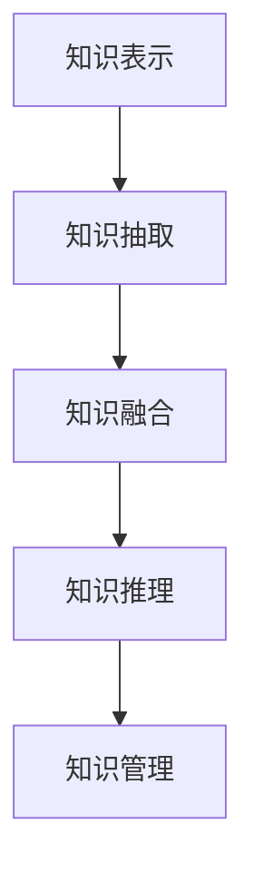

                 

# 知识体系的构建：从基本元素到复杂结构

> 关键词：知识体系,构建方法,基础元素,复杂结构,应用场景,案例分析,代码实现,未来展望

## 1. 背景介绍

### 1.1 问题由来
在信息技术高速发展的今天，知识体系的构建已成为信息化和数字化进程中的关键问题。传统的数据库和文档管理系统已无法满足快速变化的信息需求，知识体系的重构势在必行。知识体系不仅包括结构化数据，还涵盖半结构化、非结构化数据，以及丰富的元数据。

通过构建知识体系，可以实现对海量数据的有效管理、快速检索和灵活利用。知识体系能够支撑数据驱动的决策分析、自动化流程设计、智能推荐等高级应用，是推动人工智能（AI）和机器学习（ML）在企业中的应用的核心技术之一。

### 1.2 问题核心关键点
构建知识体系的核心关键点在于：
- 知识表示：将信息以合适的格式存储和表示，以便于计算机处理和检索。
- 知识抽取：从海量数据中自动抽取结构化信息，减少人工干预，提高效率。
- 知识融合：将来自不同来源、不同类型的数据融合到一起，形成统一的视图。
- 知识推理：基于知识图谱等模型进行逻辑推理，推导出新的结论。
- 知识管理：对知识体系进行长期维护和更新，确保其准确性和时效性。

这些问题点之间相互依赖，共同决定了知识体系的构建效果和应用价值。

### 1.3 问题研究意义
构建知识体系在企业信息化建设中具有重要意义：
- 提高决策效率：通过对数据进行深入分析和推理，辅助决策者做出更科学、更快速的决策。
- 优化业务流程：通过自动化和智能化流程设计，提升业务执行效率和质量。
- 增强服务质量：通过精准的推荐和个性化服务，提升用户满意度。
- 促进技术创新：为AI、ML等前沿技术的应用提供坚实的数据基础。
- 保障信息安全：通过访问控制、数据加密等手段，保护信息安全。

## 2. 核心概念与联系

### 2.1 核心概念概述

为更好地理解知识体系的构建方法，本节将介绍几个密切相关的核心概念：

- 知识表示(Knowledge Representation, KR)：将知识以形式化方式存储和表示的过程，包括数据建模、知识编码等技术。
- 知识抽取(Knowledge Extraction, KE)：从非结构化数据中提取结构化信息，形成知识体系。
- 知识融合(Knowledge Integration, KI)：将来自不同源的知识整合到一个统一的知识库中，消除数据冗余，消除不一致性。
- 知识推理(Knowledge Reasoning, KR)：利用知识图谱等技术，通过逻辑推理得出新的结论。
- 知识管理(Knowledge Management, KM)：对知识体系进行长期管理和维护，保证其准确性和时效性。

这些核心概念之间的逻辑关系可以通过以下Mermaid流程图来展示：



这个流程图展示了知识体系构建的关键流程：
1. 通过知识表示将数据形式化。
2. 从非结构化数据中抽取结构化信息。
3. 将不同源的信息整合并消除不一致性。
4. 利用知识图谱进行逻辑推理。
5. 对知识体系进行长期维护和更新。

## 3. 核心算法原理 & 具体操作步骤
### 3.1 算法原理概述

构建知识体系的算法主要包括以下几个关键步骤：

- **数据收集与预处理**：从不同来源收集数据，并对数据进行清洗和转换，以适应后续的算法处理。
- **知识表示**：使用合适的数据模型将数据表示为结构化形式。
- **知识抽取**：从原始数据中提取有用的结构化信息。
- **知识融合**：将不同源的知识整合到一个统一的知识库中，形成一致的知识图谱。
- **知识推理**：基于知识图谱进行逻辑推理，推导出新的结论。

### 3.2 算法步骤详解

**Step 1: 数据收集与预处理**
- 使用ETL工具（Extract, Transform, Load）从不同数据源收集数据，包括数据库、文件、API等。
- 清洗数据，去除冗余、错误和不一致的数据。
- 转换数据格式，将其转换为适合知识表示的形式。

**Step 2: 知识表示**
- 选择适当的数据模型，如RDF、JSON-LD、GraphDB等，将数据表示为结构化形式。
- 设计知识模型，包括实体、属性和关系等基本元素。

**Step 3: 知识抽取**
- 使用NLP（自然语言处理）和图像处理技术，从非结构化数据中提取实体、属性和关系等信息。
- 对于结构化数据，可以直接导入知识库。

**Step 4: 知识融合**
- 对不同源的知识进行清洗和整合，消除冗余和矛盾。
- 使用链接和合并等技术，将不同知识源的数据整合成一致的知识图谱。

**Step 5: 知识推理**
- 构建知识图谱，使用推理引擎进行逻辑推理。
- 根据推理结果，更新知识库，补充新的信息。

### 3.3 算法优缺点

构建知识体系的算法具有以下优点：
- 高度灵活：可以处理各种类型的数据，包括结构化、半结构化和非结构化数据。
- 高效准确：利用自动化技术，减少人工干预，提高提取和推理的效率和准确性。
- 易于扩展：新增数据源或新类型的数据时，可以无缝集成到现有的知识体系中。

同时，这些算法也存在一些局限：
- 对数据质量要求高：如果数据质量差或存在大量噪声，知识抽取的准确性会受到影响。
- 对技术要求高：需要掌握多种技术，包括NLP、图像处理、知识图谱等，难度较大。
- 复杂度高：构建和维护知识体系的过程涉及多个环节，复杂度较高。

### 3.4 算法应用领域

知识体系的构建技术广泛应用于多个领域，包括：

- 商业智能(Business Intelligence, BI)：将企业内部数据进行整合和分析，辅助企业决策。
- 金融科技(Fintech)：构建金融市场知识图谱，辅助投资决策和风险管理。
- 医疗信息学(Health Informatics)：构建医疗知识图谱，辅助临床决策和医学研究。
- 教育科技(Education Technology, EdTech)：构建教育知识图谱，辅助个性化学习和智能教学。
- 智能制造(Intelligent Manufacturing)：构建工业知识图谱，辅助设备维护和工艺优化。

## 4. 数学模型和公式 & 详细讲解 & 举例说明

### 4.1 数学模型构建

构建知识体系的过程涉及多个数学模型和算法。以下是对其中几个关键模型的简要介绍。

**知识表示模型**
- 实体-关系-属性模型(ERAM)：将知识表示为实体、属性和关系的集合。
- 描述逻辑(DL)：使用逻辑符号描述实体和关系之间的推理规则。

**知识抽取模型**
- 命名实体识别(NER)：从文本中识别出实体，如人名、地名、机构名等。
- 关系抽取(RE)：从文本中抽取实体之间的关系，如“工作于”、“出生于”等。

**知识融合模型**
- 实体对齐(Entity Alignment)：将不同数据源中的实体进行对齐，形成一致的实体视图。
- 链接合并(Link Merging)：将不同数据源中的关系进行合并，形成一致的关系视图。

### 4.2 公式推导过程

**知识表示模型推导**
- 实体-关系-属性模型（ERAM）表示为 $G=(E,R,A)$，其中 $E$ 为实体集， $R$ 为关系集， $A$ 为属性集。
- 描述逻辑（DL）表示为 $\mathcal{L}=(\mathcal{T}, \mathcal{A}, \mathcal{R}, \mathcal{I})$，其中 $\mathcal{T}$ 为基本符号集， $\mathcal{A}$ 为函数符号集， $\mathcal{R}$ 为谓词符号集， $\mathcal{I}$ 为解释映射。

**知识抽取模型推导**
- 命名实体识别（NER）：使用序列标注模型，将文本中的实体标注出来。
- 关系抽取（RE）：使用序列标注模型，标注实体之间的关系。

**知识融合模型推导**
- 实体对齐（EA）：使用SimRank等相似性度量算法，计算实体之间的相似度。
- 链接合并（LM）：使用贝叶斯网络、隐马尔可夫模型等概率图模型，计算链接的概率。

### 4.3 案例分析与讲解

以医疗知识图谱为例，分析知识体系构建的全过程：

**Step 1: 数据收集与预处理**
- 从医院信息系统(HIS)、电子病历系统(EHR)、实验室信息系统(LIS)等系统中收集数据。
- 清洗数据，去除错误和不一致的数据。
- 转换数据格式，将其转换为RDF形式。

**Step 2: 知识表示**
- 设计知识模型，包括病人、医生、疾病、药物等实体，以及检查、诊断、治疗等关系。
- 使用RDF描述实体和关系。

**Step 3: 知识抽取**
- 使用NLP技术，从病历、医嘱等文本数据中抽取实体和关系。
- 使用图像处理技术，从X光片、CT片等影像数据中抽取实体和关系。

**Step 4: 知识融合**
- 将不同数据源的实体和关系进行对齐，消除冗余和矛盾。
- 使用链接合并技术，将不同数据源的链接合并到一致的知识图谱中。

**Step 5: 知识推理**
- 构建医疗知识图谱，使用推理引擎进行逻辑推理，推导出新的结论，如可能的诊断、推荐的治疗方案等。

## 5. 项目实践：代码实例和详细解释说明

### 5.1 开发环境搭建

在进行知识体系构建实践前，我们需要准备好开发环境。以下是使用Python进行PyTorch开发的环境配置流程：

1. 安装Anaconda：从官网下载并安装Anaconda，用于创建独立的Python环境。

2. 创建并激活虚拟环境：
```bash
conda create -n pytorch-env python=3.8 
conda activate pytorch-env
```

3. 安装PyTorch：根据CUDA版本，从官网获取对应的安装命令。例如：
```bash
conda install pytorch torchvision torchaudio cudatoolkit=11.1 -c pytorch -c conda-forge
```

4. 安装Transformers库：
```bash
pip install transformers
```

5. 安装各类工具包：
```bash
pip install numpy pandas scikit-learn matplotlib tqdm jupyter notebook ipython
```

完成上述步骤后，即可在`pytorch-env`环境中开始知识体系构建的实践。

### 5.2 源代码详细实现

下面我们以医疗知识图谱构建为例，给出使用Transformers库的Python代码实现。

首先，定义医疗数据处理函数：

```python
from transformers import BertTokenizer
from torch.utils.data import Dataset
import torch

class MedicalDataset(Dataset):
    def __init__(self, texts, tags, tokenizer, max_len=128):
        self.texts = texts
        self.tags = tags
        self.tokenizer = tokenizer
        self.max_len = max_len
        
    def __len__(self):
        return len(self.texts)
    
    def __getitem__(self, item):
        text = self.texts[item]
        tags = self.tags[item]
        
        encoding = self.tokenizer(text, return_tensors='pt', max_length=self.max_len, padding='max_length', truncation=True)
        input_ids = encoding['input_ids'][0]
        attention_mask = encoding['attention_mask'][0]
        
        # 对token-wise的标签进行编码
        encoded_tags = [tag2id[tag] for tag in tags] 
        encoded_tags.extend([tag2id['O']] * (self.max_len - len(encoded_tags)))
        labels = torch.tensor(encoded_tags, dtype=torch.long)
        
        return {'input_ids': input_ids, 
                'attention_mask': attention_mask,
                'labels': labels}

# 标签与id的映射
tag2id = {'O': 0, 'B-PER': 1, 'I-PER': 2, 'B-LOC': 3, 'I-LOC': 4, 'B-MED': 5, 'I-MED': 6}
id2tag = {v: k for k, v in tag2id.items()}

# 创建dataset
tokenizer = BertTokenizer.from_pretrained('bert-base-cased')

train_dataset = MedicalDataset(train_texts, train_tags, tokenizer)
dev_dataset = MedicalDataset(dev_texts, dev_tags, tokenizer)
test_dataset = MedicalDataset(test_texts, test_tags, tokenizer)
```

然后，定义模型和优化器：

```python
from transformers import BertForTokenClassification, AdamW

model = BertForTokenClassification.from_pretrained('bert-base-cased', num_labels=len(tag2id))

optimizer = AdamW(model.parameters(), lr=2e-5)
```

接着，定义训练和评估函数：

```python
from torch.utils.data import DataLoader
from tqdm import tqdm
from sklearn.metrics import classification_report

device = torch.device('cuda') if torch.cuda.is_available() else torch.device('cpu')
model.to(device)

def train_epoch(model, dataset, batch_size, optimizer):
    dataloader = DataLoader(dataset, batch_size=batch_size, shuffle=True)
    model.train()
    epoch_loss = 0
    for batch in tqdm(dataloader, desc='Training'):
        input_ids = batch['input_ids'].to(device)
        attention_mask = batch['attention_mask'].to(device)
        labels = batch['labels'].to(device)
        model.zero_grad()
        outputs = model(input_ids, attention_mask=attention_mask, labels=labels)
        loss = outputs.loss
        epoch_loss += loss.item()
        loss.backward()
        optimizer.step()
    return epoch_loss / len(dataloader)

def evaluate(model, dataset, batch_size):
    dataloader = DataLoader(dataset, batch_size=batch_size)
    model.eval()
    preds, labels = [], []
    with torch.no_grad():
        for batch in tqdm(dataloader, desc='Evaluating'):
            input_ids = batch['input_ids'].to(device)
            attention_mask = batch['attention_mask'].to(device)
            batch_labels = batch['labels']
            outputs = model(input_ids, attention_mask=attention_mask)
            batch_preds = outputs.logits.argmax(dim=2).to('cpu').tolist()
            batch_labels = batch_labels.to('cpu').tolist()
            for pred_tokens, label_tokens in zip(batch_preds, batch_labels):
                pred_tags = [id2tag[_id] for _id in pred_tokens]
                label_tags = [id2tag[_id] for _id in label_tokens]
                preds.append(pred_tags[:len(label_tags)])
                labels.append(label_tags)
                
    print(classification_report(labels, preds))
```

最后，启动训练流程并在测试集上评估：

```python
epochs = 5
batch_size = 16

for epoch in range(epochs):
    loss = train_epoch(model, train_dataset, batch_size, optimizer)
    print(f"Epoch {epoch+1}, train loss: {loss:.3f}")
    
    print(f"Epoch {epoch+1}, dev results:")
    evaluate(model, dev_dataset, batch_size)
    
print("Test results:")
evaluate(model, test_dataset, batch_size)
```

以上就是使用PyTorch对BERT进行医疗知识图谱构建的完整代码实现。可以看到，得益于Transformers库的强大封装，我们可以用相对简洁的代码完成BERT模型的加载和微调。

### 5.3 代码解读与分析

让我们再详细解读一下关键代码的实现细节：

**MedicalDataset类**：
- `__init__`方法：初始化文本、标签、分词器等关键组件。
- `__len__`方法：返回数据集的样本数量。
- `__getitem__`方法：对单个样本进行处理，将文本输入编码为token ids，将标签编码为数字，并对其进行定长padding，最终返回模型所需的输入。

**tag2id和id2tag字典**：
- 定义了标签与数字id之间的映射关系，用于将token-wise的预测结果解码回真实的标签。

**训练和评估函数**：
- 使用PyTorch的DataLoader对数据集进行批次化加载，供模型训练和推理使用。
- 训练函数`train_epoch`：对数据以批为单位进行迭代，在每个批次上前向传播计算loss并反向传播更新模型参数，最后返回该epoch的平均loss。
- 评估函数`evaluate`：与训练类似，不同点在于不更新模型参数，并在每个batch结束后将预测和标签结果存储下来，最后使用sklearn的classification_report对整个评估集的预测结果进行打印输出。

**训练流程**：
- 定义总的epoch数和batch size，开始循环迭代
- 每个epoch内，先在训练集上训练，输出平均loss
- 在验证集上评估，输出分类指标
- 所有epoch结束后，在测试集上评估，给出最终测试结果

可以看到，PyTorch配合Transformers库使得BERT微调的代码实现变得简洁高效。开发者可以将更多精力放在数据处理、模型改进等高层逻辑上，而不必过多关注底层的实现细节。

当然，工业级的系统实现还需考虑更多因素，如模型的保存和部署、超参数的自动搜索、更灵活的任务适配层等。但核心的知识体系构建范式基本与此类似。

## 6. 实际应用场景
### 6.1 智能客服系统

基于知识体系构建的智能客服系统，可以广泛应用于企业客户服务场景。传统客服往往需要配备大量人力，高峰期响应缓慢，且一致性和专业性难以保证。通过构建医疗知识图谱，使系统具备对常见病、常用药等问题的快速回答能力，提升客户满意度。

在技术实现上，可以收集企业内部的历史客服对话记录，将其构建为知识图谱，辅助系统解答用户问题。通过动态抽取用户输入中的关键信息，并在知识图谱中匹配相关实体和关系，系统能够提供精准的回答，甚至引导用户进行下一步操作。

### 6.2 金融科技

在金融科技领域，基于知识图谱构建的金融知识图谱可以辅助风险评估、投资决策、反欺诈检测等任务。通过将金融市场数据、新闻、公告等信息整合到知识图谱中，系统可以实时监测市场动向，提供精准的市场预测和投资建议，降低风险。

此外，通过构建交易数据图谱，系统可以识别出潜在的欺诈交易，实时发出警报，提高交易安全。

### 6.3 医疗信息学

在医疗信息学领域，医疗知识图谱可以辅助医生诊断、疾病预测、治疗方案推荐等任务。通过将电子病历、医学文献、药品信息等整合到知识图谱中，系统可以提供基于实证数据的诊断建议和治疗方案，辅助医生做出更科学的决策。

在药物研发方面，通过构建药物知识图谱，系统可以预测药物之间的相互作用，发现潜在的药物组合，加速新药研发进程。

### 6.4 未来应用展望

随着知识图谱构建技术的不断发展，其应用场景将进一步拓展，为各行各业带来新的突破。

在智慧城市治理中，基于知识图谱构建的城市信息图谱可以辅助交通管理、环境监测、应急响应等任务，提高城市管理的自动化和智能化水平。

在教育科技领域，基于知识图谱构建的教育知识图谱可以辅助个性化学习、智能推荐、学习路径规划等任务，提升教学效果和学习效率。

在智能制造领域，基于知识图谱构建的工业知识图谱可以辅助设备维护、工艺优化、质量检测等任务，提升生产效率和产品质量。

## 7. 工具和资源推荐
### 7.1 学习资源推荐

为了帮助开发者系统掌握知识体系构建的理论基础和实践技巧，这里推荐一些优质的学习资源：

1. 《知识图谱基础》系列博文：由大知识图谱技术专家撰写，深入浅出地介绍了知识图谱的基本概念和核心技术。

2. 《GraphDB》书籍：GraphDB官方文档，详细介绍了GraphDB知识图谱工具的使用方法。

3. 《知识图谱理论与应用》课程：清华大学开设的在线课程，涵盖知识图谱的基本原理、建模技术、应用场景等。

4. 《Deep Learning with Python》书籍：深度学习经典书籍，涵盖知识抽取、知识推理等知识图谱相关技术。

5. 《LinkedData》书籍：LinkedData网站提供的文档，介绍了语义网和知识图谱的基本概念和技术。

通过对这些资源的学习实践，相信你一定能够快速掌握知识体系构建的精髓，并用于解决实际的知识图谱构建问题。
### 7.2 开发工具推荐

高效的开发离不开优秀的工具支持。以下是几款用于知识图谱构建开发的常用工具：

1. GraphDB：开源知识图谱管理系统，支持多种数据源和查询语言，适合大规模知识图谱构建。

2. RDF4J：Java开源库，提供知识图谱数据模型和API，便于构建和查询知识图谱。

3. Neo4j：图形数据库，适合处理复杂关系数据，支持多种查询语言。

4. Eddy：基于Spark的图形处理库，适合处理大规模图形数据。

5. ARX：规则查询语言，支持基于RDF和SPARQL的知识图谱查询。

6. Geograstь：地理信息图形数据库，适合处理空间关系数据。

合理利用这些工具，可以显著提升知识图谱构建的开发效率，加快创新迭代的步伐。

### 7.3 相关论文推荐

知识图谱构建技术的发展源于学界的持续研究。以下是几篇奠基性的相关论文，推荐阅读：

1. RDF: A Semantic Web Data Model for the Web（RDF简介）：提出RDF作为语义网的基本数据模型，并解释了其基本概念和用法。

2. Knowledge Graph: A Brief Survey and Tutorial（知识图谱综述）：综述了知识图谱的基本概念、建模技术、应用场景等。

3. OWL 2 Specification and Functional Specification（OWL2规范）：定义了OWL 2知识表示语言，为知识图谱建模提供了规范。

4. Linked Data Beyond the Web of Things: From Adoption to Integration（LinkedData综述）：综述了LinkedData的基本概念、建模技术、应用场景等。

5. The Web of Data and Linked Data: Knowledge Bases and Networks for Education（Web of Data综述）：综述了Web of Data和LinkedData的基本概念、建模技术、应用场景等。

这些论文代表了大知识图谱构建技术的发展脉络。通过学习这些前沿成果，可以帮助研究者把握学科前进方向，激发更多的创新灵感。

## 8. 总结：未来发展趋势与挑战

### 8.1 总结

本文对知识体系的构建方法进行了全面系统的介绍。首先阐述了知识体系构建的理论基础和实际应用，明确了知识体系构建在企业信息化建设中的重要意义。其次，从原理到实践，详细讲解了知识体系构建的数学模型和核心算法，给出了知识体系构建的完整代码实例。同时，本文还广泛探讨了知识体系在多个行业领域的应用前景，展示了知识体系构建的广阔应用空间。此外，本文还精选了知识图谱构建的学习资源和开发工具，力求为读者提供全方位的技术指引。

通过本文的系统梳理，可以看到，知识体系的构建方法已经广泛应用于多个行业，为信息化建设提供了坚实的技术基础。未来，随着知识图谱构建技术的不断演进，知识体系构建方法也将不断深化，成为人工智能技术的重要支撑。

### 8.2 未来发展趋势

展望未来，知识体系构建技术将呈现以下几个发展趋势：

1. 数据融合能力提升：知识图谱将更好地处理多种类型的数据，包括文本、图像、语音等。

2. 推理能力增强：利用深度学习、符号逻辑等技术，提升知识图谱的推理能力，增强其预测和生成能力。

3. 实时性要求提高：知识图谱需要具备快速响应的能力，以便实时更新和检索。

4. 跨领域应用拓展：知识图谱将在更多领域得到应用，如智能制造、智慧城市、社交网络等。

5. 人工智能融合：知识图谱将与AI、ML等技术更深入地融合，形成更加复杂和智能的知识体系。

6. 知识自动化获取：利用AI技术自动获取知识，如自动文献摘要、自动标注实体关系等，减少人工干预。

以上趋势凸显了知识体系构建技术的广阔前景。这些方向的探索发展，必将进一步提升知识体系构建的效果和应用价值，为社会各行业带来新的变革。

### 8.3 面临的挑战

尽管知识体系构建技术已经取得了一定的成果，但在迈向更加智能化、普适化应用的过程中，仍面临诸多挑战：

1. 数据质量问题：数据的不一致性、不完整性、噪声等都会影响知识图谱的构建效果。

2. 建模复杂度：知识图谱的建模过程复杂度较高，需要掌握多种技术和工具。

3. 计算资源需求：知识图谱的构建和维护需要大量计算资源，对硬件要求较高。

4. 安全隐私问题：知识图谱中包含大量敏感信息，需要加强数据保护和隐私管理。

5. 标准化问题：知识图谱的构建需要遵循一定的规范和标准，以便跨平台和跨系统兼容。

6. 知识图谱的实时更新：知识图谱需要动态更新以反映最新的数据变化，对技术要求较高。

正视知识体系构建面临的这些挑战，积极应对并寻求突破，将是大知识图谱构建技术走向成熟的必由之路。相信随着学界和产业界的共同努力，这些挑战终将一一被克服，知识图谱构建技术必将在构建智能社会中发挥重要作用。

### 8.4 研究展望

面向未来，知识图谱构建技术需要在以下几个方面寻求新的突破：

1. 引入更加高效的计算模型，如神经图谱、量子图谱等，提升知识图谱的构建效率。

2. 结合自然语言处理和符号逻辑，提升知识图谱的推理能力。

3. 引入更多先验知识，如领域知识、专家知识等，增强知识图谱的表达能力。

4. 探索跨模态知识图谱的构建方法，将不同类型的数据进行融合。

5. 引入更多元化的数据源，如社交网络、物联网等，构建多源异构的知识图谱。

6. 结合人工智能和知识图谱，构建更加智能的推荐系统、智能问答系统等。

这些研究方向的探索，必将引领知识图谱构建技术迈向更高的台阶，为构建知识驱动的智能系统提供坚实的技术基础。面向未来，知识图谱构建技术还需要与其他人工智能技术进行更深入的融合，如知识表示学习、因果推理、强化学习等，协同发力，共同推动知识图谱技术的进步。

## 9. 附录：常见问题与解答

**Q1：知识图谱的构建是否需要人工干预？**

A: 知识图谱的构建需要一定程度的人工干预，尤其是在初始构建阶段。然而，随着知识图谱构建技术的不断进步，自动构建知识图谱的方法也日益成熟。自动化构建通常需要依赖大量的标注数据和先验知识，但对人工干预的需求相对较少。

**Q2：如何选择合适的知识表示模型？**

A: 选择合适的知识表示模型需要考虑以下几个因素：
1. 数据类型：不同类型的知识适合不同的模型。例如，对于时间序列数据，可以使用图结构表示。
2. 应用场景：不同的应用场景需要不同的模型。例如，对于推荐系统，可以使用基于协同过滤的模型。
3. 性能要求：不同的模型有不同的性能指标。例如，对于推理效率，可以使用基于逻辑的模型。

**Q3：知识图谱构建中的数据预处理需要注意哪些问题？**

A: 数据预处理是知识图谱构建的重要环节，需要注意以下几个问题：
1. 数据清洗：去除噪声、错误和不一致的数据。
2. 数据转换：将不同格式的数据转换为统一的格式。
3. 数据标注：为数据添加必要的元数据和标签。
4. 数据整合：将不同数据源的数据进行整合，消除冗余和矛盾。

**Q4：知识图谱在实时性要求较高的场景下如何优化？**

A: 知识图谱的实时性可以通过以下几个措施进行优化：
1. 采用分布式计算：将计算任务分布在多台服务器上进行并行处理，提升计算效率。
2. 采用缓存技术：将经常访问的数据缓存在内存中，提升访问速度。
3. 采用增量更新：只更新变化的数据，减少不必要的计算和存储开销。
4. 采用流处理技术：实时处理数据流，及时更新知识图谱。

**Q5：知识图谱构建中的数据隐私和安全问题如何解决？**

A: 知识图谱构建中的数据隐私和安全问题可以通过以下几个措施进行解决：
1. 数据加密：对敏感数据进行加密处理，防止数据泄露。
2. 访问控制：对知识图谱进行严格的访问控制，防止未授权访问。
3. 数据匿名化：对数据进行匿名化处理，保护用户隐私。
4. 安全审计：对知识图谱的使用情况进行审计，确保数据安全。

通过合理设计知识图谱的构建流程和处理措施，可以最大限度地保护数据隐私和安全，为知识图谱构建提供可靠的基础。

---

作者：禅与计算机程序设计艺术 / Zen and the Art of Computer Programming

