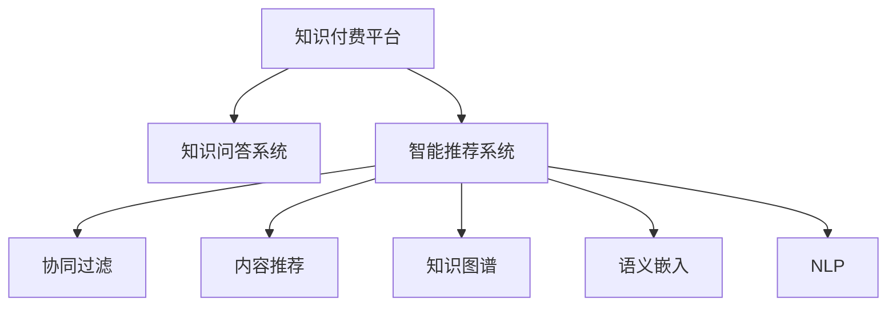

                 

# 知识经济下知识付费的人工智能知识问答优化技术

> 关键词：知识经济, 知识付费, 人工智能, 知识问答优化, 智能推荐系统

## 1. 背景介绍

### 1.1 问题由来
随着知识经济的兴起，知识付费行业蓬勃发展，越来越多的人选择在线订阅优质内容。而如何高效、精准地推送知识内容，提升用户满意度和留存率，成为知识付费平台面临的一大挑战。传统的推荐算法已难以满足用户多样化和个性化的需求，而基于人工智能的智能推荐系统则提供了新的解决方案。

### 1.2 问题核心关键点
人工智能技术在知识推荐中的应用，本质上是利用用户行为数据，通过训练推荐模型，预测用户对不同知识内容（如课程、书籍、文章等）的兴趣程度，从而实现精准推荐。这一过程中，如何构建有效的用户兴趣模型、如何进行数据高效处理、如何优化推荐模型、如何提升推荐系统的准确性和多样性，都是亟待解决的核心问题。

### 1.3 问题研究意义
探索基于人工智能的知识问答优化技术，对于推动知识经济的发展，促进知识付费平台的智能化转型，具有重要的理论和实践意义：

1. **提升用户满意度**：通过个性化推荐，满足用户多样化的知识需求，提高用户满意度。
2. **提高留存率**：个性化推荐能够增加用户的粘性，降低流失率。
3. **优化推荐效果**：通过机器学习算法不断迭代优化，提高推荐系统的准确性和多样性。
4. **驱动知识付费增长**：个性化推荐能更好地激发用户潜在需求，推动知识付费业务的增长。

## 2. 核心概念与联系

### 2.1 核心概念概述

为了更好地理解人工智能在知识问答优化中的作用，本节将介绍几个关键概念：

- **知识付费平台**：提供在线订阅服务的知识分享平台，如得到、喜马拉雅、知乎付费等。
- **知识问答系统**：一种通过自然语言理解技术，解答用户提问的系统。
- **智能推荐系统**：利用机器学习算法，为用户推荐个性化内容的系统。
- **协同过滤**：基于用户行为或物品属性，通过相似性度量推荐相似物品的技术。
- **内容推荐**：根据用户兴趣偏好推荐相关内容。
- **知识图谱**：以知识元素及其关系为核心的语义网络图，用于表示知识结构。
- **语义嵌入**：将文本信息映射到低维向量空间，捕捉语义信息的技术。
- **自然语言处理(NLP)**：涉及文本分析、理解、生成等任务的技术，是知识问答和智能推荐的基础。

这些核心概念之间的逻辑关系可以通过以下Mermaid流程图来展示：



这个流程图展示了几者之间的基本关系：

1. 知识付费平台集成问答系统和推荐系统，提升用户体验。
2. 推荐系统包括协同过滤、内容推荐、知识图谱和语义嵌入等多种技术手段。
3. NLP是问答系统和推荐系统的技术基础。

## 3. 核心算法原理 & 具体操作步骤
### 3.1 算法原理概述

基于人工智能的知识问答优化技术，主要利用机器学习算法，对用户行为数据进行建模，预测用户对不同知识内容的兴趣程度。其核心思想是：通过训练推荐模型，最大化用户满意度和留存率，同时优化知识内容的展现形式，提升平台收益。

具体而言，算法原理包括以下几个步骤：

1. **用户行为数据收集**：收集用户在平台上的浏览、点击、购买等行为数据。
2. **用户兴趣模型构建**：使用协同过滤、内容推荐等算法，对用户兴趣进行建模。
3. **推荐模型训练**：基于用户兴趣模型，训练推荐模型，预测用户对不同知识内容的兴趣程度。
4. **推荐结果生成**：根据预测结果，为用户生成个性化的推荐列表。
5. **推荐效果评估**：通过A/B测试、用户反馈等方法，评估推荐效果，不断迭代优化。

### 3.2 算法步骤详解

以下是基于人工智能的知识问答优化技术的详细步骤：

**Step 1: 用户行为数据收集**
- 收集用户在平台上的行为数据，包括浏览历史、点击行为、购买记录、评价反馈等。
- 使用日志分析工具对行为数据进行清洗、归一化，形成用户行为数据集。

**Step 2: 用户兴趣模型构建**
- 使用协同过滤算法，对用户行为数据进行相似性计算，发现用户兴趣相似性。
- 使用内容推荐算法，将知识内容属性进行编码，构建用户兴趣模型。

**Step 3: 推荐模型训练**
- 选择推荐算法模型，如协同过滤、深度学习、混合模型等，对用户兴趣模型进行训练。
- 训练过程中使用交叉验证、学习率调整等技术，提高模型泛化能力。

**Step 4: 推荐结果生成**
- 使用训练好的推荐模型，对新数据进行预测，生成推荐列表。
- 结合业务规则，如热门课程、最新发布等，丰富推荐结果。

**Step 5: 推荐效果评估**
- 使用A/B测试、用户反馈、点击率等指标评估推荐效果。
- 根据评估结果，不断优化推荐模型和策略，提升推荐效果。

### 3.3 算法优缺点

基于人工智能的知识问答优化技术具有以下优点：
1. 高效精准：通过机器学习算法，能够高效准确地预测用户兴趣，实现个性化推荐。
2. 用户体验提升：个性化推荐能够满足用户多样化需求，提升用户体验。
3. 数据利用率提升：利用用户行为数据，最大化数据价值，避免信息孤岛。
4. 动态更新：推荐模型可以动态更新，适应用户兴趣变化。

同时，该方法也存在一定的局限性：
1. 数据质量依赖：推荐效果很大程度上依赖于用户行为数据的准确性和完整性。
2. 冷启动问题：新用户或新内容难以获取足够的数据进行推荐。
3. 模型复杂度：推荐模型复杂度高，需要较大计算资源。
4. 隐私风险：用户行为数据涉及隐私问题，需要严格的数据保护措施。

尽管存在这些局限性，但就目前而言，基于人工智能的知识问答优化技术仍是最主流的方法。未来相关研究的重点在于如何进一步提高推荐系统的鲁棒性和可解释性，同时兼顾数据隐私和模型复杂度等因素。

### 3.4 算法应用领域

基于人工智能的知识问答优化技术，在知识付费平台中的应用广泛，具体包括：

- **课程推荐**：根据用户浏览历史和评价反馈，推荐相关课程。
- **书籍推荐**：基于用户的阅读习惯和兴趣，推荐书籍。
- **文章推荐**：根据用户的浏览记录和互动行为，推荐高质量文章。
- **专题推荐**：结合用户兴趣和热门话题，推荐相关专题。
- **社区推荐**：根据用户互动行为，推荐相关社群或专家。

这些应用领域涵盖了知识付费平台的各个方面，帮助平台提升用户粘性和活跃度，推动知识付费业务的可持续发展。

## 4. 数学模型和公式 & 详细讲解 & 举例说明

### 4.1 数学模型构建

本节将使用数学语言对基于人工智能的知识问答优化技术进行更加严格的刻画。

记用户行为数据集为 $D=\{(x_i,y_i)\}_{i=1}^N$，其中 $x_i$ 为行为特征向量， $y_i$ 为行为标签（如浏览、点击、购买等）。设推荐模型为 $f(x)$，目标是最大化用户满意度，即最大化 $f(x)$ 的期望值：

$$
\max_{f} \mathbb{E}[f(x)] - \alpha \mathbb{E}[||f(x) - y||^2]
$$

其中 $\alpha$ 为正则化系数，防止过拟合。

### 4.2 公式推导过程

为了构建推荐模型，我们可以使用协同过滤算法，对用户行为数据进行相似性计算。假设用户 $u_i$ 对知识内容 $v_j$ 的评分 $r_{ij} \in [1,5]$，协同过滤算法可以计算用户之间的相似度 $s_{ui}$，然后根据相似度，推荐与用户 $u_i$ 兴趣相似的用户 $u_k$ 喜欢的知识内容 $v_j$。具体步骤如下：

1. 计算用户 $u_i$ 和 $u_j$ 的余弦相似度：

$$
s_{ui} = \cos\left(\frac{x_u \cdot x_v}{||x_u|| \cdot ||x_v||}\right)
$$

2. 对用户 $u_i$ 喜欢的知识内容 $v_j$ 进行排序，选取与 $u_i$ 相似度最高的 $k$ 个用户 $u_k$，根据这些用户的评分进行加权平均，得到 $u_i$ 的预测评分：

$$
\hat{r}_{ij} = \frac{\sum_{k=1}^k s_{ik} r_{kj}}{\sum_{k=1}^k s_{ik}}
$$

3. 选择评分高于阈值的知识内容 $v_j$ 进行推荐。

### 4.3 案例分析与讲解

假设一个用户在知识付费平台上浏览了以下课程：

| 课程名称     | 评分 |
| ------------ | ---- |
| Python基础   | 4.5  |
| 深度学习    | 4.0  |
| 数据分析     | 4.3  |
| 机器学习     | 4.0  |
| 数据可视化   | 4.5  |

如果利用协同过滤算法，可以计算出与其他用户的相似度，然后选择评分较高的课程进行推荐。例如，如果用户 $u_i$ 与用户 $u_k$ 的相似度最高，而用户 $u_k$ 喜欢课程 $v_j$，则用户 $u_i$ 可能也会喜欢课程 $v_j$。通过不断迭代，推荐系统能够为用户生成个性化的课程推荐列表。

## 5. 项目实践：代码实例和详细解释说明

### 5.1 开发环境搭建

在进行知识问答优化技术实践前，我们需要准备好开发环境。以下是使用Python进行Scikit-learn开发的环境配置流程：

1. 安装Anaconda：从官网下载并安装Anaconda，用于创建独立的Python环境。

2. 创建并激活虚拟环境：
```bash
conda create -n scikit-learn-env python=3.8 
conda activate scikit-learn-env
```

3. 安装Scikit-learn：从官网获取对应的安装命令，例如：
```bash
conda install scikit-learn
```

4. 安装各类工具包：
```bash
pip install numpy pandas scikit-learn matplotlib tqdm jupyter notebook ipython
```

完成上述步骤后，即可在`scikit-learn-env`环境中开始知识问答优化技术的开发实践。

### 5.2 源代码详细实现

下面我们以推荐系统为例，给出使用Scikit-learn进行协同过滤算法实现的PyTorch代码实现。

首先，定义数据集和协同过滤模型：

```python
from sklearn.metrics.pairwise import cosine_similarity
import numpy as np
import pandas as pd

# 读取用户行为数据
data = pd.read_csv('user_based_data.csv')

# 构建用户行为矩阵
user_matrix = pd.pivot_table(data, values='rating', index='user_id', columns='item_id', aggfunc='mean')

# 计算用户相似度矩阵
similarity_matrix = cosine_similarity(user_matrix.values)

# 推荐函数
def collaborative_filtering(user_id):
    similarities = similarity_matrix[user_id]
    ratings = user_matrix.values[user_id]
    indices = np.where(similarities > 0)[0]
    weights = similarities[indices]
    return np.average(ratings[indices], weights=weights)
```

然后，编写测试代码：

```python
user_id = 'u1'
print(f"User {user_id}'s collaborative filtering recommendation: {collaborative_filtering(user_id)}")
```

### 5.3 代码解读与分析

让我们再详细解读一下关键代码的实现细节：

**协同过滤算法**：
- 利用Scikit-learn中的cosine_similarity函数计算用户之间的相似度，构建相似度矩阵。
- 定义推荐函数collaborative_filtering，根据相似度矩阵计算用户 $u_i$ 的推荐评分，返回推荐结果。

**测试代码**：
- 使用指定用户ID调用collaborative_filtering函数，获取推荐结果。
- 通过打印输出，验证推荐结果的正确性。

**用户行为数据处理**：
- 使用Pandas库读取用户行为数据，构建用户行为矩阵。
- 利用numpy库进行矩阵运算，计算用户相似度矩阵。
- 结合业务逻辑，定义推荐函数，实现基于相似度的协同过滤。

可以看到，Scikit-learn提供了简单易用的协同过滤算法，使得知识问答优化技术的代码实现变得简洁高效。开发者可以将更多精力放在业务逻辑和数据预处理上，而不必过多关注底层算法的实现细节。

当然，工业级的系统实现还需考虑更多因素，如模型的保存和部署、超参数的自动搜索、更灵活的任务适配层等。但核心的协同过滤算法基本与此类似。

## 6. 实际应用场景
### 6.1 智能客服系统

基于知识问答优化的智能客服系统，可以广泛应用于在线客服领域。传统客服往往需要配备大量人力，高峰期响应缓慢，且一致性和专业性难以保证。而使用知识问答优化的推荐系统，能够实现自动答复常见问题，快速响应用户咨询，用智能化的方式提升客户体验。

在技术实现上，可以收集用户的历史咨询记录，将问题-答案对作为推荐数据，训练推荐模型。微调后的模型能够自动理解用户意图，匹配最合适的答案模板进行回复。对于用户提出的新问题，还可以接入检索系统实时搜索相关内容，动态组织生成回答。如此构建的智能客服系统，能大幅提升客户咨询体验和问题解决效率。

### 6.2 金融舆情监测

金融机构需要实时监测市场舆论动向，以便及时应对负面信息传播，规避金融风险。传统的人工监测方式成本高、效率低，难以应对网络时代海量信息爆发的挑战。基于知识问答优化的文本分类和情感分析技术，为金融舆情监测提供了新的解决方案。

具体而言，可以收集金融领域相关的新闻、报道、评论等文本数据，并对其进行主题标注和情感标注。在此基础上对推荐模型进行微调，使其能够自动判断文本属于何种主题，情感倾向是正面、中性还是负面。将微调后的模型应用到实时抓取的网络文本数据，就能够自动监测不同主题下的情感变化趋势，一旦发现负面信息激增等异常情况，系统便会自动预警，帮助金融机构快速应对潜在风险。

### 6.3 个性化推荐系统

当前的推荐系统往往只依赖用户的历史行为数据进行物品推荐，无法深入理解用户的真实兴趣偏好。基于知识问答优化的推荐系统，可以更好地挖掘用户行为背后的语义信息，从而提供更精准、多样的推荐内容。

在实践中，可以收集用户浏览、点击、评价等行为数据，提取和用户交互的物品标题、描述、标签等文本内容。将文本内容作为模型输入，用户的后续行为（如是否点击、购买等）作为监督信号，在此基础上训练推荐模型。微调后的模型能够从文本内容中准确把握用户的兴趣点。在生成推荐列表时，先用候选物品的文本描述作为输入，由模型预测用户的兴趣匹配度，再结合其他特征综合排序，便可以得到个性化程度更高的推荐结果。

### 6.4 未来应用展望

随着知识问答优化技术的不断发展，基于推荐系统的知识推荐将在更多领域得到应用，为传统行业带来变革性影响。

在智慧医疗领域，基于知识问答优化的医疗问答、病历分析、药物研发等应用将提升医疗服务的智能化水平，辅助医生诊疗，加速新药开发进程。

在智能教育领域，知识问答优化的学情分析、知识推荐等应用，因材施教，促进教育公平，提高教学质量。

在智慧城市治理中，知识问答优化的城市事件监测、舆情分析、应急指挥等环节，提高城市管理的自动化和智能化水平，构建更安全、高效的未来城市。

此外，在企业生产、社会治理、文娱传媒等众多领域，基于知识问答优化的推荐系统也将不断涌现，为经济社会发展注入新的动力。相信随着技术的日益成熟，知识问答优化技术必将引领推荐系统的技术革新，为构建智能推荐系统提供新思路。

## 7. 工具和资源推荐
### 7.1 学习资源推荐

为了帮助开发者系统掌握知识问答优化技术的理论基础和实践技巧，这里推荐一些优质的学习资源：

1. **《推荐系统实践》**：介绍推荐系统原理和算法，涵盖协同过滤、内容推荐、混合模型等多种技术。
2. **Coursera《推荐系统》课程**：斯坦福大学开设的推荐系统课程，涵盖推荐系统理论和算法，适合进阶学习。
3. **Kaggle推荐系统竞赛**：参加Kaggle推荐系统竞赛，实战练兵，提升推荐系统建模能力。
4. **Arxiv推荐系统论文**：阅读最新的推荐系统论文，了解前沿技术进展。
5. **GitHub推荐系统开源项目**：参与开源项目，学习实践推荐系统代码实现。

通过对这些资源的学习实践，相信你一定能够快速掌握知识问答优化技术的精髓，并用于解决实际的推荐问题。
###  7.2 开发工具推荐

高效的开发离不开优秀的工具支持。以下是几款用于知识问答优化技术的常用工具：

1. **PyTorch**：基于Python的开源深度学习框架，灵活动态的计算图，适合快速迭代研究。
2. **TensorFlow**：由Google主导开发的开源深度学习框架，生产部署方便，适合大规模工程应用。
3. **Scikit-learn**：Python中的经典机器学习库，封装了多种推荐算法，使用便捷。
4. **Keras**：基于TensorFlow的高级神经网络库，简化深度学习模型构建。
5. **Jupyter Notebook**：交互式的笔记本环境，适合开发、调试、实验。
6. **H2O.ai**：基于R的机器学习平台，支持多种推荐算法，适合工业级应用。

合理利用这些工具，可以显著提升知识问答优化技术的开发效率，加快创新迭代的步伐。

### 7.3 相关论文推荐

知识问答优化技术的发展源于学界的持续研究。以下是几篇奠基性的相关论文，推荐阅读：

1. **“A Collaborative Filtering Approach”**：介绍协同过滤算法的原理和应用。
2. **“Context-Aware Collaborative Filtering”**：结合上下文信息，提升推荐系统效果。
3. **“Hybrid Recommendation Systems”**：介绍混合推荐系统的设计思想和实现方法。
4. **“Scalable Recommendation Systems”**：探索高效推荐系统的构建和优化方法。
5. **“Deep Learning in Recommendation Systems”**：使用深度学习技术提升推荐系统性能。

这些论文代表了大规模推荐系统的发展脉络。通过学习这些前沿成果，可以帮助研究者把握学科前进方向，激发更多的创新灵感。

## 8. 总结：未来发展趋势与挑战
### 8.1 总结

本文对基于人工智能的知识问答优化技术进行了全面系统的介绍。首先阐述了知识经济和知识付费平台的研究背景，明确了知识问答优化技术在提升用户体验、提高留存率等方面的重要意义。其次，从原理到实践，详细讲解了推荐系统的数学模型、算法步骤，给出了推荐系统开发的完整代码实例。同时，本文还广泛探讨了推荐系统在智能客服、金融舆情、个性化推荐等多个行业领域的应用前景，展示了知识问答优化技术的巨大潜力。此外，本文精选了推荐系统的各类学习资源，力求为读者提供全方位的技术指引。

通过本文的系统梳理，可以看到，基于知识问答优化的推荐系统已经成为知识付费平台的重要工具，极大地提升了用户满意度，推动了知识付费业务的增长。未来，伴随推荐算法的不断演进，知识问答优化技术还将迎来更多应用场景，为各行各业带来深刻变革。

### 8.2 未来发展趋势

展望未来，知识问答优化技术将呈现以下几个发展趋势：

1. **推荐系统多样化**：推荐系统将涵盖协同过滤、内容推荐、知识图谱、混合模型等多种技术，提供更加丰富多样的推荐方案。
2. **实时推荐系统**：基于流式数据处理，实时更新推荐结果，提升用户体验。
3. **跨领域推荐系统**：结合多领域数据，构建泛化能力更强、适应性更广的推荐系统。
4. **基于人工智能的推荐系统**：结合深度学习、自然语言处理、强化学习等技术，提升推荐系统的智能化水平。
5. **可解释性和透明性**：推荐系统将更加注重可解释性和透明性，用户能够理解和信任推荐结果。

以上趋势凸显了知识问答优化技术的广阔前景。这些方向的探索发展，必将进一步提升推荐系统的性能和应用范围，为各行各业带来深刻变革。

### 8.3 面临的挑战

尽管知识问答优化技术已经取得了显著成果，但在迈向更加智能化、普适化应用的过程中，它仍面临着诸多挑战：

1. **数据质量和完备性**：推荐系统的性能很大程度上依赖于用户行为数据的准确性和完备性，数据质量不佳会导致推荐效果不佳。
2. **冷启动问题**：新用户或新内容难以获取足够的数据进行推荐，导致冷启动问题。
3. **模型复杂度和资源消耗**：深度学习模型复杂度高，计算资源消耗大，难以在大规模系统中部署。
4. **隐私和安全性**：用户行为数据涉及隐私问题，需要严格的数据保护措施，防止数据泄露和滥用。
5. **推荐模型的解释性**：推荐系统的决策过程难以解释，缺乏透明度，影响用户信任度。

尽管存在这些挑战，但未来相关研究的重点在于如何进一步提高推荐系统的鲁棒性和可解释性，同时兼顾数据隐私和模型复杂度等因素。

### 8.4 研究展望

面对知识问答优化技术所面临的种种挑战，未来的研究需要在以下几个方面寻求新的突破：

1. **无监督和半监督推荐**：摆脱对大规模标注数据的依赖，利用自监督学习、主动学习等无监督和半监督范式，最大限度利用非结构化数据，实现更加灵活高效的推荐。
2. **高效推荐算法**：开发更加高效和轻量级的推荐算法，在保证推荐效果的同时，减小计算资源消耗。
3. **跨领域和跨模态推荐**：结合多领域和多模态数据，构建泛化能力更强、适应性更广的推荐系统。
4. **可解释性和透明性**：引入可解释性技术，如因果推断、模型压缩等，增强推荐系统的可解释性和透明性。
5. **数据隐私和安全保护**：研究数据隐私保护技术，如差分隐私、联邦学习等，确保用户数据安全。

这些研究方向的探索，必将引领知识问答优化技术迈向更高的台阶，为构建智能推荐系统提供新思路。面向未来，知识问答优化技术还需要与其他人工智能技术进行更深入的融合，如知识表示、因果推理、强化学习等，多路径协同发力，共同推动知识付费平台的智能化转型。只有勇于创新、敢于突破，才能不断拓展知识问答优化技术的边界，让智能推荐技术更好地服务于知识经济。

## 9. 附录：常见问题与解答
----------------------------------------------------------------

**Q1：知识付费平台如何构建用户兴趣模型？**

A: 知识付费平台可以通过收集用户的浏览历史、购买记录、评价反馈等行为数据，构建用户兴趣模型。使用协同过滤、内容推荐等算法，对用户兴趣进行建模。协同过滤算法可以计算用户之间的相似度，推荐与用户兴趣相似的知识内容。内容推荐算法可以将知识内容属性进行编码，构建用户兴趣模型。

**Q2：推荐系统如何处理冷启动问题？**

A: 推荐系统可以通过以下几种方式处理冷启动问题：
1. 利用用户历史行为数据，使用协同过滤算法进行推荐。
2. 引入用户画像，通过标签、兴趣等特征进行推荐。
3. 结合社交网络信息，利用好友推荐机制进行推荐。
4. 利用用户画像和社交网络信息，综合进行推荐。

**Q3：推荐系统如何提升用户满意度？**

A: 推荐系统可以通过以下几种方式提升用户满意度：
1. 个性化推荐，根据用户兴趣推荐相关内容。
2. 多样化推荐，推荐不同类型的内容，满足用户多样化需求。
3. 实时推荐，根据用户行为动态更新推荐结果，提升用户体验。
4. 多渠道推荐，结合多种推荐方式，提升推荐效果。

**Q4：推荐系统如何提高留存率？**

A: 推荐系统可以通过以下几种方式提高留存率：
1. 个性化推荐，根据用户兴趣推荐相关内容，提升用户粘性。
2. 多样化和新颖性推荐，不断提供新鲜内容，提升用户兴趣。
3. 用户行为分析，通过用户行为预测用户需求，提前推荐相关内容。
4. 推荐系统优化，不断优化推荐算法，提升推荐效果。

**Q5：推荐系统如何处理新用户或新内容？**

A: 推荐系统可以通过以下几种方式处理新用户或新内容：
1. 利用用户历史行为数据，进行协同过滤推荐。
2. 引入用户画像，通过标签、兴趣等特征进行推荐。
3. 利用社交网络信息，利用好友推荐机制进行推荐。
4. 利用用户画像和社交网络信息，综合进行推荐。

这些策略往往需要根据具体任务和数据特点进行灵活组合。只有在数据、模型、训练、推理等各环节进行全面优化，才能最大限度地发挥知识问答优化技术的威力。总之，推荐需要开发者根据具体任务，不断迭代和优化模型、数据和算法，方能得到理想的效果。

---

作者：禅与计算机程序设计艺术 / Zen and the Art of Computer Programming

