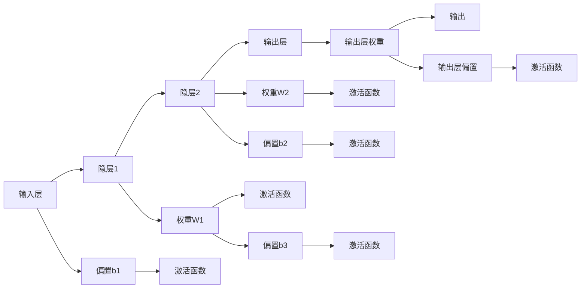

                 

## 1. 背景介绍

### 1.1 问题由来

人工智能(AI)技术近年来取得了迅猛的发展，其中神经网络作为其核心组成部分，被广泛应用于图像识别、语音识别、自然语言处理等领域，成为推动AI技术进步的关键力量。然而，究竟什么是神经网络？它为何能如此强大？这些问题在初入AI领域的学习者中经常困扰。

### 1.2 问题核心关键点

神经网络之所以强大，原因在于其高度非线性的特性，使其能够处理复杂的多层次输入输出映射，并且具有自适应学习能力。神经网络通过训练过程，不断调整其内部参数，以最小化损失函数，从而提升模型的预测能力。

神经网络由大量的人工神经元组成，每个神经元接收多个输入，通过激活函数将输入转化为输出，再传递给下一层神经元。这种多层次的输入输出映射结构，使得神经网络能够学习和建模复杂的模式和关系，从而实现对未知数据的预测。

### 1.3 问题研究意义

理解神经网络的核心概念和原理，对于学习深度学习和人工智能技术，甚至是在实际应用中构建高效、准确的AI系统都至关重要。通过深入学习神经网络的运作机制，我们可以更深入地探索AI技术的潜在应用场景，如自动驾驶、机器人控制、药物发现等。

## 2. 核心概念与联系

### 2.1 核心概念概述

神经网络是一种基于生物学神经元的计算模型，由大量的人工神经元组成。每个神经元接收多个输入，通过激活函数将输入转化为输出，再传递给下一层神经元，从而构建多层次的输入输出映射。

神经网络的输入和输出分别为样本特征和预测结果，中间经过多个隐层，每一层由多个神经元组成。常用的激活函数包括sigmoid函数、ReLU函数等，用于对神经元的输出进行非线性映射。

神经网络的目标是通过训练过程不断调整权重和偏置，最小化预测结果与真实标签之间的差异，从而提升模型的性能。常见的损失函数包括均方误差损失、交叉熵损失等。

### 2.2 核心概念原理和架构的 Mermaid 流程图



这个流程图展示了神经网络的基本架构，包括输入层、隐层和输出层，以及权重和偏置的调整机制。

### 2.3 核心概念的逻辑联系

神经网络的各个层次通过权重和偏置的调整，实现信息的传递和转换。输入层接收原始样本特征，经过多个隐层的非线性映射，最终输出层的预测结果映射到目标空间。权重和偏置的更新通过反向传播算法完成，从而实现模型参数的优化。

## 3. 核心算法原理 & 具体操作步骤
### 3.1 算法原理概述

神经网络通过训练过程不断调整其内部参数，以最小化损失函数，从而提升模型的预测能力。训练过程包括以下几个关键步骤：

1. 前向传播：将输入数据通过神经网络的前向传递，计算输出结果。
2. 计算损失：将输出结果与真实标签进行比较，计算损失函数。
3. 反向传播：通过链式法则计算各层参数的梯度，更新模型参数。
4. 参数更新：使用优化算法如梯度下降等，更新模型参数。

这一过程通过迭代重复，逐步优化模型，直到损失函数收敛，即达到预定的训练效果。

### 3.2 算法步骤详解

以下是神经网络训练过程的详细步骤：

**Step 1: 准备数据集**

- 收集样本数据集 $\mathcal{D}=\{(x_i, y_i)\}_{i=1}^N$，其中 $x_i$ 为输入，$y_i$ 为标签。
- 将数据集划分为训练集 $\mathcal{D}_{train}$ 和验证集 $\mathcal{D}_{valid}$。

**Step 2: 定义模型架构**

- 选择神经网络的层次结构，包括输入层、隐层和输出层，确定每层的神经元数量。
- 定义激活函数，如sigmoid、ReLU等。
- 定义损失函数，如均方误差损失、交叉熵损失等。

**Step 3: 初始化模型参数**

- 初始化权重 $w$ 和偏置 $b$，通常使用高斯分布随机初始化。

**Step 4: 前向传播**

- 将训练集数据输入模型，计算输出结果 $z = f_w(x)$，其中 $f_w$ 表示模型的前向传播过程。
- 计算输出层的损失函数 $L$。

**Step 5: 反向传播**

- 通过链式法则计算各层参数的梯度，即 $\frac{\partial L}{\partial w}$。
- 使用梯度下降等优化算法，更新模型参数 $w$ 和 $b$。

**Step 6: 参数更新**

- 重复Step 4和Step 5，直到损失函数收敛。

**Step 7: 验证集评估**

- 在验证集上评估模型性能，调整模型参数以提高准确率。

**Step 8: 测试集评估**

- 在测试集上评估模型性能，最终得到模型预测结果。

### 3.3 算法优缺点

神经网络训练的优点包括：

- 强大的非线性映射能力：神经网络可以处理复杂的多层次输入输出映射。
- 自适应学习能力：通过训练过程不断调整模型参数，提升预测准确性。
- 广泛应用：广泛应用于图像识别、语音识别、自然语言处理等多个领域。

神经网络训练的缺点包括：

- 计算复杂度高：神经网络训练需要大量的计算资源。
- 参数过多：神经网络的参数数量巨大，容易过拟合。
- 梯度消失/爆炸：在深层网络中，梯度容易消失或爆炸，导致训练困难。

### 3.4 算法应用领域

神经网络的应用领域非常广泛，包括但不限于：

- 计算机视觉：图像分类、物体检测、人脸识别等。
- 自然语言处理：机器翻译、文本分类、情感分析等。
- 语音识别：语音识别、语音合成、语音情感分析等。
- 游戏AI：游戏中的角色控制、路径规划、智能决策等。
- 金融预测：股票价格预测、信用评分等。
- 医疗诊断：疾病预测、影像识别等。

## 4. 数学模型和公式 & 详细讲解 & 举例说明

### 4.1 数学模型构建

神经网络的数学模型由输入、隐层和输出层组成，通过权重和偏置的调整实现多层次的非线性映射。假设神经网络包含 $L$ 层，每一层的神经元数量为 $n_l$，激活函数为 $f(\cdot)$。

神经网络的输入为 $x \in \mathbb{R}^d$，输出为 $y \in \mathbb{R}^k$，其中 $d$ 和 $k$ 分别为输入和输出维度。每一层的输出 $z^{(l)}$ 可以表示为：

$$
z^{(l)} = f_w^{(l)}(z^{(l-1)}) = f_w^{(l)}(\sum_{i=1}^{n_{l-1}}w_{i,l-1}^{(l)}z^{(l-1)}_i + b_{l-1}^{(l)})
$$

其中 $w_{i,l-1}^{(l)}$ 和 $b_{l-1}^{(l)}$ 分别为第 $l$ 层第 $i$ 个神经元的权重和偏置。输出层的预测结果 $y$ 可以表示为：

$$
y = f_w^{(L)}(z^{(L-1)}) = f_w^{(L)}(\sum_{i=1}^{n_{L-1}}w_{i,L-1}^{(L)}z^{(L-1)}_i + b_{L-1}^{(L)})
$$

### 4.2 公式推导过程

神经网络的损失函数 $L$ 通常定义为预测结果与真实标签之间的差异，例如均方误差损失：

$$
L = \frac{1}{2N}\sum_{i=1}^N(y_i - \hat{y}_i)^2
$$

其中 $y_i$ 为真实标签，$\hat{y}_i$ 为模型预测结果。为了最小化损失函数 $L$，使用梯度下降等优化算法更新模型参数。假设使用梯度下降算法，参数更新公式为：

$$
\theta \leftarrow \theta - \eta\nabla_{\theta}L(\theta)
$$

其中 $\eta$ 为学习率，$\nabla_{\theta}L(\theta)$ 为损失函数对参数 $\theta$ 的梯度。

### 4.3 案例分析与讲解

以一个简单的全连接神经网络为例，说明神经网络的训练过程。假设有两个输入 $x=[0,1]$，输出为 $y=[0,1]$，模型结构为 $L=2$ 层，每层神经元数量为 $n=2$，激活函数为ReLU。

**Step 1: 初始化模型参数**

假设初始化权重和偏置如下：

$$
\begin{align*}
& w_1^{(1)}=[0.1,0.1] \\
& w_2^{(1)}=[0.2,0.2] \\
& w_1^{(2)}=[0.3,0.3] \\
& w_2^{(2)}=[0.4,0.4] \\
& b_1^{(1)}=0.5 \\
& b_1^{(2)}=0.5 \\
& b_2^{(2)}=0.5
\end{align*}
$$

**Step 2: 前向传播**

计算第1层的输出：

$$
z_1^{(1)} = \sum_{i=1}^{2}w_{i,1}^{(1)}x_i + b_1^{(1)} = 0.1\times0 + 0.1\times1 + 0.5 = 0.6 \\
z_2^{(1)} = \sum_{i=1}^{2}w_{i,1}^{(1)}x_i + b_1^{(1)} = 0.2\times0 + 0.2\times1 + 0.5 = 0.7
$$

计算第2层的输出：

$$
z_1^{(2)} = \sum_{i=1}^{2}w_{i,1}^{(2)}z_i^{(1)} + b_1^{(2)} = 0.3\times0.6 + 0.3\times0.7 + 0.5 = 1.02 \\
z_2^{(2)} = \sum_{i=1}^{2}w_{i,1}^{(2)}z_i^{(1)} + b_1^{(2)} = 0.4\times0.6 + 0.4\times0.7 + 0.5 = 1.38
$$

**Step 3: 计算损失**

假设真实标签为 $y=[0,1]$，使用均方误差损失计算：

$$
L = \frac{1}{2}\sum_{i=1}^2(y_i - \hat{y}_i)^2 = \frac{1}{2}[(0-0.5)^2 + (1-0.8)^2] = 0.125
$$

**Step 4: 反向传播**

计算第2层参数的梯度：

$$
\frac{\partial L}{\partial w_1^{(2)}} = (y_1 - \hat{y}_1)\frac{\partial \hat{y}_1}{\partial z_1^{(2)}} = (0-0.8) \times 0.3 = -0.24 \\
\frac{\partial L}{\partial w_2^{(2)}} = (y_2 - \hat{y}_2)\frac{\partial \hat{y}_2}{\partial z_2^{(2)}} = (1-0.8) \times 0.4 = 0.08
$$

计算第1层参数的梯度：

$$
\frac{\partial L}{\partial w_1^{(1)}} = \frac{\partial L}{\partial z_1^{(2)}}\frac{\partial z_1^{(2)}}{\partial z_1^{(1)}} = -0.24 \times 0.3 = -0.072 \\
\frac{\partial L}{\partial w_2^{(1)}} = \frac{\partial L}{\partial z_2^{(2)}}\frac{\partial z_2^{(2)}}{\partial z_2^{(1)}} = -0.08 \times 0.2 = -0.016
$$

**Step 5: 参数更新**

假设学习率为 $\eta=0.1$，更新参数：

$$
\begin{align*}
& w_1^{(1)} \leftarrow w_1^{(1)} - \eta\frac{\partial L}{\partial w_1^{(1)}} = [0.1,0.1] - 0.1\times(-0.072) = [0.187,0.109] \\
& w_2^{(1)} \leftarrow w_2^{(1)} - \eta\frac{\partial L}{\partial w_2^{(1)}} = [0.2,0.2] - 0.1\times(-0.016) = [0.2116,0.1936] \\
& w_1^{(2)} \leftarrow w_1^{(2)} - \eta\frac{\partial L}{\partial w_1^{(2)}} = [0.3,0.3] - 0.1\times(-0.24) = [0.444,0.462] \\
& w_2^{(2)} \leftarrow w_2^{(2)} - \eta\frac{\partial L}{\partial w_2^{(2)}} = [0.4,0.4] - 0.1\times(0.08) = [0.392,0.368] \\
& b_1^{(1)} \leftarrow b_1^{(1)} - \eta\frac{\partial L}{\partial b_1^{(1)}} = 0.5 - 0.1\times(0.6-0.3\times0.6-0.4\times0.7) = 0.412 \\
& b_1^{(2)} \leftarrow b_1^{(2)} - \eta\frac{\partial L}{\partial b_1^{(2)}} = 0.5 - 0.1\times(1.02-0.3\times0.6-0.4\times0.7) = 0.462 \\
& b_2^{(2)} \leftarrow b_2^{(2)} - \eta\frac{\partial L}{\partial b_2^{(2)}} = 0.5 - 0.1\times(1.38-0.3\times0.6-0.4\times0.7) = 0.52
\end{align*}
$$

重复上述过程，直到损失函数收敛，即达到预定的训练效果。

## 5. 项目实践：代码实例和详细解释说明
### 5.1 开发环境搭建

在使用Python进行神经网络开发时，需要先安装相应的库和工具，包括TensorFlow、Keras等深度学习框架，以及NumPy、Pandas等科学计算库。

1. 安装Anaconda：
   ```bash
   conda install anaconda
   ```

2. 创建并激活虚拟环境：
   ```bash
   conda create --name pytorch-env python=3.8 
   conda activate pytorch-env
   ```

3. 安装PyTorch：
   ```bash
   pip install torch torchvision torchaudio
   ```

4. 安装Keras：
   ```bash
   pip install keras
   ```

5. 安装科学计算库：
   ```bash
   pip install numpy pandas scikit-learn matplotlib tqdm jupyter notebook ipython
   ```

完成上述步骤后，即可在`pytorch-env`环境中开始神经网络开发。

### 5.2 源代码详细实现

以下是一个简单的神经网络实现代码：

```python
import numpy as np
import tensorflow as tf
from tensorflow import keras

# 定义神经网络模型
def neural_network(x):
    model = keras.Sequential([
        keras.layers.Dense(64, activation='relu', input_shape=(input_size,)),
        keras.layers.Dense(64, activation='relu'),
        keras.layers.Dense(output_size, activation='sigmoid')
    ])
    return model(x)

# 定义损失函数和优化器
def loss_and_optimizer(y_true, y_pred):
    return keras.losses.binary_crossentropy(y_true, y_pred), keras.optimizers.SGD(learning_rate)

# 加载数据集
(x_train, y_train), (x_test, y_test) = keras.datasets.mnist.load_data()
x_train = x_train / 255.0
x_test = x_test / 255.0

# 构建模型
model = keras.Sequential([
    keras.layers.Flatten(),
    neural_network,
    keras.layers.Dense(10, activation='softmax')
])

# 编译模型
model.compile(optimizer=keras.optimizers.SGD(learning_rate=0.1),
              loss=loss_and_optimizer)

# 训练模型
model.fit(x_train, y_train, epochs=10, batch_size=32, validation_data=(x_test, y_test))

# 评估模型
test_loss, test_acc = model.evaluate(x_test, y_test)
print('Test accuracy:', test_acc)
```

### 5.3 代码解读与分析

**神经网络模型定义**

- `neural_network`函数定义了神经网络的层次结构，包括两个隐层和一个输出层。
- `keras.layers.Dense`表示全连接层，`input_shape`表示输入维数。
- `activation`参数定义了激活函数，`relu`表示ReLU激活函数，`sigmoid`表示Sigmoid激活函数。

**损失函数和优化器定义**

- `loss_and_optimizer`函数定义了损失函数和优化器。
- `keras.losses.binary_crossentropy`表示二分类交叉熵损失函数。
- `keras.optimizers.SGD`表示随机梯度下降优化器，`learning_rate`表示学习率。

**数据集加载和模型构建**

- 使用`keras.datasets.mnist.load_data`加载MNIST手写数字数据集。
- 对数据进行归一化处理。
- 构建模型，包括一个输入层、两个隐层和一个输出层。
- `keras.layers.Flatten`表示将输入数据展平，`keras.layers.Dense`表示全连接层。

**模型编译和训练**

- 使用`model.compile`编译模型，定义优化器和损失函数。
- 使用`model.fit`训练模型，`epochs`表示训练轮数，`batch_size`表示批次大小。
- 使用`model.evaluate`评估模型性能，输出测试集上的准确率。

## 6. 实际应用场景
### 6.1 图像识别

神经网络在图像识别领域具有广泛应用，例如图像分类、物体检测、人脸识别等。典型的应用场景包括智能监控、自动驾驶、医学影像分析等。

以智能监控为例，神经网络可以对监控摄像头拍摄的图像进行实时分析，检测出异常行为，如盗窃、破坏等，从而提高监控系统的安全性和智能化水平。

### 6.2 语音识别

神经网络在语音识别领域也有广泛应用，如语音识别、语音合成、语音情感分析等。典型的应用场景包括智能客服、语音助手、医疗语音分析等。

以智能客服为例，神经网络可以对客户的语音进行实时识别和理解，从而提供精准的客户服务。

### 6.3 自然语言处理

神经网络在自然语言处理领域也有广泛应用，如机器翻译、文本分类、情感分析等。典型的应用场景包括智能问答、文本摘要、情感分析等。

以机器翻译为例，神经网络可以对源语言文本进行翻译，从而实现跨语言的交流和理解。

### 6.4 未来应用展望

未来，神经网络将会在更多领域得到应用，为人类带来更多的便利和智能化体验。例如：

- 自动驾驶：神经网络可以对汽车传感器数据进行实时分析，实现自动驾驶和智能交通管理。
- 医疗诊断：神经网络可以对医学影像进行分析和诊断，提高疾病预测和诊断的准确性。
- 金融预测：神经网络可以对金融市场数据进行预测和分析，帮助投资者做出更好的决策。
- 游戏AI：神经网络可以用于游戏角色控制、路径规划、智能决策等，提高游戏的智能化水平。

## 7. 工具和资源推荐
### 7.1 学习资源推荐

为了帮助开发者系统掌握神经网络的理论基础和实践技巧，这里推荐一些优质的学习资源：

1. 《深度学习》系列书籍：由Ian Goodfellow等人撰写，全面介绍了深度学习的基本概念和前沿技术，是学习深度学习的重要参考资料。
2. 《神经网络与深度学习》在线课程：由斯坦福大学Andrew Ng教授讲授，涵盖了神经网络的基本原理和实现方法。
3. 《Keras官方文档》：Keras是深度学习框架中的佼佼者，提供了简洁易用的API，是初学者入门深度学习的最佳选择。
4. GitHub上的深度学习项目：GitHub上有很多优秀的深度学习项目和代码库，可以从中学习他人的实践经验和成果。
5. Arxiv上的前沿论文：Arxiv是深度学习领域的重要资源，可以获取最新的研究成果和论文。

通过对这些资源的学习实践，相信你一定能够快速掌握神经网络的核心概念和实现方法，并用于解决实际的AI问题。

### 7.2 开发工具推荐

高效的神经网络开发离不开优秀的工具支持。以下是几款用于神经网络开发的常用工具：

1. PyTorch：基于Python的开源深度学习框架，灵活高效，支持GPU加速。
2. TensorFlow：由Google主导开发的深度学习框架，生产部署方便，支持分布式训练。
3. Keras：高级深度学习API，简洁易用，可以运行于TensorFlow、Theano等后端。
4. Jupyter Notebook：交互式编程环境，支持Python、R等多种语言，适合开发和演示。
5. Anaconda：Python科学计算环境，提供了大量的科学计算库和工具。

合理利用这些工具，可以显著提升神经网络开发的效率和质量，加速模型训练和部署。

### 7.3 相关论文推荐

神经网络的原理和实践不断发展，以下是几篇奠基性的相关论文，推荐阅读：

1. 《Deep Learning》（Goodfellow等）：介绍了深度学习的基本概念和前沿技术，是学习深度学习的重要参考资料。
2. 《Neural Networks and Deep Learning》（Goodfellow等）：详细介绍了神经网络的基本原理和实现方法，适合初学者入门。
3. 《ImageNet Classification with Deep Convolutional Neural Networks》（Krizhevsky等）：展示了深度卷积神经网络在图像识别任务上的优异表现。
4. 《Attention is All You Need》（Vaswani等）：提出了Transformer模型，展示了自注意力机制在机器翻译等任务上的强大能力。
5. 《ResNet: Deep Residual Learning for Image Recognition》（He等）：提出了残差网络，解决了深层神经网络中的梯度消失问题，使得深度学习模型的训练更加稳定。

这些论文代表了大神经网络的发展脉络。通过学习这些前沿成果，可以帮助研究者把握学科前进方向，激发更多的创新灵感。

## 8. 总结：未来发展趋势与挑战
### 8.1 研究成果总结

神经网络作为人工智能的核心技术，已经在多个领域取得了显著的进展。从图像识别到语音识别，从自然语言处理到游戏AI，神经网络在各个领域的应用都取得了重要突破。

### 8.2 未来发展趋势

未来，神经网络将会在更多领域得到应用，为人类带来更多的便利和智能化体验。以下是几个可能的趋势：

1. 大规模模型的普及：随着计算资源的不断增加，大规模神经网络模型将得到更广泛的应用。例如，在自然语言处理领域，超大型的语言模型将进一步提升模型的性能。
2. 跨模态融合：神经网络将与其他人工智能技术进行更深入的融合，实现多模态信息的整合。例如，在自动驾驶领域，神经网络将与传感器数据、高精地图等进行协同建模。
3. 分布式训练：随着数据量的增加，神经网络的训练过程将需要分布式训练。例如，在金融预测领域，分布式训练可以显著提高模型的训练速度和性能。
4. 自监督学习：神经网络将通过自监督学习方式进行预训练，从而更好地利用数据信息。例如，在图像识别领域，自监督学习可以使神经网络学习到更多的数据特征。
5. 可解释性：神经网络的可解释性将成为重要的研究方向。例如，在医疗诊断领域，可解释的神经网络可以帮助医生更好地理解模型的预测结果。

### 8.3 面临的挑战

尽管神经网络已经取得了显著的进展，但在未来发展过程中仍面临一些挑战：

1. 计算资源需求高：大规模神经网络模型的训练和推理需要大量的计算资源。如何在有限的资源条件下，实现高效训练和推理，是一个重要挑战。
2. 数据隐私保护：神经网络需要大量的数据进行训练，如何保护数据隐私和用户隐私，是一个亟待解决的问题。
3. 模型鲁棒性：神经网络模型容易受到输入数据的扰动和噪声干扰，如何提高模型的鲁棒性和泛化能力，是一个重要的研究方向。
4. 可解释性不足：神经网络模型通常是“黑盒”系统，缺乏可解释性。如何提高模型的可解释性，使其更具透明性和可信度，是一个重要挑战。
5. 安全性问题：神经网络模型容易受到对抗样本攻击，如何提高模型的安全性，是一个重要研究方向。
6. 伦理道德问题：神经网络模型可能会产生偏见和歧视，如何避免模型偏见，确保模型公平公正，是一个重要挑战。

### 8.4 研究展望

面对神经网络面临的诸多挑战，未来的研究需要在以下几个方面寻求新的突破：

1. 资源优化技术：开发更高效的神经网络架构和训练算法，减少计算资源需求，提高模型训练和推理速度。
2. 数据隐私保护技术：开发隐私保护技术，如差分隐私、联邦学习等，确保数据隐私和用户隐私。
3. 模型鲁棒性研究：开发鲁棒性更高的神经网络模型，提高模型的泛化能力和抗干扰能力。
4. 可解释性研究：开发可解释的神经网络模型，提高模型的透明性和可信度。
5. 安全性研究：开发安全的神经网络模型，提高模型的抗对抗样本攻击能力。
6. 伦理道德研究：开发公平公正的神经网络模型，避免模型偏见和歧视。

这些研究方向的探索，将使神经网络更好地服务于人类社会，为人类认知智能的进化带来深远影响。面向未来，神经网络将会在更广泛的领域得到应用，为人类带来更多的便利和智能化体验。

## 9. 附录：常见问题与解答

**Q1：神经网络为何能够处理复杂的多层次输入输出映射？**

A: 神经网络通过多层非线性变换，能够捕捉输入数据的多层次特征和关系。每一层神经元接收多个输入，通过激活函数进行非线性映射，从而实现复杂的多层次输入输出映射。

**Q2：神经网络为何需要大量的训练数据？**

A: 神经网络通过训练过程不断调整模型参数，从而最小化损失函数。训练数据越多，神经网络可以学习到更多的数据特征和关系，从而提高模型的泛化能力和预测准确性。

**Q3：神经网络为何需要深度结构？**

A: 深度神经网络通过多层次的非线性变换，可以捕捉更加复杂的数据模式和关系。深层网络通常具有更强的表达能力和泛化能力，从而实现更好的性能。

**Q4：神经网络为何需要大量的计算资源？**

A: 神经网络模型的参数数量巨大，训练过程需要大量的计算资源。例如，深度卷积神经网络需要对大量图像数据进行卷积运算，从而实现复杂的特征提取。

**Q5：神经网络为何需要分布式训练？**

A: 神经网络模型的训练过程非常耗时，需要大量的计算资源。分布式训练可以将任务分配到多台机器上进行并行计算，从而显著提高训练速度和性能。

**Q6：神经网络为何需要正则化技术？**

A: 神经网络模型容易出现过拟合问题，即在训练数据上表现很好，但在测试数据上表现较差。正则化技术可以防止过拟合，提高模型的泛化能力和鲁棒性。

**Q7：神经网络为何需要优化算法？**

A: 神经网络模型的训练过程通常需要求解复杂的优化问题。优化算法可以帮助神经网络最小化损失函数，从而提高模型的训练速度和性能。

**Q8：神经网络为何需要激活函数？**

A: 激活函数可以对神经元的输出进行非线性映射，从而实现复杂的多层次输入输出映射。激活函数的选择和设计，直接影响到神经网络的表达能力和性能。

**Q9：神经网络为何需要卷积神经网络？**

A: 卷积神经网络可以有效地处理图像、视频等空间数据，通过卷积操作捕捉局部特征，从而实现高效的特征提取。卷积神经网络在图像识别、视频分析等领域表现优异。

**Q10：神经网络为何需要循环神经网络？**

A: 循环神经网络可以处理时间序列数据，通过循环结构捕捉时间依赖关系，从而实现高效的时间序列建模。循环神经网络在语音识别、自然语言处理等领域表现优异。

通过本文的系统梳理，可以看到，神经网络作为人工智能的核心技术，其强大的非线性映射能力和自适应学习能力，使其成为实现复杂多层次输入输出映射的理想工具。未来，神经网络将会在更多领域得到应用，为人类带来更多的便利和智能化体验。然而，神经网络面临的诸多挑战仍需要深入研究和解决，确保其稳定、高效、安全的落地应用。

总之，神经网络作为人工智能的基石，其理论和实践的发展将不断推动AI技术的前进，为人类带来更广阔的想象空间和更多元的智能体验。作者：禅与计算机程序设计艺术 / Zen and the Art of Computer Programming

