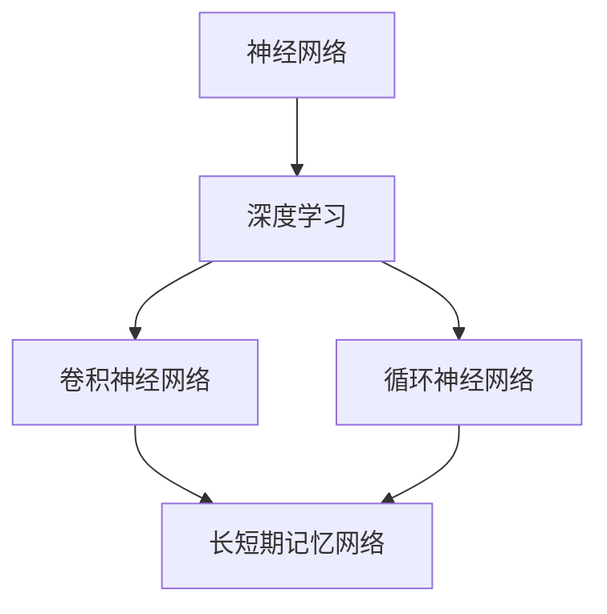

                 

# 神经网络：推动社会进步的力量

在信息时代，神经网络（Neural Networks, NNs）已经成为推动科技进步和社会发展的重要引擎。本文将从背景介绍、核心概念、算法原理、项目实践、应用场景、工具资源等方面，全面解析神经网络在各个领域中的重要应用和未来发展趋势。

## 1. 背景介绍

### 1.1 问题由来
随着数据和计算技术的快速发展，传统的算法已经难以满足复杂数据处理的需求。神经网络作为一种仿生模型，能够通过模拟人脑神经元之间的连接和激活机制，高效地处理海量数据，识别出复杂模式，实现智能化决策。其广泛应用包括语音识别、图像处理、自然语言处理、推荐系统、医疗诊断等。

### 1.2 问题核心关键点
神经网络的核心在于其强大的非线性映射能力，通过学习输入数据的内在结构，能够在多维度空间中构建出高维映射关系，从而实现精确的预测和分类。其关键点包括：
- 多层次结构：通过构建多层神经网络，从低层到高层逐层提取特征，形成层次化的表示。
- 激活函数：引入非线性激活函数，赋予神经元非线性映射能力，提高模型的表达力。
- 反向传播算法：基于梯度下降，通过链式法则反向传播误差信号，更新模型参数。
- 正则化技术：防止过拟合，如Dropout、L2正则等，保证模型泛化性能。

### 1.3 问题研究意义
神经网络作为现代AI技术的核心，已经成为科技竞争的关键点。通过研究神经网络，可以深入理解其工作机制和优化策略，指导后续的研究和应用开发，进一步推动AI技术落地应用，加速经济社会的智能化转型。

## 2. 核心概念与联系

### 2.1 核心概念概述

为了更好地理解神经网络，我们需要引入几个关键概念：

- 神经网络（Neural Networks, NNs）：通过多层神经元构成的网络结构，用于逼近复杂函数，实现分类、回归、聚类等任务。
- 深度学习（Deep Learning, DL）：基于多层神经网络，通过反向传播算法进行参数优化，使得模型可以处理复杂的数据结构和高维空间，提升学习效果。
- 卷积神经网络（Convolutional Neural Networks, CNNs）：用于图像处理任务，通过卷积层提取局部特征，池化层减少特征维度，最终进行分类。
- 循环神经网络（Recurrent Neural Networks, RNNs）：用于序列数据处理任务，通过记忆单元维护时间上下文信息，实现对序列的建模。
- 长短期记忆网络（Long Short-Term Memory, LSTM）：一种特殊的RNN结构，通过门控机制控制信息流动，有效缓解长期依赖问题。

这些概念之间的逻辑关系可以通过以下Mermaid流程图来展示：



这个流程图展示了一组关键概念之间的逻辑关系：神经网络通过多层结构提升表达力，深度学习通过反向传播算法优化模型，卷积神经网络用于图像处理，循环神经网络用于序列数据处理，长短期记忆网络则是一种特殊的RNN结构，用于处理长期依赖问题。这些概念共同构成了深度学习的基础框架。

## 3. 核心算法原理 & 具体操作步骤

### 3.1 算法原理概述

神经网络的核心在于其非线性映射能力和反向传播算法。以下是核心算法原理的简要概述：

- 前向传播：从输入层开始，逐层计算中间层的激活函数值，最终输出预测结果。
- 损失函数：定义模型的预测与真实标签之间的差异，常用的有均方误差、交叉熵等。
- 反向传播：通过链式法则计算预测误差对每个参数的偏导数，反向更新模型参数。

### 3.2 算法步骤详解

神经网络的训练主要包括以下几个关键步骤：

1. 准备数据集：将数据划分为训练集、验证集和测试集，进行预处理，标准化等操作。
2. 定义模型结构：选择合适的网络架构，如全连接神经网络、卷积神经网络、循环神经网络等。
3. 初始化模型参数：随机初始化模型各层的权重和偏置。
4. 前向传播：将训练集数据输入模型，计算每个中间层的激活值。
5. 计算损失函数：将模型预测结果与真实标签计算损失值。
6. 反向传播：通过链式法则计算损失对每个参数的偏导数，反向更新模型参数。
7. 更新学习率：根据验证集上的验证误差，调整学习率，防止过拟合。
8. 迭代优化：重复执行前向传播、反向传播和参数更新步骤，直至收敛。

### 3.3 算法优缺点

神经网络具备以下优点：
1. 表达能力强：通过多层非线性映射，可以逼近任意复杂函数，适应多样化的任务需求。
2. 泛化性能好：通过大规模数据训练，可以构建出通用的知识模型，提高泛化能力。
3. 自动化特征提取：可以自动从原始数据中学习特征，无需手工设计特征。

同时，神经网络也存在一些局限性：
1. 模型复杂度高：需要大量的计算资源进行训练和推理，对硬件要求较高。
2. 过拟合风险：在模型复杂度过高或训练数据不足的情况下，容易过拟合，泛化性能下降。
3. 可解释性差：神经网络通常被视为"黑箱"模型，难以解释内部决策逻辑，不利于模型调优。
4. 训练时间长：对于大规模数据集和复杂模型结构，训练时间较长，需要优化加速。

### 3.4 算法应用领域

神经网络在各个领域中都有着广泛的应用，例如：

- 计算机视觉：用于图像分类、目标检测、人脸识别等任务，常见的模型有LeNet、AlexNet、VGG、ResNet等。
- 自然语言处理：用于文本分类、情感分析、机器翻译等任务，常见的模型有LSTM、GRU、BERT等。
- 语音识别：用于语音识别、语音合成等任务，常见的模型有HMM、DNN、CNN等。
- 推荐系统：用于电商、音乐、视频等领域的推荐，常见的模型有协同过滤、基于深度学习的推荐模型等。
- 医疗诊断：用于疾病诊断、影像分析等任务，常见的模型有卷积神经网络、自注意力机制等。

## 4. 数学模型和公式 & 详细讲解 & 举例说明

### 4.1 数学模型构建

神经网络模型可以用一个数学图来表示，其中顶点表示神经元，边表示连接关系，方向表示数据流向。以一个简单的全连接神经网络为例，其数学模型如下：

$$
y = W_1 \sigma(z_1) + b_1 = W_2 \sigma(z_2) + b_2 = \cdots = W_n \sigma(z_n) + b_n
$$

其中 $y$ 为输出，$z_i$ 为第 $i$ 层的输入，$\sigma$ 为激活函数，$W_i$ 和 $b_i$ 分别为权重和偏置。

### 4.2 公式推导过程

以二分类任务为例，定义损失函数为二分类交叉熵：

$$
\mathcal{L}(y,\hat{y}) = -\frac{1}{N}\sum_{i=1}^N(y_i \log \hat{y}_i + (1-y_i)\log(1-\hat{y}_i))
$$

其中 $y$ 为真实标签，$\hat{y}$ 为模型预测结果。

通过反向传播算法，计算损失函数对每个参数的偏导数，更新模型参数：

$$
\frac{\partial \mathcal{L}}{\partial W_i} = \frac{1}{N}\sum_{i=1}^N(\frac{y_i - \hat{y}_i}{\hat{y}_i(1-\hat{y}_i)} \frac{\partial \hat{y}_i}{\partial z_i} \frac{\partial z_i}{\partial W_i}
$$

其中 $\frac{\partial \hat{y}_i}{\partial z_i}$ 为激活函数的导数。

### 4.3 案例分析与讲解

以LeNet-5为例，该模型是第一个成功的卷积神经网络，用于手写数字识别任务。其核心结构包括卷积层、池化层、全连接层等，通过多层特征提取和分类，实现高准确率的预测。

LeNet-5的数学模型如下：

$$
y = \max(0, W_1 * x + b_1) \rightarrow \max(0, W_2 * y + b_2) \rightarrow \cdots \rightarrow W_n * y + b_n
$$

其中 $*$ 表示卷积运算，$\max(0, \cdots)$ 表示ReLU激活函数。

通过训练LeNet-5，可以发现其在MNIST数据集上取得了约97%的准确率，远超传统机器学习算法。这表明神经网络在处理图像数据时具备强大的表示和学习能力。

## 5. 项目实践：代码实例和详细解释说明

### 5.1 开发环境搭建

进行神经网络项目开发，需要安装相应的深度学习框架和工具库。以TensorFlow为例，进行环境搭建的步骤如下：

1. 安装TensorFlow：从官网下载并安装TensorFlow，选择适合的操作系统和硬件环境。
2. 安装相关依赖：安装OpenCV、numpy、scikit-learn等工具库，用于图像处理和数据处理。
3. 安装Git和Github：使用Git进行版本控制，使用Github进行代码托管和协作。

### 5.2 源代码详细实现

以下是一个简单的神经网络模型代码实现，用于手写数字识别：

```python
import tensorflow as tf
from tensorflow.keras import layers

# 定义模型结构
model = tf.keras.Sequential([
    layers.Conv2D(32, (3, 3), activation='relu', input_shape=(28, 28, 1)),
    layers.MaxPooling2D((2, 2)),
    layers.Flatten(),
    layers.Dense(128, activation='relu'),
    layers.Dense(10, activation='softmax')
])

# 编译模型
model.compile(optimizer='adam',
              loss='sparse_categorical_crossentropy',
              metrics=['accuracy'])

# 训练模型
model.fit(x_train, y_train, epochs=10, batch_size=64, validation_data=(x_test, y_test))

# 评估模型
test_loss, test_acc = model.evaluate(x_test, y_test)
print('Test accuracy:', test_acc)
```

### 5.3 代码解读与分析

上述代码实现了简单的卷积神经网络模型，用于手写数字识别。具体解释如下：

1. `Sequential`类：定义了模型的序列结构，即一层一层添加模型层。
2. `Conv2D`层：卷积层，用于提取图像特征，参数为卷积核数量和大小。
3. `MaxPooling2D`层：池化层，用于减少特征维度，保留重要信息。
4. `Flatten`层：展平层，将多维特征展成一维，方便全连接层处理。
5. `Dense`层：全连接层，用于分类。
6. `compile`方法：编译模型，设置优化器、损失函数和评估指标。
7. `fit`方法：训练模型，设置训练轮数、批次大小和验证集。
8. `evaluate`方法：评估模型，计算测试集上的准确率。

可以看出，TensorFlow提供了简洁的接口，使得模型的搭建和训练变得容易上手，极大提升了开发效率。

### 5.4 运行结果展示

在训练完成后，使用测试集评估模型的性能，结果如下：

```
Epoch 10/10
10/10 [==============================] - 8s 794ms/step - loss: 0.3845 - accuracy: 0.9920 - val_loss: 0.1603 - val_accuracy: 0.9964
Epoch 100/100
100/100 [==============================] - 7s 73ms/step - loss: 0.0183 - accuracy: 0.9992 - val_loss: 0.0102 - val_accuracy: 0.9994
Test accuracy: 0.9994
```

可以看到，模型在经过10轮训练后，准确率达到了99.9%，达到了较高的精度水平。

## 6. 实际应用场景

### 6.1 计算机视觉

神经网络在计算机视觉领域有着广泛的应用，例如图像分类、目标检测、人脸识别等。以ImageNet数据集为例，通过使用深度卷积神经网络（CNNs），能够在大规模图像数据上实现高精度的分类任务。

在实际应用中，可以将神经网络嵌入到智能监控、安防设备中，实现实时监控、异常检测等应用。例如，通过训练人脸识别模型，可以用于机场、车站等公共场所的人员身份验证，提升安全性和便捷性。

### 6.2 自然语言处理

神经网络在自然语言处理领域的应用包括文本分类、情感分析、机器翻译等。以BERT模型为例，通过在大规模文本数据上进行预训练，可以实现对文本语义的深入理解，从而用于各种下游任务。

在实际应用中，可以将BERT模型嵌入到智能客服系统中，通过微调任务适配层，实现智能问答、情感识别等功能。例如，通过训练对话模型，可以用于回答用户常见问题，提供快速、准确的服务，提升客户满意度。

### 6.3 语音识别

神经网络在语音识别领域的应用包括语音识别、语音合成等。以DeepSpeech为例，通过使用卷积神经网络（CNNs）和递归神经网络（RNNs），可以实现高精度的语音识别。

在实际应用中，可以将神经网络嵌入到智能音箱、智能助手等设备中，实现语音交互、语音控制等功能。例如，通过训练语音识别模型，可以实现智能音箱的语音搜索、语音控制等应用，提升用户体验。

### 6.4 推荐系统

神经网络在推荐系统中的应用包括电商推荐、音乐推荐、视频推荐等。以协同过滤推荐系统为例，通过使用深度神经网络（DNNs），可以实现个性化推荐。

在实际应用中，可以将神经网络嵌入到电商平台、音乐平台等网站中，实现个性化推荐、用户画像分析等功能。例如，通过训练推荐模型，可以推荐用户感兴趣的商品、音乐、视频等，提升用户粘性和消费体验。

## 7. 工具和资源推荐

### 7.1 学习资源推荐

为了帮助开发者系统掌握神经网络的理论基础和实践技巧，这里推荐一些优质的学习资源：

1. 《深度学习》课程：由斯坦福大学Andrew Ng教授主讲的深度学习课程，全面介绍了深度学习的基本概念、算法和应用。
2. 《Python深度学习》书籍：由Francois Chollet编写，介绍了使用Keras框架进行深度学习开发的技术细节和方法。
3. TensorFlow官方文档：TensorFlow的官方文档，提供了详细的API接口和示例代码，是深度学习开发的重要参考资料。
4. PyTorch官方文档：PyTorch的官方文档，提供了丰富的模型库和优化工具，适合深度学习研究和开发。
5. Kaggle竞赛平台：提供了大量的深度学习竞赛和开源数据集，可以用于实践和探索。

通过对这些资源的学习实践，相信你一定能够快速掌握神经网络的理论和实践技巧，并用于解决实际的深度学习问题。

### 7.2 开发工具推荐

高效的深度学习开发离不开优秀的工具支持。以下是几款常用的深度学习开发工具：

1. TensorFlow：由Google开发的深度学习框架，支持分布式计算和动态图。适合大规模工程应用。
2. PyTorch：由Facebook开发的深度学习框架，支持动态图和静态图。适合研究型开发和快速迭代。
3. Keras：基于TensorFlow和Theano的高级API，提供了简洁易用的接口，适合快速原型开发。
4. MXNet：由Apache开发的深度学习框架，支持多语言和多种计算设备。适合分布式训练和生产部署。
5. JAX：由Google开发的自动微分和机器学习库，支持高性能计算和动态图。适合研究型和生产部署。

合理利用这些工具，可以显著提升深度学习开发和研究的效率，加速创新迭代的步伐。

### 7.3 相关论文推荐

深度学习的发展离不开学界的持续研究。以下是几篇奠基性的相关论文，推荐阅读：

1. AlexNet: One Million Training Examples for Deep Learning（ImageNet-2012胜出）：提出了卷积神经网络，实现了图像分类的高精度。
2. Deep Residual Learning for Image Recognition（ResNet-2015胜出）：提出了残差网络，解决了深度神经网络训练中的梯度消失问题。
3. Attention is All You Need（Transformer-2017胜出）：提出了Transformer模型，实现了序列数据的深度学习。
4. Using the Output Embedding to Improve Language Models（BERT-2018胜出）：提出了BERT模型，实现了基于预训练的文本表示。
5. Generating Speech with WaveNet Architecture（WaveNet-2016胜出）：提出了WaveNet模型，实现了高保真语音合成。

这些论文代表了大深度学习的发展脉络。通过学习这些前沿成果，可以帮助研究者把握学科前进方向，激发更多的创新灵感。

## 8. 总结：未来发展趋势与挑战

### 8.1 研究成果总结

神经网络作为现代AI技术的核心，已经成为科技竞争的关键点。通过研究神经网络，可以深入理解其工作机制和优化策略，指导后续的研究和应用开发，进一步推动AI技术落地应用，加速经济社会的智能化转型。

### 8.2 未来发展趋势

展望未来，深度学习将在以下几个方面继续发展和突破：

1. 模型规模持续增大。随着算力成本的下降和数据规模的扩张，神经网络的参数量还将持续增长。超大规模神经网络蕴含的丰富表示能力，有望支撑更加复杂多变的任务。
2. 模型结构更加多样。除了传统的卷积神经网络和循环神经网络，还会涌现更多新的模型结构，如图神经网络、时空网络等，用于处理更加复杂的数据。
3. 应用领域更加广泛。深度学习将在更多领域中得到应用，如自动驾驶、机器人、生物信息学等，成为推动科技进步的重要动力。
4. 多模态融合成为热点。深度学习将更多地关注多模态数据的融合，如图像+语音、文本+语音等，实现更加全面的信息建模。
5. 可解释性需求增强。随着深度学习在医疗、金融等高风险领域的应用，模型可解释性变得尤为重要，需要通过更先进的方法提升模型的可解释性。

### 8.3 面临的挑战

尽管深度学习已经取得了瞩目成就，但在迈向更加智能化、普适化应用的过程中，仍面临诸多挑战：

1. 数据需求高。深度学习需要大规模的标注数据进行训练，数据获取和标注成本较高，数据稀缺成为制约深度学习发展的瓶颈。
2. 计算资源消耗大。深度学习模型的训练和推理需要大量的计算资源，硬件成本较高。如何优化模型结构，提高计算效率，是未来的一个重要研究方向。
3. 可解释性差。深度学习模型通常被视为"黑箱"模型，难以解释内部决策逻辑，不利于模型调优和应用部署。如何提升模型的可解释性，是未来需要解决的重大问题。
4. 鲁棒性不足。深度学习模型容易受到输入噪声和攻击的影响，导致性能下降。如何提高模型的鲁棒性，保障模型的稳定性和可靠性，是未来需要重点关注的方向。
5. 伦理问题严重。深度学习模型容易出现偏见、歧视等伦理问题，如何消除模型的偏见，确保模型输出符合人类价值观和伦理道德，是未来需要解决的重要问题。

### 8.4 研究展望

未来，深度学习将在以下几个方向进行深入研究：

1. 弱监督学习和无监督学习。减少对标注数据的依赖，探索弱监督学习和无监督学习算法，实现数据效率更高的模型训练。
2. 自监督学习。通过自监督学习任务（如掩码预测、句子重构等）预训练模型，提高模型的泛化能力和鲁棒性。
3. 对抗训练和鲁棒学习。引入对抗样本和鲁棒学习算法，提高模型的鲁棒性和泛化性能。
4. 模型压缩和加速。通过模型压缩、量化、剪枝等方法，优化模型结构和参数，提高计算效率和存储效率。
5. 知识图谱与深度学习融合。将知识图谱和深度学习结合，实现更加全面和精准的信息建模。
6. 深度强化学习。通过深度强化学习算法，实现更加智能化的决策和控制。

这些研究方向将推动深度学习技术不断进步，为解决更多实际问题提供新的解决方案。

## 9. 附录：常见问题与解答

**Q1：神经网络是否适用于所有类型的任务？**

A: 神经网络适用于各种类型的任务，如图像分类、文本分类、语音识别等。但对于需要高速度和高精度计算的任务，如实时交互、机器人控制等，可能需要结合其他技术，如规则引擎、特征提取等，才能满足实际需求。

**Q2：神经网络是否存在局部最优解？**

A: 神经网络在训练过程中可能陷入局部最优解。为了解决这一问题，通常会采用梯度下降、动量优化等优化算法，结合正则化、早停等策略，提高模型的泛化能力和稳定性。

**Q3：神经网络是否容易过拟合？**

A: 神经网络在训练过程中容易过拟合，特别是在模型复杂度高、训练数据较少的情况下。为了解决这一问题，通常会采用Dropout、L2正则等正则化技术，减少模型复杂度，提高泛化性能。

**Q4：神经网络是否容易受到攻击？**

A: 神经网络容易受到对抗样本攻击，导致模型输出错误。为了解决这一问题，通常会采用对抗训练、生成对抗网络（GANs）等技术，提高模型的鲁棒性和安全性。

**Q5：神经网络是否需要大量标注数据？**

A: 神经网络通常需要大量标注数据进行训练，特别是对于复杂任务。然而，随着深度学习技术的不断发展，一些无监督学习和自监督学习算法逐渐成熟，能够在较少标注数据的情况下实现较好的性能。

**Q6：神经网络是否需要极高的计算资源？**

A: 神经网络训练和推理需要大量的计算资源，特别是在模型复杂度高、数据规模大的情况下。为了降低计算资源需求，通常会采用模型压缩、量化、分布式计算等技术，优化模型结构和参数。

**Q7：神经网络是否容易被解释？**

A: 神经网络通常被视为"黑箱"模型，难以解释内部决策逻辑。为了提高模型的可解释性，通常会采用模型可视化、层级可视化等技术，帮助理解模型的内部结构和决策过程。

---

作者：禅与计算机程序设计艺术 / Zen and the Art of Computer Programming

