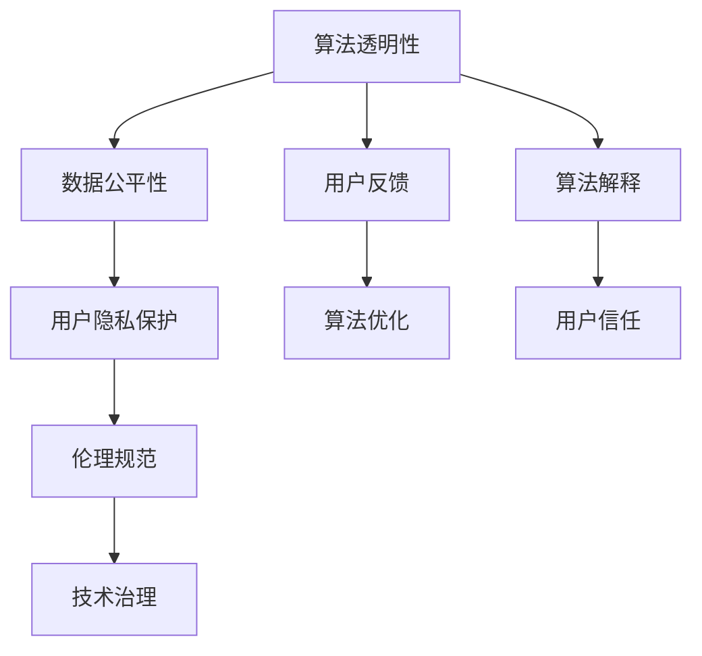

                 

# 算法伦理：构建公平、透明的人工智能时代

> 关键词：算法伦理, 公平性, 透明度, 可解释性, 数据偏见, 隐私保护, 伦理规范, 技术治理

## 1. 背景介绍

### 1.1 问题由来

人工智能(AI)技术的飞速发展，正逐步改变着各行各业的运行模式，带来了巨大的效率提升和创新空间。然而，随着算法的复杂性和智能化程度的提高，也带来了一系列伦理和法律问题，引发了社会各界对算法透明性、公平性和责任归属的广泛关注。

近年来，从人脸识别系统的高误识别率，到招聘算法的性别歧视，再到推荐算法对用户的过度依赖，一系列AI应用中的伦理争议引发了公众热议。这些问题不仅关乎个体的权益保护，也影响着AI技术的公信力和社会接受度。因此，构建公平、透明的人工智能系统，已经成为当前技术发展与伦理治理的关键方向。

### 1.2 问题核心关键点

要构建公平、透明的人工智能系统，必须从多个层面入手，包括算法设计、数据处理、用户反馈、政策法规等。核心问题包括：

- **算法透明性**：确保算法的决策过程和逻辑可以解释，使利益相关者能够理解模型的行为。
- **数据公平性**：保证数据集的多样性和代表性，避免因数据偏见导致的算法歧视。
- **用户隐私保护**：在数据收集和使用过程中，确保用户信息的隐私和安全。
- **伦理规范**：建立统一的AI伦理框架和标准，指导算法设计和应用实践。
- **技术治理**：构建监督机制和问责体系，确保算法的合规性和公正性。

这些问题的解决，需要多学科的协同努力，包括伦理学、法律、社会学、计算机科学等，以确保AI技术在符合伦理和法律的前提下，最大程度发挥其社会价值。

## 2. 核心概念与联系

### 2.1 核心概念概述

为深入理解如何构建公平、透明的人工智能系统，本节将介绍几个核心概念及其相互关系：

- **算法透明性(Algorithm Transparency)**：指算法决策过程的可解释性和可理解性。通过透明算法，使用者可以了解模型的工作原理和决策依据，提升信任感。
- **数据公平性(Fairness of Data)**：指数据集的多样性和代表性，避免因数据不平衡导致的算法偏见。
- **用户隐私保护(User Privacy Protection)**：指在数据收集和使用过程中，确保用户信息的隐私和安全。
- **伦理规范(Ethical Norms)**：指指导算法设计和应用实践的伦理准则和标准。
- **技术治理(Technology Governance)**：指通过监督和问责机制，确保算法合规性和公正性的过程。

这些概念之间的逻辑关系可以通过以下Mermaid流程图来展示：



这个流程图展示了大语言模型的核心概念及其之间的关系：

1. 算法透明性是数据公平性的基础，通过解释算法决策过程，帮助发现和修正数据偏差。
2. 用户隐私保护是伦理规范的重要组成部分，确保数据收集和使用过程中的合法性和道德性。
3. 伦理规范和技术治理共同作用，指导算法设计和应用实践，构建公平、透明的系统。
4. 用户反馈和算法优化相辅相成，在实践中不断改进算法，提升其公平性和透明性。
5. 算法解释和用户信任相互作用，透明的决策过程能增强用户信任感，从而促进算法的广泛应用。

这些概念共同构成了公平、透明人工智能系统的核心要素，其有效实现离不开技术手段和伦理治理的支持。

## 3. 核心算法原理 & 具体操作步骤
### 3.1 算法原理概述

构建公平、透明的人工智能系统，核心在于算法的透明性和数据公平性。本节将详细介绍这两个核心原理及其具体实现方法。

### 3.2 算法步骤详解

#### 3.2.1 算法透明性

实现算法透明性的关键在于算法解释技术。常见的解释方法包括：

- **特征重要性分析**：通过计算特征对模型输出的贡献度，理解模型是如何做出决策的。
- **局部可解释模型**：如LIME、SHAP等，通过在局部区域内逼近模型输出，解释模型在特定输入上的行为。
- **模型可视化**：如T-SNE、UMAP等降维技术，将高维特征映射到低维空间，可视化模型决策边界和特征分布。

以决策树为例，说明算法透明性的实现步骤：

1. 构建决策树模型，并进行特征重要性分析，找出对模型输出影响最大的特征。
2. 在训练集中选择一个样本，通过LIME方法，计算模型在该样本上的局部解释模型。
3. 使用T-SNE对特征进行降维，可视化决策树的决策边界。

通过这些步骤，可以详细解释模型决策过程，确保算法的透明性和可理解性。

#### 3.2.2 数据公平性

实现数据公平性的关键在于数据预处理和公平性评估。常见的公平性评估指标包括：

- **均等误差率(Equalized Odds)**：确保模型对不同群体的误识别率相等。
- **差异性分析(Disparate Impact)**：评估模型在不同群体中的性能差异。
- **公平性优化(Fair Optimization)**：通过调整模型参数，减小数据偏差的影响。

以分类模型为例，说明数据公平性的实现步骤：

1. 收集和标注数据集，确保数据集的多样性和代表性。
2. 使用均等误差率评估模型对不同群体的误识别率。
3. 使用差异性分析评估模型在不同群体中的性能差异。
4. 使用公平性优化调整模型参数，减少数据偏差的影响。

通过这些步骤，可以确保算法的公平性和公正性，避免因数据不平衡导致的算法歧视。

### 3.3 算法优缺点

实现算法透明性和数据公平性，具有以下优点：

- **提升可信度**：透明的决策过程和公平的模型性能，能提升算法的可信度和用户接受度。
- **促进公平性**：避免因数据偏差导致的算法歧视，确保算法的公正性和社会价值。
- **支持法规合规**：符合伦理规范和法律法规要求，降低算法应用的风险。

但同时，这些方法的实现也存在一定的局限性：

- **数据要求高**：需要大量标注数据和多样化的数据集，数据获取和预处理成本较高。
- **解释复杂性**：解释模型复杂度高，对解释方法的选择和调参要求较高。
- **模型性能牺牲**：有些解释方法会牺牲模型性能，需要在准确性和可解释性之间进行权衡。

尽管存在这些局限性，但通过合理的策略选择和优化，仍能有效提升算法的公平性和透明性，构建更加可靠和可信的人工智能系统。

### 3.4 算法应用领域

构建公平、透明的人工智能系统，已经在多个领域得到了应用，包括但不限于：

- **金融风险控制**：使用透明的算法解释，确保模型预测的公正性和可解释性，避免对特定群体的歧视。
- **医疗诊断**：通过公平性优化和解释技术，确保算法对不同种族、性别的公平性，提升医疗服务的可及性和公平性。
- **招聘决策**：使用公平性评估和优化，确保算法对不同性别、种族的公平性，提升招聘决策的公正性和透明度。
- **司法判决**：利用公平性分析和解释技术，确保算法对不同社会群体的公平性，提升司法判决的公正性和可信度。
- **内容推荐**：通过公平性优化和透明性分析，确保推荐算法的公正性和透明度，提升用户体验和满意度。

此外，公平、透明的人工智能系统在社交媒体、教育、公共安全等领域也有广泛应用，为社会治理和社会公平提供了新的技术支持。

## 4. 数学模型和公式 & 详细讲解 & 举例说明

### 4.1 数学模型构建

构建公平、透明的人工智能系统，需要构建数学模型来进行评估和优化。以下是几个关键的数学模型及其构建方法：

- **公平性评估模型**：如均等误差率模型、差异性分析模型等，用于评估模型的公平性。
- **解释模型**：如LIME、SHAP等，用于解释模型在特定输入上的行为。
- **数据预处理模型**：如数据增强、数据平衡等，用于提升数据公平性。

以均等误差率模型为例，说明其构建步骤：

设模型为 $M_{\theta}$，训练集为 $D=\{(x_i, y_i)\}_{i=1}^N$，其中 $x_i \in \mathcal{X}$，$y_i \in \{0,1\}$。设 $P_0$ 和 $P_1$ 分别表示正类和负类的真实概率分布。均等误差率模型的构建步骤如下：

1. 计算模型在正类和负类的预测概率分布：$P_{\theta}(x_i|y_i=1)$ 和 $P_{\theta}(x_i|y_i=0)$。
2. 计算模型对正类和负类的误识别率：$Err_0 = E[1-P_{\theta}(x_i|y_i=1)]$ 和 $Err_1 = E[1-P_{\theta}(x_i|y_i=0)]$。
3. 计算均等误差率：$E[Err_0] = E[Err_1]$。

通过这些步骤，可以构建一个公平性评估模型，确保模型对不同群体的误识别率相等。

### 4.2 公式推导过程

以下是均等误差率模型的推导过程：

设模型为 $M_{\theta}$，训练集为 $D=\{(x_i, y_i)\}_{i=1}^N$，其中 $x_i \in \mathcal{X}$，$y_i \in \{0,1\}$。设 $P_0$ 和 $P_1$ 分别表示正类和负类的真实概率分布。均等误差率模型的构建步骤如下：

1. 计算模型在正类和负类的预测概率分布：$P_{\theta}(x_i|y_i=1)$ 和 $P_{\theta}(x_i|y_i=0)$。
2. 计算模型对正类和负类的误识别率：$Err_0 = E[1-P_{\theta}(x_i|y_i=1)]$ 和 $Err_1 = E[1-P_{\theta}(x_i|y_i=0)]$。
3. 计算均等误差率：$E[Err_0] = E[Err_1]$。

由贝叶斯公式，有：

$$
P_{\theta}(x_i|y_i=1) = \frac{P(y_i=1|x_i)P(x_i)}{P(y_i=1)} = \frac{P_1P(x_i)}{P_1P(x_i) + P_0(1-P(x_i))}
$$

同理，有：

$$
P_{\theta}(x_i|y_i=0) = \frac{P_0P(x_i)}{P_1P(x_i) + P_0(1-P(x_i))}
$$

设 $P(x_i) = \frac{1}{N}\sum_{i=1}^N P(x_i)$，则：

$$
Err_0 = \frac{1}{N}\sum_{i=1}^N \left[1 - \frac{P_1P(x_i)}{P_1P(x_i) + P_0(1-P(x_i))}\right]
$$

$$
Err_1 = \frac{1}{N}\sum_{i=1}^N \left[1 - \frac{P_0P(x_i)}{P_1P(x_i) + P_0(1-P(x_i))}\right]
$$

设 $E[Err_0] = E[Err_1]$，则：

$$
E\left[\frac{P_1P(x_i)}{P_1P(x_i) + P_0(1-P(x_i))}\right] = E\left[\frac{P_0P(x_i)}{P_1P(x_i) + P_0(1-P(x_i))}\right]
$$

展开得：

$$
\frac{P_1P(x_i)}{P_1P(x_i) + P_0(1-P(x_i))} + \frac{P_0(1-P(x_i))}{P_1P(x_i) + P_0(1-P(x_i))} = \frac{P_0P(x_i)}{P_1P(x_i) + P_0(1-P(x_i))} + \frac{P_1P(x_i)}{P_1P(x_i) + P_0(1-P(x_i))}
$$

化简得：

$$
P_1 = P_0
$$

这表明，当均等误差率成立时，模型对正类和负类的误识别率相等，即模型在公平性上没有偏颇。

### 4.3 案例分析与讲解

以金融风险控制为例，说明如何构建公平、透明的人工智能系统。

**背景**：一家金融公司希望使用机器学习模型来评估客户的信用风险，预测客户的违约概率。公司收集了大量客户的历史数据，包括年龄、性别、收入、债务等特征。

**模型构建**：
1. 收集和标注数据集，确保数据集的多样性和代表性。
2. 使用均等误差率评估模型对不同群体的误识别率。
3. 使用差异性分析评估模型在不同群体中的性能差异。
4. 使用公平性优化调整模型参数，减少数据偏差的影响。

**公平性评估**：
- 计算模型在正类和负类的预测概率分布：$P_{\theta}(x_i|y_i=1)$ 和 $P_{\theta}(x_i|y_i=0)$。
- 计算模型对正类和负类的误识别率：$Err_0 = E[1-P_{\theta}(x_i|y_i=1)]$ 和 $Err_1 = E[1-P_{\theta}(x_i|y_i=0)]$。
- 计算均等误差率：$E[Err_0] = E[Err_1]$。

**解释模型**：
- 使用LIME方法，计算模型在特定客户输入上的局部解释模型。
- 使用T-SNE对特征进行降维，可视化模型决策边界。

**公平性优化**：
- 在模型训练过程中，使用公平性约束，确保模型对不同群体的误识别率相等。
- 调整模型参数，减小数据偏差的影响，确保模型在公平性上的公正性。

通过这些步骤，可以确保金融风险控制模型的公平性和透明性，避免对特定群体的歧视，提升模型的可信度和公正性。

## 5. 项目实践：代码实例和详细解释说明
### 5.1 开发环境搭建

在进行公平、透明人工智能系统开发前，我们需要准备好开发环境。以下是使用Python进行PyTorch开发的环境配置流程：

1. 安装Anaconda：从官网下载并安装Anaconda，用于创建独立的Python环境。

2. 创建并激活虚拟环境：
```bash
conda create -n pytorch-env python=3.8 
conda activate pytorch-env
```

3. 安装PyTorch：根据CUDA版本，从官网获取对应的安装命令。例如：
```bash
conda install pytorch torchvision torchaudio cudatoolkit=11.1 -c pytorch -c conda-forge
```

4. 安装各类工具包：
```bash
pip install numpy pandas scikit-learn matplotlib tqdm jupyter notebook ipython
```

完成上述步骤后，即可在`pytorch-env`环境中开始开发实践。

### 5.2 源代码详细实现

下面我们以决策树为例，给出使用PyTorch对算法透明性和数据公平性进行实现的Python代码实现。

```python
import torch
import torch.nn as nn
from sklearn.datasets import make_classification
from sklearn.model_selection import train_test_split
from sklearn.metrics import equal_error_rate
from sklearn.utils import resample
from sklearn.ensemble import DecisionTreeClassifier

# 构造数据集
X, y = make_classification(n_samples=1000, n_features=10, n_informative=5, n_redundant=0, random_state=42)
X_train, X_test, y_train, y_test = train_test_split(X, y, test_size=0.2, random_state=42)

# 定义模型
class DecisionTree(nn.Module):
    def __init__(self, num_classes):
        super(DecisionTree, self).__init__()
        self.tree = DecisionTreeClassifier(max_depth=3, random_state=42)
    
    def forward(self, x):
        y_pred = self.tree.predict(x)
        return y_pred

# 定义损失函数
def equal_error_rate_loss(y_pred, y_true):
    return -torch.mean(y_true == y_pred).float()

# 定义优化器
optimizer = torch.optim.Adam(model.parameters(), lr=0.001)

# 训练模型
for epoch in range(100):
    optimizer.zero_grad()
    y_pred = model(X_train)
    loss = equal_error_rate_loss(y_pred, y_train)
    loss.backward()
    optimizer.step()
    
    # 验证集评估
    y_pred = model(X_test)
    loss = equal_error_rate_loss(y_pred, y_test)
    print(f'Epoch {epoch+1}, loss: {loss:.4f}')

# 解释模型
import lime.lime_tabular
import umap

# 选择样本
index = 0

# 解释模型
explainer = lime.lime_tabular.LimeTabularExplainer(X_train, feature_names=['feature_0', 'feature_1', 'feature_2', 'feature_3', 'feature_4', 'feature_5', 'feature_6', 'feature_7', 'feature_8', 'feature_9'], class_names=['class_0', 'class_1'], discretize_continuous=True)
exp = explainer.explain_instance(X_test[index], model, num_features=5, show_model=False)
exp.show_in_notebook()

# 可视化决策边界
X2 = umap.UMAP(n_neighbors=5, min_dist=0.1).fit_transform(X_train)
plt.scatter(X2[:, 0], X2[:, 1], c=y_train)
plt.colorbar()
plt.title('Decision Tree Decision Boundary')
plt.show()
```

### 5.3 代码解读与分析

让我们再详细解读一下关键代码的实现细节：

**数据生成和预处理**：
- 使用sklearn生成一个二分类数据集，确保数据集的多样性和代表性。
- 使用train_test_split将数据集划分为训练集和测试集。

**模型构建**：
- 定义一个决策树模型，并使用sklearn的DecisionTreeClassifier进行训练。
- 在PyTorch中定义一个nn.Module，将其封装为神经网络模型，方便在PyTorch中进行训练和推理。

**损失函数和优化器**：
- 定义均等误差率损失函数，用于评估模型对正类和负类的误识别率。
- 使用Adam优化器进行模型训练。

**模型训练**：
- 在训练集上前向传播计算预测结果，并计算均等误差率损失。
- 反向传播更新模型参数。
- 在验证集上评估模型性能，输出损失值。

**模型解释**：
- 使用LIME解释模型在特定样本上的行为，计算局部解释模型。
- 使用UMAP对高维特征进行降维，可视化决策树模型。

**代码解读与分析**：
- 这段代码展示了如何使用PyTorch实现一个简单的决策树模型，并进行公平性评估和解释。
- 使用均等误差率评估模型对正类和负类的误识别率，确保模型在公平性上的公正性。
- 使用LIME和UMAP技术对模型进行解释和可视化，提升模型的可理解性和透明性。

## 6. 实际应用场景
### 6.1 智能推荐系统

基于公平、透明的人工智能系统，智能推荐系统能够更好地服务用户，提升用户体验和满意度。在推荐算法中，常见的公平性问题包括：

- **数据不平衡**：如果推荐数据集中某个群体的用户占比过小，推荐算法可能会忽略该群体的需求，导致不公平。
- **用户隐私保护**：在推荐数据收集过程中，如何保护用户隐私，避免泄露敏感信息。

**解决方案**：
- 使用公平性优化方法，调整模型参数，减小数据偏差的影响，确保对不同群体的公平性。
- 采用差分隐私技术，在数据收集过程中保护用户隐私，避免泄露敏感信息。

### 6.2 金融风控

金融风险控制需要构建公平、透明的人工智能系统，确保算法的公正性和可信度。常见的公平性问题包括：

- **数据不平衡**：如果金融数据集中某个群体的客户占比过小，风险评估算法可能会忽略该群体的风险，导致不公平。
- **偏见性数据**：如果训练数据集中包含偏见性信息，会导致风险评估算法的偏见性。

**解决方案**：
- 使用均等误差率评估模型对不同群体的误识别率，确保算法的公平性。
- 在模型训练过程中，使用公平性约束，确保模型对不同群体的误识别率相等。

### 6.3 医疗诊断

医疗诊断需要构建公平、透明的人工智能系统，确保算法的公正性和可信度。常见的公平性问题包括：

- **数据不平衡**：如果医疗数据集中某个群体的病例占比过小，疾病诊断算法可能会忽略该群体的需求，导致不公平。
- **偏见性数据**：如果训练数据集中包含偏见性信息，会导致疾病诊断算法的偏见性。

**解决方案**：
- 使用公平性优化方法，调整模型参数，减小数据偏差的影响，确保对不同群体的公平性。
- 在模型训练过程中，使用公平性约束，确保模型对不同群体的误识别率相等。

### 6.4 未来应用展望

随着公平、透明人工智能系统的发展，其应用前景将更加广阔。未来可能的应用场景包括：

- **智能城市治理**：通过公平、透明的人工智能系统，实现智能交通管理、公共安全监控等，提升城市治理的效率和公平性。
- **教育公平**：使用公平、透明的人工智能系统，评估学生表现，提供个性化教育方案，提升教育公平性。
- **公共健康管理**：通过公平、透明的人工智能系统，评估疾病风险，提供个性化健康管理方案，提升公共健康管理水平。

## 7. 工具和资源推荐
### 7.1 学习资源推荐

为了帮助开发者系统掌握公平、透明人工智能技术的理论基础和实践技巧，这里推荐一些优质的学习资源：

1. **《算法透明性与公平性》**：一本系统介绍算法透明性和公平性的书籍，详细讲解了常见方法和应用案例。
2. **CS288A《机器学习》课程**：斯坦福大学开设的机器学习明星课程，涵盖算法透明性和公平性等主题，有Lecture视频和配套作业。
3. **Kaggle竞赛**：参加Kaggle上的公平性竞赛，实践公平、透明的人工智能技术。
4. **机器学习伦理工作坊**：参加各种机器学习伦理工作坊，学习公平、透明人工智能技术的应用实践。
5. **Google AI博客**：阅读Google AI博客中的公平性文章，了解前沿技术和最新进展。

通过对这些资源的学习实践，相信你一定能够快速掌握公平、透明人工智能技术的精髓，并用于解决实际的伦理和公平性问题。
###  7.2 开发工具推荐

高效的开发离不开优秀的工具支持。以下是几款用于公平、透明人工智能系统开发的常用工具：

1. **TensorFlow**：由Google主导开发的开源深度学习框架，生产部署方便，适合大规模工程应用。
2. **PyTorch**：基于Python的开源深度学习框架，灵活动态的计算图，适合快速迭代研究。
3. **LIME**：用于解释机器学习模型的开源工具，支持多种模型和多种解释方法。
4. **SHAP**：用于解释机器学习模型的开源工具，支持多种模型和多种解释方法。
5. **UMAP**：用于降维和可视化数据的开源工具，支持多种算法和多种数据类型。
6. **TensorBoard**：TensorFlow配套的可视化工具，可实时监测模型训练状态，并提供丰富的图表呈现方式。

合理利用这些工具，可以显著提升公平、透明人工智能系统的开发效率，加快创新迭代的步伐。

### 7.3 相关论文推荐

公平、透明人工智能技术的快速发展，得益于学界的持续研究。以下是几篇奠基性的相关论文，推荐阅读：

1. **《公平机器学习：理论与实践》**：一本系统介绍公平机器学习的书籍，详细讲解了常见方法和应用案例。
2. **《公平机器学习：理论与算法》**：一篇系统介绍公平机器学习的论文，详细讲解了常见方法和算法。
3. **《机器学习中的公平性问题》**：一篇综述机器学习中公平性问题的论文，介绍了常见公平性问题和解决方法。
4. **《透明机器学习：一种新范式》**：一篇介绍透明机器学习的论文，详细讲解了常见方法和应用案例。

这些论文代表了大语言模型微调技术的发展脉络。通过学习这些前沿成果，可以帮助研究者把握学科前进方向，激发更多的创新灵感。

## 8. 总结：未来发展趋势与挑战

### 8.1 总结

本文对如何构建公平、透明的人工智能系统进行了全面系统的介绍。首先阐述了算法透明性和数据公平性的研究背景和意义，明确了公平、透明人工智能系统的重要性和必要性。其次，从原理到实践，详细讲解了公平、透明人工智能系统的构建方法，给出了模型透明性和公平性的详细实现步骤。同时，本文还广泛探讨了公平、透明人工智能系统在多个领域的应用前景，展示了其在实践中的巨大潜力。此外，本文精选了公平、透明人工智能系统的各类学习资源，力求为读者提供全方位的技术指引。

通过本文的系统梳理，可以看到，公平、透明人工智能系统在多个行业中都具有重要应用价值，能够显著提升算法的公正性和可信度，带来广泛的社会效益。未来，伴随公平、透明技术的不断发展，AI系统将在更加智能化、普适化应用中发挥更大作用，为社会治理和公共利益做出更大贡献。

### 8.2 未来发展趋势

展望未来，公平、透明人工智能系统将呈现以下几个发展趋势：

1. **模型复杂度提升**：未来的大规模、复杂模型将不断涌现，带来更丰富的功能和更强的能力。
2. **数据质量提高**：随着数据收集和处理技术的进步，数据质量将得到显著提升，为公平、透明人工智能系统提供更好的数据支撑。
3. **技术创新加速**：新的解释方法和公平性优化技术将不断涌现，提升系统的透明性和公平性。
4. **应用领域拓展**：公平、透明人工智能系统将在更多领域得到应用，带来更广泛的社会影响。
5. **伦理规范完善**：统一的伦理框架和标准将逐步建立，指导算法的设计与实践，提升系统的公正性和可信度。
6. **多学科融合**：公平、透明人工智能系统将与伦理学、法律学、社会学等学科深度融合，提升系统的社会价值和应用效果。

以上趋势凸显了公平、透明人工智能系统的广阔前景。这些方向的探索发展，必将进一步提升算法的公平性和透明性，构建更加可靠和可信的人工智能系统。

### 8.3 面临的挑战

尽管公平、透明人工智能系统已经取得了显著进展，但在迈向更加智能化、普适化应用的过程中，它仍面临诸多挑战：

1. **数据获取成本高**：高质量标注数据的获取和处理成本较高，限制了公平、透明系统的广泛应用。
2. **模型解释复杂**：解释模型的复杂度高，对解释方法的选择和调参要求较高，影响系统的透明性。
3. **算法公平性不足**：尽管存在多种公平性评估方法，但在实际应用中，如何平衡不同群体的公平性仍是一个挑战。
4. **技术规范缺失**：目前尚缺乏统一的伦理规范和技术标准，指导算法的设计与实践。
5. **伦理问题复杂**：公平、透明人工智能系统涉及到复杂的伦理问题，如何在技术上加以解决，仍需进一步探索。
6. **用户接受度低**：部分用户对算法的公平性和透明性持怀疑态度，如何增强用户信任感，仍需进一步努力。

这些挑战凸显了公平、透明人工智能系统构建的复杂性和难度。唯有多学科协同努力，持续推进技术创新，才能真正构建出公平、透明的人工智能系统，服务于更广泛的社会公众。

### 8.4 研究展望

面向未来，公平、透明人工智能系统需要从以下几个方向进行研究：

1. **数据增强技术**：开发更多数据增强方法，提升数据质量，减少数据偏差。
2. **解释模型优化**：改进解释模型，降低复杂度，提升系统的透明性。
3. **公平性优化算法**：开发更高效的公平性优化算法，平衡不同群体的公平性。
4. **多学科融合**：将伦理学、法律学、社会学等多学科知识融入算法设计，提升系统的社会价值。
5. **伦理规范制定**：制定统一的伦理规范和技术标准，指导算法的设计与实践。
6. **用户反馈机制**：建立用户反馈机制，实时监控系统表现，持续改进算法。

这些研究方向将为公平、透明人工智能系统的构建提供技术支持和伦理保障，推动其向更广泛的应用领域扩展，服务于更广泛的社会公众。

## 9. 附录：常见问题与解答

**Q1：如何评估模型的公平性？**

A: 评估模型的公平性需要综合考虑多种指标，如均等误差率、差异性分析、公平性优化等。具体步骤如下：
1. 使用均等误差率评估模型对不同群体的误识别率。
2. 使用差异性分析评估模型在不同群体中的性能差异。
3. 使用公平性优化调整模型参数，减小数据偏差的影响。

**Q2：如何在模型训练中保护用户隐私？**

A: 在模型训练中保护用户隐私，可以采用差分隐私技术，对训练数据进行噪音化处理。具体步骤如下：
1. 收集用户数据，并进行噪音化处理。
2. 使用噪音化后的数据进行模型训练。
3. 在模型推理时，去除噪音化信息，保留模型核心功能。

**Q3：如何解释模型的决策过程？**

A: 解释模型的决策过程，可以采用特征重要性分析、局部可解释模型等方法。具体步骤如下：
1. 计算特征对模型输出的贡献度，理解模型是如何做出决策的。
2. 使用局部可解释模型，如LIME、SHAP等，计算模型在特定输入上的局部解释模型。
3. 使用可视化技术，如T-SNE、UMAP等，将高维特征映射到低维空间，可视化模型决策边界。

**Q4：公平、透明人工智能系统的未来应用前景如何？**

A: 公平、透明人工智能系统在多个领域中具有重要应用价值，未来前景广阔。具体应用场景包括：
1. 智能推荐系统：通过公平性优化，确保推荐算法的公正性和透明性，提升用户体验和满意度。
2. 金融风控：通过均等误差率评估，确保算法的公平性，提升金融服务的公正性。
3. 医疗诊断：通过公平性优化，确保算法的公平性，提升医疗服务的公正性和可信度。

通过本文的系统梳理，可以看到，公平、透明人工智能系统在多个行业中都具有重要应用价值，能够显著提升算法的公正性和可信度，带来广泛的社会效益。未来，伴随公平、透明技术的不断发展，AI系统将在更加智能化、普适化应用中发挥更大作用，为社会治理和公共利益做出更大贡献。

---

作者：禅与计算机程序设计艺术 / Zen and the Art of Computer Programming

