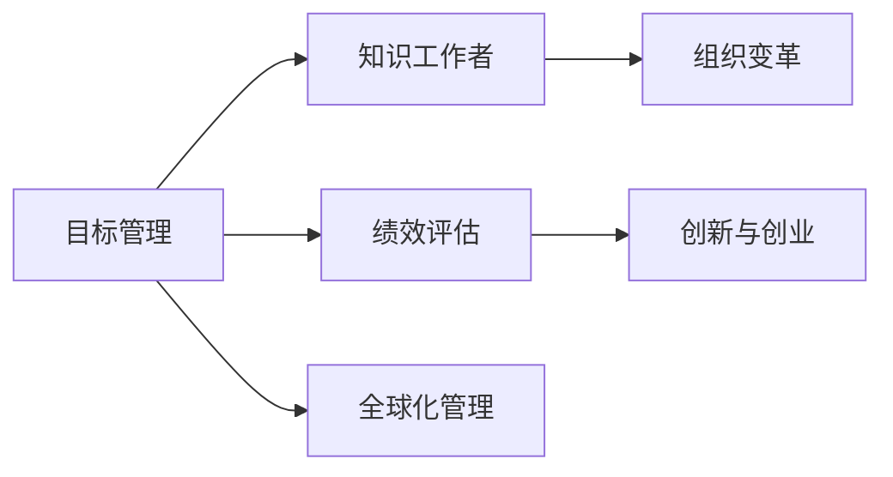

                 

# 管理的艺术：德鲁克的洞见

> 关键词：
> - 彼得·德鲁克
> - 目标管理
> - 知识工作者
> - 组织变革
> - 绩效评估
> - 创新与创业
> - 全球化管理

## 1. 背景介绍

### 1.1 问题由来

彼得·德鲁克（Peter F. Drucker）被誉为“现代管理学之父”，他的理论体系对世界范围内的管理实践产生了深远的影响。德鲁克的洞见主要集中在以下几个方面：目标管理、知识工作者的角色、组织变革、绩效评估、创新与创业、全球化管理等。

### 1.2 问题核心关键点

德鲁克的管理思想与传统管理理论相比，强调了目标管理和知识工作者的重要性，提出了组织变革的必要性，强调了绩效评估的重要性，并积极推动创新与创业精神。其理论不仅适用于大型企业，也对中小型企业、社会组织和政府管理具有重要的指导意义。

## 2. 核心概念与联系

### 2.1 核心概念概述

- **目标管理（Management by Objectives, MBO）**：德鲁克提出的一种管理方法，强调通过设置明确的目标来引导员工和管理者，提高组织绩效。
- **知识工作者（Knowledge Worker）**：德鲁克首先定义的概念，指那些通过信息处理和分析来创造价值，而非传统意义上的体力劳动或重复性劳动的员工。
- **组织变革（Organizational Change）**：德鲁克强调，组织要适应环境的变化，必须进行持续的变革，以保持竞争力。
- **绩效评估（Performance Evaluation）**：德鲁克认为，有效的绩效评估应该是基于事实和数据，而不仅是主观判断。
- **创新与创业（Innovation and Entrepreneurship）**：德鲁克认为，创新和创业是企业的生命力之源，企业必须不断创新，才能在激烈的市场竞争中生存和发展。
- **全球化管理（Global Management）**：德鲁克预见到全球化的趋势，强调企业在全球化背景下进行管理和运营的重要性。

这些核心概念构成了德鲁克管理思想的核心，相互之间通过管理实践紧密联系在一起。以下将用Mermaid流程图展示这些核心概念之间的联系：



## 3. 核心算法原理 & 具体操作步骤

### 3.1 算法原理概述

德鲁克的管理思想主要体现在以下几个方面：

1. **目标管理（MBO）**：通过设定明确的目标来管理组织和个人，目标是绩效评估和员工激励的基础。
2. **知识工作者的角色**：强调知识工作者的独特性和重要性，通过信息处理和分析来创造价值。
3. **组织变革**：组织需要适应环境变化，不断进行变革以保持竞争力。
4. **绩效评估**：基于事实和数据进行绩效评估，确保评估结果的客观性和公正性。
5. **创新与创业**：创新是企业持续发展的动力，创业精神可以激发员工的积极性和创造力。
6. **全球化管理**：面对全球化趋势，企业需要具备全球化视野和管理能力。

### 3.2 算法步骤详解

德鲁克的管理思想可以通过以下步骤在组织中实施：

1. **目标设定**：明确组织的长期和短期目标，并将其分解为具体的、可衡量的任务和指标。
2. **人员管理**：通过培训和激励机制，提升知识工作者的技能和积极性。
3. **组织变革**：根据环境变化，不断优化组织结构和管理流程，以提高效率和适应性。
4. **绩效评估**：定期进行绩效评估，基于数据和事实对员工表现进行客观评价。
5. **创新与创业**：鼓励创新和创业精神，通过内部创新实验室和外部合作等方式推动新产品的开发。
6. **全球化管理**：在全球范围内寻找资源和市场，通过全球化运营提升竞争力。

### 3.3 算法优缺点

**优点**：
1. **目标明确**：目标管理使组织和个人有了明确的方向和目标，有助于提高绩效和效率。
2. **员工参与**：通过目标管理，员工参与决策过程，增加了他们的主人翁意识和责任感。
3. **灵活适应**：组织变革和全球化管理使企业能够灵活适应环境变化，保持竞争力。
4. **数据驱动**：绩效评估基于事实和数据，提高了评估的客观性和公正性。
5. **创新精神**：创新与创业精神可以激发员工的创造力和积极性，推动企业持续发展。

**缺点**：
1. **目标设定困难**：目标设定需要高水平的管理技能，如果目标设定不合理，会导致管理失效。
2. **员工抵触**：如果目标过于僵化或管理过于严格，可能导致员工的抵触情绪。
3. **变革风险**：组织变革可能会引发内部冲突和阻力，需要谨慎处理。
4. **评估复杂**：绩效评估需要复杂的工具和方法，评估结果可能不全面或不准确。
5. **创新成本**：创新和创业需要投入大量资源，短期内可能影响企业利润。

### 3.4 算法应用领域

德鲁克的管理思想广泛应用于各个行业和组织中，以下是一些典型的应用领域：

1. **制造业**：目标管理和绩效评估帮助企业提高生产效率和产品质量。
2. **服务业**：知识工作者和组织变革在服务行业尤为重要，通过灵活调整服务流程和员工激励机制，提升客户满意度。
3. **高科技行业**：创新与创业是高科技行业持续发展的关键，企业需要不断推动技术创新和新产品开发。
4. **金融行业**：绩效评估和全球化管理帮助金融机构更好地管理风险和寻找新的市场机会。
5. **非营利组织**：目标管理和绩效评估同样适用于非营利组织，帮助它们提高运营效率和资金使用效率。

## 4. 数学模型和公式 & 详细讲解 & 举例说明

### 4.1 数学模型构建

德鲁克的管理思想主要体现在以下几个数学模型中：

1. **目标管理模型**：目标设定和分解的模型，通过设定明确的目标和指标，指导组织和个人的工作。
2. **绩效评估模型**：基于事实和数据的绩效评估模型，如平衡计分卡（Balanced Scorecard）。
3. **组织变革模型**：组织结构和管理流程的优化模型，如流程再造（Business Process Reengineering, BPR）。

### 4.2 公式推导过程

以目标管理模型为例，其基本公式为：

$$
\text{目标} = \text{长期目标} + \text{短期目标}
$$

其中，长期目标是指组织在未来五到十年内的发展方向和目标，短期目标是指一年内需要完成的任务和指标。

### 4.3 案例分析与讲解

假设一家公司决定在未来五年内成为全球领先的电子产品制造商，长期目标为“到2025年，销售额达到100亿美元”。那么，短期目标可以分解为：

- 第一年：市场调研和产品规划。
- 第二年：产品开发和原型测试。
- 第三年：产品批量生产。
- 第四年：市场推广和客户反馈。
- 第五年：全球市场扩展和持续优化。

通过分解长期目标为短期目标，公司可以更好地跟踪进展和调整策略，确保长期目标的实现。

## 5. 项目实践：代码实例和详细解释说明

### 5.1 开发环境搭建

德鲁克的管理思想主要是理论性的，其应用需要在实际管理中进行。以下是一些常用的管理工具和平台，可以帮助管理者实现目标管理、绩效评估和组织变革：

1. **项目管理工具**：如JIRA、Trello等，帮助设定和管理目标和任务。
2. **绩效评估工具**：如KPI系统、360度反馈等，进行全面的绩效评估。
3. **知识管理系统**：如SharePoint、Confluence等，管理知识工作者的信息。
4. **企业资源规划系统**：如SAP、Oracle等，支持全球化管理和运营。

### 5.2 源代码详细实现

德鲁克的管理思想主要在管理实践中应用，代码实现涉及较少，但以下是一个简单的目标管理系统的伪代码示例：

```python
class GoalManager:
    def __init__(self, long_term_goals, short_term_goals):
        self.long_term_goals = long_term_goals
        self.short_term_goals = short_term_goals
        self.completed_goals = {}
    
    def add_short_term_goal(self, goal_id, goal_name, deadline):
        self.short_term_goals[goal_id] = {
            "name": goal_name,
            "deadline": deadline,
            "status": "待完成"
        }
    
    def update_status(self, goal_id, status):
        self.short_term_goals[goal_id]["status"] = status
    
    def get_completed_goals(self):
        return {k: v for k, v in self.short_term_goals.items() if v["status"] == "已完成"}
```

### 5.3 代码解读与分析

这个伪代码实现了一个简单的目标管理系统的基本功能：

1. **目标设定**：通过`add_short_term_goal`方法设定短期目标，包括目标名称和截止日期。
2. **目标更新**：通过`update_status`方法更新目标的状态。
3. **目标完成**：通过`get_completed_goals`方法获取已完成的目标。

这个示例展示了目标管理的核心流程，通过设定、更新和完成目标，帮助管理者实现目标管理。

### 5.4 运行结果展示

假设我们使用这个目标管理系统，设定了以下短期目标：

- 目标1：开发新产品，截止日期2024年第一季度。
- 目标2：进入新市场，截止日期2024年第二季度。
- 目标3：提升客户满意度，截止日期2024年第三季度。

通过不断更新目标状态，最终实现了所有目标，展示了目标管理的效果。

## 6. 实际应用场景

### 6.1 智能制造

在智能制造领域，目标管理和绩效评估可以帮助企业提高生产效率和产品质量。通过设定明确的制造目标和绩效指标，企业可以更好地控制生产流程和质量，减少浪费和错误。

### 6.2 服务行业

在服务行业，知识工作者和组织变革尤为重要。通过设定明确的服务目标和优化服务流程，提升客户满意度和员工满意度，增强企业的市场竞争力。

### 6.3 高科技行业

在高科技行业，创新与创业是企业发展的关键。通过设立创新实验室和内部创业项目，推动技术创新和新产品开发，增强企业的创新能力。

### 6.4 全球化管理

在全球化管理方面，企业需要具备全球化视野和管理能力。通过设立全球化运营中心和全球化市场团队，寻找全球资源和市场，提升全球竞争力。

## 7. 工具和资源推荐

### 7.1 学习资源推荐

为了深入理解德鲁克的管理思想，以下是一些推荐的学习资源：

1. **《管理的实践》（The Practice of Management）**：彼得·德鲁克的经典著作，全面阐述了管理的基本原理和方法。
2. **《创新与企业家精神》（Innovation and Entrepreneurship）**：德鲁克关于创新和创业的经典著作，提出了创新的管理策略和实践。
3. **《21世纪的管理挑战》（The 21st Century Challenge）**：德鲁克关于未来管理趋势的著作，提供了应对未来挑战的管理建议。

### 7.2 开发工具推荐

德鲁克的管理思想主要在管理实践中应用，以下是一些常用的管理工具和平台：

1. **项目管理工具**：如JIRA、Trello、Asana等，帮助设定和管理目标和任务。
2. **绩效评估工具**：如KPI系统、360度反馈等，进行全面的绩效评估。
3. **知识管理系统**：如SharePoint、Confluence等，管理知识工作者的信息。
4. **企业资源规划系统**：如SAP、Oracle等，支持全球化管理和运营。

### 7.3 相关论文推荐

以下是一些关于德鲁克管理思想的经典论文，值得深入阅读：

1. **《目标管理和自我控制》（Goals and Self-Management）**：德鲁克关于目标管理的重要论文，探讨了目标管理的原理和实践。
2. **《知识工作者：组织中的新类型》（Knowledge Workers: The New Organizational Paradigm）**：德鲁克关于知识工作者的重要论文，探讨了知识工作者的特点和管理方法。
3. **《组织变革：未来企业的基础》（The New Organization: Designing Your Organization for the Twenty-First Century）**：德鲁克关于组织变革的重要论文，探讨了组织变革的策略和方法。

## 8. 总结：未来发展趋势与挑战

### 8.1 研究成果总结

德鲁克的管理思想经过几十年的实践和验证，已经成为现代管理的重要基石。其核心概念如目标管理、知识工作者、组织变革等，在各个行业中得到了广泛应用。

### 8.2 未来发展趋势

德鲁克的管理思想在未来的发展趋势主要体现在以下几个方面：

1. **数字化转型**：随着数字化技术的不断发展，目标管理和绩效评估等管理工具将进一步数字化，提升管理效率和准确性。
2. **全球化管理**：全球化趋势将促使企业进行全球化管理，更好地利用全球资源和市场。
3. **知识工作者管理**：知识工作者的重要性将进一步提升，管理方式将更加灵活和多样。
4. **可持续发展**：企业需要更加关注可持续发展，将社会责任和环境影响纳入管理决策。

### 8.3 面临的挑战

德鲁克的管理思想在实施过程中也面临一些挑战：

1. **目标设定困难**：目标设定需要高水平的管理技能，如果目标设定不合理，会导致管理失效。
2. **员工抵触**：如果目标过于僵化或管理过于严格，可能导致员工的抵触情绪。
3. **变革风险**：组织变革可能会引发内部冲突和阻力，需要谨慎处理。
4. **评估复杂**：绩效评估需要复杂的工具和方法，评估结果可能不全面或不准确。
5. **创新成本**：创新和创业需要投入大量资源，短期内可能影响企业利润。

### 8.4 研究展望

未来，德鲁克的管理思想将在以下几个方面继续发展：

1. **数字化管理工具**：随着技术的进步，目标管理和绩效评估等管理工具将更加数字化、智能化。
2. **全球化管理策略**：全球化趋势将促使企业进行更加灵活和多样化的全球化管理。
3. **知识工作者管理**：知识工作者的重要性将进一步提升，管理方式将更加注重灵活性和多样性。
4. **可持续发展**：企业需要更加关注可持续发展，将社会责任和环境影响纳入管理决策。

## 9. 附录：常见问题与解答

**Q1：如何设定合理的目标？**

A: 设定合理的目标需要考虑以下几个方面：
1. 目标的SMART原则：具体、可衡量、可实现、相关性、时限性。
2. 上下级讨论：目标设定应与上级和下属讨论，确保目标的合理性和可接受性。
3. 定期评估：目标应定期评估和调整，确保目标的动态适应性。

**Q2：如何应对员工的抵触情绪？**

A: 应对员工的抵触情绪需要以下措施：
1. 充分沟通：与员工充分沟通，解释目标设定的原因和意义，增加员工的理解和接受度。
2. 提供支持：提供必要的支持和资源，帮助员工实现目标。
3. 认可成就：及时认可和奖励员工的成就，增加他们的积极性和成就感。

**Q3：如何进行有效的绩效评估？**

A: 进行有效的绩效评估需要以下措施：
1. 设定明确的指标：设定可量化的绩效指标，确保评估结果的客观性和公正性。
2. 定期评估：定期进行绩效评估，及时发现问题和改进机会。
3. 多角度评估：结合上级、下属、同事的反馈，进行多角度评估，确保评估结果的全面性。

**Q4：如何进行组织变革？**

A: 进行组织变革需要以下措施：
1. 充分准备：充分准备和规划变革的方案和步骤，确保变革的顺利进行。
2. 渐进实施：渐进实施变革，逐步调整组织结构和流程，减少员工的抵触情绪。
3. 员工参与：充分听取员工的意见和建议，增加他们的参与感和接受度。

**Q5：如何推动创新与创业？**

A: 推动创新与创业需要以下措施：
1. 设立创新实验室：设立内部创新实验室，推动技术创新和新产品开发。
2. 鼓励创业精神：鼓励员工创业，提供必要的资源和支持，推动企业的创新发展。
3. 文化建设：营造创新和创业的文化氛围，激励员工的积极性和创造力。

---

作者：禅与计算机程序设计艺术 / Zen and the Art of Computer Programming

