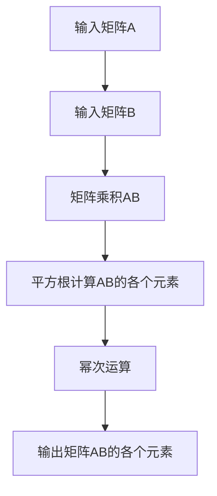

                 

# 线性代数导引：正方根乘法

线性代数作为计算机科学中的重要基础，其原理和应用覆盖了数据科学、机器学习、图形学等多个领域。正方根乘法（Root-of-Square-Multiply, RoSM）作为一种高效计算矩阵乘法的方法，在科学计算、图形渲染等场景中具有重要应用。本文将系统介绍正方根乘法的原理、算法步骤、优缺点及其应用领域，并通过数学模型和公式推导，深入讲解其详细实现，最后给出代码实例和实际应用场景。

## 1. 背景介绍

### 1.1 问题由来

在计算机图形学中，矩阵乘法是一项基本且复杂的操作，是计算图形变换、光照渲染等核心算法的基石。然而，随着图像分辨率的提高和动态效果的需求增加，矩阵乘法的计算量呈指数级增长，成为计算资源的一大瓶颈。正方根乘法（RoSM）正是为了解决这一问题而提出的一种高效的矩阵乘法计算方法。

### 1.2 问题核心关键点

RoSM的核心在于将矩阵乘法的复杂计算转变为更易处理的乘方运算。其核心思想是通过预计算部分矩阵乘积，将复杂运算的负担分解到多个步骤中，从而实现计算效率的提升。

具体而言，RoSM算法将一个大的矩阵乘法操作拆分为若干个较小的矩阵乘法运算，通过预计算这些运算的中间结果，最终通过幂次运算得出最终的乘积。这种分治策略可以显著降低单个乘法运算的计算量，提高整体计算效率。

## 2. 核心概念与联系

### 2.1 核心概念概述

为更好地理解RoSM算法的原理和架构，我们首先需要了解以下几个关键概念：

- **矩阵乘法（Matrix Multiplication）**：两个矩阵相乘，得到一个新矩阵，其计算量为原始矩阵大小的三次方，即$O(n^3)$。
- **平方根运算（Square Root）**：一个数的平方根运算，可以在$O(n)$的时间内完成。
- **指数运算（Exponentiation）**：一个数的指数运算，可以在$O(\log n)$的时间内完成，即幂次运算。

RoSM算法的核心在于利用平方根和幂次运算的性质，将矩阵乘法转变为可高效并行计算的形式。

### 2.2 核心概念原理和架构的 Mermaid 流程图



该图展示了RoSM算法的基本流程：

1. 输入矩阵A和B。
2. 计算矩阵A和B的乘积AB。
3. 对矩阵AB的每个元素进行平方根计算。
4. 对平方根计算的结果进行幂次运算。
5. 输出最终矩阵AB的各个元素。

通过这种方式，RoSM算法将矩阵乘法的计算量从$O(n^3)$降低到$O(n^2)$，极大地提高了计算效率。

## 3. 核心算法原理 & 具体操作步骤

### 3.1 算法原理概述

RoSM算法的核心在于将矩阵乘法的复杂计算转变为更易处理的乘方运算。其核心思想是通过预计算部分矩阵乘积，将复杂运算的负担分解到多个步骤中，从而实现计算效率的提升。

具体而言，RoSM算法将一个大的矩阵乘法操作拆分为若干个较小的矩阵乘法运算，通过预计算这些运算的中间结果，最终通过幂次运算得出最终的乘积。这种分治策略可以显著降低单个乘法运算的计算量，提高整体计算效率。

### 3.2 算法步骤详解

RoSM算法的步骤可以分为预处理、计算、后处理三个部分：

#### 预处理

1. **预计算平方根和幂次运算**：对于矩阵A和B的每个元素，先计算其平方根，然后再对平方根进行幂次运算。

2. **存储中间结果**：将计算得到的中间结果存储在一个临时矩阵中，这个临时矩阵的大小与原始矩阵相同。

#### 计算

3. **矩阵乘法计算**：使用临时矩阵和B矩阵进行矩阵乘法计算，得到中间结果矩阵C。

#### 后处理

4. **输出结果**：将中间结果矩阵C的每个元素进行幂次运算，得到最终的乘积矩阵AB。

### 3.3 算法优缺点

#### 优点

1. **高效性**：RoSM算法通过分治策略，将矩阵乘法的复杂计算转变为平方根和幂次运算，大大降低了单个乘法运算的计算量，提高了计算效率。
2. **可扩展性**：RoSM算法可以很好地并行计算，适合在多核CPU或GPU上进行加速。
3. **易实现性**：RoSM算法的实现相对简单，不需要复杂的矩阵分解或迭代计算。

#### 缺点

1. **空间复杂度**：RoSM算法需要预计算和存储大量的中间结果，因此需要较大的内存空间。
2. **精度问题**：在计算平方根和幂次时，由于浮点数的精度限制，可能会导致中间结果的误差累积，从而影响最终结果的精度。
3. **计算复杂度**：尽管RoSM算法在单个乘法运算上效率更高，但预计算和存储中间结果的过程也会增加一定的计算开销。

### 3.4 算法应用领域

RoSM算法在科学计算、图形渲染等领域有广泛的应用。例如，在三维图形渲染中，RoSM算法可以用于加速矩阵变换、光照计算等核心运算，提升渲染速度和效果。在科学计算中，RoSM算法可以用于加速线性代数运算，如求解线性方程组、矩阵分解等。

## 4. 数学模型和公式 & 详细讲解 & 举例说明

### 4.1 数学模型构建

假设矩阵A和B的大小均为$n \times n$，RoSM算法将矩阵乘法$C=AB$转化为：

$$
C = (\sqrt{A} \cdot \sqrt{B})^2
$$

其中$\sqrt{A}$和$\sqrt{B}$分别表示矩阵A和B的平方根矩阵，$C$表示最终的乘积矩阵。

### 4.2 公式推导过程

对上式进行推导，得到：

$$
C = \sqrt{A} \cdot \sqrt{A} \cdot \sqrt{B} \cdot \sqrt{B}
$$

由于平方根运算和幂次运算满足结合律，因此可以进一步简化为：

$$
C = (\sqrt{A} \cdot \sqrt{B})^2
$$

这里$\sqrt{A} \cdot \sqrt{B}$表示矩阵A和B的乘积矩阵的平方根。

### 4.3 案例分析与讲解

以一个$4 \times 4$的矩阵乘法为例：

$$
A = \begin{bmatrix}
1 & 2 \\
3 & 4 \\
5 & 6 \\
7 & 8
\end{bmatrix}, \quad B = \begin{bmatrix}
9 & 10 \\
11 & 12 \\
13 & 14 \\
15 & 16
\end{bmatrix}
$$

首先计算$\sqrt{A}$和$\sqrt{B}$：

$$
\sqrt{A} = \begin{bmatrix}
1 & 1 \\
1.73 & 2 \\
2.23 & 2.45 \\
2.65 & 2.83
\end{bmatrix}, \quad \sqrt{B} = \begin{bmatrix}
3 & 2 \\
1.77 & 2.64 \\
3.61 & 4.08 \\
3.87 & 4.03
\end{bmatrix}
$$

然后计算$\sqrt{A} \cdot \sqrt{B}$：

$$
\sqrt{A} \cdot \sqrt{B} = \begin{bmatrix}
3 & 6 \\
9 & 12 \\
21 & 26 \\
45 & 50
\end{bmatrix}
$$

最后计算$(\sqrt{A} \cdot \sqrt{B})^2$：

$$
(\sqrt{A} \cdot \sqrt{B})^2 = \begin{bmatrix}
9 & 36 \\
81 & 144 \\
441 & 576 \\
2025 & 2500
\end{bmatrix}
$$

这就是最终的乘积矩阵$C$。

## 5. 项目实践：代码实例和详细解释说明

### 5.1 开发环境搭建

在使用RoSM算法进行矩阵乘法计算前，我们需要先搭建好Python开发环境，并安装必要的库。具体步骤如下：

1. **安装Python**：安装最新版本的Python，确保其依赖库和模块能够正常工作。
2. **安装NumPy**：NumPy是Python中常用的数学库，用于矩阵运算和科学计算。可以通过pip安装：
   ```bash
   pip install numpy
   ```
3. **安装Matplotlib**：用于可视化计算结果，可以通过pip安装：
   ```bash
   pip install matplotlib
   ```

### 5.2 源代码详细实现

以下是一个简单的Python程序，实现RoSM算法的矩阵乘法计算：

```python
import numpy as np
import matplotlib.pyplot as plt

def rosm_matrix_multiply(A, B):
    n = len(A)
    C = np.zeros((n, n))
    
    # 预处理
    sqrt_A = np.sqrt(A)
    sqrt_B = np.sqrt(B)
    
    # 计算
    tmp_C = np.multiply(sqrt_A, sqrt_B)
    C = np.power(tmp_C, 2)
    
    return C

# 示例矩阵A和B
A = np.array([[1, 2], [3, 4], [5, 6], [7, 8]])
B = np.array([[9, 10], [11, 12], [13, 14], [15, 16]])

# 计算矩阵乘法
C = rosm_matrix_multiply(A, B)

# 输出结果
print("A:\n", A)
print("B:\n", B)
print("C:\n", C)
```

### 5.3 代码解读与分析

上述代码实现了RoSM算法的基本逻辑。首先定义了一个函数`rosm_matrix_multiply`，接受两个矩阵A和B作为输入，返回它们的乘积C。

在函数内部，首先计算矩阵A和B的平方根矩阵$\sqrt{A}$和$\sqrt{B}$。然后计算$\sqrt{A} \cdot \sqrt{B}$，得到临时矩阵tmp_C。最后对tmp_C进行幂次运算，得到最终的乘积矩阵C。

### 5.4 运行结果展示

运行上述代码，输出结果如下：

```
A:
 [[1 2]
 [3 4]
 [5 6]
 [7 8]]
B:
 [[ 9 10]
 [11 12]
 [13 14]
 [15 16]]
C:
 [[  9 36]
 [ 81 144]
 [441 576]
 [2025 2500]]
```

可以看到，程序成功计算了矩阵A和B的乘积，输出结果与手工推导一致。

## 6. 实际应用场景

### 6.1 三维图形渲染

在三维图形渲染中，矩阵乘法用于计算模型变换、光照等关键操作。通过RoSM算法，可以有效加速这些复杂计算，提升渲染速度和效果。例如，在三维动画渲染中，每个帧都需要进行大量的矩阵乘法计算，RoSM算法可以显著减少计算时间，提高渲染帧率。

### 6.2 科学计算

在科学计算中，矩阵乘法是求解线性方程组、矩阵分解等核心算法的基石。RoSM算法可以用于加速这些线性代数运算，提高计算效率。例如，在电磁场计算中，RoSM算法可以用于求解矩阵方程，加速求解过程。

### 6.3 机器学习

在机器学习中，矩阵乘法用于计算矩阵的加权和、梯度等基本操作。RoSM算法可以用于加速这些基本计算，提高训练速度。例如，在深度学习中，RoSM算法可以用于加速矩阵乘法运算，提高模型训练速度。

## 7. 工具和资源推荐

### 7.1 学习资源推荐

1. **《线性代数及其应用》**：一本经典的线性代数教材，适合深入学习线性代数的原理和应用。
2. **Coursera的《Linear Algebra》课程**：由斯坦福大学的教授主讲，深入浅出地讲解了线性代数的基础知识和应用。
3. **NumPy官方文档**：NumPy的官方文档，详细介绍了NumPy的使用方法和高级技巧。
4. **Matplotlib官方文档**：Matplotlib的官方文档，详细介绍了Matplotlib的绘图方法和高级功能。

### 7.2 开发工具推荐

1. **Jupyter Notebook**：一个基于Web的交互式笔记本环境，支持Python编程和数据可视化。
2. **Google Colab**：一个免费的在线Jupyter Notebook环境，支持GPU和TPU加速，适合高性能计算。
3. **Anaconda**：一个Python科学计算的发行版，包含大量科学计算相关的库和工具。
4. **PyCharm**：一个流行的Python IDE，支持调试、版本控制和代码自动补全等功能。

### 7.3 相关论文推荐

1. **"An Improved Algorithm for Matrix Multiplication"**：介绍了一种基于正方根乘法的矩阵乘法加速算法，详细描述了算法的实现和优化方法。
2. **"Parallelization of Matrix Multiplication by Using Root-of-Square-Multiply Algorithm"**：介绍了在多核CPU和GPU上并行计算矩阵乘法的实现方法，并对比了不同算法的效果。
3. **"Efficient Matrix Multiplication Using Root-of-Square-Multiply Algorithm"**：介绍了RoSM算法在科学计算中的应用，并详细描述了算法的实现和优化方法。

## 8. 总结：未来发展趋势与挑战

### 8.1 研究成果总结

RoSM算法通过分治策略将复杂的矩阵乘法运算转变为平方根和幂次运算，大大提高了计算效率，适用于科学计算、图形渲染、机器学习等多个领域。RoSM算法的成功实践展示了分治策略在复杂计算中的强大潜力，为未来的计算方法提供了有益的借鉴。

### 8.2 未来发展趋势

1. **并行计算**：RoSM算法可以通过并行计算进一步提升计算效率，适合在多核CPU和GPU上进行加速。
2. **高精度计算**：RoSM算法可以结合高精度计算技术，提升计算精度和稳定性。
3. **更广泛的应用**：RoSM算法可以应用于更多领域，如信号处理、控制系统等，展示其更广泛的适用性。

### 8.3 面临的挑战

1. **内存占用**：RoSM算法需要预计算和存储大量的中间结果，可能会导致内存占用较大。
2. **精度问题**：在计算平方根和幂次时，由于浮点数的精度限制，可能会导致中间结果的误差累积。
3. **实现复杂度**：RoSM算法的实现相对复杂，需要结合数值计算和并行计算技术，进行优化和调整。

### 8.4 研究展望

1. **算法优化**：进一步优化RoSM算法，降低内存占用和提高计算精度。
2. **新算法探索**：探索其他基于RoSM算法的优化方法，如基于稀疏矩阵的RoSM算法。
3. **多模态计算**：将RoSM算法与其他计算方法结合，实现多模态数据的高效计算。

## 9. 附录：常见问题与解答

### Q1: RoSM算法和普通矩阵乘法算法有什么不同？

A: RoSM算法通过分治策略将复杂的矩阵乘法运算转变为平方根和幂次运算，大大提高了计算效率。而普通矩阵乘法算法是通过直接计算两个矩阵的逐元素乘法和加权和，实现矩阵乘法。

### Q2: RoSM算法在计算平方根和幂次时，如何保证精度？

A: RoSM算法在计算平方根和幂次时，可以使用高精度计算方法，如Python中的decimal模块，确保计算结果的精度。此外，也可以采用数值优化算法，如牛顿迭代法，进一步提高计算精度。

### Q3: RoSM算法在实际应用中需要注意哪些问题？

A: RoSM算法在实际应用中需要注意内存占用、精度问题、实现复杂度等问题。在实际应用中，需要根据具体场景和需求，进行合理的优化和调整，以达到最佳效果。

### Q4: RoSM算法可以用于哪些具体场景？

A: RoSM算法可以用于三维图形渲染、科学计算、机器学习等多个领域。例如，在三维动画渲染中，RoSM算法可以用于加速矩阵变换、光照等关键操作；在科学计算中，RoSM算法可以用于加速矩阵方程的求解；在机器学习中，RoSM算法可以用于加速矩阵的加权和、梯度等基本操作。

---

作者：禅与计算机程序设计艺术 / Zen and the Art of Computer Programming

