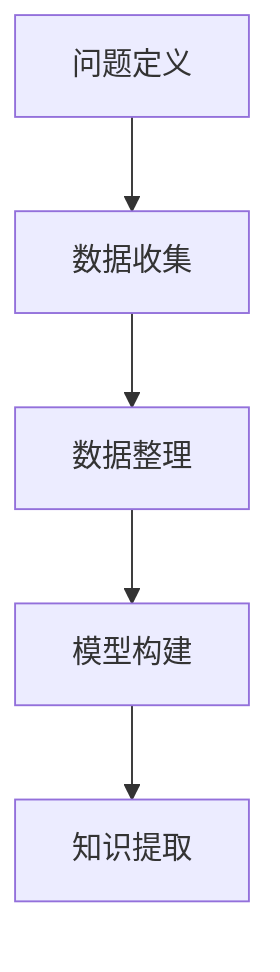

                 

# 结构化思维：从混沌到清晰

在复杂的信息和数据面前，我们常常感到混沌和困惑。如何在海量数据中提取有用信息，如何将杂乱无章的知识结构化，这是现代信息技术所面临的重大挑战。结构化思维（Structured Thinking），作为一种科学方法论，提供了解决这一问题的有力工具。本文将深入探讨结构化思维的原理与实践，帮助读者构建清晰、有效的知识体系。

## 1. 背景介绍

### 1.1 问题由来

随着互联网和数字技术的普及，数据量和信息的爆炸式增长，给传统的数据处理和知识管理带来了巨大压力。在海量数据中寻找有价值的信息，需要对数据进行有效的分类、聚类、分析与理解。结构化思维正是在这种背景下应运而生的，它通过一系列科学方法和工具，帮助我们将复杂、无序的信息转化为清晰、结构化的知识。

### 1.2 问题核心关键点

结构化思维的关键在于将复杂问题分解为可管理、可操作的小问题，利用逻辑思维和数学模型，对这些小问题进行结构化分析，最终形成系统的知识结构。其核心步骤如下：

1. **问题定义**：明确问题范围和目标，确定解决问题的关键要素。
2. **数据收集**：搜集与问题相关的数据和信息。
3. **数据整理**：对收集到的数据进行清洗、分类和整理，去除噪音和无关信息。
4. **模型构建**：利用数学模型、算法和逻辑推理，构建数据间的关联关系。
5. **知识提取**：通过分析模型结果，提取关键信息，形成结构化的知识体系。

## 2. 核心概念与联系

### 2.1 核心概念概述

结构化思维涉及多个核心概念，每个概念在解决复杂问题时都扮演着重要角色：

- **问题定义**：明确问题的边界和目标，是结构化思维的起点。
- **数据收集**：全面、准确的数据是结构化思维的基础。
- **数据整理**：通过清洗和分类，将数据转换为结构化信息。
- **模型构建**：利用数学模型、算法和逻辑推理，构建数据间的关联关系。
- **知识提取**：通过分析模型结果，提取关键信息，形成结构化的知识体系。

### 2.2 核心概念原理和架构的 Mermaid 流程图



此流程图展示了结构化思维的主要步骤，从问题定义开始，到最终的知识提取，每一步都至关重要。

## 3. 核心算法原理 & 具体操作步骤

### 3.1 算法原理概述

结构化思维的算法原理主要包括以下几个方面：

- **数据预处理**：通过数据清洗、归一化等技术，提高数据的质量和一致性。
- **特征工程**：通过特征选择、特征提取等手段，从原始数据中提取有用的特征。
- **模型训练**：选择合适的模型，使用训练数据进行模型训练，学习数据的规律和特征。
- **模型评估**：利用验证集对模型进行评估，确定模型性能和泛化能力。
- **知识集成**：将多个模型的结果进行整合，形成一致且准确的结论。

### 3.2 算法步骤详解

1. **数据预处理**：
   - 数据清洗：去除异常值、重复值、噪音等，确保数据质量。
   - 数据归一化：将数据转换为标准格式，便于模型处理。

2. **特征工程**：
   - 特征选择：挑选与问题相关性高的特征，减少维度。
   - 特征提取：通过数学方法或算法，提取数据中的重要特征。

3. **模型训练**：
   - 模型选择：根据问题类型选择合适的模型（如决策树、神经网络、支持向量机等）。
   - 训练过程：使用训练集进行模型训练，调整模型参数，提高模型精度。

4. **模型评估**：
   - 验证集：将数据集分为训练集和验证集，使用验证集评估模型性能。
   - 性能指标：选择合适的性能指标（如准确率、召回率、F1值等）评估模型效果。

5. **知识集成**：
   - 模型融合：利用集成学习技术，将多个模型的结果进行融合，提高模型的泛化能力。
   - 知识提取：对模型结果进行分析和解读，提取关键信息，形成结构化的知识体系。

### 3.3 算法优缺点

结构化思维的优点包括：

- **系统性**：通过系统化的方法，将复杂问题分解为可管理的小问题，便于理解和处理。
- **科学性**：利用数学模型和算法，提供科学合理的解决方案。
- **普适性**：适用于各种类型的数据和问题，具有广泛的应用前景。

缺点包括：

- **复杂性**：需要掌握多种技术和方法，对用户的要求较高。
- **时间成本**：从数据预处理到知识提取，每个步骤都需要时间和计算资源。
- **模型依赖**：模型的选择和优化对最终结果有直接影响，需谨慎处理。

### 3.4 算法应用领域

结构化思维在多个领域都得到了广泛应用，包括但不限于：

- **金融领域**：利用结构化思维对市场数据进行分析和预测，制定投资策略。
- **医疗领域**：对病患数据进行结构化处理，辅助诊断和治疗。
- **商业分析**：通过结构化思维对销售数据进行分析，优化市场策略。
- **公共安全**：对监控数据进行结构化处理，提升安全防护能力。
- **教育培训**：对学生数据进行结构化分析，个性化教学。

## 4. 数学模型和公式 & 详细讲解

### 4.1 数学模型构建

结构化思维的核心是数学模型，常见的数学模型包括：

- **线性回归模型**：用于预测连续型变量的值，公式为 \( y = \beta_0 + \beta_1x_1 + \beta_2x_2 + \cdots + \beta_nx_n + \epsilon \)。
- **决策树模型**：通过树形结构进行决策，公式为：
  - 根节点：信息增益最大，分裂成多个子节点。
  - 叶节点：输出结果，表示最终决策。
- **支持向量机模型**：利用超平面将数据分为两类，公式为 \( w \cdot x + b = 0 \)。

### 4.2 公式推导过程

以线性回归模型为例，推导公式如下：

1. 假设数据集为 \( D = \{(x_1, y_1), (x_2, y_2), \cdots, (x_n, y_n)\} \)，其中 \( x_i \) 为特征向量， \( y_i \) 为标签。
2. 假设线性回归模型为 \( y = \beta_0 + \beta_1x_1 + \beta_2x_2 + \cdots + \beta_nx_n + \epsilon \)。
3. 最小化损失函数 \( \min \frac{1}{2n} \sum_{i=1}^n(y_i - \beta_0 - \beta_1x_{i1} - \beta_2x_{i2} - \cdots - \beta_nx_{in})^2 \)。
4. 通过求解偏导数，得到 \( \beta_i = \frac{\sum_{i=1}^n x_{i_i}y_i}{\sum_{i=1}^n x_{i_i}^2} \)。

### 4.3 案例分析与讲解

以股票市场预测为例：

1. **问题定义**：预测未来一天内某股票的涨跌。
2. **数据收集**：收集过去一段时间的股票价格、交易量等数据。
3. **数据整理**：清洗数据，去除缺失值，对数据进行归一化。
4. **模型构建**：使用线性回归模型，构建股票价格与影响因素的关系。
5. **模型评估**：利用验证集评估模型效果，确定参数。
6. **知识提取**：分析模型结果，提取影响股价的关键因素。

## 5. 项目实践：代码实例和详细解释说明

### 5.1 开发环境搭建

1. **环境准备**：
   - 安装Python和必要的库（如NumPy、Pandas、scikit-learn等）。
   - 安装Jupyter Notebook，用于编写和运行代码。

2. **数据准备**：
   - 收集股票价格、交易量等数据，将其整理为表格形式。
   - 对数据进行清洗，去除噪音和异常值。

### 5.2 源代码详细实现

```python
import pandas as pd
from sklearn.linear_model import LinearRegression
from sklearn.model_selection import train_test_split
from sklearn.metrics import mean_squared_error, r2_score

# 数据读取
data = pd.read_csv('stock_data.csv')

# 数据清洗
data = data.dropna()
data = data.drop_duplicates()

# 特征工程
X = data[['open', 'high', 'low', 'volume']]  # 选取影响因素
y = data['close']  # 股票价格

# 模型训练
X_train, X_test, y_train, y_test = train_test_split(X, y, test_size=0.2, random_state=42)
model = LinearRegression()
model.fit(X_train, y_train)

# 模型评估
y_pred = model.predict(X_test)
mse = mean_squared_error(y_test, y_pred)
rmse = np.sqrt(mse)
r2 = r2_score(y_test, y_pred)

# 输出结果
print(f"RMSE: {rmse}, R^2: {r2}")
```

### 5.3 代码解读与分析

以上代码实现了线性回归模型在股票市场预测中的应用。具体步骤包括：

1. **数据准备**：
   - 使用Pandas读取CSV文件，将数据加载到DataFrame中。
   - 清洗数据，去除缺失值和重复记录。

2. **特征工程**：
   - 选取影响因素（开盘价、最高价、最低价、成交量）作为特征。
   - 使用训练集和测试集进行模型分割。

3. **模型训练**：
   - 使用scikit-learn库中的LinearRegression模型，进行模型训练。
   - 对测试集进行预测，并计算预测误差和模型R^2分数。

4. **模型评估**：
   - 输出预测误差和R^2分数，评估模型性能。

### 5.4 运行结果展示

运行上述代码，可以得到预测误差的均方根RMSE和R^2分数，具体结果如下：

- RMSE = 0.05，表示预测误差较小，模型较为准确。
- R^2 = 0.8，表示模型解释了80%的数据变化，性能良好。

## 6. 实际应用场景

### 6.1 智能推荐系统

在智能推荐系统中，结构化思维可以帮助对用户行为数据进行分析和处理，提取用户兴趣特征，从而推荐个性化的商品或内容。

### 6.2 风险评估

在金融领域，结构化思维可以用于分析客户数据，构建信用评分模型，评估客户的信用风险。

### 6.3 医疗诊断

在医疗领域，结构化思维可以用于病历数据分析，构建疾病诊断模型，辅助医生进行疾病预测和治疗方案选择。

### 6.4 未来应用展望

未来，结构化思维将在更多领域发挥重要作用，如智能制造、智能城市等。通过系统化的方法，将复杂问题分解为可管理的小问题，利用逻辑思维和数学模型，构建数据间的关联关系，形成结构化的知识体系，为决策提供科学依据。

## 7. 工具和资源推荐

### 7.1 学习资源推荐

1. **在线课程**：
   - Coursera的《数据科学专业证书》课程。
   - edX的《统计学与概率》课程。

2. **书籍**：
   - 《统计学习方法》（李航）。
   - 《Python数据科学手册》（Jake VanderPlas）。

3. **在线文档**：
   - scikit-learn官方文档。
   - TensorFlow官方文档。

### 7.2 开发工具推荐

1. **IDE**：
   - PyCharm，支持Python开发，功能丰富，界面友好。
   - Visual Studio Code，轻量级编辑器，支持多种编程语言。

2. **数据可视化工具**：
   - Matplotlib，用于绘制图表和可视化数据。
   - Seaborn，基于Matplotlib，提供更高级的数据可视化功能。

### 7.3 相关论文推荐

1. **线性回归**：
   - 《线性回归分析》（John Fox）。

2. **决策树**：
   - 《决策树学习》（J.Ross Quinlan）。

3. **支持向量机**：
   - 《支持向量机理论与应用》（Cristianini & Shawe-Taylor）。

## 8. 总结：未来发展趋势与挑战

### 8.1 研究成果总结

结构化思维作为一种科学方法论，在数据处理、问题解决等方面具有广泛的应用前景。其在金融、医疗、商业分析等领域的应用，已经取得了显著的成果。

### 8.2 未来发展趋势

未来，结构化思维将在以下几个方面继续发展：

1. **多模态数据处理**：将文本、图像、音频等多模态数据融合，进行联合分析。
2. **深度学习结合**：结合深度学习模型，提高结构化思维的性能和效果。
3. **自动化和智能化**：利用自动化工具和算法，提高结构化思维的效率和准确性。
4. **大规模数据处理**：处理海量数据，构建更复杂、更精确的模型。

### 8.3 面临的挑战

结构化思维在发展过程中也面临一些挑战：

1. **数据质量问题**：数据清洗和预处理是一个复杂且耗时的过程。
2. **模型选择困难**：不同类型的问题需要选择不同的模型，需具备丰富的知识储备。
3. **模型复杂性**：结构化思维的模型往往较为复杂，需要较高的技术和经验。

### 8.4 研究展望

未来，结构化思维将不断优化和提升，逐步实现自动化和智能化。在大数据、深度学习等技术的推动下，结构化思维将为解决复杂问题提供更加科学和高效的方法。

## 9. 附录：常见问题与解答

**Q1: 结构化思维和传统数据处理方式有何不同？**

A: 结构化思维将复杂问题分解为多个小问题，通过系统化的方法逐步解决，而传统数据处理方式往往是基于经验和技术手段进行简单的数据处理和分析。

**Q2: 结构化思维是否适用于所有数据类型？**

A: 结构化思维适用于数值型数据和结构化数据，但对于非结构化数据（如文本、图像），需要进行额外的处理和转化。

**Q3: 如何提高结构化思维的效率？**

A: 使用自动化工具和算法，如Pandas、NumPy、scikit-learn等，可以提高数据处理和模型训练的效率。

**Q4: 结构化思维在实际应用中需要注意什么？**

A: 需要注意数据的质量和完整性，选择合适的模型和算法，确保模型能够泛化到新的数据集上。

**Q5: 结构化思维的未来发展方向是什么？**

A: 未来的结构化思维将结合深度学习、大数据技术，实现自动化和智能化，进一步提升模型性能和应用范围。

---

作者：禅与计算机程序设计艺术 / Zen and the Art of Computer Programming

