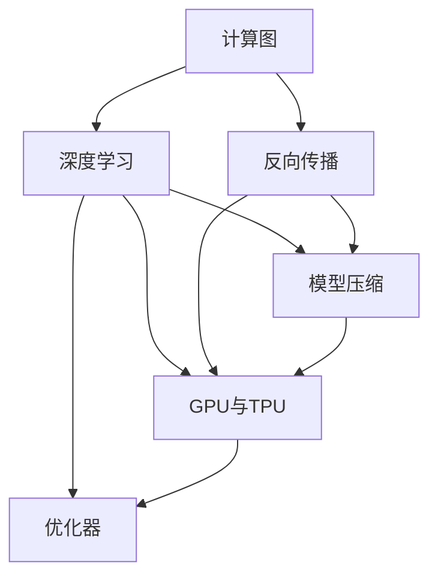

                 

# 自动计算机与神经网络的研究

> 关键词：自动计算机，神经网络，计算图，反向传播，深度学习，模型压缩，优化器，GPU，TPU

## 1. 背景介绍

### 1.1 问题由来
自20世纪中叶以来，计算机科学和人工智能领域经历了翻天覆地的变化。从早期的模拟计算机，到后来数字计算机的诞生，再到现代的人工智能革命，计算技术的发展为人类社会带来了巨大的变革。在诸多创新中，自动计算机与神经网络的研究无疑是其中最具影响力的一环。

自动计算机，又称图灵机，由英国数学家图灵提出，是一种抽象的计算模型。神经网络则是一种模拟人脑神经网络结构与功能的计算模型，由多层神经元通过连接的权重与激活函数构成，可以用于解决分类、回归、图像识别等多种问题。

现代深度学习技术，正是基于神经网络的架构和反向传播算法构建而成的。这一技术的突破，使得计算机能够处理更复杂、更抽象的计算任务，为智能系统的发展开辟了广阔天地。

### 1.2 问题核心关键点
本研究聚焦于自动计算机与神经网络的设计原理与实现技术，探索其在深度学习框架中的应用与优化。研究重点包括：

- 计算图的构建与优化：自动计算机的本质是通过计算图表示计算流程，如何设计高效的计算图，是自动计算机研究的核心。
- 反向传播算法：神经网络训练的核心在于反向传播，如何在保证计算图高效运行的前提下，优化反向传播算法，是神经网络研究的关键。
- 模型压缩与优化：如何压缩神经网络模型，提高其推理速度和资源效率，是深度学习应用推广的重要课题。
- 深度学习优化器：不同的优化器算法在训练效果、计算效率等方面各有优劣，如何选取合适的优化器，是深度学习模型的关键。
- GPU与TPU：为了加速深度学习模型的训练与推理，GPU与TPU等专用硬件加速器成为了深度学习的主流计算平台。

## 2. 核心概念与联系

### 2.1 核心概念概述

为更好地理解自动计算机与神经网络的研究，本节将介绍几个密切相关的核心概念：

- 计算图：一种表示计算流程的图形结构，由节点和边组成。每个节点表示一个计算操作，边表示数据流向。计算图是自动计算机的核心设计工具。
- 反向传播：神经网络训练的核心算法，通过反向传播计算每个节点的梯度，用于更新模型参数。反向传播算法基于链式法则，可以高效计算全连接网络的梯度。
- 深度学习：一种基于神经网络架构的机器学习范式，通过多层次的特征抽象，提高模型的复杂性和表达能力。深度学习在计算机视觉、自然语言处理等领域展现了强大的应用潜力。
- 模型压缩：通过剪枝、量化、参数共享等技术，优化神经网络模型，提高其推理速度和资源效率，使其能够在大规模硬件上部署和应用。
- GPU与TPU：为加速深度学习模型的计算，NVIDIA开发的GPU和Google研发的TPU等专用硬件加速器，已成为深度学习的主流计算平台。
- 优化器：用于更新模型参数，优化损失函数的算法。常见的优化器包括SGD、Adam、Adagrad等，不同的优化器具有不同的特性和应用场景。

这些核心概念之间的逻辑关系可以通过以下Mermaid流程图来展示：



这个流程图展示了几大核心概念的相互关系：

1. 计算图表示计算流程，反向传播基于计算图进行参数更新。
2. 深度学习利用计算图和反向传播进行模型训练。
3. 模型压缩优化深度学习模型，提高推理效率。
4. GPU与TPU加速深度学习计算，支持模型高效训练和推理。
5. 优化器选择适合的算法，提升模型训练的收敛速度和精度。

这些概念共同构成了自动计算机与神经网络的研究框架，使其能够在深度学习等领域发挥重要作用。

## 3. 核心算法原理 & 具体操作步骤
### 3.1 算法原理概述

自动计算机与神经网络的原理，基于计算图与反向传播算法的深度融合。其核心思想是：通过构建高效的计算图，定义计算流程，然后使用反向传播算法，高效地计算每个节点的梯度，更新模型参数，优化损失函数，从而提高模型的性能。

### 3.2 算法步骤详解

自动计算机与神经网络的研究涉及以下几个关键步骤：

**Step 1: 设计计算图**

- 确定计算图的结构：根据问题类型，选择合适的计算图结构，如全连接图、卷积图、循环图等。
- 定义计算图节点：每个节点表示一个计算操作，如加法、乘法、激活函数等。
- 设计数据流向：确定节点间的连接方式，明确数据传递的路径和方式。

**Step 2: 实现反向传播**

- 计算节点梯度：根据链式法则，计算每个节点对损失函数的梯度。
- 更新模型参数：使用梯度下降等优化算法，更新模型参数，最小化损失函数。
- 优化计算图：根据梯度计算结果，调整计算图的结构，提高计算效率。

**Step 3: 模型压缩与优化**

- 剪枝：去除冗余连接和节点，减少模型大小。
- 量化：将高精度参数转化为低精度格式，提高计算速度和存储空间效率。
- 参数共享：通过共享模型参数，减少计算量。
- 模型融合：将多个小模型组合成一个大模型，提升模型性能。

**Step 4: 训练与推理**

- 数据预处理：对输入数据进行归一化、标准化等预处理操作。
- 模型训练：在训练集上使用反向传播算法进行参数更新。
- 模型评估：在验证集上评估模型性能，防止过拟合。
- 模型推理：在测试集上使用模型进行预测，生成输出。

以上是自动计算机与神经网络的研究主要流程。在实际应用中，还需要根据具体问题进行优化设计，如改进计算图结构、选择适当的反向传播算法、优化模型压缩方法等，以进一步提升模型的性能和资源效率。

### 3.3 算法优缺点

自动计算机与神经网络具有以下优点：

- 高效计算：计算图和反向传播算法提供了高效的计算方法，可以处理大规模复杂数据。
- 通用性强：神经网络模型适用于多种计算任务，如分类、回归、生成等。
- 可扩展性强：通过增加计算图的规模，可以扩展模型的能力，适应更复杂的问题。

同时，该方法也存在一定的局限性：

- 计算量大：尽管计算图和反向传播算法可以高效计算，但在极端复杂的网络结构下，仍可能面临计算资源瓶颈。
- 模型易过拟合：在数据量不足的情况下，神经网络容易过拟合，影响模型的泛化能力。
- 训练复杂：神经网络模型的训练过程涉及复杂的参数更新和计算，需要精细调参。

尽管存在这些局限性，但就目前而言，自动计算机与神经网络仍是深度学习领域的主流范式。未来相关研究的重点在于如何进一步优化计算图和反向传播算法，降低模型复杂度，提高模型的泛化能力和训练效率。

### 3.4 算法应用领域

自动计算机与神经网络的研究已经广泛应用于以下几个领域：

- 计算机视觉：图像分类、目标检测、图像分割等任务。通过卷积神经网络(CNN)处理图像数据，可以有效提取图像特征。
- 自然语言处理：文本分类、语言模型、机器翻译等任务。通过循环神经网络(RNN)和长短期记忆网络(LSTM)，可以有效处理文本数据。
- 语音识别：语音识别、语音合成等任务。通过卷积神经网络(CNN)和循环神经网络(RNN)，可以有效处理音频数据。
- 强化学习：自动驾驶、游戏AI等任务。通过强化学习算法，可以使模型在交互环境中进行学习，优化决策策略。
- 时间序列预测：股票预测、气象预测等任务。通过循环神经网络(RNN)和长短期记忆网络(LSTM)，可以有效处理时间序列数据。

除了上述这些经典应用外，自动计算机与神经网络还被创新性地应用于更多场景中，如医疗诊断、金融风控、智能制造等，为各行各业带来了新的变革。

## 4. 数学模型和公式 & 详细讲解 & 举例说明

### 4.1 数学模型构建

自动计算机与神经网络的研究涉及多个数学模型，其中以计算图和反向传播算法最为关键。

- 计算图模型：表示计算流程的图形结构，由节点和边组成。每个节点表示一个计算操作，边表示数据流向。
- 反向传播算法：用于计算节点梯度，更新模型参数的算法。基于链式法则，可以高效计算全连接网络的梯度。

### 4.2 公式推导过程

以下是计算图和反向传播算法的详细数学模型与公式推导：

**计算图模型**

一个简单的全连接神经网络，由输入层、隐藏层和输出层组成，计算图模型如下所示：


其中，$A$ 表示输入数据，$B$ 表示隐藏层，$C$ 表示输出结果。每个节点之间的边表示数据传递，箭头方向表示数据流向。

**反向传播算法**

反向传播算法基于链式法则，计算每个节点对损失函数的梯度。以全连接神经网络为例，假设其损失函数为 $L$，输出层有 $n$ 个神经元，隐藏层有 $m$ 个神经元，激活函数为 $f$，权重矩阵为 $W$，偏置向量为 $b$。

1. 计算输出层梯度：
   $$
   \frac{\partial L}{\partial C} = \frac{\partial L}{\partial Z} \frac{\partial Z}{\partial C}
   $$
   其中，$Z$ 表示输出层输入。

2. 计算隐藏层梯度：
   $$
   \frac{\partial L}{\partial B} = \frac{\partial L}{\partial C} \frac{\partial C}{\partial Z} \frac{\partial Z}{\partial B}
   $$
   $$
   \frac{\partial L}{\partial W} = \frac{\partial L}{\partial Z} \frac{\partial Z}{\partial B} \frac{\partial B}{\partial W}
   $$

3. 链式法则计算梯度：
   $$
   \frac{\partial L}{\partial X} = \frac{\partial L}{\partial C} \sum_{k=1}^{m} \frac{\partial C}{\partial Z_k} \frac{\partial Z_k}{\partial B_k} \frac{\partial B_k}{\partial W_{ij}} \frac{\partial W_{ij}}{\partial X_j}
   $$

其中，$X$ 表示输入数据，$W$ 表示权重矩阵，$b$ 表示偏置向量，$Z$ 表示层间传递的数据，$\frac{\partial L}{\partial C}$ 表示输出层对损失函数的梯度，$\frac{\partial C}{\partial Z}$ 表示输出层激活函数对输入的梯度，$\frac{\partial Z}{\partial B}$ 表示隐藏层激活函数对偏置的梯度，$\frac{\partial B}{\partial W}$ 表示隐藏层激活函数对权重的梯度。

**案例分析与讲解**

以图像分类任务为例，说明如何使用反向传播算法进行参数更新。

1. 构建计算图：设计卷积神经网络(CNN)结构，定义各个层的操作，如卷积、池化、全连接等。
2. 定义损失函数：使用交叉熵损失函数，衡量预测结果与真实标签之间的差异。
3. 前向传播：将输入图像数据通过计算图传递，得到最终输出。
4. 计算梯度：使用反向传播算法，计算每个节点对损失函数的梯度。
5. 更新参数：根据梯度，使用梯度下降等优化算法更新模型参数。

### 4.3 案例分析与讲解

以一个简单的全连接神经网络为例，说明如何使用反向传播算法进行参数更新。

假设一个全连接神经网络由一个输入层、一个隐藏层和一个输出层组成，其中隐藏层有3个神经元，激活函数为ReLU，输出层有2个神经元，使用Softmax作为激活函数，二分类任务。假设训练集包含5个样本，每个样本有2个特征，输出标签为0或1。

- 计算图模型：
  ```mermaid
  graph LR
      A[输入] --> B[隐藏层]
      B --> C[输出]
  ```

- 损失函数：
  $$
  L = -\frac{1}{5} \sum_{i=1}^{5} (y_i \log p(y_i) + (1-y_i) \log (1-p(y_i)))
  $$
  其中，$y_i$ 表示真实标签，$p(y_i)$ 表示模型预测的概率。

- 前向传播：
  - 输入数据：$x = [0.5, 0.2]$
  - 隐藏层计算：$z = x \cdot w + b$
  - 输出层计算：$y = z \cdot w + b$
  - 最终输出：$p(y) = \frac{e^y}{e^y + e^{-y}}$

- 计算梯度：
  - 输出层梯度：$\frac{\partial L}{\partial y} = \frac{p(y)-y}{y(1-y)}$
  - 隐藏层梯度：$\frac{\partial L}{\partial z} = \frac{\partial L}{\partial y} \frac{\partial y}{\partial z} = \frac{\partial L}{\partial y} \frac{\partial z}{\partial B}$
  - 权重矩阵梯度：$\frac{\partial L}{\partial W} = \frac{\partial L}{\partial z} \frac{\partial z}{\partial B} \frac{\partial B}{\partial W}$
  - 偏置向量梯度：$\frac{\partial L}{\partial b} = \frac{\partial L}{\partial z} \frac{\partial z}{\partial B}$

- 更新参数：
  $$
  W \leftarrow W - \eta \frac{\partial L}{\partial W}
  $$
  $$
  b \leftarrow b - \eta \frac{\partial L}{\partial b}
  $$

其中，$\eta$ 为学习率，用于控制参数更新的步长。

通过这个例子可以看出，反向传播算法可以高效计算全连接神经网络的梯度，并根据梯度更新模型参数，优化损失函数，从而提高模型的性能。

## 5. 项目实践：代码实例和详细解释说明

### 5.1 开发环境搭建

在进行神经网络模型开发前，我们需要准备好开发环境。以下是使用Python进行TensorFlow开发的环境配置流程：

1. 安装Anaconda：从官网下载并安装Anaconda，用于创建独立的Python环境。

2. 创建并激活虚拟环境：
```bash
conda create -n tf-env python=3.8 
conda activate tf-env
```

3. 安装TensorFlow：根据CUDA版本，从官网获取对应的安装命令。例如：
```bash
conda install tensorflow -c conda-forge
```

4. 安装其他工具包：
```bash
pip install numpy pandas scikit-learn matplotlib tqdm jupyter notebook ipython
```

完成上述步骤后，即可在`tf-env`环境中开始神经网络模型开发。

### 5.2 源代码详细实现

下面我们以一个简单的全连接神经网络为例，给出使用TensorFlow构建并训练模型的PyTorch代码实现。

```python
import tensorflow as tf
from tensorflow.keras import layers
from tensorflow.keras.datasets import mnist

# 加载MNIST数据集
(x_train, y_train), (x_test, y_test) = mnist.load_data()

# 数据预处理
x_train = x_train / 255.0
x_test = x_test / 255.0

# 定义模型
model = tf.keras.Sequential([
    layers.Flatten(input_shape=(28, 28)),
    layers.Dense(128, activation='relu'),
    layers.Dense(10, activation='softmax')
])

# 编译模型
model.compile(optimizer='adam', loss='sparse_categorical_crossentropy', metrics=['accuracy'])

# 训练模型
model.fit(x_train, y_train, epochs=5, validation_data=(x_test, y_test))

# 评估模型
model.evaluate(x_test, y_test)
```

### 5.3 代码解读与分析

让我们再详细解读一下关键代码的实现细节：

**数据预处理**

- `x_train` 和 `x_test` 分别为训练集和测试集的图像数据，将其归一化到0到1之间。

**定义模型**

- 使用 `tf.keras.Sequential` 构建序列模型，定义了两个全连接层和一个输出层。
- 第一层为全连接层，128个神经元，激活函数为ReLU。
- 第二层为输出层，10个神经元，激活函数为Softmax，用于二分类任务。

**编译模型**

- 使用 `adam` 优化器，`sparse_categorical_crossentropy` 损失函数，`accuracy` 指标进行模型编译。

**训练模型**

- `fit` 方法用于模型训练，指定训练集、测试集、迭代轮数等参数。
- `validation_data` 参数用于在每个epoch结束时评估模型性能，防止过拟合。

**评估模型**

- `evaluate` 方法用于模型评估，输出模型在测试集上的精度和损失。

可以看到，TensorFlow的高级API使得构建和训练神经网络模型变得非常简单。开发者只需要关注模型设计、参数设置等高层逻辑，而不需要过多关注底层的实现细节。

当然，工业级的系统实现还需考虑更多因素，如模型保存和部署、超参数调优、模型压缩等。但核心的神经网络模型构建流程基本与此类似。

## 6. 实际应用场景

### 6.1 计算机视觉

计算机视觉是自动计算机与神经网络的重要应用领域。通过卷积神经网络(CNN)，计算机可以对图像进行分类、检测、分割等处理。

- 图像分类：识别图像中的物体和场景，如猫狗识别、交通标志识别等。
- 目标检测：在图像中定位并识别物体，如人脸检测、车辆检测等。
- 图像分割：将图像中的不同物体分割出来，如医学影像分割、道路分割等。

这些任务在自动驾驶、智能安防、工业检测等领域具有广泛应用。

### 6.2 自然语言处理

自然语言处理(NLP)是自动计算机与神经网络的重要应用领域。通过循环神经网络(RNN)和长短期记忆网络(LSTM)，计算机可以处理文本数据，进行语言模型、情感分析、机器翻译等任务。

- 语言模型：预测文本的下一个单词，如自动补全、机器翻译等。
- 情感分析：分析文本的情感倾向，如情感分类、情感预测等。
- 机器翻译：将一种语言翻译成另一种语言，如中英文翻译、多语言翻译等。

这些任务在智能客服、智能助手、智能翻译等领域具有广泛应用。

### 6.3 语音识别

语音识别是自动计算机与神经网络的重要应用领域。通过卷积神经网络(CNN)和循环神经网络(RNN)，计算机可以对语音进行识别、合成等处理。

- 语音识别：将语音转换成文本，如语音助手、语音搜索等。
- 语音合成：将文本转换成语音，如智能音箱、语音导航等。

这些任务在智能家居、智能交通、智能客服等领域具有广泛应用。

### 6.4 未来应用展望

随着自动计算机与神经网络技术的不断发展，未来将在更多领域得到应用，为各行各业带来新的变革。

在智慧医疗领域，神经网络可以用于医疗影像分析、疾病预测、药物研发等任务。通过深度学习技术，提升医疗服务的智能化水平，辅助医生诊疗，加速新药开发进程。

在智能教育领域，神经网络可以用于作业批改、学情分析、知识推荐等任务。通过深度学习技术，因材施教，促进教育公平，提高教学质量。

在智能制造领域，神经网络可以用于故障诊断、质量控制、生产调度等任务。通过深度学习技术，提高生产线的智能化水平，优化生产效率。

此外，在金融、交通、环保等众多领域，神经网络的应用也将不断涌现，为经济社会发展注入新的动力。相信随着技术的日益成熟，神经网络必将在更广阔的应用领域大放异彩。

## 7. 工具和资源推荐

### 7.1 学习资源推荐

为了帮助开发者系统掌握自动计算机与神经网络的研究理论基础和实践技巧，这里推荐一些优质的学习资源：

1. 《深度学习》系列书籍：由多位机器学习专家共同撰写，全面介绍了深度学习的基本概念、算法和应用。
2. CS231n《卷积神经网络》课程：斯坦福大学开设的计算机视觉明星课程，涵盖了卷积神经网络的理论和实践。
3. 《TensorFlow深度学习教程》书籍：由TensorFlow团队编写，详细介绍了TensorFlow的使用方法和应用案例。
4. PyTorch官方文档：PyTorch的官方文档，提供了丰富的API文档和实例代码，是学习PyTorch的必备资源。
5. Kaggle机器学习竞赛：参加Kaggle竞赛，通过实践提升深度学习技能，拓展视野。

通过对这些资源的学习实践，相信你一定能够快速掌握自动计算机与神经网络的研究精髓，并用于解决实际的计算任务。

### 7.2 开发工具推荐

高效的开发离不开优秀的工具支持。以下是几款用于自动计算机与神经网络开发的常用工具：

1. PyTorch：基于Python的开源深度学习框架，灵活动态的计算图，适合快速迭代研究。
2. TensorFlow：由Google主导开发的开源深度学习框架，生产部署方便，适合大规模工程应用。
3. MXNet：由亚马逊开发的深度学习框架，支持分布式计算和多种编程语言，具有高度的可扩展性。
4. PyTorch Lightning：基于PyTorch的高级深度学习库，提供了丰富的模型封装和调参工具，适合快速原型开发。
5. JAX：由Google开发的自动微分库，支持动态图和静态图两种计算模式，适合科研和工程开发。

合理利用这些工具，可以显著提升自动计算机与神经网络模型的开发效率，加快创新迭代的步伐。

### 7.3 相关论文推荐

自动计算机与神经网络的研究源于学界的持续研究。以下是几篇奠基性的相关论文，推荐阅读：

1. Convolutional Neural Networks for Visual Recognition（即LeNet论文）：提出卷积神经网络(CNN)，用于图像识别任务，开创了深度学习在计算机视觉中的应用。

2. Rethinking the Inception Architecture for Computer Vision（即Inception论文）：提出Inception模块，显著提高了卷积神经网络的性能和计算效率，成为深度学习中的经典架构。

3. Learning Phrase Representations using RNN Encoder-Decoder for Statistical Machine Translation（即Seq2Seq论文）：提出序列到序列模型，用于机器翻译任务，奠定了深度学习在自然语言处理中的应用基础。

4. Very Deep Convolutional Networks for Large-Scale Image Recognition（即VGG论文）：提出VGG网络，采用多层卷积和池化操作，显著提高了图像识别的精度和泛化能力。

5. Dropout: A Simple Way to Prevent Neural Networks from Overfitting（即Dropout论文）：提出Dropout技术，有效缓解了神经网络的过拟合问题，成为深度学习中的重要技术。

这些论文代表了大模型微调技术的发展脉络。通过学习这些前沿成果，可以帮助研究者把握学科前进方向，激发更多的创新灵感。

## 8. 总结：未来发展趋势与挑战

### 8.1 总结

本文对自动计算机与神经网络的研究进行了全面系统的介绍。首先阐述了自动计算机与神经网络的设计原理和应用价值，明确了其在深度学习领域的重要地位。其次，从原理到实践，详细讲解了神经网络的数学模型和计算图构建，给出了神经网络开发的完整代码实例。同时，本文还广泛探讨了神经网络在计算机视觉、自然语言处理、语音识别等多个领域的应用前景，展示了神经网络技术的巨大潜力。

通过本文的系统梳理，可以看到，自动计算机与神经网络技术在深度学习等领域发挥了重要作用，为智能系统的发展提供了坚实基础。未来，伴随神经网络技术的不断演进，其应用范围将更加广泛，为各行各业带来更多的变革。

### 8.2 未来发展趋势

展望未来，自动计算机与神经网络技术将呈现以下几个发展趋势：

1. 模型规模持续增大。随着算力成本的下降和数据规模的扩张，神经网络模型将变得越来越大，参数数量将进一步增加。超大规模神经网络蕴含的丰富特征表示，有望支撑更加复杂多变的任务。

2. 模型压缩与优化。为了解决神经网络模型推理速度慢、资源占用大等问题，模型压缩与优化技术将进一步发展。剪枝、量化、参数共享等方法将不断优化，使得神经网络能够在更高效的硬件平台上运行。

3. 模型融合与协同。为了提升神经网络的性能，未来的研究将更加注重模型间的融合与协同，如多模态融合、模型融合等，从而提高系统的综合能力。

4. 深度学习与跨领域技术结合。未来的神经网络将更加注重与其他AI技术的结合，如强化学习、知识图谱等，实现更加智能化的应用。

5. 数据驱动与模型驱动结合。未来的神经网络将更加注重数据驱动与模型驱动的结合，充分利用数据和模型之间的相互作用，提升系统的性能与泛化能力。

以上趋势凸显了自动计算机与神经网络技术的广阔前景。这些方向的探索发展，必将进一步提升神经网络模型的性能和应用范围，为人类认知智能的进化带来深远影响。

### 8.3 面临的挑战

尽管自动计算机与神经网络技术已经取得了瞩目成就，但在迈向更加智能化、普适化应用的过程中，它仍面临着诸多挑战：

1. 数据依赖性强。神经网络模型的训练依赖大量的标注数据，数据获取成本高，且存在数据偏见问题。

2. 模型鲁棒性不足。在数据分布变化较大的场景下，神经网络模型容易出现过拟合和泛化能力差的问题。

3. 训练复杂度高。神经网络模型的训练过程复杂，需要精细调参，且计算资源消耗大。

4. 模型难以解释。神经网络模型通常被视为“黑盒”系统，难以解释其内部工作机制和决策逻辑。

5. 安全与伦理问题。神经网络模型可能学习到有偏见、有害的信息，引发伦理和安全问题。

6. 硬件资源限制。神经网络模型的推理速度和计算效率受到硬件资源的限制，影响大规模应用的部署。

正视神经网络面临的这些挑战，积极应对并寻求突破，将是大规模应用的关键。相信随着学界和产业界的共同努力，这些挑战终将一一被克服，神经网络技术必将在构建安全、可靠、可解释、可控的智能系统中扮演越来越重要的角色。

### 8.4 研究展望

面对神经网络面临的种种挑战，未来的研究需要在以下几个方面寻求新的突破：

1. 探索无监督学习和自监督学习。摆脱对大规模标注数据的依赖，利用自监督学习、主动学习等无监督范式，最大限度利用非结构化数据，实现更加灵活高效的神经网络训练。

2. 研究多任务学习与迁移学习。将多个任务的学习相结合，提升神经网络模型的泛化能力和跨领域迁移能力。

3. 引入模型解释与可解释性技术。通过可视化、可解释性技术，帮助理解神经网络模型的决策过程，提高系统的可信度和透明性。

4. 研究安全与伦理约束。在模型训练目标中引入伦理导向的评估指标，过滤和惩罚有害信息，确保系统的安全性和公平性。

这些研究方向将引领自动计算机与神经网络技术的不断进步，为构建智能系统提供更加坚实的基础。

## 9. 附录：常见问题与解答

**Q1：神经网络模型是否适用于所有计算任务？**

A: 神经网络模型在处理大规模、复杂计算任务上具有天然优势，但并不适用于所有计算任务。对于一些需要逻辑推理、精确计算的任务，神经网络模型的表现可能不佳。此时，需要结合其他技术，如符号计算、逻辑推理等，才能实现更高效、更准确的计算。

**Q2：神经网络模型是否容易过拟合？**

A: 神经网络模型在数据量不足的情况下，容易出现过拟合问题，导致模型泛化能力差。解决方法包括数据增强、正则化、Dropout、早停等技术，可以有效缓解过拟合问题。

**Q3：神经网络模型是否需要大量标注数据？**

A: 神经网络模型的训练通常需要大量的标注数据，但也有一些无监督学习方法，如自监督学习、主动学习等，可以充分利用非结构化数据进行训练，减少对标注数据的依赖。

**Q4：神经网络模型是否容易受训练参数的影响？**

A: 神经网络模型的训练过程对参数的初始化、学习率等有较大依赖，不同的参数设置可能导致模型性能差异显著。需要通过反复调参，找到最优的训练方案。

**Q5：神经网络模型是否容易受硬件资源限制？**

A: 神经网络模型的推理速度和计算效率受到硬件资源的限制，需要通过模型压缩、分布式训练等技术，优化模型性能，提高计算效率。

综上所述，自动计算机与神经网络技术在深度学习领域具有重要地位，未来将在更多领域得到广泛应用。但其面临的挑战也需要积极应对，以实现其更广泛的应用和更高的价值。

---

作者：禅与计算机程序设计艺术 / Zen and the Art of Computer Programming

