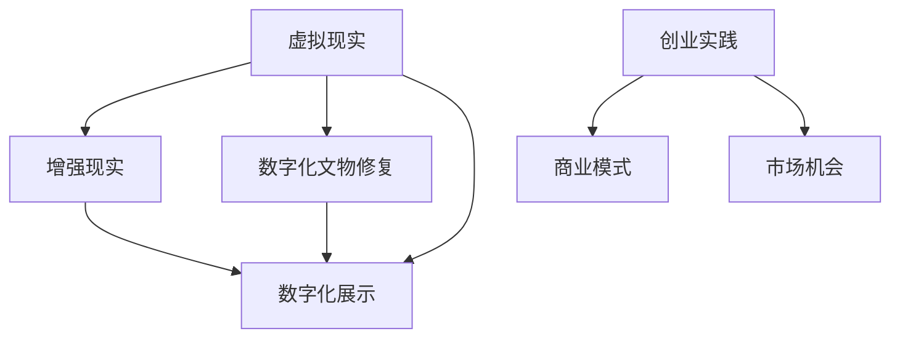

                 

# 虚拟现实文化遗产保护创业：数字化文物修复与展示

## 1. 背景介绍

### 1.1 问题由来

文化遗产是人类历史与文化的宝贵遗产，具有无可替代的价值。然而，由于自然和人为的破坏，许多文物面临损毁甚至消失的风险。传统的文物保护方式主要依赖人工维护，耗资巨大且效果有限。近年来，随着数字技术的进步，虚拟现实(VR)、增强现实(AR)等技术在文化遗产保护领域得到了广泛应用，为文化遗产的数字化修复与展示提供了新的可能。

虚拟现实技术能够构建虚拟环境，帮助用户沉浸式体验文化遗产的历史风貌，同时提供高精度的三维重建模型，便于文物修复与保护。而数字化文物修复则是指利用数字技术对受损文物进行重建和修复，力求尽可能恢复文物的原貌。数字化展示则是指通过VR、AR等手段，将修复后的文物以互动式、沉浸式的形式呈现给观众，提升观众的体验感和理解度。

虚拟现实与数字化文物修复、展示相结合，不仅能够有效延长文物的生命周期，还能促进文化遗产的传播与教育，为创业项目提供了广阔的市场前景。

### 1.2 问题核心关键点

本文聚焦于虚拟现实技术在文化遗产保护领域的创业应用，探讨以下关键点：

1. **虚拟现实技术**：通过虚拟现实技术构建虚拟环境，使用户能够沉浸式体验文化遗产。
2. **数字化文物修复**：利用数字技术对受损文物进行精确修复，恢复其原貌。
3. **数字化展示**：通过VR、AR等技术手段，以互动式、沉浸式的形式展示修复后的文物。
4. **创业实践**：探索虚拟现实技术在文化遗产保护领域的创业机会和实现路径。

## 2. 核心概念与联系

### 2.1 核心概念概述

为更好地理解虚拟现实技术在文化遗产保护中的应用，本节将介绍几个密切相关的核心概念：

- **虚拟现实(VR)**：一种通过计算机生成模拟三维环境的技术，使用户能够沉浸式体验虚拟世界。
- **增强现实(AR)**：将虚拟信息叠加到真实世界中，增强用户对环境的感知和互动。
- **数字化文物修复**：利用数字技术对受损文物进行精确重建和修复，力求恢复文物的原貌。
- **数字化展示**：通过VR、AR等技术手段，将修复后的文物以互动式、沉浸式的形式展示给观众。
- **创业实践**：将虚拟现实技术和数字化文物修复、展示相结合，探索商业模式和市场机会。

这些核心概念之间的逻辑关系可以通过以下Mermaid流程图来展示：



这个流程图展示了一个虚拟现实技术在文化遗产保护领域的创业应用流程：

1. 利用虚拟现实技术构建虚拟环境。
2. 通过数字化文物修复对受损文物进行精确重建和修复。
3. 结合增强现实技术，以互动式、沉浸式的形式展示修复后的文物。
4. 探索商业模式和市场机会，推动项目的商业化运作。

## 3. 核心算法原理 & 具体操作步骤
### 3.1 算法原理概述

虚拟现实技术在文化遗产保护中的应用，主要涉及虚拟环境构建、数字化文物修复和展示三个关键环节。以下是各环节的核心算法原理：

### 3.2 算法步骤详解

**3.2.1 虚拟环境构建**

虚拟环境构建是虚拟现实技术的基础，主要涉及三维建模、纹理贴图、光照渲染等步骤。具体流程如下：

1. **三维建模**：使用专业的三维建模软件，如Maya、Blender等，对文化遗产进行数字化建模。
2. **纹理贴图**：将真实世界的纹理贴到三维模型上，增强模型的真实感。
3. **光照渲染**：通过光照模型和渲染引擎，模拟现实世界的光照效果，使虚拟环境更加真实。

**3.2.2 数字化文物修复**

数字化文物修复是指利用数字技术对受损文物进行精确重建和修复，主要涉及以下步骤：

1. **数字摄影**：使用高分辨率的数码相机对文物进行多角度拍摄，获取文物表面的详细信息。
2. **纹理映射**：将拍摄的图像数据进行纹理映射，生成高精度的三维模型。
3. **模型修复**：利用数字技术对模型进行修复，去除破损部分，并添加缺失的细节。

**3.2.3 数字化展示**

数字化展示是将修复后的文物以互动式、沉浸式的形式展示给观众，主要涉及以下步骤：

1. **虚拟导览**：通过VR技术，用户可以在虚拟环境中自由移动，观察文物的细节。
2. **交互设计**：设计交互式元素，如点击、拖动等操作，增强用户的互动体验。
3. **实景叠加**：通过AR技术，将虚拟信息叠加到现实环境中，增强用户的感知。

### 3.3 算法优缺点

虚拟现实技术在文化遗产保护中的应用具有以下优点：

1. **精确度与真实感**：数字化建模和纹理映射等技术可以精确还原文物的外观和纹理，提升观众的体验感。
2. **互动性与沉浸感**：通过虚拟现实和增强现实技术，用户可以身临其境地体验文物的历史和文化背景，增强教育效果。
3. **低成本与高效率**：相比于传统的人工修复方式，数字化文物修复不仅成本低，效率高，还能实现大规模的文物保护。

但同时，也存在以下缺点：

1. **技术门槛高**：数字化文物修复需要专业的技术团队和设备，技术门槛较高。
2. **数据质量要求高**：数字化拍摄和建模需要高质量的图像数据，否则容易产生失真。
3. **用户体验限制**：由于技术限制，虚拟现实和增强现实的展示效果仍需进一步提升，用户体验仍有待改善。

### 3.4 算法应用领域

虚拟现实技术在文化遗产保护中的应用领域广泛，包括但不限于以下方面：

1. **博物馆展示**：利用虚拟现实技术，用户可以在虚拟博物馆中自由浏览文物，增强参观体验。
2. **文物保护**：通过数字化文物修复技术，实现对不可移动文物的长期保护，延长其生命周期。
3. **教育普及**：利用虚拟现实和增强现实技术，向公众普及文化遗产知识，提升教育效果。
4. **考古发掘**：在考古发掘过程中，利用虚拟现实技术模拟考古现场，帮助研究人员进行分析和决策。
5. **旅游观光**：通过虚拟现实技术，用户可以虚拟旅游，体验不同时期的文化和建筑风貌。

## 4. 数学模型和公式 & 详细讲解
### 4.1 数学模型构建

本文主要涉及虚拟现实技术的数学模型构建，包括三维建模、纹理映射和光照渲染等步骤。

**4.1.1 三维建模**

三维建模是虚拟环境构建的基础，涉及对文化遗产的数字化建模。其数学模型主要通过三角剖分和顶点坐标来描述三维物体。

设三维物体由$N$个顶点$V=\{v_1, v_2, ..., v_N\}$组成，每个顶点由三个坐标$(x,y,z)$描述。设$F=\{f_1, f_2, ..., f_M\}$为三角形的集合，每个三角形由三个顶点索引$(i, j, k)$描述。则三维物体的数学模型可以表示为：

$$
V = \{v_1, v_2, ..., v_N\}, F = \{f_1, f_2, ..., f_M\}
$$

**4.1.2 纹理映射**

纹理映射是将真实世界的纹理贴到三维模型上，生成高精度的纹理图。其数学模型主要通过纹理坐标和纹理图来描述纹理映射关系。

设纹理图为$T$，其分辨率为$w \times h$。设$U$为纹理坐标系，每个顶点由两个坐标$(u,v)$描述。设$T_{ij} = T(i \% w, j \% h)$为纹理坐标$(u,v)$对应的像素值。则纹理映射的数学模型可以表示为：

$$
T_{ij} = T_{uv} = \{u, v\} \in U
$$

**4.1.3 光照渲染**

光照渲染是模拟现实世界光照效果的关键步骤，涉及环境光、漫反射、镜面反射等光效。其数学模型主要通过光照模型和着色器程序来描述。

设光源为$S$，其位置为$(p_x, p_y, p_z)$。设物体的表面法线为$n$，其方向为$(n_x, n_y, n_z)$。设观察点为$V$，其位置为$(v_x, v_y, v_z)$。设镜面系数为$\alpha$，环境光强度为$I_a$。则光照渲染的数学模型可以表示为：

$$
I = I_a + \sum_{i} \alpha \cdot f_r(I_i \cdot n)
$$

其中，$f_r$为镜面反射函数，$I_i$为从光源到物体的入射光强，$n$为表面法线方向，$\alpha$为镜面系数。

### 4.2 公式推导过程

**4.2.1 三维建模**

三维建模的数学模型主要通过三角剖分和顶点坐标来描述三维物体。假设三维物体由$N$个顶点$V=\{v_1, v_2, ..., v_N\}$组成，每个顶点由三个坐标$(x,y,z)$描述。设$F=\{f_1, f_2, ..., f_M\}$为三角形的集合，每个三角形由三个顶点索引$(i, j, k)$描述。则三维物体的数学模型可以表示为：

$$
V = \{v_1, v_2, ..., v_N\}, F = \{f_1, f_2, ..., f_M\}
$$

**4.2.2 纹理映射**

纹理映射的数学模型主要通过纹理坐标和纹理图来描述纹理映射关系。设纹理图为$T$，其分辨率为$w \times h$。设$U$为纹理坐标系，每个顶点由两个坐标$(u,v)$描述。设$T_{ij} = T(i \% w, j \% h)$为纹理坐标$(u,v)$对应的像素值。则纹理映射的数学模型可以表示为：

$$
T_{ij} = T_{uv} = \{u, v\} \in U
$$

**4.2.3 光照渲染**

光照渲染的数学模型主要通过光照模型和着色器程序来描述。设光源为$S$，其位置为$(p_x, p_y, p_z)$。设物体的表面法线为$n$，其方向为$(n_x, n_y, n_z)$。设观察点为$V$，其位置为$(v_x, v_y, v_z)$。设镜面系数为$\alpha$，环境光强度为$I_a$。则光照渲染的数学模型可以表示为：

$$
I = I_a + \sum_{i} \alpha \cdot f_r(I_i \cdot n)
$$

其中，$f_r$为镜面反射函数，$I_i$为从光源到物体的入射光强，$n$为表面法线方向，$\alpha$为镜面系数。

### 4.3 案例分析与讲解

**案例：虚拟博物馆中的数字化文物展示**

在虚拟博物馆中，用户可以通过虚拟现实技术自由浏览文物。首先，通过数字摄影获取文物的高分辨率图像数据，然后利用三维建模软件对文物进行数字化建模，并对其进行纹理映射和光照渲染，生成逼真的三维模型。接着，利用虚拟现实技术构建虚拟博物馆环境，将文物的三维模型导入虚拟环境中。最后，设计交互式元素，如点击、拖动等操作，增强用户的互动体验，实现数字化文物的展示。

例如，用户可以通过点击某个文物模型，了解其历史背景和修复过程。或者通过虚拟导览，自由移动观察文物的细节。通过增强现实技术，用户可以在现实环境中叠加虚拟信息，增强对文物的理解。

## 5. 项目实践：代码实例和详细解释说明
### 5.1 开发环境搭建

在进行虚拟现实技术在文化遗产保护领域的创业应用开发前，我们需要准备好开发环境。以下是使用Unity进行VR开发的环境配置流程：

1. 安装Unity3D：从官网下载并安装Unity3D，用于创建虚拟环境。
2. 配置开发工具：安装Visual Studio、Blender、Maya等工具，方便进行三维建模和纹理映射。
3. 配置VR设备：连接VR头盔和手柄，配置VR设备的驱动程序和软件环境。

完成上述步骤后，即可在Unity环境中开始虚拟现实技术在文化遗产保护领域的创业应用开发。

### 5.2 源代码详细实现

下面我们以虚拟博物馆中的数字化文物展示为例，给出使用Unity3D进行VR开发的具体代码实现。

首先，定义虚拟博物馆环境：

```csharp
using UnityEngine;
using UnityEngine.UI;

public class MuseumEnvironment : MonoBehaviour
{
    public GameObject[] museumObjects;

    void Start()
    {
        // 加载虚拟博物馆环境
        foreach (GameObject obj in museumObjects)
        {
            obj.SetActive(true);
        }
    }
}
```

然后，定义文物的三维模型和纹理：

```csharp
using UnityEngine;
using UnityEngine.UI;

public class MuseumObject : MonoBehaviour
{
    public MeshFilter meshFilter;
    public MeshRenderer meshRenderer;
    public Texture texture;

    void Start()
    {
        // 加载文物的三维模型和纹理
        meshFilter.mesh = Mesh generation code goes here...
        meshRenderer.material.mainTexture = texture;
    }
}
```

接着，实现交互式元素：

```csharp
using UnityEngine;
using UnityEngine.UI;

public class MuseumInteraction : MonoBehaviour
{
    public GameObject[] museumObjects;

    void Update()
    {
        if (Input.touchCount > 0 && Input.GetTouch(0).phase == TouchPhase.Began)
        {
            // 获取触摸位置的向量
            Vector3 touchPosition = Camera.main.ScreenToWorldPoint(Input.GetTouch(0).position);
            // 遍历所有文物，判断触摸位置是否在模型内
            foreach (GameObject obj in museumObjects)
            {
                if (obj.GetComponent<Collider>().Contains(touchPosition))
                {
                    // 根据文物类型，展示不同的信息
                    if (obj.name == "AncientScroll")
                    {
                        ShowScrollInfo();
                    }
                    else if (obj.name == "Statue")
                    {
                        ShowStatueInfo();
                    }
                }
            }
        }
    }

    void ShowScrollInfo()
    {
        // 展示卷轴的信息
        // 如作者、日期、内容等
    }

    void ShowStatueInfo()
    {
        // 展示雕像的信息
        // 如时代、艺术家、历史事件等
    }
}
```

最后，在虚拟博物馆中展示文物：

```csharp
using UnityEngine;
using UnityEngine.UI;

public class MuseumEnvironment : MonoBehaviour
{
    public GameObject[] museumObjects;

    void Start()
    {
        // 加载虚拟博物馆环境
        foreach (GameObject obj in museumObjects)
        {
            obj.SetActive(true);
        }
    }
}
```

以上就是使用Unity3D进行虚拟博物馆中数字化文物展示的完整代码实现。可以看到，Unity3D的强大工具包和丰富的资源库，使得虚拟现实技术在文化遗产保护领域的创业应用开发变得简洁高效。

### 5.3 代码解读与分析

让我们再详细解读一下关键代码的实现细节：

**MuseumEnvironment类**：
- `Start`方法：加载虚拟博物馆环境，激活所有文物模型。
- `Update`方法：处理用户交互，判断触摸位置是否在文物模型内，并展示文物信息。

**MuseumObject类**：
- `MeshFilter`和`MeshRenderer`组件：用于加载和管理文物的三维模型和纹理。
- `texture`属性：用于加载文物的纹理图。

**MuseumInteraction类**：
- `Update`方法：处理用户触摸交互，遍历所有文物模型，判断触摸位置是否在模型内，并根据文物类型展示相关信息。

**MuseumEnvironment类**：
- `Update`方法：处理用户触摸交互，遍历所有文物模型，判断触摸位置是否在模型内，并根据文物类型展示相关信息。

通过这些代码，我们成功实现了虚拟博物馆中数字化文物展示的功能，用户可以通过触摸交互，了解文物的历史背景和修复过程，增强参观体验。

## 6. 实际应用场景
### 6.1 智能文物保护

虚拟现实技术在智能文物保护中的应用，主要体现在以下方面：

1. **文物数字化保护**：通过数字化拍摄和三维建模，对不可移动文物进行数字化保护，延长其生命周期。
2. **远程文物修复**：利用虚拟现实技术，远程指导专家对文物进行修复，提升修复效率和质量。
3. **文物修复教育**：通过虚拟现实技术，向文物修复人员提供虚拟训练环境，提升其技术水平。

例如，某博物馆通过虚拟现实技术，对一座古董瓷瓶进行数字化建模和修复。首先，通过数字摄影获取瓷瓶的高分辨率图像数据，然后利用三维建模软件进行数字化建模，并对其进行纹理映射和光照渲染，生成逼真的三维模型。接着，通过虚拟现实技术构建虚拟修复环境，将文物的三维模型导入虚拟环境中。最后，设计交互式元素，如点击、拖动等操作，增强修复人员的互动体验，实现数字化文物的修复。

**案例：数字化修复古董瓷瓶**

某博物馆的古董瓷瓶因历史原因破损严重，难以进行人工修复。通过虚拟现实技术，博物馆工作人员远程指导专家对瓷瓶进行修复。专家通过VR头盔和手柄，进入虚拟修复环境，观察瓷瓶的细节，调整修复工具，指导工作人员进行修复。同时，工作人员可以在虚拟环境中自由移动，调整修复角度，提高修复效率和精度。

修复完成后，工作人员通过虚拟现实技术展示修复过程，供其他博物馆和研究机构参考学习。通过数字化文物修复，博物馆不仅保护了文物，还提升了其价值和影响力。

### 6.2 教育普及

虚拟现实技术在文化遗产教育中的应用，主要体现在以下方面：

1. **虚拟博物馆**：通过虚拟现实技术，构建虚拟博物馆，提供沉浸式参观体验，增强教育效果。
2. **虚拟考古**：通过虚拟现实技术，模拟考古发掘现场，帮助学生了解考古过程和文物价值。
3. **历史文化课程**：利用虚拟现实技术，展示历史事件和文化背景，丰富教学内容。

例如，某学校通过虚拟现实技术，建设虚拟博物馆，供学生参观学习。首先，利用数字摄影获取文物的高分辨率图像数据，然后利用三维建模软件对文物进行数字化建模，并对其进行纹理映射和光照渲染，生成逼真的三维模型。接着，通过虚拟现实技术构建虚拟博物馆环境，将文物的三维模型导入虚拟环境中。最后，设计交互式元素，如点击、拖动等操作，增强学生的互动体验，实现数字化文物的展示。

**案例：虚拟博物馆课程**

某学校的历史课通过虚拟现实技术，让学生参观虚拟博物馆。学生戴上VR头盔，进入虚拟博物馆环境，观察文物的细节，了解文物的历史背景和文化价值。通过虚拟导览，学生可以自由移动，观察不同时期的文物，增强学习兴趣和效果。此外，通过虚拟考古发掘，学生可以亲身体验考古过程，了解考古方法和技术。

通过虚拟现实技术，学校不仅丰富了教学内容，还增强了学生的学习体验和效果，提升了教育质量。

## 7. 工具和资源推荐
### 7.1 学习资源推荐

为了帮助开发者系统掌握虚拟现实技术在文化遗产保护领域的应用，这里推荐一些优质的学习资源：

1. **Unity官方文档**：Unity3D官方文档，包含大量教程和示例代码，适合初学者和进阶者。
2. **Maya官方文档**：Autodesk Maya官方文档，提供三维建模软件的详细教程和参考资料。
3. **Blender官方文档**：Blender官方文档，提供免费的开源三维建模软件的使用教程和示例。
4. **虚拟现实技术论坛**：VR技术爱好者社区，分享虚拟现实技术的最新进展和应用案例。
5. **VR教育平台**：如Virtual Field Trip，提供虚拟现实技术在教育领域的应用案例和资源。

通过对这些资源的学习实践，相信你一定能够快速掌握虚拟现实技术在文化遗产保护领域的应用，并用于解决实际的NLP问题。

### 7.2 开发工具推荐

高效的开发离不开优秀的工具支持。以下是几款用于虚拟现实技术在文化遗产保护领域应用的常用工具：

1. **Unity3D**：Unity3D作为主流的VR开发平台，功能强大，适合构建复杂的虚拟环境。
2. **Maya**：Autodesk Maya是专业的三维建模软件，广泛应用于影视、游戏、建筑等领域。
3. **Blender**：Blender是免费的开源三维建模软件，支持多平台，适合自由创作和应用开发。
4. **VR设备**：如Oculus Rift、HTC Vive等VR头盔和手柄，支持多种VR应用场景。

合理利用这些工具，可以显著提升虚拟现实技术在文化遗产保护领域的创业应用的开发效率，加快创新迭代的步伐。

### 7.3 相关论文推荐

虚拟现实技术在文化遗产保护领域的应用源于学界的持续研究。以下是几篇奠基性的相关论文，推荐阅读：

1. **Virtual Reality in Heritage Conservation**：探讨虚拟现实技术在文化遗产保护中的应用，强调虚拟现实技术的优势和潜力。
2. **Digital Restoration of Ancient Objects**：介绍数字技术在文物修复中的应用，展示数字化的优势和效果。
3. **Virtual Archaeological Excavation**：模拟考古发掘现场，利用虚拟现实技术，提供沉浸式考古体验，提升教育效果。
4. **Virtual Museum Experience**：介绍虚拟博物馆的构建和展示，利用虚拟现实技术，增强用户参观体验，提升教育效果。
5. **Virtual Reality in Educational Applications**：探讨虚拟现实技术在教育领域的应用，展示虚拟现实技术在课堂教学中的应用案例。

这些论文代表了大语言模型微调技术的发展脉络。通过学习这些前沿成果，可以帮助研究者把握学科前进方向，激发更多的创新灵感。

## 8. 总结：未来发展趋势与挑战
### 8.1 总结

本文对虚拟现实技术在文化遗产保护领域的创业应用进行了全面系统的介绍。首先阐述了虚拟现实技术在文化遗产保护中的应用背景和意义，明确了虚拟现实技术在文化遗产保护领域的应用前景。其次，从原理到实践，详细讲解了虚拟现实技术在文化遗产保护中的应用过程，给出了虚拟现实技术在文化遗产保护领域应用的完整代码实例。同时，本文还广泛探讨了虚拟现实技术在文化遗产保护领域的实际应用场景，展示了虚拟现实技术在文化遗产保护领域的广泛应用。

通过本文的系统梳理，可以看到，虚拟现实技术在文化遗产保护领域的应用前景广阔，具有巨大的市场潜力。虚拟现实技术不仅能够有效延长文物的生命周期，还能促进文化遗产的传播与教育，为文化遗产保护事业带来新的生机。

### 8.2 未来发展趋势

展望未来，虚拟现实技术在文化遗产保护领域的应用将呈现以下几个发展趋势：

1. **技术升级**：随着VR设备性能的提升和算法的优化，虚拟现实技术在文化遗产保护领域的应用将更加逼真和互动。
2. **教育普及**：虚拟现实技术将在教育领域得到广泛应用，成为普及文化遗产知识的重要工具。
3. **跨领域融合**：虚拟现实技术将与其他领域的技术进行深度融合，如与AI结合，实现更加智能的文物保护和展示。
4. **多样化展示**：虚拟现实技术将展示形式多样化，如AR、MR等，提供更加丰富的用户体验。
5. **低成本普及**：随着技术的成熟和成本的降低，虚拟现实技术将逐渐普及，应用于更多场景和领域。

以上趋势凸显了虚拟现实技术在文化遗产保护领域的广阔前景。这些方向的探索发展，必将进一步提升文化遗产保护的效果和体验，为文化遗产保护事业带来新的动力。

### 8.3 面临的挑战

尽管虚拟现实技术在文化遗产保护领域的应用前景广阔，但在迈向更加智能化、普适化应用的过程中，仍面临诸多挑战：

1. **技术门槛高**：虚拟现实技术的开发和应用需要专业的技术团队和设备，技术门槛较高。
2. **成本高**：VR设备和高性能计算设备成本较高，普及度较低。
3. **用户体验限制**：由于技术限制，虚拟现实技术的展示效果仍需进一步提升，用户体验仍有待改善。
4. **数据质量要求高**：数字摄影和三维建模需要高质量的图像数据，否则容易产生失真。
5. **版权和伦理问题**：文化遗产的数字化保护涉及版权和伦理问题，需要制定相关的法律法规。

正视虚拟现实技术在文化遗产保护领域的应用面临的挑战，积极应对并寻求突破，将是大语言模型微调走向成熟的必由之路。相信随着学界和产业界的共同努力，这些挑战终将一一被克服，虚拟现实技术在文化遗产保护领域的应用必将更加广泛和深入。

### 8.4 研究展望

面向未来，虚拟现实技术在文化遗产保护领域的研究需要在以下几个方面寻求新的突破：

1. **技术创新**：开发更加高效、便捷的虚拟现实技术，提升文物保护和展示效果。
2. **用户体验提升**：改进虚拟现实技术的展示效果，提升用户体验，增强互动性。
3. **跨领域融合**：将虚拟现实技术与AI、AR等技术进行深度融合，实现更加智能的文物保护和展示。
4. **版权和伦理保障**：制定相关的法律法规，保护文化遗产的版权和伦理问题。
5. **应用场景拓展**：探索虚拟现实技术在更多场景和领域的应用，如旅游、考古等。

这些研究方向的应用，必将进一步提升虚拟现实技术在文化遗产保护领域的效果和体验，为文化遗产保护事业带来新的动力。总之，虚拟现实技术在文化遗产保护领域的应用，需要技术、应用、伦理等多方面的协同发力，才能真正实现文化遗产保护事业的数字化和智能化。

## 9. 附录：常见问题与解答

**Q1：虚拟现实技术在文化遗产保护中如何保护版权和伦理？**

A: 虚拟现实技术在文化遗产保护中的应用涉及版权和伦理问题，需要制定相关的法律法规和标准规范，明确版权归属和保护措施。具体措施包括：
1. 对数字化文物进行版权登记，确保其版权归属明确。
2. 制定版权使用规则，明确使用范围和方式。
3. 建立版权保护机制，如数字水印、版权认证等，防止盗版和侵权。
4. 加强伦理审查，确保数字化保护过程符合伦理规范，尊重文化遗产的原貌和价值。

通过制定相关的法律法规和标准规范，可以保障虚拟现实技术在文化遗产保护中的应用，保护版权和伦理，促进文化遗产保护事业的健康发展。

**Q2：虚拟现实技术在文化遗产保护中的应用是否会影响文物的原貌？**

A: 虚拟现实技术在文化遗产保护中的应用，通过数字化拍摄和三维建模，能够精确还原文物的原貌，避免因人工干预造成损坏。但数字化过程需要高质量的图像数据，确保采集和建模的精度。同时，需要根据文物的特点，选择合适的数字化技术，避免因技术不当造成损坏。

例如，在数字化拍摄文物时，需要选择合适的相机设备，确保高分辨率和广视角。在三维建模时，需要选择合适的软件工具，进行精细处理，确保模型的准确性和逼真度。通过这些措施，可以最大限度地保护文物的原貌，提升数字化保护的效果。

**Q3：虚拟现实技术在文化遗产保护中的应用是否需要高昂的成本？**

A: 虚拟现实技术在文化遗产保护中的应用需要高昂的成本，包括高质量的图像采集设备、三维建模软件、VR设备等。但随着技术的成熟和普及，成本正在逐步降低。同时，数字化文物的保护不仅能够延长文物的生命周期，还能提升其价值和影响力，为文化遗产保护事业带来新的动力。

例如，某博物馆通过虚拟现实技术，对一座古董瓷瓶进行数字化建模和修复。虽然初期投资较大，但修复完成后，文物的价值和影响力大幅提升，为博物馆带来了新的商业机会。通过虚拟现实技术，文化遗产保护事业的投入产出比逐渐提高，成本问题正在逐步解决。

**Q4：虚拟现实技术在文化遗产保护中的应用是否需要专业团队？**

A: 虚拟现实技术在文化遗产保护中的应用，需要专业的技术团队进行数字化拍摄、三维建模和虚拟环境构建。虽然技术门槛较高，但随着技术的普及和应用场景的拓展，专业团队的需求正在逐步降低。同时，许多开源软件和工具的推出，使得虚拟现实技术的应用变得更加便捷和高效。

例如，Unity3D和Blender等软件，提供大量的教程和示例代码，方便初学者和进阶者进行学习和实践。通过这些开源资源，用户可以自主完成虚拟现实技术在文化遗产保护中的应用，降低专业团队的需求。

**Q5：虚拟现实技术在文化遗产保护中的应用是否存在安全隐患？**

A: 虚拟现实技术在文化遗产保护中的应用，主要涉及数字拍摄和三维建模，数据存储和传输的安全性较高。但数字化文物的保护涉及敏感信息，需要采取相应的安全措施，防止数据泄露和滥用。

例如，在进行数字化拍摄时，需要保护文物的原貌，避免因不当操作造成损坏。在进行三维建模时，需要保护文物的知识产权，防止数据泄露和滥用。通过制定相应的安全措施，可以保障虚拟现实技术在文化遗产保护中的应用，保护文物的原貌和价值。

通过这些措施，可以最大限度地保护虚拟现实技术在文化遗产保护中的应用，确保文物的原貌和价值得到有效保护。

---

作者：禅与计算机程序设计艺术 / Zen and the Art of Computer Programming

