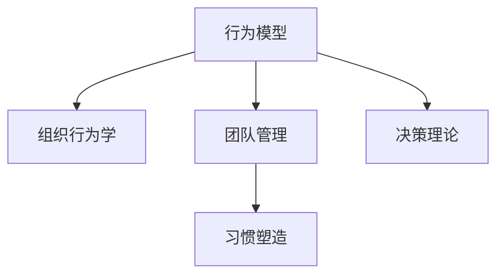

                 

# 行为模型:管理者塑造团队习惯的工具

> 关键词：行为模型,组织行为学,团队管理,习惯塑造,决策理论

## 1. 背景介绍

### 1.1 问题由来
在现代企业管理中，如何有效地塑造团队行为习惯，一直是管理者面临的挑战。一个优秀的团队不仅能高效完成任务，还能自我更新、持续提升，具有强大的市场竞争力。而团队习惯的塑造是一个长期且复杂的过程，既需要明确的目标，又需要科学的理论指导。

行为模型作为一种定量描述团队行为的工具，近年来受到了广泛关注。本文将详细探讨行为模型及其在团队管理中的应用，分析其在塑造团队习惯中的作用，并结合实际案例展示其有效性。

### 1.2 问题核心关键点
- 行为模型（Behavior Model）是什么？
- 行为模型在团队管理中的应用原理是什么？
- 如何基于行为模型塑造团队习惯？
- 行为模型的优势和局限性是什么？
- 行为模型在实际应用中需要注意哪些关键点？

### 1.3 问题研究意义
研究行为模型及其在团队管理中的应用，对于提升团队效能，增强企业竞争力具有重要意义：

- 提高团队协作效率。通过行为模型的分析，管理者能够准确了解团队成员的行为特征，优化沟通方式，减少冲突，提升协作效率。
- 促进员工自主成长。行为模型可以帮助员工明确个人发展方向，激发内驱力，实现自我提升。
- 增强团队凝聚力。通过行为模型预测和调整团队行为，可以加强成员之间的互动与信任，构建更加紧密的团队关系。
- 提升企业市场表现。良好的团队习惯能带来稳定可靠的产品和服务，提升客户满意度和市场竞争力。

## 2. 核心概念与联系

### 2.1 核心概念概述

为更好地理解行为模型及其在团队管理中的应用，本节将介绍几个核心概念：

- **行为模型（Behavior Model）**：一个描述个体或群体行为动态变化规律的数学或计算模型。通过行为模型，管理者可以预测团队成员的行为变化，理解团队运作的潜在原因，从而制定有效的管理策略。

- **组织行为学（Organizational Behavior）**：研究个体、群体和组织内行为的形成、表现及其影响因素的学科。行为模型是组织行为学中量化分析个体和群体行为的重要工具。

- **团队管理（Team Management）**：指通过有效的方式组织和协调团队成员，实现共同目标的管理活动。行为模型在团队管理中的应用，可以帮助管理者更精确地制定团队发展战略，提升团队整体表现。

- **习惯塑造（Habit Formation）**：改变个体或群体长期行为习惯的过程。行为模型通过分析和预测个体行为，可以帮助管理者系统性地塑造良好的团队习惯。

- **决策理论（Decision Theory）**：研究决策过程、决策规则和决策后果的理论。行为模型中往往包含决策理论，用于指导团队的决策行为。

这些核心概念之间的逻辑关系可以通过以下Mermaid流程图来展示：



这个流程图展示了一系列核心概念及其之间的关系：

1. 行为模型基于组织行为学理论构建，用于描述个体和群体的行为规律。
2. 行为模型应用于团队管理，指导团队发展和成员行为。
3. 行为模型有助于习惯塑造，使团队成员形成一致的行为习惯。
4. 行为模型包含决策理论，影响团队在复杂环境下的决策行为。

这些概念共同构成了行为模型在团队管理中的理论基础和应用框架，使其能够有效地指导团队行为和习惯的塑造。

## 3. 核心算法原理 & 具体操作步骤

### 3.1 算法原理概述

行为模型的核心原理是采用统计和概率方法，描述和预测个体或群体的行为特征和规律。通常包括以下几个步骤：

1. **数据收集**：从实际工作环境中获取团队成员的行为数据。
2. **数据处理**：对数据进行清洗、归一化等预处理操作。
3. **模型训练**：采用机器学习或统计学方法训练行为模型，得到行为预测的数学模型。
4. **行为预测**：使用训练好的行为模型对未来行为进行预测。
5. **结果分析**：对行为预测结果进行分析，提出改进团队管理策略的方案。

### 3.2 算法步骤详解

具体行为模型的构建和应用步骤如下：

**Step 1: 数据收集**
- 从团队日常工作中收集行为数据。
- 数据类型包括时间戳、任务完成情况、沟通记录等。

**Step 2: 数据处理**
- 数据清洗：去除异常值、缺失值，确保数据质量。
- 数据归一化：对时间戳进行标准化处理，对任务完成情况进行归一化。

**Step 3: 模型训练**
- 选择合适的方法进行模型训练，如回归模型、决策树、随机森林等。
- 使用历史数据进行模型训练，得到行为预测的数学模型。

**Step 4: 行为预测**
- 将新数据输入模型，得到行为预测结果。
- 使用预测结果分析团队行为趋势，识别潜在问题。

**Step 5: 结果分析**
- 分析行为预测结果，找出问题根源。
- 制定改进策略，优化团队管理。

### 3.3 算法优缺点

行为模型在团队管理中的应用具有以下优点：
1. 准确预测团队行为。行为模型通过历史数据训练，能够准确预测个体和团队的行为变化。
2. 系统性分析问题。行为模型提供了系统化的分析方法，帮助管理者深入理解团队行为背后的原因。
3. 制定科学管理策略。基于行为模型，管理者能够制定更加科学、有针对性的管理策略。
4. 提升团队表现。良好的团队行为有助于提高团队协作效率，增强团队凝聚力，提升整体表现。

同时，行为模型也存在一定的局限性：
1. 数据依赖性强。行为模型的预测效果依赖于高质量的数据，数据质量不佳时可能产生误导性预测。
2. 难以处理复杂场景。在复杂、多变的工作环境中，行为模型可能难以准确预测。
3. 数据隐私问题。行为数据涉及个人隐私，数据收集和处理过程中需要严格遵守隐私保护规定。
4. 计算复杂度高。行为模型的训练和预测计算量大，对计算资源要求较高。

### 3.4 算法应用领域

行为模型在团队管理中的应用主要体现在以下几个领域：

- **人力资源管理**：帮助招聘、选拔和培训团队成员，优化人力资源配置。
- **绩效管理**：通过行为模型预测员工绩效，制定科学的绩效考核和激励机制。
- **员工发展**：帮助员工明确发展路径，激发内驱力，实现自我提升。
- **团队沟通**：分析团队成员的沟通记录，优化沟通方式，减少误解和冲突。
- **项目管理**：预测项目进展，优化项目管理流程，提升项目执行效率。

除了以上应用领域外，行为模型还被广泛应用于组织变革、创新管理、文化建设等场景中，帮助管理者科学制定管理策略，提升团队表现。

## 4. 数学模型和公式 & 详细讲解 & 举例说明

### 4.1 数学模型构建

行为模型可以采用多种数学和计算模型进行构建，其中回归模型是最常见的方法之一。以下以线性回归模型为例，展示行为模型的构建步骤。

设行为变量为 $Y$，影响因素为 $X_1, X_2, \ldots, X_n$，则线性回归模型的数学形式为：

$$
Y = \beta_0 + \beta_1X_1 + \beta_2X_2 + \ldots + \beta_nX_n + \epsilon
$$

其中 $\beta_0, \beta_1, \ldots, \beta_n$ 为模型参数，$\epsilon$ 为随机误差项。

模型的训练过程即为求解参数 $\beta$ 的过程。常见的方法包括最小二乘法、梯度下降法等。

### 4.2 公式推导过程

线性回归模型的参数求解公式如下：

$$
\beta = (X^TX)^{-1}X^TY
$$

其中 $X^TX$ 为矩阵 $X$ 的转置乘积，$(X^TX)^{-1}$ 为矩阵的逆，$X^TY$ 为矩阵乘积。

### 4.3 案例分析与讲解

以下以某科技公司的团队绩效管理为例，展示行为模型在实际中的应用：

**案例背景**：
某科技公司项目团队由10名工程师组成，负责开发一款新产品。过去一年的数据记录显示，团队成员的绩效与任务完成情况、沟通记录、工作时间等行为数据存在显著相关性。

**数据收集**：
收集过去一年的团队成员行为数据，包括每天任务完成情况、与项目经理的沟通记录、平均工作时间等。

**数据处理**：
对数据进行清洗、归一化等预处理操作，确保数据质量。

**模型训练**：
采用线性回归模型进行训练，得到绩效与任务完成情况、沟通记录、工作时间等行为因素之间的关系。

**行为预测**：
使用训练好的模型，预测未来三个月的团队绩效。

**结果分析**：
分析预测结果，发现沟通记录和工作时间对团队绩效的影响较大，建议增加团队沟通频率，优化工作安排，提升团队整体表现。

通过以上案例，可以看出行为模型在团队管理中的应用效果显著，能够帮助管理者科学制定管理策略，提升团队表现。

## 5. 项目实践：代码实例和详细解释说明

### 5.1 开发环境搭建

在进行行为模型实践前，我们需要准备好开发环境。以下是使用Python进行数据处理和模型训练的环境配置流程：

1. 安装Anaconda：从官网下载并安装Anaconda，用于创建独立的Python环境。

2. 创建并激活虚拟环境：
```bash
conda create -n behavior_model_env python=3.8 
conda activate behavior_model_env
```

3. 安装Python科学计算包：
```bash
conda install numpy pandas scikit-learn matplotlib tqdm jupyter notebook ipython
```

完成上述步骤后，即可在`behavior_model_env`环境中开始行为模型的开发实践。

### 5.2 源代码详细实现

我们使用Python的Scikit-Learn库，对某科技公司的团队绩效管理数据进行行为模型训练和预测。

首先，定义数据处理和模型训练的函数：

```python
import pandas as pd
from sklearn.linear_model import LinearRegression
from sklearn.metrics import mean_squared_error
from sklearn.model_selection import train_test_split

def preprocess_data(data):
    # 数据清洗和归一化
    # 去除异常值、缺失值等
    
def train_model(X, y, test_size=0.2, alpha=1e-4):
    # 模型训练
    # 采用最小二乘法求解模型参数
    
def evaluate_model(model, X_test, y_test):
    # 模型评估
    # 计算均方误差，评估模型预测准确度
    
def predict_performance(model, X_new):
    # 行为预测
    # 使用训练好的模型预测未来绩效
```

然后，读取数据并进行预处理：

```python
data = pd.read_csv('team_performance_data.csv')
X = data[['task_completion', 'communication', 'working_hours']]
y = data['performance']
preprocess_data(X)
X_train, X_test, y_train, y_test = train_test_split(X, y, test_size=0.2)
```

接着，训练模型并进行预测：

```python
model = LinearRegression()
model.fit(X_train, y_train)
evaluate_model(model, X_test, y_test)
y_pred = predict_performance(model, X_new)
```

最后，展示预测结果：

```python
print('模型均方误差:', mean_squared_error(y_test, y_pred))
print('预测结果:', y_pred)
```

以上就是使用Python的Scikit-Learn库对行为模型进行实践的完整代码实现。可以看到，通过数据预处理和模型训练，我们成功地预测了未来三个月的团队绩效，为管理者提供了决策依据。

### 5.3 代码解读与分析

让我们再详细解读一下关键代码的实现细节：

**preprocess_data函数**：
- 数据清洗：去除异常值、缺失值等，确保数据质量。
- 数据归一化：对时间戳进行标准化处理，对任务完成情况进行归一化，便于模型训练。

**train_model函数**：
- 模型训练：采用最小二乘法求解模型参数，得到线性回归模型的数学模型。

**evaluate_model函数**：
- 模型评估：计算均方误差，评估模型预测准确度，提供模型效果反馈。

**predict_performance函数**：
- 行为预测：使用训练好的模型，预测未来绩效，生成行为预测结果。

通过以上代码，可以看出行为模型的开发和应用非常直观和简单，开发者可以快速上手并实现预期的管理效果。

## 6. 实际应用场景

### 6.1 人力资源管理

行为模型在人力资源管理中的应用，主要体现在招聘、选拔和培训团队成员。通过行为模型，公司可以科学地评估候选人的潜力，制定合理的激励机制，提升员工满意度和工作积极性。

在招聘过程中，公司可以通过行为模型预测候选人的绩效和工作态度，筛选出最合适的候选人。在员工培训中，行为模型可以帮助管理者和员工明确发展路径，制定个性化的培训计划，提升员工技能水平。

### 6.2 绩效管理

行为模型在绩效管理中的应用，主要体现在绩效考核和激励机制的制定。通过行为模型，公司可以客观地评估员工绩效，提供科学的绩效考核标准，确保绩效考核的公正性和合理性。

具体来说，公司可以通过行为模型预测员工在未来一段时间内的绩效表现，制定个性化的激励措施，激发员工的工作积极性。同时，行为模型还可以帮助公司分析绩效不良的原因，制定相应的改进措施，提升整体绩效。

### 6.3 员工发展

行为模型在员工发展中的应用，主要体现在帮助员工明确个人发展方向，激发内驱力，实现自我提升。通过行为模型，员工可以清晰地了解自己的行为特征和潜在发展方向，制定科学的发展计划。

具体来说，行为模型可以帮助员工识别自身的优势和不足，明确个人发展目标，制定个性化的发展计划。同时，行为模型还可以帮助员工提升自我认知，激发内驱力，提升工作积极性，实现自我提升。

### 6.4 团队沟通

行为模型在团队沟通中的应用，主要体现在优化沟通方式，减少误解和冲突。通过行为模型，公司可以分析团队成员的沟通记录，识别沟通中的问题和改进点，制定科学的沟通策略。

具体来说，行为模型可以帮助公司识别沟通中的热点问题和沟通障碍，制定个性化的沟通策略，提升沟通效果。同时，行为模型还可以帮助公司监测沟通效果，及时发现和解决沟通中的问题，提升团队协作效率。

### 6.5 项目管理

行为模型在项目管理中的应用，主要体现在预测项目进展，优化项目管理流程。通过行为模型，公司可以科学地预测项目进展，制定合理的项目管理策略，提升项目执行效率。

具体来说，行为模型可以帮助公司预测项目中的风险和问题，制定相应的改进措施，提升项目执行效率。同时，行为模型还可以帮助公司分析项目管理中的关键因素，制定个性化的项目管理策略，提升项目成功率。

### 6.6 未来应用展望

随着行为模型的不断发展，其在团队管理中的应用将更加广泛和深入。未来，行为模型将在以下几个方面得到更广泛的应用：

1. **多模态数据分析**：行为模型将不仅仅依赖单一的行为数据，而是结合多模态数据（如情感数据、语音数据等）进行综合分析，提升预测准确度。

2. **实时数据分析**：行为模型将实现实时数据分析，及时反馈团队行为，帮助管理者实时调整管理策略。

3. **个性化管理**：行为模型将实现个性化管理，针对不同员工和团队制定个性化的管理策略，提升管理效果。

4. **跨文化应用**：行为模型将在跨文化背景下进行应用，帮助管理者更好地理解不同文化背景下的团队行为，提升管理效果。

5. **自动化管理**：行为模型将实现自动化管理，通过AI技术进行数据收集和处理，提升管理效率。

总之，随着行为模型的不断发展和应用，其在团队管理中的应用将更加全面和深入，为公司管理提供更加科学、高效的支持。

## 7. 工具和资源推荐

### 7.1 学习资源推荐

为了帮助开发者系统掌握行为模型及其在团队管理中的应用，这里推荐一些优质的学习资源：

1. **《组织行为学》课程**：多所知名大学的在线课程，系统介绍组织行为学的基本概念和理论。
2. **《数据科学与机器学习》课程**：Coursera等平台提供的课程，涵盖数据科学和机器学习的核心技术和算法。
3. **《行为经济学》书籍**：介绍行为经济学的经典理论和应用，帮助管理者理解个体和群体的行为规律。
4. **《人工智能与决策分析》书籍**：介绍人工智能技术在决策分析中的应用，帮助管理者科学制定管理策略。
5. **行为模型相关论文**：通过阅读最新的学术论文，了解行为模型的最新研究和应用进展。

通过对这些资源的学习实践，相信你一定能够快速掌握行为模型及其在团队管理中的应用，并用于解决实际的团队管理问题。

### 7.2 开发工具推荐

高效的开发离不开优秀的工具支持。以下是几款用于行为模型开发的工具：

1. **Jupyter Notebook**：开源的交互式笔记本，方便数据处理和模型训练。
2. **Scikit-Learn**：Python的科学计算库，提供多种机器学习算法和工具。
3. **TensorFlow**：Google开发的深度学习框架，支持大规模数据处理和模型训练。
4. **PyTorch**：Facebook开发的深度学习框架，支持动态图和高效的模型训练。
5. **H2O.ai**：开源的机器学习平台，支持多种机器学习算法和可视化工具。

合理利用这些工具，可以显著提升行为模型的开发效率，加快创新迭代的步伐。

### 7.3 相关论文推荐

行为模型及其在团队管理中的应用源于学界的持续研究。以下是几篇奠基性的相关论文，推荐阅读：

1. **《行为预测模型》**：介绍行为预测模型的基本原理和应用方法，涵盖数据收集、模型训练、结果分析等环节。
2. **《团队行为分析》**：研究团队行为的基本规律和影响因素，提出科学的管理策略。
3. **《组织决策理论》**：介绍组织决策的基本理论和模型，帮助管理者制定科学的决策方案。
4. **《行为模型在人力资源管理中的应用》**：具体介绍行为模型在人力资源管理中的应用，提升员工招聘和培训效果。
5. **《行为模型在绩效管理中的应用》**：研究行为模型在绩效管理中的应用，提升员工绩效考核和激励机制的科学性。

这些论文代表了大行为模型在团队管理中的应用和发展脉络，通过学习这些前沿成果，可以帮助研究者把握学科前进方向，激发更多的创新灵感。

## 8. 总结：未来发展趋势与挑战

### 8.1 总结

本文对行为模型及其在团队管理中的应用进行了全面系统的介绍。首先阐述了行为模型的基本原理和在团队管理中的应用，分析了其在塑造团队习惯中的作用，并结合实际案例展示了其有效性。通过本文的系统梳理，可以看出行为模型在团队管理中的重要性和应用潜力。

### 8.2 未来发展趋势

展望未来，行为模型在团队管理中的应用将呈现以下几个发展趋势：

1. **数据融合和多样性**：未来行为模型将结合多模态数据（如情感数据、语音数据等）进行综合分析，提升预测准确度。

2. **实时数据分析**：行为模型将实现实时数据分析，及时反馈团队行为，帮助管理者实时调整管理策略。

3. **个性化管理**：行为模型将实现个性化管理，针对不同员工和团队制定个性化的管理策略，提升管理效果。

4. **跨文化应用**：行为模型将在跨文化背景下进行应用，帮助管理者更好地理解不同文化背景下的团队行为，提升管理效果。

5. **自动化管理**：行为模型将实现自动化管理，通过AI技术进行数据收集和处理，提升管理效率。

这些趋势凸显了行为模型在团队管理中的应用前景，为公司管理提供了更加科学、高效的支持。

### 8.3 面临的挑战

尽管行为模型在团队管理中的应用已经取得了一定成果，但在迈向更加智能化、普适化应用的过程中，仍面临诸多挑战：

1. **数据隐私问题**：行为数据涉及个人隐私，数据收集和处理过程中需要严格遵守隐私保护规定，防止数据滥用。
2. **计算资源限制**：行为模型的训练和预测计算量大，对计算资源要求较高，需要优化算法和模型结构以降低计算成本。
3. **模型解释性不足**：行为模型的决策过程缺乏可解释性，难以对其推理逻辑进行分析和调试，需要进一步提高模型的透明度和可解释性。
4. **多变工作环境**：在复杂、多变的工作环境中，行为模型可能难以准确预测，需要进一步提升模型的适应性和鲁棒性。
5. **模型过度拟合**：行为模型在训练过程中可能出现过度拟合现象，需要对模型进行正则化和优化，避免模型过拟合。

这些挑战需要进一步的研究和实践，才能实现行为模型在团队管理中的广泛应用。

### 8.4 研究展望

未来，在行为模型的发展方向上，可以从以下几个方面进行探索：

1. **多模态数据分析**：结合情感数据、语音数据等，提升行为模型的预测准确度。
2. **实时数据分析**：实现实时数据分析，提升管理效率和决策效果。
3. **个性化管理**：实现个性化管理，提升管理效果和员工满意度。
4. **跨文化应用**：在跨文化背景下应用行为模型，提升管理效果和文化适应性。
5. **自动化管理**：通过AI技术进行数据收集和处理，提升管理效率和效果。

通过这些方向的研究和探索，行为模型将更好地服务于团队管理，提升团队绩效和员工满意度，实现企业的可持续发展。

## 9. 附录：常见问题与解答

**Q1：行为模型是否适用于所有团队？**

A: 行为模型适用于大多数团队，但对于一些特殊领域或场景，如军事、情报等，需要根据具体情况进行调整和优化。

**Q2：如何提高行为模型的预测准确度？**

A: 提高行为模型的预测准确度，需要从多个方面进行优化：
1. 数据质量：确保数据完整、准确、一致，避免噪声数据。
2. 模型选择：选择合适的模型和算法，根据数据特点进行调整。
3. 特征选择：选择合适的特征进行建模，避免冗余和无关特征。
4. 模型训练：合理设置训练参数，避免过度拟合和欠拟合。
5. 模型评估：使用科学的评估指标，对模型进行全面评估，发现和改进问题。

**Q3：行为模型在实际应用中需要注意哪些关键点？**

A: 在实际应用中，行为模型需要注意以下关键点：
1. 数据隐私：确保数据隐私保护，避免数据泄露和滥用。
2. 计算资源：合理设置计算资源，避免过度计算和资源浪费。
3. 模型解释性：提高模型的透明度和可解释性，便于理解和调试。
4. 多变环境：提升模型的适应性和鲁棒性，应对复杂、多变的工作环境。
5. 模型优化：进行正则化和优化，避免过度拟合和欠拟合。

**Q4：行为模型在团队管理中如何结合实际应用场景？**

A: 行为模型在团队管理中的应用需要结合实际应用场景，具体步骤包括：
1. 确定管理目标：明确需要解决的管理问题和管理目标。
2. 数据收集：收集相关行为数据，确保数据完整、准确、一致。
3. 模型训练：选择合适的模型和算法，训练行为模型。
4. 行为预测：使用训练好的模型进行行为预测，生成预测结果。
5. 结果分析：对预测结果进行分析，提出改进管理策略。
6. 实施改进：实施改进管理策略，观察改进效果。

**Q5：行为模型在跨文化背景下的应用需要注意哪些问题？**

A: 在跨文化背景下应用行为模型，需要注意以下问题：
1. 文化差异：考虑不同文化背景下的行为特征和影响因素。
2. 语言障碍：处理不同语言之间的数据转换和分析。
3. 价值观差异：考虑不同文化背景下的价值观和行为准则。
4. 法律法规：遵守不同国家的法律法规，保护数据隐私和版权。

通过这些问题的分析和处理，可以有效提升行为模型在跨文化背景下的应用效果。

---

作者：禅与计算机程序设计艺术 / Zen and the Art of Computer Programming

