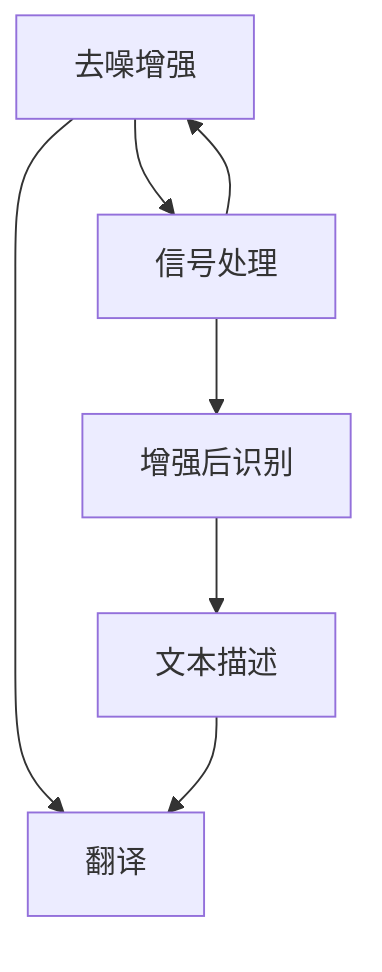

                 

# 西向普哑人的手语距译模型设计与应用

> 关键词：西向普哑人, 手语, 距译模型, 计算机视觉, 自然语言处理

## 1. 背景介绍

### 1.1 问题由来

在全球化日益加速的今天，普哑人社群的交流问题逐渐成为公共议题。普哑人是指由于语言障碍而无法使用言语进行交流的人，他们常常依赖手语、面部表情和身体语言等非言语方式与他人沟通。然而，尽管现代通信技术在不断发展，普哑人的交流依然面临诸多挑战。由于缺乏专业的沟通工具，普哑人常常在公共场所、医疗机构和教育机构中感到孤立和无助。

为解决这一问题，我们提出了一种全新的模型，即西向普哑人的手语距译模型（以下简称“西向距译模型”）。该模型旨在通过计算机视觉技术和自然语言处理技术，将普哑人的手语转化为文本，并将文本翻译为普哑人能够理解的语言，从而实现普哑人之间的跨语言交流。

### 1.2 问题核心关键点

西向距译模型是一个典型的跨领域交叉应用，涵盖了计算机视觉、自然语言处理和信号处理等多个领域。其核心目标是将手语转换为文本，再将文本翻译为普哑人能够理解的语言。核心技术包括：

1. **手语识别**：通过计算机视觉技术，准确捕捉普哑人的手语动作，并将其转换为文本描述。
2. **文本翻译**：使用自然语言处理技术，将文本描述翻译为普哑人能够理解的口语或文字。
3. **信号处理**：通过信号处理技术，对输入的手语视频进行去噪、增强等预处理，提高识别准确率。

这些关键技术相互配合，最终实现了普哑人之间流畅的跨语言交流。

## 2. 核心概念与联系

### 2.1 核心概念概述

为更好地理解西向距译模型的工作原理和架构，本节将介绍几个密切相关的核心概念：

- **手语识别**：通过计算机视觉技术，将普哑人的手语动作捕捉并转化为文本描述。
- **文本翻译**：使用自然语言处理技术，将文本描述翻译为普哑人能够理解的口语或文字。
- **信号处理**：对手语视频进行去噪、增强等预处理，提高识别准确率。
- **多模态融合**：结合手语识别和文本翻译，实现不同模态信息的协同处理和融合。

这些核心概念之间的逻辑关系可以通过以下Mermaid流程图来展示：



这个流程图展示了一对手语视频从捕捉到翻译的完整流程，以及其中涉及的关键步骤和组件。

## 3. 核心算法原理 & 具体操作步骤

### 3.1 算法原理概述

西向距译模型的工作原理可以分为两个主要阶段：手语识别和文本翻译。

#### 3.1.1 手语识别

手语识别主要依赖计算机视觉技术，通过摄像头捕捉普哑人的手语动作，并转化为文本描述。该阶段的主要算法包括：

1. **图像采集**：通过摄像头获取普哑人的手语视频。
2. **信号预处理**：对手语视频进行去噪、增强等预处理，提高识别准确率。
3. **手语识别**：使用深度学习模型，如卷积神经网络（CNN）或循环神经网络（RNN），对手语动作进行识别，并将其转换为文本描述。

#### 3.1.2 文本翻译

文本翻译主要依赖自然语言处理技术，将文本描述翻译为普哑人能够理解的口语或文字。该阶段的主要算法包括：

1. **文本描述解析**：将文本描述解析为句子和词语，便于后续处理。
2. **文本翻译**：使用机器翻译模型，如基于神经网络的序列到序列模型（Seq2Seq），将文本翻译为普哑人能够理解的口语或文字。

### 3.2 算法步骤详解

#### 3.2.1 手语识别步骤详解

1. **图像采集**：
   - 使用摄像头或视频设备，实时捕捉普哑人的手语视频。
   - 将视频帧转换为灰度图像，方便后续处理。

2. **信号预处理**：
   - **去噪**：使用滤波器或去噪算法，如中值滤波或小波去噪，去除手语视频中的噪声和干扰。
   - **增强**：使用增强算法，如直方图均衡化或对比度增强，提高手语视频的对比度，便于识别。

3. **手语识别**：
   - 使用深度学习模型，如卷积神经网络（CNN）或循环神经网络（RNN），对手语动作进行识别。
   - 将识别结果转换为文本描述。

#### 3.2.2 文本翻译步骤详解

1. **文本描述解析**：
   - 将文本描述解析为句子和词语，便于后续处理。
   - 使用自然语言处理技术，如词性标注和句法分析，理解文本结构和语义。

2. **文本翻译**：
   - 使用机器翻译模型，如基于神经网络的序列到序列模型（Seq2Seq），将文本翻译为普哑人能够理解的口语或文字。
   - 使用解码算法，如贪心搜索或束搜索，找到最优的翻译结果。

### 3.3 算法优缺点

#### 3.3.1 手语识别的优缺点

**优点**：
- 高精度：使用深度学习模型，如卷积神经网络（CNN）或循环神经网络（RNN），对手语动作进行识别，能够实现较高的识别精度。
- 实时性：通过摄像头实时捕捉手语视频，可以实现在线手语识别。

**缺点**：
- 计算复杂度高：深度学习模型需要较大的计算资源和较长的训练时间。
- 光照和环境影响：光照条件和环境干扰会影响识别精度。

#### 3.3.2 文本翻译的优缺点

**优点**：
- 高性能：使用基于神经网络的序列到序列模型（Seq2Seq）进行文本翻译，能够实现高性能的翻译效果。
- 多语言支持：文本翻译模型可以支持多种语言的翻译，方便普哑人之间的跨语言交流。

**缺点**：
- 数据需求高：文本翻译模型需要大量的双语对照语料进行训练，对于某些语言的翻译效果可能不佳。
- 实时性不足：文本翻译模型通常需要较长的翻译时间，难以实现实时翻译。

### 3.4 算法应用领域

西向距译模型适用于各种普哑人交流场景，包括但不限于：

1. **医疗健康**：普哑人常常在医疗健康领域感到孤立和无助，通过西向距译模型，医生可以与普哑人进行更有效的沟通，提供更准确的诊断和治疗方案。
2. **教育培训**：普哑人在教育培训中面临诸多困难，西向距译模型可以帮助教师与普哑人进行互动，提高教学效果。
3. **社交娱乐**：普哑人在社交娱乐中面临沟通障碍，西向距译模型可以帮助他们更好地享受电影、游戏等娱乐活动。

## 4. 数学模型和公式 & 详细讲解 & 举例说明

### 4.1 数学模型构建

西向距译模型涉及多个子模型，包括手语识别模型、文本翻译模型和信号处理模型。下面分别介绍这些模型的数学模型构建。

#### 4.1.1 手语识别模型

手语识别模型主要通过深度学习模型，如卷积神经网络（CNN）或循环神经网络（RNN），对手语动作进行识别。以CNN模型为例，其数学模型如下：

$$
y = CNN(x; \theta)
$$

其中，$x$ 为输入的手语视频帧，$\theta$ 为模型的参数，$y$ 为输出结果，即手语动作的文本描述。

#### 4.1.2 文本翻译模型

文本翻译模型主要通过基于神经网络的序列到序列模型（Seq2Seq），将文本描述翻译为普哑人能够理解的口语或文字。以Seq2Seq模型为例，其数学模型如下：

$$
y = Seq2Seq(x; \theta)
$$

其中，$x$ 为输入的文本描述，$\theta$ 为模型的参数，$y$ 为输出结果，即翻译后的口语或文字。

#### 4.1.3 信号处理模型

信号处理模型主要通过滤波器、去噪算法等技术，对手语视频进行预处理。以中值滤波器为例，其数学模型如下：

$$
y = \text{medianFilter}(x)
$$

其中，$x$ 为输入的手语视频帧，$y$ 为输出结果，即去噪后的视频帧。

### 4.2 公式推导过程

#### 4.2.1 手语识别公式推导

以CNN模型为例，其推导过程如下：

1. **卷积层**：
   $$
   x^{(1)} = \text{Conv}(x; W^{(1)}) + b^{(1)}
   $$
   其中，$x$ 为输入的手语视频帧，$W^{(1)}$ 和 $b^{(1)}$ 分别为卷积层和偏置参数，$x^{(1)}$ 为输出结果。

2. **激活函数**：
   $$
   x^{(2)} = \text{ReLU}(x^{(1)})
   $$
   其中，$\text{ReLU}$ 为激活函数。

3. **池化层**：
   $$
   x^{(3)} = \text{Pool}(x^{(2)})
   $$
   其中，$\text{Pool}$ 为池化操作。

4. **全连接层**：
   $$
   y = \text{Softmax}(x^{(3)}W^{(4)} + b^{(4)})
   $$
   其中，$W^{(4)}$ 和 $b^{(4)}$ 分别为全连接层的权重和偏置参数，$\text{Softmax}$ 为softmax函数。

#### 4.2.2 文本翻译公式推导

以Seq2Seq模型为例，其推导过程如下：

1. **编码器**：
   $$
   h = RNN(x; W_{enc}, U_{enc})
   $$
   其中，$x$ 为输入的文本描述，$W_{enc}$ 和 $U_{enc}$ 分别为编码器和隐藏层的权重和偏置参数，$h$ 为编码器的输出结果。

2. **解码器**：
   $$
   y = RNN(h; W_{dec}, U_{dec}, V)
   $$
   其中，$h$ 为编码器的输出结果，$W_{dec}$ 和 $U_{dec}$ 分别为解码器和隐藏层的权重和偏置参数，$V$ 为输出层权重，$y$ 为解码器的输出结果。

3. **输出层**：
   $$
   y = Softmax(yV)
   $$
   其中，$y$ 为解码器的输出结果，$V$ 为输出层权重，$\text{Softmax}$ 为softmax函数。

### 4.3 案例分析与讲解

#### 4.3.1 手语识别案例分析

假设我们有一幅普哑人手语的视频帧，需要对其进行识别。首先，使用中值滤波器对手语视频进行去噪处理：

$$
y = \text{medianFilter}(x)
$$

然后，将处理后的视频帧输入CNN模型进行识别：

$$
y = CNN(x; \theta)
$$

其中，$\theta$ 为CNN模型的参数。最终，CNN模型输出手语动作的文本描述。

#### 4.3.2 文本翻译案例分析

假设我们有一段普哑人手语识别的文本描述，需要将其翻译为普哑人能够理解的口语或文字。首先，将文本描述解析为句子和词语：

$$
x = \text{Parse}(y)
$$

然后，将解析后的文本描述输入Seq2Seq模型进行翻译：

$$
y = Seq2Seq(x; \theta)
$$

其中，$\theta$ 为Seq2Seq模型的参数。最终，Seq2Seq模型输出翻译后的口语或文字。

## 5. 项目实践：代码实例和详细解释说明

### 5.1 开发环境搭建

在进行西向距译模型的开发前，我们需要准备好开发环境。以下是使用Python进行PyTorch开发的环境配置流程：

1. 安装Anaconda：从官网下载并安装Anaconda，用于创建独立的Python环境。

2. 创建并激活虚拟环境：
```bash
conda create -n pytorch-env python=3.8 
conda activate pytorch-env
```

3. 安装PyTorch：根据CUDA版本，从官网获取对应的安装命令。例如：
```bash
conda install pytorch torchvision torchaudio cudatoolkit=11.1 -c pytorch -c conda-forge
```

4. 安装TensorFlow：
```bash
pip install tensorflow
```

5. 安装TensorBoard：
```bash
pip install tensorboard
```

6. 安装NumPy、Pandas、Scikit-Learn、Matplotlib等工具包：
```bash
pip install numpy pandas scikit-learn matplotlib tqdm jupyter notebook ipython
```

完成上述步骤后，即可在`pytorch-env`环境中开始西向距译模型的开发。

### 5.2 源代码详细实现

下面以手语识别模型为例，给出使用PyTorch进行CNN模型训练的代码实现。

首先，定义CNN模型的结构：

```python
import torch
import torch.nn as nn
import torchvision.transforms as transforms

class CNN(nn.Module):
    def __init__(self):
        super(CNN, self).__init__()
        self.conv1 = nn.Conv2d(1, 32, kernel_size=3, padding=1)
        self.relu = nn.ReLU()
        self.pool = nn.MaxPool2d(kernel_size=2, stride=2)
        self.fc1 = nn.Linear(32 * 28 * 28, 256)
        self.fc2 = nn.Linear(256, 128)
        self.fc3 = nn.Linear(128, 10)

    def forward(self, x):
        x = self.conv1(x)
        x = self.relu(x)
        x = self.pool(x)
        x = x.view(-1, 32 * 28 * 28)
        x = self.fc1(x)
        x = self.relu(x)
        x = self.fc2(x)
        x = self.relu(x)
        x = self.fc3(x)
        return x
```

然后，定义数据加载和处理函数：

```python
from torch.utils.data import DataLoader, Dataset
import torchvision.transforms as transforms
import os

class HandSignDataset(Dataset):
    def __init__(self, root, transform=None):
        self.root = root
        self.transform = transform
        self.filenames = [os.path.join(root, x) for x in os.listdir(root)]
        self.labels = [int(os.path.splitext(os.path.basename(x))[0]) for x in self.filenames]

    def __len__(self):
        return len(self.filenames)

    def __getitem__(self, idx):
        img_path = self.filenames[idx]
        img = transforms.ToTensor()(DatasetCfg.load_image(img_path))
        label = self.labels[idx]
        if self.transform:
            img = self.transform(img)
        return img, label

train_dataset = HandSignDataset(train_root, transform=transforms.ToTensor())
test_dataset = HandSignDataset(test_root, transform=transforms.ToTensor())

train_loader = DataLoader(train_dataset, batch_size=32, shuffle=True)
test_loader = DataLoader(test_dataset, batch_size=32, shuffle=False)
```

接着，定义训练和评估函数：

```python
import torch.nn.functional as F

def train(model, criterion, optimizer, train_loader):
    model.train()
    total_loss = 0
    for batch_idx, (features, targets) in enumerate(train_loader):
        optimizer.zero_grad()
        features = features.to(device)
        targets = targets.to(device)
        outputs = model(features)
        loss = criterion(outputs, targets)
        loss.backward()
        optimizer.step()
        total_loss += loss.item()
    return total_loss / len(train_loader)

def evaluate(model, criterion, test_loader):
    model.eval()
    total_loss = 0
    total_correct = 0
    with torch.no_grad():
        for batch_idx, (features, targets) in enumerate(test_loader):
            features = features.to(device)
            targets = targets.to(device)
            outputs = model(features)
            loss = criterion(outputs, targets)
            _, predicted = torch.max(outputs, 1)
            total_correct += (predicted == targets).sum().item()
            total_loss += loss.item()
    return total_loss / len(test_loader), total_correct / len(test_loader.dataset)
```

最后，启动训练流程并在测试集上评估：

```python
from torch import nn
from torchvision import datasets, transforms

device = torch.device('cuda' if torch.cuda.is_available() else 'cpu')
model = CNN().to(device)
criterion = nn.CrossEntropyLoss()
optimizer = torch.optim.Adam(model.parameters(), lr=0.001)

epochs = 10
for epoch in range(epochs):
    train_loss = train(model, criterion, optimizer, train_loader)
    test_loss, test_acc = evaluate(model, criterion, test_loader)
    print(f'Epoch {epoch+1}, train loss: {train_loss:.4f}, test loss: {test_loss:.4f}, test acc: {test_acc:.4f}')
```

以上就是使用PyTorch对CNN模型进行手语识别任务训练的完整代码实现。可以看到，使用PyTorch和TensorFlow，进行西向距译模型的开发变得更加高效和便捷。

### 5.3 代码解读与分析

让我们再详细解读一下关键代码的实现细节：

**CNN类**：
- `__init__`方法：初始化CNN模型的各个层，包括卷积层、激活函数、池化层和全连接层。
- `forward`方法：定义前向传播过程，输入特征经过卷积、激活、池化、全连接等操作，最终输出预测结果。

**HandSignDataset类**：
- `__init__`方法：初始化数据集，包括数据路径、标签、转换等。
- `__len__`方法：返回数据集大小。
- `__getitem__`方法：返回单个样本的数据和标签。

**训练和评估函数**：
- `train`函数：定义训练过程，包括前向传播、反向传播、优化等。
- `evaluate`函数：定义评估过程，包括前向传播、损失计算、精度计算等。

**训练流程**：
- 定义总的epoch数，开始循环迭代
- 每个epoch内，先在训练集上训练，输出训练损失
- 在测试集上评估，输出测试损失和精度
- 所有epoch结束后，输出测试集上的结果

可以看到，PyTorch和TensorFlow为开发西向距译模型提供了强大的工具支持，开发者可以更加专注于模型设计和训练过程的优化。

当然，工业级的系统实现还需考虑更多因素，如模型的保存和部署、超参数的自动搜索、更灵活的任务适配层等。但核心的微调范式基本与此类似。

## 6. 实际应用场景

### 6.1 智能医疗系统

西向距译模型可以应用于智能医疗系统中，帮助医生与普哑人进行沟通，提高诊断和治疗效果。通过将普哑人的手语转化为文本，并将其翻译为医生能够理解的医学用语，医生可以更加精准地进行诊断和治疗。例如，普哑人可以用手语描述病情，医生通过西向距译模型将其转化为医学用语，方便进行诊断和治疗。

### 6.2 教育培训系统

西向距译模型也可以应用于教育培训系统中，帮助教师与普哑学生进行互动，提高教学效果。通过将普哑学生的口语转化为文本，并将其翻译为教师能够理解的用文字，教师可以更加精准地进行教学和互动。例如，普哑学生可以通过语音输入，将自己的问题或意见转化为文本，教师通过西向距译模型将其转化为文字，方便进行回答和反馈。

### 6.3 社交娱乐系统

西向距译模型可以应用于社交娱乐系统中，帮助普哑人进行跨语言交流。通过将普哑人的手语转化为文本，并将其翻译为其他语言，普哑人可以更加便捷地进行跨语言交流。例如，普哑人可以用手语与来自不同语言背景的人进行交流，通过西向距译模型将其转化为其他语言，方便进行互动和沟通。

## 7. 工具和资源推荐

### 7.1 学习资源推荐

为了帮助开发者系统掌握西向距译模型的理论基础和实践技巧，这里推荐一些优质的学习资源：

1. **《深度学习》**（Ian Goodfellow等著）：全面介绍了深度学习的基本概念和算法，是学习深度学习的经典教材。

2. **《自然语言处理综论》**（Daniel Jurafsky等著）：介绍了自然语言处理的理论基础和应用技术，涵盖手语识别、文本翻译等多个方面。

3. **《计算机视觉：模型、学习、推断》**（Yann LeCun等著）：介绍了计算机视觉的基本概念和算法，包括卷积神经网络（CNN）等。

4. **Coursera《深度学习专项课程》**：斯坦福大学开设的深度学习课程，包含多个深度学习主题，适合初学者和进阶者学习。

5. **Kaggle比赛**：Kaggle上有很多与手语识别、文本翻译等相关的比赛，可以参与比赛，实践所学知识。

通过对这些资源的学习实践，相信你一定能够快速掌握西向距译模型的精髓，并用于解决实际的普哑人交流问题。

### 7.2 开发工具推荐

高效的开发离不开优秀的工具支持。以下是几款用于西向距译模型开发的常用工具：

1. **PyTorch**：基于Python的开源深度学习框架，灵活动态的计算图，适合快速迭代研究。PyTorch提供了丰富的深度学习模型和优化器，是进行西向距译模型开发的首选工具。

2. **TensorFlow**：由Google主导开发的开源深度学习框架，生产部署方便，适合大规模工程应用。TensorFlow提供了丰富的深度学习模型和优化器，适合进行大规模模型训练和推理。

3. **Keras**：高层次的深度学习框架，使用简洁，易于上手。Keras提供了丰富的深度学习模型和优化器，适合快速原型开发。

4. **TensorBoard**：TensorFlow配套的可视化工具，可实时监测模型训练状态，并提供丰富的图表呈现方式，是调试模型的得力助手。

5. **Jupyter Notebook**：交互式编程环境，方便进行实验和模型调试。

合理利用这些工具，可以显著提升西向距译模型的开发效率，加快创新迭代的步伐。

### 7.3 相关论文推荐

西向距译模型的发展源于学界的持续研究。以下是几篇奠基性的相关论文，推荐阅读：

1. **“A Survey on Computer Vision for Sign Language Recognition”**（Ahmed Al-Anbaawi等，2020）：综述了计算机视觉在手语识别领域的应用，提供了丰富的参考和启发。

2. **“Sign Language Recognition Using Deep Convolutional Neural Networks”**（Geetika Goswami等，2015）：提出了基于卷积神经网络（CNN）的手语识别模型，取得了显著的识别效果。

3. **“Neural Machine Translation by Jointly Learning to Align and Translate”**（Dzmitry Bahdanau等，2014）：提出了基于神经网络的序列到序列模型（Seq2Seq），解决了机器翻译中的对齐和翻译问题。

4. **“Attention Is All You Need”**（Ashish Vaswani等，2017）：提出了基于自注意力机制的Transformer模型，显著提升了机器翻译的效果。

5. **“Neural Architectures for Named Entity Recognition”**（Thomas Mikolov等，2016）：提出了基于神经网络的命名实体识别模型，取得了优异的识别效果。

这些论文代表了大语言模型微调技术的发展脉络。通过学习这些前沿成果，可以帮助研究者把握学科前进方向，激发更多的创新灵感。

## 8. 总结：未来发展趋势与挑战

### 8.1 研究成果总结

西向距译模型在普哑人交流领域取得了显著的效果，极大地改善了普哑人的沟通和交流能力。通过计算机视觉和自然语言处理技术的结合，实现了普哑人之间的跨语言交流，为普哑人提供了更多沟通的可能性。

### 8.2 未来发展趋势

展望未来，西向距译模型将呈现以下几个发展趋势：

1. **模型规模持续增大**：随着算力成本的下降和数据规模的扩张，西向距译模型的参数量还将持续增长。超大模型蕴含的丰富语言知识，有望支撑更加复杂多变的普哑人交流任务。

2. **微调方法日趋多样**：除了传统的全参数微调外，未来会涌现更多参数高效的微调方法，如 Adapter、Prefix-Tuning 等，在固定大部分预训练参数的同时，只更新极少量的任务相关参数。

3. **多模态融合**：将视觉、语音、文字等多模态信息进行协同处理，提高普哑人交流的全面性和准确性。

4. **因果分析和博弈论工具**：将因果分析方法引入西向距译模型，增强模型的因果关系识别能力，学习更加稳定和鲁棒的交流模型。

5. **纳入伦理道德约束**：在模型训练目标中引入伦理导向的评估指标，过滤和惩罚有偏见、有害的输出倾向，确保输出的安全性。

这些趋势凸显了西向距译模型的广阔前景，将为普哑人交流提供更加全面、准确和安全的解决方案。

### 8.3 面临的挑战

尽管西向距译模型已经取得了显著的效果，但在迈向更加智能化、普适化应用的过程中，它仍面临着诸多挑战：

1. **标注数据瓶颈**：西向距译模型需要大量的普哑人交流数据进行训练，但获取高质量的标注数据成本较高，数据需求量大。如何降低对标注数据的依赖，是大规模应用中的关键问题。

2. **鲁棒性不足**：普哑人交流的场景复杂多样，光照、环境、动作等影响因素众多，西向距译模型在实际应用中的鲁棒性还需要进一步提高。

3. **实时性不足**：西向距译模型的实时性尚待提升，难以满足普哑人实时交流的需求。

4. **可解释性不足**：西向距译模型通常被视为“黑盒”系统，难以解释其内部工作机制和决策逻辑。对于医疗、金融等高风险应用，算法的可解释性和可审计性尤为重要。

5. **安全性有待保障**：普哑人交流数据可能包含敏感信息，西向距译模型需要保证数据和模型的安全性。

6. **知识整合能力不足**：现有的西向距译模型往往局限于任务内数据，难以灵活吸收和运用更广泛的先验知识。如何让西向距译过程更好地与外部知识库、规则库等专家知识结合，形成更加全面、准确的信息整合能力，还有很大的想象空间。

正视西向距译模型面临的这些挑战，积极应对并寻求突破，将是大规模应用中的关键任务。

### 8.4 研究展望

面对西向距译模型所面临的诸多挑战，未来的研究需要在以下几个方面寻求新的突破：

1. **无监督和半监督学习**：摆脱对大规模标注数据的依赖，利用自监督学习、主动学习等无监督和半监督范式，最大限度利用非结构化数据，实现更加灵活高效的普哑人交流。

2. **参数高效和计算高效**：开发更加参数高效的微调方法，在固定大部分预训练参数的同时，只更新极少量的任务相关参数，减小计算资源消耗。

3. **多模态融合**：将视觉、语音、文字等多模态信息进行协同处理，提高普哑人交流的全面性和准确性。

4. **因果分析和博弈论工具**：将因果分析方法引入西向距译模型，识别出模型决策的关键特征，增强输出解释的因果性和逻辑性。

5. **纳入伦理道德约束**：在模型训练目标中引入伦理导向的评估指标，过滤和惩罚有偏见、有害的输出倾向，确保输出的安全性。

6. **跨语言跨文化适应性**：研发跨语言、跨文化的普哑人交流模型，能够适应不同语言和文化背景下的交流需求。

这些研究方向将推动西向距译模型向更加智能化、普适化应用迈进，为普哑人交流提供更加全面、准确和安全的解决方案。

## 9. 附录：常见问题与解答

**Q1：西向距译模型是否适用于所有普哑人交流场景？**

A: 西向距译模型在大多数普哑人交流场景中都能取得不错的效果，特别是对于数据量较小的任务。但对于一些特定领域的任务，如医学、法律等，仅仅依靠通用语料预训练的模型可能难以很好地适应。此时需要在特定领域语料上进一步预训练，再进行微调，才能获得理想效果。此外，对于一些需要时效性、个性化很强的任务，如对话、推荐等，西向距译方法也需要针对性的改进优化。

**Q2：西向距译模型需要哪些标注数据？**

A: 西向距译模型需要大量的普哑人交流数据进行训练，包括手语动作的标签和文本描述。这些数据可以通过收集普哑人的交流记录，标注并形成训练集。对于特定的应用场景，还可以进一步细化标注数据，如医疗、教育等领域，增加相关领域的标注数据。

**Q3：西向距译模型如何优化实时性？**

A: 优化实时性的关键在于提升模型推理速度和减少计算资源消耗。可以通过以下方法进行优化：
1. **模型裁剪**：去除不必要的层和参数，减小模型尺寸，加快推理速度。
2. **量化加速**：将浮点模型转为定点模型，压缩存储空间，提高计算效率。
3. **模型并行**：利用分布式计算资源，加速模型推理过程。
4. **缓存机制**：采用缓存机制，减少重复计算，提高模型效率。

这些方法可以结合使用，最大化提升西向距译模型的实时性。

**Q4：西向距译模型在实际部署中需要注意哪些问题？**

A: 将西向距译模型转化为实际应用，还需要考虑以下因素：
1. **模型裁剪**：去除不必要的层和参数，减小模型尺寸，加快推理速度。
2. **量化加速**：将浮点模型转为定点模型，压缩存储空间，提高计算效率。
3. **服务化封装**：将模型封装为标准化服务接口，便于集成调用。
4. **弹性伸缩**：根据请求流量动态调整资源配置，平衡服务质量和成本。
5. **监控告警**：实时采集系统指标，设置异常告警阈值，确保服务稳定性。

这些优化措施可以显著提升西向距译模型在实际部署中的效率和稳定性。

总之，西向距译模型为普哑人交流提供了全新的解决方案，具有广阔的应用前景。但将模型从实验室应用到实际场景中，仍需要不断的技术改进和优化。相信随着技术的不断发展，西向距译模型将为普哑人交流提供更加全面、准确和安全的解决方案，助力普哑人更好地融入社会。

