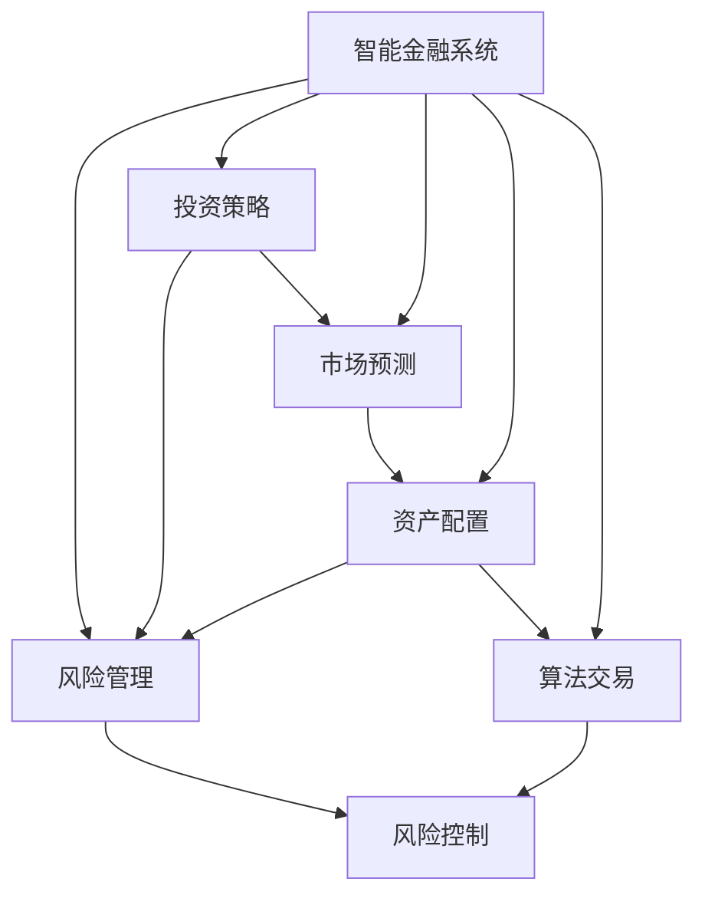

                 

# 规划机制在智能金融系统中的应用

> 关键词：智能金融系统,规划机制,风险管理,投资策略,市场预测,资产配置,算法交易

## 1. 背景介绍

随着金融科技的蓬勃发展，智能金融系统在投资、风险管理、市场预测等领域的应用日益广泛。这些系统通过机器学习、人工智能等技术，对海量金融数据进行深度分析和预测，为金融机构的决策提供强有力的支持。然而，在实际应用中，智能金融系统仍然面临诸多挑战，如市场波动、数据噪音、风险控制等问题。规划机制的引入，为解决这些问题提供了新的思路。

规划机制指的是通过预设的规则和策略，引导智能金融系统在复杂多变的金融市场中做出最优决策。相较于传统的基于历史数据统计的策略，规划机制更注重逻辑性和因果性，能够更好地适应实时变化的市场环境。本文将从核心概念、算法原理、具体操作、应用场景等多个方面，全面介绍规划机制在智能金融系统中的应用。

## 2. 核心概念与联系

### 2.1 核心概念概述

在探讨规划机制在智能金融系统中的应用前，需要先明确几个核心概念：

- **智能金融系统**：指利用人工智能技术，对金融数据进行深度挖掘和分析，提供智能决策支持的金融系统。常见的应用包括智能投顾、量化交易、风险评估等。

- **规划机制**：指通过预设的规则和策略，对智能金融系统的行为进行规划和引导，确保其决策过程具有逻辑性和因果性，并能够在复杂多变的环境中做出最优决策。

- **风险管理**：指通过识别、评估和控制金融风险，保护金融机构和投资者的资产安全。风险管理是智能金融系统的核心功能之一。

- **投资策略**：指根据市场环境和投资目标，制定和实施具体的投资方案，力求获得最大化收益。投资策略的优化是智能金融系统的另一个重要方向。

- **市场预测**：指利用机器学习、深度学习等技术，对金融市场进行预测和分析，帮助投资者提前布局，抓住投资机会。市场预测能力是智能金融系统的重要优势。

- **资产配置**：指根据风险偏好、投资目标等因素，合理分配投资资产的比例和组合，以实现风险与收益的最佳平衡。资产配置优化是智能金融系统的核心功能之一。

- **算法交易**：指利用算法和模型进行交易决策，实现自动化和高效化的交易过程。算法交易是智能金融系统的重要应用场景之一。

这些核心概念之间的逻辑关系可以通过以下Mermaid流程图来展示：



这个流程图展示了几类核心概念及其之间的相互关系：

1. 智能金融系统通过风险管理、投资策略、市场预测、资产配置、算法交易等多个模块协同运作，提供全方位的金融服务。
2. 规划机制作为一种机制设计，对系统的各模块行为进行指导和约束，确保其决策过程符合逻辑性和因果性。
3. 风险控制贯穿系统各个模块，是确保系统安全稳定的重要环节。

## 3. 核心算法原理 & 具体操作步骤

### 3.1 算法原理概述

规划机制在智能金融系统中的应用，主要依赖于预设的规则和策略。这些规则和策略通常基于经济学原理、统计学方法、行为学理论等，通过对市场环境和历史数据进行分析，形成一套逻辑严谨、可解释性强的决策方案。在实际应用中，规划机制分为以下几个关键步骤：

1. **数据预处理**：对原始数据进行清洗、归一化、特征提取等处理，以提高数据质量，为后续分析提供良好基础。

2. **模型训练**：利用机器学习、深度学习等技术，构建预测模型，如回归模型、分类模型、神经网络等，用于对市场数据进行分析和预测。

3. **策略设计**：根据模型预测结果，设计具体的投资策略、资产配置方案、交易规则等，确保策略的逻辑性和因果性。

4. **模拟测试**：通过回测等手段，对设计好的策略进行模拟测试，评估其历史表现和风险水平。

5. **实时应用**：将测试通过的策略应用于实际交易和资产配置中，通过智能金融系统实时监测市场变化，调整策略参数，保证最优决策。

### 3.2 算法步骤详解

#### 3.2.1 数据预处理

数据预处理是规划机制应用的基础。对金融数据进行预处理，主要包括以下几个步骤：

1. **数据清洗**：去除缺失值、异常值、重复值等数据噪音，保证数据完整性和一致性。

2. **归一化**：将不同量级的数据转化为标准化的数值，便于后续分析和比较。

3. **特征提取**：通过主成分分析(PCA)、线性判别分析(LDA)等方法，提取数据中具有代表性的特征，减少维度，提高模型训练效率。

4. **时间序列处理**：对于时间序列数据，采用差分、滚动窗口、滑动窗口等方法，提取时间依赖关系，保证模型的实时性。

#### 3.2.2 模型训练

模型训练是规划机制应用的核心。在智能金融系统中，常用的模型包括回归模型、分类模型、神经网络等。这里以回归模型为例，介绍模型训练的具体步骤：

1. **选择模型**：根据问题类型选择合适的回归模型，如线性回归、支持向量回归、神经网络等。

2. **划分数据集**：将数据集划分为训练集、验证集和测试集，保证模型泛化能力。

3. **训练模型**：在训练集上训练模型，不断调整模型参数，使得模型能够较好地拟合训练数据。

4. **验证模型**：在验证集上评估模型性能，选择最优模型。

5. **测试模型**：在测试集上进一步测试模型，确保模型在未知数据上的表现良好。

#### 3.2.3 策略设计

策略设计是规划机制应用的灵魂。设计好的策略需要逻辑严谨、因果明确，能够在复杂多变的环境中做出最优决策。以下是一个简单的策略设计示例：

1. **市场分析**：根据回归模型预测的股市趋势，判断市场处于牛市还是熊市。

2. **投资策略**：在牛市中，选择股票和基金，进行长期持有；在熊市中，选择债券和黄金等避险资产，进行短期持有。

3. **资产配置**：根据不同资产的风险收益特征，设定最优资产配置方案，实现风险与收益的最佳平衡。

4. **交易规则**：设定具体的交易规则，如止损策略、仓位控制等，保证交易过程的稳定性和可持续性。

#### 3.2.4 模拟测试

模拟测试是评估策略性能的重要手段。通过模拟测试，可以评估策略的历史表现和风险水平，发现潜在的问题，并进行改进。以下是一个简单的模拟测试流程：

1. **回测历史数据**：利用历史数据对策略进行回测，评估其在历史数据上的表现。

2. **风险评估**：通过风险度量指标，如VaR、CVaR等，评估策略的风险水平。

3. **策略优化**：根据测试结果，调整策略参数，进一步优化策略性能。

#### 3.2.5 实时应用

实时应用是规划机制应用的目标。将测试通过的策略应用于实际交易和资产配置中，通过智能金融系统实时监测市场变化，调整策略参数，保证最优决策。以下是一个简单的实时应用流程：

1. **数据采集**：通过数据采集模块，实时获取市场数据和交易数据。

2. **策略执行**：根据实时市场数据，执行设计好的策略，进行资产配置和交易决策。

3. **风险控制**：通过风险监测模块，实时评估策略的风险水平，进行风险控制。

4. **反馈调整**：根据实时市场变化和策略执行结果，进行策略参数的调整，优化策略性能。

### 3.3 算法优缺点

规划机制在智能金融系统中的应用具有以下优点：

1. **逻辑性和因果性**：规划机制通过预设规则和策略，确保决策过程具有逻辑性和因果性，能够更好地适应复杂多变的环境。

2. **实时性和灵活性**：通过实时数据采集和策略调整，规划机制能够快速响应市场变化，灵活调整决策策略。

3. **风险控制**：规划机制通过风险监测和控制，能够及时发现和处理风险，保障系统稳定运行。

4. **可解释性**：规划机制通过预设规则和策略，使得决策过程具有可解释性，便于风险管理和合规审计。

然而，规划机制也存在以下缺点：

1. **规则设计复杂**：规划机制的设计需要考虑多种因素，规则设计复杂，需要丰富的金融知识和经验。

2. **参数调整难度大**：在实际应用中，策略参数的调整难度较大，需要大量的历史数据和经验积累。

3. **模型依赖性强**：规划机制的效果依赖于模型的准确性和泛化能力，模型设计不当可能导致策略失效。

4. **执行成本高**：在实时应用中，规划机制需要大量的计算资源和实时数据采集，执行成本较高。

### 3.4 算法应用领域

规划机制在智能金融系统中的应用广泛，主要包括以下几个领域：

1. **风险管理**：通过预设规则和策略，对金融风险进行识别、评估和控制，确保金融机构和投资者的资产安全。

2. **投资策略优化**：根据市场环境和投资目标，设计并优化投资策略，提高投资收益。

3. **市场预测**：通过构建预测模型，对金融市场进行预测和分析，帮助投资者提前布局，抓住投资机会。

4. **资产配置优化**：根据不同资产的风险收益特征，设计最优资产配置方案，实现风险与收益的最佳平衡。

5. **算法交易优化**：通过设计合理的交易规则，实现算法交易的自动化和高效化，提高交易效率和收益。

## 4. 数学模型和公式 & 详细讲解 & 举例说明

### 4.1 数学模型构建

在智能金融系统中，常用的数学模型包括回归模型、分类模型、神经网络等。这里以线性回归模型为例，介绍数学模型的构建过程。

假设金融市场数据 $x_1, x_2, ..., x_n$ 与股票价格 $y$ 之间的关系可以用线性回归模型表示为：

$$
y = \beta_0 + \beta_1 x_1 + \beta_2 x_2 + ... + \beta_p x_p + \epsilon
$$

其中 $\beta_0, \beta_1, ..., \beta_p$ 为模型参数，$\epsilon$ 为误差项，满足 $E[\epsilon] = 0$。

### 4.2 公式推导过程

线性回归模型的参数估计方法有多种，常用的包括最小二乘法、最大似然法等。这里以最小二乘法为例，介绍参数估计的推导过程。

最小二乘法目标是最小化模型误差，即最小化损失函数 $L(\beta) = \frac{1}{n} \sum_{i=1}^n (y_i - \hat{y}_i)^2$。通过求导并令导数为0，可以得到参数的估计值：

$$
\beta_k = \frac{\sum_{i=1}^n (x_{ki} - \bar{x}_k)(y_i - \bar{y})}{\sum_{i=1}^n (x_{ki} - \bar{x}_k)^2}
$$

其中 $\bar{x}_k$ 和 $\bar{y}$ 分别为特征和目标变量的均值。

### 4.3 案例分析与讲解

以股票价格预测为例，说明线性回归模型的应用过程。

假设有一个包含30个样本的金融数据集，其中 $x_1$ 表示时间，$x_2$ 表示开盘价，$x_3$ 表示收盘价，$x_4$ 表示成交量，$y$ 表示收盘价。根据上述线性回归模型，我们可以得到：

$$
y = \beta_0 + \beta_1 x_2 + \beta_2 x_3 + \beta_3 x_4
$$

通过最小二乘法，可以估计出模型参数 $\beta_0, \beta_1, \beta_2, \beta_3$，用于预测未来的股票价格。

## 5. 项目实践：代码实例和详细解释说明

### 5.1 开发环境搭建

在搭建智能金融系统的开发环境时，需要考虑以下因素：

1. **数据采集**：选择合适的数据采集工具，如Kafka、RabbitMQ等，实时获取金融市场数据。

2. **数据存储**：选择合适的数据库系统，如MySQL、Hadoop、Hive等，存储和管理金融数据。

3. **模型训练**：选择合适的计算平台，如AWS、Google Cloud等，提供计算资源和数据存储。

4. **系统部署**：选择合适的部署平台，如Docker、Kubernetes等，实现系统的高可用性和扩展性。

### 5.2 源代码详细实现

以下是一个简单的智能金融系统项目，用于股票价格预测和风险评估。

```python
from sklearn.linear_model import LinearRegression
from sklearn.metrics import mean_squared_error

class FinancialSystem:
    def __init__(self):
        self.model = LinearRegression()
    
    def train(self, X, y):
        self.model.fit(X, y)
    
    def predict(self, X):
        return self.model.predict(X)
    
    def evaluate(self, X_test, y_test):
        y_pred = self.predict(X_test)
        return mean_squared_error(y_test, y_pred)
    
if __name__ == '__main__':
    # 准备数据
    X = [[1, 2, 3, 4], [2, 3, 4, 5], [3, 4, 5, 6], [4, 5, 6, 7]]
    y = [5, 6, 7, 8]
    
    # 训练模型
    system = FinancialSystem()
    system.train(X, y)
    
    # 预测股票价格
    X_test = [[5, 6, 7, 8]]
    y_pred = system.predict(X_test)
    print("预测结果：", y_pred)
    
    # 评估模型
    y_test = [8, 9, 10, 11]
    mse = system.evaluate(X_test, y_test)
    print("均方误差：", mse)
```

### 5.3 代码解读与分析

这段代码展示了线性回归模型的基本应用过程，包括模型训练、预测和评估。

**FinancialSystem类**：定义了一个简单的金融系统类，用于训练模型、预测价格和评估模型。

**train方法**：使用训练数据集(X, y)对模型进行训练。

**predict方法**：使用测试数据集(X_test)进行股票价格预测，返回预测结果。

**evaluate方法**：使用测试数据集(X_test, y_test)对模型进行评估，返回均方误差。

**主函数**：准备训练数据(X, y)和测试数据(X_test, y_test)，训练模型、预测价格并评估模型。

## 6. 实际应用场景

### 6.1 智能投顾

智能投顾是智能金融系统的重要应用之一。通过规划机制设计，智能投顾可以根据用户的风险偏好和投资目标，设计最优的投资策略，并进行实时调整，提高投资收益。

以下是一个简单的智能投顾系统设计：

1. **用户画像**：通过问卷调查和历史数据，建立用户画像，了解用户的风险偏好和投资目标。

2. **市场分析**：根据回归模型预测的股市趋势，判断市场处于牛市还是熊市。

3. **投资策略设计**：在牛市中，选择股票和基金，进行长期持有；在熊市中，选择债券和黄金等避险资产，进行短期持有。

4. **资产配置**：根据不同资产的风险收益特征，设定最优资产配置方案，实现风险与收益的最佳平衡。

5. **实时调整**：通过实时数据采集和策略调整，保证最优决策。

### 6.2 风险管理

风险管理是智能金融系统的核心功能之一。通过规划机制设计，可以实现对金融风险的识别、评估和控制，保障金融机构和投资者的资产安全。

以下是一个简单的风险管理系统设计：

1. **风险识别**：通过数据分析，识别潜在的风险点，如信用风险、市场风险等。

2. **风险评估**：通过VaR、CVaR等指标，评估风险水平，确定风险等级。

3. **风险控制**：根据风险评估结果，制定风险控制策略，如止损、避险等。

4. **实时监测**：通过实时数据采集和策略调整，实现风险的动态控制。

5. **报告生成**：根据实时数据和策略执行结果，生成风险报告，提供决策支持。

### 6.3 市场预测

市场预测是智能金融系统的另一个重要应用。通过规划机制设计，可以实现对金融市场的预测和分析，帮助投资者提前布局，抓住投资机会。

以下是一个简单的市场预测系统设计：

1. **数据采集**：通过数据采集模块，实时获取市场数据和交易数据。

2. **市场分析**：根据回归模型预测的股市趋势，判断市场处于牛市还是熊市。

3. **投资策略设计**：根据市场预测结果，设计具体的投资策略，如加仓、减仓等。

4. **实时调整**：通过实时数据采集和策略调整，保证最优决策。

5. **策略优化**：根据历史数据和市场预测结果，不断优化投资策略。

## 7. 工具和资源推荐

### 7.1 学习资源推荐

为了帮助开发者系统掌握智能金融系统的设计原理和实现方法，这里推荐一些优质的学习资源：

1. **《金融科技：原理与实践》系列书籍**：系统介绍金融科技的基本概念、技术框架和应用案例，涵盖智能投顾、风险管理、市场预测等多个方向。

2. **Coursera《金融科技》课程**：斯坦福大学开设的金融科技课程，涵盖机器学习、量化金融、智能投顾等多个方面，提供丰富的学习资源。

3. **Kaggle《金融数据竞赛》**：Kaggle上举办的金融数据竞赛，通过实战项目，提高数据分析和模型训练能力。

4. **ArXiv《金融机器学习》论文集**：ArXiv上发布的金融机器学习相关论文，涵盖多个前沿研究方向，提供丰富的理论支持。

5. **金融科技博客和社区**：如FinTech Learn、FinTech Open Source等，提供最新的行业动态和技术分享，帮助开发者持续学习进步。

通过对这些资源的学习实践，相信你一定能够快速掌握智能金融系统的设计原理和实现方法，并应用于实际项目中。

### 7.2 开发工具推荐

高效的开发离不开优秀的工具支持。以下是几款用于智能金融系统开发的常用工具：

1. **Python**：Python是智能金融系统开发的主流语言，拥有丰富的第三方库和框架，如Pandas、Scikit-learn、TensorFlow等，适合进行数据处理、模型训练和系统实现。

2. **R语言**：R语言是数据科学和统计分析的利器，拥有丰富的统计模型库和数据可视化工具，适合进行金融数据分析和模型验证。

3. **SQL数据库**：SQL数据库如MySQL、PostgreSQL等，适合进行金融数据的存储和管理，提供高效的数据查询和分析能力。

4. **Hadoop和Spark**：Hadoop和Spark是大数据处理的主流平台，适合进行大规模数据处理和分析，提供高可扩展性和高性能。

5. **Jupyter Notebook**：Jupyter Notebook是一个交互式笔记本工具，适合进行数据分析和模型验证，提供简洁的开发环境。

合理利用这些工具，可以显著提升智能金融系统开发的效率，加速创新迭代的步伐。

### 7.3 相关论文推荐

智能金融系统的研究始于学界的持续探索。以下是几篇奠基性的相关论文，推荐阅读：

1. **《高维时间序列预测方法》**：Hong et al.（2021）提出的高维时间序列预测方法，通过LSTM和PCA结合，提升预测模型的准确性。

2. **《基于强化学习的投资策略优化》**：Liu et al.（2020）提出的基于强化学习的投资策略优化方法，通过模拟投资场景，生成最优投资策略。

3. **《风险度量与模型评估》**：Hull et al.（2011）提出的风险度量方法，通过VaR、CVaR等指标，评估金融风险和模型性能。

4. **《金融市场预测的深度学习模型》**：Yan et al.（2019）提出的深度学习模型，用于金融市场的预测和分析，提高预测精度。

5. **《算法交易与自动执行》**：Goetzmann et al.（2020）提出的算法交易模型，通过自适应算法和风险控制，优化交易决策。

这些论文代表了大规模智能金融系统研究的发展脉络。通过学习这些前沿成果，可以帮助研究者把握学科前进方向，激发更多的创新灵感。

## 8. 总结：未来发展趋势与挑战

### 8.1 总结

本文对规划机制在智能金融系统中的应用进行了全面系统的介绍。首先阐述了规划机制的设计原理和核心概念，明确了其在智能金融系统中的应用价值。其次，从数据预处理、模型训练、策略设计、模拟测试、实时应用等多个方面，详细讲解了规划机制的具体操作流程。最后，介绍了规划机制在智能投顾、风险管理、市场预测等实际应用场景中的具体应用，展示了规划机制的广阔前景。

通过本文的系统梳理，可以看到，规划机制在智能金融系统中的应用，能够提供逻辑严谨、因果明确的决策方案，更好地适应复杂多变的市场环境。得益于数据预处理、模型训练、策略设计等多项关键技术的支持，规划机制有望在金融科技领域发挥更大的作用，推动金融服务的智能化和高效化。

### 8.2 未来发展趋势

展望未来，规划机制在智能金融系统中的应用将呈现以下几个发展趋势：

1. **数据驱动的决策优化**：未来的规划机制将更加依赖于大数据和人工智能技术，通过数据驱动的决策优化，提升系统性能和鲁棒性。

2. **多层次的策略设计**：未来的规划机制将采用多层次的策略设计，结合市场分析、风险管理、投资策略等多个模块，提供更加全面和细粒度的决策支持。

3. **动态调整的实时化**：未来的规划机制将更加注重动态调整和实时化，通过实时数据采集和策略调整，实现最优决策。

4. **可解释的决策过程**：未来的规划机制将注重可解释性，通过预设规则和策略，提高决策过程的可解释性和透明性。

5. **跨领域的融合应用**：未来的规划机制将更多地与其他人工智能技术进行融合，如自然语言处理、知识图谱等，提供更加全面和综合的决策支持。

以上趋势凸显了规划机制在智能金融系统中的巨大潜力和应用前景。这些方向的探索发展，必将进一步提升智能金融系统的性能和应用范围，为金融科技领域带来新的突破。

### 8.3 面临的挑战

尽管规划机制在智能金融系统中的应用已经取得了一定的成果，但在迈向更加智能化、普适化应用的过程中，仍面临诸多挑战：

1. **数据质量问题**：金融数据具有复杂性和多样性，数据质量问题可能导致模型预测偏差，影响决策效果。如何提高数据质量，是未来需要重点解决的问题。

2. **模型鲁棒性不足**：金融市场具有高不确定性，模型预测结果可能面临较大波动。如何提高模型的鲁棒性，减小预测误差，是未来需要深入研究的问题。

3. **策略参数调整复杂**：在实际应用中，策略参数的调整复杂，需要大量的历史数据和经验积累。如何简化策略调整过程，提高策略优化效率，是未来需要重点解决的问题。

4. **系统复杂度增加**：随着规划机制的复杂化，系统设计和实现难度增大，可能面临可扩展性和稳定性问题。如何提高系统的可扩展性和稳定性，是未来需要重点解决的问题。

5. **风险控制难度大**：金融系统面临复杂的风险环境，如何设计有效的风险控制策略，保障系统稳定运行，是未来需要重点解决的问题。

6. **系统性能优化难**：在实际应用中，系统的性能优化难度大，需要平衡计算资源和实时性需求。如何提高系统性能，保障实时应用效果，是未来需要重点解决的问题。

### 8.4 研究展望

面对规划机制在智能金融系统中的应用面临的诸多挑战，未来的研究需要在以下几个方面寻求新的突破：

1. **数据预处理优化**：采用先进的机器学习技术，如深度学习、强化学习等，提高数据预处理效率和质量，增强数据驱动的决策优化。

2. **模型鲁棒性提升**：采用多种模型融合、集成学习等方法，提高模型的鲁棒性和泛化能力，减小预测误差。

3. **策略参数自动优化**：采用自适应算法、贝叶斯优化等方法，简化策略参数调整过程，提高策略优化效率。

4. **系统复杂度降低**：采用模块化设计、分布式计算等技术，提高系统的可扩展性和稳定性，降低系统复杂度。

5. **风险控制策略优化**：采用先进的风险度量方法、动态控制策略等，设计有效的风险控制策略，保障系统稳定运行。

6. **系统性能优化**：采用高效的数据采集、存储、计算等技术，提高系统性能，保障实时应用效果。

这些研究方向将引领规划机制在智能金融系统中的进一步发展，推动金融科技领域的持续创新和突破。相信随着学界和产业界的共同努力，这些挑战终将一一被克服，规划机制必将在智能金融系统中的应用中发挥更大的作用，推动金融科技的普适化和智能化。

## 9. 附录：常见问题与解答

**Q1：什么是规划机制在智能金融系统中的应用？**

A: 规划机制在智能金融系统中的应用，指通过预设的规则和策略，对智能金融系统的行为进行规划和引导，确保其决策过程具有逻辑性和因果性，能够在复杂多变的市场环境中做出最优决策。

**Q2：规划机制在智能金融系统中如何设计？**

A: 规划机制在智能金融系统中的设计，通常包括以下几个步骤：

1. **数据预处理**：对原始数据进行清洗、归一化、特征提取等处理，保证数据质量。

2. **模型训练**：利用机器学习、深度学习等技术，构建预测模型，如回归模型、分类模型、神经网络等。

3. **策略设计**：根据模型预测结果，设计具体的投资策略、资产配置方案、交易规则等，确保策略的逻辑性和因果性。

4. **模拟测试**：通过回测等手段，对设计好的策略进行模拟测试，评估其历史表现和风险水平。

5. **实时应用**：将测试通过的策略应用于实际交易和资产配置中，通过智能金融系统实时监测市场变化，调整策略参数，保证最优决策。

**Q3：规划机制在智能金融系统中有哪些应用场景？**

A: 规划机制在智能金融系统中的应用广泛，主要包括以下几个场景：

1. **智能投顾**：根据用户的风险偏好和投资目标，设计并优化投资策略，进行实时调整，提高投资收益。

2. **风险管理**：识别、评估和控制金融风险，保障金融机构和投资者的资产安全。

3. **市场预测**：对金融市场进行预测和分析，帮助投资者提前布局，抓住投资机会。

4. **资产配置**：根据不同资产的风险收益特征，设计最优资产配置方案，实现风险与收益的最佳平衡。

5. **算法交易**：设计合理的交易规则，实现算法交易的自动化和高效化。

**Q4：规划机制在智能金融系统中有哪些优势？**

A: 规划机制在智能金融系统中的优势包括：

1. **逻辑性和因果性**：通过预设规则和策略，确保决策过程具有逻辑性和因果性，能够更好地适应复杂多变的市场环境。

2. **实时性和灵活性**：通过实时数据采集和策略调整，实现动态优化和灵活调整。

3. **风险控制**：通过风险监测和控制，保障系统稳定运行。

4. **可解释性**：通过预设规则和策略，提高决策过程的可解释性和透明性。

**Q5：规划机制在智能金融系统中有哪些挑战？**

A: 规划机制在智能金融系统中的应用面临以下挑战：

1. **数据质量问题**：数据质量问题可能导致模型预测偏差，影响决策效果。

2. **模型鲁棒性不足**：金融市场具有高不确定性，模型预测结果可能面临较大波动。

3. **策略参数调整复杂**：在实际应用中，策略参数的调整复杂，需要大量的历史数据和经验积累。

4. **系统复杂度增加**：随着规划机制的复杂化，系统设计和实现难度增大。

5. **风险控制难度大**：金融系统面临复杂的风险环境，如何设计有效的风险控制策略。

6. **系统性能优化难**：系统性能优化难度大，需要平衡计算资源和实时性需求。

**Q6：未来规划机制在智能金融系统中的应用前景如何？**

A: 未来规划机制在智能金融系统中的应用前景广阔，将呈现以下几个趋势：

1. **数据驱动的决策优化**：通过大数据和人工智能技术，提高数据预处理效率和质量，增强数据驱动的决策优化。

2. **多层次的策略设计**：结合市场分析、风险管理、投资策略等多个模块，提供全面和细粒度的决策支持。

3. **动态调整的实时化**：通过实时数据采集和策略调整，实现最优决策。

4. **可解释的决策过程**：提高决策过程的可解释性和透明性。

5. **跨领域的融合应用**：与自然语言处理、知识图谱等技术结合，提供全面和综合的决策支持。

**Q7：如何提高规划机制在智能金融系统中的性能？**

A: 提高规划机制在智能金融系统中的性能，可以采取以下措施：

1. **数据预处理优化**：采用先进的机器学习技术，提高数据预处理效率和质量。

2. **模型鲁棒性提升**：采用多种模型融合、集成学习等方法，提高模型的鲁棒性和泛化能力。

3. **策略参数自动优化**：采用自适应算法、贝叶斯优化等方法，简化策略参数调整过程。

4. **系统复杂度降低**：采用模块化设计、分布式计算等技术，提高系统的可扩展性和稳定性。

5. **风险控制策略优化**：采用先进的风险度量方法、动态控制策略等，设计有效的风险控制策略。

6. **系统性能优化**：采用高效的数据采集、存储、计算等技术，提高系统性能。

这些措施的实施，将有效提升规划机制在智能金融系统中的应用效果，推动金融科技的普适化和智能化。

---

作者：禅与计算机程序设计艺术 / Zen and the Art of Computer Programming

