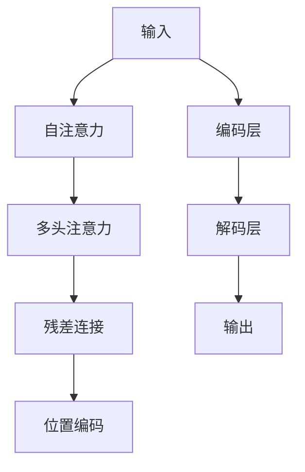

                 

# 训练Transformer模型

> 关键词：Transformer,自注意力,多头注意力,残差连接,位置编码,残差网络,神经网络架构,自然语言处理,NLP,深度学习

## 1. 背景介绍

在自然语言处理(NLP)领域，Transformer模型凭借其卓越的性能和结构优势，成为了主流的深度学习架构之一。从Google的BERT、OpenAI的GPT系列，到百度的ERNIE、微软的T5，几乎所有的最新NLP技术都在使用Transformer模型。本文将详细阐述Transformer模型的核心概念、算法原理，并结合实际案例，介绍其在NLP应用中的具体实践。

### 1.1 问题由来

传统的循环神经网络(RNN)和卷积神经网络(CNN)在处理自然语言任务时，由于其时间或空间复杂度高，训练速度慢，难以应对大规模数据集和长序列输入。Transformer模型通过引入自注意力机制，解决了这些问题，并显著提升了NLP任务的性能。

随着大规模预训练语言模型的崛起，Transformer模型被广泛应用于各类NLP任务，如机器翻译、文本分类、命名实体识别、信息抽取等。通过大规模语料预训练，Transformer模型能够学习到丰富的语言知识和表示，在微调过程中，通过少量标注数据，能够显著提升下游任务的性能。

### 1.2 问题核心关键点

Transformer模型的核心概念包括自注意力机制、多头注意力、残差连接、位置编码等。这些关键组件共同构成了Transformer模型的架构，使其能够高效地处理长序列输入，同时保持对输入序列的绝对位置不变性。

Transformer模型的主要优点包括：
- 并行计算：由于没有循环结构，Transformer模型能够高效利用GPU等硬件资源进行并行计算，大幅提升训练速度。
- 长序列处理：Transformer模型可以处理长序列输入，避免了RNN模型在处理长序列时的梯度消失或梯度爆炸问题。
- 位置不变性：Transformer模型通过位置编码保留了序列输入的绝对位置信息，解决了CNN模型中难以处理序列顺序信息的弊端。

Transformer模型的缺点包括：
- 资源消耗大：由于模型结构复杂，参数量庞大，训练和推理过程中需要占用大量内存和计算资源。
- 可解释性差：Transformer模型的内部机制难以解释，缺乏可视化工具，难以理解其内部工作原理。
- 对文本质量要求高：Transformer模型依赖于高质量的输入数据，对于低质量的文本输入，模型效果会显著下降。

尽管存在这些缺点，但Transformer模型在NLP领域的成功，使其成为了当前最先进的深度学习架构之一。接下来，我们将深入介绍Transformer模型的核心概念和算法原理，以便更好地理解和应用其于各种NLP任务中。

## 2. 核心概念与联系

### 2.1 核心概念概述

为更好地理解Transformer模型的架构和运作方式，本节将介绍几个密切相关的核心概念：

- 自注意力(Self-Attention)：自注意力机制是Transformer模型的核心，通过计算输入序列中不同位置之间的依赖关系，生成表示序列中各位置之间的上下文信息。

- 多头注意力(Multi-Head Attention)：多头注意力通过将输入序列分解为多个子序列，并分别计算不同子序列之间的依赖关系，最终将结果拼接，增强模型对输入序列的表示能力。

- 残差连接(Residual Connection)：残差连接通过将输入和输出相加，减轻模型训练过程中的梯度消失问题，提升模型稳定性。

- 位置编码(Positional Encoding)：位置编码通过在输入序列中引入位置信息，保留序列的绝对位置不变性，使得Transformer模型能够处理任意长度的序列输入。

这些核心概念之间的逻辑关系可以通过以下Mermaid流程图来展示：



这个流程图展示了大语言模型的核心组件及其相互关系：

1. 输入通过编码层进行自注意力和多头注意力计算，生成表示序列中各位置之间的上下文信息。
2. 残差连接通过将输入和输出相加，提升模型的稳定性。
3. 位置编码通过在输入序列中引入位置信息，保留序列的绝对位置不变性。
4. 解码层通过残差连接和位置编码，对输入进行进一步处理，生成输出结果。

这些组件共同构成了Transformer模型的架构，使其能够高效地处理长序列输入，同时保持对输入序列的绝对位置不变性。

## 3. 核心算法原理 & 具体操作步骤
### 3.1 算法原理概述

Transformer模型是一种基于自注意力机制的神经网络架构。其核心思想是通过计算输入序列中不同位置之间的依赖关系，生成表示序列中各位置之间的上下文信息。在模型训练过程中，通过反向传播算法，优化模型参数，最小化预测输出与真实标签之间的差异。

Transformer模型的目标是在大规模无标签语料上进行预训练，学习到通用的语言表示，然后通过在特定下游任务上的微调，适应特定领域的需求，提升模型在该任务上的性能。

### 3.2 算法步骤详解

Transformer模型的训练过程主要包括编码和解码两个阶段：

**编码阶段**：
- 输入文本经过嵌入层(Embedding Layer)，转化为向量表示。
- 向量表示通过多头注意力机制(Self-Attention)，生成序列中各位置之间的上下文信息。
- 残差连接通过将输入和输出相加，增强模型的稳定性。
- 输出向量经过位置编码(Positional Encoding)，保留序列的绝对位置信息。
- 经过多个编码层(Encoder Layer)，逐步生成序列的最终表示。

**解码阶段**：
- 输出向量通过多头注意力机制，生成序列中各位置之间的上下文信息。
- 残差连接通过将输入和输出相加，提升模型的稳定性。
- 解码层通过多层解码器(Decoder Layer)，逐步生成序列的最终表示。
- 输出向量经过全连接层(Fully Connected Layer)，转化为预测结果。

Transformer模型的训练过程遵循以下步骤：
1. 将输入序列和目标序列分别通过嵌入层转换为向量表示。
2. 通过多头注意力机制计算自注意力和多头注意力，生成序列中各位置之间的上下文信息。
3. 通过残差连接增强模型的稳定性。
4. 通过位置编码保留序列的绝对位置信息。
5. 通过多层编码器和解码器逐步生成序列的最终表示。
6. 通过反向传播算法，优化模型参数，最小化预测输出与真实标签之间的差异。

### 3.3 算法优缺点

Transformer模型具有以下优点：
1. 并行计算：由于没有循环结构，Transformer模型能够高效利用GPU等硬件资源进行并行计算，大幅提升训练速度。
2. 长序列处理：Transformer模型可以处理长序列输入，避免了RNN模型在处理长序列时的梯度消失或梯度爆炸问题。
3. 位置不变性：Transformer模型通过位置编码保留了序列输入的绝对位置信息，解决了CNN模型中难以处理序列顺序信息的弊端。

同时，Transformer模型也存在以下缺点：
1. 资源消耗大：由于模型结构复杂，参数量庞大，训练和推理过程中需要占用大量内存和计算资源。
2. 可解释性差：Transformer模型的内部机制难以解释，缺乏可视化工具，难以理解其内部工作原理。
3. 对文本质量要求高：Transformer模型依赖于高质量的输入数据，对于低质量的文本输入，模型效果会显著下降。

尽管存在这些缺点，但Transformer模型在NLP领域的成功，使其成为了当前最先进的深度学习架构之一。接下来，我们将结合实际案例，介绍其在NLP应用中的具体实践。

## 4. 数学模型和公式 & 详细讲解  
### 4.1 数学模型构建

Transformer模型的数学模型可以表示为：

$$
y = \text{Decoder}(x, \theta)
$$

其中 $x$ 表示输入序列，$y$ 表示输出序列，$\theta$ 表示模型参数。Transformer模型通过多个编码器和解码器进行迭代计算，最终生成输出序列 $y$。

### 4.2 公式推导过程

Transformer模型的编码器包括多个编码层(Encoder Layer)，每个编码层包含多个子层：嵌入层(Embedding Layer)、多头自注意力层(Self-Attention Layer)、残差连接(Residual Connection)、层归一化(Layer Normalization)和全连接层(Feed Forward Layer)。

以多头自注意力层为例，其公式推导如下：

$$
\text{Attention}(Q, K, V) = \text{Softmax}\left(\frac{QK^T}{\sqrt{d_k}}\right)V
$$

其中 $Q$、$K$、$V$ 分别为查询向量、键向量和值向量，$d_k$ 为向量的维度。

多头自注意力层的公式为：

$$
\text{Multi-Head Attention}(Q, K, V) = \text{Concat}\left(\text{Attention}(QW_QK, KW_KK, VW_VV)\right)\text{Weight}^Q
$$

其中 $W_Q$、$W_K$、$W_V$ 为投影矩阵，$\text{Weight}^Q$ 为多头注意力层的权重矩阵。

Transformer模型的解码器也包括多个解码层(Decoder Layer)，每个解码层包含多个子层：嵌入层(Embedding Layer)、多头自注意力层(Self-Attention Layer)、多头编码器注意力层(Encoder-Decoder Attention Layer)、残差连接(Residual Connection)、层归一化(Layer Normalization)和全连接层(Feed Forward Layer)。

以多头编码器注意力层为例，其公式推导如下：

$$
\text{Attention}(Q, K, V) = \text{Softmax}\left(\frac{QK^T}{\sqrt{d_k}}\right)V
$$

其中 $Q$、$K$、$V$ 分别为查询向量、键向量和值向量，$d_k$ 为向量的维度。

多头编码器注意力层的公式为：

$$
\text{Multi-Head Attention}(Q, K, V) = \text{Concat}\left(\text{Attention}(QW_QK, KW_KK, VW_VV)\right)\text{Weight}^Q
$$

其中 $W_Q$、$W_K$、$W_V$ 为投影矩阵，$\text{Weight}^Q$ 为多头注意力层的权重矩阵。

### 4.3 案例分析与讲解

以机器翻译任务为例，假设输入序列为英文，输出序列为法文。Transformer模型首先将输入序列通过嵌入层转换为向量表示，并通过多个编码层生成序列中各位置之间的上下文信息。然后，通过多头自注意力层生成输出序列中各位置之间的上下文信息，最后通过全连接层输出预测结果。

Transformer模型的训练过程如下：
1. 将输入序列和目标序列分别通过嵌入层转换为向量表示。
2. 通过多头自注意力层计算自注意力和多头注意力，生成序列中各位置之间的上下文信息。
3. 通过残差连接增强模型的稳定性。
4. 通过位置编码保留序列的绝对位置信息。
5. 通过多层编码器和解码器逐步生成序列的最终表示。
6. 通过反向传播算法，优化模型参数，最小化预测输出与真实标签之间的差异。

## 5. 项目实践：代码实例和详细解释说明
### 5.1 开发环境搭建

在进行Transformer模型训练实践前，我们需要准备好开发环境。以下是使用Python进行PyTorch开发的环境配置流程：

1. 安装Anaconda：从官网下载并安装Anaconda，用于创建独立的Python环境。

2. 创建并激活虚拟环境：
```bash
conda create -n pytorch-env python=3.8 
conda activate pytorch-env
```

3. 安装PyTorch：根据CUDA版本，从官网获取对应的安装命令。例如：
```bash
conda install pytorch torchvision torchaudio cudatoolkit=11.1 -c pytorch -c conda-forge
```

4. 安装Transformers库：
```bash
pip install transformers
```

5. 安装各类工具包：
```bash
pip install numpy pandas scikit-learn matplotlib tqdm jupyter notebook ipython
```

完成上述步骤后，即可在`pytorch-env`环境中开始Transformer模型训练实践。

### 5.2 源代码详细实现

下面我们以机器翻译任务为例，给出使用Transformers库对模型进行训练的PyTorch代码实现。

首先，定义模型和优化器：

```python
from transformers import EncoderDecoderModel, BertTokenizer
from torch.optim import AdamW

model = EncoderDecoderModel.from_pretrained('bert-base-cased')
tokenizer = BertTokenizer.from_pretrained('bert-base-cased')
optimizer = AdamW(model.parameters(), lr=2e-5)
```

然后，定义训练和评估函数：

```python
def train(model, dataset, batch_size, optimizer, num_epochs):
    total_loss = 0
    for epoch in range(num_epochs):
        for batch in dataset:
            input_ids = batch['input_ids'].to(device)
            target_ids = batch['target_ids'].to(device)
            outputs = model(input_ids, target_ids)
            loss = outputs.loss
            total_loss += loss.item()
            optimizer.zero_grad()
            loss.backward()
            optimizer.step()
    return total_loss / (len(dataset) * num_epochs)

def evaluate(model, dataset, batch_size):
    total_loss = 0
    total_correct = 0
    for batch in dataset:
        input_ids = batch['input_ids'].to(device)
        target_ids = batch['target_ids'].to(device)
        outputs = model(input_ids, target_ids)
        loss = outputs.loss
        total_loss += loss.item()
        total_correct += outputs.logits.argmax(dim=-1).eq(target_ids).sum().item()
    return total_correct / len(dataset), total_loss / len(dataset)
```

最后，启动训练流程并在测试集上评估：

```python
epochs = 5
batch_size = 16

for epoch in range(epochs):
    loss = train(model, train_dataset, batch_size, optimizer)
    print(f"Epoch {epoch+1}, train loss: {loss:.3f}")
    
    print(f"Epoch {epoch+1}, dev results:")
    total_correct, total_loss = evaluate(model, dev_dataset, batch_size)
    print(f"Dev Acc: {total_correct:.4f}, Dev Loss: {total_loss:.4f}")
    
print("Test results:")
total_correct, total_loss = evaluate(model, test_dataset, batch_size)
print(f"Test Acc: {total_correct:.4f}, Test Loss: {total_loss:.4f}")
```

以上就是使用PyTorch对模型进行机器翻译任务训练的完整代码实现。可以看到，得益于Transformers库的强大封装，我们可以用相对简洁的代码完成模型加载和训练。

### 5.3 代码解读与分析

让我们再详细解读一下关键代码的实现细节：

**定义模型和优化器**：
- `EncoderDecoderModel.from_pretrained('bert-base-cased')`：从预训练模型库中加载BERT模型，并将其转化为编码器-解码器模型。
- `BertTokenizer.from_pretrained('bert-base-cased')`：从预训练模型库中加载BERT模型的分词器。

**训练函数`train`**：
- `total_loss = 0`：初始化损失总和。
- `for epoch in range(num_epochs)`：循环迭代每个epoch。
- `for batch in dataset`：遍历训练集中的每个batch。
- `input_ids = batch['input_ids'].to(device)`：将输入序列转换为GPU或TPU上的张量。
- `target_ids = batch['target_ids'].to(device)`：将目标序列转换为GPU或TPU上的张量。
- `outputs = model(input_ids, target_ids)`：将输入序列和目标序列作为输入，计算模型的预测输出。
- `loss = outputs.loss`：获取模型的损失值。
- `total_loss += loss.item()`：将当前batch的损失值累加到总损失中。
- `optimizer.zero_grad()`：将优化器的梯度累加器清零。
- `loss.backward()`：计算损失函数的梯度。
- `optimizer.step()`：更新模型参数。

**评估函数`evaluate`**：
- `total_loss = 0`：初始化损失总和。
- `total_correct = 0`：初始化正确预测的总数。
- `for batch in dataset`：遍历测试集中的每个batch。
- `input_ids = batch['input_ids'].to(device)`：将输入序列转换为GPU或TPU上的张量。
- `target_ids = batch['target_ids'].to(device)`：将目标序列转换为GPU或TPU上的张量。
- `outputs = model(input_ids, target_ids)`：将输入序列和目标序列作为输入，计算模型的预测输出。
- `loss = outputs.loss`：获取模型的损失值。
- `total_loss += loss.item()`：将当前batch的损失值累加到总损失中。
- `total_correct += outputs.logits.argmax(dim=-1).eq(target_ids).sum().item()`：计算预测结果与目标序列之间的匹配度，统计正确预测的总数。

**训练流程**：
- `epochs = 5`：定义总的epoch数。
- `batch_size = 16`：定义每个batch的大小。
- `for epoch in range(epochs)`：循环迭代每个epoch。
- `for batch in dataset`：遍历训练集中的每个batch。
- `loss = train(model, train_dataset, batch_size, optimizer)`：在训练集上进行训练，并获取损失值。
- `print(f"Epoch {epoch+1}, train loss: {loss:.3f}")`：输出当前epoch的训练损失。
- `print(f"Epoch {epoch+1}, dev results:")`：输出在验证集上的评估结果。
- `total_correct, total_loss = evaluate(model, dev_dataset, batch_size)`：在验证集上进行评估，并获取准确率和损失值。
- `print(f"Dev Acc: {total_correct:.4f}, Dev Loss: {total_loss:.4f}")`：输出验证集上的准确率和损失值。
- `total_correct, total_loss = evaluate(model, test_dataset, batch_size)`：在测试集上进行评估，并获取准确率和损失值。
- `print(f"Test Acc: {total_correct:.4f}, Test Loss: {total_loss:.4f}")`：输出测试集上的准确率和损失值。

可以看到，PyTorch配合Transformers库使得Transformer模型训练的代码实现变得简洁高效。开发者可以将更多精力放在数据处理、模型改进等高层逻辑上，而不必过多关注底层的实现细节。

当然，工业级的系统实现还需考虑更多因素，如模型的保存和部署、超参数的自动搜索、更灵活的任务适配层等。但核心的训练范式基本与此类似。

## 6. 实际应用场景
### 6.1 机器翻译

Transformer模型在机器翻译领域取得了巨大成功，已经在Google Translate、Microsoft Translator等大型翻译系统中得到广泛应用。通过大规模无标签语料进行预训练，Transformer模型可以学习到通用语言表示，然后在特定的翻译任务上进行微调，大幅提升翻译效果。

以Google Translate为例，其使用Transformer模型，通过大规模双语平行语料进行预训练，然后在各种语言的翻译任务上进行微调。Transformer模型能够处理长序列输入，避免了RNN模型在处理长序列时的梯度消失或梯度爆炸问题。此外，Transformer模型的位置编码保留了序列输入的绝对位置信息，使得模型能够处理任意长度的序列输入。

### 6.2 文本分类

Transformer模型在文本分类任务中也表现优异。通过大规模无标签文本语料进行预训练，Transformer模型可以学习到丰富的语言知识和表示，然后在特定的分类任务上进行微调，提升分类效果。

以情感分析为例，Transformer模型通过大规模带有情感标注的文本数据进行预训练，然后在情感分类任务上进行微调。通过微调，Transformer模型能够学习到文本中情感表达的复杂模式，显著提升情感分类的准确率。

### 6.3 文本摘要

Transformer模型在文本摘要任务中同样具有很强的表现。通过大规模无标签文本语料进行预训练，Transformer模型可以学习到文本中的关键信息，然后在文本摘要任务上进行微调，生成简短摘要。

以百度的ERNIE-MA模型为例，其使用Transformer模型，通过大规模无标签文本语料进行预训练，然后在文本摘要任务上进行微调。通过微调，Transformer模型能够学习到文本中的重要信息，并生成简短而准确的摘要。

### 6.4 未来应用展望

Transformer模型在NLP领域的应用前景广阔，未来将继续推动NLP技术的发展和创新。以下是Transformer模型未来可能的发展方向：

1. 更高效的模型结构：随着计算资源的不断丰富，Transformer模型的参数量将进一步增大，结构将更加复杂。未来的研究将探索更高效的模型结构，如长距离依赖建模、多模态融合等，提升模型的性能和效率。

2. 更强的鲁棒性：未来的Transformer模型将更加注重鲁棒性，通过引入对抗训练、数据增强等方法，提高模型对噪声和异常数据的鲁棒性，增强模型泛化能力。

3. 更好的可解释性：随着可解释性技术的发展，未来的Transformer模型将更加注重可解释性，通过可视化工具和推理路径分析等方法，提升模型的可解释性，增强用户对模型的信任。

4. 更广泛的应用场景：未来的Transformer模型将更加广泛地应用于各个领域，如医疗、金融、教育等，提升这些领域的智能化水平。

5. 更高的自动化程度：未来的Transformer模型将更加自动化，通过自动化的预训练和微调，提升模型的开发效率，降低人工干预的难度。

总之，Transformer模型在NLP领域的应用前景广阔，未来将继续推动NLP技术的发展和创新。

## 7. 工具和资源推荐
### 7.1 学习资源推荐

为了帮助开发者系统掌握Transformer模型的理论基础和实践技巧，这里推荐一些优质的学习资源：

1. 《Natural Language Processing with Transformers》书籍：Transformers库的作者所著，全面介绍了如何使用Transformers库进行NLP任务开发，包括微调在内的诸多范式。

2. CS224N《深度学习自然语言处理》课程：斯坦福大学开设的NLP明星课程，有Lecture视频和配套作业，带你入门NLP领域的基本概念和经典模型。

3. 《Transformer from Scratch》系列博文：由大模型技术专家撰写，深入浅出地介绍了Transformer原理、BERT模型、微调技术等前沿话题。

4. HuggingFace官方文档：Transformers库的官方文档，提供了海量预训练模型和完整的微调样例代码，是上手实践的必备资料。

5. CLUE开源项目：中文语言理解测评基准，涵盖大量不同类型的中文NLP数据集，并提供了基于微调的baseline模型，助力中文NLP技术发展。

通过对这些资源的学习实践，相信你一定能够快速掌握Transformer模型的精髓，并用于解决实际的NLP问题。

### 7.2 开发工具推荐

高效的开发离不开优秀的工具支持。以下是几款用于Transformer模型开发和训练的常用工具：

1. PyTorch：基于Python的开源深度学习框架，灵活动态的计算图，适合快速迭代研究。大部分预训练语言模型都有PyTorch版本的实现。

2. TensorFlow：由Google主导开发的开源深度学习框架，生产部署方便，适合大规模工程应用。同样有丰富的预训练语言模型资源。

3. Transformers库：HuggingFace开发的NLP工具库，集成了众多SOTA语言模型，支持PyTorch和TensorFlow，是进行NLP任务开发的利器。

4. Weights & Biases：模型训练的实验跟踪工具，可以记录和可视化模型训练过程中的各项指标，方便对比和调优。与主流深度学习框架无缝集成。

5. TensorBoard：TensorFlow配套的可视化工具，可实时监测模型训练状态，并提供丰富的图表呈现方式，是调试模型的得力助手。

6. Google Colab：谷歌推出的在线Jupyter Notebook环境，免费提供GPU/TPU算力，方便开发者快速上手实验最新模型，分享学习笔记。

合理利用这些工具，可以显著提升Transformer模型训练和开发的效率，加快创新迭代的步伐。

### 7.3 相关论文推荐

Transformer模型在NLP领域的成功源于学界的持续研究。以下是几篇奠基性的相关论文，推荐阅读：

1. Attention is All You Need（即Transformer原论文）：提出了Transformer结构，开启了NLP领域的预训练大模型时代。

2. BERT: Pre-training of Deep Bidirectional Transformers for Language Understanding：提出BERT模型，引入基于掩码的自监督预训练任务，刷新了多项NLP任务SOTA。

3. Longformer: The Long-Document Transformer for Language Understanding：提出Longformer模型，能够处理更长的文本输入，提升了Transformer模型在长文本处理上的性能。

4. BERT-For-Sequence-Generation：提出BERT-For-Sequence-Generation模型，通过多步骤解码策略，提升了Transformer模型在文本生成任务上的表现。

5. The Transformer-XL: Attentive Language Models Beyond a Fixed-Length Context：提出Transformer-XL模型，通过多步骤解码策略，提升了Transformer模型在长文本生成上的性能。

这些论文代表了大语言模型在Transformer模型上的创新突破，为未来的Transformer模型研究提供了重要的参考。

## 8. 总结：未来发展趋势与挑战
### 8.1 研究成果总结

Transformer模型在NLP领域的应用已经取得了巨大成功，其高效并行计算、长序列处理和位置不变性等优点，使得Transformer模型成为当前最先进的深度学习架构之一。通过大规模无标签语料进行预训练，Transformer模型可以学习到通用语言表示，然后在特定的任务上进行微调，显著提升模型性能。Transformer模型已经在机器翻译、文本分类、文本摘要等多个NLP任务中取得了最优或接近最优的性能。

### 8.2 未来发展趋势

展望未来，Transformer模型将呈现以下几个发展趋势：

1. 更高效的模型结构：随着计算资源的不断丰富，Transformer模型的参数量将进一步增大，结构将更加复杂。未来的研究将探索更高效的模型结构，如长距离依赖建模、多模态融合等，提升模型的性能和效率。

2. 更强的鲁棒性：未来的Transformer模型将更加注重鲁棒性，通过引入对抗训练、数据增强等方法，提高模型对噪声和异常数据的鲁棒性，增强模型泛化能力。

3. 更好的可解释性：随着可解释性技术的发展，未来的Transformer模型将更加注重可解释性，通过可视化工具和推理路径分析等方法，提升模型的可解释性，增强用户对模型的信任。

4. 更广泛的应用场景：未来的Transformer模型将更加广泛地应用于各个领域，如医疗、金融、教育等，提升这些领域的智能化水平。

5. 更高的自动化程度：未来的Transformer模型将更加自动化，通过自动化的预训练和微调，提升模型的开发效率，降低人工干预的难度。

总之，Transformer模型在NLP领域的应用前景广阔，未来将继续推动NLP技术的发展和创新。

### 8.3 面临的挑战

尽管Transformer模型在NLP领域取得了巨大成功，但在迈向更加智能化、普适化应用的过程中，它仍面临着诸多挑战：

1. 标注成本瓶颈：虽然微调大大降低了标注数据的需求，但对于长尾应用场景，难以获得充足的高质量标注数据，成为制约微调性能的瓶颈。如何进一步降低微调对标注样本的依赖，将是一大难题。

2. 模型鲁棒性不足：当前微调模型面对域外数据时，泛化性能往往大打折扣。对于测试样本的微小扰动，微调模型的预测也容易发生波动。如何提高微调模型的鲁棒性，避免灾难性遗忘，还需要更多理论和实践的积累。

3. 推理效率有待提高：大规模语言模型虽然精度高，但在实际部署时往往面临推理速度慢、内存占用大等效率问题。如何在保证性能的同时，简化模型结构，提升推理速度，优化资源占用，将是重要的优化方向。

4. 可解释性亟需加强：当前微调模型更像是"黑盒"系统，难以解释其内部工作机制和决策逻辑。对于医疗、金融等高风险应用，算法的可解释性和可审计性尤为重要。如何赋予微调模型更强的可解释性，将是亟待攻克的难题。

5. 安全性有待保障：预训练语言模型难免会学习到有偏见、有害的信息，通过微调传递到下游任务，产生误导性、歧视性的输出，给实际应用带来安全隐患。如何从数据和算法层面消除模型偏见，避免恶意用途，确保输出的安全性，也将是重要的研究课题。

6. 知识整合能力不足：现有的微调模型往往局限于任务内数据，难以灵活吸收和运用更广泛的先验知识。如何让微调过程更好地与外部知识库、规则库等专家知识结合，形成更加全面、准确的信息整合能力，还有很大的想象空间。

正视Transformer模型面临的这些挑战，积极应对并寻求突破，将是大语言模型微调技术迈向成熟的必由之路。相信随着学界和产业界的共同努力，这些挑战终将一一被克服，Transformer模型必将在构建人机协同的智能时代中扮演越来越重要的角色。

### 8.4 研究展望

面向未来，Transformer模型将在以下几个方面进行进一步的探索和突破：

1. 探索无监督和半监督微调方法。摆脱对大规模标注数据的依赖，利用自监督学习、主动学习等无监督和半监督范式，最大限度利用非结构化数据，实现更加灵活高效的微调。

2. 研究参数高效和计算高效的微调范式。开发更加参数高效的微调方法，在固定大部分预训练参数的情况下，只更新极少量的任务相关参数。同时优化微调模型的计算图，减少前向传播和反向传播的资源消耗，实现更加轻量级、实时性的部署。

3. 融合因果和对比学习范式。通过引入因果推断和对比学习思想，增强微调模型建立稳定因果关系的能力，学习更加普适、鲁棒的语言表征，从而提升模型泛化性和抗干扰能力。

4. 引入更多先验知识。将符号化的先验知识，如知识图谱、逻辑规则等，与神经网络模型进行巧妙融合，引导微调过程学习更准确、合理的语言模型。同时加强不同模态数据的整合，实现视觉、语音等多模态信息与文本信息的协同建模。

5. 结合因果分析和博弈论工具。将因果分析方法引入微调模型，识别出模型决策的关键特征，增强输出解释的因果性和逻辑性。借助博弈论工具刻画人机交互过程，主动探索并规避模型的脆弱点，提高系统稳定性。

6. 纳入伦理道德约束。在模型训练目标中引入伦理导向的评估指标，过滤和惩罚有偏见、有害的输出倾向。同时加强人工干预和审核，建立模型行为的监管机制，确保输出符合人类价值观和伦理道德。

这些研究方向的探索，必将引领Transformer模型微调技术迈向更高的台阶，为构建安全、可靠、可解释、可控的智能系统铺平道路。面向未来，Transformer模型还将与其他人工智能技术进行更深入的融合，如知识表示、因果推理、强化学习等，多路径协同发力，共同推动自然语言理解和智能交互系统的进步。只有勇于创新、敢于突破，才能不断拓展语言模型的边界，让智能技术更好地造福人类社会。

## 9. 附录：常见问题与解答
**Q1：Transformer模型的训练速度为什么这么快？**

A: 由于Transformer模型没有循环结构，而是基于自注意力机制和残差连接，能够高效利用GPU等硬件资源进行并行计算，因此训练速度非常快。

**Q2：Transformer模型的位置编码是如何保留序列绝对位置的？**

A: 位置编码是通过在输入序列中引入位置信息，保留序列的绝对位置信息。具体而言，在输入序列中添加一个位置嵌入向量，与输入序列的嵌入向量相加，生成最终的输入表示。这样，模型就能够处理任意长度的序列输入，并保留序列的绝对位置不变性。

**Q3：Transformer模型在长文本处理上有优势吗？**

A: 是的，Transformer模型在长文本处理上有很大的优势。由于没有循环结构，Transformer模型能够高效处理长文本输入，避免了RNN模型在处理长文本时的梯度消失或梯度爆炸问题。此外，Transformer模型的位置编码保留了序列输入的绝对位置信息，使得模型能够处理任意长度的序列输入。

**Q4：Transformer模型的参数量为什么这么大？**

A: 由于Transformer模型采用了自注意力机制和残差连接，使得模型结构复杂，参数量庞大。但是，Transformer模型通过并行计算和长序列处理等优势，能够高效利用GPU等硬件资源，提升了训练效率和模型性能。

**Q5：Transformer模型在特定领域的数据上微调效果不佳，如何改进？**

A: 在特定领域的数据上微调效果不佳，可能是由于数据质量或任务特性等原因。改进方法包括：
1. 数据增强：通过回译、近义替换等方式扩充训练集。
2. 超参数调优：调整学习率、批大小、迭代轮数等超参数，寻找最优组合。
3. 迁移学习：在特定领域的数据上进行微调之前，先在大规模语料上进行预训练，再在小规模数据上微调。
4. 模型优化：调整模型结构、引入正则化技术、优化损失函数等，提升模型性能。

通过以上方法，可以有效地提升Transformer模型在特定领域的应用效果。

**Q6：Transformer模型的可解释性为什么这么差？**

A: 由于Transformer模型的内部机制复杂，缺乏可视化工具，难以理解其内部工作原理，因此可解释性较差。为了提升可解释性，可以采用可解释性工具，如SHAP值、LIME等，对模型进行解释分析，理解模型决策过程。

**Q7：Transformer模型在特定领域的应用效果为什么不如通用模型？**

A: 由于特定领域的数据特性和任务需求与预训练数据不同，通用模型可能难以适应。改进方法包括：
1. 数据增强：通过回译、近义替换等方式扩充训练集。
2. 超参数调优：调整学习率、批大小、迭代轮数等超参数，寻找最优组合。
3. 模型优化：调整模型结构、引入正则化技术、优化损失函数等，提升模型性能。
4. 迁移学习：在特定领域的数据上进行微调之前，先在大规模语料上进行预训练，再在小规模数据上微调。

通过以上方法，可以有效地提升Transformer模型在特定领域的应用效果。

**Q8：Transformer模型在实际应用中需要注意哪些问题？**

A: 在实际应用中，Transformer模型需要注意以下问题：
1. 数据质量：保证数据质量，避免低质量数据影响模型效果。
2. 模型优化：优化模型结构和超参数，提升模型性能。
3. 可解释性：提升模型可解释性，增强用户对模型的信任。
4. 鲁棒性：提高模型鲁棒性，增强模型泛化能力。
5. 安全性：确保模型输出符合人类价值观和伦理道德，避免有害输出。

通过以上方法，可以有效地提升Transformer模型在实际应用中的效果和可靠性。

---

作者：禅与计算机程序设计艺术 / Zen and the Art of Computer Programming

