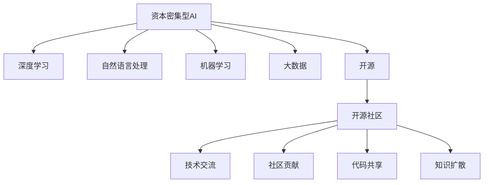

                 

# 资本密集型AI研究:开源的机遇与挑战

> 关键词：资本密集型AI, 开源, 机遇, 挑战, AI研究, 深度学习, 机器学习, 自然语言处理, 大数据

## 1. 背景介绍

### 1.1 问题由来
在人工智能(AI)领域，尤其是深度学习和机器学习(ML)领域，研究和发展往往需要高昂的计算资源和数据支持。这一特征使得AI研究成为典型的资本密集型行业。与此同时，随着开源社区的兴起，越来越多的AI技术通过开源方式共享给全世界的研究者和开发者。然而，开源在带来便利的同时，也带来了诸多挑战，包括资金、资源分配、知识产权保护等。

近年来，开源社区在AI领域取得的突破性进展，如TensorFlow、PyTorch、OpenAI的GPT系列等，表明开源在提升AI研究效率、推动技术迭代方面发挥了巨大作用。但同时，开源社区在处理上述问题时也面临不少困难。本文将从资本密集型AI研究的视角，探讨开源的机遇与挑战，提出解决方案。

### 1.2 问题核心关键点
本文将围绕以下几个核心关键点展开探讨：
1. 资本密集型AI研究的主要特征。
2. 开源社区在AI研究中的角色与作用。
3. 开源带来的机遇与挑战。
4. 如何平衡资本密集型AI研究和开源社区的需求。

## 2. 核心概念与联系

### 2.1 核心概念概述

为更好地理解资本密集型AI研究及其与开源社区的互动，本节将介绍几个密切相关的核心概念：

- 资本密集型AI（Capital-intensive AI）：指需要投入大量资金、资源进行研究的AI领域，如深度学习、自然语言处理(NLP)、计算机视觉等。这些领域的研发通常涉及高性能计算、大规模数据集、复杂模型训练等环节，对资本需求较高。

- 开源（Open Source）：指将软件代码、文档、工具等资源公开共享，任何人都可以自由地使用、修改和分发。开源不仅促进了技术交流与创新，还推动了软件和硬件的普及应用。

- 开源社区（Open Source Community）：指围绕开源项目自发形成的开发者群体。社区成员共同维护和贡献代码，分享知识与经验，推动技术进步。

- AI研究（AI Research）：指使用AI技术解决实际问题的学术和工程活动。包括基础理论研究、算法设计、模型训练等。

- 深度学习（Deep Learning）：一种基于多层神经网络的机器学习技术，广泛应用于图像识别、语音识别、自然语言处理等领域。

- 机器学习（Machine Learning）：通过算法让机器自动从数据中学习，并用于决策和预测。

- 自然语言处理（Natural Language Processing, NLP）：让计算机理解和生成人类语言的领域。

- 大数据（Big Data）：指规模庞大、复杂度高、处理难度大的数据集。大数据技术是支持深度学习、机器学习等AI研究的重要基础设施。

这些核心概念之间的逻辑关系可以通过以下Mermaid流程图来展示：



这个流程图展示了大语言模型与开源社区的核心概念及其之间的关系：

1. 资本密集型AI研究需要依赖深度学习、NLP、机器学习和大数据等技术。
2. 开源提供了技术交流、社区贡献、代码共享和知识扩散的渠道。
3. 开源社区支持资本密集型AI研究的展开，并促进技术的普及和应用。

## 3. 核心算法原理 & 具体操作步骤
### 3.1 算法原理概述

资本密集型AI研究往往涉及复杂的算法和模型，需要大量的计算资源和数据支持。基于深度学习的AI研究中，模型通常由成千上万个参数组成，训练过程需要GPU或TPU等高性能硬件设备，并使用大数据集进行训练。开源社区通过提供易于使用的开源框架和工具，降低了研究者的进入门槛，加速了技术创新。

以下是资本密集型AI研究的典型步骤：

1. 数据收集：获取大规模数据集，如ImageNet、COCO、Wikipedia等。这些数据集通常由大型机构或社区合作提供。

2. 模型训练：在高性能计算平台上训练深度学习模型，如卷积神经网络（CNN）、循环神经网络（RNN）、Transformer等。

3. 模型验证：在验证集上评估模型性能，调整超参数和模型结构。

4. 模型部署：将模型部署到生产环境中，进行实际应用。

5. 模型维护：持续优化和更新模型，处理数据偏差、提高模型鲁棒性等。

### 3.2 算法步骤详解

资本密集型AI研究的详细步骤包括：

**Step 1: 数据准备**
- 收集数据集：从公共和私有数据源获取数据，如ImageNet、COCO、Wikipedia等。
- 数据预处理：清洗、标注数据，处理缺失值和异常值，进行归一化和标准化。

**Step 2: 模型选择与训练**
- 选择模型架构：如CNN、RNN、Transformer等。
- 设置超参数：学习率、批大小、优化器等。
- 模型训练：在GPU或TPU上使用深度学习框架如TensorFlow、PyTorch等进行训练。

**Step 3: 模型验证**
- 划分验证集和测试集：使用一定比例的数据进行验证和测试。
- 评估模型性能：计算损失函数、准确率、召回率等指标。
- 超参数调优：调整学习率、正则化参数等，提高模型效果。

**Step 4: 模型部署**
- 模型导出：将训练好的模型导出为TensorFlow SavedModel、PyTorch模型文件等格式。
- 模型服务化：封装为REST API、gRPC等接口，方便调用。
- 性能监控：在生产环境中部署模型，进行实时性能监控和日志记录。

**Step 5: 模型维护**
- 定期更新模型：根据新数据和任务需求，重新训练和调整模型。
- 处理数据偏差：识别和处理数据集中的偏见和偏差，提高模型公平性。
- 模型鲁棒性优化：增加对抗样本训练、数据增强等，提高模型鲁棒性。

### 3.3 算法优缺点

资本密集型AI研究具备以下优点：
1. 促进技术创新：开源社区提供了丰富的算法和工具，降低了研究成本，推动了技术快速迭代。
2. 提高效率：开源框架如TensorFlow、PyTorch等，提供了高效的模型训练和部署能力。
3. 开放协作：开源社区促进了全球范围内的知识共享和合作，加速了科学发现和应用落地。
4. 成本降低：开源资源和工具降低了研发门槛，有助于更多企业、研究机构和个人参与AI研究。

但同时，资本密集型AI研究也存在一些挑战：
1. 计算资源需求高：深度学习模型训练需要高性能硬件和大量数据，资金投入较大。
2. 知识产权保护：开源社区中的代码和算法可能存在版权问题，知识产权保护复杂。
3. 资源分配不均：开源社区中资源和贡献不均，导致部分项目和贡献者被边缘化。
4. 技术可靠性：开源框架和工具可能存在漏洞和错误，影响模型的稳定性和安全性。

### 3.4 算法应用领域

资本密集型AI研究的应用领域非常广泛，主要包括以下几个方面：

1. 计算机视觉（CV）：如图像识别、目标检测、图像分割等，广泛应用于自动驾驶、安防监控、医学影像分析等。

2. 自然语言处理（NLP）：如机器翻译、文本分类、情感分析等，应用于智能客服、信息检索、舆情分析等。

3. 语音识别：如语音转文本、语音合成、情感识别等，应用于智能音箱、语音助手等。

4. 推荐系统：如协同过滤、内容推荐、广告投放等，应用于电商、视频平台、社交媒体等。

5. 医疗健康：如疾病预测、基因分析、药物研发等，应用于医疗影像、基因编辑等。

6. 自动驾驶：如目标检测、路径规划、车联网等，应用于无人驾驶汽车、物流配送等。

## 4. 数学模型和公式 & 详细讲解  
### 4.1 数学模型构建

本节将使用数学语言对资本密集型AI研究的典型算法进行严格刻画。

假设输入为 $\mathbf{x} \in \mathbb{R}^d$，输出为 $\mathbf{y} \in \mathbb{R}^k$，则资本密集型AI研究的典型模型可以表示为：

$$
\mathbf{y} = f(\mathbf{x}; \theta)
$$

其中 $f$ 为模型函数，$\theta$ 为模型参数。对于深度学习模型，$f$ 通常为多层神经网络，参数 $\theta$ 为各层权重和偏置。

以卷积神经网络（CNN）为例，模型的前向传播过程可以表示为：

$$
\mathbf{y} = \sigma(\mathbf{W} \cdot \sigma(\mathbf{W} \cdot \mathbf{x} + \mathbf{b})) + \mathbf{b'}
$$

其中 $\mathbf{W}$ 为卷积核权重，$\mathbf{b}$ 为偏置，$\sigma$ 为激活函数。

### 4.2 公式推导过程

以下我们以CNN为例，推导卷积层和池化层的计算过程。

卷积层（Convolutional Layer）：

$$
\mathbf{y} = \sigma(\mathbf{W} \cdot \mathbf{x}) + \mathbf{b}
$$

其中 $\mathbf{W}$ 为卷积核权重，$\mathbf{x}$ 为输入特征图，$\sigma$ 为激活函数。

池化层（Pooling Layer）：

$$
\mathbf{y} = \max(\mathbf{W} \cdot \mathbf{x}) + \mathbf{b}
$$

其中 $\mathbf{W}$ 为池化核权重，$\mathbf{x}$ 为输入特征图，$\sigma$ 为激活函数。

### 4.3 案例分析与讲解

以ImageNet数据集为例，分析CNN模型的训练过程。ImageNet是一个大规模图像识别数据集，包含1000类物体。

**Step 1: 数据准备**
- 数据集获取：从ImageNet官网下载训练集和验证集。
- 数据预处理：将图像归一化，转换为Tensor格式。

**Step 2: 模型选择与训练**
- 选择模型架构：ResNet、Inception等。
- 设置超参数：学习率、批大小、优化器等。
- 模型训练：使用GPU进行训练，记录训练损失和验证损失。

**Step 3: 模型验证**
- 划分验证集和测试集：使用一定比例的数据进行验证和测试。
- 评估模型性能：计算准确率、召回率等指标。
- 超参数调优：调整学习率、正则化参数等，提高模型效果。

## 5. 项目实践：代码实例和详细解释说明
### 5.1 开发环境搭建

在进行资本密集型AI研究实践前，我们需要准备好开发环境。以下是使用Python进行TensorFlow开发的环境配置流程：

1. 安装Anaconda：从官网下载并安装Anaconda，用于创建独立的Python环境。

2. 创建并激活虚拟环境：
```bash
conda create -n tf-env python=3.8 
conda activate tf-env
```

3. 安装TensorFlow：根据CUDA版本，从官网获取对应的安装命令。例如：
```bash
conda install tensorflow -c tf -c conda-forge
```

4. 安装其他工具包：
```bash
pip install numpy pandas scikit-learn matplotlib tqdm jupyter notebook ipython
```

完成上述步骤后，即可在`tf-env`环境中开始TensorFlow项目的开发。

### 5.2 源代码详细实现

下面我们以ImageNet图像分类任务为例，给出使用TensorFlow进行卷积神经网络模型训练的PyTorch代码实现。

首先，定义数据集：

```python
from tensorflow.keras.datasets import cifar10
from tensorflow.keras.utils import to_categorical

(x_train, y_train), (x_test, y_test) = cifar10.load_data()

x_train = x_train / 255.0
x_test = x_test / 255.0

y_train = to_categorical(y_train, num_classes=10)
y_test = to_categorical(y_test, num_classes=10)
```

然后，定义模型和优化器：

```python
from tensorflow.keras import layers, models

model = models.Sequential([
    layers.Conv2D(32, (3, 3), activation='relu', input_shape=(32, 32, 3)),
    layers.MaxPooling2D((2, 2)),
    layers.Conv2D(64, (3, 3), activation='relu'),
    layers.MaxPooling2D((2, 2)),
    layers.Conv2D(64, (3, 3), activation='relu'),
    layers.Flatten(),
    layers.Dense(64, activation='relu'),
    layers.Dense(10, activation='softmax')
])

optimizer = tf.keras.optimizers.Adam()
```

接着，定义训练和评估函数：

```python
import tensorflow as tf

@tf.function
def train_step(x, y):
    with tf.GradientTape() as tape:
        logits = model(x, training=True)
        loss = tf.keras.losses.categorical_crossentropy(y, logits)
    grads = tape.gradient(loss, model.trainable_variables)
    optimizer.apply_gradients(zip(grads, model.trainable_variables))
    return loss

@tf.function
def evaluate_step(x, y):
    logits = model(x, training=False)
    loss = tf.keras.losses.categorical_crossentropy(y, logits)
    return loss

def train_epoch(model, dataset, batch_size, optimizer):
    dataloader = tf.data.Dataset.from_tensor_slices((x_train, y_train)).batch(batch_size).shuffle(buffer_size=10000).repeat()
    loss = 0.0
    for batch in dataloader:
        x, y = batch
        loss += train_step(x, y).numpy()
    loss /= len(dataloader)
    return loss

def evaluate(model, dataset, batch_size):
    dataloader = tf.data.Dataset.from_tensor_slices((x_test, y_test)).batch(batch_size).repeat()
    loss = 0.0
    for batch in dataloader:
        x, y = batch
        loss += evaluate_step(x, y).numpy()
    loss /= len(dataloader)
    return loss
```

最后，启动训练流程并在测试集上评估：

```python
epochs = 10
batch_size = 64

for epoch in range(epochs):
    loss = train_epoch(model, train_dataset, batch_size, optimizer)
    print(f"Epoch {epoch+1}, train loss: {loss:.4f}")
    
    print(f"Epoch {epoch+1}, test results:")
    evaluate(model, test_dataset, batch_size)
    
print("Training completed.")
```

以上就是使用TensorFlow对卷积神经网络进行ImageNet图像分类任务训练的完整代码实现。可以看到，TensorFlow框架的强大封装能力，使得模型训练和评估变得简洁高效。

### 5.3 代码解读与分析

让我们再详细解读一下关键代码的实现细节：

**数据集定义**：
- `cifar10.load_data()`：从TensorFlow内置数据集中加载CIFAR-10数据集，并自动转换为TensorFlow Dataset格式。
- `to_categorical`：将标签转换为one-hot编码，方便模型进行分类预测。

**模型定义**：
- `Sequential`：定义一个顺序模型，按顺序添加卷积层、池化层和全连接层。
- `Conv2D`：定义卷积层，指定卷积核大小、通道数和激活函数。
- `MaxPooling2D`：定义池化层，减小特征图尺寸。
- `Dense`：定义全连接层，用于输出类别概率。

**优化器定义**：
- `Adam`：定义Adam优化器，自适应调整学习率，提高训练效率。

**训练和评估函数**：
- `tf.function`：定义TensorFlow函数，优化计算图。
- `train_step`：计算单个batch的损失和梯度，并更新模型参数。
- `evaluate_step`：计算单个batch的损失，用于评估模型性能。
- `train_epoch`：计算整个epoch的平均损失，并更新模型参数。
- `evaluate`：计算测试集的平均损失，并返回评估结果。

**训练流程**：
- `epochs`：定义训练轮数。
- `batch_size`：定义批次大小。
- 循环迭代，每个epoch在训练集上进行训练，并在验证集上评估性能。

可以看到，TensorFlow框架的强大功能，使得模型训练和评估过程变得高效、简洁。开发者可以更加专注于模型设计和算法优化，而不必过多关注底层的实现细节。

## 6. 实际应用场景
### 6.1 智能客服系统

资本密集型AI研究的典型应用之一是智能客服系统。传统的客服系统依赖人力，成本高且响应速度慢。通过资本密集型AI研究，可以构建基于深度学习的智能客服系统，实现7x24小时不间断服务，快速响应客户咨询，并提供自然流畅的对话体验。

在技术实现上，可以收集企业内部的历史客服对话记录，将问题和最佳答复构建成监督数据，在此基础上对预训练模型进行微调。微调后的模型能够自动理解用户意图，匹配最合适的答案模板进行回复。对于客户提出的新问题，还可以接入检索系统实时搜索相关内容，动态组织生成回答。如此构建的智能客服系统，能大幅提升客户咨询体验和问题解决效率。

### 6.2 金融舆情监测

金融机构需要实时监测市场舆论动向，以便及时应对负面信息传播，规避金融风险。传统的人工监测方式成本高、效率低，难以应对网络时代海量信息爆发的挑战。基于资本密集型AI研究的文本分类和情感分析技术，为金融舆情监测提供了新的解决方案。

具体而言，可以收集金融领域相关的新闻、报道、评论等文本数据，并对其进行主题标注和情感标注。在此基础上对预训练语言模型进行微调，使其能够自动判断文本属于何种主题，情感倾向是正面、中性还是负面。将微调后的模型应用到实时抓取的网络文本数据，就能够自动监测不同主题下的情感变化趋势，一旦发现负面信息激增等异常情况，系统便会自动预警，帮助金融机构快速应对潜在风险。

### 6.3 个性化推荐系统

当前的推荐系统往往只依赖用户的历史行为数据进行物品推荐，无法深入理解用户的真实兴趣偏好。基于资本密集型AI研究的推荐系统可以更好地挖掘用户行为背后的语义信息，从而提供更精准、多样的推荐内容。

在实践中，可以收集用户浏览、点击、评论、分享等行为数据，提取和用户交互的物品标题、描述、标签等文本内容。将文本内容作为模型输入，用户的后续行为（如是否点击、购买等）作为监督信号，在此基础上微调预训练语言模型。微调后的模型能够从文本内容中准确把握用户的兴趣点。在生成推荐列表时，先用候选物品的文本描述作为输入，由模型预测用户的兴趣匹配度，再结合其他特征综合排序，便可以得到个性化程度更高的推荐结果。

### 6.4 未来应用展望

随着资本密集型AI研究的不断发展，基于微调的方法将在更多领域得到应用，为传统行业带来变革性影响。

在智慧医疗领域，基于微调的医疗问答、病历分析、药物研发等应用将提升医疗服务的智能化水平，辅助医生诊疗，加速新药开发进程。

在智能教育领域，微调技术可应用于作业批改、学情分析、知识推荐等方面，因材施教，促进教育公平，提高教学质量。

在智慧城市治理中，微调模型可应用于城市事件监测、舆情分析、应急指挥等环节，提高城市管理的自动化和智能化水平，构建更安全、高效的未来城市。

此外，在企业生产、社会治理、文娱传媒等众多领域，基于大模型微调的人工智能应用也将不断涌现，为NLP技术带来全新的突破。随着预训练语言模型和微调方法的持续演进，相信NLP技术将在更广阔的应用领域大放异彩。

## 7. 工具和资源推荐
### 7.1 学习资源推荐

为了帮助开发者系统掌握资本密集型AI研究的基本概念和实践技巧，这里推荐一些优质的学习资源：

1. TensorFlow官方文档：TensorFlow的官方文档提供了全面的API文档和案例代码，是学习TensorFlow框架的最佳入门资源。

2. PyTorch官方文档：PyTorch的官方文档详细介绍了深度学习框架的使用方法和最佳实践，是学习深度学习的重要参考。

3. Deep Learning Specialization课程：由Andrew Ng教授主持的Coursera深度学习专项课程，覆盖深度学习的基础和进阶内容，适合初学者和进阶开发者。

4. TensorFlow教程：TensorFlow官方提供的在线教程，涵盖了从基础知识到高级应用的全面内容，适合快速上手TensorFlow开发。

5. Kaggle竞赛：Kaggle是数据科学竞赛平台，提供丰富的数据集和竞赛挑战，是提升数据处理和模型优化能力的良好实践场所。

通过对这些资源的学习实践，相信你一定能够快速掌握资本密集型AI研究的基本原理和实践技巧，并用于解决实际的AI问题。
###  7.2 开发工具推荐

高效的开发离不开优秀的工具支持。以下是几款用于资本密集型AI研究开发的常用工具：

1. TensorFlow：由Google主导开发的开源深度学习框架，生产部署方便，适合大规模工程应用。同样有丰富的预训练语言模型资源。

2. PyTorch：基于Python的开源深度学习框架，灵活动态的计算图，适合快速迭代研究。大部分预训练语言模型都有PyTorch版本的实现。

3. Keras：高层次的神经网络API，适合快速构建和训练模型。Keras在TensorFlow和PyTorch上都有实现。

4. Jupyter Notebook：交互式编程环境，适合快速原型开发和数据探索。

5. GitHub：代码托管平台，支持版本控制和协作开发，是开发者共享代码和项目的理想场所。

合理利用这些工具，可以显著提升资本密集型AI研究的开发效率，加快创新迭代的步伐。

### 7.3 相关论文推荐

资本密集型AI研究的发展离不开学术界的持续推动。以下是几篇奠基性的相关论文，推荐阅读：

1. AlexNet：由NIPS 2012大会上的ImageNet竞赛获奖团队提交，展示了卷积神经网络在图像识别任务中的强大能力。

2. ResNet：由Microsoft在CVPR 2016会议上提出的残差网络，通过残差连接解决了深度网络训练中的梯度消失问题。

3. Inception：由Google在ICML 2015会议上提出的Inception模块，提升了卷积神经网络的特征提取能力。

4. BERT：由Google在NeurIPS 2018会议上提出的预训练语言模型，通过掩码语言模型和下一句预测任务提升了NLP任务的性能。

5. GPT：由OpenAI在NeurIPS 2018会议上提出的语言生成模型，展示了基于Transformer的序列建模能力。

这些论文代表了资本密集型AI研究的发展脉络。通过学习这些前沿成果，可以帮助研究者把握学科前进方向，激发更多的创新灵感。

## 8. 总结：未来发展趋势与挑战

### 8.1 总结

本文对资本密集型AI研究的典型步骤、开源社区的角色与作用、以及开源带来的机遇与挑战进行了全面系统的介绍。通过本文的系统梳理，可以看到，资本密集型AI研究具备高效、灵活、开放的特点，能够在数据密集型任务上取得显著效果。开源社区为资本密集型AI研究提供了强大的技术支持和工具资源，显著降低了研究门槛和成本。但同时，资本密集型AI研究也面临着计算资源需求高、知识产权保护复杂等挑战，需要在技术、管理和治理层面进行综合考虑。

### 8.2 未来发展趋势

展望未来，资本密集型AI研究将呈现以下几个发展趋势：

1. 模型规模持续增大。随着算力成本的下降和数据规模的扩张，深度学习模型的参数量将不断增加，模型的泛化能力和表示能力将进一步提升。

2. 模型架构创新。未来的深度学习模型将更加灵活，能够更好地适应不同任务的需求。例如，使用模块化、可插拔的模型架构，方便模型的组合和复用。

3. 开源生态繁荣。开源社区将继续发挥重要作用，提供更多的工具、框架和算法，促进技术交流和知识共享。

4. 应用场景丰富。资本密集型AI研究的应用场景将进一步扩展，涉及更多行业和领域，如医疗、金融、教育、安全等。

5. 技术与伦理协同。随着AI技术的广泛应用，伦理和安全问题将日益受到重视。资本密集型AI研究需要在技术发展的同时，加强伦理规范和风险控制。

### 8.3 面临的挑战

尽管资本密集型AI研究已经取得了显著成果，但在迈向更加智能化、普适化应用的过程中，它仍面临诸多挑战：

1. 计算资源需求高。深度学习模型训练需要高性能硬件和大规模数据集，资金投入较大。如何提高资源利用效率，降低研发成本，是亟待解决的问题。

2. 数据质量与多样性。深度学习模型的效果很大程度上依赖于数据质量，如何获取和处理高质量、多样性的数据集，是技术应用的难点。

3. 知识产权保护。开源社区中的代码和算法可能存在版权问题，如何合理保护知识产权，促进健康发展，是重要议题。

4. 技术可靠性和鲁棒性。深度学习模型可能存在过拟合、泛化能力不足等问题，如何提高模型的稳定性和鲁棒性，需要更多研究和技术积累。

5. 伦理和安全问题。AI技术的应用可能带来伦理和安全风险，如何保障用户隐私和模型公平性，是研究者需要重点考虑的问题。

6. 技术复杂度。深度学习模型的设计和优化涉及复杂参数调优、模型验证、超参数设置等环节，需要系统学习和实践经验。

### 8.4 研究展望

面向未来，资本密集型AI研究需要在以下几个方面寻求新的突破：

1. 提高资源利用效率。采用混合精度训练、模型并行、量化加速等技术，降低计算资源需求，提高模型训练和推理效率。

2. 增强模型泛化能力。通过迁移学习、多任务学习、跨模态学习等技术，提高模型的泛化能力和适应性。

3. 优化模型结构。采用模块化、可插拔的模型架构，方便模型的组合和复用，降低开发门槛。

4. 强化知识产权保护。合理制定开源协议，明确代码和算法的知识产权归属，保护开发者权益。

5. 加强技术伦理和安全规范。制定AI伦理标准和安全规范，确保技术应用的合法合规。

这些研究方向的探索，必将引领资本密集型AI研究迈向更高的台阶，为人工智能技术的发展提供坚实的基础。

## 9. 附录：常见问题与解答

**Q1：资本密集型AI研究需要哪些硬件资源？**

A: 资本密集型AI研究通常需要高性能计算资源，如GPU、TPU等。这些硬件设备需要大量的电力供应和冷却系统，因此需要在实验室或数据中心部署。

**Q2：资本密集型AI研究的主要计算瓶颈是什么？**

A: 资本密集型AI研究的主要计算瓶颈在于模型的训练时间。深度学习模型参数量巨大，训练过程耗时较长，因此需要高效的计算资源和优化算法。

**Q3：资本密集型AI研究的开发环境如何搭建？**

A: 开发环境的搭建包括选择编程语言、安装依赖库、配置计算资源等。常见的操作系统如Linux、Windows和macOS，开发环境如Anaconda、Docker等，均适用于资本密集型AI研究。

**Q4：资本密集型AI研究中的超参数调优策略有哪些？**

A: 超参数调优是资本密集型AI研究中的重要环节，常见的策略包括网格搜索、随机搜索、贝叶斯优化等。这些策略可以帮助找到最优的超参数组合，提升模型性能。

**Q5：资本密集型AI研究的模型训练和评估方法有哪些？**

A: 模型训练和评估方法包括正则化、数据增强、对抗训练等。这些方法可以提升模型的泛化能力和鲁棒性，避免过拟合和过拟合。

通过对这些常见问题的解答，可以更好地理解资本密集型AI研究的基本概念和实践方法。

---

作者：禅与计算机程序设计艺术 / Zen and the Art of Computer Programming

