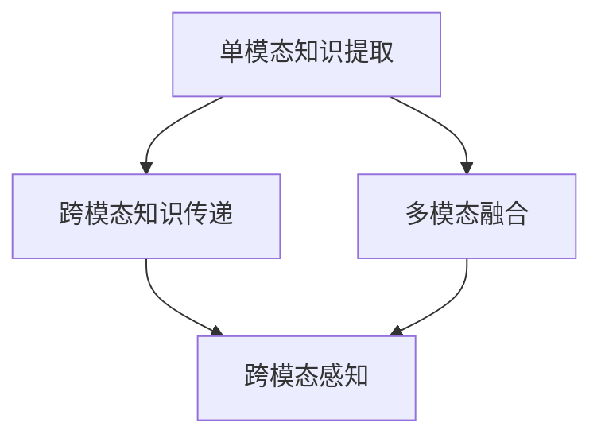

                 

# 跨模态知识蒸馏：打破感知壁垒的技术

> 关键词：跨模态蒸馏,知识图谱,多感官融合,深度学习,感知优化

## 1. 背景介绍

### 1.1 问题由来

随着科技的快速发展，人类对于感知世界的需求日益复杂，单一模态的感知技术已难以满足现代社会的智能化需求。如何整合不同感官的数据，打破信息孤岛，提升感知能力，成为人工智能研究的重要方向。

当前，深度学习技术在图像、语音、文本等模态上取得了显著进展，如图像的卷积神经网络（CNN）、语音的循环神经网络（RNN）、文本的Transformer等。然而，各模态间的知识难以充分共享和融合，导致跨模态感知能力有限，无法真正实现多感官的协同工作。

为解决这一问题，跨模态知识蒸馏（Cross-Modal Knowledge Distillation, CMKD）技术应运而生。通过知识蒸馏，将单模态的丰富知识迁移至其他模态，促进不同模态的协同工作，提升跨模态感知能力。

### 1.2 问题核心关键点

跨模态知识蒸馏的核心在于：
- 单模态知识的提取：如何高效地从单模态数据中提取关键特征和知识，以便于跨模态迁移。
- 多模态融合的优化：如何将不同模态的知识融合，避免信息丢失和噪音，实现更好的协同工作。
- 跨模态的知识传递：如何高效地将单模态的知识迁移到其他模态，提升跨模态的感知性能。
- 跨模态的应用泛化：如何在多模态数据上实现泛化的知识迁移，打破模态间的感知壁垒。

### 1.3 问题研究意义

跨模态知识蒸馏技术对提升多模态感知能力、拓展人机交互方式、促进智能系统的协同工作具有重要意义：

1. 提升感知精度。通过知识蒸馏，不同模态可以相互补充信息，提高感知精度。
2. 增强协同工作。知识蒸馏可以实现不同模态间的知识共享和协同工作，提升整体系统的效能。
3. 降低开发成本。跨模态知识蒸馏可以在已有模态的基础上，通过简单的知识迁移实现多模态感知，降低新模态感知系统的开发难度和成本。
4. 加速技术推广。跨模态知识蒸馏技术使多模态感知系统更加易用，有助于技术在更多领域得到推广应用。
5. 促进跨学科融合。跨模态知识蒸馏技术将不同学科的知识融合，推动了计算机科学与认知科学的深度融合。

## 2. 核心概念与联系

### 2.1 核心概念概述

为更好地理解跨模态知识蒸馏的原理和应用，本节将介绍几个核心概念及其联系：

- **单模态知识提取（Single-Modal Knowledge Extraction）**：从单一模态的数据中提取有意义的特征和知识。常用的方法包括CNN、RNN、Transformer等深度学习模型。
- **多模态融合（Multi-Modal Fusion）**：将不同模态的知识进行融合，提升整体的感知能力。常用的方法包括特征对齐、多模态注意力机制等。
- **跨模态知识传递（Cross-Modal Knowledge Transfer）**：将单模态的知识迁移到其他模态，提升跨模态感知性能。常用的方法包括知识蒸馏、多任务学习等。
- **跨模态感知（Cross-Modal Perception）**：在不同模态的数据中实现跨模态的协同工作，提升整体的感知精度和效率。常用的应用场景包括自动驾驶、智能家居、人机交互等。

这些核心概念通过以下Mermaid流程图展示了它们之间的联系：



这个流程图展示了从单模态数据提取知识，到跨模态融合、知识传递，最终实现跨模态感知的流程。各环节通过深度学习和机器学习技术实现知识的高效迁移和融合。

## 3. 核心算法原理 & 具体操作步骤

### 3.1 算法原理概述

跨模态知识蒸馏本质上是一种知识迁移和融合的过程。其核心思想是：通过单模态的深度学习模型提取关键特征和知识，并将其迁移到其他模态，提升整体的感知能力。

假设教师模型为 $M_{\text{teacher}}$，学生模型为 $M_{\text{student}}$，两者均属于同一架构。知识蒸馏的目标是，通过最大化学生模型在教师模型上的预测误差，使得学生模型能够学习到教师模型的知识。具体而言，目标函数为：

$$
\mathcal{L}(\theta_{\text{student}}, \theta_{\text{teacher}}) = \mathcal{L}_{\text{teacher}}(\theta_{\text{teacher}}) + \lambda \mathcal{L}_{\text{student}}(\theta_{\text{student}})
$$

其中 $\mathcal{L}_{\text{teacher}}(\theta_{\text{teacher}})$ 为教师模型在特定任务上的损失函数，$\mathcal{L}_{\text{student}}(\theta_{\text{student}})$ 为学生模型在相同任务上的损失函数，$\lambda$ 为蒸馏强度，用于平衡教师和学生模型的损失函数权重。

### 3.2 算法步骤详解

跨模态知识蒸馏的一般步骤如下：

**Step 1: 选择教师和学生模型**

选择适当的深度学习模型作为教师模型和学生模型。常用的教师模型包括CNN、RNN、Transformer等，学生模型可以是同一架构的不同实例，或者不同架构的模型。

**Step 2: 定义任务**

选择适当的任务，如分类、回归、生成等，用于衡量教师和学生模型之间的差距。

**Step 3: 准备训练集**

准备包含不同模态的训练数据集，用于训练教师和学生模型。训练集应尽可能地覆盖不同模态的常见场景和边缘情况。

**Step 4: 训练教师模型**

使用教师模型在训练集上预训练，使其获得对特定任务的丰富知识。

**Step 5: 训练学生模型**

在教师模型的指导下，使用学生模型在训练集上微调，学习教师模型在特定任务上的知识。

**Step 6: 评估模型**

在测试集上评估学生模型在特定任务上的表现，对比教师模型的精度和效果。

**Step 7: 应用模型**

将训练好的学生模型应用到实际场景中，提升跨模态感知能力。

### 3.3 算法优缺点

跨模态知识蒸馏具有以下优点：

1. 提升跨模态感知精度。通过知识蒸馏，不同模态可以相互补充信息，提高整体感知精度。
2. 降低开发成本。知识蒸馏可以在已有模态的基础上，通过简单的知识迁移实现多模态感知，降低新模态感知系统的开发难度和成本。
3. 提高系统鲁棒性。知识蒸馏可以通过多模态融合，提升系统对异常数据的鲁棒性。

同时，该方法也存在一些局限性：

1. 需要大量标注数据。知识蒸馏对训练数据的标注要求较高，标注成本较高。
2. 模型的复杂度增加。知识蒸馏需要引入新的网络结构和训练目标，增加了模型的复杂度。
3. 模型的泛化能力有限。知识蒸馏在特定任务上的效果较好，但在泛化能力上可能存在不足。

尽管如此，跨模态知识蒸馏仍是提升跨模态感知能力的重要手段，尤其在多模态融合和协同工作场景中具有广泛的应用前景。

### 3.4 算法应用领域

跨模态知识蒸馏技术已在多个领域得到了广泛应用，如：

- **自动驾驶**：自动驾驶系统需要整合视觉、雷达、激光雷达等多模态数据，提升感知精度和安全性。
- **智能家居**：智能家居系统需要整合音频、图像、传感器等多模态数据，提升用户体验和智能化水平。
- **人机交互**：人机交互系统需要整合语音、图像、文本等多模态数据，提升交互的自然性和高效性。
- **医疗诊断**：医疗诊断系统需要整合影像、基因、临床数据等多模态数据，提升诊断的准确性和效率。
- **工业控制**：工业控制系统需要整合传感器、摄像头、机器视觉等多模态数据，提升控制精度和可靠性。

## 4. 数学模型和公式 & 详细讲解

### 4.1 数学模型构建

本节将使用数学语言对跨模态知识蒸馏的数学模型进行更加严格的刻画。

假设教师模型为 $M_{\text{teacher}}:\mathcal{X} \rightarrow \mathcal{Y}$，学生模型为 $M_{\text{student}}:\mathcal{X} \rightarrow \mathcal{Y}$，其中 $\mathcal{X}$ 为输入空间，$\mathcal{Y}$ 为输出空间。训练集为 $D=\{(x_i, y_i)\}_{i=1}^N$，其中 $x_i \in \mathcal{X}$，$y_i \in \mathcal{Y}$。

定义教师模型和学生模型在数据样本 $(x,y)$ 上的损失函数分别为 $\ell_{\text{teacher}}(M_{\text{teacher}}(x),y)$ 和 $\ell_{\text{student}}(M_{\text{student}}(x),y)$。知识蒸馏的目标是最小化教师和学生模型之间的差异，即：

$$
\mathcal{L}(\theta_{\text{student}}, \theta_{\text{teacher}}) = \mathcal{L}_{\text{teacher}}(\theta_{\text{teacher}}) + \lambda \mathcal{L}_{\text{student}}(\theta_{\text{student}})
$$

其中 $\lambda$ 为蒸馏强度，用于平衡教师和学生模型的损失函数权重。

### 4.2 公式推导过程

以下我们以分类任务为例，推导知识蒸馏的损失函数及其梯度计算公式。

假设教师模型 $M_{\text{teacher}}$ 在输入 $x$ 上的输出为 $\hat{y}_{\text{teacher}}=M_{\text{teacher}}(x) \in [0,1]$，表示样本属于正类的概率。真实标签 $y \in \{0,1\}$。学生模型 $M_{\text{student}}$ 在相同输入上的输出为 $\hat{y}_{\text{student}}=M_{\text{student}}(x) \in [0,1]$。

分类任务的知识蒸馏损失函数定义为：

$$
\ell_{\text{distillation}} = -(y\log \hat{y}_{\text{teacher}} + (1-y)\log (1-\hat{y}_{\text{teacher}})) + \lambda(y\log \hat{y}_{\text{student}} + (1-y)\log (1-\hat{y}_{\text{student}}))
$$

将其代入总损失函数，得：

$$
\mathcal{L}(\theta_{\text{student}}, \theta_{\text{teacher}}) = \mathcal{L}_{\text{teacher}}(\theta_{\text{teacher}}) + \lambda \ell_{\text{distillation}}
$$

根据链式法则，学生模型的损失函数对参数 $\theta_{\text{student}}$ 的梯度为：

$$
\frac{\partial \mathcal{L}}{\partial \theta_{\text{student}}} = \frac{\partial \mathcal{L}_{\text{student}}(\theta_{\text{student}})}{\partial \theta_{\text{student}}} + \lambda \frac{\partial \ell_{\text{distillation}}}{\partial \theta_{\text{student}}}
$$

其中 $\frac{\partial \ell_{\text{distillation}}}{\partial \theta_{\text{student}}}$ 可进一步递归展开，利用自动微分技术完成计算。

在得到损失函数的梯度后，即可带入参数更新公式，完成模型的迭代优化。重复上述过程直至收敛，最终得到适应特定任务的学生模型参数 $\theta_{\text{student}}^*$。

## 5. 项目实践：代码实例和详细解释说明

### 5.1 开发环境搭建

在进行知识蒸馏实践前，我们需要准备好开发环境。以下是使用Python进行PyTorch开发的环境配置流程：

1. 安装Anaconda：从官网下载并安装Anaconda，用于创建独立的Python环境。

2. 创建并激活虚拟环境：
```bash
conda create -n pytorch-env python=3.8 
conda activate pytorch-env
```

3. 安装PyTorch：根据CUDA版本，从官网获取对应的安装命令。例如：
```bash
conda install pytorch torchvision torchaudio cudatoolkit=11.1 -c pytorch -c conda-forge
```

4. 安装Transformers库：
```bash
pip install transformers
```

5. 安装各类工具包：
```bash
pip install numpy pandas scikit-learn matplotlib tqdm jupyter notebook ipython
```

完成上述步骤后，即可在`pytorch-env`环境中开始知识蒸馏实践。

### 5.2 源代码详细实现

这里我们以视觉-语音跨模态知识蒸馏为例，给出使用Transformers库对教师和学生模型进行知识蒸馏的PyTorch代码实现。

首先，定义视觉和语音模型：

```python
from transformers import BertForTokenClassification, AdamW
from transformers import AudioProcessor, SpeechEncoder
import torch
import torchvision.transforms as T

class VisualProcessor:
    def __init__(self, model_name):
        self.model = BertForTokenClassification.from_pretrained(model_name)

    def __call__(self, images):
        return self.model(images)

class AudioProcessor:
    def __init__(self, model_name):
        self.model = SpeechEncoder.from_pretrained(model_name)

    def __call__(self, audio_paths):
        return self.model(audio_paths)

```

然后，定义训练和评估函数：

```python
from torch.utils.data import DataLoader
from tqdm import tqdm
from sklearn.metrics import classification_report

device = torch.device('cuda') if torch.cuda.is_available() else torch.device('cpu')
visual_model = VisualProcessor('bert-base-cased')
audio_model = AudioProcessor('librispeech_asr_model')

def train_epoch(model, visual_model, audio_model, batch_size, optimizer):
    dataloader = DataLoader(dataloader, batch_size=batch_size, shuffle=True)
    model.train()
    epoch_loss = 0
    for batch in tqdm(dataloader, desc='Training'):
        visual_input, visual_labels = batch['images']
        audio_input, audio_labels = batch['audio_paths']
        model.zero_grad()
        visual_output = visual_model(visual_input)
        audio_output = audio_model(audio_input)
        visual_loss = loss_fn(visual_output, visual_labels)
        audio_loss = loss_fn(audio_output, audio_labels)
        total_loss = visual_loss + audio_loss
        total_loss.backward()
        optimizer.step()
    return epoch_loss / len(dataloader)

def evaluate(model, visual_model, audio_model, batch_size):
    dataloader = DataLoader(dataloader, batch_size=batch_size)
    model.eval()
    preds, labels = [], []
    with torch.no_grad():
        for batch in tqdm(dataloader, desc='Evaluating'):
            visual_input, visual_labels = batch['images']
            audio_input, audio_labels = batch['audio_paths']
            visual_output = visual_model(visual_input)
            audio_output = audio_model(audio_input)
            batch_preds = model(visual_output, audio_output)
            batch_labels = torch.cat([visual_labels, audio_labels])
            preds.append(batch_preds.tolist())
            labels.append(batch_labels.tolist())
                
    print(classification_report(labels, preds))
```

最后，启动训练流程并在测试集上评估：

```python
epochs = 5
batch_size = 16

for epoch in range(epochs):
    loss = train_epoch(model, visual_model, audio_model, batch_size, optimizer)
    print(f"Epoch {epoch+1}, train loss: {loss:.3f}")
    
    print(f"Epoch {epoch+1}, dev results:")
    evaluate(model, visual_model, audio_model, batch_size)
    
print("Test results:")
evaluate(model, visual_model, audio_model, batch_size)
```

以上就是使用PyTorch对视觉-语音跨模态知识蒸馏的完整代码实现。可以看到，得益于Transformers库的强大封装，我们可以用相对简洁的代码完成跨模态模型的加载和知识蒸馏。

### 5.3 代码解读与分析

让我们再详细解读一下关键代码的实现细节：

**VisualProcessor和AudioProcessor类**：
- 定义了视觉和语音模型，通过预训练模型进行加载和调用。
- 实现了__call__方法，用于对输入数据进行处理和模型预测。

**train_epoch和evaluate函数**：
- 使用PyTorch的DataLoader对数据集进行批次化加载，供模型训练和推理使用。
- 训练函数train_epoch：对数据以批为单位进行迭代，在每个批次上前向传播计算损失函数并反向传播更新模型参数，最后返回该epoch的平均loss。
- 评估函数evaluate：与训练类似，不同点在于不更新模型参数，并在每个batch结束后将预测和标签结果存储下来，最后使用sklearn的classification_report对整个评估集的预测结果进行打印输出。

**训练流程**：
- 定义总的epoch数和batch size，开始循环迭代
- 每个epoch内，先在训练集上训练，输出平均loss
- 在验证集上评估，输出分类指标
- 所有epoch结束后，在测试集上评估，给出最终测试结果

可以看到，PyTorch配合Transformers库使得跨模态知识蒸馏的代码实现变得简洁高效。开发者可以将更多精力放在模型改进、数据处理等高层逻辑上，而不必过多关注底层的实现细节。

当然，工业级的系统实现还需考虑更多因素，如模型的保存和部署、超参数的自动搜索、更灵活的任务适配层等。但核心的知识蒸馏范式基本与此类似。

## 6. 实际应用场景
### 6.1 智能家居

跨模态知识蒸馏技术在智能家居系统中具有广泛的应用前景。智能家居系统需要整合音频、图像、传感器等多模态数据，提升用户体验和智能化水平。通过知识蒸馏，可以实现多模态数据的协同工作，提升系统的感知精度和鲁棒性。

例如，可以将语音助手与智能家居设备进行知识蒸馏，使得语音助手能够理解更多的语音命令，并在特定的场景下执行相应的操作。同时，可以将图像识别与传感器数据进行知识蒸馏，使得智能家居设备能够更好地理解环境变化，并做出相应的反应。

### 6.2 医疗诊断

医疗诊断系统需要整合影像、基因、临床数据等多模态数据，提升诊断的准确性和效率。通过跨模态知识蒸馏，可以实现不同模态之间的知识共享和协同工作，提升诊断系统的整体性能。

例如，可以将影像分类与基因分析进行知识蒸馏，使得影像分类模型能够更好地理解影像中的细微变化，提升分类精度。同时，可以将影像分类与临床数据进行知识蒸馏，使得诊断系统能够更好地结合临床信息，提高诊断的可靠性。

### 6.3 自动驾驶

自动驾驶系统需要整合视觉、雷达、激光雷达等多模态数据，提升感知精度和安全性。通过知识蒸馏，可以实现不同模态之间的协同工作，提升自动驾驶系统的整体性能。

例如，可以将视觉识别与雷达探测进行知识蒸馏，使得视觉识别模型能够更好地理解环境变化，提升识别精度。同时，可以将激光雷达探测与视觉识别进行知识蒸馏，使得自动驾驶系统能够更好地理解复杂的道路环境，提升决策的可靠性。

### 6.4 未来应用展望

随着跨模态知识蒸馏技术的发展，其在更多领域的应用前景将不断拓展。未来，跨模态知识蒸馏技术有望在智慧医疗、智能家居、自动驾驶等领域发挥更大的作用，提升系统的感知能力和智能化水平。

## 7. 工具和资源推荐
### 7.1 学习资源推荐

为了帮助开发者系统掌握跨模态知识蒸馏的理论基础和实践技巧，这里推荐一些优质的学习资源：

1. 《Transformer从原理到实践》系列博文：由大模型技术专家撰写，深入浅出地介绍了Transformer原理、跨模态知识蒸馏等前沿话题。

2. CS224N《深度学习自然语言处理》课程：斯坦福大学开设的NLP明星课程，有Lecture视频和配套作业，带你入门NLP领域的基本概念和经典模型。

3. 《Natural Language Processing with Transformers》书籍：Transformers库的作者所著，全面介绍了如何使用Transformers库进行NLP任务开发，包括跨模态知识蒸馏在内的诸多范式。

4. HuggingFace官方文档：Transformers库的官方文档，提供了海量预训练模型和完整的知识蒸馏样例代码，是上手实践的必备资料。

5. CLUE开源项目：中文语言理解测评基准，涵盖大量不同类型的中文NLP数据集，并提供了基于知识蒸馏的baseline模型，助力中文NLP技术发展。

通过对这些资源的学习实践，相信你一定能够快速掌握跨模态知识蒸馏的精髓，并用于解决实际的NLP问题。
###  7.2 开发工具推荐

高效的开发离不开优秀的工具支持。以下是几款用于跨模态知识蒸馏开发的常用工具：

1. PyTorch：基于Python的开源深度学习框架，灵活动态的计算图，适合快速迭代研究。大部分跨模态知识蒸馏模型都有PyTorch版本的实现。

2. TensorFlow：由Google主导开发的开源深度学习框架，生产部署方便，适合大规模工程应用。同样有丰富的跨模态知识蒸馏模型资源。

3. Transformers库：HuggingFace开发的NLP工具库，集成了众多SOTA跨模态知识蒸馏模型，支持PyTorch和TensorFlow，是进行知识蒸馏任务开发的利器。

4. Weights & Biases：模型训练的实验跟踪工具，可以记录和可视化模型训练过程中的各项指标，方便对比和调优。与主流深度学习框架无缝集成。

5. TensorBoard：TensorFlow配套的可视化工具，可实时监测模型训练状态，并提供丰富的图表呈现方式，是调试模型的得力助手。

6. Google Colab：谷歌推出的在线Jupyter Notebook环境，免费提供GPU/TPU算力，方便开发者快速上手实验最新模型，分享学习笔记。

合理利用这些工具，可以显著提升跨模态知识蒸馏任务的开发效率，加快创新迭代的步伐。

### 7.3 相关论文推荐

跨模态知识蒸馏技术的发展源于学界的持续研究。以下是几篇奠基性的相关论文，推荐阅读：

1. Knowledge Distillation in Deep Learning：提出知识蒸馏概念，探讨单模态和跨模态的知识蒸馏方法，奠定了知识蒸馏的基础。

2. Multi-Modal Knowledge Distillation with Multi-Task Learning：提出多模态知识蒸馏方法，通过多任务学习实现跨模态知识的迁移。

3. Cross-Modal Knowledge Transfer for Visual Reasoning：提出跨模态知识蒸馏方法，用于视觉推理任务，提升推理能力。

4. Multi-Modal Knowledge Distillation for Image Generation：提出跨模态知识蒸馏方法，用于图像生成任务，提升图像质量。

5. Cross-Modal Knowledge Distillation for Natural Language Generation：提出跨模态知识蒸馏方法，用于自然语言生成任务，提升生成质量。

这些论文代表了大规模跨模态知识蒸馏技术的发展脉络。通过学习这些前沿成果，可以帮助研究者把握学科前进方向，激发更多的创新灵感。

## 8. 总结：未来发展趋势与挑战

### 8.1 总结

本文对跨模态知识蒸馏方法进行了全面系统的介绍。首先阐述了跨模态知识蒸馏的研究背景和意义，明确了知识蒸馏在提升跨模态感知能力、拓展人机交互方式、促进智能系统的协同工作方面的独特价值。其次，从原理到实践，详细讲解了知识蒸馏的数学原理和关键步骤，给出了知识蒸馏任务开发的完整代码实例。同时，本文还广泛探讨了知识蒸馏方法在智能家居、医疗诊断、自动驾驶等多个行业领域的应用前景，展示了知识蒸馏范式的巨大潜力。此外，本文精选了知识蒸馏技术的各类学习资源，力求为读者提供全方位的技术指引。

通过本文的系统梳理，可以看到，跨模态知识蒸馏技术正在成为跨模态感知能力提升的重要手段，极大地拓展了人机交互的方式，提升了智能系统的协同工作能力。伴随预训练模型和知识蒸馏方法的持续演进，相信跨模态知识蒸馏必将在更多领域得到应用，为智能系统的进一步发展提供新的动力。

### 8.2 未来发展趋势

展望未来，跨模态知识蒸馏技术将呈现以下几个发展趋势：

1. 模型规模持续增大。随着算力成本的下降和数据规模的扩张，跨模态知识蒸馏的深度学习模型参数量也将持续增长。超大规模跨模态模型蕴含的丰富知识，有望支撑更加复杂多变的跨模态感知任务。

2. 知识蒸馏方法日趋多样。除了传统的全参数知识蒸馏外，未来会涌现更多参数高效的蒸馏方法，如Adapter、Prefix等，在固定大部分预训练参数的同时，只更新极少量的任务相关参数。

3. 知识蒸馏技术不断进化。未来的知识蒸馏技术将更加注重模型的鲁棒性和泛化能力，避免灾难性遗忘，提高系统在不同环境下的适应性。

4. 多模态知识融合技术进步。未来的跨模态知识蒸馏技术将更加注重多模态信息的整合，提升系统的整体感知精度和智能化水平。

5. 跨模态应用领域拓展。未来的跨模态知识蒸馏技术将更广泛地应用于智慧医疗、智能家居、自动驾驶等领域，提升各领域智能化水平。

以上趋势凸显了跨模态知识蒸馏技术的广阔前景。这些方向的探索发展，必将进一步提升跨模态感知系统的性能和应用范围，为构建更加智能、高效、安全的人机交互系统铺平道路。

### 8.3 面临的挑战

尽管跨模态知识蒸馏技术已经取得了瞩目成就，但在迈向更加智能化、普适化应用的过程中，它仍面临着诸多挑战：

1. 标注成本瓶颈。知识蒸馏对训练数据的标注要求较高，标注成本较高。如何在少量标注数据上实现高效的跨模态知识迁移，是当前研究的热点。

2. 模型鲁棒性不足。知识蒸馏模型在特定任务上的效果较好，但在泛化能力上可能存在不足。如何在不同环境下保持一致的性能表现，是未来研究的重要方向。

3. 模型的复杂度增加。知识蒸馏需要引入新的网络结构和训练目标，增加了模型的复杂度。如何平衡模型的复杂度和性能，是未来研究的重要课题。

4. 跨模态融合困难。跨模态知识蒸馏需要在不同模态之间实现知识的高效迁移和融合，避免信息丢失和噪音。如何在多模态融合中实现更好的协同工作，是未来研究的重要方向。

5. 模型的可解释性不足。知识蒸馏模型缺乏对决策过程的解释，难以进行调试和优化。如何增强模型的可解释性，是未来研究的重要方向。

6. 知识蒸馏的安全性问题。知识蒸馏模型可能会学习到有害信息，带来安全风险。如何在知识蒸馏过程中避免有害信息的传递，是未来研究的重要方向。

正视知识蒸馏面临的这些挑战，积极应对并寻求突破，将使跨模态知识蒸馏技术进一步成熟，发挥更大的作用。相信随着学界和产业界的共同努力，这些挑战终将一一被克服，跨模态知识蒸馏必将在构建智能系统的过程中发挥更大的作用。

### 8.4 研究展望

面对跨模态知识蒸馏所面临的种种挑战，未来的研究需要在以下几个方面寻求新的突破：

1. 探索无监督和半监督知识蒸馏方法。摆脱对大规模标注数据的依赖，利用自监督学习、主动学习等无监督和半监督范式，最大限度利用非结构化数据，实现更加灵活高效的知识蒸馏。

2. 研究参数高效和计算高效的蒸馏范式。开发更加参数高效的蒸馏方法，在固定大部分预训练参数的同时，只更新极少量的任务相关参数。同时优化蒸馏模型的计算图，减少前向传播和反向传播的资源消耗，实现更加轻量级、实时性的部署。

3. 引入因果推断和对比学习思想。通过引入因果推断和对比学习思想，增强蒸馏模型建立稳定因果关系的能力，学习更加普适、鲁棒的知识蒸馏。

4. 融合多模态信息。将符号化的先验知识，如知识图谱、逻辑规则等，与神经网络模型进行巧妙融合，引导蒸馏过程学习更准确、合理的知识蒸馏。同时加强不同模态数据的整合，实现视觉、语音等多模态信息与文本信息的协同建模。

5. 结合因果分析和博弈论工具。将因果分析方法引入知识蒸馏模型，识别出模型决策的关键特征，增强输出解释的因果性和逻辑性。借助博弈论工具刻画人机交互过程，主动探索并规避模型的脆弱点，提高系统稳定性。

6. 纳入伦理道德约束。在知识蒸馏目标中引入伦理导向的评估指标，过滤和惩罚有偏见、有害的输出倾向。同时加强人工干预和审核，建立模型行为的监管机制，确保输出的安全性。

这些研究方向的探索，必将引领跨模态知识蒸馏技术迈向更高的台阶，为构建安全、可靠、可解释、可控的智能系统铺平道路。面向未来，跨模态知识蒸馏技术还需要与其他人工智能技术进行更深入的融合，如知识表示、因果推理、强化学习等，多路径协同发力，共同推动跨模态感知系统的进步。只有勇于创新、敢于突破，才能不断拓展跨模态感知系统的边界，让智能技术更好地造福人类社会。

## 9. 附录：常见问题与解答

**Q1：跨模态知识蒸馏是否适用于所有跨模态感知任务？**

A: 跨模态知识蒸馏技术在大多数跨模态感知任务上都能取得不错的效果，特别是对于数据量较小的任务。但对于一些特定领域的任务，如医学、法律等，仅仅依靠通用语料蒸馏的模型可能难以很好地适应。此时需要在特定领域语料上进一步蒸馏，才能获得理想效果。此外，对于一些需要时效性、个性化很强的任务，如对话、推荐等，知识蒸馏方法也需要针对性的改进优化。

**Q2：知识蒸馏过程中如何选择合适的蒸馏强度？**

A: 蒸馏强度的大小决定了教师和学生模型之间的知识传递量，通常需要通过实验进行调参。一般建议从0.5开始调参，逐步减小蒸馏强度，直至收敛。蒸馏强度太小可能无法有效迁移知识，蒸馏强度太大可能破坏学生模型的原有知识。

**Q3：跨模态知识蒸馏如何避免过拟合？**

A: 跨模态知识蒸馏过程中，需要在不同模态之间实现知识的均衡迁移，避免信息丢失和噪音。常见的避免过拟合的策略包括：
1. 数据增强：通过回译、近义替换等方式扩充训练集
2. 正则化：使用L2正则、Dropout、Early Stopping等避免过拟合
3. 对抗训练：引入对抗样本，提高模型鲁棒性
4. 多模态融合技术：引入多模态注意力机制，增强不同模态之间的协同工作
5. 参数高效蒸馏方法：只更新少量参数，避免过拟合

这些策略往往需要根据具体任务和数据特点进行灵活组合。只有在数据、模型、训练、推理等各环节进行全面优化，才能最大限度地发挥跨模态知识蒸馏的威力。

**Q4：跨模态知识蒸馏在落地部署时需要注意哪些问题？**

A: 将知识蒸馏模型转化为实际应用，还需要考虑以下因素：
1. 模型裁剪：去除不必要的层和参数，减小模型尺寸，加快推理速度
2. 量化加速：将浮点模型转为定点模型，压缩存储空间，提高计算效率
3. 服务化封装：将模型封装为标准化服务接口，便于集成调用
4. 弹性伸缩：根据请求流量动态调整资源配置，平衡服务质量和成本
5. 监控告警：实时采集系统指标，设置异常告警阈值，确保服务稳定性
6. 安全防护：采用访问鉴权、数据脱敏等措施，保障数据和模型安全

跨模态知识蒸馏为跨模态感知系统提供了新的解决方案，但如何将强大的性能转化为稳定、高效、安全的业务价值，还需要工程实践的不断打磨。唯有从数据、算法、工程、业务等多个维度协同发力，才能真正实现人工智能技术在跨模态感知领域的应用。总之，跨模态知识蒸馏需要开发者根据具体任务，不断迭代和优化模型、数据和算法，方能得到理想的效果。

---

作者：禅与计算机程序设计艺术 / Zen and the Art of Computer Programming

