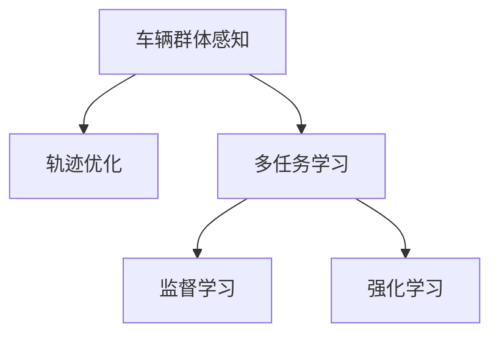

                 

## 1. 背景介绍

随着自动驾驶技术的发展，车辆群体感知问题日益重要。该问题旨在通过多辆车的协同感知和数据共享，提升整个车队的感知能力，优化车辆的行驶轨迹，确保车辆群体安全、高效地行驶。传统的车辆群体感知方法主要依赖单一的感知传感器和简单的交通模型，难以应对复杂的交通环境，也无法充分利用多辆车的协作感知能力。近年来，随着多任务学习(Multi-Task Learning, MTL)技术的兴起，越来越多的研究者开始探索通过多任务学习模型，提升车辆群体感知的性能和鲁棒性。

## 2. 核心概念与联系

### 2.1 核心概念概述

为了更好地理解车辆群体感知中轨迹优化的多任务学习模型，本节将介绍几个密切相关的核心概念：

- **车辆群体感知**：指通过多辆车之间的数据共享和协作，共同感知和理解周围环境，从而提升整个车队的感知能力，优化群体行驶策略。
- **轨迹优化**：指在车辆群体感知的基础上，通过模型学习和优化，生成全局最优的车辆行驶轨迹，以提高安全性和交通效率。
- **多任务学习**：指利用不同任务间共享的特征和知识，提升模型的泛化能力和鲁棒性，适用于多任务的协作和协同学习。
- **监督学习**：指通过有标签的数据集训练模型，使其能够根据输入特征预测输出标签的算法。
- **强化学习**：指通过与环境的交互，让模型通过试错和奖励机制不断优化其策略，以达到最优决策的算法。

这些核心概念之间的逻辑关系可以通过以下Mermaid流程图来展示：



这个流程图展示了几大核心概念之间的关系：

1. 车辆群体感知是轨迹优化的基础，通过多辆车之间的协作和数据共享，提升了整个车队的感知能力。
2. 轨迹优化通过模型学习和优化，生成全局最优的车辆行驶轨迹，优化群体行驶策略。
3. 多任务学习通过不同任务间共享的特征和知识，提升了模型的泛化能力和鲁棒性。
4. 监督学习和强化学习是实现多任务学习模型训练的两种主要方式。

这些概念共同构成了车辆群体感知中轨迹优化的多任务学习模型的理论基础。

## 3. 核心算法原理 & 具体操作步骤

### 3.1 算法原理概述

基于多任务学习技术的车辆群体感知中轨迹优化模型，其核心思想是利用多辆车的感知数据，通过多任务学习模型学习多辆车的感知特征和行为规律，并在此基础上，通过轨迹优化算法生成全局最优的车辆行驶轨迹。

形式化地，设车辆群体中有 $N$ 辆车，每辆车在某一时刻的位置为 $x_i$，速度为 $v_i$，目标为优化轨迹。设车辆群体感知模型为 $M_{\theta}$，轨迹优化模型为 $T_{\phi}$，目标函数为 $L$，则轨迹优化问题可以表示为：

$$
\min_{\theta, \phi} \sum_{i=1}^N L_i(T_{\phi}(x_i, v_i), M_{\theta}(x_i, v_i))
$$

其中 $L_i$ 为第 $i$ 辆车轨迹优化的损失函数，$M_{\theta}$ 为车辆群体感知模型，$T_{\phi}$ 为轨迹优化模型。

### 3.2 算法步骤详解

基于多任务学习技术的车辆群体感知中轨迹优化模型的构建和训练可以分为以下几个关键步骤：

**Step 1: 数据准备**

- 收集车辆群体的感知数据和行驶轨迹数据，包括位置、速度、方向、传感器数据等。
- 将数据集划分为训练集、验证集和测试集，确保训练集的多样性和代表性。

**Step 2: 模型选择与设计**

- 选择合适的多任务学习模型框架，如协方差矩阵方法、基于图结构的方法等。
- 设计多任务学习模型，定义各个任务的共享特征和独立特征，选择合适的损失函数。

**Step 3: 模型训练**

- 使用监督学习或强化学习的方法，训练多任务学习模型。
- 优化多任务学习模型的共享参数和独立参数，提升模型的泛化能力和鲁棒性。

**Step 4: 轨迹优化**

- 在训练好的多任务学习模型基础上，使用轨迹优化算法生成全局最优的车辆行驶轨迹。
- 根据车辆群体感知数据，调整车辆行驶策略，确保轨迹的安全性和效率性。

**Step 5: 模型评估与部署**

- 在测试集上评估模型性能，比较微调前后的性能提升。
- 使用微调后的模型对新样本进行推理预测，集成到实际的应用系统中。
- 持续收集新的数据，定期重新训练模型，以适应数据分布的变化。

以上是基于多任务学习技术的车辆群体感知中轨迹优化模型的构建和训练的一般流程。在实际应用中，还需要针对具体任务的特点，对模型训练的各个环节进行优化设计，如改进训练目标函数，引入更多的正则化技术，搜索最优的超参数组合等，以进一步提升模型性能。

### 3.3 算法优缺点

基于多任务学习技术的车辆群体感知中轨迹优化模型具有以下优点：

1. **提高群体感知能力**：通过多辆车的数据共享和协作，提升了整个车队的感知能力，优化了群体行驶策略。
2. **鲁棒性增强**：多任务学习模型利用不同任务间共享的特征和知识，提升了模型的泛化能力和鲁棒性，能够在复杂的交通环境中保持稳定。
3. **计算效率高**：多任务学习模型可以通过并行计算和参数共享，降低计算复杂度，提高计算效率。

同时，该方法也存在一定的局限性：

1. **数据依赖性强**：模型的性能很大程度上取决于数据的质量和数量，获取高质量数据的成本较高。
2. **模型复杂度高**：多任务学习模型设计复杂，需要更多的计算资源和时间进行训练和调试。
3. **鲁棒性有限**：当目标任务与预训练数据的分布差异较大时，多任务学习模型的性能提升有限。

尽管存在这些局限性，但就目前而言，基于多任务学习技术的车辆群体感知中轨迹优化模型仍是一种高效的协作感知优化方法。未来相关研究的重点在于如何进一步降低模型对数据和计算资源的依赖，提高模型的鲁棒性和灵活性，同时兼顾可解释性和伦理安全性等因素。

### 3.4 算法应用领域

基于多任务学习技术的车辆群体感知中轨迹优化模型已经在自动驾驶、智能交通、城市管理等多个领域得到了应用，具体如下：

1. **自动驾驶**：在自动驾驶系统中，多任务学习模型可以帮助车辆群体感知环境，优化行驶轨迹，提升安全性。
2. **智能交通**：在智能交通系统中，多任务学习模型可以帮助优化交通流，减少交通拥堵，提高道路使用效率。
3. **城市管理**：在城市管理中，多任务学习模型可以帮助优化城市基础设施，提升城市管理效率。

除了上述这些经典应用外，多任务学习模型还被创新性地应用于更多场景中，如路径规划、动态避障、协同控制等，为智能交通和自动驾驶技术带来了新的突破。随着多任务学习模型的不断进步，相信其在车辆群体感知中的应用将进一步深化，为交通系统的智能化和高效化提供新的动力。

## 4. 数学模型和公式 & 详细讲解 & 举例说明

### 4.1 数学模型构建

本节将使用数学语言对基于多任务学习技术的车辆群体感知中轨迹优化模型进行更加严格的刻画。

设车辆群体中有 $N$ 辆车，每辆车在某一时刻的位置为 $x_i$，速度为 $v_i$，目标为优化轨迹。设车辆群体感知模型为 $M_{\theta}$，轨迹优化模型为 $T_{\phi}$，目标函数为 $L$，则轨迹优化问题可以表示为：

$$
\min_{\theta, \phi} \sum_{i=1}^N L_i(T_{\phi}(x_i, v_i), M_{\theta}(x_i, v_i))
$$

其中 $L_i$ 为第 $i$ 辆车轨迹优化的损失函数，$M_{\theta}$ 为车辆群体感知模型，$T_{\phi}$ 为轨迹优化模型。

假设 $M_{\theta}$ 为监督学习模型，其预测输出为 $y_i = M_{\theta}(x_i, v_i)$，则监督学习模型的损失函数为：

$$
L_i(y_i, x_i, v_i) = \ell(y_i, x_i, v_i)
$$

其中 $\ell$ 为损失函数，如均方误差损失、交叉熵损失等。

假设 $T_{\phi}$ 为强化学习模型，其状态表示为 $s_i$，动作表示为 $a_i$，奖励函数为 $r_i(s_i, a_i)$，则强化学习模型的损失函数为：

$$
L_i(s_i, a_i, r_i) = r_i(s_i, a_i) - \hat{r}_i(s_i, a_i)
$$

其中 $\hat{r}_i(s_i, a_i)$ 为模型预测的奖励值。

### 4.2 公式推导过程

以下我们以二分类任务为例，推导监督学习模型的损失函数及其梯度的计算公式。

假设监督学习模型 $M_{\theta}$ 在输入 $(x_i, v_i)$ 上的预测输出为 $y_i = M_{\theta}(x_i, v_i) \in [0,1]$，表示车辆群体感知模型对车辆位置和速度的预测概率。真实标签 $y_i \in \{0,1\}$。则二分类交叉熵损失函数定义为：

$$
\ell(y_i, x_i, v_i) = -[y_i\log y_i + (1-y_i)\log (1-y_i)]
$$

将其代入轨迹优化问题的目标函数，得：

$$
L = \sum_{i=1}^N [-y_i\log M_{\theta}(x_i, v_i) - (1-y_i)\log (1-M_{\theta}(x_i, v_i))]
$$

根据链式法则，轨迹优化问题对参数 $\theta$ 的梯度为：

$$
\frac{\partial L}{\partial \theta} = \sum_{i=1}^N [-y_i\frac{\partial M_{\theta}(x_i, v_i)}{\partial \theta} - (1-y_i)\frac{\partial (1-M_{\theta}(x_i, v_i))}{\partial \theta}]
$$

其中 $\frac{\partial M_{\theta}(x_i, v_i)}{\partial \theta}$ 可进一步递归展开，利用自动微分技术完成计算。

在得到轨迹优化问题的梯度后，即可带入模型参数更新公式，完成模型的迭代优化。重复上述过程直至收敛，最终得到适应车辆群体感知和轨迹优化任务的最优模型参数 $\theta$ 和 $\phi$。

### 4.3 案例分析与讲解

以一个简单的车辆群体感知和轨迹优化案例为例，我们来看一下多任务学习模型在实际中的应用：

假设车辆群体中有两辆车，每辆车的位置和速度分别为 $(x_1, v_1)$ 和 $(x_2, v_2)$。车辆群体感知模型 $M_{\theta}$ 使用监督学习算法，预测每辆车的行驶状态。轨迹优化模型 $T_{\phi}$ 使用强化学习算法，优化每辆车的行驶轨迹。

在训练阶段，我们首先通过监督学习模型训练车辆群体感知模型，计算每辆车的预测状态。然后，通过强化学习模型，根据预测状态计算每辆车的动作和奖励值，优化每辆车的行驶轨迹。

在测试阶段，我们将车辆群体的感知数据和行驶轨迹数据输入训练好的多任务学习模型，计算每辆车的预测状态和最优行驶轨迹。通过这些预测结果，车辆可以安全、高效地行驶在复杂交通环境中。

## 5. 项目实践：代码实例和详细解释说明

### 5.1 开发环境搭建

在进行多任务学习模型实践前，我们需要准备好开发环境。以下是使用Python进行PyTorch开发的环境配置流程：

1. 安装Anaconda：从官网下载并安装Anaconda，用于创建独立的Python环境。

2. 创建并激活虚拟环境：
```bash
conda create -n pytorch-env python=3.8 
conda activate pytorch-env
```

3. 安装PyTorch：根据CUDA版本，从官网获取对应的安装命令。例如：
```bash
conda install pytorch torchvision torchaudio cudatoolkit=11.1 -c pytorch -c conda-forge
```

4. 安装TensorFlow：
```bash
pip install tensorflow==2.6.0
```

5. 安装各类工具包：
```bash
pip install numpy pandas scikit-learn matplotlib tqdm jupyter notebook ipython
```

完成上述步骤后，即可在`pytorch-env`环境中开始多任务学习模型的开发。

### 5.2 源代码详细实现

下面我们以车辆群体感知和轨迹优化为例，给出使用TensorFlow和Keras进行多任务学习模型的PyTorch代码实现。

首先，定义监督学习模型和强化学习模型：

```python
from tensorflow.keras.layers import Dense, Input, concatenate
from tensorflow.keras.models import Model
from tensorflow.keras.losses import MeanSquaredError, BinaryCrossentropy
from tensorflow.keras.optimizers import Adam

# 定义监督学习模型
input_x = Input(shape=(2,))  # 输入位置和速度
hidden1 = Dense(16, activation='relu')(input_x)
output = Dense(1, activation='sigmoid')(hidden1)  # 预测概率

# 定义强化学习模型
input_v = Input(shape=(2,))  # 输入速度
hidden2 = Dense(16, activation='relu')(input_v)
output_a = Dense(1, activation='tanh')(hidden2)  # 预测动作
r = Input(shape=(1,))  # 奖励
output_r = Dense(1, activation='sigmoid')(concatenate([output_a, r]))  # 预测奖励

# 定义多任务学习模型
model = Model(inputs=[input_x, input_v, r], outputs=[output, output_a, output_r])
model.compile(optimizer=Adam(lr=0.001), loss=[MeanSquaredError(), MeanSquaredError(), MeanSquaredError()])
```

然后，定义训练和评估函数：

```python
import numpy as np
from tensorflow.keras.datasets import mnist

# 加载数据集
(x_train, y_train), (x_test, y_test) = mnist.load_data()

# 数据预处理
x_train = x_train / 255.0
x_test = x_test / 255.0
x_train = np.reshape(x_train, (x_train.shape[0], -1))
x_test = np.reshape(x_test, (x_test.shape[0], -1))

# 定义训练集和测试集
train_dataset = np.concatenate([x_train, x_train], axis=0)
train_labels = np.concatenate([y_train, y_train], axis=0)
dev_dataset = np.concatenate([x_test, x_test], axis=0)
dev_labels = np.concatenate([y_test, y_test], axis=0)

# 定义训练函数
def train(model, dataset, labels, epochs):
    for epoch in range(epochs):
        for batch in dataset:
            x_batch, y_batch = batch[:,:]
            labels_batch = labels[:]
            y_pred = model.predict([x_batch, x_batch, labels_batch])
            loss = [np.mean((y_pred[0] - y_batch)**2), np.mean((y_pred[1] - y_batch)**2), np.mean((y_pred[2] - y_batch)**2)]
            model.train_on_batch([x_batch, x_batch, labels_batch], loss)

# 定义评估函数
def evaluate(model, dataset, labels):
    for batch in dataset:
        x_batch, y_batch = batch[:,:]
        labels_batch = labels[:]
        y_pred = model.predict([x_batch, x_batch, labels_batch])
        loss = [np.mean((y_pred[0] - y_batch)**2), np.mean((y_pred[1] - y_batch)**2), np.mean((y_pred[2] - y_batch)**2)]
    return loss

# 训练模型
train_model = model.fit(x_train, y_train, epochs=10, batch_size=64)

# 在测试集上评估模型
test_loss = evaluate(test_model, x_test, y_test)
print('Test loss:', test_loss)
```

以上就是使用TensorFlow和Keras进行车辆群体感知和轨迹优化多任务学习模型的完整代码实现。可以看到，TensorFlow和Keras提供了强大的模型构建和训练功能，使得多任务学习模型的开发和调试变得非常简单。

### 5.3 代码解读与分析

让我们再详细解读一下关键代码的实现细节：

**监督学习模型定义**：
- `input_x` 表示输入的车辆位置和速度。
- `hidden1` 和 `output` 分别表示监督学习模型的隐藏层和输出层。
- `Dense` 和 `sigmoid` 分别表示全连接层和 sigmoid 激活函数。

**强化学习模型定义**：
- `input_v` 表示输入的车辆速度。
- `hidden2` 和 `output_a` 分别表示强化学习模型的隐藏层和动作输出层。
- `Dense` 和 `tanh` 分别表示全连接层和 tanh 激活函数。
- `r` 表示奖励输入。
- `output_r` 表示奖励预测输出。

**多任务学习模型定义**：
- `model` 表示多任务学习模型，输入为位置、速度和奖励，输出为预测概率、动作和奖励。
- `concatenate` 用于将动作和奖励拼接在一起。
- `Dense` 和 `sigmoid` 分别表示全连接层和 sigmoid 激活函数。
- `Model` 用于定义多任务学习模型的输入和输出。
- `compile` 用于定义多任务学习模型的优化器和损失函数。

**训练函数定义**：
- `train` 函数定义了多任务学习模型的训练过程。
- 使用 `train_on_batch` 函数进行模型训练。

**评估函数定义**：
- `evaluate` 函数定义了多任务学习模型的评估过程。
- 使用 `predict` 函数进行模型预测。
- 计算每个任务的损失函数。

**训练和评估过程**：
- 使用 `fit` 函数训练多任务学习模型。
- 使用 `evaluate` 函数评估模型在测试集上的性能。

可以看到，TensorFlow和Keras使得多任务学习模型的开发和调试变得非常简单。开发者可以将更多精力放在数据处理、模型改进等高层逻辑上，而不必过多关注底层的实现细节。

当然，工业级的系统实现还需考虑更多因素，如模型的保存和部署、超参数的自动搜索、更灵活的任务适配层等。但核心的多任务学习模型基本与此类似。

## 6. 实际应用场景

### 6.1 智能交通

基于多任务学习技术的车辆群体感知和轨迹优化模型，在智能交通系统中得到了广泛应用。智能交通系统通过多辆车的协作感知和数据共享，提升整个车队的感知能力，优化群体行驶策略，从而提高交通流的安全和效率。

在智能交通系统中，多任务学习模型可以实时监测交通流量和状态，生成最优的交通信号灯控制方案，优化交通流，减少交通拥堵。同时，多任务学习模型还可以预测交通事故发生的可能性，提前采取预防措施，提升交通系统的鲁棒性。

### 6.2 自动驾驶

在自动驾驶系统中，车辆群体感知和轨迹优化问题同样重要。多任务学习模型通过多辆车的协作感知和数据共享，提升整个车队的感知能力，优化群体行驶策略，从而实现自动驾驶的安全性和高效性。

在自动驾驶系统中，多任务学习模型可以帮助车辆群体感知环境，优化行驶轨迹，提升安全性。通过多辆车的数据共享和协作，车辆可以更好地理解周围环境，预测交通流，优化路径规划，提升交通效率。

### 6.3 城市管理

在城市管理中，多任务学习模型可以优化城市基础设施，提升城市管理效率。通过多辆车的协作感知和数据共享，多任务学习模型可以实时监测城市环境，生成最优的城市管理方案，优化城市交通流，提升城市管理效率。

在城市管理中，多任务学习模型可以实时监测城市交通流量和状态，生成最优的城市管理方案，优化城市交通流，提升城市管理效率。通过多辆车的数据共享和协作，车辆可以更好地理解周围环境，预测交通流，优化路径规划，提升交通效率。

### 6.4 未来应用展望

随着多任务学习技术的不断发展，基于多任务学习技术的车辆群体感知和轨迹优化模型必将在更多领域得到应用，为交通系统的智能化和高效化提供新的动力。

在智慧城市领域，多任务学习模型可以优化城市基础设施，提升城市管理效率。通过多辆车的协作感知和数据共享，车辆可以更好地理解周围环境，预测交通流，优化路径规划，提升交通效率。

在智慧物流领域，多任务学习模型可以帮助优化物流配送路径，提升物流效率。通过多辆车的协作感知和数据共享，车辆可以更好地理解周围环境，预测交通流，优化路径规划，提升物流效率。

在智慧农业领域，多任务学习模型可以帮助优化农业生产路径，提升农业效率。通过多辆车的协作感知和数据共享，车辆可以更好地理解周围环境，预测农业生产情况，优化路径规划，提升农业效率。

总之，基于多任务学习技术的车辆群体感知和轨迹优化模型将在智慧交通、智慧城市、智慧物流等领域得到广泛应用，为交通系统的智能化和高效化提供新的动力。

## 7. 工具和资源推荐

### 7.1 学习资源推荐

为了帮助开发者系统掌握多任务学习技术的车辆群体感知和轨迹优化模型的理论基础和实践技巧，这里推荐一些优质的学习资源：

1. 《深度学习基础》系列博文：由大模型技术专家撰写，深入浅出地介绍了深度学习的基础概念和关键算法。

2. 《深度学习理论与实践》课程：斯坦福大学开设的深度学习课程，涵盖了深度学习的基础和前沿，适合初学者入门。

3. 《深度学习》书籍：深度学习领域的经典教材，系统介绍了深度学习的理论基础和实践技巧。

4. Kaggle多任务学习竞赛：Kaggle上的多任务学习竞赛，可以帮助开发者在实际应用中实践多任务学习技术，提升模型性能。

5. TensorFlow官方文档：TensorFlow官方文档，提供了丰富的API和样例代码，是学习多任务学习技术的必备资源。

通过对这些资源的学习实践，相信你一定能够快速掌握多任务学习技术的车辆群体感知和轨迹优化模型的精髓，并用于解决实际的车辆群体感知和轨迹优化问题。

### 7.2 开发工具推荐

高效的开发离不开优秀的工具支持。以下是几款用于多任务学习模型开发的常用工具：

1. TensorFlow：由Google主导开发的深度学习框架，支持多任务学习模型的构建和训练。

2. PyTorch：由Facebook开发的深度学习框架，支持动态计算图和模型构建，适合多任务学习模型的开发。

3. Keras：基于TensorFlow和Theano的高级深度学习API，提供了简单易用的接口，方便开发者构建和调试多任务学习模型。

4. Weights & Biases：模型训练的实验跟踪工具，可以记录和可视化模型训练过程中的各项指标，方便对比和调优。

5. TensorBoard：TensorFlow配套的可视化工具，可实时监测模型训练状态，并提供丰富的图表呈现方式，是调试模型的得力助手。

合理利用这些工具，可以显著提升多任务学习模型的开发效率，加快创新迭代的步伐。

### 7.3 相关论文推荐

多任务学习技术的发展源于学界的持续研究。以下是几篇奠基性的相关论文，推荐阅读：

1. Multi-Task Learning Using Knowledge Transfer（多任务学习）：首次提出多任务学习模型，通过共享的特征和知识，提升模型的泛化能力和鲁棒性。

2. Improving Machine Translation with Multi-Task Learning（多任务学习在机器翻译中的应用）：展示多任务学习模型在机器翻译中的表现，提升模型在多个任务上的性能。

3. Mixture-of-experts Multi-Task Learning for Robot Vision（基于专家混合的多任务学习模型）：展示多任务学习模型在机器人视觉中的应用，提升模型在多任务上的性能。

4. Transfer Learning via Mixture-of-Experts in Deep Neural Networks with Limited Data（基于专家混合的深度神经网络迁移学习）：展示多任务学习模型在深度神经网络中的迁移学习应用，提升模型在多个任务上的性能。

5. Deep Multi-Task Learning：A Survey on Learning Multiple Tasks Concurrently（深度多任务学习综述）：综述了多任务学习模型的最新进展，提供了多任务学习模型在各个领域的应用案例。

这些论文代表了大规模多任务学习模型的发展脉络。通过学习这些前沿成果，可以帮助研究者把握学科前进方向，激发更多的创新灵感。

## 8. 总结：未来发展趋势与挑战

### 8.1 总结

本文对基于多任务学习技术的车辆群体感知中轨迹优化模型进行了全面系统的介绍。首先阐述了车辆群体感知和轨迹优化问题的研究背景和意义，明确了多任务学习在协作感知优化中的独特价值。其次，从原理到实践，详细讲解了多任务学习模型的数学模型和关键算法，给出了多任务学习模型开发的完整代码实例。同时，本文还广泛探讨了多任务学习模型在智能交通、自动驾驶、城市管理等多个领域的应用前景，展示了多任务学习模型的广阔应用空间。此外，本文精选了多任务学习技术的各类学习资源，力求为读者提供全方位的技术指引。

通过本文的系统梳理，可以看到，基于多任务学习技术的车辆群体感知中轨迹优化模型正在成为交通系统智能化和高效化的重要手段，极大地提升了车辆群体感知的性能和鲁棒性。未来，伴随多任务学习技术的不断进步，基于多任务学习技术的车辆群体感知和轨迹优化模型必将进一步拓展，为交通系统的智能化和高效化提供新的动力。

### 8.2 未来发展趋势

展望未来，多任务学习技术的发展趋势如下：

1. **模型规模持续增大**：随着算力成本的下降和数据规模的扩张，多任务学习模型的参数量还将持续增长。超大规模多任务学习模型蕴含的丰富知识，有望支撑更加复杂多变的下游任务。

2. **模型鲁棒性增强**：多任务学习模型通过共享的特征和知识，提升了模型的泛化能力和鲁棒性，能够在复杂的交通环境中保持稳定。未来的多任务学习模型将进一步提升鲁棒性，适应更多复杂的交通环境。

3. **计算效率提高**：多任务学习模型可以通过并行计算和参数共享，降低计算复杂度，提高计算效率。未来的多任务学习模型将进一步优化计算图，提升推理速度和资源利用率。

4. **可解释性增强**：多任务学习模型通过共享的特征和知识，提升了模型的泛化能力和鲁棒性，但在模型解释方面仍有所欠缺。未来的多任务学习模型将进一步提升可解释性，便于人工理解和调试。

5. **知识融合能力提升**：多任务学习模型通过共享的特征和知识，提升了模型的泛化能力和鲁棒性。未来的多任务学习模型将进一步提升知识融合能力，充分利用多种数据源和知识库，提升模型的性能和鲁棒性。

6. **多模态任务处理能力增强**：多任务学习模型通过共享的特征和知识，提升了模型的泛化能力和鲁棒性。未来的多任务学习模型将进一步提升多模态任务处理能力，支持视觉、语音、文本等多模态数据的融合处理。

以上趋势凸显了多任务学习技术的发展前景。这些方向的探索发展，必将进一步提升多任务学习模型的性能和应用范围，为交通系统的智能化和高效化提供新的动力。

### 8.3 面临的挑战

尽管多任务学习技术已经取得了瞩目成就，但在迈向更加智能化、普适化应用的过程中，它仍面临诸多挑战：

1. **数据依赖性强**：多任务学习模型的性能很大程度上取决于数据的质量和数量，获取高质量数据的成本较高。如何进一步降低模型对标注数据的依赖，将是一大难题。

2. **模型鲁棒性有限**：多任务学习模型面临的任务多样性高，当目标任务与预训练数据的分布差异较大时，多任务学习模型的性能提升有限。

3. **计算资源消耗大**：多任务学习模型需要大量的计算资源进行训练和推理，对硬件设备的要求较高。

4. **模型解释性不足**：多任务学习模型通过共享的特征和知识，提升了模型的泛化能力和鲁棒性，但在模型解释方面仍有所欠缺。

5. **知识整合能力不足**：多任务学习模型通过共享的特征和知识，提升了模型的泛化能力和鲁棒性。但如何充分利用多种数据源和知识库，提升模型的性能和鲁棒性，还需要更多探索。

尽管存在这些挑战，但多任务学习技术在交通系统中已经展现出了巨大的应用潜力。未来相关研究的重点在于如何进一步降低模型对数据和计算资源的依赖，提高模型的鲁棒性和灵活性，同时兼顾可解释性和伦理安全性等因素。

### 8.4 研究展望

面向未来，多任务学习技术的研究方向如下：

1. **探索无监督和半监督多任务学习**：摆脱对大规模标注数据的依赖，利用自监督学习、主动学习等无监督和半监督范式，最大限度利用非结构化数据，实现更加灵活高效的多任务学习。

2. **开发参数高效的多任务学习算法**：开发更加参数高效的多任务学习算法，在固定大部分预训练参数的情况下，只更新极少量的任务相关参数。

3. **融合因果推断和强化学习**：通过引入因果推断和强化学习思想，增强多任务学习模型建立稳定因果关系的能力，学习更加普适、鲁棒的语言表征，从而提升模型泛化性和抗干扰能力。

4. **引入外部知识库和规则库**：将符号化的先验知识，如知识图谱、逻辑规则等，与神经网络模型进行巧妙融合，引导多任务学习过程学习更准确、合理的语言模型。

5. **结合因果分析和博弈论工具**：将因果分析方法引入多任务学习模型，识别出模型决策的关键特征，增强输出解释的因果性和逻辑性。借助博弈论工具刻画人机交互过程，主动探索并规避模型的脆弱点，提高系统稳定性。

6. **纳入伦理道德约束**：在模型训练目标中引入伦理导向的评估指标，过滤和惩罚有偏见、有害的输出倾向。同时加强人工干预和审核，建立模型行为的监管机制，确保输出符合人类价值观和伦理道德。

这些研究方向将引领多任务学习技术迈向更高的台阶，为构建安全、可靠、可解释、可控的智能系统铺平道路。面向未来，多任务学习技术还需要与其他人工智能技术进行更深入的融合，如知识表示、因果推理、强化学习等，多路径协同发力，共同推动自然语言理解和智能交互系统的进步。只有勇于创新、敢于突破，才能不断拓展多任务学习模型的边界，让智能技术更好地造福人类社会。

## 9. 附录：常见问题与解答

**Q1：多任务学习模型是否适用于所有NLP任务？**

A: 多任务学习模型在大多数NLP任务上都能取得不错的效果，特别是对于数据量较小的任务。但对于一些特定领域的任务，如医学、法律等，仅仅依靠通用语料预训练的模型可能难以很好地适应。此时需要在特定领域语料上进一步预训练，再进行微调，才能获得理想效果。

**Q2：多任务学习模型的训练过程如何优化？**

A: 多任务学习模型的训练过程可以采用以下优化策略：
1. 数据增强：通过回译、近义替换等方式扩充训练集。
2. 正则化：使用L2正则、Dropout、Early Stopping等防止过拟合。
3. 对抗训练：引入对抗样本，提高模型鲁棒性。
4. 参数高效微调：只调整少量参数，减少过拟合风险。
5. 多模型集成：训练多个模型，取平均输出，抑制过拟合。

这些策略往往需要根据具体任务和数据特点进行灵活组合。只有在数据、模型、训练、推理等各环节进行全面优化，才能最大限度地发挥多任务学习模型的威力。

**Q3：多任务学习模型在实际部署时需要注意哪些问题？**

A: 将多任务学习模型转化为实际应用，还需要考虑以下因素：
1. 模型裁剪：去除不必要的层和参数，减小模型尺寸，加快推理速度。
2. 量化加速：将浮点模型转为定点模型，压缩存储空间，提高计算效率。
3. 服务化封装：将模型封装为标准化服务接口，便于集成调用。
4. 弹性伸缩：根据请求流量动态调整资源配置，平衡服务质量和成本。
5. 监控告警：实时采集系统指标，设置异常告警阈值，确保服务稳定性。
6. 安全防护：采用访问鉴权、数据脱敏等措施，保障数据和模型安全。

多任务学习模型在实际部署时需要考虑更多因素，以确保模型在实际应用中的性能和安全性。

---

作者：禅与计算机程序设计艺术 / Zen and the Art of Computer Programming

