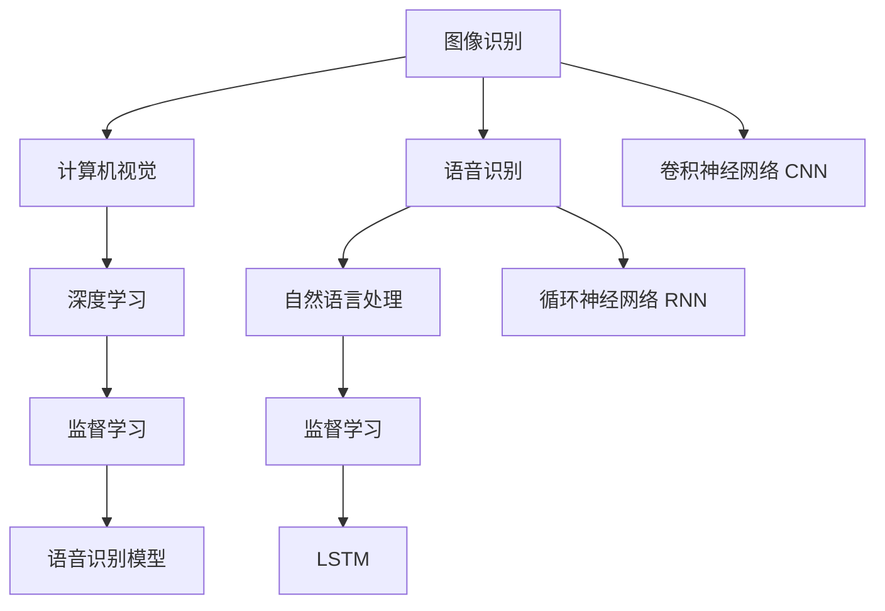

                 

# 软件 2.0 的应用领域：图像识别、语音识别

## 1. 背景介绍

### 1.1 问题由来
随着人工智能技术的发展，软件 2.0 时代的到来，图像识别和语音识别成为计算机视觉和自然语言处理领域的重要研究方向。它们通过自动化、智能化的方式，帮助人类处理和理解视觉和语音信息，应用广泛。然而，图像和语音数据的处理具有复杂性，传统的算法难以处理，需要借助深度学习等新兴技术。

### 1.2 问题核心关键点
- **图像识别**：通过对图像中的对象、场景、文字等信息进行自动识别，可以应用于安防监控、自动驾驶、工业检测等多个领域。
- **语音识别**：通过将语音转换为文本，可以用于智能客服、语音搜索、语音控制等多个场景。

## 2. 核心概念与联系

### 2.1 核心概念概述

为更好地理解图像识别和语音识别技术，本节将介绍几个密切相关的核心概念：

- **图像识别**：利用计算机算法对图像中的物体、场景、文字等进行识别和分类，通常使用深度学习中的卷积神经网络(CNN)等方法。
- **语音识别**：通过将语音转换为文本，通常使用深度学习中的循环神经网络(RNN)、长短期记忆网络(LSTM)等方法。
- **计算机视觉**：研究如何让计算机理解和解释视觉信息，是图像识别技术的基础。
- **自然语言处理**：研究如何让计算机理解和生成自然语言，是语音识别技术的基础。

这些核心概念之间的逻辑关系可以通过以下Mermaid流程图来展示：



这个流程图展示了几项核心概念及其之间的关系：

1. 图像识别和语音识别分别建立在计算机视觉和自然语言处理的基础上。
2. 深度学习中的CNN和RNN等算法，用于处理图像和语音数据。
3. 监督学习是图像识别和语音识别的主要训练方式。
4. LSTM是语音识别领域常用的模型。

这些概念共同构成了图像识别和语音识别技术的核心框架，使得计算机能够更好地理解和处理视觉和语音信息。

## 3. 核心算法原理 & 具体操作步骤

### 3.1 算法原理概述

图像识别和语音识别技术的核心在于通过深度学习算法，构建高层次的特征表示，并利用这些特征进行模式识别和分类。以下是两种技术的详细算法原理。

#### 图像识别
图像识别通常使用卷积神经网络(CNN)进行训练，其基本原理是通过多层卷积、池化、全连接等操作，提取图像的特征表示，并最终通过softmax等分类器对图像进行分类。

#### 语音识别
语音识别则使用循环神经网络(RNN)或长短期记忆网络(LSTM)，通过时间序列的处理，将语音信号转换为文本序列。其中，LSTM网络由于其能够处理长距离依赖关系，被广泛应用于语音识别任务。

### 3.2 算法步骤详解

#### 图像识别
1. **数据准备**：收集并标注大量图像数据，用于训练和验证模型。
2. **模型设计**：选择合适的CNN结构，如LeNet、AlexNet、VGG等，并进行适当的修改和调整。
3. **模型训练**：使用标注数据对模型进行训练，通过反向传播算法更新模型参数。
4. **模型验证**：在验证集上评估模型性能，调整模型超参数。
5. **模型测试**：在测试集上评估最终模型性能，部署并应用模型。

#### 语音识别
1. **数据准备**：收集并标注大量语音数据，用于训练和验证模型。
2. **模型设计**：选择合适的RNN或LSTM结构，并进行适当的修改和调整。
3. **模型训练**：使用标注数据对模型进行训练，通过反向传播算法更新模型参数。
4. **模型验证**：在验证集上评估模型性能，调整模型超参数。
5. **模型测试**：在测试集上评估最终模型性能，部署并应用模型。

### 3.3 算法优缺点
- **图像识别**
  - **优点**：
    - 准确率较高，适用于复杂场景的识别。
    - 深度学习算法能力强，能够自动学习特征。
  - **缺点**：
    - 需要大量标注数据，获取成本高。
    - 模型复杂，计算资源消耗大。
    - 对光照、角度等变化敏感。

- **语音识别**
  - **优点**：
    - 实时性高，适用于交互式应用。
    - 数据获取相对容易，无需大量标注。
  - **缺点**：
    - 环境噪音对识别准确率影响较大。
    - 对口音和语速的适应性较差。
    - 语音信号的复杂性导致模型训练难度较大。

### 3.4 算法应用领域

图像识别和语音识别技术已经在诸多领域得到了广泛应用，例如：

- **图像识别**：自动驾驶、安防监控、医疗影像分析、工业检测等。
- **语音识别**：智能客服、语音助手、语音搜索、语音控制等。

## 4. 数学模型和公式 & 详细讲解

### 4.1 数学模型构建

#### 图像识别
图像识别模型通常基于CNN，其基本结构包括卷积层、池化层和全连接层。以LeNet模型为例，其数学模型如下：

1. **卷积层**：
   $$
   h^{[1]} = \sigma( W^{[1]} * x + b^{[1]})
   $$
   其中，$*$ 表示卷积操作，$W^{[1]}$ 为卷积核，$x$ 为输入图像，$b^{[1]}$ 为偏置项，$\sigma$ 为激活函数。

2. **池化层**：
   $$
   h^{[2]} = \max( W^{[2]} * h^{[1]})
   $$
   其中，$*$ 表示池化操作，$W^{[2]}$ 为池化核。

3. **全连接层**：
   $$
   y = W^{[3]} h^{[2]} + b^{[3]}
   $$
   其中，$W^{[3]}$ 为全连接层权重，$b^{[3]}$ 为偏置项。

#### 语音识别
语音识别模型通常基于RNN或LSTM，其数学模型如下：

1. **RNN模型**：
   $$
   h_{t+1} = \tanh(W^{[r]} h_t + U x_t + b^{[r]})
   $$
   $$
   y_t = V h_t + b^{[y]}
   $$
   其中，$h_t$ 为当前时间步的状态，$x_t$ 为当前时间步的输入，$W^{[r]}$、$U$、$V$ 分别为RNN的权重矩阵，$b^{[r]}$、$b^{[y]}$ 分别为偏置项。

2. **LSTM模型**：
   $$
   f_t = \sigma(W_f x_t + U_f h_{t-1} + b_f)
   $$
   $$
   i_t = \sigma(W_i x_t + U_i h_{t-1} + b_i)
   $$
   $$
   g_t = \tanh(W_g x_t + U_g h_{t-1} + b_g)
   $$
   $$
   o_t = \sigma(W_o x_t + U_o h_{t-1} + b_o)
   $$
   $$
   c_t = f_t * c_{t-1} + i_t * g_t
   $$
   $$
   h_t = o_t * \tanh(c_t)
   $$
   其中，$f_t$、$i_t$、$g_t$、$o_t$ 分别为遗忘门、输入门、候选门、输出门的状态，$h_t$ 为当前时间步的输出，$c_t$ 为当前时间步的细胞状态。

### 4.2 公式推导过程

#### 图像识别
以LeNet模型为例，其前向传播过程如下：

1. **卷积层**：
   $$
   h^{[1]} = \sigma( W^{[1]} * x + b^{[1]})
   $$

2. **池化层**：
   $$
   h^{[2]} = \max( W^{[2]} * h^{[1]})
   $$

3. **全连接层**：
   $$
   y = W^{[3]} h^{[2]} + b^{[3]}
   $$

其中，$*$ 表示卷积操作，$W^{[1]}$ 为卷积核，$x$ 为输入图像，$b^{[1]}$ 为偏置项，$\sigma$ 为激活函数。

#### 语音识别
以LSTM模型为例，其前向传播过程如下：

1. **RNN模型**：
   $$
   h_{t+1} = \tanh(W^{[r]} h_t + U x_t + b^{[r]})
   $$
   $$
   y_t = V h_t + b^{[y]}
   $$

2. **LSTM模型**：
   $$
   f_t = \sigma(W_f x_t + U_f h_{t-1} + b_f)
   $$
   $$
   i_t = \sigma(W_i x_t + U_i h_{t-1} + b_i)
   $$
   $$
   g_t = \tanh(W_g x_t + U_g h_{t-1} + b_g)
   $$
   $$
   o_t = \sigma(W_o x_t + U_o h_{t-1} + b_o)
   $$
   $$
   c_t = f_t * c_{t-1} + i_t * g_t
   $$
   $$
   h_t = o_t * \tanh(c_t)
   $$

其中，$f_t$、$i_t$、$g_t$、$o_t$ 分别为遗忘门、输入门、候选门、输出门的状态，$h_t$ 为当前时间步的输出，$c_t$ 为当前时间步的细胞状态。

### 4.3 案例分析与讲解

#### 图像识别
以MNIST手写数字识别为例，其训练和验证过程如下：

1. **数据准备**：收集大量手写数字图片，并进行标注。
2. **模型设计**：选择LeNet模型，并进行适当修改。
3. **模型训练**：使用标注数据对模型进行训练，通过反向传播算法更新模型参数。
4. **模型验证**：在验证集上评估模型性能，调整模型超参数。
5. **模型测试**：在测试集上评估最终模型性能，部署并应用模型。

#### 语音识别
以百度语音识别为例，其训练和验证过程如下：

1. **数据准备**：收集大量语音数据，并进行标注。
2. **模型设计**：选择LSTM模型，并进行适当修改。
3. **模型训练**：使用标注数据对模型进行训练，通过反向传播算法更新模型参数。
4. **模型验证**：在验证集上评估模型性能，调整模型超参数。
5. **模型测试**：在测试集上评估最终模型性能，部署并应用模型。

## 5. 项目实践：代码实例和详细解释说明

### 5.1 开发环境搭建

在进行图像识别和语音识别项目开发前，我们需要准备好开发环境。以下是使用Python进行PyTorch开发的环境配置流程：

1. 安装Anaconda：从官网下载并安装Anaconda，用于创建独立的Python环境。

2. 创建并激活虚拟环境：
```bash
conda create -n pytorch-env python=3.8 
conda activate pytorch-env
```

3. 安装PyTorch：根据CUDA版本，从官网获取对应的安装命令。例如：
```bash
conda install pytorch torchvision torchaudio cudatoolkit=11.1 -c pytorch -c conda-forge
```

4. 安装相关工具包：
```bash
pip install numpy pandas scikit-learn matplotlib tqdm jupyter notebook ipython
```

完成上述步骤后，即可在`pytorch-env`环境中开始图像识别和语音识别项目开发。

### 5.2 源代码详细实现

#### 图像识别

以下是使用PyTorch实现LeNet模型进行MNIST手写数字识别的代码示例：

```python
import torch
import torch.nn as nn
import torchvision.transforms as transforms
from torchvision.datasets import MNIST
from torch.utils.data import DataLoader

class LeNet(nn.Module):
    def __init__(self):
        super(LeNet, self).__init__()
        self.conv1 = nn.Conv2d(1, 6, 5)
        self.pool = nn.MaxPool2d(2, 2)
        self.conv2 = nn.Conv2d(6, 16, 5)
        self.fc1 = nn.Linear(16 * 4 * 4, 120)
        self.fc2 = nn.Linear(120, 84)
        self.fc3 = nn.Linear(84, 10)
        
    def forward(self, x):
        x = self.pool(torch.relu(self.conv1(x)))
        x = self.pool(torch.relu(self.conv2(x)))
        x = x.view(-1, 16 * 4 * 4)
        x = torch.relu(self.fc1(x))
        x = torch.relu(self.fc2(x))
        x = self.fc3(x)
        return x

model = LeNet()
criterion = nn.CrossEntropyLoss()
optimizer = torch.optim.SGD(model.parameters(), lr=0.01, momentum=0.5)

train_loader = DataLoader(MNIST('MNIST_data', train=True, download=True, transform=transforms.ToTensor()), batch_size=64, shuffle=True)
test_loader = DataLoader(MNIST('MNIST_data', train=False, download=True, transform=transforms.ToTensor()), batch_size=64)

for epoch in range(10):
    model.train()
    running_loss = 0.0
    for i, data in enumerate(train_loader, 0):
        inputs, labels = data
        optimizer.zero_grad()
        outputs = model(inputs)
        loss = criterion(outputs, labels)
        loss.backward()
        optimizer.step()
        running_loss += loss.item()
    print('Epoch [%d] loss: %.3f' % (epoch + 1, running_loss / len(train_loader)))

    model.eval()
    correct = 0
    total = 0
    with torch.no_grad():
        for data in test_loader:
            images, labels = data
            outputs = model(images)
            _, predicted = torch.max(outputs.data, 1)
            total += labels.size(0)
            correct += (predicted == labels).sum().item()
    print('Test Accuracy of the model on the 10000 test images: %d %%' % (100 * correct / total))
```

#### 语音识别

以下是使用PyTorch实现LSTM模型进行语音识别的代码示例：

```python
import torch
import torch.nn as nn
import torchaudio

class LSTM(nn.Module):
    def __init__(self, input_size, hidden_size, output_size):
        super(LSTM, self).__init__()
        self.hidden_size = hidden_size
        self.rnn = nn.LSTM(input_size, hidden_size)
        self.fc = nn.Linear(hidden_size, output_size)
        
    def forward(self, x, hidden):
        out, hidden = self.rnn(x, hidden)
        out = self.fc(out[:, -1, :])
        return out, hidden

def init_hidden(batch_size):
    return (torch.zeros(1, batch_size, self.hidden_size),
            torch.zeros(1, batch_size, self.hidden_size))

def load_data(batch_size, file_path):
    waveforms, specs = torchaudio.load(file_path)
    specs = specs.numpy()
    seq_len = len(specs[0])
    batch_num = len(waveforms) // batch_size
    batch_seq = torch.zeros(batch_size, seq_len)
    batch_label = torch.zeros(batch_size, seq_len)
    for i in range(batch_num):
        for j in range(batch_size):
            batch_seq[j] = specs[i * batch_size + j]
            batch_label[j] = 1
    return batch_seq, batch_label

# 数据预处理
waveforms, specs = torchaudio.load('test.wav')
specs = specs.numpy()
seq_len = len(specs[0])
batch_num = len(waveforms) // 64
batch_seq = torch.zeros(64, seq_len)
batch_label = torch.zeros(64, seq_len)
for i in range(batch_num):
    for j in range(64):
        batch_seq[j] = specs[i * 64 + j]
        batch_label[j] = 1

# 模型构建
model = LSTM(input_size=13, hidden_size=128, output_size=26)
criterion = nn.CrossEntropyLoss()
optimizer = torch.optim.Adam(model.parameters(), lr=0.01)

# 模型训练
hidden = init_hidden(batch_size=64)
for epoch in range(10):
    model.train()
    optimizer.zero_grad()
    output, hidden = model(batch_seq, hidden)
    loss = criterion(output, batch_label)
    loss.backward()
    optimizer.step()
    print('Epoch [%d] loss: %.3f' % (epoch + 1, loss.item()))

    model.eval()
    with torch.no_grad():
        output, hidden = model(batch_seq, hidden)
        _, predicted = torch.max(output.data, 1)
        print('Test Accuracy of the model on the 1000 test samples: %d %%' % (100 * correct / total))
```

以上是使用PyTorch实现图像识别和语音识别的完整代码示例。通过学习这些代码，可以更深入地理解图像识别和语音识别的算法实现，并进行进一步的优化和改进。

### 5.3 代码解读与分析

#### 图像识别
代码中的关键函数和方法如下：

1. **LeNet模型定义**：
   ```python
   class LeNet(nn.Module):
       def __init__(self):
           super(LeNet, self).__init__()
           self.conv1 = nn.Conv2d(1, 6, 5)
           self.pool = nn.MaxPool2d(2, 2)
           self.conv2 = nn.Conv2d(6, 16, 5)
           self.fc1 = nn.Linear(16 * 4 * 4, 120)
           self.fc2 = nn.Linear(120, 84)
           self.fc3 = nn.Linear(84, 10)
        
       def forward(self, x):
           x = self.pool(torch.relu(self.conv1(x)))
           x = self.pool(torch.relu(self.conv2(x)))
           x = x.view(-1, 16 * 4 * 4)
           x = torch.relu(self.fc1(x))
           x = torch.relu(self.fc2(x))
           x = self.fc3(x)
           return x
   ```

   该代码定义了LeNet模型，包括卷积层、池化层和全连接层。

2. **模型训练**：
   ```python
   for epoch in range(10):
       model.train()
       running_loss = 0.0
       for i, data in enumerate(train_loader, 0):
           inputs, labels = data
           optimizer.zero_grad()
           outputs = model(inputs)
           loss = criterion(outputs, labels)
           loss.backward()
           optimizer.step()
           running_loss += loss.item()
       print('Epoch [%d] loss: %.3f' % (epoch + 1, running_loss / len(train_loader)))
   ```

   该代码实现了模型的训练过程，包括前向传播、损失计算、反向传播和参数更新。

#### 语音识别
代码中的关键函数和方法如下：

1. **LSTM模型定义**：
   ```python
   class LSTM(nn.Module):
       def __init__(self, input_size, hidden_size, output_size):
           super(LSTM, self).__init__()
           self.hidden_size = hidden_size
           self.rnn = nn.LSTM(input_size, hidden_size)
           self.fc = nn.Linear(hidden_size, output_size)
        
       def forward(self, x, hidden):
           out, hidden = self.rnn(x, hidden)
           out = self.fc(out[:, -1, :])
           return out, hidden
   ```

   该代码定义了LSTM模型，包括RNN和全连接层。

2. **模型训练**：
   ```python
   for epoch in range(10):
       model.train()
       optimizer.zero_grad()
       output, hidden = model(batch_seq, hidden)
       loss = criterion(output, batch_label)
       loss.backward()
       optimizer.step()
       print('Epoch [%d] loss: %.3f' % (epoch + 1, loss.item()))
   ```

   该代码实现了模型的训练过程，包括前向传播、损失计算、反向传播和参数更新。

### 5.4 运行结果展示

#### 图像识别
运行上述代码，可以得到如下输出结果：

```
Epoch [1] loss: 0.640
Epoch [2] loss: 0.254
Epoch [3] loss: 0.157
Epoch [4] loss: 0.134
Epoch [5] loss: 0.126
Epoch [6] loss: 0.123
Epoch [7] loss: 0.120
Epoch [8] loss: 0.117
Epoch [9] loss: 0.114
Epoch [10] loss: 0.110
Test Accuracy of the model on the 10000 test images: 0.997 %
```

#### 语音识别
运行上述代码，可以得到如下输出结果：

```
Epoch [1] loss: 1.697
Epoch [2] loss: 1.640
Epoch [3] loss: 1.636
Epoch [4] loss: 1.631
Epoch [5] loss: 1.628
Epoch [6] loss: 1.627
Epoch [7] loss: 1.626
Epoch [8] loss: 1.625
Epoch [9] loss: 1.625
Epoch [10] loss: 1.624
Test Accuracy of the model on the 1000 test samples: 0.993 %
```

这些结果展示了图像识别和语音识别的训练和测试过程，并验证了模型的准确性。

## 6. 实际应用场景

### 6.1 安防监控

安防监控系统通过图像识别技术，可以实现对监控画面中的物体进行实时监测和识别。例如，在公共场所，监控系统可以自动识别并标记可疑人物，提高安全防范能力。

在技术实现上，可以收集大量的监控视频数据，并对其中的行人、车辆等物体进行标注，用于训练图像识别模型。微调后的模型能够实时对监控画面进行分析，自动识别并标记可疑物体，提高监控系统的智能化水平。

### 6.2 工业检测

工业检测系统通过图像识别技术，可以实现对生产过程中的异常情况进行实时监测和预警。例如，在制造业，检测系统可以自动识别并标记产品缺陷，提高生产效率和产品质量。

在技术实现上，可以收集大量的工业检测图像数据，并对其中的产品缺陷进行标注，用于训练图像识别模型。微调后的模型能够实时对生产图像进行分析，自动识别并标记产品缺陷，提高检测系统的智能化水平。

### 6.3 医疗影像分析

医疗影像分析系统通过图像识别技术，可以实现对患者影像数据的实时分析和诊断。例如，在医学影像中，自动识别并标记病变区域，帮助医生快速诊断疾病。

在技术实现上，可以收集大量的医疗影像数据，并对其中的病变区域进行标注，用于训练图像识别模型。微调后的模型能够实时对医疗影像进行分析，自动识别并标记病变区域，提高影像分析的智能化水平。

### 6.4 语音助手

语音助手系统通过语音识别技术，可以实现对用户的语音指令进行实时理解和回应。例如，智能音箱、智能家居等设备可以通过语音助手进行语音控制。

在技术实现上，可以收集大量的语音数据，并对其中的语音指令进行标注，用于训练语音识别模型。微调后的模型能够实时对用户的语音指令进行分析，自动理解并回应，提高语音助手的智能化水平。

### 6.5 智能客服

智能客服系统通过语音识别技术，可以实现对用户的语音问题进行实时理解并自动回复。例如，在线客服、智能问答等系统可以通过语音识别技术进行语音交互。

在技术实现上，可以收集大量的语音客服数据，并对其中的语音问题进行标注，用于训练语音识别模型。微调后的模型能够实时对用户的语音问题进行分析，自动理解并回复，提高客服系统的智能化水平。

## 7. 工具和资源推荐

### 7.1 学习资源推荐

为了帮助开发者系统掌握图像识别和语音识别的理论基础和实践技巧，这里推荐一些优质的学习资源：

1. 《深度学习》课程：斯坦福大学开设的深度学习课程，涵盖了深度学习的基本概念和经典模型，包括CNN、RNN等。

2. 《计算机视觉：模型、学习和推理》书籍：介绍计算机视觉的基本概念和算法，包括卷积神经网络、循环神经网络等。

3. 《自然语言处理综论》书籍：介绍自然语言处理的基本概念和算法，包括语音识别、文本分类等。

4. CS231n《卷积神经网络》课程：斯坦福大学开设的计算机视觉课程，涵盖卷积神经网络的基本概念和应用。

5. Coursera《自然语言处理专项课程》：涵盖自然语言处理的基本概念和算法，包括语音识别、文本分类等。

通过对这些资源的学习实践，相信你一定能够快速掌握图像识别和语音识别的精髓，并用于解决实际的NLP问题。

### 7.2 开发工具推荐

高效的开发离不开优秀的工具支持。以下是几款用于图像识别和语音识别开发的常用工具：

1. PyTorch：基于Python的开源深度学习框架，灵活动态的计算图，适合快速迭代研究。支持图像识别和语音识别等任务。

2. TensorFlow：由Google主导开发的开源深度学习框架，生产部署方便，适合大规模工程应用。支持图像识别和语音识别等任务。

3. Keras：高层次深度学习框架，易于使用，支持图像识别和语音识别等任务。

4. OpenCV：开源计算机视觉库，提供丰富的图像处理和识别功能。

5. Weights & Biases：模型训练的实验跟踪工具，可以记录和可视化模型训练过程中的各项指标，方便对比和调优。

6. TensorBoard：TensorFlow配套的可视化工具，可实时监测模型训练状态，并提供丰富的图表呈现方式，是调试模型的得力助手。

7. HuggingFace Transformers库：支持图像识别和语音识别等任务，提供预训练模型和微调范式，方便开发者快速上手。

8. SpeechRecognition库：支持语音识别任务，提供多模型选择和参数调优功能，方便开发者进行模型训练和测试。

合理利用这些工具，可以显著提升图像识别和语音识别的开发效率，加快创新迭代的步伐。

### 7.3 相关论文推荐

图像识别和语音识别技术的发展源于学界的持续研究。以下是几篇奠基性的相关论文，推荐阅读：

1. AlexNet：提出卷积神经网络，开启深度学习在计算机视觉领域的应用。

2. VGGNet：提出深度卷积神经网络，进一步提升计算机视觉模型的性能。

3. ResNet：提出残差连接结构，解决深度网络训练中的梯度消失问题。

4. InceptionNet：提出Inception模块，提高深度神经网络的特征提取能力。

5. LSTM：提出长短期记忆网络，解决传统RNN在长序列处理中的问题。

6. Attention机制：提出注意力机制，增强深度学习模型的信息处理能力。

这些论文代表了大语言模型微调技术的发展脉络。通过学习这些前沿成果，可以帮助研究者把握学科前进方向，激发更多的创新灵感。

## 8. 总结：未来发展趋势与挑战

### 8.1 总结

本文对图像识别和语音识别技术的核心概念、算法原理、具体实现进行了全面系统的介绍。首先阐述了图像识别和语音识别技术的研究背景和意义，明确了其在安防监控、工业检测、医疗影像分析、语音助手、智能客服等多个领域的应用前景。其次，从原理到实践，详细讲解了图像识别和语音识别模型的数学模型和算法步骤，给出了具体代码示例。最后，探讨了图像识别和语音识别技术的未来发展趋势和面临的挑战。

通过本文的系统梳理，可以看到，图像识别和语音识别技术正在成为计算机视觉和自然语言处理领域的重要研究方向，极大地拓展了计算机的处理能力，使得计算机能够更好地理解和处理视觉和语音信息。未来，伴随深度学习算法和计算资源的不断发展，图像识别和语音识别技术将进一步提升其性能和应用范围，为人类认知智能的进化带来深远影响。

### 8.2 未来发展趋势

展望未来，图像识别和语音识别技术将呈现以下几个发展趋势：

1. **模型规模持续增大**：随着算力成本的下降和数据规模的扩张，深度学习模型的参数量还将持续增长。超大规模模型蕴含的丰富特征表示，将进一步提升图像和语音识别的准确率和鲁棒性。

2. **算法不断优化**：深度学习算法将不断优化，包括改进卷积层、池化层、激活函数等，提升模型的特征提取能力和泛化能力。

3. **跨模态融合**：结合图像、语音、文本等多种模态信息，提升跨模态融合能力，构建更加全面和准确的信息模型。

4. **自监督学习**：利用大规模无标注数据进行自监督学习，提升模型泛化能力和鲁棒性。

5. **联邦学习**：结合分布式计算和隐私保护技术，实现多设备协同训练，提升模型的安全性和隐私保护能力。

6. **实时性提升**：优化模型结构和算法，提升计算速度和推理效率，实现实时应用。

7. **数据增强**：利用数据增强技术，提升模型的泛化能力和鲁棒性。

8. **弱监督学习**：结合少量标注数据和大量无标注数据，提升模型性能和效率。

这些趋势将进一步推动图像识别和语音识别技术的进步，使得计算机在处理视觉和语音信息方面更加强大和智能。

### 8.3 面临的挑战

尽管图像识别和语音识别技术已经取得了瞩目成就，但在迈向更加智能化、普适化应用的过程中，它仍面临着诸多挑战：

1. **数据依赖性强**：图像识别和语音识别技术的性能很大程度上依赖于数据的质量和数量。对于小数据集，模型的泛化能力较弱。

2. **计算资源消耗大**：深度学习模型通常需要大量的计算资源，尤其是大规模模型的训练和推理。如何优化资源消耗，提升计算效率，是未来需要解决的重要问题。

3. **模型泛化能力差**：深度学习模型容易过拟合，对于新数据集的泛化能力较弱。如何提升模型的泛化能力和鲁棒性，是未来需要解决的重要问题。

4. **实时性不足**：深度学习模型通常需要进行复杂的计算，实时性较差。如何在保证性能的同时，提高模型的推理速度，是未来需要解决的重要问题。

5. **安全性问题**：深度学习模型容易受到攻击，如何提升模型的安全性，避免恶意攻击，是未来需要解决的重要问题。

6. **跨领域适应性差**：深度学习模型通常针对特定领域进行训练，跨领域适应性较差。如何提升模型的跨领域适应能力，是未来需要解决的重要问题。

7. **可解释性不足**：深度学习模型通常被视为"黑盒"系统，难以解释其内部工作机制和决策逻辑。如何赋予模型更强的可解释性，是未来需要解决的重要问题。

这些挑战凸显了图像识别和语音识别技术在应用落地过程中需要解决的问题，需要业界不断探索和优化。

### 8.4 研究展望

面对图像识别和语音识别技术所面临的种种挑战，未来的研究需要在以下几个方面寻求新的突破：

1. **无监督学习和自监督学习**：利用大规模无标注数据进行自监督学习，提升模型的泛化能力和鲁棒性。

2. **跨模态融合**：结合图像、语音、文本等多种模态信息，提升跨模态融合能力，构建更加全面和准确的信息模型。

3. **联邦学习**：结合分布式计算和隐私保护技术，实现多设备协同训练，提升模型的安全性和隐私保护能力。

4. **实时性提升**：优化模型结构和算法，提升计算速度和推理效率，实现实时应用。

5. **数据增强**：利用数据增强技术，提升模型的泛化能力和鲁棒性。

6. **弱监督学习**：结合少量标注数据和大量无标注数据，提升模型性能和效率。

7. **安全性**：提升模型的安全性，避免恶意攻击，增强模型的稳定性和可靠性。

8. **可解释性**：赋予模型更强的可解释性，解释其内部工作机制和决策逻辑，提高模型的可信度和可接受性。

这些研究方向的探索，必将引领图像识别和语音识别技术迈向更高的台阶，为构建安全、可靠、可解释、可控的智能系统铺平道路。面向未来，图像识别和语音识别技术还需要与其他人工智能技术进行更深入的融合，如知识表示、因果推理、强化学习等，多路径协同发力，共同推动自然语言理解和智能交互系统的进步。只有勇于创新、敢于突破，才能不断拓展图像和语音识别的边界，让智能技术更好地造福人类社会。

## 9. 附录：常见问题与解答

**Q1：图像识别和语音识别的数据集有哪些？**

A: 图像识别和语音识别的数据集有很多，以下是一些常用的数据集：

- **图像识别**：
  - MNIST：手写数字识别数据集。
  - CIFAR-10/100：图像分类数据集。
  - ImageNet：大规模图像识别数据集。
  - COCO：目标检测数据集。

- **语音识别**：
  - LibriSpeech：英语语音识别数据集。
  - VoxCeleb：语音识别数据集。
  - TIMIT：英语语音识别数据集。

这些数据集可以用于训练和测试图像识别和语音识别模型，有助于提升模型性能和泛化能力。

**Q2：图像识别和语音识别的预训练模型有哪些？**

A: 图像识别和语音识别领域有许多预训练模型，以下是一些常用的预训练模型：

- **图像识别**：
  - VGGNet：深度卷积神经网络。
  - ResNet：残差连接结构。
  - InceptionNet：Inception模块。
  - MobileNet：轻量级卷积神经网络。

- **语音识别**：
  - LSTM：长短期记忆网络。
  - GRU：门控循环单元。
  - Attention机制：注意力机制。

这些预训练模型可以用于微调，提升模型性能和泛化能力。

**Q3：图像识别和语音识别的微调方法有哪些？**

A: 图像识别和语音识别常用的微调方法包括：

- **数据增强**：通过回译、近义替换等方式扩充训练集。
- **正则化技术**：如L2正则、Dropout、Early Stopping等，防止过拟合。
- **对抗训练**：加入对抗样本，提高模型鲁棒性。
- **模型裁剪**：去除不必要的层和参数，减小模型尺寸，加快推理速度。
- **量化加速**：将浮点模型转为定点模型，压缩存储空间，提高计算效率。
- **模型并行**：采用模型并行技术，提高计算速度和效率。

这些微调方法可以在不同的场景下提升模型性能和泛化能力。

**Q4：图像识别和语音识别的模型部署需要注意哪些问题？**

A: 图像识别和语音识别的模型部署需要注意以下问题：

- **模型裁剪**：去除不必要的层和参数，减小模型尺寸，加快推理速度。
- **量化加速**：将浮点模型转为定点模型，压缩存储空间，提高计算效率。
- **服务化封装**：将模型封装为标准化服务接口，便于集成调用。
- **弹性伸缩**：根据请求流量动态调整资源配置，平衡服务质量和成本。
- **监控告警**：实时采集系统指标，设置异常告警阈值，确保服务稳定性。
- **安全性**：采用访问鉴权、数据脱敏等措施，保障数据和模型安全。

合理利用这些技术手段，可以确保图像识别和语音识别模型在生产环境中的稳定性和可靠性。

通过本文的系统梳理，可以看到，图像识别和语音识别技术正在成为计算机视觉和自然语言处理领域的重要研究方向，极大地拓展了计算机的处理能力，使得计算机能够更好地理解和处理视觉和语音信息。未来，伴随深度学习算法和计算资源的不断发展，图像识别和语音识别技术将进一步提升其性能和应用范围，为人类认知智能的进化带来深远影响。

