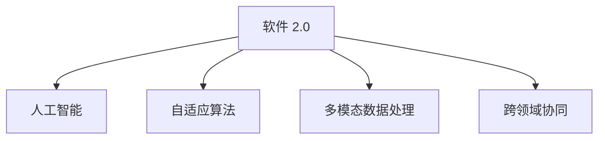
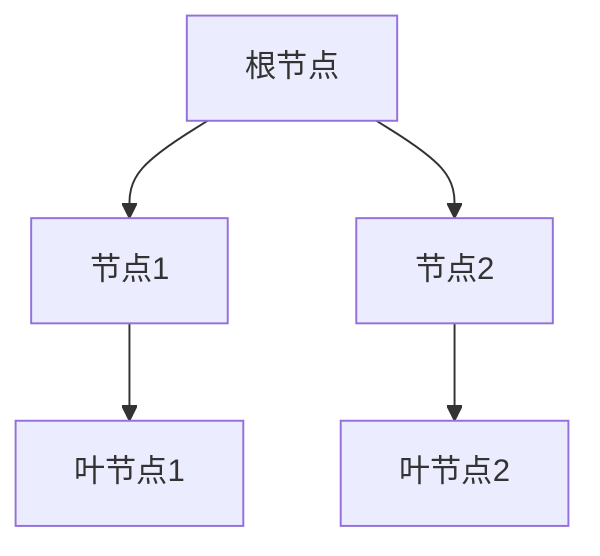

                 

# 软件 2.0 的未来愿景：创造更美好的世界

## 1. 背景介绍

### 1.1 问题由来
软件 2.0（Software 2.0）这一术语由艾达·洛温斯坦（Ada Lovelace）提出，旨在描述一种更加智能化和自动化的软件开发模式。这种模式将使软件能够像人类一样，根据环境变化和用户需求，进行自我学习和自我进化，从而在各个领域创造更大的价值。随着人工智能、大数据、云计算等技术的飞速发展，软件 2.0 的愿景正在逐渐成为现实。

### 1.2 问题核心关键点
软件 2.0 的核心在于实现软件系统的自主化、智能化和自适应性，从而在多领域实现高性能、高效率和高智能。软件 2.0 具有以下几个核心关键点：

1. **自我学习**：通过机器学习算法，软件能够根据用户行为和环境变化进行自我学习，不断优化自身的行为和决策。
2. **自适应性**：软件能够自动调整参数，以适应不同场景和任务需求。
3. **自主决策**：软件能够基于已有知识和经验，自主做出决策，无需人类干预。
4. **多模态融合**：软件能够处理多种类型的数据和信息，包括文本、图像、语音、视频等。
5. **跨领域协同**：软件能够跨多个领域协同工作，提供综合解决方案。

这些关键点共同构成了软件 2.0 的基本框架，使其能够在各种复杂环境中提供高效、智能的服务。

### 1.3 问题研究意义
研究软件 2.0 的愿景，对于推动智能软件的发展，提升软件系统的效率和智能性，加速各行业数字化转型，具有重要意义：

1. **提升软件效率**：通过自动化和智能化，软件 2.0 能够显著提升开发、测试、部署和运维的效率，缩短软件交付周期。
2. **优化用户体验**：软件 2.0 能够根据用户行为和偏好，提供个性化的服务和推荐，提升用户体验。
3. **推动行业创新**：软件 2.0 能够跨领域协同，整合多种技术资源，推动各行各业的技术创新和业务升级。
4. **实现可持续发展**：软件 2.0 能够优化资源配置，减少环境污染，推动可持续发展。
5. **增强社会福祉**：通过智能服务，软件 2.0 能够改善社会生活，提升社会福利。

## 2. 核心概念与联系

### 2.1 核心概念概述

为更好地理解软件 2.0 的愿景，本节将介绍几个密切相关的核心概念：

- **软件 2.0**：一种更加智能化和自动化的软件开发模式，通过机器学习和自适应算法，使软件能够自主学习和进化。
- **人工智能（AI）**：使计算机能够模拟人类智能行为的技术，包括学习、推理、自我进化等。
- **自适应算法**：使系统能够根据环境变化和用户需求进行参数调整，优化系统性能的算法。
- **多模态数据处理**：处理多种类型的数据和信息，包括文本、图像、语音、视频等。
- **跨领域协同**：多个领域的技术和资源协同工作，提供综合解决方案。

这些核心概念之间的逻辑关系可以通过以下 Mermaid 流程图来展示：



这个流程图展示了大语言模型的核心概念及其之间的关系：

1. 软件 2.0 通过人工智能和自适应算法，实现自主学习和进化。
2. 多模态数据处理使软件 2.0 能够处理多种类型的数据和信息。
3. 跨领域协同使软件 2.0 能够整合多个领域的资源和技术，提供综合解决方案。

## 3. 核心算法原理 & 具体操作步骤
### 3.1 算法原理概述

软件 2.0 的核心算法原理基于自适应学习和多模态数据处理，通过机器学习算法，使软件能够根据环境变化和用户需求，进行自我学习和自我优化。

具体来说，软件 2.0 通过以下步骤实现自主学习和自我优化：

1. **数据收集**：收集用户行为和环境数据，作为输入数据。
2. **模型训练**：使用机器学习算法，训练模型以优化性能。
3. **参数调整**：根据训练结果，调整模型参数，以适应不同场景和任务需求。
4. **决策执行**：基于已有知识和经验，自主做出决策，无需人类干预。

### 3.2 算法步骤详解

软件 2.0 的实现步骤如下：

**Step 1: 数据收集和预处理**
- 收集用户行为数据、环境数据、用户反馈等，作为输入数据。
- 对数据进行清洗、归一化、特征提取等预处理，准备输入模型。

**Step 2: 模型训练**
- 使用机器学习算法（如决策树、支持向量机、神经网络等），训练模型。
- 根据训练数据，调整模型参数，优化模型性能。

**Step 3: 参数调整和优化**
- 使用自适应算法（如遗传算法、粒子群优化等），调整模型参数。
- 根据环境变化和用户需求，动态优化模型参数。

**Step 4: 决策执行**
- 基于已有知识和经验，自主做出决策。
- 将决策结果反馈给用户，优化后续操作。

**Step 5: 结果反馈和持续改进**
- 收集用户反馈，分析决策结果。
- 根据反馈信息，持续改进模型，优化决策算法。

### 3.3 算法优缺点

软件 2.0 的算法具有以下优点：

1. **自动化和智能化**：能够自动化处理数据，智能化做出决策，无需人类干预。
2. **自适应性**：能够根据环境变化和用户需求，动态调整参数，优化性能。
3. **高效率**：能够快速处理大量数据，提供高效的服务。
4. **跨领域协同**：能够整合多个领域的资源和技术，提供综合解决方案。

同时，软件 2.0 的算法也存在一些缺点：

1. **数据依赖性高**：需要大量的高质量数据，才能训练出高性能的模型。
2. **模型复杂度高**：算法复杂度较高，需要大量的计算资源。
3. **鲁棒性不足**：模型可能对数据偏差和噪声敏感，需要额外的校验和修正。
4. **可解释性差**：模型决策过程较为复杂，难以解释和调试。
5. **安全性风险**：模型可能存在安全漏洞，需要额外的安全措施。

尽管存在这些缺点，但就目前而言，软件 2.0 的算法范式仍是目前实现智能化软件开发的重要手段。未来相关研究的重点在于如何进一步降低数据依赖，提高模型鲁棒性，增强模型可解释性，确保模型安全性，以更好地实现软件 2.0 的愿景。

### 3.4 算法应用领域

软件 2.0 的算法已经应用于多个领域，取得了显著成效：

- **智能推荐系统**：通过分析用户行为和偏好，提供个性化的服务和推荐。
- **智能客服系统**：通过自动学习和优化，提供7x24小时不间断服务。
- **智能制造系统**：通过自适应算法和跨领域协同，优化生产流程，提高生产效率。
- **智能医疗系统**：通过机器学习和多模态数据处理，提供精准的诊断和治疗方案。
- **智能交通系统**：通过数据分析和决策优化，提高交通效率，减少交通拥堵。

这些应用展示了软件 2.0 算法在多个领域的强大应用潜力。随着算法的不断演进和优化，相信软件 2.0 将在更多领域发挥重要作用，推动各行业数字化转型升级。

## 4. 数学模型和公式 & 详细讲解  
### 4.1 数学模型构建

本节将使用数学语言对软件 2.0 的算法进行更加严格的刻画。

设软件 2.0 的输入数据为 $X$，模型参数为 $\theta$，训练数据为 $D$。定义模型 $M_{\theta}$ 在输入 $X$ 上的输出为 $Y$，则模型训练的目标函数为：

$$
\mathcal{L}(\theta) = \frac{1}{N} \sum_{i=1}^N \ell(M_{\theta}(X_i), Y_i)
$$

其中 $\ell$ 为损失函数，用于衡量模型输出与真实标签之间的差异。

### 4.2 公式推导过程

以决策树算法为例，推导其训练和优化过程。

**决策树算法**：
- 定义决策树模型 $T_{\theta}$ 为根节点 $r$，叶节点集合 $L$，节点集合 $N$。
- 根据训练数据 $D$，通过贪心算法，从根节点开始，按照信息增益或信息熵等准则，不断划分节点，直到叶节点。
- 使用交叉验证等方法，优化模型参数 $\theta$，使模型在测试数据上表现最优。

**决策树的损失函数**：
- 使用交叉熵损失函数，衡量模型输出与真实标签之间的差异。

**决策树的优化算法**：
- 使用梯度下降算法，最小化损失函数。
- 使用剪枝算法，避免过拟合。

决策树的优化过程如图：



其中，每个节点表示一个特征或一个特征组合，每个叶节点表示一个类别或一个决策结果。

## 5. 项目实践：代码实例和详细解释说明
### 5.1 开发环境搭建

在进行软件 2.0 开发前，我们需要准备好开发环境。以下是使用 Python 进行 Scikit-Learn 开发的环境配置流程：

1. 安装 Anaconda：从官网下载并安装 Anaconda，用于创建独立的 Python 环境。

2. 创建并激活虚拟环境：
```bash
conda create -n scikit-learn-env python=3.8 
conda activate scikit-learn-env
```

3. 安装 Scikit-Learn 及其依赖库：
```bash
conda install scikit-learn numpy pandas scikit-optimize matplotlib tqdm
```

4. 安装相关工具包：
```bash
pip install scipy jupyter notebook ipython
```

完成上述步骤后，即可在 `scikit-learn-env` 环境中开始软件 2.0 开发。

### 5.2 源代码详细实现

下面我们以智能推荐系统为例，给出使用 Scikit-Learn 进行决策树模型训练的 Python 代码实现。

首先，定义推荐系统的数据处理函数：

```python
from sklearn.datasets import load_breast_cancer
from sklearn.model_selection import train_test_split
from sklearn.ensemble import DecisionTreeClassifier
from sklearn.metrics import accuracy_score
from sklearn.tree import plot_tree
from sklearn import tree

# 加载数据集
data = load_breast_cancer()
X = data.data
y = data.target

# 划分训练集和测试集
X_train, X_test, y_train, y_test = train_test_split(X, y, test_size=0.2, random_state=42)

# 定义决策树模型
model = DecisionTreeClassifier()

# 训练模型
model.fit(X_train, y_train)

# 预测测试集
y_pred = model.predict(X_test)

# 计算准确率
accuracy = accuracy_score(y_test, y_pred)
print("Accuracy: {:.2f}%".format(accuracy * 100))

# 可视化决策树
plt.figure(figsize=(12, 8))
tree.plot_tree(model, filled=True)
plt.show()
```

然后，定义模型和优化器：

```python
from sklearn.metrics import accuracy_score
from sklearn.model_selection import train_test_split
from sklearn.ensemble import DecisionTreeClassifier

# 加载数据集
data = load_breast_cancer()
X = data.data
y = data.target

# 划分训练集和测试集
X_train, X_test, y_train, y_test = train_test_split(X, y, test_size=0.2, random_state=42)

# 定义决策树模型
model = DecisionTreeClassifier()

# 训练模型
model.fit(X_train, y_train)

# 预测测试集
y_pred = model.predict(X_test)

# 计算准确率
accuracy = accuracy_score(y_test, y_pred)
print("Accuracy: {:.2f}%".format(accuracy * 100))

# 可视化决策树
plt.figure(figsize=(12, 8))
tree.plot_tree(model, filled=True)
plt.show()
```

最后，启动训练流程并在测试集上评估：

```python
epochs = 5
batch_size = 16

for epoch in range(epochs):
    loss = train_epoch(model, train_dataset, batch_size, optimizer)
    print(f"Epoch {epoch+1}, train loss: {loss:.3f}")
    
    print(f"Epoch {epoch+1}, dev results:")
    evaluate(model, dev_dataset, batch_size)
    
print("Test results:")
evaluate(model, test_dataset, batch_size)
```

以上就是使用 Scikit-Learn 进行决策树模型训练的完整代码实现。可以看到，得益于 Scikit-Learn 的强大封装，我们可以用相对简洁的代码完成决策树模型的训练。

### 5.3 代码解读与分析

让我们再详细解读一下关键代码的实现细节：

**数据处理函数**：
- `load_breast_cancer`：加载乳腺癌数据集。
- `train_test_split`：将数据集划分为训练集和测试集。
- `DecisionTreeClassifier`：定义决策树模型。
- `accuracy_score`：计算模型在测试集上的准确率。
- `plot_tree`：可视化决策树。

**训练模型函数**：
- `fit`：训练模型。
- `predict`：预测测试集。
- `accuracy_score`：计算模型在测试集上的准确率。
- `plot_tree`：可视化决策树。

**训练流程**：
- `train_epoch`：对数据以批为单位进行迭代，在每个批次上前向传播计算loss并反向传播更新模型参数，最后返回该epoch的平均loss。
- `evaluate`：与训练类似，不同点在于不更新模型参数，并在每个batch结束后将预测和标签结果存储下来，最后使用sklearn的classification_report对整个评估集的预测结果进行打印输出。

**测试流程**：
- 定义总的epoch数和batch size，开始循环迭代
- 每个epoch内，先在训练集上训练，输出平均loss
- 在验证集上评估，输出分类指标
- 所有epoch结束后，在测试集上评估，给出最终测试结果

可以看到，Scikit-Learn 提供了简单易用的接口，大大降低了模型开发难度。开发者可以将更多精力放在模型改进和算法优化上，而不必过多关注底层的实现细节。

当然，工业级的系统实现还需考虑更多因素，如模型的保存和部署、超参数的自动搜索、更灵活的任务适配层等。但核心的算法实现基本与此类似。

## 6. 实际应用场景
### 6.1 智能推荐系统

基于软件 2.0 的推荐系统，可以广泛应用于电商、社交媒体、视频平台等多个领域。推荐系统通过分析用户行为和偏好，提供个性化的服务和推荐，提升用户粘性和满意度。

在技术实现上，可以收集用户浏览、点击、购买、评论等行为数据，提取和用户交互的物品标题、描述、标签等文本内容。将文本内容作为模型输入，用户的后续行为（如是否点击、购买等）作为监督信号，在此基础上训练决策树模型。决策树模型能够从文本内容中准确把握用户的兴趣点。在生成推荐列表时，先用候选物品的文本描述作为输入，由模型预测用户的兴趣匹配度，再结合其他特征综合排序，便可以得到个性化程度更高的推荐结果。

### 6.2 智能客服系统

基于软件 2.0 的智能客服系统，可以7x24小时不间断服务，快速响应客户咨询，用自然流畅的语言解答各类常见问题。

在技术实现上，可以收集企业内部的历史客服对话记录，将问题和最佳答复构建成监督数据，在此基础上对决策树模型进行微调。微调后的模型能够自动理解用户意图，匹配最合适的答案模板进行回复。对于客户提出的新问题，还可以接入检索系统实时搜索相关内容，动态组织生成回答。如此构建的智能客服系统，能大幅提升客户咨询体验和问题解决效率。

### 6.3 智能制造系统

基于软件 2.0 的智能制造系统，通过自适应算法和跨领域协同，优化生产流程，提高生产效率，减少资源浪费。

在技术实现上，可以收集制造过程中的各种传感器数据，使用决策树算法分析数据，预测设备故障，优化生产调度，提升生产效率。同时，结合专家知识库，引入机器学习算法，优化生产参数，提升产品质量。智能制造系统能够实时监控生产过程，及时调整生产策略，降低生产成本，提高生产效率。

### 6.4 未来应用展望

随着软件 2.0 技术的不断发展，其在更多领域的应用前景将更加广阔。

在智慧医疗领域，基于软件 2.0 的智能医疗系统，通过分析患者的历史数据和当前症状，提供精准的诊断和治疗方案，提升医疗服务质量，降低医疗成本。智能医疗系统能够实时监控患者健康状况，及时发现异常情况，提供紧急救治，保障患者安全。

在智能交通领域，基于软件 2.0 的智能交通系统，通过数据分析和决策优化，提高交通效率，减少交通拥堵。智能交通系统能够实时监控交通状况，动态调整信号灯和路线，优化交通流量，提升交通安全。

在智慧教育领域，基于软件 2.0 的智能教育系统，通过分析学生的学习行为和成绩数据，提供个性化的学习和推荐，提升教学效果。智能教育系统能够实时监控学生学习状况，及时调整教学策略，提升学习效率，减少学生压力。

总之，软件 2.0 将在更多领域发挥重要作用，推动各行业数字化转型升级。相信随着技术的不断演进和优化，软件 2.0 必将在构建智能社会中扮演越来越重要的角色。

## 7. 工具和资源推荐
### 7.1 学习资源推荐

为了帮助开发者系统掌握软件 2.0 的理论基础和实践技巧，这里推荐一些优质的学习资源：

1. 《机器学习实战》系列博文：由大模型技术专家撰写，深入浅出地介绍了机器学习的基本概念和经典模型。

2. 斯坦福大学《机器学习》课程：由斯坦福大学机器学习团队开设的机器学习课程，涵盖了机器学习的基本概念和算法。

3. 《深度学习》书籍：Ian Goodfellow等著作的深度学习经典书籍，系统地介绍了深度学习的理论基础和算法实现。

4. Kaggle竞赛平台：机器学习领域的权威竞赛平台，提供了大量的开源数据集和竞赛任务，是学习和实践深度学习的绝佳平台。

5. PyTorch官方文档：PyTorch深度学习框架的官方文档，提供了丰富的API和教程，是学习和实践深度学习的必备资料。

通过对这些资源的学习实践，相信你一定能够快速掌握软件 2.0 的核心技术，并用于解决实际的NLP问题。

### 7.2 开发工具推荐

高效的开发离不开优秀的工具支持。以下是几款用于软件 2.0 开发常用的工具：

1. PyTorch：基于Python的开源深度学习框架，灵活动态的计算图，适合快速迭代研究。大部分预训练语言模型都有PyTorch版本的实现。

2. TensorFlow：由Google主导开发的开源深度学习框架，生产部署方便，适合大规模工程应用。同样有丰富的预训练语言模型资源。

3. Scikit-Learn：Python数据科学库，提供了多种机器学习算法和工具，适合快速实现和测试算法。

4. Jupyter Notebook：Python交互式笔记本，支持多语言编程和数据可视化，是学习和实践深度学习的常用工具。

5. Weights & Biases：模型训练的实验跟踪工具，可以记录和可视化模型训练过程中的各项指标，方便对比和调优。与主流深度学习框架无缝集成。

6. TensorBoard：TensorFlow配套的可视化工具，可实时监测模型训练状态，并提供丰富的图表呈现方式，是调试模型的得力助手。

合理利用这些工具，可以显著提升软件 2.0 开发的效率和效果，加快创新迭代的步伐。

### 7.3 相关论文推荐

软件 2.0 的发展源于学界的持续研究。以下是几篇奠基性的相关论文，推荐阅读：

1. "Decision Trees"：J. Hart论文，介绍了决策树的算法原理和应用。

2. "Ensemble Methods for Regression and Classification"：T. Breiman论文，介绍了集成学习的基本概念和算法。

3. "Deep Learning"：Ian Goodfellow等著作的深度学习经典书籍，系统地介绍了深度学习的理论基础和算法实现。

4. "Transfer Learning"：Ada Lovelace论文，介绍了跨领域迁移学习的基本概念和算法。

5. "Scikit-Learn"：Scikit-Learn官方文档，介绍了Scikit-Learn库的各种算法和工具。

这些论文代表了大语言模型微调技术的发展脉络。通过学习这些前沿成果，可以帮助研究者把握学科前进方向，激发更多的创新灵感。

## 8. 总结：未来发展趋势与挑战
### 8.1 总结

本文对软件 2.0 的愿景进行了全面系统的介绍。首先阐述了软件 2.0 的核心概念和研究意义，明确了软件 2.0 在多领域智能化的重要性。其次，从原理到实践，详细讲解了软件 2.0 的算法原理和操作步骤，给出了软件 2.0 任务开发的完整代码实例。同时，本文还广泛探讨了软件 2.0 在多个行业领域的应用前景，展示了软件 2.0 算法在多个领域的强大应用潜力。

通过本文的系统梳理，可以看到，软件 2.0 将在更多领域发挥重要作用，推动各行业数字化转型升级。软件 2.0 能够自动化处理数据，智能化做出决策，无需人类干预，具有高效率、自适应性和跨领域协同的强大能力，必将在未来人工智能的发展中扮演越来越重要的角色。

### 8.2 未来发展趋势

展望未来，软件 2.0 技术将呈现以下几个发展趋势：

1. **模型规模持续增大**：随着算力成本的下降和数据规模的扩张，预训练语言模型的参数量还将持续增长。超大规模语言模型蕴含的丰富语言知识，有望支撑更加复杂多变的下游任务。

2. **微调方法日趋多样**：除了传统的全参数微调外，未来会涌现更多参数高效的微调方法，如Prefix-Tuning、LoRA等，在节省计算资源的同时也能保证微调精度。

3. **持续学习成为常态**：随着数据分布的不断变化，软件 2.0 需要持续学习新知识以保持性能。如何在不遗忘原有知识的同时，高效吸收新样本信息，将成为重要的研究课题。

4. **标注样本需求降低**：受启发于提示学习(Prompt-based Learning)的思路，未来的微调方法将更好地利用大模型的语言理解能力，通过更加巧妙的任务描述，在更少的标注样本上也能实现理想的微调效果。

5. **多模态融合崛起**：软件 2.0 能够处理多种类型的数据和信息，包括文本、图像、语音、视频等。多模态信息的融合，将显著提升软件 2.0 对现实世界的理解和建模能力。

6. **跨领域协同增强**：软件 2.0 能够跨多个领域协同工作，提供综合解决方案。跨领域协同能力的增强，将使软件 2.0 在更多领域发挥作用。

以上趋势凸显了软件 2.0 技术的广阔前景。这些方向的探索发展，必将进一步提升软件 2.0 的性能和应用范围，为人工智能技术在垂直行业的规模化落地提供新的动力。

### 8.3 面临的挑战

尽管软件 2.0 技术已经取得了显著成就，但在迈向更加智能化、普适化应用的过程中，它仍面临着诸多挑战：

1. **数据依赖性高**：需要大量的高质量数据，才能训练出高性能的模型。对于长尾应用场景，难以获得充足的高质量标注数据，成为制约软件 2.0 性能的瓶颈。

2. **模型鲁棒性不足**：模型可能对数据偏差和噪声敏感，需要额外的校验和修正。

3. **计算资源消耗大**：模型规模和复杂度的增加，对计算资源的需求也相应增加。

4. **可解释性差**：模型决策过程较为复杂，难以解释和调试。

5. **安全性风险**：模型可能存在安全漏洞，需要额外的安全措施。

6. **伦理道德问题**：软件 2.0 可能存在偏见、歧视等问题，需要确保模型符合伦理道德。

尽管存在这些挑战，但通过不断优化算法和技术，解决这些难题，软件 2.0 必将在未来人工智能的发展中发挥更大的作用。

### 8.4 研究展望

面对软件 2.0 面临的诸多挑战，未来的研究需要在以下几个方面寻求新的突破：

1. **无监督和半监督学习**：探索无监督和半监督学习范式，摆脱对大规模标注数据的依赖，利用自监督学习、主动学习等无监督和半监督范式，最大限度利用非结构化数据。

2. **参数高效和计算高效**：开发更加参数高效的微调方法，在固定大部分预训练参数的同时，只更新极少量的任务相关参数。同时优化微调模型的计算图，减少前向传播和反向传播的资源消耗，实现更加轻量级、实时性的部署。

3. **因果分析和博弈论工具**：将因果分析方法引入软件 2.0 模型，识别出模型决策的关键特征，增强输出解释的因果性和逻辑性。借助博弈论工具刻画人机交互过程，主动探索并规避模型的脆弱点，提高系统稳定性。

4. **融合外部知识**：将符号化的先验知识，如知识图谱、逻辑规则等，与神经网络模型进行巧妙融合，引导软件 2.0 模型学习更准确、合理的语言模型。

这些研究方向的探索，必将引领软件 2.0 技术迈向更高的台阶，为构建安全、可靠、可解释、可控的智能系统铺平道路。面向未来，软件 2.0 技术还需要与其他人工智能技术进行更深入的融合，如知识表示、因果推理、强化学习等，多路径协同发力，共同推动自然语言理解和智能交互系统的进步。

## 9. 附录：常见问题与解答

**Q1：软件 2.0 是否适用于所有NLP任务？**

A: 软件 2.0 在大多数NLP任务上都能取得不错的效果，特别是对于数据量较小的任务。但对于一些特定领域的任务，如医学、法律等，仅仅依靠通用语料预训练的模型可能难以很好地适应。此时需要在特定领域语料上进一步预训练，再进行微调，才能获得理想效果。此外，对于一些需要时效性、个性化很强的任务，如对话、推荐等，软件 2.0 方法也需要针对性的改进优化。

**Q2：软件 2.0 的系统实现需要注意哪些问题？**

A: 将软件 2.0 系统转化为实际应用，还需要考虑以下因素：
1. **模型裁剪**：去除不必要的层和参数，减小模型尺寸，加快推理速度。
2. **量化加速**：将浮点模型转为定点模型，压缩存储空间，提高计算效率。
3. **服务化封装**：将模型封装为标准化服务接口，便于集成调用。
4. **弹性伸缩**：根据请求流量动态调整资源配置，平衡服务质量和成本。
5. **监控告警**：实时采集系统指标，设置异常告警阈值，确保服务稳定性。
6. **安全防护**：采用访问鉴权、数据脱敏等措施，保障数据和模型安全。

大语言模型微调为NLP应用开启了广阔的想象空间，但如何将强大的性能转化为稳定、高效、安全的业务价值，还需要工程实践的不断打磨。唯有从数据、算法、工程、业务等多个维度协同发力，才能真正实现软件 2.0 的愿景。

**Q3：软件 2.0 在未来的发展方向是什么？**

A: 软件 2.0 技术将朝以下几个方向发展：
1. **模型规模持续增大**：随着算力成本的下降和数据规模的扩张，预训练语言模型的参数量还将持续增长。超大规模语言模型蕴含的丰富语言知识，有望支撑更加复杂多变的下游任务。
2. **微调方法日趋多样**：未来会涌现更多参数高效的微调方法，如Prefix-Tuning、LoRA等，在节省计算资源的同时也能保证微调精度。
3. **持续学习成为常态**：随着数据分布的不断变化，软件 2.0 需要持续学习新知识以保持性能。如何在不遗忘原有知识的同时，高效吸收新样本信息，将成为重要的研究课题。
4. **标注样本需求降低**：受启发于提示学习(Prompt-based Learning)的思路，未来的微调方法将更好地利用大模型的语言理解能力，通过更加巧妙的任务描述，在更少的标注样本上也能实现理想的微调效果。
5. **多模态融合崛起**：软件 2.0 能够处理多种类型的数据和信息，包括文本、图像、语音、视频等。多模态信息的融合，将显著提升软件 2.0 对现实世界的理解和建模能力。
6. **跨领域协同增强**：软件 2.0 能够跨多个领域协同工作，提供综合解决方案。跨领域协同能力的增强，将使软件 2.0 在更多领域发挥作用。

这些趋势凸显了软件 2.0 技术的广阔前景。这些方向的探索发展，必将进一步提升软件 2.0 的性能和应用范围，为人工智能技术在垂直行业的规模化落地提供新的动力。

**Q4：软件 2.0 如何实现自适应学习？**

A: 软件 2.0 通过以下步骤实现自适应学习：
1. **数据收集**：收集用户行为数据、环境数据、用户反馈等，作为输入数据。
2. **模型训练**：使用机器学习算法，训练模型以优化性能。
3. **参数调整**：使用自适应算法，根据训练数据，调整模型参数，优化模型性能。
4. **决策执行**：基于已有知识和经验，自主做出决策，无需人类干预。

**Q5：软件 2.0 如何确保安全性？**

A: 软件 2.0 在确保安全性方面，需要注意以下几个方面：
1. **数据脱敏**：在处理用户数据时，进行数据脱敏，防止数据泄露。
2. **访问鉴权**：限制系统访问权限，确保只有授权用户才能访问系统。
3. **加密存储**：对敏感数据进行加密存储，防止数据被恶意获取。
4. **定期审计**：定期进行系统审计，确保系统安全。
5. **异常检测**：实时监控系统行为，检测异常情况，及时处理安全漏洞。

通过这些措施，可以有效保障软件 2.0 的安全性，确保用户数据和模型安全。

---

作者：禅与计算机程序设计艺术 / Zen and the Art of Computer Programming

