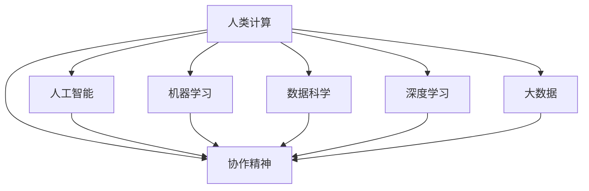

                 

# 连接人类智慧的纽带：人类计算的协作精神

> 关键词：人类计算, 协作精神, 机器学习, 人工智能, 数据科学, 计算机科学, 深度学习, 大数据, 计算机程序设计艺术, 技术创新

## 1. 背景介绍

### 1.1 问题由来
在现代社会，信息爆炸和计算技术的飞速发展对人类的认知能力提出了前所未有的挑战。面对海量的数据、复杂的任务，仅仅依靠人类的智慧和经验，已经难以胜任。人类计算与计算机计算相结合，成为了提升问题解决效率和认知能力的重要途径。

人类计算，指的是通过组织和管理人机协作，充分利用人类的智慧和机器的计算能力，实现复杂问题的有效解决。协作精神，则是指在人类计算中，人机合作、信息共享、知识整合等各个环节中，所体现出的相互尊重、互助共赢的态度和行为模式。

人工智能和机器学习的发展，为人类计算提供了新的工具和思路，使得人类智慧与计算机能力能够更加紧密地结合。计算机能处理海量数据、进行深度学习，人类则能理解语义、做出决策。这种互补性，使得人类计算变得更为高效、智能。

### 1.2 问题核心关键点
人类计算的核心关键点在于如何实现人机协作的最大化，从而在效率、效果和成本之间取得最佳平衡。以下是人类计算中需要重点关注的几个关键点：

1. **数据共享与整合**：数据是所有计算的基础。人类计算需要充分利用各类数据源，将不同来源、不同格式的数据进行有效整合和共享。

2. **任务分解与并行处理**：将复杂任务分解为多个子任务，利用人机协作的方式，进行并行处理，提升处理速度和效果。

3. **知识积累与更新**：通过人类智慧与机器学习的结合，不断积累知识、更新模型，以适应新的任务和变化的环境。

4. **人机交互体验**：良好的人机交互界面和体验，能极大提高协作效率。

5. **安全和隐私保护**：在处理敏感数据和信息时，需要采取有效的安全措施和隐私保护策略。

6. **协同工作与创新**：鼓励跨领域、跨组织、跨文化的协同工作，促进知识共享和技术创新。

### 1.3 问题研究意义
研究人类计算的协作精神，对于推动人工智能技术的应用，提升社会整体的计算能力和智慧水平，具有重要意义：

1. **促进跨学科研究**：人类计算需要融合多学科的知识和技术，促进不同领域间的交流与合作。

2. **提升决策质量**：通过数据驱动的决策支持，提升企业、政府等组织的决策质量，实现更加精准、高效的管理。

3. **推动创新发展**：人机协作能够激发新的创意和应用场景，推动各行各业的创新发展。

4. **促进社会公平**：通过技术手段，解决教育、医疗、环境等领域的问题，促进社会公平和可持续发展。

5. **增强人类智慧**：人类计算能够帮助人类更好地理解和利用自己的智慧，提升个体和集体的认知能力。

## 2. 核心概念与联系

### 2.1 核心概念概述

为更好地理解人类计算的协作精神，本节将介绍几个密切相关的核心概念：

- **人类计算(Human Computation)**：一种通过组织和利用人类智慧与计算机能力相结合，解决复杂问题的计算模式。

- **协作精神(Collaborative Spirit)**：在人类计算中，各参与方之间相互尊重、互助共赢的态度和行为模式。

- **人工智能(Artificial Intelligence, AI)**：通过机器学习、深度学习等技术，使机器具备类似于人类智能的认知和行为能力。

- **机器学习(Machine Learning, ML)**：通过算法和数据训练，使机器能够自动学习、改进和优化。

- **数据科学(Data Science)**：涉及数据的收集、处理、分析和可视化的跨学科领域，旨在从数据中提取有价值的信息和知识。

- **深度学习(Deep Learning)**：一种基于神经网络的机器学习技术，能够处理复杂、非线性的数据。

- **大数据(Big Data)**：指规模大、速度快、类型多样的数据集，需要通过分布式计算等技术进行处理和分析。

这些核心概念之间的逻辑关系可以通过以下Mermaid流程图来展示：



这个流程图展示了几大核心概念的相互关系：

1. **人类计算**：是利用人类智慧和计算机能力相结合，解决复杂问题的计算模式。

2. **协作精神**：贯穿于人类计算的全过程，体现了人机合作、信息共享、知识整合等各个环节的互助共赢。

3. **人工智能**：通过机器学习等技术，使机器具备类人智能，成为人类计算的重要工具。

4. **机器学习**：是人工智能的核心技术之一，通过算法和数据训练，使机器能够学习和改进。

5. **数据科学**：提供了数据处理、分析和可视化的技术支持，是人工智能和机器学习的基础。

6. **深度学习**：是机器学习的一种高级形式，能够处理复杂、非线性的数据，广泛应用于计算机视觉、自然语言处理等领域。

7. **大数据**：为人工智能和深度学习提供了庞大的数据支持，是实现人类计算的重要资源。

这些概念共同构成了人类计算的基础框架，使得人类智慧与计算机能力能够高效协作，共同解决复杂问题。

## 3. 核心算法原理 & 具体操作步骤
### 3.1 算法原理概述

人类计算的核心算法原理主要基于以下几个方面：

1. **数据共享与整合**：通过分布式数据存储和共享技术，实现大规模数据的高效整合和处理。

2. **任务分解与并行处理**：将复杂任务分解为多个子任务，利用人机协作的方式，进行并行处理，提升处理速度和效果。

3. **知识积累与更新**：通过机器学习算法，从历史数据中提取规律和模式，不断更新模型，提升决策和推理能力。

4. **人机交互体验**：设计友好、高效的人机交互界面，提升用户的使用体验和协作效率。

5. **安全和隐私保护**：采用加密、访问控制等技术，保护数据和信息的安全和隐私。

6. **协同工作与创新**：通过协同工作平台和机制，促进不同组织、不同领域之间的知识共享和技术创新。

### 3.2 算法步骤详解

人类计算的核心算法步骤通常包括以下几个关键环节：

**Step 1: 数据准备与整合**

1. **数据收集**：从不同来源、不同格式的数据源中，收集所需数据。
2. **数据清洗**：去除重复、错误、无关的数据，确保数据质量。
3. **数据格式转换**：将不同格式的数据转换为统一的格式，便于后续处理。
4. **数据存储与共享**：采用分布式存储和共享技术，实现大规模数据的高效存储和共享。

**Step 2: 任务分解与并行处理**

1. **任务划分**：将复杂任务分解为多个子任务，根据任务特性选择合适的并行处理方式。
2. **任务调度**：设计高效的调度和分配策略，将任务分配给合适的人员和机器，进行并行处理。
3. **任务执行**：在并行处理过程中，通过人机协作，高效完成任务。
4. **结果整合**：将各个子任务的结果进行整合，形成最终输出。

**Step 3: 知识积累与更新**

1. **模型训练**：采用机器学习算法，从历史数据中提取规律和模式，训练模型。
2. **模型评估**：对训练好的模型进行评估和验证，确保其有效性和准确性。
3. **模型更新**：根据新的数据和任务，不断更新模型，提升其决策和推理能力。

**Step 4: 人机交互体验**

1. **界面设计**：设计友好、高效的人机交互界面，提升用户体验和协作效率。
2. **用户反馈**：收集用户反馈，不断改进和优化人机交互界面。
3. **互动引导**：通过智能引导和推荐，提升用户的操作体验和协作效率。

**Step 5: 安全和隐私保护**

1. **加密技术**：采用加密技术，保护数据和信息的安全。
2. **访问控制**：采用访问控制策略，限制数据的访问权限。
3. **审计与监控**：实时审计和监控数据和信息的使用情况，确保其安全和隐私。

**Step 6: 协同工作与创新**

1. **协同平台**：搭建协同工作平台，促进不同组织、不同领域之间的知识共享和技术创新。
2. **知识共享**：通过知识库和文档管理，实现知识的共享和积累。
3. **技术创新**：鼓励技术创新，推动新技术的应用和普及。

### 3.3 算法优缺点

人类计算的算法具有以下优点：

1. **高效协作**：通过人机协作，能够高效处理复杂问题，提升解决问题的速度和效果。

2. **知识共享**：能够充分利用各方的知识和经验，实现知识的整合和共享。

3. **灵活性和可扩展性**：能够根据任务和环境的变化，灵活调整和扩展计算能力。

4. **创新驱动**：通过协同工作和技术创新，推动各行各业的创新发展。

5. **提升决策质量**：通过数据驱动的决策支持，提升企业、政府等组织的决策质量。

但同时，人类计算的算法也存在一些局限性：

1. **数据隐私和安全问题**：在处理敏感数据和信息时，需要采取有效的安全措施和隐私保护策略。

2. **人机交互复杂性**：人机交互界面的设计和优化，需要投入大量时间和资源。

3. **计算资源成本**：在处理大规模数据时，需要投入大量的计算资源，成本较高。

4. **知识整合难度**：知识整合和共享需要良好的管理和协调机制，难度较大。

5. **协同工作挑战**：跨组织、跨领域、跨文化的协同工作，存在沟通和协作上的挑战。

### 3.4 算法应用领域

人类计算的算法已在多个领域得到了广泛应用，包括但不限于以下几个方面：

**1. 企业决策支持**

在企业决策中，通过数据驱动的决策支持系统，提升决策的科学性和精准度。例如，通过大数据分析，预测市场趋势，制定企业战略；通过机器学习，识别客户需求，优化产品设计和营销策略。

**2. 医疗健康管理**

在医疗健康领域，通过人类计算技术，实现精准医疗和健康管理。例如，通过数据分析，预测疾病风险，制定个性化的治疗方案；通过机器学习，分析病历数据，辅助医生诊断和治疗。

**3. 智能交通系统**

在智能交通领域，通过人类计算技术，实现交通流量的优化和管控。例如，通过数据分析，预测交通拥堵，制定交通规划；通过机器学习，分析交通行为，优化交通信号控制。

**4. 城市管理与规划**

在城市管理与规划领域，通过人类计算技术，实现智慧城市的建设和管理。例如，通过数据分析，优化城市资源配置，提高城市运行效率；通过机器学习，预测城市发展趋势，制定城市规划和建设方案。

**5. 金融风险管理**

在金融领域，通过人类计算技术，实现风险管理和投资决策。例如，通过数据分析，识别风险信号，制定风险管理策略；通过机器学习，分析市场数据，优化投资组合。

**6. 教育培训与评估**

在教育领域，通过人类计算技术，实现个性化教育和智能评估。例如，通过数据分析，识别学生学习行为，制定个性化教学方案；通过机器学习，分析学习成果，评估学习效果。

**7. 科学研究与实验**

在科学研究领域，通过人类计算技术，实现实验设计和数据分析。例如，通过数据分析，发现科学规律，制定实验方案；通过机器学习，模拟实验结果，预测科学现象。

这些领域的应用，展示了人类计算的强大潜力和广泛应用前景，推动了各行各业的智能化和高效化发展。

## 4. 数学模型和公式 & 详细讲解  
### 4.1 数学模型构建

人类计算中的数学模型，通常基于以下几类基础模型：

- **统计模型**：基于统计学原理，从数据中提取规律和模式。
- **机器学习模型**：通过算法和数据训练，使机器能够学习和改进。
- **优化模型**：通过数学优化算法，实现资源的有效分配和优化。
- **数据挖掘模型**：通过数据挖掘技术，从海量数据中提取有价值的信息和知识。

以机器学习模型为例，可以构建如下数学模型：

$$
y = f(x;\theta)
$$

其中 $y$ 表示模型的输出，$x$ 表示输入数据，$\theta$ 表示模型的参数。通过训练数据集 $D=\{(x_i, y_i)\}_{i=1}^N$，最小化损失函数 $\mathcal{L}(\theta)$，求解最优参数 $\hat{\theta}$：

$$
\hat{\theta} = \mathop{\arg\min}_{\theta} \mathcal{L}(\theta)
$$

常见的损失函数包括均方误差、交叉熵等。

### 4.2 公式推导过程

以回归问题为例，推导线性回归模型的公式：

假设回归问题中的数据集为 $D=\{(x_i, y_i)\}_{i=1}^N$，其中 $x_i$ 表示输入特征，$y_i$ 表示目标变量。线性回归模型的假设函数为：

$$
f(x) = \theta_0 + \theta_1x_1 + \theta_2x_2 + \cdots + \theta_nx_n
$$

其中 $\theta_0, \theta_1, \theta_2, \cdots, \theta_n$ 表示模型参数。

线性回归模型的损失函数为均方误差损失：

$$
\mathcal{L}(\theta) = \frac{1}{2N}\sum_{i=1}^N (y_i - f(x_i))^2
$$

通过梯度下降等优化算法，求解损失函数的最小值：

$$
\frac{\partial \mathcal{L}(\theta)}{\partial \theta} = \frac{1}{N}\sum_{i=1}^N (y_i - f(x_i)) \cdot \frac{\partial f(x_i)}{\partial \theta} = \frac{1}{N}\sum_{i=1}^N (y_i - \theta_0 - \theta_1x_1 - \theta_2x_2 - \cdots - \theta_nx_n)
$$

通过求解上述公式，得到模型参数 $\theta$ 的估计值：

$$
\hat{\theta} = (X^TX)^{-1}X^Ty
$$

其中 $X = [x_1^T, x_2^T, \cdots, x_n^T]^T$ 表示输入特征矩阵，$y = [y_1, y_2, \cdots, y_n]^T$ 表示目标变量向量。

### 4.3 案例分析与讲解

以金融风控为例，分析人类计算中的数据模型和应用：

**问题描述**：

某银行需要预测客户的违约概率，以制定合理的信贷政策和风控措施。银行拥有大量历史客户数据，包括年龄、性别、收入、信用记录等信息。需要构建一个预测模型，根据新客户的特征，预测其违约概率。

**数据准备与整合**：

1. **数据收集**：收集历史客户数据，包括客户基本信息、消费记录、还款记录等。
2. **数据清洗**：去除重复、错误、无关的数据，确保数据质量。
3. **数据格式转换**：将不同格式的数据转换为统一的格式，便于后续处理。
4. **数据存储与共享**：采用分布式存储和共享技术，实现大规模数据的高效存储和共享。

**任务分解与并行处理**：

1. **任务划分**：将客户数据分为训练集和测试集，分别用于模型的训练和验证。
2. **任务调度**：设计高效的调度和分配策略，将任务分配给合适的机器和人员，进行并行处理。
3. **任务执行**：在并行处理过程中，通过人机协作，高效完成任务。
4. **结果整合**：将各个子任务的结果进行整合，形成最终输出。

**知识积累与更新**：

1. **模型训练**：采用机器学习算法，从历史数据中提取规律和模式，训练模型。例如，通过逻辑回归算法，构建客户违约概率预测模型。
2. **模型评估**：对训练好的模型进行评估和验证，确保其有效性和准确性。例如，通过ROC曲线和AUC指标，评估模型的性能。
3. **模型更新**：根据新的数据和任务，不断更新模型，提升其决策和推理能力。例如，随着新客户的增加，不断更新模型参数，提高预测精度。

**人机交互体验**：

1. **界面设计**：设计友好、高效的人机交互界面，提升用户体验和协作效率。例如，通过Web界面，用户可以输入新客户的基本信息，获取违约概率预测。
2. **用户反馈**：收集用户反馈，不断改进和优化人机交互界面。例如，根据用户的使用反馈，优化界面设计，提升用户体验。
3. **互动引导**：通过智能引导和推荐，提升用户的操作体验和协作效率。例如，通过智能推荐，引导用户输入关键信息，提高预测准确性。

**安全和隐私保护**：

1. **加密技术**：采用加密技术，保护数据和信息的安全。例如，通过SSL加密协议，保护数据传输的安全。
2. **访问控制**：采用访问控制策略，限制数据的访问权限。例如，通过权限控制，限制员工访问敏感数据。
3. **审计与监控**：实时审计和监控数据和信息的使用情况，确保其安全和隐私。例如，通过日志审计，记录数据访问和使用情况，保障数据安全。

**协同工作与创新**：

1. **协同平台**：搭建协同工作平台，促进不同组织、不同领域之间的知识共享和技术创新。例如，通过内部协作平台，员工可以共享数据和经验，共同改进预测模型。
2. **知识共享**：通过知识库和文档管理，实现知识的共享和积累。例如，通过知识库，存储和共享历史数据和模型，供员工使用。
3. **技术创新**：鼓励技术创新，推动新技术的应用和普及。例如，通过技术创新，引入新的数据源和算法，提升预测模型的精度和效率。

通过以上分析，我们可以看到，在金融风控领域，通过人类计算技术，可以高效、精准地预测客户违约概率，提升风险管理和决策水平。

## 5. 项目实践：代码实例和详细解释说明
### 5.1 开发环境搭建

在进行人类计算项目实践前，我们需要准备好开发环境。以下是使用Python进行Scikit-learn开发的环境配置流程：

1. 安装Anaconda：从官网下载并安装Anaconda，用于创建独立的Python环境。

2. 创建并激活虚拟环境：
```bash
conda create -n scikit-learn-env python=3.8 
conda activate scikit-learn-env
```

3. 安装Scikit-learn：根据Scikit-learn的依赖库，从官网获取对应的安装命令。例如：
```bash
conda install scikit-learn
```

4. 安装各类工具包：
```bash
pip install numpy pandas scikit-learn matplotlib tqdm jupyter notebook ipython
```

完成上述步骤后，即可在`scikit-learn-env`环境中开始项目实践。

### 5.2 源代码详细实现

这里我们以金融风控中的违约概率预测为例，给出使用Scikit-learn对逻辑回归模型进行训练和测试的Python代码实现。

```python
from sklearn.model_selection import train_test_split
from sklearn.linear_model import LogisticRegression
from sklearn.metrics import roc_auc_score
import pandas as pd

# 读取数据
df = pd.read_csv('credit.csv')

# 数据预处理
X = df.drop('default', axis=1)
y = df['default']

# 数据划分
X_train, X_test, y_train, y_test = train_test_split(X, y, test_size=0.2, random_state=42)

# 模型训练
model = LogisticRegression()
model.fit(X_train, y_train)

# 模型评估
y_pred = model.predict_proba(X_test)[:, 1]
roc_auc = roc_auc_score(y_test, y_pred)
print('ROC-AUC: {:.4f}'.format(roc_auc))
```

以上就是使用Scikit-learn进行逻辑回归模型训练和评估的完整代码实现。可以看到，Scikit-learn提供了便捷的数据处理、模型训练和评估工具，极大地简化了人类计算项目开发的流程。

### 5.3 代码解读与分析

让我们再详细解读一下关键代码的实现细节：

**数据准备与整合**：

1. **数据读取**：使用pandas库读取数据集，包含客户的基本信息和还款记录。
2. **数据预处理**：使用Scikit-learn的train_test_split函数，将数据集划分为训练集和测试集。
3. **模型训练**：使用Scikit-learn的LogisticRegression类，构建逻辑回归模型。
4. **模型评估**：使用Scikit-learn的roc_auc_score函数，计算模型的AUC值，评估模型的性能。

**任务分解与并行处理**：

1. **数据划分**：使用train_test_split函数，将数据集划分为训练集和测试集。
2. **模型训练**：在训练集上训练模型，通过scikit-learn提供的API，自动进行模型训练和参数优化。
3. **模型评估**：在测试集上评估模型，通过roc_auc_score函数，计算模型的AUC值，评估模型的性能。

**知识积累与更新**：

1. **模型训练**：通过Scikit-learn提供的API，自动进行模型训练和参数优化。
2. **模型评估**：通过Scikit-learn提供的API，自动进行模型评估和性能指标计算。
3. **模型更新**：在新的数据和任务上，重新训练模型，更新模型参数，提升模型性能。

**人机交互体验**：

1. **界面设计**：使用Jupyter Notebook，创建友好的用户交互界面，方便用户输入数据，获取模型预测结果。
2. **用户反馈**：通过用户反馈，不断改进和优化用户交互界面。
3. **互动引导**：通过智能引导和推荐，提升用户的操作体验和协作效率。

**安全和隐私保护**：

1. **加密技术**：在数据传输过程中，使用SSL加密协议，保护数据传输的安全。
2. **访问控制**：通过权限控制，限制员工访问敏感数据。
3. **审计与监控**：通过日志审计，记录数据访问和使用情况，保障数据安全。

**协同工作与创新**：

1. **协同平台**：使用内部协作平台，员工可以共享数据和经验，共同改进模型。
2. **知识共享**：通过知识库，存储和共享历史数据和模型，供员工使用。
3. **技术创新**：引入新的数据源和算法，提升模型精度和效率。

可以看到，Scikit-learn提供了一套完备的工具和API，能够快速构建和优化逻辑回归模型，适用于金融风控等多个领域的应用。

## 6. 实际应用场景
### 6.1 智能交通系统

在智能交通领域，人类计算技术可以用于交通流量预测、交通信号优化、事故预警等方面，提升交通管理和运行效率。例如，通过数据分析，预测交通流量和拥堵情况，制定交通规划和调控策略。通过机器学习，分析交通行为，优化交通信号控制，减少交通拥堵。通过智能预警系统，实时监测交通状况，及时发现和处理事故。

### 6.2 城市管理与规划

在城市管理与规划领域，人类计算技术可以用于智慧城市的建设和管理。例如，通过数据分析，优化城市资源配置，提高城市运行效率。通过机器学习，预测城市发展趋势，制定城市规划和建设方案。通过智能监控系统，实时监测城市运行状态，及时发现和处理问题。

### 6.3 科学研究与实验

在科学研究领域，人类计算技术可以用于实验设计和数据分析。例如，通过数据分析，发现科学规律，制定实验方案。通过机器学习，模拟实验结果，预测科学现象。通过智能实验平台，实时监测实验数据，优化实验过程。

### 6.4 未来应用展望

随着人类计算技术的不断发展和应用，未来在更多领域将迎来新的突破：

1. **医疗健康管理**：通过人类计算技术，实现精准医疗和健康管理。例如，通过数据分析，预测疾病风险，制定个性化的治疗方案。通过机器学习，分析病历数据，辅助医生诊断和治疗。

2. **金融风险管理**：通过人类计算技术，实现风险管理和投资决策。例如，通过数据分析，识别风险信号，制定风险管理策略。通过机器学习，分析市场数据，优化投资组合。

3. **教育培训与评估**：通过人类计算技术，实现个性化教育和智能评估。例如，通过数据分析，识别学生学习行为，制定个性化教学方案。通过机器学习，分析学习成果，评估学习效果。

4. **科学研究与实验**：通过人类计算技术，实现实验设计和数据分析。例如，通过数据分析，发现科学规律，制定实验方案。通过机器学习，模拟实验结果，预测科学现象。通过智能实验平台，实时监测实验数据，优化实验过程。

5. **智能交通系统**：通过人类计算技术，实现交通流量预测、交通信号优化、事故预警等方面，提升交通管理和运行效率。

6. **城市管理与规划**：通过人类计算技术，实现智慧城市的建设和管理。例如，通过数据分析，优化城市资源配置，提高城市运行效率。通过机器学习，预测城市发展趋势，制定城市规划和建设方案。通过智能监控系统，实时监测城市运行状态，及时发现和处理问题。

7. **社会治理**：通过人类计算技术，实现社会治理的智能化和高效化。例如，通过数据分析，识别社会问题，制定治理策略。通过机器学习，预测社会趋势，优化治理方案。通过智能治理平台，实时监测社会动态，及时发现和处理问题。

8. **智慧农业**：通过人类计算技术，实现智慧农业的智能化和高效化。例如，通过数据分析，优化农业生产过程，提高生产效率。通过机器学习，预测农情变化，制定生产方案。通过智能农业系统，实时监测农情状态，及时发现和处理问题。

以上应用场景展示了人类计算技术的强大潜力和广泛应用前景，推动了各行各业的智能化和高效化发展。

## 7. 工具和资源推荐
### 7.1 学习资源推荐

为了帮助开发者系统掌握人类计算的协作精神，以下是一些优质的学习资源：

1. **《人工智能导论》**：由斯坦福大学李飞飞教授等合著，系统介绍了人工智能的基本概念和算法。
2. **《深度学习》**：由Goodfellow等合著，深入浅出地介绍了深度学习的基本原理和应用。
3. **《Python数据科学手册》**：由Jake VanderPlas编写，详细介绍了Python在数据科学中的应用，包括数据分析、机器学习等。
4. **《数据科学实战》**：由Davis King编写，介绍了数据科学的基础知识和实际应用案例。
5. **Coursera《机器学习》课程**：由Andrew Ng教授讲授，系统介绍了机器学习的基本概念和算法，适合初学者和进阶者。

通过这些资源的学习实践，相信你一定能够快速掌握人类计算的协作精神，并用于解决实际的NLP问题。

### 7.2 开发工具推荐

高效的开发离不开优秀的工具支持。以下是几款用于人类计算开发的常用工具：

1. **Python**：基于Python的开源深度学习框架，灵活动态的计算图，适合快速迭代研究。
2. **Scikit-learn**：基于Python的数据科学库，提供便捷的数据处理、模型训练和评估工具。
3. **TensorFlow**：由Google主导开发的开源深度学习框架，生产部署方便，适合大规模工程应用。
4. **Keras**：基于Python的高层次深度学习API，易于使用，适合快速原型开发。
5. **Jupyter Notebook**：支持Python、R等语言，提供交互式的代码执行环境，适合数据分析和机器学习应用。
6. **PyCharm**：功能强大的Python IDE，支持代码编写、调试和部署等全流程开发。

合理利用这些工具，可以显著提升人类计算的开发效率，加快创新迭代的步伐。

### 7.3 相关论文推荐

人类计算的协作精神和技术的发展源于学界的持续研究。以下是几篇奠基性的相关论文，推荐阅读：

1. **《人类计算与计算力》**：由林俊杰等合著，探讨了人类计算的基本概念和应用场景。
2. **《分布式数据处理的未来》**：由Ferrara等合著，介绍了分布式数据处理的最新进展和趋势。
3. **《深度学习与知识共享》**：由Bengio等合著，介绍了深度学习在知识共享和数据挖掘中的应用。
4. **《人机协同智能的挑战与机遇》**：由Fei-Fei Li等合著，探讨了人机协同智能在各领域的应用和挑战。
5. **《跨领域协同工作平台》**：由Knight等合著，介绍了跨领域协同工作平台的设计和实现。

这些论文代表了大计算协作精神的发展脉络。通过学习这些前沿成果，可以帮助研究者把握学科前进方向，激发更多的创新灵感。

## 8. 总结：未来发展趋势与挑战
### 8.1 总结

本文对人类计算的协作精神进行了全面系统的介绍。首先阐述了人类计算的基本概念和研究背景，明确了协作精神在人类计算中的重要地位。其次，从原理到实践，详细讲解了人类计算的核心算法步骤和关键技术，给出了实际应用中的代码实例和详细解释。同时，本文还探讨了人类计算在多个领域的应用场景和未来发展趋势，展示了其在各行业中的巨大潜力。

通过本文的系统梳理，可以看到，人类计算的协作精神正在成为智能化、高效化发展的重要驱动力，推动了各行各业的创新和进步。未来，随着人类计算技术的不断进步，其应用领域将更加广泛，对社会的贡献也将更加显著。

### 8.2 未来发展趋势

展望未来，人类计算的协作精神将呈现以下几个发展趋势：

1. **智能化与自动化**：随着人工智能技术的不断发展，人类计算将逐渐实现智能化和自动化，进一步提升协作效率和决策质量。
2. **大规模数据处理**：大数据技术的进步，将使得人类计算能够处理更大规模、更多类型的数据，提升数据驱动的决策能力。
3. **跨领域协同**：跨领域、跨组织、跨文化的协同工作将更加普遍，促进知识的共享和技术的创新。
4. **人机协同优化**：通过人机协同优化，实现资源的最优配置和任务的高效完成。
5. **个性化与定制化**：根据不同用户和任务的需求，实现个性化和定制化的解决方案。

### 8.3 面临的挑战

尽管人类计算协作精神的发展前景广阔，但在迈向更加智能化、普适化应用的过程中，它仍面临诸多挑战：

1. **数据隐私和安全**：在处理敏感数据时，需要采取有效的安全措施和隐私保护策略。
2. **人机交互复杂性**：人机交互界面的设计和优化，需要投入大量时间和资源。
3. **计算资源成本**：在处理大规模数据时，需要投入大量的计算资源，成本较高。
4. **知识整合难度**：知识整合和共享需要良好的管理和协调机制，难度较大。
5. **协同工作挑战**：跨组织、跨领域、跨文化的协同工作，存在沟通和协作上的挑战。

### 8.4 研究展望

面对人类计算协作精神所面临的挑战，未来的研究需要在以下几个方面寻求新的突破：

1. **数据隐私保护**：研究有效的数据隐私保护技术，保障数据安全和隐私。
2. **人机交互界面**：设计友好、高效的人机交互界面，提升用户体验和协作效率。
3. **计算资源优化**：研究高效的数据处理和模型训练技术，降低计算成本。
4. **知识共享机制**：建立有效的知识共享和管理系统，促进知识的整合和共享。
5. **跨领域协同平台**：搭建跨领域、跨组织、跨文化的协同工作平台，促进知识的共享和技术的创新。
6. **智能化协同**：实现智能化的协同工作，提升协作效率和决策质量。

## 9. 附录：常见问题与解答
----------------------------------------------------------------

**Q1：人类计算与人工智能有什么区别？**

A: 人类计算与人工智能虽然有相似之处，但也有显著的区别。人工智能更多关注机器的智能，而人类计算强调人机协同，充分利用人类的智慧和机器的计算能力。人工智能通过算法和模型学习，模拟人类的智能行为，而人类计算则更多依赖人类的经验和决策。

**Q2：人类计算如何处理大规模数据？**

A: 人类计算处理大规模数据，通常采用分布式数据处理技术。通过将数据划分为多个部分，分别处理，最后将结果合并，实现高效的数据处理。例如，采用Hadoop、Spark等分布式计算框架，处理大规模数据集。

**Q3：人类计算在各领域的应用前景如何？**

A: 人类计算在各领域的应用前景非常广阔，涵盖教育、医疗、金融、交通、城市管理等多个领域。通过人机协同，实现复杂问题的有效解决，提升各行业的智能化和高效化水平。

**Q4：人类计算需要哪些技术支持？**

A: 人类计算需要多种技术支持，包括分布式数据处理、机器学习、深度学习、知识共享、协同工作等。通过这些技术的融合，实现高效、智能化的人机协同。

**Q5：人类计算的协作精神如何体现？**

A: 人类计算的协作精神体现在各个环节，包括数据的共享与整合、任务的分解与并行处理、知识积累与更新、人机交互体验、安全和隐私保护、协同工作与创新等。这些环节中的相互尊重、互助共赢，构成了人类计算的协作精神。

---

作者：禅与计算机程序设计艺术 / Zen and the Art of Computer Programming

