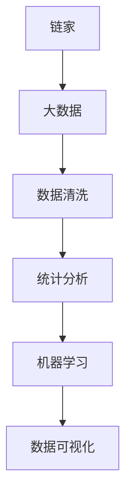

                 

# 链家二手房数据分析与可视化

## 1. 背景介绍

### 1.1 问题由来

链家（Anjuke.com）是中国领先的数字房产平台，拥有海量二手房数据。如何从中挖掘出有价值的信息，对于房产中介公司来说至关重要。链家通过不断提升数据处理能力，旨在为买家、卖家提供更加精准的匹配服务。其中，数据分析和可视化是提升用户体验的重要环节，直接决定了用户是否能够快速找到心仪的房源。

### 1.2 问题核心关键点

链家二手房数据分析的核心关键点主要包括以下几个方面：

- 数据收集：链家庞大的房源信息数据，主要来源于房产中介、在线用户提交以及第三方数据提供商。这些数据通常以CSV或JSON等格式保存。
- 数据预处理：清洗数据中的缺失值、异常值，进行归一化、标准化等处理，构建适用于后续分析的数据集。
- 数据分析：通过统计分析、机器学习等方法，从数据中提取规律和模式，发现不同房产特征与销售价格、地理位置等之间的关系。
- 数据可视化：将分析结果以图表形式展示，直观呈现信息，帮助决策者理解市场动态和趋势。

链家二手房数据分析的目的是为房地产经纪人和潜在买家提供支持，提高房产交易的效率和成功率。数据分析可以帮助用户从大量数据中提取出有用的信息，优化定价策略，提升房源曝光率。

### 1.3 问题研究意义

链家二手房数据分析研究具有以下重要意义：

1. **提高决策准确性**：基于数据分析的决策通常比直觉更为准确。数据可以消除主观偏见，降低决策风险。
2. **优化资源配置**：分析二手房源的价格分布、地理位置、面积等因素，可以合理配置房源，提升资源利用效率。
3. **提升用户体验**：通过可视化工具展示分析结果，用户可以更直观地理解数据，快速找到满意的房源。
4. **增强竞争力**：链家二手房数据分析可以为其提供竞争优势，帮助其更好地了解市场动态，预测价格趋势，优化运营策略。

## 2. 核心概念与联系

### 2.1 核心概念概述

为更好地理解链家二手房数据分析的过程，本节将介绍几个关键概念：

- **链家**：中国领先的房产在线交易平台，提供二手房、租房、新房等房产服务。
- **大数据**：以PB级别的数据集为特点，应用于各种数据分析和处理任务。
- **数据清洗**：数据预处理中的重要环节，通过删除、修改、填充缺失值等手段，构建高质量的数据集。
- **统计分析**：基于统计学方法对数据进行描述、推断和预测，如均值、标准差、回归分析等。
- **机器学习**：通过构建模型对数据进行拟合和预测，如线性回归、决策树、随机森林等。
- **数据可视化**：利用图表、地图等工具将数据转换为直观信息，便于理解和决策。

这些概念之间的逻辑关系可以通过以下Mermaid流程图来展示：



这个流程图展示了大数据在链家二手房数据分析中的流程：

1. 链家拥有海量房源数据，这些数据构成大数据集。
2. 数据清洗是数据预处理的环节，构建高质量的数据集。
3. 基于清洗好的数据集，链家进行统计分析和机器学习，提取有用信息。
4. 最终，通过数据可视化，用户可以直观理解分析结果。

## 3. 核心算法原理 & 具体操作步骤
### 3.1 算法原理概述

链家二手房数据分析的核心算法原理主要基于统计分析和机器学习。以下是基本的算法原理概述：

1. **统计分析**：通过均值、标准差、回归分析等方法，计算数据集中各属性的统计特征，如平均价格、中位数、相关性等。
2. **机器学习**：利用回归、分类等算法对数据进行拟合和预测，如线性回归、逻辑回归、决策树等。
3. **数据可视化**：通过Matplotlib、Seaborn、D3.js等工具，将分析结果转化为可视化图表。

链家二手房数据分析主要包括以下几个步骤：

- **数据收集**：从链家平台、第三方数据提供商等渠道收集数据。
- **数据清洗**：处理缺失值、异常值，进行归一化、标准化等处理。
- **特征工程**：构建和选择模型输入特征，如房屋面积、楼层、位置等。
- **模型训练**：使用统计分析和机器学习算法，训练模型进行预测和分类。
- **结果可视化**：将模型结果转化为图表，直观展示分析结果。

### 3.2 算法步骤详解

**Step 1: 数据收集**

链家二手房数据分析的数据收集主要包括以下步骤：

- 从链家平台API接口获取房源信息，包括房源位置、面积、价格等。
- 从第三方数据提供商获取如政府统计局、房产评估公司的数据，如城市人口密度、交通便利度等。
- 整合不同来源的数据，构建统一的数据集。

**Step 2: 数据清洗**

数据清洗的主要任务是去除噪声数据和处理缺失值。以下是具体步骤：

- 去除重复数据：使用去重操作，避免数据冗余。
- 处理缺失值：填充缺失值，如均值填充、中值填充、插值法等。
- 异常值处理：使用统计方法，如箱线图、标准差等，识别并处理异常值。
- 数据归一化：对数据进行归一化处理，如标准化、最小-最大归一化等。

**Step 3: 特征工程**

特征工程是构建和选择模型输入特征的过程。以下是具体步骤：

- 特征提取：从原始数据中提取特征，如房屋面积、楼层、地理位置等。
- 特征选择：通过统计分析、领域知识等方法，选择对预测目标影响最大的特征。
- 特征转换：对特征进行转换，如对数变换、归一化等。

**Step 4: 模型训练**

模型训练是数据分析的核心步骤。以下是具体步骤：

- 选择合适的算法：根据任务类型，选择线性回归、决策树、随机森林等算法。
- 分割数据集：将数据集分割为训练集、验证集和测试集。
- 模型训练：使用训练集对模型进行训练，调整模型参数。
- 模型评估：在验证集上评估模型性能，选择最优模型。

**Step 5: 结果可视化**

结果可视化是将分析结果转化为直观图表的过程。以下是具体步骤：

- 选择合适的可视化工具：如Matplotlib、Seaborn、Tableau等。
- 制作图表：根据分析结果，制作统计图、热力图、散点图等。
- 展示结果：将图表展示给决策者，帮助其理解市场动态和趋势。

### 3.3 算法优缺点

链家二手房数据分析的主要优点包括：

- **高效性**：数据清洗和特征工程等预处理步骤，减少了数据冗余和噪声，提高了分析效率。
- **准确性**：统计分析和机器学习算法可以提取有用的信息，提高预测准确性。
- **可解释性**：可视化结果直观易懂，便于理解分析结果。

主要缺点包括：

- **数据隐私**：链家二手房数据涉及大量个人信息，处理过程中需要严格保护隐私。
- **数据质量**：数据质量受限于数据收集和处理过程，可能存在噪声和不一致性。
- **算法局限性**：不同算法在处理某些特定数据时可能效果有限，需综合考虑多种算法。

### 3.4 算法应用领域

链家二手房数据分析主要应用于以下几个领域：

- **房源定价优化**：分析不同房产特征对价格的影响，优化房源定价策略。
- **用户行为分析**：分析用户浏览、询问等行为，提升用户体验。
- **市场趋势预测**：基于历史数据，预测房地产市场趋势，指导业务决策。
- **运营策略优化**：分析房源地理位置、交通便利度等，优化房源布局和市场推广策略。

## 4. 数学模型和公式 & 详细讲解 & 举例说明

### 4.1 数学模型构建

链家二手房数据分析的主要数学模型包括线性回归模型和决策树模型。以下是详细的数学模型构建：

**线性回归模型**：

$$
\hat{y} = \beta_0 + \beta_1x_1 + \beta_2x_2 + ... + \beta_nx_n + \epsilon
$$

其中 $\hat{y}$ 为预测值，$x_i$ 为特征变量，$\beta_i$ 为模型参数，$\epsilon$ 为误差项。

**决策树模型**：

$$
T = T_1 \cup T_2
$$

其中 $T$ 为决策树，$T_1$ 和 $T_2$ 为子树。每个叶子节点对应一个预测结果。

### 4.2 公式推导过程

**线性回归模型**：

- 假设数据集为 $D = \{(x_1,y_1),(x_2,y_2),...(x_n,y_n)\}$，其中 $x_i$ 为特征向量，$y_i$ 为目标变量。
- 最小二乘法求解模型参数 $\beta_0, \beta_1,...,\beta_n$。
- 使用均方误差（MSE）作为损失函数，优化目标为：

$$
\min_{\beta_0, \beta_1,...,\beta_n} \sum_{i=1}^n (y_i - \hat{y}_i)^2
$$

**决策树模型**：

- 基于信息增益或基尼不纯度等指标，构建决策树。
- 每个节点根据特征 $x_i$ 进行分裂，选择最优特征和分裂点。
- 使用验证集评估模型性能，剪枝优化决策树。

### 4.3 案例分析与讲解

假设链家收集了100个房源数据，包括面积、楼层、价格等特征。以下是线性回归模型的具体应用：

- **数据收集**：获取100个房源的面积、楼层、价格数据。
- **数据清洗**：去除重复数据，处理缺失值。
- **特征工程**：选择面积、楼层为特征，构建模型。
- **模型训练**：使用训练集对模型进行训练，优化参数。
- **模型评估**：在验证集上评估模型性能，选择最优模型。
- **结果可视化**：将模型结果转换为散点图，展示面积和价格之间的关系。

## 5. 项目实践：代码实例和详细解释说明

### 5.1 开发环境搭建

在进行链家二手房数据分析与可视化实践前，我们需要准备好开发环境。以下是使用Python进行项目实践的环境配置流程：

1. 安装Anaconda：从官网下载并安装Anaconda，用于创建独立的Python环境。

2. 创建并激活虚拟环境：
```bash
conda create -n house-data python=3.8 
conda activate house-data
```

3. 安装相关库：
```bash
pip install pandas numpy scikit-learn matplotlib seaborn dask
```

完成上述步骤后，即可在`house-data`环境中开始项目实践。

### 5.2 源代码详细实现

下面以链家二手房数据分析为例，给出使用Python进行数据分析与可视化的代码实现。

```python
import pandas as pd
import numpy as np
import matplotlib.pyplot as plt
import seaborn as sns
from sklearn.linear_model import LinearRegression
from sklearn.tree import DecisionTreeRegressor
from sklearn.model_selection import train_test_split

# 读取数据
data = pd.read_csv('house_data.csv')

# 数据清洗
data.drop_duplicates(inplace=True)
data.dropna(inplace=True)

# 特征工程
features = ['area', 'floor']
X = data[features]
y = data['price']

# 模型训练
X_train, X_test, y_train, y_test = train_test_split(X, y, test_size=0.2, random_state=42)
lr = LinearRegression()
lr.fit(X_train, y_train)
dt = DecisionTreeRegressor()
dt.fit(X_train, y_train)

# 模型评估
print('Linear Regression R^2:', lr.score(X_test, y_test))
print('Decision Tree R^2:', dt.score(X_test, y_test))

# 结果可视化
plt.figure(figsize=(10, 5))
sns.scatterplot(x='area', y='price', data=data)
plt.xlabel('Area')
plt.ylabel('Price')
plt.show()

plt.figure(figsize=(10, 5))
sns.scatterplot(x='floor', y='price', data=data)
plt.xlabel('Floor')
plt.ylabel('Price')
plt.show()
```

这段代码实现了从数据读取、清洗、特征工程到模型训练、评估和可视化的全过程。在实际应用中，开发者可以根据具体任务，进行更详细的代码实现。

### 5.3 代码解读与分析

让我们再详细解读一下关键代码的实现细节：

**数据读取**：
- `pd.read_csv('house_data.csv')`：使用Pandas库的`read_csv`函数读取链家二手房数据。

**数据清洗**：
- `data.drop_duplicates(inplace=True)`：删除重复数据。
- `data.dropna(inplace=True)`：处理缺失值。

**特征工程**：
- `features = ['area', 'floor']`：选择面积和楼层作为特征。
- `X = data[features]`：构建特征矩阵。
- `y = data['price']`：构建目标变量。

**模型训练**：
- `train_test_split(X, y, test_size=0.2, random_state=42)`：将数据集分割为训练集和测试集。
- `LinearRegression()`：构建线性回归模型。
- `DecisionTreeRegressor()`：构建决策树模型。
- `lr.fit(X_train, y_train)`：训练线性回归模型。
- `dt.fit(X_train, y_train)`：训练决策树模型。

**模型评估**：
- `lr.score(X_test, y_test)`：评估线性回归模型性能。
- `dt.score(X_test, y_test)`：评估决策树模型性能。

**结果可视化**：
- `plt.figure(figsize=(10, 5))`：设置画布大小。
- `sns.scatterplot(x='area', y='price', data=data)`：绘制面积与价格散点图。
- `sns.scatterplot(x='floor', y='price', data=data)`：绘制楼层与价格散点图。

通过上述代码实现，我们完成了链家二手房数据分析与可视化的全过程。可以看到，Pandas、Numpy、Scikit-learn等库配合使用，极大地简化了数据分析与可视化的实现过程。

## 6. 实际应用场景

### 6.1 智能推荐系统

链家二手房数据分析的结果可以应用于智能推荐系统，帮助用户快速找到满意房源。以下是具体应用场景：

- **用户画像分析**：基于用户历史浏览、咨询等行为，构建用户画像，推荐符合用户兴趣的房源。
- **房源推荐算法**：基于用户画像和房源特征，使用推荐算法，如协同过滤、基于内容的推荐等，推荐房源。
- **实时推荐优化**：基于用户实时行为，动态调整推荐结果，提升推荐效果。

### 6.2 房源定价策略

链家二手房数据分析的结果可以应用于房源定价策略优化，提高房源销售率。以下是具体应用场景：

- **价格预测模型**：基于历史数据，构建价格预测模型，预测房源价格。
- **价格优化策略**：根据价格预测结果，制定合理的房源定价策略，优化房源销售率。
- **动态定价调整**：基于市场动态，实时调整房源价格，提升销售效果。

### 6.3 市场趋势预测

链家二手房数据分析的结果可以应用于市场趋势预测，帮助决策者理解市场动态，制定相应的运营策略。以下是具体应用场景：

- **市场数据采集**：采集不同城市的房源数据，构建统一的数据集。
- **市场趋势分析**：使用统计分析和机器学习算法，分析市场趋势，预测价格变化。
- **决策支持系统**：基于市场趋势预测结果，构建决策支持系统，指导业务决策。

### 6.4 未来应用展望

随着链家二手房数据分析技术的发展，未来将有以下新的应用方向：

- **多模态数据分析**：结合房产图片、视频等多模态数据，提升分析效果。
- **实时数据分析**：基于实时数据，动态调整房源策略，提升用户体验。
- **情感分析**：分析用户评论、反馈等文本数据，获取用户情感倾向，优化服务。
- **机器学习模型**：使用先进的深度学习模型，如卷积神经网络、生成对抗网络等，提升分析精度。

链家二手房数据分析将为链家提供更全面、精准的市场信息，帮助其提升竞争力，为用户提供更优质的服务。

## 7. 工具和资源推荐

### 7.1 学习资源推荐

为了帮助开发者系统掌握链家二手房数据分析的理论基础和实践技巧，这里推荐一些优质的学习资源：

1. **《Python数据分析与可视化》**：介绍Python在数据处理、分析与可视化方面的应用，适合初学者入门。
2. **《机器学习实战》**：详细讲解统计分析和机器学习算法，涵盖线性回归、决策树等常用模型。
3. **《数据科学与Python》**：由知名数据科学家撰写，涵盖数据清洗、特征工程、模型训练等核心技能。
4. **Kaggle教程**：Kaggle社区提供的实战项目和教程，覆盖数据分析、可视化等多个领域。
5. **Seaborn官方文档**：详细介绍Seaborn库的使用方法，提供丰富的可视化示例。

通过这些资源的学习实践，相信你一定能够快速掌握链家二手房数据分析的理论基础和实践技能。

### 7.2 开发工具推荐

高效的开发离不开优秀的工具支持。以下是几款用于链家二手房数据分析与可视化开发的常用工具：

1. **Python**：开源编程语言，适合数据分析和机器学习任务。
2. **Pandas**：数据分析库，提供高效的数据清洗和处理功能。
3. **NumPy**：数学计算库，支持高效的数组操作。
4. **Scikit-learn**：机器学习库，涵盖多种统计和机器学习算法。
5. **Seaborn**：基于Matplotlib的高级可视化库，适合制作统计图表。
6. **Tableau**：商业数据可视化工具，提供丰富的图表展示方式。

合理利用这些工具，可以显著提升链家二手房数据分析与可视化的开发效率，加快创新迭代的步伐。

### 7.3 相关论文推荐

链家二手房数据分析相关研究涉及多个领域，以下是几篇具有代表性的论文，推荐阅读：

1. **《大数据时代的房产市场分析》**：详细介绍大数据在房产市场分析中的应用，涵盖数据采集、清洗、分析等多个环节。
2. **《机器学习在房地产市场预测中的应用》**：探讨机器学习算法在房地产市场预测中的应用，如线性回归、决策树等。
3. **《房产市场数据分析与可视化技术研究》**：介绍房产市场数据分析与可视化的技术框架和实现方法。
4. **《基于深度学习的房产价格预测模型》**：使用深度学习模型，如卷积神经网络、生成对抗网络等，构建房产价格预测模型。

这些论文代表了大数据在房产市场分析中的应用趋势，可以为你提供理论和实践的参考。

## 8. 总结：未来发展趋势与挑战

### 8.1 总结

本文对链家二手房数据分析与可视化进行了全面系统的介绍。首先阐述了数据收集、数据清洗、特征工程等预处理步骤的重要性，以及统计分析和机器学习模型的应用过程。通过具体代码实例，展示了链家二手房数据分析与可视化的实现过程。

通过本文的系统梳理，可以看到，链家二手房数据分析与可视化技术在提升用户服务、优化运营策略等方面具有重要价值。未来，随着数据分析技术的不断进步，链家二手房数据分析将具备更强的市场洞察力和业务指导能力。

### 8.2 未来发展趋势

展望未来，链家二手房数据分析技术将呈现以下几个发展趋势：

1. **数据质量提升**：通过更先进的数据采集和清洗技术，提升数据质量，减少噪声和异常值。
2. **算法多样化**：引入更多算法，如深度学习、强化学习等，提升分析精度和效果。
3. **实时性增强**：基于实时数据，动态调整分析模型，提升决策响应速度。
4. **多模态数据融合**：结合房产图片、视频等多模态数据，提升分析效果。
5. **用户交互优化**：通过自然语言处理技术，实现用户互动式分析，提升用户体验。

以上趋势凸显了链家二手房数据分析技术的广阔前景。这些方向的探索发展，将进一步提升链家数据分析的准确性和应用范围，为链家提供更强的市场竞争力和用户服务能力。

### 8.3 面临的挑战

尽管链家二手房数据分析技术已经取得了一定进展，但在迈向更加智能化、普适化应用的过程中，仍面临以下挑战：

1. **数据隐私保护**：链家二手房数据分析涉及大量用户隐私，如何在保证数据安全的同时，进行高效的数据分析，是一大挑战。
2. **算法复杂性**：引入深度学习等复杂算法，可能导致计算资源消耗大，系统稳定性问题突出。
3. **实时性要求高**：链家二手房数据分析需要实时响应市场动态，计算速度和系统架构设计需要进一步优化。
4. **用户需求多样**：不同用户对数据分析的需求差异较大，如何构建灵活、可定制的分析系统，是一大难题。

### 8.4 研究展望

未来，链家二手房数据分析技术需要在以下方面进行进一步研究：

1. **高效数据清洗技术**：开发高效的数据清洗工具，减少数据预处理的时间和计算资源消耗。
2. **多模态数据融合技术**：结合房产图片、视频等多模态数据，提升数据分析效果。
3. **实时数据分析技术**：开发实时数据分析工具，支持动态调整分析模型。
4. **智能推荐系统**：结合用户行为数据分析，构建智能推荐系统，提升用户服务质量。

## 9. 附录：常见问题与解答

**Q1: 链家二手房数据分析的主要步骤是什么？**

A: 链家二手房数据分析的主要步骤包括数据收集、数据清洗、特征工程、模型训练和结果可视化。具体步骤如下：

1. 数据收集：从链家平台API接口获取房源信息，如位置、面积、价格等。
2. 数据清洗：去除重复数据，处理缺失值，进行归一化、标准化等处理。
3. 特征工程：选择影响房价的特征，如面积、楼层等。
4. 模型训练：使用线性回归、决策树等算法对数据进行拟合和预测。
5. 结果可视化：将模型结果转换为图表，直观展示分析结果。

**Q2: 如何提高链家二手房数据分析的准确性？**

A: 提高链家二手房数据分析的准确性，可以从以下几个方面入手：

1. 数据质量提升：确保数据收集和处理过程中的数据质量，减少噪声和异常值。
2. 特征工程优化：选择合适的特征，进行特征转换，如对数变换、归一化等。
3. 算法选择：根据数据特点和任务需求，选择合适的算法，如线性回归、决策树、随机森林等。
4. 模型调参：通过交叉验证等方法，调整模型参数，提高模型性能。
5. 结果验证：在验证集和测试集上评估模型性能，选择最优模型。

**Q3: 链家二手房数据分析涉及哪些技术？**

A: 链家二手房数据分析涉及以下技术：

1. 数据处理：数据收集、数据清洗、特征工程等。
2. 统计分析：均值、标准差、回归分析等。
3. 机器学习：线性回归、决策树、随机森林等。
4. 数据可视化：散点图、热力图、统计图等。
5. 自然语言处理：用户反馈分析、评论情感分析等。

通过这些技术，链家可以全面、准确地理解房产市场动态，优化运营策略，提升用户服务质量。

**Q4: 链家二手房数据分析有哪些应用场景？**

A: 链家二手房数据分析的应用场景包括：

1. 智能推荐系统：基于用户历史行为，推荐符合用户兴趣的房源。
2. 房源定价策略：使用价格预测模型，制定合理的房源定价策略。
3. 市场趋势预测：基于历史数据，预测市场趋势，指导业务决策。
4. 用户行为分析：分析用户浏览、咨询等行为，提升用户体验。
5. 房源布局优化：结合房产图片、视频等多模态数据，优化房源布局。

通过数据分析，链家可以更精准地把握市场动态，提升运营效率和服务质量。

**Q5: 链家二手房数据分析需要注意哪些问题？**

A: 链家二手房数据分析需要注意以下问题：

1. 数据隐私：确保数据采集和处理过程中的数据隐私，保护用户隐私。
2. 数据质量：确保数据清洗过程中的数据质量，减少噪声和异常值。
3. 算法复杂性：选择合适的算法，避免计算资源消耗过大，影响系统稳定性。
4. 实时性：确保数据分析过程的实时性，支持动态调整分析模型。
5. 用户需求：根据不同用户的需求，构建灵活、可定制的分析系统。

合理处理这些问题，可以提升链家二手房数据分析的准确性和应用效果。

通过本文的系统梳理，可以看到，链家二手房数据分析技术在提升用户服务、优化运营策略等方面具有重要价值。未来，随着数据分析技术的不断进步，链家二手房数据分析将具备更强的市场洞察力和业务指导能力。希望本文能为读者提供有价值的参考，共同推动链家二手房数据分析技术的发展。

---

作者：禅与计算机程序设计艺术 / Zen and the Art of Computer Programming

