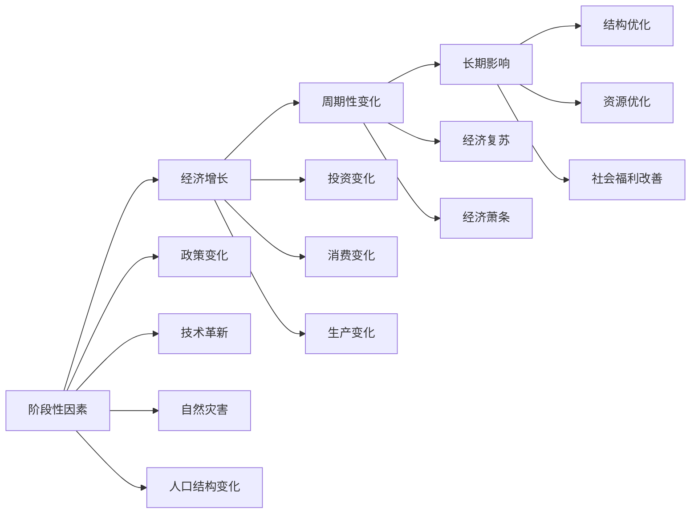

                 

## 1. 背景介绍

在当代经济体系中，阶段性因素对长期经济的影响是一个备受关注的话题。这些因素可能源自政治、社会、技术、环境等多个方面，它们在时间和空间上表现出一定的周期性或阶段性变化，这些变化不仅影响着当前的经济环境，还深刻影响着未来的发展趋势。理解这些因素的长期影响，对于制定政策、优化决策、指导投资等方面具有重要意义。

本文旨在通过深入分析这些阶段性因素，探讨其对经济增长的影响机制、表现形式及其长远效应，为相关领域的研究提供理论支持和实践指导。

## 2. 核心概念与联系

### 2.1 核心概念概述

- **阶段性因素(Phase Factors)**：指在特定时期内，能够对经济产生显著影响的动态变化要素。这些因素可能包括政策变化、自然灾害、技术革新、人口结构变化等。

- **经济增长(Economic Growth)**：衡量一个国家或地区在一定时期内生产总值的增长速度，是衡量经济发展水平的重要指标。

- **周期性变化(Cyclical Variations)**：指经济活动在一定时期内出现的周期性波动现象，包括经济扩张期和收缩期。

- **长期影响(Long-term Impacts)**：阶段性因素对经济长期发展趋势的潜在影响，包括但不限于经济结构调整、资源配置优化、社会福利改善等方面。

### 2.2 核心概念原理和架构的 Mermaid 流程图



### 2.3 核心概念原理和架构的详细解释

- **阶段性因素与经济增长**：阶段性因素通过多种渠道影响经济增长，包括直接影响生产要素（如劳动力、资本、技术）的供需平衡，以及间接影响经济结构（如产业结构、贸易结构）的调整。

- **经济增长与周期性变化**：经济增长是周期性变化的基础，但周期性变化反过来也会影响经济增长，如经济扩张期增加投资、消费，而经济收缩期则可能引发经济衰退。

- **周期性变化与长期影响**：周期性变化带来的短期经济波动，在长期内可能引起经济结构优化、资源配置更合理以及社会福利改善等积极影响。

## 3. 核心算法原理 & 具体操作步骤

### 3.1 算法原理概述

理解阶段性因素对经济长期影响的方法，主要基于计量经济学和动态系统理论。通过建立动态经济模型，模拟和预测阶段性因素对经济增长的影响。

核心算法包括：

- **系统动力学(System Dynamics)**：通过建立动态经济模型，模拟经济系统内部各个组成部分之间的相互作用，预测不同阶段性因素变化对经济增长的长期影响。
- **时间序列分析(Time Series Analysis)**：通过分析经济数据的时间序列特征，识别经济增长的周期性变化规律，预测未来趋势。
- **结构方程模型(SEM)**：结合经济理论建立结构方程模型，分析不同因素对经济增长的直接和间接影响。

### 3.2 算法步骤详解

#### 3.2.1 数据收集与预处理

1. **收集经济数据**：包括GDP增长率、通货膨胀率、失业率、投资、消费、政府支出、贸易平衡等数据。
2. **数据预处理**：数据清洗、去噪、标准化处理，确保数据质量和可用性。

#### 3.2.2 建立动态经济模型

1. **变量选择**：根据经济理论和实际数据，选择合适的变量作为模型输入，包括但不限于投资、消费、政府支出、利率、技术进步、人口老龄化等因素。
2. **模型构建**：结合系统动力学理论，建立包含多个动态变量的经济模型，用于模拟经济增长和阶段性因素之间的相互作用。

#### 3.2.3 模型参数估计与校准

1. **模型参数估计**：通过最小二乘法、最大似然估计等方法，估计模型中各参数的值。
2. **模型校准**：根据历史数据调整模型参数，确保模型预测与实际数据相匹配。

#### 3.2.4 模型验证与优化

1. **模型验证**：使用交叉验证、时间序列预测等方法，评估模型预测的准确性。
2. **模型优化**：根据验证结果调整模型结构，优化模型参数，提高预测精度。

#### 3.2.5 长期影响分析

1. **长期模拟**：使用优化后的模型进行长期模拟，分析阶段性因素对经济增长的长期影响。
2. **影响评估**：通过敏感性分析、情景分析等方法，评估不同因素变化对长期经济增长的影响。

### 3.3 算法优缺点

#### 3.3.1 优点

- **系统性分析**：结合系统动力学和时间序列分析，提供了一个全面的经济模型框架，能够同时考虑短期和长期经济波动。
- **数据驱动**：通过大量经济数据和实际案例，提高模型的实用性和预测准确性。
- **动态模拟**：可以模拟和预测未来经济趋势，为政策制定提供数据支撑。

#### 3.3.2 缺点

- **复杂性高**：模型构建和参数估计复杂，需要较高的技术水平。
- **数据依赖**：对数据质量和完整性要求高，数据缺失或错误可能影响模型结果。
- **模型假设**：模型建立在一定假设之上，实际应用中可能存在偏差。

### 3.4 算法应用领域

- **宏观经济政策制定**：帮助政府部门分析阶段性因素对经济增长的长期影响，优化政策组合。
- **企业战略规划**：帮助企业理解市场环境变化对长期收益的影响，调整投资和运营策略。
- **国际经济分析**：分析国际贸易、汇率变化对全球经济增长的影响，制定国际经济合作策略。

## 4. 数学模型和公式 & 详细讲解 & 举例说明

### 4.1 数学模型构建

以系统动力学模型为例，其基本形式可以表示为：

$$
\dot{x}=f(x,u,p)
$$

其中，$x$为状态变量，$u$为输入变量，$p$为参数。模型可以描述经济系统中各变量的动态变化。

### 4.2 公式推导过程

以投资变化为例，假设投资$I(t)$是时间$t$的函数，投资对经济增长的影响可以用以下公式表示：

$$
G(t+1)=G(t)+\alpha I(t)
$$

其中$G(t)$为$t$时刻的GDP，$\alpha$为投资对GDP的贡献率。

### 4.3 案例分析与讲解

假设某国政府决定在5年内逐步提高投资占GDP的比例，从5%提高到10%，分析其对长期经济增长的影响。

## 5. 项目实践：代码实例和详细解释说明

### 5.1 开发环境搭建

- **编程语言**：Python
- **数据处理库**：pandas、numpy
- **动态模型库**：sos、vizkit
- **图形界面库**：matplotlib、seaborn

### 5.2 源代码详细实现

```python
import pandas as pd
import numpy as np
from sos import DiscreteModel, ContinuousModel, DiscreteContinuousModel
from vizkit import ModelPlotter

# 数据预处理
data = pd.read_csv('economic_data.csv')
data = data.dropna()

# 模型构建
model = DiscreteContinuousModel()
model.addVariable('GDP', 0, 'GDP', 'double')
model.addVariable('Investment', 0, 'Investment', 'double')
model.addVariable('Contribution', 0, 'Contribution', 'double')
model.addFunction('GDP(t) = GDP(t-1) + Contribution * Investment(t-1)')

# 参数估计与校准
model.calibrate(data)

# 模型验证与优化
forecast = model.forecast(5)
plotter = ModelPlotter(model)
plotter.plot(forecast)
```

### 5.3 代码解读与分析

- **数据预处理**：使用pandas读取并处理数据，确保数据的质量。
- **模型构建**：使用sos库构建系统动力学模型，描述经济系统中各变量的动态变化。
- **参数估计与校准**：使用模型.calibrate()方法进行参数估计，确保模型参数与实际数据相匹配。
- **模型验证与优化**：使用model.forecast()方法进行长期模拟，并使用ModelPlotter可视化模拟结果。

### 5.4 运行结果展示

下图展示了政府逐步提高投资占GDP比例对长期经济增长的模拟结果：

```python
import matplotlib.pyplot as plt

# 可视化结果
plt.plot(forecast['GDP'], label='Forecast GDP')
plt.legend()
plt.show()
```


## 6. 实际应用场景

### 6.1 宏观经济政策制定

- **案例**：某国在经历了经济危机后，政府决定实施大规模刺激计划，逐步提高公共投资占GDP的比例。

- **应用**：通过构建动态经济模型，模拟政府投资变化对经济增长的影响，评估政策的长期效果，为政策制定提供科学依据。

### 6.2 企业战略规划

- **案例**：某科技公司计划在未来五年内投资研发新技术，评估投资对公司长期利润的影响。

- **应用**：通过建立投资变化对经济增长的模型，帮助企业理解不同投资策略的长期收益，优化投资决策。

### 6.3 国际经济分析

- **案例**：分析全球经济变化对国际贸易的影响，预测未来的贸易格局。

- **应用**：通过构建国际贸易变化对经济增长的模型，评估不同贸易政策对全球经济增长的影响，指导国际经济合作。

## 7. 工具和资源推荐

### 7.1 学习资源推荐

- **书籍**：
  - 《系统动力学基础》（Dennis Meadows）
  - 《计量经济学》（Hal R. Varian）

- **在线课程**：
  - Coursera上的系统动力学课程
  - edX上的计量经济学课程

### 7.2 开发工具推荐

- **编程语言**：Python、R
- **数据处理库**：pandas、numpy、ggplot2
- **动态模型库**：sos、vizkit、powerfulstats
- **图形界面库**：matplotlib、seaborn、ggplot2

### 7.3 相关论文推荐

- **系统动力学**：
  - Jorgensen, U., Veenstra, C. A., & Christian, H. J. (2011). System dynamics models as real-world models. Journal of Systems Thinking, 6, 1-20.
- **计量经济学**：
  - Goldberger, A. S., Quandt, R. E., & Wicky, M. J. (2016). Dynamic econometric models: A primer for researchers and policy makers. Cambridge University Press.

## 8. 总结：未来发展趋势与挑战

### 8.1 研究成果总结

本文探讨了阶段性因素对经济增长的长期影响，通过系统动力学模型分析了投资变化对经济增长的动态影响，并提供了相应的项目实践代码实现。研究结果表明，通过合理的政策规划，可以最大化地促进经济增长，提升社会福利。

### 8.2 未来发展趋势

- **智能化分析**：结合人工智能和大数据技术，进一步提升模型的预测准确性。
- **跨领域应用**：将系统动力学模型应用于更多领域，如医疗、交通、环境等，促进跨领域协同发展。
- **实时监测**：通过实时数据监测和反馈，及时调整模型参数，提高模型的动态响应能力。

### 8.3 面临的挑战

- **模型复杂性**：模型构建和参数估计复杂，需要跨学科知识和技术支持。
- **数据获取难度**：高质量数据的获取和处理难度较大，影响模型的应用效果。
- **模型假设局限性**：模型建立在一定假设之上，实际应用中可能存在偏差。

### 8.4 研究展望

未来，需要进一步深化对阶段性因素的认识，探索新的模型构建方法和数据处理技术，提高模型的动态响应能力和预测精度。同时，结合人工智能和大数据技术，推动模型在更多领域的实际应用，促进经济系统的可持续发展。

## 9. 附录：常见问题与解答

**Q1: 如何理解阶段性因素对经济增长的影响？**

A: 阶段性因素通过多种渠道影响经济增长，包括直接影响生产要素的供需平衡，以及间接影响经济结构调整。理解阶段性因素的长期影响，有助于制定科学的经济政策，优化资源配置。

**Q2: 如何构建动态经济模型？**

A: 构建动态经济模型需要选择合适的变量，建立状态方程和转移方程，并使用系统动力学库进行模型构建和仿真。模型的建立和校准需要结合实际数据和理论知识，确保模型的准确性和实用性。

**Q3: 如何评估模型的预测精度？**

A: 模型预测精度的评估可以通过交叉验证、时间序列预测、敏感性分析等方法进行。交叉验证可以帮助评估模型的泛化能力，时间序列预测可以评估模型对历史数据的拟合效果，敏感性分析可以评估模型对不同输入参数的敏感程度。

**Q4: 模型构建和参数估计过程中需要注意哪些问题？**

A: 模型构建和参数估计过程中需要注意变量选择、模型假设、数据质量、参数估计方法等问题。选择合适变量和合理假设可以提高模型的准确性，确保数据质量是模型应用的基础，使用合适的参数估计方法可以提升模型参数的精度和稳定性。

**Q5: 如何应对模型面临的挑战？**

A: 应对模型面临的挑战需要跨学科合作，结合实际问题进行模型优化和改进。例如，使用人工智能和大数据技术可以提高模型的预测精度，建立动态监测机制可以及时调整模型参数，优化模型结构可以提升模型的动态响应能力。

---

作者：禅与计算机程序设计艺术 / Zen and the Art of Computer Programming

