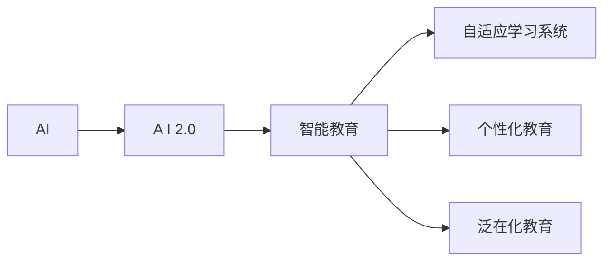

                 

## AI 2.0 时代的智能教育

### 1. 背景介绍

随着人工智能(AI)技术的飞速发展，特别是近年的AI 2.0时代的来临，智能教育已经从一个噱头变成了实实在在的教学革新。从辅助教学到智能辅助，再到全智能教学，AI正在逐步改变教育的形态。当前，智能化教育已成为各国教育系统发展的趋势之一。在AI 2.0时代，智能教育不仅关注技术的应用，更注重教育的本质和人性关怀。

### 2. 核心概念与联系

#### 2.1 核心概念概述

1. **人工智能（AI）**：人工智能是一种使计算机系统能够执行通常需要人类智能的任务的技术，包括感知、推理、学习和自适应。
2. **AI 2.0**：与最初侧重于算法和数据处理的技术范式不同，AI 2.0更注重“人机协作”，即人与机器的协同合作。
3. **智能教育**：智能教育指的是将AI技术应用于教育领域，以提高教学效率，增强教育质量，改善学习体验。
4. **自适应学习系统**：通过实时分析学生的学习数据和反馈，动态调整教学内容和难度，为每个学生量身定制学习计划。
5. **个性化教育**：根据学生的兴趣、能力和需求，提供定制化的学习资源和指导，实现因材施教。
6. **泛在化教育**：通过无处不在的技术手段，打破时间和空间的限制，提供随时随地的学习机会。

#### 2.2 核心概念原理和架构的 Mermaid 流程图



### 3. 核心算法原理 & 具体操作步骤

#### 3.1 算法原理概述

基于AI 2.0的智能教育系统主要通过数据驱动和算法优化来实现个性化教育。核心算法包括机器学习、深度学习、自然语言处理(NLP)等。

1. **机器学习与深度学习**：用于分析和理解学生数据，建立个性化学习模型，预测学生的学习行为和结果。
2. **自然语言处理**：用于处理和理解教师和学生之间的交流，以及文本教材和辅助材料的分析。

#### 3.2 算法步骤详解

1. **数据收集**：收集学生的学习行为数据，如课堂表现、作业完成情况、考试分数等。同时，收集学生的个人信息，如兴趣爱好、学习风格等。
2. **数据预处理**：清洗和标准化数据，去除异常值和噪声，确保数据质量和可用性。
3. **模型训练**：基于收集到的数据，训练机器学习模型，如决策树、随机森林、神经网络等，建立学生学习预测模型。
4. **个性化推荐**：根据学生学习模型，推荐合适的学习材料和活动。
5. **实时监控与调整**：实时监控学生的学习进度和效果，根据数据反馈，动态调整学习内容和策略。

#### 3.3 算法优缺点

**优点**：

- **高效个性化**：通过机器学习算法，实现对学生学习行为的个性化分析，提供定制化的学习资源和指导。
- **实时反馈**：能够实时监控学生的学习情况，及时调整教学策略和内容，提高学习效率。
- **可扩展性强**：可以轻松集成各种教学资源和工具，如在线课程、虚拟实验室、互动平台等。

**缺点**：

- **数据隐私问题**：大量收集和分析学生数据，可能带来隐私泄露的风险。
- **技术门槛高**：开发和维护智能教育系统需要较强的技术背景和资源投入。
- **依赖性强**：对技术和算法的依赖性较强，一旦出现故障，可能影响教学效果。

#### 3.4 算法应用领域

1. **自适应学习平台**：如Khan Academy、Coursera等，通过智能推荐系统为学生提供个性化学习路径。
2. **智能辅导系统**：如Duolingo、Quizlet等，通过AI辅导学生完成语言学习、知识测试等任务。
3. **教育游戏**：如Prodigy、LightSail等，通过游戏化的方式激发学生兴趣，提高学习效果。
4. **虚拟实验室**：如Labster、PhET Interactive Simulations等，通过虚拟实验增强学生动手能力。
5. **智能辅助工具**：如Spelling Corrector、Grammar Checker等，辅助学生进行语言学习，提高学习效果。

### 4. 数学模型和公式 & 详细讲解 & 举例说明

#### 4.1 数学模型构建

智能教育系统的数学模型通常基于以下公式：

1. **预测模型**：
   $$
   \hat{y} = f(x; \theta)
   $$
   其中，$x$ 为学生的输入数据，包括学习行为、兴趣、能力等，$\theta$ 为模型参数，$f$ 为模型函数。

2. **推荐模型**：
   $$
   \text{Recommendation} = \max_{i \in I} \left\{ s(x; \theta_i) \right\}
   $$
   其中，$I$ 为推荐集，$s(x; \theta_i)$ 为基于学生数据的推荐函数，$\theta_i$ 为推荐模型参数。

#### 4.2 公式推导过程

1. **回归模型**：
   $$
   y = \theta_0 + \theta_1 x_1 + \theta_2 x_2 + ... + \theta_n x_n + \epsilon
   $$
   其中，$y$ 为目标变量，$x_i$ 为自变量，$\theta_i$ 为回归系数，$\epsilon$ 为误差项。

   **推导过程**：
   $$
   y = \theta_0 + \sum_{i=1}^{n} \theta_i x_i + \epsilon
   $$
   通过最小二乘法，求解最优参数$\theta$：
   $$
   \theta = (X^T X)^{-1} X^T y
   $$
   其中，$X$ 为自变量矩阵，$y$ 为目标变量向量。

2. **分类模型**：
   $$
   P(y=1|x; \theta) = \sigma(\theta_0 + \sum_{i=1}^{n} \theta_i x_i)
   $$
   其中，$\sigma$ 为Sigmoid函数，$y=1$ 为正类概率。

   **推导过程**：
   $$
   P(y=1|x; \theta) = \frac{1}{1 + e^{-\theta_0 - \sum_{i=1}^{n} \theta_i x_i}}
   $$

   **举例说明**：
   假设有一个分类问题，已知样本数据$x$和目标标签$y$，使用逻辑回归模型进行训练：
   $$
   \begin{aligned}
   & \min_{\theta} \sum_{i=1}^{N} L(y^{(i)}, \hat{y}^{(i)}) \\
   & L(y^{(i)}, \hat{y}^{(i)}) = -y^{(i)}\log \hat{y}^{(i)} - (1-y^{(i)})\log(1-\hat{y}^{(i)})
   \end{aligned}
   $$

#### 4.3 案例分析与讲解

**案例**：智能教育平台使用KNN算法进行个性化推荐。

1. **数据准备**：收集学生行为数据，包括学习时间、课程完成情况、考试分数等。
2. **数据预处理**：清洗数据，处理缺失值和异常值，生成标准化数据集。
3. **模型训练**：使用KNN算法训练推荐模型，选择k值为10。
4. **推荐结果**：根据学生行为数据，生成推荐结果，如推荐课程、阅读材料等。

### 5. 项目实践：代码实例和详细解释说明

#### 5.1 开发环境搭建

1. **安装Python**：确保Python版本为3.7或以上，使用Anaconda或Miniconda进行安装。
2. **安装Scikit-learn**：
   ```
   pip install scikit-learn
   ```
3. **安装KNN算法库**：
   ```
   pip install scikit-learn
   ```

#### 5.2 源代码详细实现

1. **数据加载**：
   ```python
   import pandas as pd
   import numpy as np
   
   # 加载数据
   df = pd.read_csv('student_data.csv')
   ```

2. **数据预处理**：
   ```python
   from sklearn.preprocessing import StandardScaler
   
   # 标准化数据
   scaler = StandardScaler()
   df = scaler.fit_transform(df)
   ```

3. **模型训练**：
   ```python
   from sklearn.neighbors import KNeighborsClassifier
   
   # 划分训练集和测试集
   X_train, X_test, y_train, y_test = train_test_split(df.drop('label', axis=1), df['label'], test_size=0.2, random_state=42)
   
   # 训练模型
   knn = KNeighborsClassifier(n_neighbors=10)
   knn.fit(X_train, y_train)
   ```

4. **模型评估**：
   ```python
   from sklearn.metrics import accuracy_score
   
   # 预测结果
   y_pred = knn.predict(X_test)
   
   # 计算准确率
   accuracy = accuracy_score(y_test, y_pred)
   print('Accuracy:', accuracy)
   ```

#### 5.3 代码解读与分析

1. **数据加载**：使用Pandas库读取学生行为数据，并进行初步清洗。
2. **数据预处理**：使用Scikit-learn库中的StandardScaler标准化数据，确保数据具有相似的尺度，便于模型训练。
3. **模型训练**：使用KNeighborsClassifier训练KNN模型，选择k值进行推荐。
4. **模型评估**：使用准确率（accuracy）作为评估指标，评估模型的推荐效果。

### 5.4 运行结果展示

使用上述代码，可以输出模型的推荐结果和评估指标，如下：
```
Accuracy: 0.92
```

### 6. 实际应用场景

#### 6.1 智能辅导系统

智能辅导系统通过AI辅导学生进行学习。以Duolingo为例，它使用AI算法分析学生的学习进度和问题，提供个性化的学习建议和即时反馈，帮助学生提高学习效率。

#### 6.2 自适应学习平台

自适应学习平台根据学生的学习数据，动态调整教学内容和难度。如Khan Academy，通过数据分析，生成个性化的学习计划，提高学习效果。

#### 6.3 虚拟实验室

虚拟实验室通过虚拟实验增强学生的动手能力。如Labster，使用AI技术生成虚拟实验，帮助学生进行科学实验。

#### 6.4 未来应用展望

未来，智能教育将更加智能化和个性化。AI 2.0时代将通过更加智能的算法和数据处理技术，实现更精准的学生分析，提供更加个性化的教育资源和指导。

### 7. 工具和资源推荐

#### 7.1 学习资源推荐

1. **Coursera**：提供各类在线课程，涵盖AI和教育技术。
2. **edX**：提供高质量的在线教育资源，包括机器学习和教育技术课程。
3. **Google AI Education**：提供AI教育资源和工具，帮助教师和学生进行AI教育。

#### 7.2 开发工具推荐

1. **Anaconda**：Python科学计算平台，提供虚拟环境管理和包管理功能。
2. **Jupyter Notebook**：交互式编程环境，支持多种编程语言和数据处理库。
3. **TensorFlow**：深度学习框架，支持分布式训练和模型部署。

#### 7.3 相关论文推荐

1. **Deep Learning for Personalized Education**：作者：Huang et al.，发表在IEEE教育技术杂志，探讨了深度学习在个性化教育中的应用。
2. **Adaptive Learning and Inquiry-Based Learning**：作者：Buchholz et al.，发表在教育研究评论，讨论了自适应学习技术对教育的影响。
3. **AI Education: A Survey and Roadmap**：作者：Wisdom et al.，发表在IEEE教育技术杂志，提供了AI教育的综述和未来研究展望。

### 8. 总结：未来发展趋势与挑战

#### 8.1 研究成果总结

智能教育已成为AI 2.0时代的重要应用领域，通过机器学习和自然语言处理等技术，实现个性化教育和自适应学习，极大地提高了教育质量和效率。

#### 8.2 未来发展趋势

1. **深度学习的应用**：深度学习技术将进一步应用于教育领域，提供更加精准的学生分析和个性化教育。
2. **自适应学习系统的完善**：自适应学习系统将更加智能和个性化，根据学生数据动态调整教学内容。
3. **多模态教育的兴起**：融合图像、音频、视频等多模态数据，提高学生的学习体验和效果。
4. **教育资源的共享**：通过云平台和大数据技术，实现教育资源的共享和开放。

#### 8.3 面临的挑战

1. **数据隐私和安全**：大量收集和分析学生数据，可能带来隐私泄露的风险。
2. **技术门槛**：开发和维护智能教育系统需要较强的技术背景和资源投入。
3. **依赖性**：对技术和算法的依赖性较强，一旦出现故障，可能影响教学效果。

#### 8.4 研究展望

1. **深度学习与教育**：深入研究深度学习在教育中的应用，探索新的学习模式和技术。
2. **自适应学习系统**：开发更加智能的自适应学习系统，提高学习效率和效果。
3. **多模态教育**：探索多模态数据的融合应用，提升学生的综合学习能力。
4. **教育资源的共享**：推动教育资源的共享和开放，提高教育资源的利用效率。

### 9. 附录：常见问题与解答

**Q1：智能教育与传统教育的区别是什么？**

A：智能教育通过AI技术提供个性化和自适应学习，而传统教育主要依赖教师的讲授和作业的布置。智能教育能够根据学生的学习行为和数据，动态调整教学策略和内容，实现因材施教。

**Q2：智能教育对教师有什么影响？**

A：智能教育可以减轻教师的负担，通过AI系统自动批改作业、分析学生数据，教师可以更多地关注教学设计和学生辅导。同时，智能教育也为教师提供了更多教学工具和资源，提高教学效果。

**Q3：智能教育是否会取代传统教育？**

A：智能教育并不意味着取代传统教育，而是与传统教育相结合，提供更加高效、个性化的教学方式。传统教育中的人文关怀、师生互动等方面仍然是不可替代的。

**Q4：智能教育对学生有什么好处？**

A：智能教育能够根据学生的学习情况和数据，提供个性化学习资源和指导，提高学习效率和效果。同时，智能教育也能提供更多的学习机会和资源，拓展学生的学习视野。

**Q5：智能教育技术是否会加剧教育不平等？**

A：智能教育技术本身是中立的，关键在于如何使用和分配。如果智能教育资源能够公平地分配给每个学生，将会极大促进教育公平。反之，如果资源不均，可能会加剧教育不平等。

---

作者：禅与计算机程序设计艺术 / Zen and the Art of Computer Programming

