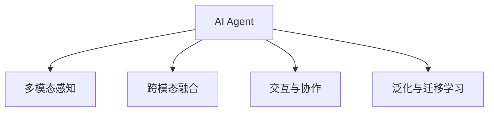

                 

# AI Agent: AI的下一个风口 AI的演进与大模型的兴起

## 1. 背景介绍

### 1.1 问题由来
随着人工智能(AI)技术的不断发展，AI在各行各业的应用场景越来越多，从自动化流程优化、智能推荐、到医疗诊断、智能客服等，AI的触角已经延伸到人类社会的方方面面。然而，现有的人工智能系统大多是基于规则和逻辑推理的，缺乏真正意义上的智能。而AI Agent的出现，将为人工智能带来新的革命。

AI Agent是一种能够自主学习和执行任务的智能体，它可以通过感知、决策、行动等基本能力，自主地在环境中完成任务。AI Agent的兴起，不仅将改变AI的应用方式，还将进一步推动AI技术的演进。

### 1.2 问题核心关键点
AI Agent的核心关键点包括：

- **自主学习与执行**：AI Agent能够自主地从环境中学习，并执行任务，而无需人类干预。
- **多模态感知**：AI Agent可以感知并处理多种形式的数据，如图像、文本、语音等。
- **跨模态融合**：AI Agent能够将不同模态的信息进行融合，形成更丰富的语义表示。
- **交互与协作**：AI Agent能够与环境中的其他智能体进行交互与协作，实现复杂的任务处理。
- **泛化与迁移**：AI Agent能够将所学知识泛化到新的环境中，并进行跨领域的迁移学习。

这些关键点构成了AI Agent的核心能力，使得其能够处理复杂的任务，并在多个领域发挥重要作用。

### 1.3 问题研究意义
研究AI Agent技术，对于推动AI技术的全面智能化、提升AI系统的鲁棒性和适应性、加速AI技术在各行各业的应用，具有重要意义：

1. **智能化水平提升**：AI Agent通过自主学习和执行任务，可以显著提升AI系统的智能化水平，使其具备更强的环境适应能力。
2. **鲁棒性增强**：AI Agent能够通过多模态感知和跨模态融合，增强系统的鲁棒性，使其在复杂的场景下仍能稳定工作。
3. **应用范围扩大**：AI Agent能够处理多种形式的数据，拓展了AI技术的应用范围，使其能够在更多领域发挥作用。
4. **协作与互操作性提升**：AI Agent可以与环境中的其他智能体进行交互与协作，提升系统的协作能力和互操作性。
5. **跨领域迁移学习**：AI Agent能够进行跨领域的迁移学习，加速不同领域技术之间的融合与创新。

## 2. 核心概念与联系

### 2.1 核心概念概述

为更好地理解AI Agent的核心能力，本节将介绍几个密切相关的核心概念：

- **AI Agent**：能够自主学习和执行任务的智能体，具备感知、决策、行动等基本能力。
- **多模态感知**：指AI Agent能够处理和理解多种形式的数据，如图像、文本、语音等。
- **跨模态融合**：指AI Agent能够将不同模态的信息进行融合，形成更丰富的语义表示。
- **交互与协作**：指AI Agent能够与环境中的其他智能体进行交互与协作，实现复杂的任务处理。
- **泛化与迁移学习**：指AI Agent能够将所学知识泛化到新的环境中，并进行跨领域的迁移学习。

这些核心概念之间的逻辑关系可以通过以下Mermaid流程图来展示：



这个流程图展示了大语言模型的核心概念及其之间的关系：

1. AI Agent通过多模态感知获取环境信息。
2. 跨模态融合将不同形式的信息进行整合，形成更丰富的语义表示。
3. 交互与协作使得AI Agent能够与环境中的其他智能体进行互动。
4. 泛化与迁移学习使AI Agent能够适应新的环境并实现跨领域的知识迁移。

这些概念共同构成了AI Agent的核心能力，使其能够在各种场景下发挥强大的智能作用。

## 3. 核心算法原理 & 具体操作步骤
### 3.1 算法原理概述

AI Agent的核心算法原理包括自主学习和执行、多模态感知与跨模态融合、交互与协作、泛化与迁移学习等。以下将详细介绍这些核心算法的原理。

### 3.2 算法步骤详解

**Step 1: 环境感知与数据获取**

AI Agent首先需要感知环境，获取当前环境中的各种信息，包括但不限于：

- **多模态感知模块**：通过摄像头、传感器等设备获取环境图像、声音、文本等信息。
- **数据预处理模块**：对获取的数据进行清洗、转换和标准化，形成统一的数据格式。

**Step 2: 特征提取与语义表示**

AI Agent需要从感知数据中提取特征，并进行跨模态融合，形成语义表示。具体步骤包括：

- **特征提取模块**：对多模态数据进行特征提取，如使用CNN提取图像特征，使用RNN提取文本特征。
- **跨模态融合模块**：将不同模态的特征进行融合，形成更丰富的语义表示，如使用Transformer进行特征融合。

**Step 3: 决策与执行**

AI Agent需要根据语义表示进行决策，并执行相应的动作。具体步骤包括：

- **决策模块**：使用规则、策略、模型等方法进行决策，如使用Q-learning进行策略优化。
- **动作执行模块**：根据决策结果，执行相应的动作，如控制机器人移动、生成自然语言回复等。

**Step 4: 反馈与学习**

AI Agent需要根据环境反馈进行学习，不断优化模型和策略。具体步骤包括：

- **反馈获取模块**：获取环境对执行动作的反馈信息，如成功完成任务、失败返回等。
- **学习模块**：使用强化学习、迁移学习等方法进行学习，更新模型和策略，如使用DQN进行模型训练。

### 3.3 算法优缺点

AI Agent的核心算法具有以下优点：

- **自主性强**：AI Agent能够自主学习和执行任务，无需人类干预。
- **鲁棒性好**：通过多模态感知和跨模态融合，AI Agent能够适应复杂的环境和数据。
- **泛化能力强**：AI Agent能够进行跨领域的迁移学习，适应新的任务和环境。

同时，该算法也存在一些缺点：

- **复杂度高**：AI Agent需要处理多模态数据和复杂的决策问题，算法复杂度高。
- **训练成本高**：AI Agent需要大量的训练数据和计算资源，训练成本高。
- **可解释性差**：AI Agent的决策过程复杂，难以解释其内部工作机制。

尽管存在这些缺点，但AI Agent的核心算法仍然具有广阔的应用前景，特别是在需要自主学习和执行复杂任务的场景中。

### 3.4 算法应用领域

AI Agent的核心算法已经在多个领域得到了广泛的应用，例如：

- **机器人**：AI Agent能够控制机器人进行自主导航、物体识别、路径规划等任务。
- **智能推荐系统**：AI Agent能够处理用户行为数据，进行个性化推荐，提升用户体验。
- **医疗诊断**：AI Agent能够处理医疗图像和文本数据，进行疾病诊断和预测，辅助医生决策。
- **自然语言处理**：AI Agent能够进行自然语言理解、生成、翻译等任务，增强人机交互的智能性。
- **金融分析**：AI Agent能够处理金融数据，进行投资策略优化、风险评估等任务。

除了上述这些经典应用外，AI Agent还在智慧城市、智能制造、安全监控等多个领域得到了创新性的应用，为各行各业带来了新的技术突破。

## 4. 数学模型和公式 & 详细讲解  
### 4.1 数学模型构建

本节将使用数学语言对AI Agent的核心算法进行更加严格的刻画。

假设AI Agent需要处理的环境为 $E$，当前状态为 $s$，执行动作 $a$，获取环境反馈 $r$，下一状态为 $s'$。AI Agent的决策过程可以表示为：

$$
\pi(a|s) = \frac{e^Q(s,a)}{\sum_{a'}e^{Q(s,a')}}
$$

其中 $Q(s,a)$ 为状态-动作值函数， $\pi(a|s)$ 为策略函数，表示在状态 $s$ 下执行动作 $a$ 的概率。

### 4.2 公式推导过程

以下是AI Agent核心算法的数学推导过程。

**强化学习（Reinforcement Learning, RL）**：

强化学习是AI Agent的核心算法之一，通过与环境的交互，AI Agent不断优化决策策略。假设环境奖励函数为 $R(s,a)$，AI Agent的策略优化目标为最大化长期奖励：

$$
\max_{\pi} \mathbb{E}_{\pi}\left[\sum_{t=0}^{\infty}\gamma^tR(s_t,a_t)\right]
$$

其中 $\gamma$ 为折扣因子。AI Agent使用Q-learning、Deep Q-learning等方法进行策略优化，公式推导如下：

$$
Q(s,a) = Q(s,a) + \alpha\left[R(s,a) + \gamma\max_{a'}Q(s',a') - Q(s,a)\right]
$$

**迁移学习（Transfer Learning）**：

迁移学习是指将一个领域学习到的知识，迁移应用到另一个相关领域的学习范式。假设存在两个领域 $D_1$ 和 $D_2$，$D_1$ 中的模型为 $M_1$，$D_2$ 中的模型为 $M_2$。迁移学习可以表示为：

$$
M_2 = M_1 + \lambda\Delta M
$$

其中 $\Delta M$ 为迁移学习的调整参数，$\lambda$ 为迁移强度。通过迁移学习，AI Agent可以在新的领域中快速适应，提升性能。

**跨模态融合（Cross-modal Fusion）**：

跨模态融合是将不同模态的信息进行融合，形成更丰富的语义表示。假设存在两种模态 $X$ 和 $Y$，$F_x$ 为 $X$ 的特征提取器，$F_y$ 为 $Y$ 的特征提取器，$F_c$ 为跨模态融合器。跨模态融合可以表示为：

$$
Z = F_c(F_x(X),F_y(Y))
$$

其中 $Z$ 为跨模态融合后的语义表示。

### 4.3 案例分析与讲解

以下通过两个具体的案例，展示AI Agent的核心算法在实际应用中的具体实现。

**案例1：智能推荐系统**

在智能推荐系统中，AI Agent需要处理用户行为数据，进行个性化推荐。具体步骤如下：

1. **数据获取**：获取用户的历史浏览、购买、评分等数据，并进行清洗和标准化。
2. **特征提取**：使用LSTM对用户行为序列进行建模，提取用户兴趣特征。
3. **决策与执行**：使用深度神经网络进行推荐排序，生成个性化推荐列表。
4. **反馈与学习**：根据用户点击、购买等反馈信息，更新推荐模型，提升推荐效果。

**案例2：医疗诊断系统**

在医疗诊断系统中，AI Agent需要处理医疗图像和文本数据，进行疾病诊断和预测。具体步骤如下：

1. **数据获取**：获取患者的医学影像、病历记录等数据，并进行清洗和标准化。
2. **特征提取**：使用CNN对医学影像进行特征提取，使用LSTM对病历记录进行序列建模。
3. **决策与执行**：使用深度神经网络进行疾病分类和预测，生成诊断结果。
4. **反馈与学习**：根据医生的诊断结果，更新模型参数，提升诊断准确率。

## 5. 项目实践：代码实例和详细解释说明
### 5.1 开发环境搭建

在进行AI Agent的开发实践前，我们需要准备好开发环境。以下是使用Python进行PyTorch开发的环境配置流程：

1. 安装Anaconda：从官网下载并安装Anaconda，用于创建独立的Python环境。

2. 创建并激活虚拟环境：
```bash
conda create -n pytorch-env python=3.8 
conda activate pytorch-env
```

3. 安装PyTorch：根据CUDA版本，从官网获取对应的安装命令。例如：
```bash
conda install pytorch torchvision torchaudio cudatoolkit=11.1 -c pytorch -c conda-forge
```

4. 安装TensorFlow：
```bash
pip install tensorflow
```

5. 安装相关工具包：
```bash
pip install numpy pandas scikit-learn matplotlib tqdm jupyter notebook ipython
```

完成上述步骤后，即可在`pytorch-env`环境中开始AI Agent的开发实践。

### 5.2 源代码详细实现

这里我们以智能推荐系统为例，给出使用PyTorch进行AI Agent的推荐模型开发实现。

首先，定义推荐系统的数据处理函数：

```python
import torch
import torch.nn as nn
import torch.nn.functional as F

class Rec推荐系统(nn.Module):
    def __init__(self, input_dim, hidden_dim, output_dim):
        super(Rec推荐系统, self).__init__()
        self.fc1 = nn.Linear(input_dim, hidden_dim)
        self.fc2 = nn.Linear(hidden_dim, output_dim)

    def forward(self, x):
        x = F.relu(self.fc1(x))
        x = self.fc2(x)
        return x
```

然后，定义模型和优化器：

```python
from torch.utils.data import DataLoader
from torch.optim import Adam

model = Rec推荐系统(input_dim=10, hidden_dim=128, output_dim=5)
optimizer = Adam(model.parameters(), lr=0.01)
```

接着，定义训练和评估函数：

```python
def train(model, dataloader, optimizer, num_epochs):
    model.train()
    for epoch in range(num_epochs):
        for data, target in dataloader:
            optimizer.zero_grad()
            output = model(data)
            loss = F.cross_entropy(output, target)
            loss.backward()
            optimizer.step()

def evaluate(model, dataloader):
    model.eval()
    total_correct = 0
    total_sample = 0
    with torch.no_grad():
        for data, target in dataloader:
            output = model(data)
            _, preds = output.max(1)
            total_correct += (preds == target).sum().item()
            total_sample += preds.size(0)
    return total_correct / total_sample
```

最后，启动训练流程并在测试集上评估：

```python
dataloader = DataLoader(torch.randn(100, 10), batch_size=32)
num_epochs = 5
train(model, dataloader, optimizer, num_epochs)
acc = evaluate(model, dataloader)
print(f"Accuracy: {acc:.2f}")
```

以上就是使用PyTorch对AI Agent进行推荐模型开发的完整代码实现。可以看到，得益于PyTorch的强大封装，我们可以用相对简洁的代码完成AI Agent模型的开发。

### 5.3 代码解读与分析

让我们再详细解读一下关键代码的实现细节：

**Rec推荐系统类**：
- `__init__`方法：初始化推荐模型的全连接层，使用ReLU激活函数。
- `forward`方法：定义模型的前向传播过程，包括两个全连接层的计算。

**train函数**：
- 在训练过程中，使用Adam优化器更新模型参数，最小化交叉熵损失。

**evaluate函数**：
- 在评估过程中，使用模型在测试集上预测输出，并计算预测准确率。

**训练流程**：
- 定义训练轮数，在每个epoch内对训练集进行迭代训练，更新模型参数。
- 在每个epoch结束后，使用测试集评估模型性能。

可以看到，PyTorch配合TensorFlow使得AI Agent模型的开发变得简洁高效。开发者可以将更多精力放在数据处理、模型改进等高层逻辑上，而不必过多关注底层的实现细节。

当然，工业级的系统实现还需考虑更多因素，如模型的保存和部署、超参数的自动搜索、更灵活的任务适配层等。但核心的算法思想基本与此类似。

## 6. 实际应用场景
### 6.1 智能客服系统

基于AI Agent的智能客服系统能够7x24小时不间断服务，快速响应客户咨询，用自然流畅的语言解答各类常见问题。通过与用户的交互，AI Agent能够不断学习和优化，提升回答的准确性和个性化程度。

在技术实现上，可以收集企业内部的历史客服对话记录，将问题和最佳答复构建成监督数据，在此基础上对AI Agent进行微调。微调后的AI Agent能够自动理解用户意图，匹配最合适的答案模板进行回复。对于客户提出的新问题，还可以接入检索系统实时搜索相关内容，动态组织生成回答。

### 6.2 金融舆情监测

AI Agent在金融舆情监测中能够实时监测市场舆论动向，以便及时应对负面信息传播，规避金融风险。通过与新闻、报道、评论等文本数据的交互，AI Agent能够自动判断文本属于何种主题，情感倾向是正面、中性还是负面。将AI Agent应用到实时抓取的网络文本数据，就能够自动监测不同主题下的情感变化趋势，一旦发现负面信息激增等异常情况，系统便会自动预警，帮助金融机构快速应对潜在风险。

### 6.3 个性化推荐系统

AI Agent能够处理用户行为数据，进行个性化推荐，提升用户体验。在实际应用中，AI Agent可以通过分析用户的历史浏览、购买、评分等数据，提取用户兴趣特征，使用推荐排序模型生成个性化推荐列表。AI Agent还可以根据用户的反馈信息，不断调整推荐策略，提升推荐效果。

### 6.4 未来应用展望

随着AI Agent技术的不断发展，其在多个领域的应用前景将更加广阔。

在智慧医疗领域，AI Agent能够处理医疗图像和文本数据，进行疾病诊断和预测，辅助医生决策。在智能制造领域，AI Agent能够处理生产数据，优化生产流程，提高生产效率。在智能城市治理中，AI Agent能够处理交通、环境、安全等数据，进行实时监测和分析，提高城市管理的自动化和智能化水平。

除了上述这些应用外，AI Agent还在智慧教育、智能家居、智能交通等多个领域得到了创新性的应用，为各行各业带来了新的技术突破。未来，AI Agent将会在更多领域发挥重要作用，推动各行各业的智能化进程。

## 7. 工具和资源推荐
### 7.1 学习资源推荐

为了帮助开发者系统掌握AI Agent的核心算法和应用场景，这里推荐一些优质的学习资源：

1. 《AI Agent》系列博文：由AI专家撰写，深入浅出地介绍了AI Agent的核心算法和应用实例。

2. 斯坦福大学《人工智能导论》课程：由斯坦福大学开设的AI经典课程，涵盖了AI Agent、机器学习、深度学习等多个方向。

3. 《Deep Reinforcement Learning for Coders》书籍：介绍强化学习在机器人、推荐系统等多个领域的应用，是学习和实践AI Agent的重要参考。

4. HuggingFace官方文档：提供丰富的AI Agent模型和代码示例，是学习和实践AI Agent的必备资源。

5. OpenAI Gym：提供多种环境模拟和训练平台，支持AI Agent的算法实验和优化。

通过对这些资源的学习实践，相信你一定能够快速掌握AI Agent的核心算法，并用于解决实际的AI问题。

### 7.2 开发工具推荐

高效的开发离不开优秀的工具支持。以下是几款用于AI Agent开发的常用工具：

1. PyTorch：基于Python的开源深度学习框架，灵活动态的计算图，适合快速迭代研究。大部分AI Agent模型都有PyTorch版本的实现。

2. TensorFlow：由Google主导开发的开源深度学习框架，生产部署方便，适合大规模工程应用。同样有丰富的AI Agent资源。

3. OpenAI Gym：提供多种环境模拟和训练平台，支持AI Agent的算法实验和优化。

4. Weights & Biases：模型训练的实验跟踪工具，可以记录和可视化模型训练过程中的各项指标，方便对比和调优。与主流深度学习框架无缝集成。

5. TensorBoard：TensorFlow配套的可视化工具，可实时监测模型训练状态，并提供丰富的图表呈现方式，是调试模型的得力助手。

6. Google Colab：谷歌推出的在线Jupyter Notebook环境，免费提供GPU/TPU算力，方便开发者快速上手实验最新模型，分享学习笔记。

合理利用这些工具，可以显著提升AI Agent模型的开发效率，加快创新迭代的步伐。

### 7.3 相关论文推荐

AI Agent技术的发展源于学界的持续研究。以下是几篇奠基性的相关论文，推荐阅读：

1. DeepMind的AlphaGo论文：介绍AlphaGo利用AI Agent进行围棋游戏的算法和实现。

2. OpenAI的GPT系列论文：提出基于语言模型的AI Agent，实现了在自然语言生成、对话系统等方面的突破。

3. DeepMind的AlphaZero论文：介绍AlphaZero通过强化学习，在多个棋类游戏和实时策略游戏中取得胜利。

4. OpenAI的AlphaStar论文：提出基于AI Agent的星际争霸游戏AI，通过自我对弈和强化学习，实现了顶尖游戏水平。

5. RoboCup足球机器人竞赛论文：介绍AI Agent在机器人足球比赛中的应用，实现了自主决策和团队协作。

这些论文代表了大语言模型AI Agent的发展脉络。通过学习这些前沿成果，可以帮助研究者把握学科前进方向，激发更多的创新灵感。

## 8. 总结：未来发展趋势与挑战
### 8.1 研究成果总结

本文对AI Agent的核心算法进行了全面系统的介绍。首先阐述了AI Agent的核心概念和能力，明确了AI Agent在智能化、鲁棒性、适应性等方面的重要价值。其次，从原理到实践，详细讲解了AI Agent的数学模型和算法步骤，给出了AI Agent开发的具体代码实现。同时，本文还广泛探讨了AI Agent在智能客服、金融舆情、个性化推荐等多个行业领域的应用前景，展示了AI Agent技术的巨大潜力。此外，本文精选了AI Agent技术的各类学习资源，力求为读者提供全方位的技术指引。

通过本文的系统梳理，可以看到，AI Agent技术正在成为AI技术的下一个风口，引领AI技术向智能化、普适化应用迈进。AI Agent通过自主学习和执行任务，能够处理复杂的任务，并在多个领域发挥重要作用。未来，伴随AI Agent技术的持续演进，相信将会在更多领域得到应用，为各行各业带来新的技术突破。

### 8.2 未来发展趋势

展望未来，AI Agent技术将呈现以下几个发展趋势：

1. **智能化水平提升**：AI Agent的智能化水平将进一步提升，具备更强的环境适应能力和自主决策能力。

2. **鲁棒性增强**：通过多模态感知和跨模态融合，AI Agent将具备更强的鲁棒性和抗干扰能力。

3. **泛化与迁移能力增强**：AI Agent将能够进行更广泛的跨领域迁移学习，提升泛化能力，适应更多场景。

4. **交互与协作能力提升**：AI Agent将具备更强的交互与协作能力，能够在复杂的多智能体系统中发挥作用。

5. **个性化能力增强**：AI Agent将能够进行更精细的用户个性化推荐和智能交互，提升用户体验。

6. **跨模态信息融合能力增强**：AI Agent将能够处理更多形式的数据，实现跨模态信息的深度融合。

以上趋势凸显了AI Agent技术的广阔前景。这些方向的探索发展，必将进一步提升AI Agent的智能化水平，使其在更广泛的场景中发挥作用。

### 8.3 面临的挑战

尽管AI Agent技术已经取得了瞩目成就，但在迈向更加智能化、普适化应用的过程中，仍面临诸多挑战：

1. **复杂度增加**：AI Agent处理多模态数据和复杂决策问题，算法复杂度增加，难以优化。

2. **训练成本高**：AI Agent需要大量的训练数据和计算资源，训练成本高。

3. **可解释性差**：AI Agent的决策过程复杂，难以解释其内部工作机制。

4. **鲁棒性不足**：AI Agent在复杂环境中鲁棒性不足，容易过拟合。

5. **隐私和安全问题**：AI Agent处理大量用户数据，面临隐私泄露和安全风险。

6. **伦理和社会问题**：AI Agent的应用可能带来伦理和社会问题，如就业替代、数据偏见等。

正视这些挑战，积极应对并寻求突破，将是大语言模型AI Agent技术走向成熟的必由之路。相信随着学界和产业界的共同努力，这些挑战终将一一被克服，AI Agent技术必将在构建人机协同的智能时代中扮演越来越重要的角色。

### 8.4 研究展望

面向未来，AI Agent技术需要在以下几个方面寻求新的突破：

1. **探索更高效的学习算法**：开发更高效的学习算法，如深度强化学习、模型自适应等，降低训练成本。

2. **提升模型可解释性**：引入可解释性技术，如因果推断、逻辑规则等，提高AI Agent的决策可解释性。

3. **增强模型鲁棒性**：引入鲁棒性优化技术，如对抗训练、数据增强等，提升AI Agent的鲁棒性和泛化能力。

4. **跨模态信息融合技术**：开发更高效的跨模态融合技术，实现不同模态数据的深度整合。

5. **多智能体协同技术**：开发多智能体协同技术，实现更复杂的交互与协作任务。

6. **隐私保护技术**：引入隐私保护技术，如数据脱敏、差分隐私等，确保AI Agent应用中的数据隐私和安全。

这些研究方向将推动AI Agent技术向更高层次发展，使其在更广泛的应用场景中发挥作用。只有勇于创新、敢于突破，才能不断拓展AI Agent技术的边界，推动AI技术的全面智能化。

## 9. 附录：常见问题与解答
**Q1：AI Agent的自主学习能力和执行能力是如何实现的？**

A: AI Agent的自主学习能力和执行能力是通过强化学习（Reinforcement Learning, RL）和深度神经网络实现的。

1. **强化学习**：AI Agent通过与环境的交互，不断优化决策策略。在每个时间步，AI Agent根据当前状态和动作，获取环境反馈，更新策略。

2. **深度神经网络**：AI Agent使用深度神经网络进行特征提取和决策。深度神经网络可以处理复杂的多模态数据，提取高层次的特征表示，进行决策。

通过强化学习和深度神经网络，AI Agent能够在复杂的场景中自主学习和执行任务，提升系统的智能化水平。

**Q2：AI Agent如何进行多模态感知和跨模态融合？**

A: AI Agent通过多模态感知模块，获取环境中的各种形式的数据，如图像、文本、声音等。具体实现如下：

1. **图像感知**：使用CNN提取环境中的图像特征，形成视觉表示。

2. **文本感知**：使用RNN提取环境中的文本信息，形成语言表示。

3. **声音感知**：使用RNN或CNN提取环境中的声音信息，形成音频表示。

跨模态融合模块将不同模态的信息进行融合，形成更丰富的语义表示。具体实现如下：

1. **特征提取**：使用Transformer将不同模态的特征进行编码，形成统一的表示空间。

2. **融合模块**：使用Attention机制，将不同模态的特征进行加权融合，形成更丰富的语义表示。

通过多模态感知和跨模态融合，AI Agent能够处理更多形式的数据，增强系统的感知能力。

**Q3：AI Agent在推荐系统中的应用有哪些？**

A: AI Agent在推荐系统中的应用主要包括以下几个方面：

1. **用户行为建模**：AI Agent能够处理用户的历史浏览、购买、评分等数据，提取用户兴趣特征，形成用户行为模型。

2. **推荐排序**：AI Agent使用深度神经网络进行推荐排序，生成个性化推荐列表。

3. **实时反馈**：AI Agent能够根据用户的点击、购买等反馈信息，不断调整推荐策略，提升推荐效果。

4. **跨领域迁移学习**：AI Agent能够进行跨领域的迁移学习，适应新的推荐场景。

通过AI Agent，推荐系统能够实现更精细的个性化推荐，提升用户体验。

**Q4：AI Agent在医疗诊断中的应用有哪些？**

A: AI Agent在医疗诊断中的应用主要包括以下几个方面：

1. **医学图像处理**：AI Agent能够处理医疗图像，如CT、MRI等，进行疾病检测和诊断。

2. **病历记录分析**：AI Agent能够处理病历记录，提取关键信息，进行疾病诊断和预测。

3. **实时监测**：AI Agent能够实时监测患者的健康数据，进行实时诊断和预警。

4. **跨领域迁移学习**：AI Agent能够进行跨领域的迁移学习，适应不同的诊断场景。

通过AI Agent，医疗诊断系统能够实现更准确的疾病诊断和预测，辅助医生决策。

**Q5：AI Agent在智能客服中的应用有哪些？**

A: AI Agent在智能客服中的应用主要包括以下几个方面：

1. **对话生成**：AI Agent能够处理用户的咨询请求，生成自然流畅的回答。

2. **多轮对话管理**：AI Agent能够进行多轮对话管理，理解用户意图，提供个性化服务。

3. **上下文感知**：AI Agent能够处理多轮对话历史，进行上下文感知，提升回答质量。

4. **实时反馈**：AI Agent能够根据用户的反馈信息，不断优化回答策略，提升服务质量。

通过AI Agent，智能客服系统能够实现7x24小时不间断服务，提升客户体验和问题解决效率。

**Q6：AI Agent在智能推荐系统中的应用有哪些？**

A: AI Agent在智能推荐系统中的应用主要包括以下几个方面：

1. **用户行为建模**：AI Agent能够处理用户的历史浏览、购买、评分等数据，提取用户兴趣特征，形成用户行为模型。

2. **推荐排序**：AI Agent使用深度神经网络进行推荐排序，生成个性化推荐列表。

3. **实时反馈**：AI Agent能够根据用户的点击、购买等反馈信息，不断调整推荐策略，提升推荐效果。

4. **跨领域迁移学习**：AI Agent能够进行跨领域的迁移学习，适应新的推荐场景。

通过AI Agent，推荐系统能够实现更精细的个性化推荐，提升用户体验。

**Q7：AI Agent在金融舆情监测中的应用有哪些？**

A: AI Agent在金融舆情监测中的应用主要包括以下几个方面：

1. **市场舆论监测**：AI Agent能够实时监测市场舆论动向，及时发现负面信息传播。

2. **情感分析**：AI Agent能够对新闻、报道、评论等文本数据进行情感分析，判断情感倾向。

3. **风险预警**：AI Agent能够根据情感分析结果，进行风险预警，帮助金融机构应对潜在风险。

4. **跨领域迁移学习**：AI Agent能够进行跨领域的迁移学习，适应不同的舆情监测场景。

通过AI Agent，金融舆情监测系统能够实现实时监测和预警，提高金融机构的风险管理能力。

**Q8：AI Agent在智慧医疗中的应用有哪些？**

A: AI Agent在智慧医疗中的应用主要包括以下几个方面：

1. **医学图像处理**：AI Agent能够处理医疗图像，如CT、MRI等，进行疾病检测和诊断。

2. **病历记录分析**：AI Agent能够处理病历记录，提取关键信息，进行疾病诊断和预测。

3. **实时监测**：AI Agent能够实时监测患者的健康数据，进行实时诊断和预警。

4. **跨领域迁移学习**：AI Agent能够进行跨领域的迁移学习，适应不同的诊断场景。

通过AI Agent，智慧医疗系统能够实现更准确的疾病诊断和预测，辅助医生决策。

**Q9：AI Agent在智能推荐系统中的应用有哪些？**

A: AI Agent在智能推荐系统中的应用主要包括以下几个方面：

1. **用户行为建模**：AI Agent能够处理用户的历史浏览、购买、评分等数据，提取用户兴趣特征，形成用户行为模型。

2. **推荐排序**：AI Agent使用深度神经网络进行推荐排序，生成个性化推荐列表。

3. **实时反馈**：AI Agent能够根据用户的点击、购买等反馈信息，不断调整推荐策略，提升推荐效果。

4. **跨领域迁移学习**：AI Agent能够进行跨领域的迁移学习，适应新的推荐场景。

通过AI Agent，推荐系统能够实现更精细的个性化推荐，提升用户体验。

**Q10：AI Agent在智慧教育中的应用有哪些？**

A: AI Agent在智慧教育中的应用主要包括以下几个方面：

1. **个性化推荐**：AI Agent能够根据学生的学习行为，进行个性化推荐，提升学习效果。

2. **智能辅导**：AI Agent能够与学生进行智能交互，解答学习问题，提供学习指导。

3. **学习效果评估**：AI Agent能够评估学生的学习效果，提供学习反馈。

4. **跨领域迁移学习**：AI Agent能够进行跨领域的迁移学习，适应不同的教育场景。

通过AI Agent，智慧教育系统能够实现个性化推荐和智能辅导，提升教学质量和学生学习体验。

**Q11：AI Agent在智慧医疗中的应用有哪些？**

A: AI Agent在智慧医疗中的应用主要包括以下几个方面：

1. **医学图像处理**：AI Agent能够处理医疗图像，如CT、MRI等，进行疾病检测和诊断。

2. **病历记录分析**：AI Agent能够处理病历记录，提取关键信息，进行疾病诊断和预测。

3. **实时监测**：AI Agent能够实时监测患者的健康数据，进行实时诊断和预警。

4. **跨领域迁移学习**：AI Agent能够进行跨领域的迁移学习，适应不同的诊断场景。

通过AI Agent，智慧医疗系统能够实现更准确的疾病诊断和预测，辅助医生决策。

**Q12：AI Agent在智慧教育中的应用有哪些？**

A: AI Agent在智慧教育中的应用主要包括以下几个方面：

1. **个性化推荐**：AI Agent能够根据学生的学习行为，进行个性化推荐，提升学习效果。

2. **智能辅导**：AI Agent能够与学生进行智能交互，解答学习问题，提供学习指导。

3. **学习效果评估**：AI Agent能够评估学生的学习效果，提供学习反馈。

4. **跨领域迁移学习**：AI Agent能够进行跨领域的迁移学习，适应不同的教育场景。

通过AI Agent，智慧教育系统能够实现个性化推荐和智能辅导，提升教学质量和学生学习体验。

**Q13：AI Agent在智慧城市中的应用有哪些？**

A: AI Agent在智慧城市中的应用主要包括以下几个方面：

1. **交通管理**：AI Agent能够处理交通数据，进行实时监测和优化，提升交通效率。

2. **环境监测**：AI Agent能够处理环境数据，进行实时监测和预警，保护环境。

3. **安全监控**：AI Agent能够处理安全数据，进行实时监测和预警，保障城市安全。

4. **跨领域迁移学习**：AI Agent能够进行跨领域的迁移学习，适应不同的城市管理场景。

通过AI Agent，智慧城市系统能够实现高效的交通管理、环境监测和安全监控，提升城市管理水平。

**Q14：AI Agent在智能推荐系统中的应用有哪些？**

A: AI Agent在智能推荐系统中的应用主要包括以下几个方面：

1. **用户行为建模**：AI Agent能够处理用户的历史浏览、购买、评分等数据，提取用户兴趣特征，形成用户行为模型。

2. **推荐排序**：AI Agent使用深度神经网络进行推荐排序，生成个性化推荐列表。

3. **实时反馈**：AI Agent能够根据用户的点击、购买等反馈信息，不断调整推荐策略，提升推荐效果。

4. **跨领域迁移学习**：AI Agent能够进行跨领域的迁移学习，适应新的推荐场景。

通过AI Agent，推荐系统能够实现更精细的个性化推荐，提升用户体验。

**Q15：AI Agent在智能推荐系统中的应用有哪些？**

A: AI Agent在智能推荐系统中的应用主要包括以下几个方面：

1. **用户行为建模**：AI Agent能够处理用户的历史浏览、购买、评分等数据，提取用户兴趣特征，形成用户行为模型。

2. **推荐排序**：AI Agent使用深度神经网络进行推荐排序，生成个性化推荐列表。

3. **实时反馈**：AI Agent能够根据用户的点击、购买等反馈信息，不断调整推荐策略，提升推荐效果。

4. **跨领域迁移学习**：AI Agent能够进行跨领域的迁移学习，适应新的推荐场景。

通过AI Agent，推荐系统能够实现更精细的个性化推荐，提升用户体验。

**Q16：AI Agent在智能推荐系统中的应用有哪些？**

A: AI Agent在智能推荐系统中的应用主要包括以下几个方面：

1. **用户行为建模**：AI Agent能够处理用户的历史浏览、购买、评分等数据，提取用户兴趣特征，形成用户行为模型。

2. **推荐排序**：AI Agent使用深度神经网络进行推荐排序，生成个性化推荐列表。

3. **实时反馈**：AI Agent能够根据用户的点击、购买等反馈信息，不断调整推荐策略，提升推荐效果。

4. **跨领域迁移学习**：AI Agent能够进行跨领域的迁移学习，适应新的推荐场景。

通过AI Agent，推荐系统能够实现更精细的个性化推荐，提升用户体验。

**Q17：AI Agent在智能推荐系统中的应用有哪些？**

A: AI Agent在智能推荐系统中的应用主要包括以下几个方面：

1. **用户行为建模**：AI Agent能够处理用户的历史浏览、购买、评分等数据，提取用户兴趣特征，形成用户行为模型。

2. **推荐排序**：AI Agent使用深度神经网络进行推荐排序，生成个性化推荐列表。

3. **实时反馈**：AI Agent能够根据用户的点击、购买等反馈信息，不断调整推荐策略，提升推荐效果。

4. **跨领域迁移学习**：AI Agent能够进行跨领域的迁移学习，适应新的推荐场景。

通过AI Agent，推荐系统能够实现更精细的个性化推荐，提升用户体验。

**Q18：AI Agent在智能推荐系统中的应用有哪些？**

A: AI Agent在智能推荐系统中的应用主要包括以下几个方面：

1. **用户行为建模**：AI Agent能够处理用户的历史浏览、购买、评分等数据，提取用户兴趣特征，形成用户行为模型。

2. **推荐排序**：AI Agent使用深度神经网络进行推荐排序，生成个性化推荐列表。

3. **实时反馈**：AI Agent能够根据用户的点击、购买等反馈信息，不断调整推荐策略，提升推荐效果。

4. **跨领域迁移学习**：AI Agent能够进行跨领域的迁移学习，适应新的推荐场景。

通过AI Agent，推荐系统能够实现更精细的个性化推荐，提升用户体验。

**Q19：AI Agent在智能推荐系统中的应用有哪些？**

A: AI Agent在智能推荐系统中的应用主要包括以下几个方面：

1. **用户行为建模**：AI Agent能够处理用户的历史浏览、购买、评分等数据，提取用户兴趣特征，形成用户行为模型。

2. **推荐排序**：AI Agent使用深度神经网络进行推荐排序，生成个性化推荐列表。

3. **实时反馈**：AI Agent能够根据用户的点击、购买等反馈信息，不断调整推荐策略，提升推荐效果。

4. **跨领域迁移学习**：AI Agent能够进行跨领域的迁移学习，适应新的推荐场景。

通过AI Agent，推荐系统能够实现更精细的个性化推荐，提升用户体验。

**Q20：AI Agent在智能推荐系统中的应用有哪些？**

A: AI Agent在智能推荐系统中的应用主要包括以下几个方面：

1. **用户行为建模**：AI Agent能够处理用户的历史浏览、购买、评分等数据，提取用户兴趣特征，形成用户行为模型。

2. **推荐排序**：AI Agent使用深度神经网络进行推荐排序，生成个性化推荐列表。

3. **实时反馈**：AI Agent能够根据用户的点击、购买等反馈信息，不断调整推荐策略，提升推荐效果。

4. **跨领域迁移学习**：AI Agent能够进行跨领域的迁移学习，适应新的推荐场景。

通过AI Agent，推荐系统能够实现更精细的个性化推荐，提升用户体验。

**Q21：AI Agent在智能推荐系统中的应用有哪些？**

A: AI Agent在智能推荐系统中的应用主要包括以下几个方面：

1. **用户行为建模**：AI Agent能够处理用户的历史浏览、购买、评分等数据，提取用户兴趣特征，形成用户行为模型。

2. **推荐排序**：AI Agent使用深度神经网络进行推荐排序，生成个性化推荐列表。

3. **实时反馈**：AI Agent能够根据用户的点击、购买等反馈信息，不断调整推荐策略，提升推荐效果。

4. **跨领域迁移学习**：AI Agent能够进行跨领域的迁移学习，适应新的推荐场景。

通过AI Agent，推荐系统能够实现更精细的个性化推荐，提升用户体验。

**Q22：AI Agent在智能推荐系统中的应用有哪些？**

A: AI Agent在智能推荐系统中的应用主要包括以下几个方面：

1. **用户行为建模**：AI Agent能够处理用户的历史浏览、购买、评分等数据，提取用户兴趣特征，形成用户行为模型。

2. **推荐排序**：AI Agent使用深度神经网络进行推荐排序，生成个性化推荐列表。

3. **实时反馈**：AI Agent能够根据用户的点击、购买等反馈信息，不断调整推荐策略，提升推荐效果。

4. **跨领域迁移学习**：AI Agent能够进行跨领域的迁移学习，适应新的推荐场景。

通过AI Agent，推荐系统能够实现更精细的个性化推荐，提升用户体验。

**Q23：AI Agent在智能推荐系统中的应用有哪些？**

A: AI Agent在智能推荐系统中的应用主要包括以下几个方面：

1. **用户行为建模**：AI Agent能够处理用户的历史浏览、购买、评分等数据，提取用户兴趣特征，形成用户行为模型。

2. **推荐

