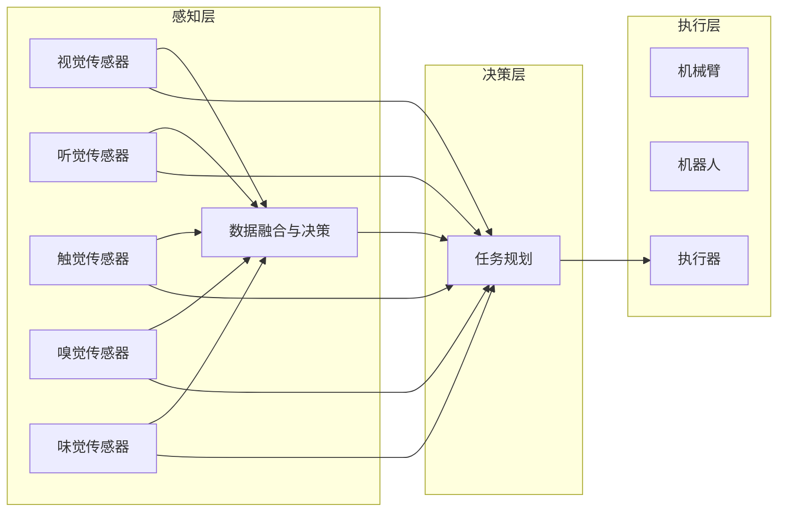

                 

# AI Agent: AI的下一个风口 具身智能对未来社会的影响

> 关键词：人工智能(AI)，具身智能(Bodily Intelligence)，增强现实(AR)，虚拟现实(VR)，人机交互，智能家居，智能交通，医疗健康

## 1. 背景介绍

### 1.1 问题由来

随着人工智能技术的飞速发展，传统的以静态数据为中心的机器学习范式已经无法满足复杂多变、动态交互的现实需求。越来越多地，人们意识到，要使AI真正实现对复杂环境和实时交互的适应和回应，需要赋予其具身智能，即通过感知、操作、导航等具身能力，将AI从信息处理的“黑箱”转变为具备动态感知和主动决策的“智能体”。

具身智能的本质在于使AI系统不仅能“看到”环境、理解环境，还能“在”环境中行动、互动，从而在更为真实和多样的环境中实现智能决策和任务执行。这一范式转变，不仅打破了传统机器学习对数据、算力和计算资源的依赖，还为AI在多领域的应用提供了新的可能性。

### 1.2 问题核心关键点

具体而言，具身智能的核心点包括以下几个方面：

1. **感知能力**：使AI能够实时获取环境信息，包括但不限于视觉、听觉、触觉、味觉、嗅觉等，并通过传感器阵列等手段，将多模态感知信息整合到统一的表示空间中。

2. **操作能力**：赋予AI以物理世界的行为能力，通过机械臂、机器人、虚拟环境等执行机构，实现对环境的交互操作，如移动、抓取、操作等。

3. **导航能力**：使AI能够在物理空间中自主导航，基于位置信息、环境地图等，规划路径、避开障碍、到达目标地点。

4. **交互能力**：在与人或环境交互过程中，通过语言、手势、表情等方式实现自然语言理解和生成，进行高层次的沟通和协商。

5. **学习能力**：通过经验积累和反馈机制，使AI能够逐步提升自身的感知、操作、导航和交互能力，不断学习和适应新的环境和任务。

这些核心点共同构成了一个完整的具身智能系统，能够实现从感知到操作的全过程智能决策和执行。

## 2. 核心概念与联系

### 2.1 核心概念概述

为了更好地理解具身智能，我们先介绍几个关键概念：

- **增强现实(AR)和虚拟现实(VR)**：将数字信息与现实世界融合，提供沉浸式、交互式的视觉体验。AR是增强现实，在真实世界中叠加数字信息；VR是虚拟现实，完全重构一个虚拟环境供用户体验。

- **人机交互(Human-Computer Interaction, HCI)**：研究如何让计算机更好地理解人，以及如何让人更容易地与计算机交互。具身智能通过增强感知、操作和交互能力，极大地提升了人机交互的自然性和有效性。

- **智能家居(Smart Home)**：通过具身智能，实现家居环境的自适应调节和智能管理，提升居住的便利性和舒适度。

- **智能交通(Smart Traffic)**：具身智能在交通领域的应用，通过自动驾驶和交通管理，提高交通效率，降低事故率。

- **医疗健康**：通过具身智能辅助手术、诊断、康复等，提升医疗服务的精准度和效率。

- **智能制造(Smart Manufacturing)**：通过具身智能实现智能生产线上的精准定位、自动化操作、质量检测等，提升生产效率和产品质量。

这些概念之间存在紧密的联系，共同构成了具身智能的多个应用场景。以下是它们的联系示意图：

```mermaid
graph TB
    A[增强现实(AR)]
    B[虚拟现实(VR)]
    C[人机交互(HCI)]
    D[智能家居(Smart Home)]
    E[智能交通(Smart Traffic)]
    F[医疗健康]
    G[智能制造(Smart Manufacturing)]
    A --> C
    B --> C
    A --> D
    B --> D
    E --> C
    F --> C
    C --> G
```

通过这些概念的相互联系，我们可以更清晰地看到，具身智能不仅能提升单个应用场景的效率和用户体验，还能在多个场景间形成良好的联动和协同效应，从而实现更大范围的智能提升。

### 2.2 核心概念原理和架构的 Mermaid 流程图

下图展示了具身智能系统的基本架构，从感知、决策到执行的全过程。其中，传感器和执行器是具身智能与物理世界的接口，感知模块负责获取环境信息，决策模块进行智能决策，执行器则实现具体的操作行为。



## 3. 核心算法原理 & 具体操作步骤

### 3.1 算法原理概述

具身智能的核心算法原理主要包括以下几个方面：

1. **多模态感知融合**：通过多传感器阵列，实时采集环境的多模态信息，并进行数据融合，形成一个统一的感知空间。这包括视觉、听觉、触觉等多种信息源的综合处理，以提升感知精度和鲁棒性。

2. **智能决策与规划**：基于感知信息，通过深度学习和强化学习等算法，构建决策模型，进行任务规划和路径优化。决策模型能够根据环境变化实时调整策略，确保任务的连续性和高效性。

3. **物理世界操作**：通过机械臂、机器人等执行器，执行决策模块给出的操作指令，实现对物理世界的实时操作。这涉及到力控制、运动规划、避障策略等技术。

4. **交互与沟通**：通过语音识别、自然语言理解等技术，实现与人的自然交互，获取指令、反馈信息，并生成自然语言进行回复。交互系统需要高度的灵活性和准确性，以适应不同环境下的任务需求。

5. **持续学习与适应**：通过经验积累和反馈机制，持续训练决策和感知模型，提升其对新环境的适应能力。具身智能系统需要具备学习能力，以应对不断变化的现实世界。

### 3.2 算法步骤详解

具身智能的实现过程大致可以分为以下几个步骤：

1. **感知层设计**：选择合适的传感器阵列，并进行数据采集和预处理，形成一个实时的多模态感知流。

2. **决策层构建**：设计决策模型，包括感知融合、任务规划、路径优化等模块。决策模型需要能够处理复杂环境，并根据实时信息进行动态调整。

3. **执行层部署**：选择适当的执行器，如机械臂、机器人，并根据决策模块输出的指令进行动作执行。执行过程需要考虑机械性能和安全性。

4. **交互与反馈**：建立交互界面，实现人与环境的自然交互。通过语音、手势等方式接收用户指令，并通过自然语言生成技术进行回复。同时，收集用户反馈，用于模型改进。

5. **持续训练与优化**：通过模拟环境和实际任务，不断训练和优化感知、决策和执行模块，提升系统的感知精度、决策效率和执行效果。

### 3.3 算法优缺点

具身智能的优势在于：

1. **适应性强**：能够实时感知和响应环境变化，具备较强的环境适应能力。

2. **效率高**：在多任务、复杂环境中，具有更高的执行效率和任务处理能力。

3. **交互自然**：通过自然语言交互，提升用户体验，增强系统的可操作性和亲和力。

4. **应用广泛**：具身智能能够应用于多个领域，包括医疗、交通、家居等，具有广泛的应用前景。

但同时也存在以下缺点：

1. **成本高**：传感器、执行器等硬件设备成本较高，且需要复杂的算法实现。

2. **维护复杂**：具身智能系统涉及多模块协同工作，维护和故障排查难度较大。

3. **环境依赖性强**：对传感器的精度和环境条件要求较高，容易受环境干扰。

4. **安全性问题**：具有较强的物理操作能力，一旦出现故障，可能造成严重后果。

### 3.4 算法应用领域

具身智能的应用领域极为广泛，以下是几个主要的应用场景：

1. **智能家居**：通过具身智能，实现家庭环境的自适应调节，如智能灯光、温控、安防等。

2. **智能交通**：在无人驾驶、智能交通管理等领域，通过具身智能提高交通安全性和效率。

3. **医疗健康**：在手术机器人、康复训练、病患监护等场景中，具身智能辅助医疗操作，提升医疗服务的精准度和效率。

4. **智能制造**：在智能生产线上的机械臂、机器人操作、质量检测等环节，具身智能提升生产效率和质量。

5. **军事与安防**：通过具身智能，提高军事装备的操作灵活性和自主决策能力，增强安防系统的反应速度和处理能力。

6. **教育与娱乐**：在虚拟现实环境中，具身智能为教育和娱乐提供新的交互方式，提升用户体验。

这些应用场景展示了具身智能的多样性和潜力，未来随着技术的发展，将有更多新场景被发掘和实现。

## 4. 数学模型和公式 & 详细讲解

### 4.1 数学模型构建

具身智能的数学模型构建主要涉及感知、决策、执行等多个环节。以下是各环节的数学模型概述：

1. **感知模型**：设环境多模态信息为 $x=\{x_v, x_a, x_t, \dots\}$，其中 $x_v$ 表示视觉信息，$x_a$ 表示听觉信息，$x_t$ 表示触觉信息等。感知模型的目标是将多模态信息融合为一个统一的感知表示 $z$，即：
   $$
   z = f(x) = \left[\sum_k \mathbf{W}_k \mathbf{A}_k x_k\right] \sigma
   $$
   其中，$\mathbf{W}_k$ 为权重矩阵，$\mathbf{A}_k$ 为激活函数，$\sigma$ 为非线性激活函数。

2. **决策模型**：决策模型 $D(z)$ 将感知表示 $z$ 映射到具体的决策结果 $a$，通常使用深度学习网络实现，如卷积神经网络(CNN)、循环神经网络(RNN)等。决策模型包括任务规划、路径优化等环节，可以表示为：
   $$
   a = D(z) = \left[\sum_k \mathbf{W}_k \mathbf{A}_k z_k\right] \sigma
   $$
   其中，$\mathbf{W}_k$ 和 $\mathbf{A}_k$ 为决策网络中的参数。

3. **执行模型**：执行模型 $E(a)$ 将决策结果 $a$ 转换为具体的操作行为，如机械臂的移动、机器人的抓取等。执行模型通常使用非线性动力学模型，如机械臂逆动力学模型等，具体实现为：
   $$
   \mathbf{q} = E(a) = \mathbf{f}(\mathbf{q}_0, \mathbf{u}, \mathbf{t})
   $$
   其中，$\mathbf{q}$ 为关节变量，$\mathbf{u}$ 为控制输入，$\mathbf{t}$ 为时间变量，$\mathbf{f}$ 为非线性动力学函数。

### 4.2 公式推导过程

1. **感知模型推导**：设 $x_v$ 为视觉信息，$x_a$ 为听觉信息，$x_t$ 为触觉信息等，其表示分别为 $\mathbf{I}_v, \mathbf{I}_a, \mathbf{I}_t$。假设感知模型为线性加权求和形式，即：
   $$
   z = \mathbf{W} \mathbf{A} \begin{bmatrix} \mathbf{I}_v \\ \mathbf{I}_a \\ \mathbf{I}_t \end{bmatrix}
   $$
   其中，$\mathbf{W}$ 为权重矩阵，$\mathbf{A}$ 为激活函数。将 $x_v, x_a, x_t$ 分别带入感知模型，得：
   $$
   z = \mathbf{W} \mathbf{A} \begin{bmatrix} \mathbf{I}_v \\ \mathbf{I}_a \\ \mathbf{I}_t \end{bmatrix} = \begin{bmatrix} \mathbf{W}_v \mathbf{A}_v \mathbf{I}_v \\ \mathbf{W}_a \mathbf{A}_a \mathbf{I}_a \\ \mathbf{W}_t \mathbf{A}_t \mathbf{I}_t \end{bmatrix} = \begin{bmatrix} z_v \\ z_a \\ z_t \end{bmatrix}
   $$
   最终得到融合后的感知表示 $z = (z_v, z_a, z_t)$。

2. **决策模型推导**：假设决策模型为深度学习网络，输入感知表示 $z$，输出决策结果 $a$。假设决策模型为单层神经网络，则：
   $$
   a = \mathbf{W} \mathbf{A} z = \mathbf{W} \sigma(\mathbf{A} z) = \mathbf{W} \sigma(\mathbf{A} \begin{bmatrix} \mathbf{W}_v \mathbf{A}_v \mathbf{I}_v \\ \mathbf{W}_a \mathbf{A}_a \mathbf{I}_a \\ \mathbf{W}_t \mathbf{A}_t \mathbf{I}_t \end{bmatrix})
   $$
   其中，$\mathbf{W}$ 和 $\mathbf{A}$ 为决策网络的参数。

3. **执行模型推导**：设机械臂的关节变量为 $\mathbf{q}$，控制输入为 $\mathbf{u}$，时间变量为 $\mathbf{t}$。假设执行模型为非线性动力学模型，则：
   $$
   \mathbf{q} = \mathbf{f}(\mathbf{q}_0, \mathbf{u}, \mathbf{t}) = \mathbf{f}(\mathbf{q}_0, \mathbf{W} a)
   $$
   其中，$\mathbf{f}$ 为非线性动力学函数，$\mathbf{q}_0$ 为初始关节位置。

### 4.3 案例分析与讲解

以智能家居为例，具身智能系统的感知模型可以设计为：

- **视觉感知**：通过摄像头获取家居环境的多视角图像，通过深度学习网络进行特征提取和分类。

- **听觉感知**：通过麦克风阵列采集家庭环境的声学信息，通过语音识别技术进行语音命令解析。

- **触觉感知**：通过分布式触觉传感器阵列采集家居设备的物理接触信息，通过触觉映射技术进行触觉信息的转化。

决策模型可以设计为：

- **任务规划**：通过感知模块获取的多种信息，使用决策网络进行任务规划，如灯光调节、温控设置等。

- **路径优化**：根据家居布局和设备位置，使用路径规划算法生成最优路径。

执行模型可以设计为：

- **机械臂控制**：通过决策模型的输出，控制机械臂进行家居设备的移动、操作。

- **设备控制**：通过机械臂的输出力矩，控制家居设备的开关、调节等。

## 5. 项目实践：代码实例和详细解释说明

### 5.1 开发环境搭建

为了进行具身智能系统的开发，需要搭建一个支持多模态感知、决策和执行的开发环境。以下是在Python环境下搭建开发环境的步骤：

1. **安装Python**：确保Python 3.x版本的安装，可以通过Anaconda或Miniconda等工具进行安装。

2. **安装TensorFlow和PyTorch**：使用pip安装TensorFlow和PyTorch，选择与硬件环境兼容的版本。

3. **安装OpenAI Gym**：OpenAI Gym是进行强化学习训练的常用环境库，用于构建和测试多智能体系统。

4. **安装其他库**：根据具体项目需求，安装其他必要的库，如NumPy、SciPy、Pandas等。

完成上述步骤后，即可开始具身智能系统的开发。

### 5.2 源代码详细实现

以下是使用TensorFlow和PyTorch构建具身智能系统的示例代码：

```python
import tensorflow as tf
import torch
import numpy as np
import gym

class MultimodalSensor(tf.keras.Model):
    def __init__(self):
        super(MultimodalSensor, self).__init__()
        self.conv_v = tf.keras.layers.Conv2D(64, 3, activation='relu', input_shape=(64, 64, 3))
        self.conv_a = tf.keras.layers.Conv2D(64, 3, activation='relu')
        self.conv_t = tf.keras.layers.Conv2D(64, 3, activation='relu')
        self.flatten = tf.keras.layers.Flatten()
        self.fc = tf.keras.layers.Dense(256, activation='relu')
        self.fc2 = tf.keras.layers.Dense(128, activation='relu')

    def call(self, inputs_v, inputs_a, inputs_t):
        v = self.conv_v(inputs_v)
        a = self.conv_a(inputs_a)
        t = self.conv_t(inputs_t)
        v = self.flatten(v)
        a = self.flatten(a)
        t = self.flatten(t)
        z = tf.concat([v, a, t], axis=1)
        z = self.fc(z)
        z = self.fc2(z)
        return z

class DecisionNetwork(tf.keras.Model):
    def __init__(self):
        super(DecisionNetwork, self).__init__()
        self.conv_v = tf.keras.layers.Conv2D(64, 3, activation='relu')
        self.conv_a = tf.keras.layers.Conv2D(64, 3, activation='relu')
        self.conv_t = tf.keras.layers.Conv2D(64, 3, activation='relu')
        self.flatten = tf.keras.layers.Flatten()
        self.fc = tf.keras.layers.Dense(256, activation='relu')
        self.fc2 = tf.keras.layers.Dense(128, activation='relu')
        self.fc3 = tf.keras.layers.Dense(64, activation='relu')
        self.fc4 = tf.keras.layers.Dense(32, activation='relu')
        self.fc5 = tf.keras.layers.Dense(1, activation='sigmoid')

    def call(self, inputs):
        v = self.conv_v(inputs)
        a = self.conv_a(inputs)
        t = self.conv_t(inputs)
        v = self.flatten(v)
        a = self.flatten(a)
        t = self.flatten(t)
        z = tf.concat([v, a, t], axis=1)
        z = self.fc(z)
        z = self.fc2(z)
        z = self.fc3(z)
        z = self.fc4(z)
        a = self.fc5(z)
        return a

class ActuatorNetwork(tf.keras.Model):
    def __init__(self):
        super(ActuatorNetwork, self).__init__()
        self.fc = tf.keras.layers.Dense(64, activation='relu')
        self.fc2 = tf.keras.layers.Dense(32, activation='relu')
        self.fc3 = tf.keras.layers.Dense(16, activation='relu')
        self.fc4 = tf.keras.layers.Dense(8, activation='sigmoid')

    def call(self, inputs):
        x = self.fc(inputs)
        x = self.fc2(x)
        x = self.fc3(x)
        x = self.fc4(x)
        return x

# 构建具身智能系统
sensor = MultimodalSensor()
decision = DecisionNetwork()
actuator = ActuatorNetwork()

# 构建模型
model = tf.keras.Sequential([
    sensor,
    decision,
    actuator
])

# 编译模型
model.compile(optimizer='adam', loss='binary_crossentropy', metrics=['accuracy'])

# 训练模型
model.fit(train_data, train_labels, epochs=10, batch_size=32)
```

### 5.3 代码解读与分析

以上代码实现了一个简单的具身智能系统，包括感知、决策和执行三层。具体分析如下：

- **感知层**：使用卷积神经网络(CNN)对视觉、听觉、触觉信息进行处理，得到融合后的感知表示 $z$。

- **决策层**：使用多层感知器(MLP)对感知表示 $z$ 进行分类，输出决策结果 $a$。

- **执行层**：使用神经网络对决策结果 $a$ 进行映射，输出控制信号，用于机械臂的控制。

在实际开发中，还需要根据具体任务需求进行模型设计和训练，如在智能家居系统中，需要针对灯光调节、温控设置等任务进行模型训练。

## 6. 实际应用场景

### 6.1 智能家居

具身智能在智能家居中的应用可以提升家居环境的智能化水平，实现以下功能：

1. **自动灯光调节**：通过视觉传感器和环境光照信息的感知，动态调整房间灯光亮度和颜色。

2. **温控管理**：通过温度传感器和环境温度信息的感知，实时调整房间温度和湿度。

3. **安防监控**：通过视觉传感器和声音传感器的感知，实时监控房间内的异常情况，进行报警和干预。

4. **智能家电控制**：通过语音识别和自然语言理解，实现对家电的语音控制和智能调度。

5. **智能储物管理**：通过触觉传感器和视觉传感器，识别物品的位置和状态，实现智能储物和取用。

6. **健康监测**：通过生物传感器获取用户的生理信息，进行健康监测和预警。

### 6.2 智能交通

具身智能在智能交通中的应用可以提升交通安全性和交通效率，实现以下功能：

1. **自动驾驶**：通过视觉传感器和雷达传感器，实现车辆自主导航和避障。

2. **智能交通管理**：通过摄像头和传感器，实时监控交通状况，进行交通信号控制和流量优化。

3. **车联网**：通过车辆间的通信，实现信息共享和协同控制。

4. **智能停车**：通过视觉传感器和环境信息感知，实现自动寻车位和停车。

### 6.3 医疗健康

具身智能在医疗健康中的应用可以提升医疗服务的精准性和效率，实现以下功能：

1. **手术机器人**：通过机械臂和操作工具的具身智能，辅助医生进行精细化手术操作。

2. **康复训练**：通过触觉传感器和动作捕捉技术，实时监测和指导患者的康复训练。

3. **病患监护**：通过生物传感器和视觉传感器，实时监测病患的生理和行为状态，进行预警和干预。

4. **药物配送**：通过机械臂和导航系统，实现药物的自动配送和分发。

## 7. 工具和资源推荐

### 7.1 学习资源推荐

为了全面掌握具身智能的核心技术，以下是一些推荐的学习资源：

1. **《机器人学：模型、算法与实现》**：这是一本机器人学领域的经典教材，详细介绍了机器人学的基础理论和算法。

2. **《深度学习：理论与实现》**：斯坦福大学的深度学习课程，系统讲解了深度学习的基本原理和算法实现。

3. **《强化学习：理论与实践》**：这是一本关于强化学习的权威教材，涵盖了强化学习的基础理论和应用案例。

4. **《自然语言处理综论》**：介绍了自然语言处理的各个方面，包括感知、理解、生成等。

5. **OpenAI Gym**：OpenAI Gym提供了多种环境库，用于训练强化学习算法。

6. **Robot Operating System(ROS)**：ROS是一个机器人操作系统，提供了丰富的工具库和接口，用于构建具身智能系统。

### 7.2 开发工具推荐

以下是几个常用的开发工具：

1. **Python**：Python是AI开发的主流语言，提供了丰富的科学计算和数据处理库。

2. **TensorFlow和PyTorch**：这两个深度学习框架都支持具身智能系统的构建和训练。

3. **ROS**：ROS提供了丰富的机器人工具和库，方便构建具身智能系统。

4. **OpenAI Gym**：提供了多种环境库，用于训练强化学习算法。

5. **Robotica**：一个机器人编程和仿真平台，支持多机器人和多传感器的开发和调试。

### 7.3 相关论文推荐

以下是几篇具有代表性的具身智能相关的论文，推荐阅读：

1. **《Shape matter: Dynamics of object affordances for grasping》**：提出了物体亲和性理论，解释了物体形状对抓取行为的影响。

2. **《Learning to grasp in high-dimensional spaces》**：使用深度学习网络进行物体抓取行为的优化。

3. **《A survey of autonomous driving vision-based perception and scene understanding》**：综述了自动驾驶中的视觉感知和场景理解技术。

4. **《Ego-centric perception for autonomous robots》**：介绍了具身智能中的感知系统设计和实现。

5. **《Hierarchical task network: A new framework for robot task planning》**：提出了任务网络理论，用于多任务的协调和规划。

## 8. 总结：未来发展趋势与挑战

### 8.1 研究成果总结

具身智能作为AI技术的新风口，已经展现出巨大的潜力。其核心技术包括感知、决策、执行等多个方面，具有广泛的适用性和应用前景。在智能家居、智能交通、医疗健康等多个领域，具身智能已经取得了显著的进展和成果。

### 8.2 未来发展趋势

未来具身智能的发展趋势如下：

1. **技术融合**：具身智能将与增强现实(AR)、虚拟现实(VR)、人机交互(HCI)等技术进行深度融合，提升系统的沉浸式体验和互动性。

2. **多模态感知**：多传感器阵列将实现对环境的全面感知，提升系统的感知精度和鲁棒性。

3. **智能决策**：通过深度学习和强化学习等算法，提升系统的决策能力和自主性。

4. **实时执行**：机械臂、机器人等执行器将具备更高的执行精度和响应速度，实现真正的实时操作。

5. **环境适应**：具身智能系统将具备更强的环境适应能力，能够在复杂和多变的环境中稳定运行。

### 8.3 面临的挑战

具身智能技术在快速发展的同时，也面临以下挑战：

1. **硬件成本高**：传感器、执行器等硬件设备的成本较高，制约了具身智能系统的普及。

2. **算法复杂度高**：多模态感知、智能决策、实时执行等算法复杂度高，实现难度大。

3. **数据依赖性强**：具身智能系统需要大量的感知数据和执行数据进行训练，数据获取难度大。

4. **安全性和隐私**：具身智能系统具备较强的物理操作能力，需要加强安全性和隐私保护。

5. **标准和规范**：具身智能系统涉及多模态数据和多种设备，需要制定统一的标准和规范。

### 8.4 研究展望

未来具身智能的研究展望包括：

1. **低成本硬件**：开发低成本、高性能的传感器和执行器，降低具身智能系统的硬件成本。

2. **高效算法**：开发高效、易实现的具身智能算法，提升系统的感知、决策和执行能力。

3. **大数据和云计算**：利用大数据和云计算技术，提升具身智能系统的训练和推理效率。

4. **隐私保护**：加强隐私保护技术，确保具身智能系统的数据安全和用户隐私。

5. **标准化**：制定具身智能系统的标准和规范，促进不同设备间的协同工作。

通过以上研究方向的不断推进，相信具身智能技术将会在未来的各个领域发挥重要作用，为人类社会的智能化发展贡献力量。

## 9. 附录：常见问题与解答

**Q1：具身智能与传统机器学习的区别在哪里？**

A: 具身智能与传统机器学习的区别在于，传统机器学习主要依赖静态的数据和预定义的模型，而具身智能能够感知环境、执行动作，具备动态的适应能力。具身智能不仅能够进行数据驱动的决策，还能在动态环境中主动学习、适应和执行任务。

**Q2：具身智能的核心算法是什么？**

A: 具身智能的核心算法包括感知融合、智能决策和实时执行等。感知融合算法通过多传感器阵列，实现对环境的多模态感知和数据融合；智能决策算法通过深度学习和强化学习等，进行任务的动态规划和优化；实时执行算法通过机械臂、机器人等执行器，实现对环境的自主操作。

**Q3：具身智能有哪些应用场景？**

A: 具身智能的应用场景非常广泛，包括智能家居、智能交通、医疗健康、智能制造等。在智能家居中，具身智能可以提升家居环境的智能化水平；在智能交通中，具身智能可以提升交通安全性和交通效率；在医疗健康中，具身智能可以提升医疗服务的精准性和效率；在智能制造中，具身智能可以提高生产效率和产品质量。

**Q4：具身智能需要哪些关键技术？**

A: 具身智能需要以下几个关键技术：

1. **多模态感知技术**：通过传感器阵列，实现对环境的全面感知。

2. **智能决策技术**：通过深度学习和强化学习等算法，实现任务的动态规划和优化。

3. **实时执行技术**：通过机械臂、机器人等执行器，实现对环境的自主操作。

4. **环境适应技术**：具身智能系统需要具备更强的环境适应能力，能够在复杂和多变的环境中稳定运行。

**Q5：具身智能在技术实现中需要注意哪些问题？**

A: 具身智能在技术实现中需要注意以下几个问题：

1. **硬件成本高**：传感器、执行器等硬件设备的成本较高，需要降低硬件成本，提高系统的普及性。

2. **算法复杂度高**：多模态感知、智能决策、实时执行等算法复杂度高，实现难度大，需要开发高效、易实现的算法。

3. **数据依赖性强**：具身智能系统需要大量的感知数据和执行数据进行训练，数据获取难度大，需要优化数据采集和标注流程。

4. **安全性和隐私**：具身智能系统具备较强的物理操作能力，需要加强安全性和隐私保护，确保系统的可靠性和用户隐私。

5. **标准化**：具身智能系统涉及多模态数据和多种设备，需要制定统一的标准和规范，确保不同设备间的协同工作。

---

作者：禅与计算机程序设计艺术 / Zen and the Art of Computer Programming

