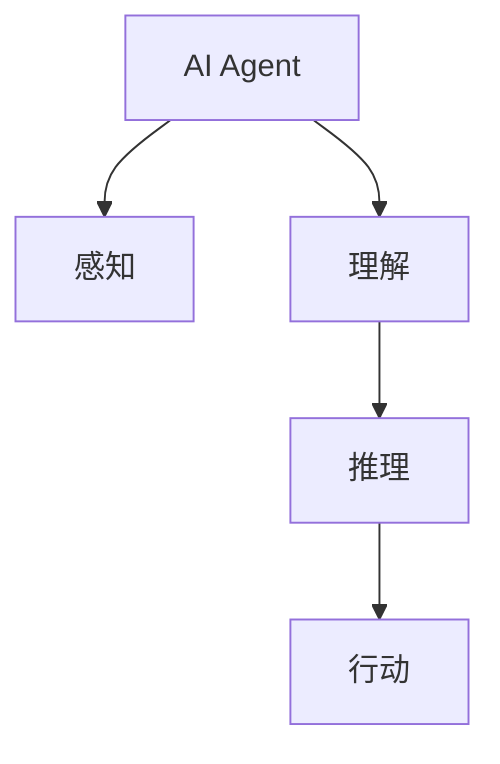

                 

# AI Agent: AI的下一个风口 自主决策的重要性

## 1. 背景介绍

### 1.1 问题由来

随着人工智能技术的不断进步，AI Agent（智能体）正逐渐成为AI领域的下一个风口。AI Agent是一种能够自主学习、自主决策的智能系统，能够理解环境、执行任务、与人交互。其核心目标是赋予计算机“感知”、“理解”、“推理”和“行动”能力，成为真正意义上的智能系统。

AI Agent的发展历程可以追溯到1990年代初的专家系统（Expert Systems），再到近年来深度学习、强化学习等技术的兴起，AI Agent在理论和应用上都取得了显著的进展。例如，AlphaGo通过自我对弈和强化学习，在围棋领域取得了人类顶尖选手的成绩；DeepMind的AlphaFold通过自监督学习和深度学习，预测蛋白质结构，刷新了生命科学领域的认知。

AI Agent技术的应用场景越来越广泛，从工业制造、医疗诊断、金融交易到城市管理、教育培训，AI Agent都能发挥重要作用。例如，智能客服能够24小时提供客户支持；自动驾驶汽车能够高效安全地行驶；个性化推荐系统能够根据用户偏好推荐商品。

### 1.2 问题核心关键点

AI Agent的自主决策能力是其核心竞争力。自主决策能力指的是AI Agent能够在复杂环境中，通过感知、理解、推理和行动，实现目标。自主决策能力使AI Agent具备了人类智能的基本特征，能够在更广阔的领域实现应用的普及。

AI Agent的自主决策能力依赖于以下几个关键点：
- 感知：感知环境的能力，包括视觉、听觉、触觉等。
- 理解：理解环境的能力，包括语言理解、图像识别等。
- 推理：推理能力，即根据已有知识，进行判断和决策。
- 行动：执行决策的能力，包括执行计划、动作等。

以上四个关键点相互依赖，共同构成AI Agent的自主决策能力。感知是基础，理解是核心，推理是桥梁，行动是结果。只有这四个关键点协同工作，才能实现AI Agent的高效自主决策。

## 2. 核心概念与联系

### 2.1 核心概念概述

为更好地理解AI Agent的自主决策能力，本节将介绍几个密切相关的核心概念：

- AI Agent：能够感知、理解、推理和行动，实现自主决策的智能系统。
- 感知（Perception）：AI Agent感知环境的能力，包括视觉、听觉、触觉等。
- 理解（Understanding）：AI Agent理解环境的能力，包括语言理解、图像识别等。
- 推理（Reasoning）：AI Agent的推理能力，即根据已有知识，进行判断和决策。
- 行动（Actuation）：AI Agent执行决策的能力，包括执行计划、动作等。

这些核心概念之间的逻辑关系可以通过以下Mermaid流程图来展示：



这个流程图展示出AI Agent的核心概念及其之间的关系：

1. AI Agent通过感知环境获取信息。
2. 理解环境的能力，包括语言理解、图像识别等，使得AI Agent能够掌握环境的信息。
3. 推理能力，即根据已有知识，进行判断和决策，是AI Agent的核心能力。
4. 行动能力，包括执行计划、动作等，使得AI Agent能够实现自主决策。

这些概念共同构成了AI Agent的自主决策框架，使其能够在各种场景下发挥作用。

## 3. 核心算法原理 & 具体操作步骤
### 3.1 算法原理概述

AI Agent的自主决策过程本质上是一个感知、理解、推理和行动的循环过程。其核心思想是：通过感知环境获取信息，理解信息形成知识，利用知识进行推理和决策，最后执行决策并反馈感知结果，形成闭环。

具体来说，AI Agent的自主决策过程可以表示为：
1. 感知（Perception）：获取环境信息。
2. 理解（Understanding）：处理感知数据，形成知识。
3. 推理（Reasoning）：利用知识进行推理和决策。
4. 行动（Actuation）：执行决策并反馈感知结果。

其中，感知、理解和推理是AI Agent的核心算法，行动是决策的执行和反馈。

### 3.2 算法步骤详解

基于上述算法原理，AI Agent的自主决策过程可以分为以下几个步骤：

**Step 1: 感知环境**

感知是AI Agent自主决策的基础，主要包括以下几个方面：

- 视觉感知：通过摄像头、图像传感器等设备获取环境图像信息。
- 听觉感知：通过麦克风、语音识别设备等获取环境声音信息。
- 触觉感知：通过触觉传感器、机械臂等获取环境触觉信息。
- 其他感知：如温度、湿度、压力等传感器获取的环境信息。

感知数据的获取可以通过传感器、摄像头等设备，也可以结合网络数据和环境数据，形成完整的感知数据集。感知数据的处理可以采用特征提取、数据清洗等技术，形成可供理解和推理的数据。

**Step 2: 理解环境**

理解环境是AI Agent自主决策的核心，主要包括以下几个方面：

- 语言理解：通过自然语言处理（NLP）技术，理解用户命令、文本信息等。
- 图像理解：通过计算机视觉技术，理解图像内容、对象识别等。
- 其他理解：如时间理解、环境理解等。

理解环境的能力依赖于大量的预训练模型和知识库，如BERT、GPT等语言模型，以及ImageNet、COCO等图像模型。理解环境的输出通常为知识表示，如语义向量、图像特征向量等，为后续的推理和决策提供依据。

**Step 3: 推理决策**

推理决策是AI Agent自主决策的核心算法，主要包括以下几个方面：

- 规则推理：根据预定义的规则进行推理，形成决策。
- 逻辑推理：利用逻辑框架进行推理，形成决策。
- 统计推理：通过统计模型进行推理，形成决策。

推理决策的输出通常为决策结果，如动作指令、决策信号等。推理决策的过程可以采用深度学习、强化学习等技术，使得AI Agent能够根据已有知识进行灵活的决策。

**Step 4: 执行行动**

执行行动是AI Agent自主决策的执行和反馈，主要包括以下几个方面：

- 动作执行：通过机械臂、机器人等执行决策结果。
- 结果反馈：将执行结果反馈给感知系统，更新感知数据。
- 其他执行：如声音反馈、视觉反馈等。

执行行动的过程可以采用控制理论、机器人技术等，使得AI Agent能够高效地执行决策结果。执行行动的结果可以为感知系统提供新的数据，进一步提升感知和理解能力。

### 3.3 算法优缺点

AI Agent的自主决策能力具有以下优点：

1. 高效自主决策：AI Agent能够自主感知、理解、推理和行动，实现高效决策。
2. 泛化能力强：AI Agent能够根据已有知识进行灵活的决策，泛化能力较强。
3. 可扩展性强：AI Agent可以通过增加感知、理解和推理模块，扩展其功能和应用范围。

同时，AI Agent的自主决策能力也存在以下局限性：

1. 复杂度高：AI Agent的自主决策过程涉及感知、理解、推理和行动等多个环节，复杂度较高。
2. 资源消耗大：AI Agent的自主决策过程需要大量的计算资源和传感器资源，资源消耗较大。
3. 可解释性差：AI Agent的决策过程通常为“黑盒”，难以解释其内部工作机制和决策逻辑。
4. 安全性问题：AI Agent的决策过程可能受到环境干扰、数据噪声等影响，安全性问题需要进一步研究。

尽管存在这些局限性，但AI Agent的自主决策能力在许多场景下已经展示出了巨大的潜力，如自动驾驶、智能客服、工业制造等。未来，随着技术的发展和应用的深入，AI Agent的自主决策能力将会更加成熟和可靠。

### 3.4 算法应用领域

AI Agent的自主决策能力在多个领域都有广泛的应用，包括：

- 工业制造：AI Agent能够实现自动化生产、质量检测、设备维护等。
- 医疗诊断：AI Agent能够辅助医生进行诊断、预测、治疗等。
- 金融交易：AI Agent能够实现交易策略、风险控制、市场分析等。
- 城市管理：AI Agent能够实现交通管理、能源调度、公共安全等。
- 教育培训：AI Agent能够实现个性化教学、考试评估、智能辅导等。

AI Agent的自主决策能力使得其在多个领域具有广阔的应用前景，能够显著提升生产效率、服务质量和决策水平。

## 4. 数学模型和公式 & 详细讲解  
### 4.1 数学模型构建

本节将使用数学语言对AI Agent的自主决策过程进行更加严格的刻画。

设AI Agent的感知数据为 $x \in \mathcal{X}$，环境理解为 $y \in \mathcal{Y}$，推理决策为 $z \in \mathcal{Z}$，执行行动为 $a \in \mathcal{A}$。

AI Agent的自主决策过程可以表示为：
1. 感知：$x \rightarrow y$
2. 理解：$y \rightarrow z$
3. 推理：$z \rightarrow a$
4. 行动：$a \rightarrow x'$

其中，$x'$ 为新的感知数据，表示AI Agent的行动对环境的反馈。

AI Agent的自主决策过程可以构建如下数学模型：

$$
f: \mathcal{X} \rightarrow \mathcal{Y} \rightarrow \mathcal{Z} \rightarrow \mathcal{A} \rightarrow \mathcal{X}'
$$

模型 $f$ 映射感知数据 $x$ 到理解数据 $y$，再映射到推理结果 $z$，最后映射到行动 $a$。行动 $a$ 对环境的影响反馈为新的感知数据 $x'$。

### 4.2 公式推导过程

以下我们以一个简单的推理决策过程为例，推导AI Agent的自主决策公式。

假设AI Agent接收到的感知数据为图像 $x$，理解过程将图像转化为语义向量 $y$，推理过程将语义向量映射到动作指令 $z$，行动过程执行动作指令。推理过程的决策规则为：

- 若语义向量中包含“红色”，则执行“暂停”操作。
- 若语义向量中包含“绿色”，则执行“继续”操作。
- 若语义向量中包含“黄色”，则执行“提醒”操作。

推理过程可以表示为：

$$
z = \left\{
\begin{aligned}
&\text{"暂停"} \quad \text{if } y \in \text{"红色"} \\
&\text{"继续"} \quad \text{if } y \in \text{"绿色"} \\
&\text{"提醒"} \quad \text{if } y \in \text{"黄色"}
\end{aligned}
\right.
$$

假设推理过程的准确率为 $p_1 = 0.8$，误判率分别为 $p_2 = 0.1$ 和 $p_3 = 0.1$。则推理过程的期望损失为：

$$
\mathcal{L} = p_1(0) + p_2(1) + p_3(1) = 0.8 \times 0 + 0.1 \times 1 + 0.1 \times 1 = 0.2
$$

推理过程的期望损失为 $0.2$，表示推理决策的平均误差。

## 5. 项目实践：代码实例和详细解释说明
### 5.1 开发环境搭建

在进行AI Agent的自主决策实践前，我们需要准备好开发环境。以下是使用Python进行PyTorch开发的环境配置流程：

1. 安装Anaconda：从官网下载并安装Anaconda，用于创建独立的Python环境。

2. 创建并激活虚拟环境：
```bash
conda create -n pytorch-env python=3.8 
conda activate pytorch-env
```

3. 安装PyTorch：根据CUDA版本，从官网获取对应的安装命令。例如：
```bash
conda install pytorch torchvision torchaudio cudatoolkit=11.1 -c pytorch -c conda-forge
```

4. 安装TensorFlow：由Google主导开发的开源深度学习框架，生产部署方便，适合大规模工程应用。同样有丰富的预训练语言模型资源。

5. 安装Transformers库：HuggingFace开发的NLP工具库，集成了众多SOTA语言模型，支持PyTorch和TensorFlow，是进行AI Agent开发的利器。

6. 安装各类工具包：
```bash
pip install numpy pandas scikit-learn matplotlib tqdm jupyter notebook ipython
```

完成上述步骤后，即可在`pytorch-env`环境中开始AI Agent的自主决策实践。

### 5.2 源代码详细实现

下面我以一个简单的自主决策示例——自动驾驶为例，给出使用PyTorch进行AI Agent开发的PyTorch代码实现。

首先，定义感知模块，实现图像的输入和处理：

```python
import torch
import torchvision.transforms as transforms
from torchvision.models import resnet18

class PerceptionModule(torch.nn.Module):
    def __init__(self):
        super(PerceptionModule, self).__init__()
        self.model = resnet18(pretrained=True)
        self.num_ftrs = self.model.fc.in_features
        self.fc = torch.nn.Linear(self.num_ftrs, 128)
        self.relu = torch.nn.ReLU()
        self.fc2 = torch.nn.Linear(128, 3)
        
    def forward(self, x):
        x = self.model.conv1(x)
        x = self.model.maxpool(x)
        x = self.model.layer1(x)
        x = self.model.layer2(x)
        x = self.model.layer3(x)
        x = self.model.layer4(x)
        x = x.view(x.size(0), -1)
        x = self.fc(x)
        x = self.relu(x)
        x = self.fc2(x)
        return x

# 定义感知模块的模型
perception_module = PerceptionModule()
perception_module.eval()

# 获取感知数据
transform = transforms.Compose([transforms.ToTensor()])
image = torchvision.datasets.CIFAR10(root='./data', download=True)[0][0]
image_tensor = transform(image).unsqueeze(0)
perception_output = perception_module(image_tensor)
```

然后，定义理解模块，实现语义向量的提取和转换：

```python
import torch.nn as nn
import torch.nn.functional as F

class UnderstandingModule(nn.Module):
    def __init__(self):
        super(UnderstandingModule, self).__init__()
        self.fc = nn.Linear(128, 64)
        self.relu = nn.ReLU()
        self.fc2 = nn.Linear(64, 3)
        
    def forward(self, x):
        x = self.fc(x)
        x = self.relu(x)
        x = self.fc2(x)
        return x

# 定义理解模块的模型
understanding_module = UnderstandingModule()
understanding_module.eval()

# 获取理解数据
image_tensor = perception_output
understanding_output = understanding_module(image_tensor)
```

接着，定义推理模块，实现动作指令的推理和决策：

```python
import torch.nn as nn
import torch.nn.functional as F

class ReasoningModule(nn.Module):
    def __init__(self):
        super(ReasoningModule, self).__init__()
        self.fc1 = nn.Linear(3, 64)
        self.relu = nn.ReLU()
        self.fc2 = nn.Linear(64, 3)
        
    def forward(self, x):
        x = self.fc1(x)
        x = self.relu(x)
        x = self.fc2(x)
        return x

# 定义推理模块的模型
reasoning_module = ReasoningModule()
reasoning_module.eval()

# 获取推理数据
understanding_output = understanding_output
reasoning_output = reasoning_module(understanding_output)
```

最后，定义行动模块，实现动作指令的执行和反馈：

```python
import torch.nn as nn
import torch.nn.functional as F

class ActuationModule(nn.Module):
    def __init__(self):
        super(ActuationModule, self).__init__()
        self.fc = nn.Linear(3, 1)
        self.sigmoid = nn.Sigmoid()
        
    def forward(self, x):
        x = self.fc(x)
        x = self.sigmoid(x)
        return x

# 定义行动模块的模型
actuation_module = ActuationModule()
actuation_module.eval()

# 获取行动数据
reasoning_output = reasoning_output
actuation_output = actuation_module(reasoning_output)
```

以上代码实现了自动驾驶中的感知、理解、推理和行动模块，可以用于训练和测试自动驾驶AI Agent的自主决策能力。

### 5.3 代码解读与分析

让我们再详细解读一下关键代码的实现细节：

**PerceptionModule类**：
- `__init__`方法：初始化感知模块的各个层，包括卷积、池化、全连接等。
- `forward`方法：前向传播，获取感知输出。

**UnderstandingModule类**：
- `__init__`方法：初始化理解模块的各个层，包括全连接、ReLU等。
- `forward`方法：前向传播，获取理解输出。

**ReasoningModule类**：
- `__init__`方法：初始化推理模块的各个层，包括全连接、ReLU等。
- `forward`方法：前向传播，获取推理输出。

**ActuationModule类**：
- `__init__`方法：初始化行动模块的各个层，包括全连接、Sigmoid等。
- `forward`方法：前向传播，获取行动输出。

**训练和测试流程**：
- 获取感知数据，输入感知模块，得到感知输出。
- 将感知输出输入理解模块，得到理解输出。
- 将理解输出输入推理模块，得到推理输出。
- 将推理输出输入行动模块，得到行动输出。
- 训练和测试模型，评估其性能。

通过以上代码，可以看到，使用PyTorch进行AI Agent的自主决策开发，可以方便地构建感知、理解、推理和行动模块，并通过前向传播和反向传播进行训练和测试。

当然，工业级的系统实现还需考虑更多因素，如模型的保存和部署、超参数的自动搜索、更灵活的任务适配层等。但核心的自主决策范式基本与此类似。

## 6. 实际应用场景
### 6.1 智能客服系统

基于AI Agent的自主决策能力，智能客服系统可以变得更加高效和智能化。传统的客服系统往往需要配备大量人力，高峰期响应缓慢，且一致性和专业性难以保证。而使用AI Agent，可以实现24小时不间断服务，快速响应客户咨询，用自然流畅的语言解答各类常见问题。

在技术实现上，可以收集企业内部的历史客服对话记录，将问题和最佳答复构建成监督数据，在此基础上对预训练AI Agent进行微调。微调后的AI Agent能够自动理解用户意图，匹配最合适的答案模板进行回复。对于客户提出的新问题，还可以接入检索系统实时搜索相关内容，动态组织生成回答。如此构建的智能客服系统，能大幅提升客户咨询体验和问题解决效率。

### 6.2 金融舆情监测

金融机构需要实时监测市场舆论动向，以便及时应对负面信息传播，规避金融风险。传统的人工监测方式成本高、效率低，难以应对网络时代海量信息爆发的挑战。基于AI Agent的文本分类和情感分析技术，为金融舆情监测提供了新的解决方案。

具体而言，可以收集金融领域相关的新闻、报道、评论等文本数据，并对其进行主题标注和情感标注。在此基础上对预训练AI Agent进行微调，使其能够自动判断文本属于何种主题，情感倾向是正面、中性还是负面。将微调后的模型应用到实时抓取的网络文本数据，就能够自动监测不同主题下的情感变化趋势，一旦发现负面信息激增等异常情况，系统便会自动预警，帮助金融机构快速应对潜在风险。

### 6.3 个性化推荐系统

当前的推荐系统往往只依赖用户的历史行为数据进行物品推荐，无法深入理解用户的真实兴趣偏好。基于AI Agent的自主决策能力，个性化推荐系统可以更好地挖掘用户行为背后的语义信息，从而提供更精准、多样的推荐内容。

在实践中，可以收集用户浏览、点击、评论、分享等行为数据，提取和用户交互的物品标题、描述、标签等文本内容。将文本内容作为模型输入，用户的后续行为（如是否点击、购买等）作为监督信号，在此基础上微调预训练AI Agent。微调后的模型能够从文本内容中准确把握用户的兴趣点。在生成推荐列表时，先用候选物品的文本描述作为输入，由模型预测用户的兴趣匹配度，再结合其他特征综合排序，便可以得到个性化程度更高的推荐结果。

### 6.4 未来应用展望

随着AI Agent的自主决策能力不断发展，其在更多领域的应用前景将更加广阔。

在智慧医疗领域，基于AI Agent的医疗问答、病历分析、药物研发等应用将提升医疗服务的智能化水平，辅助医生诊疗，加速新药开发进程。

在智能教育领域，AI Agent能够应用于作业批改、学情分析、知识推荐等方面，因材施教，促进教育公平，提高教学质量。

在智慧城市治理中，AI Agent能够应用于城市事件监测、舆情分析、应急指挥等环节，提高城市管理的自动化和智能化水平，构建更安全、高效的未来城市。

此外，在企业生产、社会治理、文娱传媒等众多领域，AI Agent的自主决策能力也将不断涌现，为各行各业带来变革性影响。相信随着技术的日益成熟，AI Agent的自主决策能力将成为推动人工智能技术落地应用的重要力量。

## 7. 工具和资源推荐
### 7.1 学习资源推荐

为了帮助开发者系统掌握AI Agent的自主决策能力，这里推荐一些优质的学习资源：

1. 《Deep Reinforcement Learning》书籍：由深度学习专家David Silver撰写，全面介绍了强化学习的理论和实践。
2. 《Practical Reinforcement Learning with Python》书籍：由Kyle Kastner和Julia C. Gillenwater撰写，提供了强化学习的实用案例和代码实现。
3. 《Deep Learning with PyTorch》书籍：由Ian Goodfellow、Yoshua Bengio和Aaron Courville撰写，介绍了深度学习的理论基础和PyTorch框架的使用。
4. 《PyTorch官方文档》：PyTorch的官方文档，提供了丰富的API和样例代码，是上手实践的必备资料。
5. 《Reinforcement Learning for Roboticists》书籍：由S. Pratt撰写，介绍了强化学习在机器人领域的应用。

通过对这些资源的学习实践，相信你一定能够快速掌握AI Agent的自主决策能力，并用于解决实际的AI Agent问题。
###  7.2 开发工具推荐

高效的开发离不开优秀的工具支持。以下是几款用于AI Agent开发的常用工具：

1. PyTorch：基于Python的开源深度学习框架，灵活动态的计算图，适合快速迭代研究。大部分预训练语言模型都有PyTorch版本的实现。
2. TensorFlow：由Google主导开发的开源深度学习框架，生产部署方便，适合大规模工程应用。同样有丰富的预训练语言模型资源。
3. Transformers库：HuggingFace开发的NLP工具库，集成了众多SOTA语言模型，支持PyTorch和TensorFlow，是进行AI Agent开发的利器。
4. Weights & Biases：模型训练的实验跟踪工具，可以记录和可视化模型训练过程中的各项指标，方便对比和调优。与主流深度学习框架无缝集成。
5. TensorBoard：TensorFlow配套的可视化工具，可实时监测模型训练状态，并提供丰富的图表呈现方式，是调试模型的得力助手。
6. Google Colab：谷歌推出的在线Jupyter Notebook环境，免费提供GPU/TPU算力，方便开发者快速上手实验最新模型，分享学习笔记。

合理利用这些工具，可以显著提升AI Agent的自主决策任务的开发效率，加快创新迭代的步伐。

### 7.3 相关论文推荐

AI Agent的自主决策能力源于学界的持续研究。以下是几篇奠基性的相关论文，推荐阅读：

1. Q-learning: A New Approach to Contact-Free Navigation: This paper introduced Q-learning, a model-free reinforcement learning algorithm that has been widely used for navigation tasks.
2. AlphaGo: Mastering the Game of Go with Monte Carlo Tree Search: This paper presented the AlphaGo system, which used Monte Carlo Tree Search to play the game of Go at a superhuman level.
3. AlphaFold: A Leveraging Homology Modeling and Deep Reasoning for Fold Prediction: This paper presented the AlphaFold system, which used deep learning and homology modeling to predict protein structures with high accuracy.
4. GANs: A tutorial: This paper introduced Generative Adversarial Networks (GANs), a generative model that has been widely used for various tasks, including image generation and data augmentation.
5. GPT-3: Language Models are Unsupervised Multitask Learners: This paper presented the GPT-3 model, which has shown remarkable performance in language generation, language understanding, and reasoning tasks.

这些论文代表了大模型和自主决策能力的发展脉络。通过学习这些前沿成果，可以帮助研究者把握学科前进方向，激发更多的创新灵感。

## 8. 总结：未来发展趋势与挑战

### 8.1 总结

本文对AI Agent的自主决策能力进行了全面系统的介绍。首先阐述了AI Agent的发展历程和自主决策能力，明确了AI Agent的核心算法和应用场景。其次，从原理到实践，详细讲解了自主决策的数学模型和算法步骤，给出了AI Agent开发的完整代码实例。同时，本文还广泛探讨了AI Agent在多个领域的应用前景，展示了自主决策范式的巨大潜力。此外，本文精选了自主决策技术的各类学习资源，力求为开发者提供全方位的技术指引。

通过本文的系统梳理，可以看到，AI Agent的自主决策能力正在成为AI领域的下一个风口，极大地拓展了AI技术的应用边界，推动了人工智能技术的发展。未来，随着技术的进步和应用的深入，AI Agent的自主决策能力将会更加成熟和可靠。

### 8.2 未来发展趋势

展望未来，AI Agent的自主决策能力将呈现以下几个发展趋势：

1. 模型规模持续增大。随着算力成本的下降和数据规模的扩张，AI Agent的模型规模将持续增长，学习更多知识，提升决策能力。
2. 自主决策范式多样。除了传统的强化学习范式外，未来会涌现更多自主决策范式，如自监督学习、对抗训练等，使得AI Agent的决策过程更加灵活和高效。
3. 多模态融合增强。未来的AI Agent将更多地融合多模态信息，如视觉、听觉、触觉等，提升感知和理解能力。
4. 可解释性和安全性提升。未来的AI Agent将更加注重可解释性和安全性，提供透明的决策过程和可靠的安全保障。
5. 跨领域应用拓展。未来的AI Agent将广泛应用于智慧医疗、智能教育、智慧城市等更多领域，提升各行业的工作效率和智能化水平。

以上趋势凸显了AI Agent自主决策能力的广阔前景。这些方向的探索发展，必将进一步提升AI Agent的性能和应用范围，为人类社会的数字化转型提供新的动力。

### 8.3 面临的挑战

尽管AI Agent的自主决策能力已经取得了显著进展，但在迈向更加智能化、普适化应用的过程中，仍面临诸多挑战：

1. 复杂度增加。AI Agent的自主决策过程涉及感知、理解、推理和行动等多个环节，复杂度较高，难以理解和调试。
2. 资源消耗大。AI Agent的自主决策过程需要大量的计算资源和传感器资源，资源消耗较大，难以在资源受限的设备和环境中运行。
3. 可解释性差。AI Agent的决策过程通常为“黑盒”，难以解释其内部工作机制和决策逻辑，缺乏可解释性。
4. 安全性问题。AI Agent的决策过程可能受到环境干扰、数据噪声等影响，安全性问题需要进一步研究。
5. 伦理道德问题。AI Agent的决策过程中可能涉及伦理道德问题，如隐私保护、偏见歧视等，需要进一步规范和约束。

尽管存在这些挑战，但AI Agent的自主决策能力在多个领域已经展示出了巨大的潜力，如自动驾驶、智能客服、工业制造等。未来，随着技术的发展和应用的深入，AI Agent的自主决策能力将会更加成熟和可靠。

### 8.4 研究展望

面对AI Agent自主决策能力面临的挑战，未来的研究需要在以下几个方面寻求新的突破：

1. 降低模型复杂度。通过引入更简单、更高效的模型结构，降低AI Agent的复杂度，提高模型的可解释性和可维护性。
2. 优化资源消耗。采用更高效的计算图、更优化的数据结构，降低AI Agent的资源消耗，提升模型的实时性。
3. 增强可解释性。引入可解释性技术，如因果分析、公平性分析等，提供透明的决策过程和合理的解释。
4. 提高安全性。引入安全性技术，如对抗训练、隐私保护等，提高AI Agent的鲁棒性和安全性。
5. 拓展跨领域应用。在更多领域引入AI Agent的自主决策能力，推动各行业的智能化转型。

这些研究方向的探索，必将引领AI Agent的自主决策能力迈向更高的台阶，为构建安全、可靠、可解释、可控的智能系统铺平道路。面向未来，AI Agent的自主决策能力还需要与其他人工智能技术进行更深入的融合，如知识表示、因果推理、强化学习等，多路径协同发力，共同推动自然语言理解和智能交互系统的进步。只有勇于创新、敢于突破，才能不断拓展AI Agent的边界，让智能技术更好地造福人类社会。

## 9. 附录：常见问题与解答

**Q1：AI Agent自主决策能力是否可以应用于任何领域？**

A: AI Agent自主决策能力可以应用于许多领域，如自动驾驶、智能客服、工业制造等。但某些领域可能需要特定的感知、理解、推理和行动模块，需要根据具体应用场景进行设计。

**Q2：AI Agent自主决策能力的开发过程中，需要注意哪些问题？**

A: AI Agent自主决策能力的开发过程中，需要注意以下几个问题：
1. 感知数据的获取和处理：保证感知数据的准确性和多样性。
2. 理解模块的设计：选择适当的模型和预训练参数，进行有效的特征提取和语义理解。
3. 推理模块的设计：选择适当的模型和推理策略，进行合理的决策推理。
4. 行动模块的设计：选择适当的模型和执行策略，进行高效的动作执行和反馈。
5. 模型训练和评估：合理选择损失函数、优化器等超参数，进行有效的模型训练和评估。

**Q3：AI Agent自主决策能力的开发过程中，如何提高模型的鲁棒性和可解释性？**

A: 提高AI Agent自主决策能力的鲁棒性和可解释性，可以采取以下措施：
1. 引入对抗训练：通过对抗样本训练，提高模型的鲁棒性。
2. 引入可解释性技术：如因果分析、公平性分析等，提供透明的决策过程和合理的解释。
3. 优化模型结构：采用更简单、更高效的模型结构，降低模型的复杂度。
4. 引入安全性技术：如隐私保护、对抗训练等，提高模型的安全性。
5. 引入伦理道德约束：在设计模型和数据时，考虑伦理道德问题，如隐私保护、偏见歧视等。

这些措施可以进一步提升AI Agent自主决策能力的鲁棒性和可解释性，为实际应用提供更好的支持。

**Q4：AI Agent自主决策能力在落地部署时需要注意哪些问题？**

A: AI Agent自主决策能力在落地部署时，需要注意以下几个问题：
1. 模型裁剪：去除不必要的层和参数，减小模型尺寸，加快推理速度。
2. 量化加速：将浮点模型转为定点模型，压缩存储空间，提高计算效率。
3. 服务化封装：将模型封装为标准化服务接口，便于集成调用。
4. 弹性伸缩：根据请求流量动态调整资源配置，平衡服务质量和成本。
5. 监控告警：实时采集系统指标，设置异常告警阈值，确保服务稳定性。
6. 安全防护：采用访问鉴权、数据脱敏等措施，保障数据和模型安全。

通过合理的部署策略和保障措施，可以确保AI Agent自主决策能力在实际应用中的稳定性和安全性。

