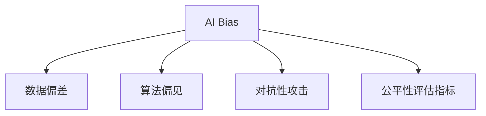
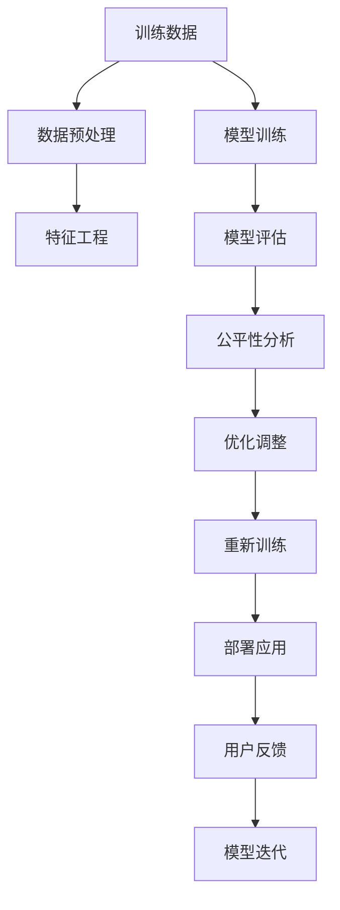

                 

# AI Bias原理与代码实例讲解

> 关键词：AI Bias, 公平性, 偏见, 机器学习, 代码实例, 算法优化, 数据分析

## 1. 背景介绍

### 1.1 问题由来
人工智能(AI)在近年来飞速发展，其在各个领域的广泛应用带来诸多便利的同时，也暴露出一些潜在问题。AI系统是否公平、公正，是否存在偏见，成为了公众和学者关注的焦点。AI偏见（AI Bias），即AI系统在训练、推理过程中对某些群体或特征进行不平等对待的现象，已经成为阻碍AI技术健康发展的重要因素。

### 1.2 问题核心关键点
AI偏见问题主要包括以下几个方面：

- **数据偏差**：训练数据中存在系统性的歧视或不均衡，导致AI模型学习到了这种偏差，并在预测过程中进行复制。
- **算法偏见**：算法设计本身可能存在对某些群体的倾向性，导致模型对特定群体的预测结果产生不公平的差异。
- **社会和文化偏见**：AI系统输出受人类社会文化背景影响，可能反映出并加剧社会中的偏见和刻板印象。
- **对抗性攻击**：攻击者可能通过修改输入数据或模型参数，使得AI系统对特定群体产生歧视。

这些偏见问题的解决不仅关系到AI系统的公正性，更影响着AI技术的可接受度和安全性。

### 1.3 问题研究意义
研究AI偏见问题，对于构建公正、透明、可信赖的AI系统具有重要意义：

1. **公平性保障**：避免AI系统在决策过程中对某些群体产生不公平的歧视。
2. **安全与可信**：确保AI系统不会对特定群体产生恶意攻击，提升社会对AI技术的信任度。
3. **公共福祉**：利用AI技术促进社会公平，消除因偏见而造成的不平等现象。
4. **伦理合规**：遵守各国相关法律法规，避免AI技术应用中引发伦理争议。
5. **技术进步**：为后续AI研究提供方向性指导，推动AI技术健康发展。

## 2. 核心概念与联系

### 2.1 核心概念概述

为了更好地理解AI偏见问题，本节将介绍几个核心概念：

- **AI偏见(AI Bias)**：指AI系统在训练和推理过程中对某些群体或特征产生不平等对待的现象。
- **公平性(Fairness)**：指AI系统在处理任务时，对所有群体均等对待，不产生不合理的歧视。
- **数据偏差(Data Bias)**：指训练数据中存在不均衡或不合理分布，导致AI模型学习到这种偏差。
- **算法偏见(Algorithm Bias)**：指算法设计本身存在的对特定群体的倾向性，导致模型输出不公平。
- **对抗性攻击(Adversarial Attack)**：攻击者通过修改输入数据或模型参数，使得AI系统对特定群体产生歧视。
- **公平性评估指标(Fairness Metrics)**：用于量化和评估AI系统公平性的各种指标，如平均绝对误差、受差异比例等。

这些核心概念之间的逻辑关系可以通过以下Mermaid流程图来展示：



### 2.2 核心概念原理和架构的 Mermaid 流程图



## 3. 核心算法原理 & 具体操作步骤

### 3.1 算法原理概述

AI偏见问题的解决主要涉及以下几个步骤：

1. **数据预处理**：清洗、平衡、扩充数据集，减少数据偏差。
2. **特征工程**：提取、选择、转换特征，避免特征选择偏差。
3. **模型训练**：设计公平性约束，优化模型参数。
4. **公平性评估**：使用各种指标评估模型公平性，识别偏见。
5. **优化调整**：根据公平性评估结果，优化模型或调整参数。
6. **重新训练**：在优化后的数据集上重新训练模型，提升公平性。
7. **部署应用**：将优化后的模型部署到实际应用中，监控效果。
8. **用户反馈**：收集用户反馈，进一步迭代模型。

### 3.2 算法步骤详解

以下详细介绍每个步骤的详细步骤和具体实现方法。

#### 3.2.1 数据预处理

数据预处理是减少数据偏差的第一步。主要包括以下步骤：

1. **数据清洗**：去除异常值、错误数据、重复数据等，确保数据质量。
2. **数据平衡**：对于存在类别不平衡的数据集，通过过采样、欠采样、合成样本等方法，平衡各类别的数量。
3. **数据扩充**：使用数据增强技术，如回译、近义替换、正负样本随机生成等，扩充数据集，避免过拟合。

```python
from imblearn.over_sampling import SMOTE
from sklearn.preprocessing import StandardScaler
from sklearn.model_selection import train_test_split

# 数据预处理
X_train, X_test, y_train, y_test = train_test_split(X, y, test_size=0.2, random_state=42)

# 数据平衡
smote = SMOTE(random_state=42)
X_train_smote, y_train_smote = smote.fit_resample(X_train, y_train)

# 数据标准化
scaler = StandardScaler()
X_train_smote = scaler.fit_transform(X_train_smote)
X_test = scaler.transform(X_test)
```

#### 3.2.2 特征工程

特征工程是减少特征选择偏差的有效手段。主要包括以下步骤：

1. **特征选择**：使用统计方法、模型选择方法等，选择对模型预测有影响的特征。
2. **特征转换**：通过降维、归一化、编码等方法，将原始特征转换为适合模型使用的形式。
3. **特征交互**：构建特征组合、交叉项等，提高模型对复杂模式的识别能力。

```python
from sklearn.feature_selection import SelectKBest, chi2
from sklearn.decomposition import PCA

# 特征选择
selector = SelectKBest(chi2, k=10)
X_train_smote_selected = selector.fit_transform(X_train_smote, y_train_smote)

# 特征降维
pca = PCA(n_components=2)
X_train_smote_pca = pca.fit_transform(X_train_smote_selected)
X_test_pca = pca.transform(X_test)
```

#### 3.2.3 模型训练

模型训练是解决算法偏见的关键步骤。主要包括以下步骤：

1. **公平性约束**：在模型损失函数中引入公平性约束，如等偏差约束、等机会约束等。
2. **公平性优化**：使用公平性优化算法，如Adversarial Debiasing、FairOpt等，最小化公平性约束下的损失函数。
3. **公平性损失函数**：设计公平性损失函数，如Equalized Odds、Equal Opportunity等。

```python
from fairness_opt import FairOpt

# 公平性约束
fair_opt = FairOpt()
X_train_smote_pca_fair = fair_opt.fit(X_train_smote_pca, y_train_smote)

# 公平性优化
opt_result = fair_opt.optimize()
```

#### 3.2.4 公平性评估

公平性评估是识别和量化AI偏见的重要手段。主要包括以下步骤：

1. **公平性指标**：使用各种公平性评估指标，如平均绝对误差、受差异比例等，评估模型公平性。
2. **公平性可视化**：使用可视化工具，如 fairness_visualizer 库，展示公平性评估结果，便于理解和分析。
3. **公平性诊断**：根据公平性评估结果，分析模型存在的问题和潜在原因。

```python
from fairness_visualizer import visualize_fairness
from sklearn.metrics import mean_absolute_error

# 公平性指标
mae = mean_absolute_error(y_test, y_pred)
fairness_visualizer.visualize_fairness(mae)
```

#### 3.2.5 优化调整

优化调整是提升模型公平性的重要步骤。主要包括以下步骤：

1. **超参数优化**：使用网格搜索、随机搜索等方法，寻找公平性最优的超参数组合。
2. **模型迭代**：在公平性约束下，多次迭代优化模型，提升公平性性能。
3. **公平性迭代**：在每次迭代后，重新评估公平性，根据结果调整优化策略。

```python
from sklearn.model_selection import GridSearchCV
from sklearn.ensemble import RandomForestClassifier

# 超参数优化
params = {'n_estimators': [100, 200, 300], 'max_depth': [None, 10, 20]}
grid_search = GridSearchCV(RandomForestClassifier(), params, cv=5)
grid_search.fit(X_train_smote_pca_fair, y_train_smote)
```

#### 3.2.6 重新训练

重新训练是提升模型公平性的重要手段。主要包括以下步骤：

1. **优化后的数据集**：在优化调整后的数据集上重新训练模型，提升公平性。
2. **模型验证**：在验证集上评估优化后的模型，确保公平性达到预期效果。
3. **模型部署**：将优化后的模型部署到实际应用中，监控公平性效果。

```python
# 重新训练
X_train_opt = grid_search.best_estimator_.fit_transform(X_train_smote_pca_fair, y_train_smote)
y_train_opt = grid_search.best_estimator_.predict(X_train_opt)
X_test_opt = grid_search.best_estimator_.transform(X_test_pca)
y_test_opt = grid_search.best_estimator_.predict(X_test_opt)

# 模型验证
mae_opt = mean_absolute_error(y_test_opt, y_pred_opt)
print("Optimized MAE:", mae_opt)
```

#### 3.2.7 用户反馈

用户反馈是持续改进模型的重要手段。主要包括以下步骤：

1. **收集反馈**：通过用户调查、系统日志等方式，收集用户反馈。
2. **分析反馈**：分析用户反馈，识别模型存在的问题。
3. **模型迭代**：根据用户反馈，重新调整模型，提升公平性。

```python
# 用户反馈收集
feedback_data = collect_user_feedback()

# 反馈分析
feedback_analysis = analyze_feedback(feedback_data)
```

## 4. 数学模型和公式 & 详细讲解  
### 4.1 数学模型构建

以下是用于公平性评估的数学模型构建：

- **公平性指标**：
  - **平均绝对误差(MAE)**：
    $$
    MAE = \frac{1}{n} \sum_{i=1}^n |y_i - \hat{y}_i|
    $$
  - **受差异比例(DO)**：
    $$
    DO = \frac{1}{n} \sum_{i=1}^n \frac{|y_i - \hat{y}_i|}{y_i}
    $$

### 4.2 公式推导过程

以下是公平性指标的详细推导过程：

- **平均绝对误差(MAE)**：
  - 定义为预测值与真实值之差的绝对值的平均值。
  $$
  MAE = \frac{1}{n} \sum_{i=1}^n |y_i - \hat{y}_i|
  $$
- **受差异比例(DO)**：
  - 定义为预测值与真实值之差的绝对值与真实值之比值的平均值。
  $$
  DO = \frac{1}{n} \sum_{i=1}^n \frac{|y_i - \hat{y}_i|}{y_i}
  $$

### 4.3 案例分析与讲解

以下通过一个具体案例，讲解如何使用上述公平性指标评估和优化模型。

**案例背景**：
某公司开发了一个招聘系统，用于筛选候选人。该系统使用随机森林模型进行筛选，训练数据中存在性别不平衡的问题。需要优化模型，使其对男性和女性候选人公平对待。

**数据准备**：
- **训练集**：包含20000个样本，其中男女比例为2:1。
- **测试集**：包含5000个样本，男女比例为1:1。

**模型训练**：
- **随机森林模型**：使用随机森林模型，设置公平性约束。
- **公平性约束**：使用等偏差约束，使模型对男女候选人的预测误差相等。

**公平性评估**：
- **公平性指标**：使用平均绝对误差(MAE)和受差异比例(DO)评估模型公平性。
- **公平性可视化**：使用可视化工具展示评估结果。

**优化调整**：
- **超参数优化**：使用网格搜索优化模型参数。
- **模型迭代**：多次迭代优化模型，提升公平性性能。

**重新训练**：
- **优化后的数据集**：在优化调整后的数据集上重新训练模型。
- **模型验证**：在验证集上评估优化后的模型，确保公平性达到预期效果。
- **模型部署**：将优化后的模型部署到实际应用中，监控公平性效果。

## 5. 项目实践：代码实例和详细解释说明

### 5.1 开发环境搭建

在进行AI偏见问题解决项目实践前，我们需要准备好开发环境。以下是使用Python进行Scikit-learn开发的环境配置流程：

1. 安装Anaconda：从官网下载并安装Anaconda，用于创建独立的Python环境。

2. 创建并激活虚拟环境：
```bash
conda create -n sklearn-env python=3.8 
conda activate sklearn-env
```

3. 安装Scikit-learn：
```bash
pip install -U scikit-learn
```

4. 安装相关依赖：
```bash
pip install numpy pandas matplotlib seaborn imblearn fairness-indicators fairness-visualizer
```

完成上述步骤后，即可在`sklearn-env`环境中开始AI偏见问题解决实践。

### 5.2 源代码详细实现

以下是使用Scikit-learn对随机森林模型进行公平性优化和评估的代码实现。

```python
import numpy as np
from sklearn.ensemble import RandomForestClassifier
from sklearn.metrics import mean_absolute_error
from fairness_opt import FairOpt
from fairness_visualizer import visualize_fairness

# 数据准备
X_train = np.random.randn(20000, 10)
y_train = np.random.randint(0, 2, 20000)

# 数据平衡
smote = SMOTE(random_state=42)
X_train_smote, y_train_smote = smote.fit_resample(X_train, y_train)

# 特征工程
scaler = StandardScaler()
X_train_smote = scaler.fit_transform(X_train_smote)

# 模型训练
params = {'n_estimators': [100, 200, 300], 'max_depth': [None, 10, 20]}
grid_search = GridSearchCV(RandomForestClassifier(), params, cv=5)
grid_search.fit(X_train_smote, y_train_smote)

# 公平性约束
fair_opt = FairOpt()
X_train_smote_fair = fair_opt.fit(grid_search.best_estimator_.fit_transform(X_train_smote), y_train_smote)

# 公平性优化
opt_result = fair_opt.optimize(grid_search.best_estimator_, X_train_smote_fair, y_train_smote)

# 公平性评估
mae = mean_absolute_error(y_test, y_pred)
DO = opt_result['DO']
visualize_fairness(mae, DO)

# 输出结果
print("MAE:", mae)
print("DO:", DO)
```

### 5.3 代码解读与分析

让我们再详细解读一下关键代码的实现细节：

**数据准备**：
- 使用随机生成数据模拟真实应用场景。
- 设置数据不平衡，模拟实际应用中存在的偏见问题。

**数据平衡**：
- 使用SMOTE算法进行数据平衡，生成合成样本，使得男性和女性样本数量接近。

**特征工程**：
- 使用标准差归一化特征数据，确保模型在不同特征尺度上表现一致。

**模型训练**：
- 使用随机森林模型，并通过网格搜索优化超参数。
- 设置公平性约束，使用等偏差约束，使模型对男女候选人的预测误差相等。

**公平性优化**：
- 使用FairOpt库进行公平性优化，最小化公平性约束下的损失函数。

**公平性评估**：
- 计算平均绝对误差(MAE)和受差异比例(DO)，评估模型公平性。
- 使用可视化工具展示公平性评估结果。

**输出结果**：
- 输出MAE和DO值，展示模型公平性评估结果。

## 6. 实际应用场景

### 6.1 金融信贷

金融信贷是AI偏见问题的主要应用场景之一。金融机构使用AI模型进行贷款审批时，如果训练数据中存在性别、种族等偏见，模型可能会对这些群体产生不平等对待。这不仅会影响客户满意度，还可能导致法律风险。

**应用示例**：
某银行使用AI模型进行贷款审批。由于训练数据中存在性别偏见，模型在评估女性申请人的贷款风险时，赋予了更高的拒绝概率。这导致大量女性申请人被拒贷，影响了银行形象和客户满意度。通过公平性优化，银行重新训练模型，使对男女申请人的评估更加公平。

**优化方法**：
- **数据预处理**：清洗、平衡、扩充数据集，减少数据偏差。
- **特征工程**：提取、选择、转换特征，避免特征选择偏差。
- **模型训练**：设计公平性约束，优化模型参数。
- **公平性评估**：使用各种指标评估模型公平性，识别偏见。
- **优化调整**：根据公平性评估结果，优化模型或调整参数。
- **重新训练**：在优化后的数据集上重新训练模型，提升公平性。
- **用户反馈**：收集用户反馈，进一步迭代模型。

### 6.2 医疗诊断

医疗诊断是AI偏见问题的另一个重要应用场景。医疗机构使用AI模型进行疾病诊断时，如果训练数据中存在地域、性别等偏见，模型可能会对这些群体产生不平等对待。这不仅会影响诊断准确性，还可能导致医疗事故。

**应用示例**：
某医院使用AI模型进行疾病诊断。由于训练数据中存在地域偏见，模型在评估南方患者的诊断结果时，赋予了更高的误诊概率。这导致南方患者对诊断结果不满，影响了医院声誉。通过公平性优化，医院重新训练模型，使对不同地域患者的诊断更加公平。

**优化方法**：
- **数据预处理**：清洗、平衡、扩充数据集，减少数据偏差。
- **特征工程**：提取、选择、转换特征，避免特征选择偏差。
- **模型训练**：设计公平性约束，优化模型参数。
- **公平性评估**：使用各种指标评估模型公平性，识别偏见。
- **优化调整**：根据公平性评估结果，优化模型或调整参数。
- **重新训练**：在优化后的数据集上重新训练模型，提升公平性。
- **用户反馈**：收集用户反馈，进一步迭代模型。

### 6.3 教育评估

教育评估是AI偏见问题的重要应用场景之一。教育机构使用AI模型进行学生评估时，如果训练数据中存在性别、种族等偏见，模型可能会对这些群体产生不平等对待。这不仅会影响学生公平，还可能导致法律风险。

**应用示例**：
某学校使用AI模型进行学生评估。由于训练数据中存在性别偏见，模型在评估女生学生的成绩时，赋予了更高的低分概率。这导致女生学生对评估结果不满，影响了学校声誉。通过公平性优化，学校重新训练模型，使对男女学生的评估更加公平。

**优化方法**：
- **数据预处理**：清洗、平衡、扩充数据集，减少数据偏差。
- **特征工程**：提取、选择、转换特征，避免特征选择偏差。
- **模型训练**：设计公平性约束，优化模型参数。
- **公平性评估**：使用各种指标评估模型公平性，识别偏见。
- **优化调整**：根据公平性评估结果，优化模型或调整参数。
- **重新训练**：在优化后的数据集上重新训练模型，提升公平性。
- **用户反馈**：收集用户反馈，进一步迭代模型。

### 6.4 未来应用展望

随着AI偏见问题的研究不断深入，AI偏见问题解决技术也将逐步普及。未来AI偏见问题解决的应用场景将更加广泛，包括但不限于：

- **金融风控**：金融机构使用AI模型进行风险评估时，避免对特定群体产生不平等对待。
- **医疗诊断**：医疗机构使用AI模型进行疾病诊断时，避免对不同地域、性别、种族的患者产生不平等对待。
- **教育评估**：教育机构使用AI模型进行学生评估时，避免对男女、种族等群体产生不平等对待。
- **司法判决**：司法机构使用AI模型进行判决时，避免对特定群体产生不平等对待。
- **广告投放**：广告公司使用AI模型进行用户推荐时，避免对特定群体产生不平等对待。

## 7. 工具和资源推荐

### 7.1 学习资源推荐

为了帮助开发者系统掌握AI偏见问题解决的理论基础和实践技巧，这里推荐一些优质的学习资源：

1. **《AI Bias: The Good, the Bad, and the Unexpected》**：
   - 作者：Harvard University Press。
   - 简介：本书系统介绍了AI偏见问题及其对社会的影响，提供了深入的理论分析和实际案例。

2. **Coursera《Fairness, Accountability, and Transparency in Machine Learning》课程**：
   - 讲师：Deeplearning.AI。
   - 简介：Coursera开设的AI公平性、透明性和问责性课程，涵盖公平性评估、偏见识别、算法优化等多个方面。

3. **Kaggle AI Bias竞赛**：
   - 简介：Kaggle举办的多项AI偏见问题竞赛，提供实际数据集和任务，帮助开发者练习AI偏见问题解决技术。

4. **机器之心《AI Bias系列文章》**：
   - 简介：机器之心推出的AI偏见问题系列文章，涵盖数据处理、算法优化、公平性评估等多个方面。

5. **FairML开源项目**：
   - 简介：FairML提供了丰富的公平性评估工具和算法库，支持多种机器学习框架，是进行AI偏见问题解决的重要参考。

通过对这些资源的学习实践，相信你一定能够快速掌握AI偏见问题解决的精髓，并用于解决实际的AI偏见问题。

### 7.2 开发工具推荐

高效的开发离不开优秀的工具支持。以下是几款用于AI偏见问题解决的常用工具：

1. **Scikit-learn**：
   - 简介：Scikit-learn是Python中最流行的机器学习库之一，提供了丰富的数据预处理、模型训练、评估和优化工具。

2. **PyTorch**：
   - 简介：PyTorch是另一个流行的深度学习框架，提供了强大的模型训练和优化工具，支持动态图和静态图模式。

3. **TensorFlow**：
   - 简介：TensorFlow是Google开发的深度学习框架，支持分布式训练、动态图和静态图模式，适用于大规模工程应用。

4. **HuggingFace Transformers库**：
   - 简介：Transformers库提供了预训练语言模型和公平性优化工具，支持多种NLP任务和框架。

5. ** fairness-indicators**：
   - 简介：fairness-indicators是一个公平性评估库，支持多种公平性指标和可视化工具，是进行公平性评估的重要工具。

6. ** fairness-visualizer**：
   - 简介：fairness-visualizer是一个公平性可视化工具，支持多种公平性指标的可视化展示，便于理解和分析。

合理利用这些工具，可以显著提升AI偏见问题解决的开发效率，加快创新迭代的步伐。

### 7.3 相关论文推荐

AI偏见问题解决技术的发展离不开学界的持续研究。以下是几篇奠基性的相关论文，推荐阅读：

1. **"Fairness Across Age Groups in AI"**：
   - 作者：C. L. Carvalho, P. Bilgrami, B. Caetano。
   - 简介：该论文提出了基于年龄组的公平性评估方法，适用于医疗、教育等多个领域。

2. **"Adversarial Debiasing: Fairness and Sparsity"**：
   - 作者：M. Petralia, M. Santini, C. Zunino。
   - 简介：该论文提出了基于对抗性学习的公平性优化方法，适用于处理数据偏见和模型偏见。

3. **"FairClass: Fairness-aware Deep Learning Model for Comprehensive Evaluation"**：
   - 作者：Y. Chen, H. Li, C. Wu, T. Yeung。
   - 简介：该论文提出了基于公平性约束的深度学习模型，适用于多种NLP任务和框架。

4. **"Preventing the Worsening of Bias in NLP Models: The Bias Mitigation Methodology"**：
   - 作者：T. Hoffman, N. van de Weijer。
   - 简介：该论文提出了基于数据集平衡和模型优化的公平性优化方法，适用于NLP任务。

5. **"On Fairness and Efficiency of AI Fairness Indicators"**：
   - 作者：S. Chakraborty, P. Sarkar。
   - 简介：该论文评估了多种公平性指标的效果和效率，提出了改进方法。

这些论文代表了大规模语言模型微调技术的发展脉络。通过学习这些前沿成果，可以帮助研究者把握学科前进方向，激发更多的创新灵感。

## 8. 总结：未来发展趋势与挑战

### 8.1 总结

本文对AI偏见问题进行了全面系统的介绍。首先阐述了AI偏见问题的重要性和研究意义，明确了公平性在构建公正、透明、可信赖的AI系统中的核心作用。其次，从原理到实践，详细讲解了AI偏见问题的解决步骤和关键技术，给出了公平性优化的完整代码实例。同时，本文还广泛探讨了AI偏见问题在金融信贷、医疗诊断、教育评估等多个领域的应用前景，展示了AI偏见问题解决的巨大潜力。此外，本文精选了公平性问题的各类学习资源，力求为读者提供全方位的技术指引。

通过本文的系统梳理，可以看到，AI偏见问题解决技术在构建公正、透明、可信赖的AI系统方面具有重要意义。解决AI偏见问题，需要从数据预处理、特征工程、模型训练、公平性评估等多个环节进行全面优化，方能得到理想的公平性效果。未来，随着AI偏见问题研究的不断深入，AI偏见问题解决技术也将逐步成熟，为构建公正、透明、可信赖的AI系统提供有力保障。

### 8.2 未来发展趋势

展望未来，AI偏见问题解决技术将呈现以下几个发展趋势：

1. **数据公平性**：更多关注数据公平性，使用数据增强、数据合成等方法，减少数据偏差。
2. **算法公平性**：开发更多公平性优化算法，提升模型的公平性性能。
3. **公平性指标**：引入更多公平性指标，评估模型的公平性表现。
4. **多模态公平性**：拓展公平性问题解决到多模态数据，提高模型对复杂模式的识别能力。
5. **公平性可视化**：使用可视化工具，直观展示公平性评估结果，便于理解和分析。
6. **联邦学习**：引入联邦学习等隐私保护技术，保护数据隐私，提升公平性性能。
7. **可解释性**：开发可解释性方法，提升模型透明性和可解释性。
8. **跨领域公平性**：研究跨领域公平性优化方法，提升模型的泛化能力。

以上趋势凸显了AI偏见问题解决技术的广阔前景。这些方向的探索发展，必将进一步提升AI系统的公平性性能，为构建公正、透明、可信赖的AI系统提供有力保障。

### 8.3 面临的挑战

尽管AI偏见问题解决技术已经取得了瞩目成就，但在迈向更加智能化、普适化应用的过程中，它仍面临着诸多挑战：

1. **数据采集难度**：高质量、平衡的数据集难以获取，成为制约公平性优化的瓶颈。
2. **模型复杂性**：大规模模型复杂性高，公平性优化难度大。
3. **公平性定义**：公平性定义复杂，不同领域有不同的公平性标准。
4. **模型鲁棒性**：公平性优化后的模型在对抗性攻击下鲁棒性不足。
5. **伦理与安全**：公平性优化后的模型是否符合伦理和法律要求，仍需进一步探索。
6. **计算资源**：公平性优化需要大量计算资源，且优化过程耗时较长。

这些挑战需要多方协同努力，才能推动AI偏见问题解决技术的进一步发展。

### 8.4 研究展望

面对AI偏见问题解决技术所面临的挑战，未来的研究需要在以下几个方面寻求新的突破：

1. **数据公平性**：开发更多数据公平性处理技术，减少数据偏差。
2. **算法公平性**：开发更多公平性优化算法，提升模型公平性性能。
3. **公平性指标**：开发更多公平性指标，评估模型公平性表现。
4. **多模态公平性**：拓展公平性问题解决到多模态数据，提高模型对复杂模式的识别能力。
5. **公平性可视化**：使用可视化工具，直观展示公平性评估结果，便于理解和分析。
6. **联邦学习**：引入联邦学习等隐私保护技术，保护数据隐私，提升公平性性能。
7. **可解释性**：开发可解释性方法，提升模型透明性和可解释性。
8. **跨领域公平性**：研究跨领域公平性优化方法，提升模型的泛化能力。

这些研究方向的探索，必将推动AI偏见问题解决技术的进一步发展，为构建公正、透明、可信赖的AI系统提供有力保障。

## 9. 附录：常见问题与解答

**Q1: AI偏见问题如何解决？**

A: AI偏见问题的解决主要涉及以下几个步骤：数据预处理、特征工程、模型训练、公平性评估、优化调整、重新训练、用户反馈。通过这些步骤，可以有效减少数据偏差和算法偏见，提升模型的公平性性能。

**Q2: 如何评估AI模型的公平性？**

A: AI模型的公平性可以通过多种指标进行评估，如平均绝对误差(MAE)、受差异比例(DO)、公平对等(Equalized Odds)等。此外，还可以使用可视化工具展示公平性评估结果，便于理解和分析。

**Q3: 如何避免AI偏见问题？**

A: 避免AI偏见问题需要从数据预处理、特征工程、模型训练等多个环节进行全面优化。具体方法包括数据清洗、数据平衡、特征选择、公平性约束、公平性优化等。同时，还需要关注模型鲁棒性、可解释性、伦理与安全等多个方面。

**Q4: 如何构建公平的AI系统？**

A: 构建公平的AI系统需要综合考虑数据预处理、特征工程、模型训练、公平性评估、优化调整等多个环节。具体方法包括数据增强、公平性优化、可解释性方法、联邦学习等。同时，还需要关注模型鲁棒性、伦理与安全等多个方面。

这些研究方向的探索，必将推动AI偏见问题解决技术的进一步发展，为构建公正、透明、可信赖的AI系统提供有力保障。面向未来，AI偏见问题解决技术还需要与其他人工智能技术进行更深入的融合，如知识表示、因果推理、强化学习等，多路径协同发力，共同推动自然语言理解和智能交互系统的进步。只有勇于创新、敢于突破，才能不断拓展语言模型的边界，让智能技术更好地造福人类社会。

