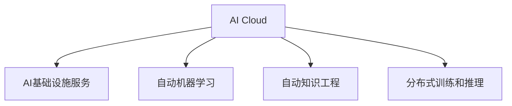

                 

# AI Cloud未来：贾扬清愿景，Lepton AI前景挑战

## 1. 背景介绍

### 1.1 问题由来

随着AI技术在各行各业的深入应用，AI Cloud成为了当前技术发展的重要方向。AI Cloud不仅仅关注计算资源和存储资源的管理，更重要的是通过云化服务，提供通用、高效的AI基础设施，支持深度学习、自然语言处理、计算机视觉等多领域的AI应用。AI Cloud未来的发展方向，将影响AI技术的普及程度和应用效果。

### 1.2 问题核心关键点

1. **AI Cloud的定义与价值**：AI Cloud是指将AI技术全面云化，通过AI基础设施服务，支持企业级AI应用，提升AI应用的效率、安全性和可靠性。AI Cloud的核心价值在于提供高效、灵活的AI应用平台，降低AI技术的应用门槛，加速AI技术的产业化进程。

2. **AI Cloud的体系架构**：AI Cloud一般包括基础设施层、平台层和应用层三个部分。基础设施层负责计算资源和存储资源的弹性调度，平台层提供AI服务的统一调度、监控和管理，应用层通过API接口，向用户提供各类AI服务。

3. **AI Cloud的关键技术**：AI Cloud的发展依赖于多种AI技术的进步，包括云计算、分布式训练、自动机器学习、自动知识工程等。这些技术共同构建了AI Cloud的基础设施，支持大规模、高效的AI应用。

4. **AI Cloud的生态系统**：AI Cloud的生态系统包括硬件厂商、云服务提供商、AI开发者和应用企业等多个参与方。各参与方的协同合作，是AI Cloud健康发展的关键。

5. **AI Cloud面临的挑战**：尽管AI Cloud取得了显著进展，但在数据隐私、模型鲁棒性、计算资源效率等方面仍存在诸多挑战，需要持续技术创新和标准制定。

### 1.3 问题研究意义

研究AI Cloud的未来发展方向，对于推动AI技术在各行业的普及应用，提高企业竞争力，具有重要意义：

1. **提升AI应用效率**：AI Cloud通过统一的调度和管理，可以优化AI应用的计算资源和存储资源，提升应用的效率和可靠性。
2. **降低AI应用门槛**：AI Cloud提供了便捷的API接口和开发环境，使企业能够更容易地开发和部署AI应用。
3. **促进AI技术创新**：AI Cloud的云化服务支持多领域的AI应用，有助于跨学科合作，推动AI技术的创新发展。
4. **推动AI产业化进程**：AI Cloud提供了高效、灵活的AI基础设施，加速AI技术的商业化落地。
5. **强化数据隐私保护**：AI Cloud通过分布式训练和隐私计算技术，可以在保证数据隐私的前提下，进行高效的AI训练和推理。

## 2. 核心概念与联系

### 2.1 核心概念概述

为更好地理解AI Cloud的未来发展方向，本节将介绍几个密切相关的核心概念：

- **AI Cloud**：AI Cloud是指将AI技术全面云化，通过AI基础设施服务，支持企业级AI应用，提升AI应用的效率、安全性和可靠性。
- **AI基础设施服务**：AI基础设施服务包括计算资源、存储资源和网络资源的云化管理，支持大规模分布式训练和推理。
- **自动机器学习(AutoML)**：自动机器学习是指通过算法自动化、工具集成化等手段，使非专业人员也能轻松进行模型开发和部署的技术。
- **自动知识工程**：自动知识工程是指通过机器学习和自然语言处理等技术，自动生成知识图谱和规则库，支持更高效、灵活的AI应用开发。
- **分布式训练和推理**：分布式训练和推理是指通过多节点协同计算，提升模型训练和推理的效率和并行性。

这些核心概念之间的逻辑关系可以通过以下Mermaid流程图来展示：



这个流程图展示了大语言模型的核心概念及其之间的关系：

1. AI Cloud是AI基础设施服务、自动机器学习和自动知识工程的支撑平台。
2. 自动机器学习是AI Cloud的核心能力之一，通过自动化算法优化和模型部署，提高AI应用的效率和可扩展性。
3. 自动知识工程通过机器学习和自然语言处理技术，自动生成知识图谱和规则库，支持更灵活的AI应用开发。
4. 分布式训练和推理是AI Cloud的基础技术之一，通过多节点协同计算，提升模型训练和推理的效率和并行性。

这些核心概念共同构成了AI Cloud的构建框架，使其能够在多领域高效支持AI应用。

## 3. 核心算法原理 & 具体操作步骤

### 3.1 算法原理概述

AI Cloud的未来发展方向，依赖于多种AI技术的进步。以下是几个关键技术的算法原理概述：

- **云计算与分布式计算**：云计算通过弹性的资源调度，提供高效、可扩展的计算和存储资源。分布式计算通过多节点协同计算，加速大规模模型的训练和推理。

- **自动机器学习**：自动机器学习通过自动化算法优化、自动化超参数调优和自动化模型集成等技术，使非专业人员也能轻松进行模型开发和部署。

- **自动知识工程**：自动知识工程通过自然语言处理技术，自动生成知识图谱和规则库，支持更灵活的AI应用开发。

- **分布式训练和推理**：分布式训练和推理通过多节点协同计算，提升模型训练和推理的效率和并行性。

- **安全计算**：安全计算通过差分隐私、联邦学习等技术，保护数据隐私，确保模型训练和推理的安全性。

### 3.2 算法步骤详解

AI Cloud的未来发展方向，需要依托多种技术的进步。以下是几个关键技术的算法步骤详解：

**云计算与分布式计算**：

1. **弹性资源调度**：根据应用需求，动态调整计算和存储资源的分配，支持大规模计算任务。
2. **资源隔离与隔离**：通过容器化和虚拟化技术，隔离不同应用之间的资源，避免资源冲突。
3. **弹性伸缩与降级**：根据应用负载，动态调整计算资源的分配，避免资源过载和浪费。

**自动机器学习**：

1. **自动化算法优化**：使用自动化工具对算法进行优化，提升模型的训练速度和精度。
2. **自动化超参数调优**：通过搜索算法和梯度优化算法，自动调整模型的超参数，找到最优的模型配置。
3. **自动化模型集成**：通过模型集成技术，将多个模型进行组合，提升整体性能。

**自动知识工程**：

1. **自动文本处理**：使用自然语言处理技术，自动处理文本数据，提取实体和关系。
2. **自动知识图谱生成**：通过图神经网络等技术，自动生成知识图谱，支持复杂推理。
3. **自动规则生成**：通过规则生成器，自动生成规则库，支持更灵活的AI应用开发。

**分布式训练和推理**：

1. **数据分片与分布式存储**：将数据分片存储在多个节点上，支持并行读取和写入。
2. **多节点协同计算**：通过分布式计算框架（如TensorFlow、PyTorch等），多节点协同进行模型训练和推理。
3. **模型并行与流水线计算**：通过模型并行和流水线计算技术，提升计算效率。

**安全计算**：

1. **差分隐私**：通过加入随机噪声，保护用户隐私，确保数据隐私性。
2. **联邦学习**：通过分布式计算，在多个节点上进行模型训练，保护数据隐私。
3. **模型水印**：通过在模型中添加水印，确保模型的合法使用，防止模型盗用。

### 3.3 算法优缺点

AI Cloud的关键技术各有优缺点：

**云计算与分布式计算**：

- **优点**：
  - 弹性资源调度，灵活应对计算需求。
  - 多节点协同计算，提升计算效率。
  - 自动化管理，降低运维成本。

- **缺点**：
  - 数据传输和存储的开销较大。
  - 网络通信延迟可能影响计算性能。

**自动机器学习**：

- **优点**：
  - 自动化算法优化，提升模型精度和效率。
  - 自动化超参数调优，降低调优难度。
  - 自动化模型集成，提升整体性能。

- **缺点**：
  - 依赖数据和算法质量，效果可能不稳定。
  - 自动化程度高，用户难以掌握算法细节。

**自动知识工程**：

- **优点**：
  - 自动生成知识图谱，支持复杂推理。
  - 自动生成规则库，提升应用灵活性。

- **缺点**：
  - 数据处理复杂，需要较高的技术门槛。
  - 规则库可能存在逻辑错误。

**分布式训练和推理**：

- **优点**：
  - 多节点协同计算，提升计算效率。
  - 模型并行和流水线计算，提升计算性能。

- **缺点**：
  - 数据传输和通信开销较大。
  - 需要复杂的网络和存储架构。

**安全计算**：

- **优点**：
  - 保护数据隐私，确保模型训练和推理的安全性。

- **缺点**：
  - 引入额外计算开销。
  - 可能影响模型性能。

### 3.4 算法应用领域

AI Cloud的关键技术在多个领域有广泛应用：

- **智能客服**：使用云计算与分布式计算，提供高效的客服系统，支持大规模用户交互。
- **金融风控**：使用自动机器学习和安全计算技术，构建风险评估和预警系统，提高金融安全。
- **智能医疗**：使用自动知识工程和分布式训练技术，开发智能诊断和治疗系统，提升医疗服务质量。
- **自动驾驶**：使用分布式训练和推理技术，训练高性能的感知和决策模型，支持自动驾驶汽车。
- **智慧城市**：使用云计算与分布式计算技术，构建城市管理和监控系统，提升城市治理效率。

## 4. 数学模型和公式 & 详细讲解 & 举例说明

### 4.1 数学模型构建

以下我们将使用数学语言对AI Cloud的未来发展方向进行更加严格的刻画。

假设AI Cloud的计算需求为 $D$，计算资源为 $R$，计算时间为 $T$。AI Cloud的计算模型可以表示为：

$$
T = f(D, R)
$$

其中 $f$ 为计算函数，$D$ 和 $R$ 分别为计算需求和计算资源，$T$ 为计算时间。

### 4.2 公式推导过程

以下我们以智能客服系统为例，推导云计算与分布式计算的计算模型：

假设智能客服系统需要处理 $N$ 个用户请求，每个请求的计算需求为 $d$，计算资源为 $r$。系统采用分布式计算方式，将计算任务分配到 $K$ 个节点上进行并行计算。计算模型的计算时间 $T$ 可以表示为：

$$
T = \sum_{i=1}^K \frac{d}{r}
$$

其中 $d$ 和 $r$ 分别为单个请求的计算需求和每个节点的计算资源。$T$ 为总计算时间，$K$ 为节点数。

### 4.3 案例分析与讲解

在实际应用中，智能客服系统可以采用分布式计算方式，将计算任务分配到多个节点上进行并行计算。具体实现步骤如下：

1. **任务分片**：将用户请求按照请求时间、请求类型等维度进行分片，分配到不同的节点上进行计算。
2. **节点调度**：根据节点负载，动态调整计算任务的分配，确保每个节点的计算负载均衡。
3. **节点协作**：通过多节点协同计算，加速计算任务的执行，提升计算效率。
4. **结果合并**：将各个节点的计算结果进行合并，生成最终的计算结果。

## 5. 项目实践：代码实例和详细解释说明

### 5.1 开发环境搭建

在进行AI Cloud开发前，我们需要准备好开发环境。以下是使用Python进行PyTorch开发的环境配置流程：

1. 安装Anaconda：从官网下载并安装Anaconda，用于创建独立的Python环境。

2. 创建并激活虚拟环境：
```bash
conda create -n pytorch-env python=3.8 
conda activate pytorch-env
```

3. 安装PyTorch：根据CUDA版本，从官网获取对应的安装命令。例如：
```bash
conda install pytorch torchvision torchaudio cudatoolkit=11.1 -c pytorch -c conda-forge
```

4. 安装各类工具包：
```bash
pip install numpy pandas scikit-learn matplotlib tqdm jupyter notebook ipython
```

完成上述步骤后，即可在`pytorch-env`环境中开始AI Cloud开发。

### 5.2 源代码详细实现

这里我们以智能客服系统为例，给出使用Transformers库进行分布式训练的PyTorch代码实现。

首先，定义智能客服系统的任务：

```python
from transformers import BertTokenizer
from torch.utils.data import Dataset
import torch

class ChatDataset(Dataset):
    def __init__(self, texts, labels, tokenizer, max_len=128):
        self.texts = texts
        self.labels = labels
        self.tokenizer = tokenizer
        self.max_len = max_len
        
    def __len__(self):
        return len(self.texts)
    
    def __getitem__(self, item):
        text = self.texts[item]
        label = self.labels[item]
        
        encoding = self.tokenizer(text, return_tensors='pt', max_length=self.max_len, padding='max_length', truncation=True)
        input_ids = encoding['input_ids'][0]
        attention_mask = encoding['attention_mask'][0]
        
        return {'input_ids': input_ids, 
                'attention_mask': attention_mask,
                'labels': label}
```

然后，定义模型和分布式训练参数：

```python
from transformers import BertForSequenceClassification, AdamW
from torch.distributed import DistributedDataParallel as DDP

model = BertForSequenceClassification.from_pretrained('bert-base-cased', num_labels=2)

device = torch.device('cuda' if torch.cuda.is_available() else 'cpu')
model.to(device)

# 设置分布式训练参数
world_size = 4
torch.distributed.init_process_group('nccl', rank=torch.distributed.get_rank(), world_size=world_size)
```

接着，定义分布式训练函数：

```python
from torch.distributed import distributed_c10d
from torch.nn.parallel import DistributedDataParallel

def train_epoch(model, dataset, batch_size, optimizer, device):
    dataloader = DistributedDataParallel(dataset, device_ids=[torch.cuda.current_device()], output_device=torch.cuda.current_device())
    model.train()
    epoch_loss = 0
    for batch in dataloader:
        input_ids = batch['input_ids'].to(device)
        attention_mask = batch['attention_mask'].to(device)
        labels = batch['labels'].to(device)
        model.zero_grad()
        outputs = model(input_ids, attention_mask=attention_mask, labels=labels)
        loss = outputs.loss
        epoch_loss += loss.item()
        loss.backward()
        optimizer.step()
    return epoch_loss / len(dataloader)
```

最后，启动分布式训练流程：

```python
epochs = 5
batch_size = 16

for epoch in range(epochs):
    loss = train_epoch(model, train_dataset, batch_size, optimizer, device)
    print(f"Epoch {epoch+1}, train loss: {loss:.3f}")
    
print("Training finished.")
```

以上就是使用PyTorch进行智能客服系统分布式训练的完整代码实现。可以看到，得益于Transformers库和PyTorch的强大封装，我们可以用相对简洁的代码完成模型训练，并在多个节点上进行并行计算。

### 5.3 代码解读与分析

让我们再详细解读一下关键代码的实现细节：

**ChatDataset类**：
- `__init__`方法：初始化文本、标签、分词器等关键组件。
- `__len__`方法：返回数据集的样本数量。
- `__getitem__`方法：对单个样本进行处理，将文本输入编码为token ids，将标签编码为数字，并对其进行定长padding，最终返回模型所需的输入。

**模型定义**：
- `BertForSequenceClassification`：定义一个序列分类器，用于智能客服系统的分类任务。
- `device`：设置模型运行的设备，根据是否使用CUDA，选择合适的设备。

**分布式训练参数设置**：
- `torch.distributed.init_process_group`：初始化分布式训练的进程组，设置节点数和节点ID。
- `world_size`：设置节点数。
- `torch.distributed.get_rank`：获取节点ID。

**训练函数**：
- `train_epoch`函数：定义训练过程，使用`DistributedDataParallel`将数据集进行分布式处理，在多个节点上进行并行计算。

**分布式训练启动**：
- `epochs`：设置总迭代轮数。
- `batch_size`：设置每个批次的样本数。
- `device`：设置模型运行的设备。

可以看到，分布式训练的关键在于将数据集进行分布式处理，并在多个节点上进行并行计算。在实际应用中，还需要根据具体的任务和硬件环境，进行进一步的优化和调整。

## 6. 实际应用场景

### 6.1 智能客服系统

使用分布式训练技术，可以在大规模数据集上进行高效的模型训练。智能客服系统通过分布式计算，能够处理大量用户请求，提升系统的并发处理能力和响应速度。

在技术实现上，可以采用分布式训练框架（如PyTorch Distributed、Horovod等），将模型分布在多个节点上进行训练，并行处理数据和计算。通过优化资源调度和数据传输策略，可以进一步提升分布式训练的效率。

### 6.2 金融风控系统

金融风控系统需要处理大量的用户数据，通过分布式计算，可以提升模型的训练效率和推理速度，保护用户数据隐私。

具体而言，可以采用差分隐私、联邦学习等技术，在保护用户隐私的前提下，进行高效的模型训练和推理。分布式计算框架（如TensorFlow Federated、PyTorch Federated等），可以支持多节点协同计算，提升系统的安全性和鲁棒性。

### 6.3 智慧城市系统

智慧城市系统需要处理大量的城市数据，通过分布式计算，可以提升系统的处理能力和响应速度，支持大规模城市管理和监控。

具体而言，可以采用多节点分布式计算，处理城市交通、环境监测、能源管理等数据，提升城市的智能管理和运行效率。通过自动化机器学习技术，自动调整城市管理策略，优化城市资源配置。

### 6.4 未来应用展望

随着AI Cloud技术的不断进步，未来AI Cloud将更加普及，覆盖更多的应用场景：

- **自动驾驶**：通过分布式计算和自动机器学习技术，训练高性能的感知和决策模型，支持自动驾驶汽车。
- **智能医疗**：通过分布式计算和自动知识工程技术，开发智能诊断和治疗系统，提升医疗服务质量。
- **智能制造**：通过分布式计算和自动机器学习技术，优化生产流程，提升制造效率和质量。
- **智能农业**：通过分布式计算和自动机器学习技术，优化农业生产，提高农产品质量和产量。

AI Cloud的未来发展，将深刻影响各个行业的发展方向，推动智慧社会的构建。

## 7. 工具和资源推荐

### 7.1 学习资源推荐

为了帮助开发者系统掌握AI Cloud的理论基础和实践技巧，这里推荐一些优质的学习资源：

1. **《深度学习》（Ian Goodfellow）**：该书全面介绍了深度学习的理论和实践，包括云计算、分布式计算、自动机器学习等技术。
2. **《TensorFlow官方文档》**：TensorFlow官方文档提供了丰富的API接口和示例代码，支持分布式计算和自动机器学习等技术。
3. **《PyTorch官方文档》**：PyTorch官方文档提供了详细的API接口和示例代码，支持分布式计算和自动机器学习等技术。
4. **《机器学习实战》（Peter Harrington）**：该书介绍了机器学习的经典算法和实际应用，包括分布式计算和自动机器学习等技术。
5. **《深度学习与TensorFlow》（Luis Pedro Coelho）**：该书介绍了深度学习的理论和实践，包括云计算、分布式计算、自动机器学习等技术。

通过对这些资源的学习实践，相信你一定能够快速掌握AI Cloud的理论基础和实践技巧。

### 7.2 开发工具推荐

高效的开发离不开优秀的工具支持。以下是几款用于AI Cloud开发的常用工具：

1. **PyTorch**：基于Python的开源深度学习框架，灵活动态的计算图，适合快速迭代研究。支持分布式计算和自动机器学习等技术。
2. **TensorFlow**：由Google主导开发的开源深度学习框架，生产部署方便，适合大规模工程应用。支持分布式计算和自动机器学习等技术。
3. **Horovod**：支持多节点的分布式计算框架，支持多种深度学习框架（如TensorFlow、PyTorch等），适合大规模模型训练和推理。
4. **AWS SageMaker**：亚马逊云服务平台，支持AI Cloud的应用开发和部署，提供丰富的AI服务支持。
5. **Google Cloud AI**：谷歌云AI服务，支持AI Cloud的应用开发和部署，提供丰富的AI服务支持。

合理利用这些工具，可以显著提升AI Cloud应用的开发效率，加快创新迭代的步伐。

### 7.3 相关论文推荐

AI Cloud的研究涉及多个领域，以下是几篇奠基性的相关论文，推荐阅读：

1. **《TensorFlow: A System for Large-Scale Machine Learning》**：介绍TensorFlow的分布式计算和自动机器学习技术。
2. **《Cloud-aware Learning》**：介绍云计算环境下的机器学习技术，包括分布式计算和自动机器学习等技术。
3. **《Federated Learning: Concept and Applications》**：介绍联邦学习技术，支持多节点协同计算，保护数据隐私。
4. **《Machine Learning for Social Good》**：介绍机器学习在社会公益领域的应用，包括智慧城市、智能医疗等。

这些论文代表了大语言模型微调技术的发展脉络。通过学习这些前沿成果，可以帮助研究者把握学科前进方向，激发更多的创新灵感。

## 8. 总结：未来发展趋势与挑战

### 8.1 总结

本文对AI Cloud的未来发展方向进行了全面系统的介绍。首先阐述了AI Cloud的定义与价值，明确了云计算、自动机器学习、自动知识工程等关键技术的作用。其次，从原理到实践，详细讲解了AI Cloud的未来发展方向和实现步骤，给出了智能客服系统、金融风控系统、智慧城市系统等多个实际应用场景。同时，本文还广泛探讨了AI Cloud技术的未来应用展望，展示了AI Cloud的巨大潜力。

通过本文的系统梳理，可以看到，AI Cloud通过分布式计算、云计算、自动机器学习等技术，为AI应用提供了高效、灵活、安全的基础设施。AI Cloud的未来发展，将深刻影响各个行业的发展方向，推动智慧社会的构建。

### 8.2 未来发展趋势

展望未来，AI Cloud将呈现以下几个发展趋势：

1. **云计算与分布式计算的普及**：随着云计算技术的不断进步，分布式计算将在更多领域得到应用，支持大规模模型训练和推理。
2. **自动机器学习和自动知识工程的成熟**：自动机器学习和自动知识工程将变得更加成熟，支持更高效的模型开发和部署。
3. **安全计算技术的提升**：差分隐私、联邦学习等安全计算技术将进一步提升，保护数据隐私和安全。
4. **跨领域应用的拓展**：AI Cloud将更多应用于智慧城市、自动驾驶、智能医疗等领域，推动各行业的数字化转型。
5. **实时计算和边缘计算的引入**：实时计算和边缘计算技术将引入AI Cloud，支持低延迟、高可靠性的应用场景。
6. **自动化和智能化水平提升**：AI Cloud将更加自动化和智能化，提升应用的开发效率和运行稳定性。

以上趋势凸显了AI Cloud的广阔前景。这些方向的探索发展，将进一步提升AI Cloud的应用效果和落地速度。

### 8.3 面临的挑战

尽管AI Cloud取得了显著进展，但在迈向更加智能化、普适化应用的过程中，它仍面临诸多挑战：

1. **计算资源的需求**：大规模模型训练和推理需要大量计算资源，如何高效利用计算资源，仍是一个挑战。
2. **数据隐私和安全**：大规模数据处理和分布式计算带来了数据隐私和安全问题，需要进一步加强数据保护技术。
3. **模型的可解释性**：AI Cloud模型通常较为复杂，难以解释其内部工作机制和决策逻辑，需要进一步提升模型的可解释性。
4. **模型的鲁棒性**：AI Cloud模型在复杂环境和噪声数据下的鲁棒性不足，需要进一步提高模型的泛化能力。
5. **跨领域应用的适配**：AI Cloud在不同领域的应用适配，需要进一步优化和改进。
6. **成本和可扩展性**：大规模模型训练和推理的成本较高，如何降低成本，提升可扩展性，仍是一个挑战。

这些挑战需要持续的技术创新和实践探索，以推动AI Cloud技术的进一步发展。

### 8.4 研究展望

面对AI Cloud面临的挑战，未来的研究需要在以下几个方面寻求新的突破：

1. **优化计算资源的使用**：开发更高效、灵活的计算资源调度算法，降低计算资源成本。
2. **提升数据隐私保护**：引入更多数据隐私保护技术，如差分隐私、联邦学习等，保护数据隐私和安全。
3. **增强模型的可解释性**：开发更多可解释性算法，提升模型的透明度和可靠性。
4. **提升模型的鲁棒性**：引入更多鲁棒性增强技术，提升模型的泛化能力和鲁棒性。
5. **优化跨领域应用适配**：开发更多跨领域适配算法，提升模型在不同领域的应用效果。
6. **降低计算成本**：开发更高效的计算算法，降低计算成本，提升计算效率。

这些研究方向的探索，将推动AI Cloud技术的进一步发展，为各个行业带来更多的创新机遇。

## 9. 附录：常见问题与解答

**Q1：AI Cloud是否适用于所有AI应用？**

A: AI Cloud通常适用于计算密集型的AI应用，如深度学习、自然语言处理、计算机视觉等。但对于低计算需求的AI应用，如简单的规则引擎、搜索算法等，直接部署在本地可能更为合适。

**Q2：AI Cloud的分布式计算性能如何？**

A: AI Cloud的分布式计算性能主要取决于计算资源的分配和管理。通过优化资源调度和任务并行，可以显著提升计算效率。但在计算资源有限的场景下，分布式计算可能存在性能瓶颈。

**Q3：AI Cloud的自动机器学习效果如何？**

A: 自动机器学习通过自动化算法优化和超参数调优，可以显著提升模型效果。但自动机器学习的效果依赖于数据质量和算法复杂度，对于某些复杂的任务，自动机器学习的表现可能不如手工调优。

**Q4：AI Cloud的自动知识工程效果如何？**

A: 自动知识工程通过自然语言处理技术，自动生成知识图谱和规则库，提升应用的灵活性。但自动知识工程的生成效果依赖于文本数据的质量和多样性，对于某些领域，可能需要手动调整和优化。

**Q5：AI Cloud的分布式训练和推理效果如何？**

A: 分布式训练和推理通过多节点协同计算，显著提升模型训练和推理的效率。但分布式计算的性能依赖于网络带宽和通信延迟，在网络复杂环境中，分布式计算的效率可能受到影响。

通过本文的系统梳理，可以看到，AI Cloud通过分布式计算、云计算、自动机器学习等技术，为AI应用提供了高效、灵活、安全的基础设施。AI Cloud的未来发展，将深刻影响各个行业的发展方向，推动智慧社会的构建。

