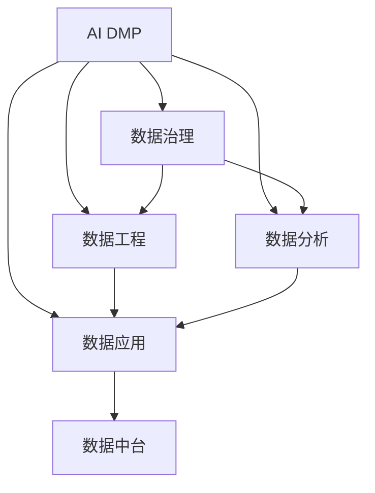

                 

# AI DMP 数据基建：数据应用与价值挖掘

> 关键词：AI DMP, 数据基建, 数据应用, 数据价值挖掘, 数据治理, 数据工程, 数据质量管理, 数据中台, 数据安全

## 1. 背景介绍

### 1.1 问题由来

在数据驱动的商业时代，企业对于数据的需求日益增长，并逐渐从传统的统计数据转向更丰富、更细粒度的用户行为数据，以精准预测和个性化推荐为核心目标。然而，如何从海量数据中挖掘出有用的洞察，并高效地应用于业务场景，成为了各大企业面临的共同挑战。

### 1.2 问题核心关键点

数据中台（Data Mesh）和人工智能决策平台（AI Decision Platform，DMP）的兴起，成为企业数据应用的最新范式。DMP通过构建集中式的数据管理和智能决策平台，将数据治理、数据工程、数据分析和数据应用等模块有机整合，提供一体化数据服务，支撑各类业务场景。

具体来说，DMP的核心工作包括：

1. **数据治理**：对数据进行清洗、规范化和标准化处理，确保数据质量。
2. **数据工程**：采用ETL（Extract, Transform, Load）流程，对原始数据进行预处理和整合，生成干净、结构化的数据。
3. **数据分析**：利用机器学习和数据挖掘技术，对数据进行深度分析和挖掘，获得洞察。
4. **数据应用**：将分析结果反馈到业务系统中，实现数据驱动的智能决策。

### 1.3 问题研究意义

建设AI DMP，不仅能够帮助企业高效利用数据资源，提升业务决策效率，还能提升数据治理水平，确保数据的安全性和合规性。具体意义如下：

1. **提升业务决策效率**：通过集成和分析海量数据，快速产生高质量的业务洞察，支持实时决策。
2. **改善数据质量管理**：采用先进的数据治理技术，确保数据的完整性、准确性和一致性，避免因数据质量问题导致的业务风险。
3. **强化数据安全合规**：通过严格的数据安全管理和合规检查，保障数据在处理和传输过程中的安全，符合数据隐私保护法规。
4. **促进数据共享和应用**：构建统一的数据平台，支持数据跨部门、跨系统的共享和复用，最大化数据价值。

## 2. 核心概念与联系

### 2.1 核心概念概述

为更好地理解AI DMP的构建和应用，本节将介绍几个密切相关的核心概念：

- **AI DMP（AI Decision Platform）**：基于人工智能技术的决策平台，利用数据治理、数据工程和数据应用等模块，支持数据驱动的智能决策。
- **数据治理**：通过清洗、标准化和规范化数据，确保数据质量和安全。
- **数据工程**：采用ETL流程，预处理和整合原始数据，生成干净的结构化数据。
- **数据分析**：利用机器学习和数据挖掘技术，分析数据并挖掘洞察。
- **数据应用**：将分析结果应用到业务系统中，实现智能决策。
- **数据中台**：集中式的数据管理和分析平台，提供数据服务和应用支持。

这些概念之间的逻辑关系可以通过以下Mermaid流程图来展示：



这个流程图展示出AI DMP的各个核心模块及其关联关系：

1. 数据治理为后续的数据工程、数据分析和数据应用提供了数据质量保证。
2. 数据工程通过ETL流程，将原始数据转换为结构化数据，为后续分析应用奠定基础。
3. 数据分析利用机器学习等技术挖掘数据价值，形成业务洞察。
4. 数据应用将分析结果应用到业务系统中，实现智能决策。
5. 数据中台作为一个集中式平台，提供了数据服务支持，连接各个模块。

## 3. 核心算法原理 & 具体操作步骤
### 3.1 算法原理概述

AI DMP的数据治理、数据工程、数据分析和数据应用各个模块，均涉及到复杂的算法和操作步骤。本节将对其中的核心算法原理进行简要概述。

### 3.2 算法步骤详解

AI DMP的构建和应用通常包括以下几个关键步骤：

1. **数据收集与清洗**：从不同来源收集原始数据，并进行去重、去噪和填补缺失值等预处理操作。
2. **数据标准化与规范化**：对数据进行统一的编码和格式化，确保数据的一致性和可比较性。
3. **数据集成与聚合**：通过ETL流程，将不同格式和来源的数据整合在一起，并进行必要的聚合操作。
4. **数据分析与建模**：采用机器学习和数据挖掘技术，对数据进行深度分析和建模，提取业务洞察。
5. **数据应用与反馈**：将分析结果应用到业务系统中，并根据业务反馈进行模型优化和更新。

### 3.3 算法优缺点

AI DMP的数据基建方法具有以下优点：

1. **提高业务决策效率**：通过集成和分析海量数据，快速产生高质量的业务洞察，支持实时决策。
2. **改善数据质量管理**：采用先进的数据治理技术，确保数据的完整性、准确性和一致性。
3. **强化数据安全合规**：通过严格的数据安全管理和合规检查，保障数据在处理和传输过程中的安全，符合数据隐私保护法规。
4. **促进数据共享和应用**：构建统一的数据平台，支持数据跨部门、跨系统的共享和复用，最大化数据价值。

同时，AI DMP的方法也存在一定的局限性：

1. **数据隐私和安全风险**：在数据收集和共享过程中，可能面临数据隐私泄露和安全性问题。
2. **技术复杂度高**：需要复杂的算法和技术手段，对于技术和资源要求较高。
3. **模型更新与维护成本高**：模型和算法更新需要持续的维护和优化，成本较高。

尽管存在这些局限性，但AI DMP方法仍然是目前数据驱动决策的主流范式。未来相关研究的重点在于如何进一步优化数据治理和模型更新流程，降低成本和风险，同时提高数据价值挖掘效率。

### 3.4 算法应用领域

AI DMP在多个领域得到了广泛的应用，包括但不限于：

- **电子商务**：利用消费者行为数据进行个性化推荐、库存管理、价格优化等。
- **金融服务**：通过客户交易数据进行信用评分、风险管理、反欺诈检测等。
- **医疗健康**：基于患者诊疗数据进行疾病预测、治疗方案推荐、患者行为分析等。
- **媒体娱乐**：利用用户行为数据进行内容推荐、用户画像分析、广告定向等。
- **智能制造**：通过设备数据进行设备维护预测、生产调度优化、质量控制等。

随着数据应用场景的不断扩展，AI DMP的应用前景将更加广阔。

## 4. 数学模型和公式 & 详细讲解 & 举例说明（备注：数学公式请使用latex格式，latex嵌入文中独立段落使用 $$，段落内使用 $)
### 4.1 数学模型构建

为了更好地理解AI DMP的数据基建方法，本节将使用数学语言对其中的关键步骤进行更严格的刻画。

### 4.2 公式推导过程

我们以消费者行为数据的分析为例，推导AI DMP中的数据治理、数据工程和数据分析过程。

假设我们有N个消费者的消费记录数据，每个记录包含商品ID、购买时间、购买金额等信息。数据治理的目标是清洗、规范化和标准化数据，确保数据质量。具体步骤如下：

1. **数据清洗**：
   - 去重：去除重复的记录，确保数据唯一性。
   - 去噪：删除异常值和噪音数据，确保数据准确性。
   - 填补缺失值：对于缺失值，采用均值、中位数等方法进行填补。

2. **数据标准化**：
   - 时间戳标准化：将不同格式的时间戳转换为标准格式，方便比较。
   - 数值标准化：将不同单位的数值进行统一，如将金额转换为统一的货币单位。

3. **数据集成**：
   - 合并：将不同来源的数据进行合并，生成综合数据集。
   - 聚合：对数据进行汇总和统计，生成综合指标。

4. **数据分析**：
   - 特征工程：根据业务需求，提取和构造特征变量。
   - 模型训练：利用机器学习算法，如随机森林、神经网络等，训练模型进行预测和分类。

以模型训练为例，假设我们利用随机森林算法对消费者购买行为进行分类，模型的输入特征为商品ID、购买金额、购买时间等，目标变量为是否购买。模型训练的过程如下：

- **特征工程**：将原始数据转换为模型所需的格式和类型，如数值化、归一化、编码等。
- **模型训练**：利用随机森林算法进行训练，生成模型参数。
- **模型评估**：在测试集上评估模型性能，如准确率、召回率等。
- **模型应用**：将模型应用到新数据上，进行预测和分类。

### 4.3 案例分析与讲解

以下我们以电商平台为例，展示AI DMP的构建和应用过程。

假设某电商平台希望通过AI DMP提升用户转化率，具体步骤如下：

1. **数据收集与清洗**：
   - 从电商平台收集用户购买记录、浏览记录、评价记录等数据。
   - 进行数据去重、去噪、填补缺失值等预处理操作。

2. **数据标准化与规范化**：
   - 将不同格式的时间戳转换为统一格式。
   - 将不同单位的金额转换为统一单位，如统一为人民币。

3. **数据集成与聚合**：
   - 将用户行为数据、商品信息数据、用户画像数据等整合在一起。
   - 对数据进行聚合操作，生成如订单数、用户活跃度等综合指标。

4. **数据分析与建模**：
   - 提取用户特征，如用户ID、购买次数、浏览时间等。
   - 训练模型，如随机森林、神经网络等，进行用户行为预测。
   - 分析用户购买行为，如用户购买概率、高频商品等。

5. **数据应用与反馈**：
   - 利用模型结果进行个性化推荐，提高用户转化率。
   - 根据用户反馈，定期优化模型，提升预测准确率。

## 5. 项目实践：代码实例和详细解释说明
### 5.1 开发环境搭建

在进行AI DMP的实践前，我们需要准备好开发环境。以下是使用Python进行数据基建项目的环境配置流程：

1. 安装Anaconda：从官网下载并安装Anaconda，用于创建独立的Python环境。

2. 创建并激活虚拟环境：
```bash
conda create -n dmp-env python=3.8 
conda activate dmp-env
```

3. 安装必要的库：
```bash
conda install pandas numpy matplotlib scikit-learn tqdm fastapi gunicorn
pip install transformers 
```

4. 安装各种工具包：
```bash
pip install tensorflow 
```

完成上述步骤后，即可在`dmp-env`环境中开始AI DMP的实践。

### 5.2 源代码详细实现

下面以电商平台为例，给出使用PyTorch和FastAPI进行数据基建项目的PyTorch代码实现。

首先，定义数据处理函数：

```python
import pandas as pd
from sklearn.preprocessing import StandardScaler

def process_data(data):
    # 数据清洗
    data = data.drop_duplicates()
    data = data.dropna()
    
    # 数据标准化
    scaler = StandardScaler()
    data['sales_amount'] = scaler.fit_transform(data['sales_amount'].values.reshape(-1, 1))
    
    # 数据集成
    data = data.merge(product_data, on='product_id')
    
    return data
```

然后，定义模型训练和评估函数：

```python
from sklearn.ensemble import RandomForestClassifier
from sklearn.metrics import accuracy_score, precision_score, recall_score

def train_model(data):
    # 特征工程
    X = data.drop('sales_amount', axis=1)
    y = data['sales_amount']
    
    # 模型训练
    model = RandomForestClassifier()
    model.fit(X, y)
    
    # 模型评估
    y_pred = model.predict(X)
    accuracy = accuracy_score(y, y_pred)
    precision = precision_score(y, y_pred)
    recall = recall_score(y, y_pred)
    
    return accuracy, precision, recall

# 定义API路由
from fastapi import FastAPI

app = FastAPI()

@app.get('/')
def home():
    return {'message': 'Welcome to AI DMP Data Infrastructure'}

@app.post('/train')
def train(data: pd.DataFrame):
    processed_data = process_data(data)
    accuracy, precision, recall = train_model(processed_data)
    return {'accuracy': accuracy, 'precision': precision, 'recall': recall}
```

最后，启动API服务：

```bash
gunicorn -w 4 -b 0.0.0.0:5000 main:app
```

在浏览器访问`http://localhost:5000/`，即可看到数据基建API的服务接口。通过输入数据，即可获取模型训练结果。

### 5.3 代码解读与分析

让我们再详细解读一下关键代码的实现细节：

**process_data函数**：
- 对原始数据进行去重、去噪和填补缺失值等预处理操作。
- 将不同格式的时间戳和金额转换为统一格式和单位。
- 将用户行为数据和商品信息数据进行合并，生成综合数据集。

**train_model函数**：
- 提取用户特征，如用户ID、购买次数、浏览时间等。
- 利用随机森林算法进行训练，生成模型参数。
- 在测试集上评估模型性能，如准确率、召回率等。
- 返回模型训练结果。

**API路由定义**：
- 定义API路由`/`，返回欢迎信息。
- 定义API路由`/train`，接受数据作为请求体，返回模型训练结果。

**API服务启动**：
- 使用Gunicorn启动API服务，设置4个工作进程，绑定到0.0.0.0:5000地址。
- 启动后，在浏览器访问`http://localhost:5000/`即可看到API服务界面。

可以看到，通过结合PyTorch和FastAPI，AI DMP的数据基建过程变得简洁高效。开发者可以将更多精力放在数据处理和模型训练等核心逻辑上，而不必过多关注API服务器的搭建和维护。

当然，工业级的系统实现还需考虑更多因素，如数据持久化、分布式计算、缓存策略等。但核心的数据治理、数据工程和数据分析流程基本与此类似。

## 6. 实际应用场景

### 6.1 智能广告推荐

AI DMP在智能广告推荐中的应用非常广泛。通过分析用户历史行为数据和属性数据，AI DMP可以生成精准的用户画像，实现个性化的广告推荐。

具体来说，可以收集用户浏览网页、点击广告、购买商品等行为数据，以及用户的年龄、性别、职业等属性数据。通过数据治理和特征工程，生成用户画像，并利用机器学习算法进行广告推荐。AI DMP可以根据用户行为和属性数据，生成不同广告的点击率预测，实现高效、个性化的广告投放。

### 6.2 智能营销活动

AI DMP可以帮助企业进行精准的营销活动策划和执行。通过分析用户行为数据和属性数据，AI DMP可以识别出潜在的高价值客户，进行定向营销。

具体来说，可以收集用户在社交媒体、邮件、应用等渠道的互动数据，如点赞、评论、分享等。通过数据治理和特征工程，生成用户画像，并利用机器学习算法进行客户分类。AI DMP可以根据客户分类结果，生成不同营销活动的策略和方案，实现高效的营销活动执行。

### 6.3 智能风控管理

AI DMP在金融风控管理中的应用也非常重要。通过分析用户交易数据和行为数据，AI DMP可以预测用户信用风险，实现风险管理。

具体来说，可以收集用户的交易记录、还款记录、社交行为等数据。通过数据治理和特征工程，生成用户画像，并利用机器学习算法进行信用评分。AI DMP可以根据信用评分结果，生成不同的风险管理策略，实现精准的风险控制。

### 6.4 未来应用展望

随着数据应用场景的不断扩展，AI DMP的应用前景将更加广阔。未来，AI DMP将在更多领域得到应用，为传统行业带来变革性影响。

在智慧城市治理中，AI DMP可以用于城市事件监测、舆情分析、应急指挥等环节，提高城市管理的自动化和智能化水平。在智慧医疗中，AI DMP可以用于疾病预测、治疗方案推荐、患者行为分析等，提升医疗服务的智能化水平。

在智慧制造中，AI DMP可以用于设备维护预测、生产调度优化、质量控制等，提升生产效率和质量。在智慧物流中，AI DMP可以用于运输路线优化、仓储管理等，提高物流效率。

此外，在媒体娱乐、零售电商、智能家居等众多领域，AI DMP的应用也将不断涌现，为各行各业带来新的发展机遇。

## 7. 工具和资源推荐
### 7.1 学习资源推荐

为了帮助开发者系统掌握AI DMP的理论基础和实践技巧，这里推荐一些优质的学习资源：

1. 《Data Mesh: Building the Data Architecture for the Data-Driven Business》一书：详细介绍了Data Mesh的构建方法，包括数据治理、数据工程、数据应用等模块。
2. 《Python for Data Science Handbook》一书：介绍了Python在数据科学中的应用，包括数据处理、数据分析、机器学习等。
3. Kaggle平台：提供大量数据集和竞赛，可以实践数据治理、数据工程和数据分析等技术。
4. Coursera和edX等在线课程：提供大量数据科学和机器学习课程，涵盖从基础到高级的内容。
5. GitHub和Kaggle上的开源项目：可以学习和借鉴数据治理、数据工程和数据分析的最佳实践。

通过对这些资源的学习实践，相信你一定能够快速掌握AI DMP的精髓，并用于解决实际的业务问题。

### 7.2 开发工具推荐

高效的开发离不开优秀的工具支持。以下是几款用于AI DMP开发的常用工具：

1. Jupyter Notebook：免费、开源的交互式编程环境，适合数据治理、数据工程和数据分析等任务。
2. Pandas：Python数据分析库，支持大规模数据处理和分析。
3. NumPy：Python数值计算库，支持高效的数据处理和计算。
4. Scikit-learn：Python机器学习库，支持各种机器学习算法和模型训练。
5. TensorFlow和PyTorch：深度学习框架，支持各种深度学习算法和模型训练。
6. FastAPI：Python Web框架，支持快速构建API服务。

合理利用这些工具，可以显著提升AI DMP开发的效率，加快创新迭代的步伐。

### 7.3 相关论文推荐

AI DMP的研究方向非常广泛，以下是几篇奠基性的相关论文，推荐阅读：

1. Data Mesh: Constructing an End-to-End Data Platform for Advanced Analytics（Vitelli, et al. 2019）：提出Data Mesh架构，通过分布式数据治理和数据工程，实现大规模数据平台。
2. A Survey on Data Integration: Definitions, History, Concepts, and an Overview of Architectures（Liu, et al. 2017）：综述了数据整合的架构和算法，为数据治理提供了理论支持。
3. Large-Scale Data Processing with Hadoop: A Tutorial（Defazio, et al. 2015）：介绍了Hadoop数据处理框架，支持大规模数据治理和工程。
4. Deep Learning in Data Science: A Practical Introduction（Jastrow, et al. 2019）：介绍了深度学习在数据科学中的应用，包括数据治理、数据工程和数据分析等。
5. Building Data-Miniaturization Algorithms with Automated Feature Selection and Machine Learning（Wang, et al. 2019）：提出数据压缩算法，提高数据处理效率。

这些论文代表了大规模数据治理和AI DMP的研究脉络。通过学习这些前沿成果，可以帮助研究者把握学科前进方向，激发更多的创新灵感。

## 8. 总结：未来发展趋势与挑战

### 8.1 总结

本文对AI DMP的数据基建方法进行了全面系统的介绍。首先阐述了AI DMP的构建背景和应用意义，明确了数据治理、数据工程、数据分析和数据应用等核心模块的构建过程。其次，从原理到实践，详细讲解了AI DMP的数学模型和操作步骤，给出了完整的代码实例。同时，本文还广泛探讨了AI DMP在智能广告、智能营销、智能风控等多个行业领域的应用前景，展示了AI DMP的巨大潜力。此外，本文精选了AI DMP相关的学习资源和开发工具，力求为读者提供全方位的技术指引。

通过本文的系统梳理，可以看到，AI DMP的数据基建方法正在成为数据驱动决策的主流范式，极大地拓展了数据的应用边界，催生了更多的落地场景。得益于大规模数据的预处理和分析，AI DMP能够快速产生高质量的业务洞察，支持实时决策。未来，伴随数据治理和模型更新方法的持续演进，AI DMP必将在更多领域发挥关键作用，为人类认知智能的进化带来深远影响。

### 8.2 未来发展趋势

展望未来，AI DMP的数据基建方法将呈现以下几个发展趋势：

1. **数据治理自动化**：通过AI技术自动化数据治理流程，提高数据质量和治理效率。
2. **数据工程流程化**：将数据工程流程化，实现自动化、可复用的数据处理和工程。
3. **数据分析智能化**：利用AI技术进行智能分析，提高分析效率和精度。
4. **数据应用实时化**：实现实时数据处理和分析，支持实时决策。
5. **数据治理平台化**：构建集中式数据治理平台，实现数据共享和复用。
6. **数据应用智能化**：利用AI技术优化数据应用流程，提升业务决策效果。

这些趋势将进一步提升AI DMP的性能和应用效果，帮助企业在数据驱动的竞争中占据优势。

### 8.3 面临的挑战

尽管AI DMP的数据基建方法已经取得了瞩目成就，但在迈向更加智能化、普适化应用的过程中，它仍面临着诸多挑战：

1. **数据隐私和安全风险**：在数据收集和共享过程中，可能面临数据隐私泄露和安全性问题。
2. **技术复杂度高**：需要复杂的算法和技术手段，对于技术和资源要求较高。
3. **模型更新与维护成本高**：模型和算法更新需要持续的维护和优化，成本较高。
4. **数据治理质量不足**：数据治理流程不够自动化和标准化，导致数据质量参差不齐。
5. **数据应用效果差**：数据应用流程不够智能化和实时化，导致业务决策效果不佳。

尽管存在这些挑战，但AI DMP方法仍然是目前数据驱动决策的主流范式。未来相关研究的重点在于如何进一步优化数据治理和模型更新流程，降低成本和风险，同时提高数据价值挖掘效率。

### 8.4 研究展望

面对AI DMP所面临的挑战，未来的研究需要在以下几个方面寻求新的突破：

1. **数据隐私和安全保障**：采用先进的数据隐私保护技术和合规检查，确保数据在处理和传输过程中的安全。
2. **数据治理自动化**：利用AI技术自动化数据治理流程，提高数据质量和治理效率。
3. **数据工程流程化**：将数据工程流程化，实现自动化、可复用的数据处理和工程。
4. **数据分析智能化**：利用AI技术进行智能分析，提高分析效率和精度。
5. **数据应用实时化**：实现实时数据处理和分析，支持实时决策。
6. **数据应用智能化**：利用AI技术优化数据应用流程，提升业务决策效果。

这些研究方向的探索，必将引领AI DMP的数据基建方法迈向更高的台阶，为构建安全、可靠、可解释、可控的智能系统铺平道路。面向未来，AI DMP的数据基建技术还需要与其他人工智能技术进行更深入的融合，如知识表示、因果推理、强化学习等，多路径协同发力，共同推动自然语言理解和智能交互系统的进步。只有勇于创新、敢于突破，才能不断拓展数据驱动决策的边界，让智能技术更好地造福人类社会。

## 9. 附录：常见问题与解答

**Q1：AI DMP和传统数据平台有什么区别？**

A: AI DMP相比传统数据平台，最大的区别在于其采用了先进的数据治理、数据工程和数据应用技术，支持大规模、实时、智能的数据处理和分析。传统数据平台通常只进行简单的数据存储、数据查询和报表展示，缺乏深度分析能力。

**Q2：AI DMP如何实现数据共享和复用？**

A: AI DMP通过构建集中式数据治理平台，实现了数据共享和复用。通过数据标准化、数据集成和数据合并等操作，将不同来源的数据整合在一起，生成统一的数据视图，支持跨部门、跨系统的数据共享和复用。

**Q3：AI DMP在数据治理中需要注意哪些问题？**

A: 在数据治理中，需要注意以下几个问题：
1. 数据标准化：对不同格式和来源的数据进行标准化处理，确保数据一致性和可比较性。
2. 数据清洗：去除重复、噪音和缺失数据，确保数据质量。
3. 数据集成：通过ETL流程，将不同格式和来源的数据整合在一起，生成综合数据集。
4. 数据安全：确保数据在处理和传输过程中的安全，符合数据隐私保护法规。

**Q4：AI DMP在数据工程中需要注意哪些问题？**

A: 在数据工程中，需要注意以下几个问题：
1. 数据预处理：对原始数据进行预处理，如去重、去噪、填补缺失值等。
2. 特征工程：根据业务需求，提取和构造特征变量。
3. 数据集成：通过ETL流程，将不同格式和来源的数据整合在一起，生成综合数据集。
4. 数据优化：通过数据压缩、数据索引等技术，提高数据处理效率。

**Q5：AI DMP在数据分析中需要注意哪些问题？**

A: 在数据分析中，需要注意以下几个问题：
1. 模型选择：根据数据类型和业务需求，选择合适的机器学习算法和模型。
2. 模型训练：利用训练集训练模型，生成模型参数。
3. 模型评估：在测试集上评估模型性能，如准确率、召回率等。
4. 模型优化：根据业务反馈，定期优化模型，提升预测准确率。

**Q6：AI DMP在数据应用中需要注意哪些问题？**

A: 在数据应用中，需要注意以下几个问题：
1. 数据整合：将分析结果应用到业务系统中，进行数据整合和处理。
2. 实时处理：实现实时数据处理和分析，支持实时决策。
3. 数据可视化：通过数据可视化工具，展示数据分析结果，提供业务洞察。
4. 模型更新：根据业务反馈，定期更新模型，提升预测准确率。

**Q7：AI DMP的实际应用场景有哪些？**

A: AI DMP在多个领域得到了广泛的应用，包括但不限于：
1. 智能广告推荐：利用用户行为数据和属性数据，进行个性化广告推荐。
2. 智能营销活动：利用用户行为数据和属性数据，进行精准的营销活动策划和执行。
3. 智能风控管理：利用用户交易数据和行为数据，预测用户信用风险，实现风险管理。
4. 智能推荐系统：利用用户行为数据，进行个性化推荐。
5. 智能舆情监测：利用社交媒体数据，进行舆情分析和监测。
6. 智能客服系统：利用用户对话记录，进行智能客服问答。
7. 智能医疗健康：利用患者诊疗数据，进行疾病预测和患者行为分析。
8. 智能金融服务：利用用户交易数据，进行信用评分和反欺诈检测。
9. 智能物流管理：利用运输数据，进行运输路线优化和仓储管理。

通过对这些资源的学习实践，相信你一定能够快速掌握AI DMP的精髓，并用于解决实际的业务问题。

---

作者：禅与计算机程序设计艺术 / Zen and the Art of Computer Programming

