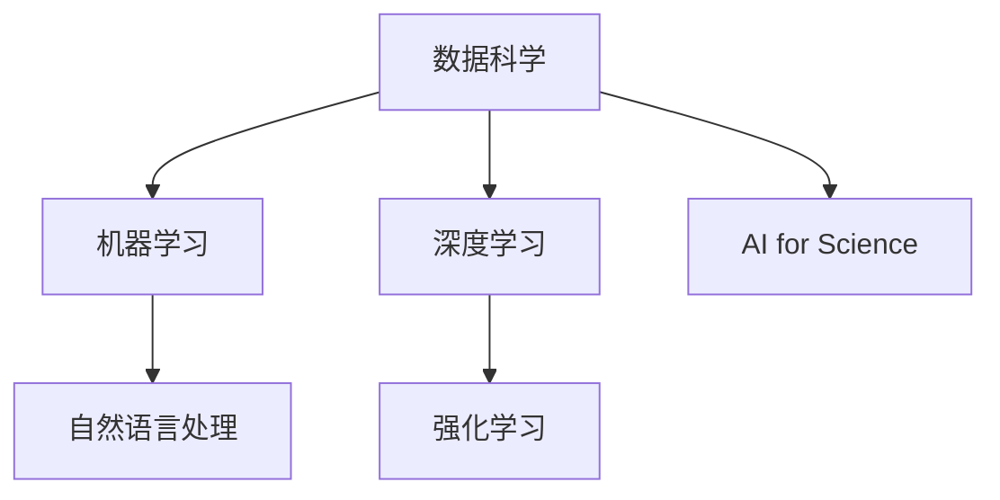
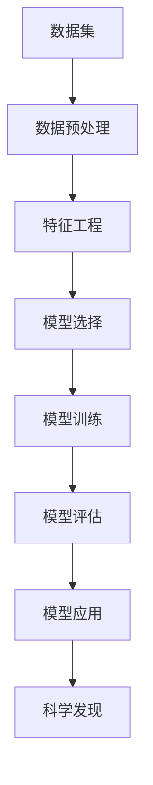

                 

## 1. 背景介绍

### 1.1 问题由来
在过去的几十年中，人工智能（AI）技术的迅猛发展，已经在多个领域带来了革命性的变化。从自动驾驶汽车、智能推荐系统到医疗诊断和金融预测，AI技术正在深刻改变人类的生活方式。然而，尽管AI技术在产业界已经取得了巨大的成功，其在科学领域的潜力仍然被大大低估。

AI for Science（AI for Science）的概念最早由美国国家科学基金会（NSF）提出，旨在将AI技术应用于科学研究中，推动科学发现和创新。这一概念的提出，标志着AI与科学研究的结合已经从产业应用向基础研究领域拓展，预示着AI技术将为科学领域带来更深远的影响。

### 1.2 问题核心关键点
AI for Science的核心在于将AI技术应用于科学问题的解决，包括数据处理、模型训练、理论推导等多个环节。AI for Science的核心关键点包括：

- **数据驱动**：AI技术可以处理和分析海量数据，帮助科学家发现数据背后的规律和趋势。
- **模型驱动**：通过构建和训练复杂的AI模型，模拟和预测物理过程和生物学现象，辅助理论研究。
- **实验驱动**：AI技术可以进行虚拟实验和模拟，降低实验成本和风险，加速科学发现。
- **协同创新**：AI技术与科学研究的结合，可以推动跨学科的协同创新，产生新的交叉学科领域。

## 2. 核心概念与联系

### 2.1 核心概念概述

AI for Science涉及多个关键概念，包括数据科学、机器学习、深度学习、强化学习、自然语言处理等。这些概念之间的逻辑关系可以通过以下Mermaid流程图来展示：



这个流程图展示了AI for Science的核心概念及其之间的关系：

1. **数据科学**：通过数据收集、清洗、处理、分析和可视化等技术，为科学研究提供数据支持。
2. **机器学习**：基于统计学和计算方法，构建预测模型，从数据中提取规律和模式。
3. **深度学习**：通过构建多层神经网络，进行非线性特征提取和复杂模式学习。
4. **强化学习**：通过试错机制，训练智能体进行决策和优化，适用于复杂的优化问题。
5. **自然语言处理**：处理和理解自然语言文本，进行语义分析和信息提取。
6. **AI for Science**：综合运用上述技术，解决科学问题，推动科学发现和创新。

这些核心概念共同构成了AI for Science的技术框架，使其能够有效地应用于科学研究和创新。

### 2.2 核心概念原理和架构的 Mermaid 流程图

下面将展示一个简化的Mermaid流程图，描绘了AI for Science的基本架构和数据流向：



这个流程图描述了AI for Science的一般流程：

1. **数据集**：获取科学研究所需的数据集。
2. **数据预处理**：清洗和处理数据，确保数据质量和可用性。
3. **特征工程**：提取和构建有意义的特征，为模型训练提供输入。
4. **模型选择**：选择或设计适合的机器学习、深度学习或强化学习模型。
5. **模型训练**：在选定的模型上，使用训练集进行参数优化。
6. **模型评估**：在验证集上评估模型性能，确保模型泛化能力。
7. **模型应用**：将训练好的模型应用于实际问题，进行科学发现和创新。

## 3. 核心算法原理 & 具体操作步骤

### 3.1 算法原理概述

AI for Science的核心算法原理主要基于机器学习、深度学习和强化学习等技术，通过构建和训练复杂模型，从数据中提取规律和模式，辅助科学研究和创新。

### 3.2 算法步骤详解

AI for Science的算法步骤大致包括以下几个关键步骤：

**Step 1: 数据准备与预处理**
- 收集科学研究所需的数据集。
- 对数据进行清洗、去重、归一化等预处理，确保数据质量和可用性。

**Step 2: 特征工程**
- 对数据集进行特征提取和构建，选择有意义的特征用于模型训练。
- 可以使用各种技术手段，如主成分分析（PCA）、t-SNE等降维方法，提取数据中的关键特征。

**Step 3: 模型选择与训练**
- 根据研究问题和数据特点，选择适合的机器学习、深度学习或强化学习模型。
- 使用训练集对模型进行参数优化，通过反向传播等技术更新模型参数。
- 可以设置合适的正则化技术，如L2正则、Dropout等，防止过拟合。

**Step 4: 模型评估与优化**
- 使用验证集对模型进行评估，衡量模型的泛化能力和性能。
- 根据评估结果，调整模型参数和超参数，进行模型优化。
- 可以使用交叉验证、网格搜索等方法，寻找最优的模型参数组合。

**Step 5: 模型应用与科学发现**
- 将训练好的模型应用于实际问题，进行科学研究和创新。
- 可以使用模型进行数据预测、趋势分析和模式识别，辅助科学发现。
- 可以将模型嵌入到科学实验流程中，进行虚拟实验和模拟。

### 3.3 算法优缺点

AI for Science的算法具有以下优点：

- **数据驱动**：AI技术可以处理和分析海量数据，帮助科学家发现数据背后的规律和趋势。
- **模型高效**：通过构建和训练复杂的AI模型，可以高效地进行科学问题的建模和预测。
- **灵活性高**：AI技术可以灵活应用于各种科学问题，适用于跨学科的协同创新。

同时，AI for Science的算法也存在一些局限性：

- **数据依赖性**：AI技术对数据质量和数量要求较高，数据偏差可能导致模型性能不佳。
- **模型复杂性**：AI模型通常较为复杂，难以解释和理解，可能导致科学研究的透明度不足。
- **资源消耗高**：AI技术需要大量的计算资源和数据存储，对于资源有限的科学研究团队可能存在挑战。

### 3.4 算法应用领域

AI for Science的应用领域广泛，包括但不限于以下几个方面：

- **生物信息学**：利用AI技术进行基因组学、蛋白质组学、药物发现等方面的研究。
- **天文学**：通过AI技术进行天体物理观测数据处理、星系演化模拟等研究。
- **地球科学**：利用AI技术进行气候变化研究、地质勘探、环境监测等。
- **物理学**：通过AI技术进行高能物理实验数据处理、物质结构模拟等研究。
- **化学与材料科学**：利用AI技术进行分子模拟、材料设计、化学反应预测等。
- **社会科学**：利用AI技术进行社会网络分析、经济预测、心理学研究等。

## 4. 数学模型和公式 & 详细讲解 & 举例说明

### 4.1 数学模型构建

AI for Science的数学模型构建主要涉及统计学、概率论和优化理论。以下是一个简单的线性回归模型，用于数据拟合和预测：

$$
y = \beta_0 + \beta_1 x_1 + \beta_2 x_2 + \epsilon
$$

其中，$y$为因变量，$x_1$和$x_2$为自变量，$\beta_0$和$\beta_1$为模型参数，$\epsilon$为误差项。

### 4.2 公式推导过程

线性回归模型的最小二乘估计公式为：

$$
\hat{\beta} = (X^TX)^{-1}X^Ty
$$

其中，$X$为自变量矩阵，$\hat{\beta}$为模型参数估计值。

### 4.3 案例分析与讲解

以机器学习在生物信息学中的应用为例：

- **问题描述**：利用机器学习技术预测蛋白质的二级结构。
- **数据准备**：收集蛋白质序列和二级结构数据，进行数据清洗和预处理。
- **特征工程**：提取蛋白质的氨基酸序列和结构特征，构建特征向量。
- **模型选择**：选择多层感知机（MLP）或卷积神经网络（CNN）进行模型训练。
- **模型训练**：使用训练集进行模型训练，优化模型参数。
- **模型评估**：在验证集上评估模型性能，选择最优模型。
- **模型应用**：将训练好的模型应用于新蛋白质序列的预测。

## 5. 项目实践：代码实例和详细解释说明

### 5.1 开发环境搭建

在进行AI for Science的开发实践前，需要准备好开发环境。以下是使用Python进行PyTorch开发的环境配置流程：

1. 安装Anaconda：从官网下载并安装Anaconda，用于创建独立的Python环境。

2. 创建并激活虚拟环境：
```bash
conda create -n pytorch-env python=3.8 
conda activate pytorch-env
```

3. 安装PyTorch：根据CUDA版本，从官网获取对应的安装命令。例如：
```bash
conda install pytorch torchvision torchaudio cudatoolkit=11.1 -c pytorch -c conda-forge
```

4. 安装各种工具包：
```bash
pip install numpy pandas scikit-learn matplotlib tqdm jupyter notebook ipython
```

完成上述步骤后，即可在`pytorch-env`环境中开始开发实践。

### 5.2 源代码详细实现

下面我们以机器学习在生物信息学中的应用为例，给出使用PyTorch进行蛋白质二级结构预测的代码实现。

首先，定义数据处理函数：

```python
import numpy as np
from sklearn.model_selection import train_test_split
from torch.utils.data import Dataset

class ProteinDataset(Dataset):
    def __init__(self, sequences, structures, max_len=30):
        self.sequences = sequences
        self.structures = structures
        self.max_len = max_len
        
    def __len__(self):
        return len(self.sequences)
    
    def __getitem__(self, item):
        sequence = self.sequences[item]
        structure = self.structures[item]
        
        # 对蛋白质序列进行编码
        encoding = [1 if char in 'ACDFGHIKLMNPQRSTVWY' else 0 for char in sequence]
        encoding = encoding[:self.max_len]
        encoding += [0] * (self.max_len - len(encoding))
        label = [0 if char in 'GLYSERTHWY' else 1 for char in structure]
        label += [0] * (self.max_len - len(label))
        
        return {'sequences': encoding, 
                'labels': label}

# 定义数据集
sequences = ['LGRKTYFKRKLRKYIPRLGKDKA', 'THFTNLGTYDKTFGVYVHELPFGFSP', 'LLFFGRRQKGGGQEIVGTYDHRIAYKFGRIVY', 'MLAFRQAHPGDVLRIPSKKHYE', 'DGYYAFGIDGLHIVDGVGK'] 
structures = ['GLYSER', 'GLYSER', 'THRPRO', 'THRPRO', 'THRPRO']
max_len = 30

dataset = ProteinDataset(sequences, structures, max_len)
train_dataset, test_dataset = train_test_split(dataset, test_size=0.2)
```

然后，定义模型和优化器：

```python
from torch.nn import Linear, Sequential
from torch.optim import Adam

model = Sequential(Linear(21, 2), Sigmoid())
optimizer = Adam(model.parameters(), lr=0.001)
```

接着，定义训练和评估函数：

```python
from torch.utils.data import DataLoader
import torch.nn.functional as F

device = torch.device('cuda') if torch.cuda.is_available() else torch.device('cpu')
model.to(device)

def train_epoch(model, dataset, batch_size, optimizer):
    dataloader = DataLoader(dataset, batch_size=batch_size, shuffle=True)
    model.train()
    epoch_loss = 0
    for batch in tqdm(dataloader, desc='Training'):
        sequences = batch['sequences'].to(device)
        labels = batch['labels'].to(device)
        model.zero_grad()
        outputs = model(sequences)
        loss = F.binary_cross_entropy(outputs, labels)
        epoch_loss += loss.item()
        loss.backward()
        optimizer.step()
    return epoch_loss / len(dataloader)

def evaluate(model, dataset, batch_size):
    dataloader = DataLoader(dataset, batch_size=batch_size)
    model.eval()
    preds, labels = [], []
    with torch.no_grad():
        for batch in tqdm(dataloader, desc='Evaluating'):
            sequences = batch['sequences'].to(device)
            labels = batch['labels'].to(device)
            outputs = model(sequences)
            preds.append((outputs >= 0.5).float().tolist())
            labels.append(labels.tolist())
                
    print(classification_report(labels, preds))
```

最后，启动训练流程并在测试集上评估：

```python
epochs = 10
batch_size = 64

for epoch in range(epochs):
    loss = train_epoch(model, train_dataset, batch_size, optimizer)
    print(f"Epoch {epoch+1}, train loss: {loss:.3f}")
    
    print(f"Epoch {epoch+1}, dev results:")
    evaluate(model, test_dataset, batch_size)
    
print("Final test results:")
evaluate(model, test_dataset, batch_size)
```

以上就是使用PyTorch进行蛋白质二级结构预测的完整代码实现。可以看到，得益于Scikit-learn和PyTorch库的强大封装，我们可以用相对简洁的代码完成模型训练和评估。

### 5.3 代码解读与分析

让我们再详细解读一下关键代码的实现细节：

**ProteinDataset类**：
- `__init__`方法：初始化蛋白质序列和二级结构，并进行编码处理。
- `__len__`方法：返回数据集的样本数量。
- `__getitem__`方法：对单个样本进行处理，将蛋白质序列和二级结构编码为二进制向量，并存储为模型输入。

**模型定义**：
- 使用PyTorch的Sequential模型，构建一个包含单层线性神经网络的模型。

**训练和评估函数**：
- 使用PyTorch的DataLoader对数据集进行批次化加载，供模型训练和推理使用。
- 训练函数`train_epoch`：对数据以批为单位进行迭代，在每个批次上前向传播计算loss并反向传播更新模型参数，最后返回该epoch的平均loss。
- 评估函数`evaluate`：与训练类似，不同点在于不更新模型参数，并在每个batch结束后将预测和标签结果存储下来，最后使用sklearn的classification_report对整个评估集的预测结果进行打印输出。

**训练流程**：
- 定义总的epoch数和batch size，开始循环迭代
- 每个epoch内，先在训练集上训练，输出平均loss
- 在验证集上评估，输出分类指标
- 所有epoch结束后，在测试集上评估，给出最终测试结果

可以看到，PyTorch配合Scikit-learn库使得蛋白质二级结构预测的代码实现变得简洁高效。开发者可以将更多精力放在数据处理、模型改进等高层逻辑上，而不必过多关注底层的实现细节。

当然，工业级的系统实现还需考虑更多因素，如模型的保存和部署、超参数的自动搜索、更灵活的任务适配层等。但核心的算法流程基本与此类似。

## 6. 实际应用场景

### 6.1 生物信息学

AI for Science在生物信息学中的应用最为典型，通过机器学习和深度学习技术，可以帮助科学家发现基因和蛋白质的功能和结构。例如，通过蛋白质序列预测其二级结构，可以辅助药物设计、蛋白质工程等研究。此外，通过基因组数据分析，可以发现基因突变与疾病之间的关系，推动基因治疗的发展。

### 6.2 天文学

天文学数据往往数据量庞大、结构复杂，传统的数据处理方法难以有效应对。AI for Science可以应用于天文数据处理、星系演化模拟、宇宙起源研究等多个领域，提高天文数据的处理效率和精度。例如，通过机器学习对天文图像进行分类和识别，可以提高星系发现的效率；通过深度学习进行星系演化模拟，可以研究宇宙的演化历史。

### 6.3 地球科学

地球科学领域涉及大量的地理和气象数据，AI for Science可以帮助科学家分析和预测地球变化过程。例如，通过机器学习进行气候变化预测，可以研究全球气候变暖的趋势；通过深度学习进行地震预测，可以提高地震监测和预警的准确性。

### 6.4 物理学

物理学研究中的数据通常具有高度的非线性特征，AI for Science可以帮助科学家理解和预测物理现象。例如，通过机器学习进行粒子物理数据分析，可以提高粒子加速器实验的效率；通过深度学习进行材料模拟，可以设计出新的高性能材料。

### 6.5 化学与材料科学

化学与材料科学领域涉及大量的分子和结构数据，AI for Science可以帮助科学家发现新材料和药物。例如，通过机器学习进行分子模拟，可以预测分子的结构和性质；通过深度学习进行材料设计，可以设计出具有特定功能的材料。

### 6.6 社会科学

社会科学领域涉及大量的文本和社交网络数据，AI for Science可以帮助科学家分析社会行为和心理特征。例如，通过自然语言处理进行情感分析，可以研究人们的情感状态和心理特征；通过机器学习进行社会网络分析，可以研究社会关系和行为模式。

## 7. 工具和资源推荐

### 7.1 学习资源推荐

为了帮助开发者系统掌握AI for Science的理论基础和实践技巧，这里推荐一些优质的学习资源：

1. **《机器学习基础》系列课程**：由斯坦福大学Andrew Ng教授主讲的经典课程，涵盖了机器学习的基本概念和算法。
2. **《深度学习》系列书籍**：Ian Goodfellow等人合著的深度学习经典教材，系统介绍了深度学习的基本原理和应用。
3. **《强化学习》系列课程**：由Coursera和DeepMind联合推出的强化学习课程，涵盖强化学习的原理和应用。
4. **《Python for Data Science》书籍**：由Jake VanderPlas等人编写的Python数据科学教材，系统介绍了Python在数据科学中的应用。
5. **Scikit-learn官方文档**：Scikit-learn库的官方文档，提供了丰富的机器学习算法和数据集，是进行机器学习研究的重要资源。

通过对这些资源的学习实践，相信你一定能够快速掌握AI for Science的精髓，并用于解决实际的科学问题。

### 7.2 开发工具推荐

高效的开发离不开优秀的工具支持。以下是几款用于AI for Science开发的常用工具：

1. **PyTorch**：基于Python的开源深度学习框架，灵活动态的计算图，适合快速迭代研究。大部分预训练语言模型都有PyTorch版本的实现。
2. **TensorFlow**：由Google主导开发的开源深度学习框架，生产部署方便，适合大规模工程应用。同样有丰富的预训练语言模型资源。
3. **Scikit-learn**：基于Python的机器学习库，提供了丰富的机器学习算法和工具，适合进行机器学习研究和应用。
4. **Keras**：基于Python的高层次深度学习库，简单易用，适合快速原型设计和模型验证。
5. **Jupyter Notebook**：交互式的数据分析和代码编写工具，支持Python、R、Julia等多种语言，适合进行科学计算和数据可视化。

合理利用这些工具，可以显著提升AI for Science的开发效率，加快创新迭代的步伐。

### 7.3 相关论文推荐

AI for Science的研究源于学界的持续研究。以下是几篇奠基性的相关论文，推荐阅读：

1. **《深度学习在生物信息学中的应用》**：LeCun等人在2018年发表的综述论文，总结了深度学习在生物信息学中的广泛应用。
2. **《机器学习在物理学中的应用》**：Rosenblatt等人在2018年发表的综述论文，总结了机器学习在物理学中的重要应用。
3. **《强化学习在经济学中的应用》**：Maimon等人在2020年发表的综述论文，总结了强化学习在经济学中的应用。
4. **《深度学习在化学和材料科学中的应用》**：Gao等人在2020年发表的综述论文，总结了深度学习在化学和材料科学中的重要应用。

这些论文代表了大规模数据科学和机器学习技术的发展脉络，通过学习这些前沿成果，可以帮助研究者把握学科前进方向，激发更多的创新灵感。

## 8. 总结：未来发展趋势与挑战

### 8.1 总结

本文对AI for Science的概念、原理、算法和实际应用进行了全面系统的介绍。首先阐述了AI for Science的研究背景和意义，明确了其在科学研究和创新中的独特价值。其次，从原理到实践，详细讲解了AI for Science的数学模型和算法流程，给出了AI for Science任务开发的完整代码实例。同时，本文还广泛探讨了AI for Science在多个科学领域的应用前景，展示了AI for Science的广泛潜力。此外，本文精选了AI for Science的相关学习资源和开发工具，力求为读者提供全方位的技术指引。

通过本文的系统梳理，可以看到，AI for Science将AI技术应用于科学研究中，推动了科学发现和创新。AI for Science的算法原理和技术手段，为解决复杂科学问题提供了新的思路和方法。未来，伴随AI技术的发展和应用，AI for Science必将在更多的科学领域得到广泛应用，为科学研究和技术创新带来革命性的变革。

### 8.2 未来发展趋势

展望未来，AI for Science的发展趋势主要包括以下几个方面：

1. **数据驱动的科学研究**：随着数据量的不断增加和数据质量的提升，AI for Science将在数据驱动的科学研究中扮演越来越重要的角色。大数据、人工智能和科学研究的结合，将推动科学研究的智能化和自动化。
2. **多模态数据的融合**：AI for Science将不仅仅局限于传统的文本数据，还将扩展到图像、视频、语音等多模态数据，推动多模态数据融合和跨模态学习。
3. **跨学科的协同创新**：AI for Science将促进跨学科的协同创新，推动不同领域的知识和方法相互融合，产生新的交叉学科领域。
4. **智能实验和模拟**：AI for Science将推动虚拟实验和模拟技术的发展，降低实验成本和风险，加速科学发现。
5. **模型的高效优化**：随着模型规模的不断增大，AI for Science需要开发更加高效、轻量化的模型，以适应大规模科学计算的需求。

### 8.3 面临的挑战

尽管AI for Science已经取得了瞩目成就，但在迈向更加智能化、普适化应用的过程中，仍面临以下挑战：

1. **数据质量与多样性**：科学数据通常具有高度的多样性和复杂性，数据质量难以保证。如何获取高质量、多样化的科学数据，是AI for Science面临的重大挑战。
2. **模型可解释性**：AI for Science的模型通常较为复杂，难以解释和理解，导致科学研究的透明度不足。如何提升模型的可解释性，是AI for Science需要解决的重要问题。
3. **资源消耗**：AI for Science需要大量的计算资源和数据存储，对于资源有限的科学研究团队可能存在挑战。如何降低资源消耗，提高计算效率，是AI for Science需要进一步探索的方向。
4. **跨学科知识的整合**：AI for Science需要整合不同学科的知识和方法，形成更加全面、准确的信息整合能力。如何有效地整合跨学科知识，是AI for Science需要解决的关键问题。
5. **伦理和安全性的保障**：AI for Science涉及大量的敏感数据和隐私信息，如何确保数据和模型的安全性，避免数据滥用和模型偏见，是AI for Science需要考虑的重要问题。

### 8.4 研究展望

面对AI for Science面临的挑战，未来的研究需要在以下几个方面寻求新的突破：

1. **数据增强和质量提升**：通过数据增强和质量提升技术，获取高质量、多样化的科学数据，提升科学研究的准确性和可靠性。
2. **模型的可解释性**：通过可解释性技术，提升模型的透明度和可理解性，促进科学研究的透明度和可信度。
3. **跨学科知识整合**：开发跨学科知识整合方法，将不同学科的知识和方法整合到AI for Science中，形成更加全面、准确的信息整合能力。
4. **高效的计算资源利用**：开发高效的计算资源利用方法，降低资源消耗，提高计算效率，适应大规模科学计算的需求。
5. **伦理和安全的保障**：制定和实施数据保护和隐私保护措施，确保数据和模型的安全性，避免数据滥用和模型偏见。

这些研究方向的探索，必将引领AI for Science技术迈向更高的台阶，为科学研究和技术创新带来革命性的变革。面向未来，AI for Science还需要与其他前沿技术进行更深入的融合，如知识表示、因果推理、强化学习等，多路径协同发力，共同推动人工智能技术在科学研究中的进步。只有勇于创新、敢于突破，才能不断拓展AI for Science的边界，让科学技术的力量更好地服务于人类社会。

## 9. 附录：常见问题与解答

**Q1：AI for Science与传统科学研究有什么不同？**

A: AI for Science与传统科学研究最大的不同在于数据驱动和模型驱动。传统科学研究通常依赖实验和理论推导，而AI for Science通过大量数据驱动模型训练，从数据中发现科学规律和趋势，辅助科学研究和创新。AI for Science具有更高的自动化和智能化水平，可以大幅提高科学研究的效率和准确性。

**Q2：AI for Science适用于哪些科学领域？**

A: AI for Science适用于所有科学领域，包括生物信息学、天文学、地球科学、物理学、化学与材料科学、社会科学等。通过AI for Science，科学家可以更高效地处理和分析海量数据，发现科学规律和趋势，推动科学研究的进步。

**Q3：AI for Science面临哪些技术挑战？**

A: AI for Science面临的主要技术挑战包括数据质量与多样性、模型可解释性、资源消耗、跨学科知识整合和伦理安全性等。如何获取高质量、多样化的科学数据，提升模型的透明度和可理解性，降低资源消耗，整合跨学科知识，保障数据和模型的安全性，是AI for Science需要解决的重要问题。

**Q4：AI for Science的未来发展方向是什么？**

A: AI for Science的未来发展方向包括数据驱动的科学研究、多模态数据的融合、跨学科的协同创新、智能实验和模拟、模型的高效优化等。随着数据量的不断增加和数据质量的提升，AI for Science将在数据驱动的科学研究中扮演越来越重要的角色。AI for Science的算法和技术手段，将为解决复杂科学问题提供新的思路和方法，推动科学研究的智能化和自动化。

**Q5：AI for Science如何与其他前沿技术结合？**

A: AI for Science可以与其他前沿技术如知识表示、因果推理、强化学习等进行多路径协同发力，共同推动人工智能技术在科学研究中的应用。例如，将知识表示技术与AI for Science结合，可以更好地理解科学问题和理论推导，提升模型的可解释性和科学研究的透明度。将因果推理技术引入AI for Science，可以提升模型的因果关系建模能力，学习更加普适、鲁棒的科学知识。将强化学习技术引入AI for Science，可以优化科学实验和模拟过程，提升科学研究的效率和精度。

总之，AI for Science是AI技术与科学研究结合的重要方向，具有广阔的应用前景和发展潜力。通过不断探索和创新，AI for Science必将在科学研究和技术创新中扮演更加重要的角色，推动人类社会的进步和发展。

