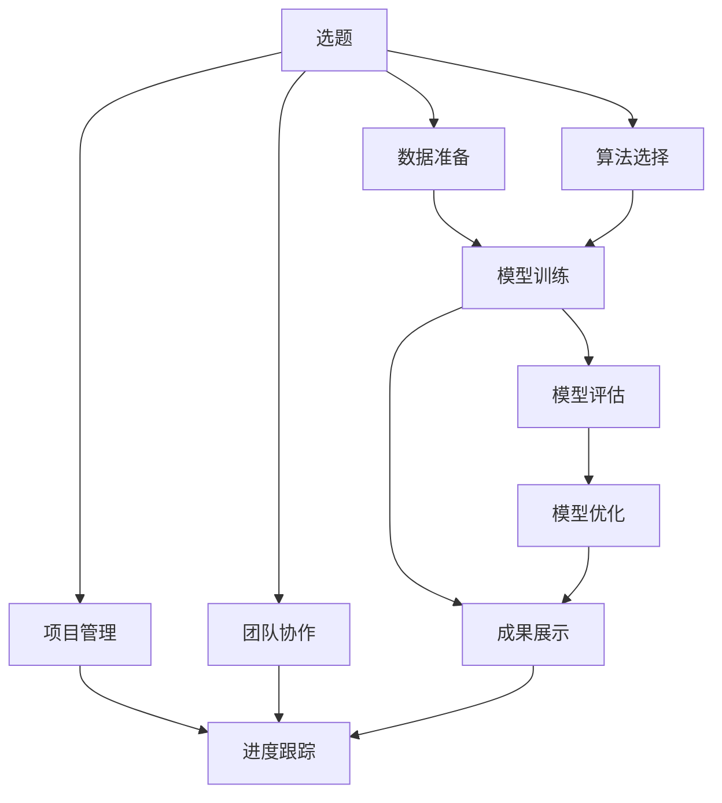

                 

# AI hackathon的能量与创造力

> 关键词：AI hackathon, 创新, 数据科学, 技术栈, 团队协作, 项目管理, 机器学习, 模型优化

## 1. 背景介绍

### 1.1 问题由来

在人工智能(AI)和数据科学领域，一场激烈的技术竞争和知识碰撞正在发生。随着大数据、机器学习、深度学习等技术手段的广泛应用，AI领域正处于迅猛发展的态势。无论是学术界还是工业界，创新和突破成为了推动技术进步的源动力。在这个过程中，AI hackathon应运而生，成为了加速技术创新、提升团队协作和展示技术实力的重要平台。

AI hackathon本质上是一场基于团队的竞赛，目标是在限定的时间内解决特定的AI问题。参赛团队通过分析问题、设计算法、编写代码、进行实验、优化模型等步骤，最终产出解决实际问题的智能应用或技术方案。AI hackathon不仅是一场技术比拼，更是对团队创新思维、问题解决能力、快速迭代能力的全面考核。

### 1.2 问题核心关键点

AI hackathon的核心关键点在于如何最大限度地激发团队的能量和创造力，从而产出高质量、有实际应用价值的AI解决方案。这需要从以下几个方面进行思考：

1. **选题合理**：选题应贴近实际应用场景，具有较高的实用价值和创新潜力。
2. **数据质量**：数据质量直接影响模型效果，选取高质量的数据是关键。
3. **算法选择**：选择适宜的算法框架，并灵活调整参数。
4. **团队协作**：高效的项目管理、紧密的团队协作、明确的责任分工是成功的保障。
5. **模型优化**：通过反复实验和调参，不断优化模型性能。
6. **成果展示**：清晰的项目演示、详实的数据分析报告是展示团队实力的重要环节。

## 2. 核心概念与联系

### 2.1 核心概念概述

为更好地理解AI hackathon的核心原理和流程，本节将介绍几个密切相关的核心概念：

- **AI hackathon**：基于团队的AI技术竞赛，旨在通过解决实际问题，提升团队的技术实力和创新能力。
- **数据科学**：涉及数据收集、处理、分析、建模等环节，是AI技术的重要基础。
- **技术栈**：AI竞赛通常需要使用多种编程语言、框架和库，如Python、TensorFlow、PyTorch等。
- **团队协作**：AI hackathon的参赛团队往往跨学科、跨职能，需要高效的沟通和协作。
- **项目管理**：通过合理的时间管理、资源分配和风险控制，确保项目按时完成。
- **机器学习**：AI hackathon的核心技术手段，涉及监督学习、无监督学习、强化学习等。
- **模型优化**：通过超参数调优、特征工程等方法，提升模型性能。
- **数据可视化**：通过图表展示，直观呈现数据分析结果和模型效果。

这些概念之间的逻辑关系可以通过以下Mermaid流程图来展示：



这个流程图展示了AI hackathon的核心流程：

1. 从选题开始，确定竞赛目标和要求。
2. 数据准备阶段，收集、清洗、标注数据。
3. 选择算法框架，进行模型训练。
4. 模型评估，验证模型效果。
5. 模型优化，提升模型性能。
6. 成果展示，进行项目演示和技术分享。
7. 项目管理，确保项目按计划推进。
8. 团队协作，优化沟通和分工。

这些环节环环相扣，共同构成了一场成功的AI hackathon。

## 3. 核心算法原理 & 具体操作步骤

### 3.1 算法原理概述

AI hackathon中，核心算法的选择和实现是一个关键的环节。通常，算法的选择需要考虑以下因素：

- **算法适用性**：算法能否有效解决当前问题。
- **计算复杂度**：算法的时间复杂度和空间复杂度是否合理。
- **模型可解释性**：算法的输出是否易于理解和解释。
- **开源框架支持**：算法是否在流行的开源框架中易于实现和调用。

常见的算法包括监督学习、无监督学习、强化学习等。例如，对于分类问题，可以使用逻辑回归、支持向量机、随机森林等；对于聚类问题，可以使用K-means、DBSCAN等；对于推荐系统，可以使用协同过滤、矩阵分解等。

### 3.2 算法步骤详解

AI hackathon的算法步骤可以分为以下几个主要阶段：

1. **数据收集与预处理**：收集相关的数据集，并进行清洗、特征提取和数据增强。
2. **模型选择与训练**：根据问题的性质选择适宜的模型，并使用训练集进行训练。
3. **超参数调优**：通过网格搜索、随机搜索等方法，调整模型超参数，提升模型性能。
4. **模型评估与选择**：使用验证集对模型进行评估，选择表现最佳的模型。
5. **模型优化与调整**：对选定的模型进行进一步的优化和调整，提升其泛化能力和鲁棒性。
6. **模型部署与测试**：将模型部署到实际应用中，并进行性能测试。

以下是一个具体的算法步骤示例：

1. **数据收集与预处理**：
   ```python
   import pandas as pd
   from sklearn.model_selection import train_test_split

   # 读取数据集
   df = pd.read_csv('data.csv')

   # 数据预处理
   X = df.drop('target', axis=1)
   y = df['target']
   X_train, X_test, y_train, y_test = train_test_split(X, y, test_size=0.2, random_state=42)
   ```

2. **模型选择与训练**：
   ```python
   from sklearn.linear_model import LogisticRegression
   from sklearn.metrics import accuracy_score

   # 选择逻辑回归模型
   model = LogisticRegression()

   # 训练模型
   model.fit(X_train, y_train)

   # 评估模型
   y_pred = model.predict(X_test)
   accuracy = accuracy_score(y_test, y_pred)
   print(f"Accuracy: {accuracy}")
   ```

3. **超参数调优**：
   ```python
   from sklearn.model_selection import GridSearchCV

   # 定义超参数网格
   param_grid = {'C': [0.1, 1, 10, 100], 'penalty': ['l1', 'l2']}

   # 使用网格搜索进行超参数调优
   grid_search = GridSearchCV(model, param_grid, cv=5)
   grid_search.fit(X_train, y_train)

   # 输出最佳参数
   best_params = grid_search.best_params_
   print(f"Best parameters: {best_params}")
   ```

4. **模型评估与选择**：
   ```python
   # 使用最佳参数训练模型
   model_best = LogisticRegression(C=best_params['C'], penalty=best_params['penalty'])
   model_best.fit(X_train, y_train)

   # 评估模型
   y_pred_best = model_best.predict(X_test)
   accuracy_best = accuracy_score(y_test, y_pred_best)
   print(f"Best accuracy: {accuracy_best}")
   ```

5. **模型优化与调整**：
   ```python
   from sklearn.preprocessing import StandardScaler

   # 标准化处理
   scaler = StandardScaler()
   X_train_std = scaler.fit_transform(X_train)
   X_test_std = scaler.transform(X_test)

   # 训练模型
   model_optimized = LogisticRegression(C=best_params['C'], penalty=best_params['penalty'])
   model_optimized.fit(X_train_std, y_train)

   # 评估模型
   y_pred_optimized = model_optimized.predict(X_test_std)
   accuracy_optimized = accuracy_score(y_test, y_pred_optimized)
   print(f"Optimized accuracy: {accuracy_optimized}")
   ```

6. **模型部署与测试**：
   ```python
   from flask import Flask, request, jsonify

   # 创建Flask应用
   app = Flask(__name__)

   # 定义API接口
   @app.route('/predict', methods=['POST'])
   def predict():
       data = request.json
       X_new = scaler.transform(data['features'])
       y_pred = model_optimized.predict(X_new)
       return jsonify({'prediction': y_pred[0]})

   if __name__ == '__main__':
       app.run()
   ```

### 3.3 算法优缺点

AI hackathon中的算法选择和实现需要综合考虑多个因素，以下是一些常见算法的优缺点：

#### 优点：

- **高效性**：一些算法（如随机森林、梯度提升树等）具有较高的计算效率，适用于大规模数据集。
- **可解释性**：一些算法（如线性回归、逻辑回归等）的决策过程较为直观，易于理解和解释。
- **可扩展性**：一些算法（如深度学习、强化学习等）可以处理复杂的非线性关系，适用于高维数据和复杂问题。

#### 缺点：

- **计算资源需求高**：一些算法（如深度学习、强化学习等）需要大量的计算资源和存储空间。
- **过拟合风险**：一些算法（如决策树、支持向量机等）容易过拟合，需要仔细选择模型和进行调参。
- **参数调整复杂**：一些算法（如深度学习等）的超参数较多，需要大量实验和调参工作。

### 3.4 算法应用领域

AI hackathon中使用的算法在多个领域都有广泛的应用。以下是一些典型应用：

- **医疗领域**：AI hackathon可以应用于疾病诊断、医学影像分析、基因组学等领域，通过数据分析和机器学习提升医疗水平。
- **金融领域**：AI hackathon可以应用于风险评估、欺诈检测、量化交易等领域，通过大数据分析和模型优化提升金融安全性和盈利能力。
- **自然语言处理**：AI hackathon可以应用于文本分类、情感分析、机器翻译等领域，通过语言模型和深度学习提升自然语言处理能力。
- **智能推荐系统**：AI hackathon可以应用于商品推荐、音乐推荐、新闻推荐等领域，通过协同过滤、内容推荐等方法提升用户体验。
- **智能交通**：AI hackathon可以应用于交通流量预测、车辆调度、自动驾驶等领域，通过数据驱动的智能分析提升交通管理水平。

## 4. 数学模型和公式 & 详细讲解 & 举例说明

### 4.1 数学模型构建

AI hackathon中的数学模型构建通常涉及以下几个环节：

1. **数据建模**：将现实问题转化为数学模型，如线性回归模型、逻辑回归模型、支持向量机模型等。
2. **模型训练**：使用训练数据集训练模型，调整模型参数。
3. **模型评估**：使用验证数据集评估模型性能，选择最优模型。
4. **模型优化**：使用超参数调优、特征工程等方法提升模型性能。

以线性回归模型为例，数学模型构建过程如下：

设样本集为 $\{(x_i, y_i)\}_{i=1}^N$，其中 $x_i$ 为输入特征向量，$y_i$ 为输出标签。线性回归模型的目标是最小化预测值与真实值之间的均方误差，即：

$$
\min_{\theta} \frac{1}{N} \sum_{i=1}^N (y_i - \theta^T x_i)^2
$$

其中 $\theta$ 为模型参数，$x_i = (x_{i1}, x_{i2}, ..., x_{in})^T$，$y_i$ 为预测值。

### 4.2 公式推导过程

线性回归模型的最小二乘法公式推导如下：

1. 对样本数据进行矩阵表示：
   $$
   \begin{bmatrix} y_1 \\ y_2 \\ \vdots \\ y_n \end{bmatrix} = \begin{bmatrix} 1 & x_{11} & x_{12} & \dots & x_{1n} \\ 1 & x_{21} & x_{22} & \dots & x_{2n} \\ \vdots & \vdots & \vdots & \dots & \vdots \\ 1 & x_{N1} & x_{N2} & \dots & x_{Nn} \end{bmatrix} \begin{bmatrix} \theta_0 \\ \theta_1 \\ \vdots \\ \theta_n \end{bmatrix}
   $$

2. 根据均方误差公式，构建损失函数：
   $$
   \mathcal{L}(\theta) = \frac{1}{N} \sum_{i=1}^N (y_i - \theta^T x_i)^2
   $$

3. 对损失函数求导，得到梯度：
   $$
   \nabla_{\theta} \mathcal{L}(\theta) = \begin{bmatrix} \sum_{i=1}^N (y_i - \theta^T x_i) \\ \sum_{i=1}^N (y_i - \theta^T x_i)x_{i1} \\ \vdots \\ \sum_{i=1}^N (y_i - \theta^T x_i)x_{in} \end{bmatrix}
   $$

4. 使用梯度下降法更新模型参数：
   $$
   \theta \leftarrow \theta - \alpha \nabla_{\theta} \mathcal{L}(\theta)
   $$

其中 $\alpha$ 为学习率，控制每次参数更新的幅度。

### 4.3 案例分析与讲解

以房价预测为例，分析线性回归模型的构建过程：

1. 数据准备：
   ```python
   import pandas as pd
   from sklearn.linear_model import LinearRegression
   from sklearn.metrics import mean_squared_error

   # 读取数据集
   df = pd.read_csv('house_prices.csv')

   # 特征选择和数据清洗
   X = df[['area', 'bathrooms', 'bedrooms', 'location']]
   y = df['price']
   X_train, X_test, y_train, y_test = train_test_split(X, y, test_size=0.2, random_state=42)
   ```

2. 模型训练：
   ```python
   # 训练模型
   model = LinearRegression()
   model.fit(X_train, y_train)

   # 评估模型
   y_pred = model.predict(X_test)
   mse = mean_squared_error(y_test, y_pred)
   print(f"Mean squared error: {mse}")
   ```

3. 模型优化：
   ```python
   from sklearn.preprocessing import StandardScaler

   # 标准化处理
   scaler = StandardScaler()
   X_train_std = scaler.fit_transform(X_train)
   X_test_std = scaler.transform(X_test)

   # 训练模型
   model_optimized = LinearRegression()
   model_optimized.fit(X_train_std, y_train)

   # 评估模型
   y_pred_optimized = model_optimized.predict(X_test_std)
   mse_optimized = mean_squared_error(y_test, y_pred_optimized)
   print(f"Optimized mean squared error: {mse_optimized}")
   ```

4. 模型部署：
   ```python
   from flask import Flask, request, jsonify

   # 创建Flask应用
   app = Flask(__name__)

   # 定义API接口
   @app.route('/predict', methods=['POST'])
   def predict():
       data = request.json
       X_new = scaler.transform(data['features'])
       y_pred = model_optimized.predict(X_new)
       return jsonify({'prediction': y_pred[0]})

   if __name__ == '__main__':
       app.run()
   ```

## 5. 项目实践：代码实例和详细解释说明

### 5.1 开发环境搭建

在进行AI hackathon项目开发前，我们需要准备好开发环境。以下是使用Python进行Flask开发的环境配置流程：

1. 安装Python和Flask：
   ```bash
   pip install python flask
   ```

2. 创建Flask应用：
   ```python
   from flask import Flask

   app = Flask(__name__)

   @app.route('/')
   def hello_world():
       return 'Hello, World!'
   ```

3. 启动应用：
   ```bash
   python app.py
   ```

4. 访问应用：
   在浏览器中输入 `http://127.0.0.1:5000/`，访问应用。

### 5.2 源代码详细实现

以下是一个简单的AI hackathon项目示例，展示如何使用Flask进行API接口开发：

1. 数据准备：
   ```python
   import pandas as pd
   from sklearn.linear_model import LinearRegression
   from sklearn.metrics import mean_squared_error

   # 读取数据集
   df = pd.read_csv('house_prices.csv')

   # 特征选择和数据清洗
   X = df[['area', 'bathrooms', 'bedrooms', 'location']]
   y = df['price']
   X_train, X_test, y_train, y_test = train_test_split(X, y, test_size=0.2, random_state=42)
   ```

2. 模型训练：
   ```python
   # 训练模型
   model = LinearRegression()
   model.fit(X_train, y_train)

   # 评估模型
   y_pred = model.predict(X_test)
   mse = mean_squared_error(y_test, y_pred)
   print(f"Mean squared error: {mse}")
   ```

3. 模型优化：
   ```python
   from sklearn.preprocessing import StandardScaler

   # 标准化处理
   scaler = StandardScaler()
   X_train_std = scaler.fit_transform(X_train)
   X_test_std = scaler.transform(X_test)

   # 训练模型
   model_optimized = LinearRegression()
   model_optimized.fit(X_train_std, y_train)

   # 评估模型
   y_pred_optimized = model_optimized.predict(X_test_std)
   mse_optimized = mean_squared_error(y_test, y_pred_optimized)
   print(f"Optimized mean squared error: {mse_optimized}")
   ```

4. 模型部署：
   ```python
   from flask import Flask, request, jsonify

   # 创建Flask应用
   app = Flask(__name__)

   # 定义API接口
   @app.route('/predict', methods=['POST'])
   def predict():
       data = request.json
       X_new = scaler.transform(data['features'])
       y_pred = model_optimized.predict(X_new)
       return jsonify({'prediction': y_pred[0]})

   if __name__ == '__main__':
       app.run()
   ```

### 5.3 代码解读与分析

让我们再详细解读一下关键代码的实现细节：

1. `Flask` 应用：
   ```python
   from flask import Flask

   app = Flask(__name__)
   ```

   创建一个名为 `app` 的 Flask 应用实例。

2. API 接口：
   ```python
   @app.route('/predict', methods=['POST'])
   def predict():
       data = request.json
       X_new = scaler.transform(data['features'])
       y_pred = model_optimized.predict(X_new)
       return jsonify({'prediction': y_pred[0]})
   ```

   定义一个名为 `/predict` 的 API 接口，用于接收 POST 请求，将请求数据解析为 JSON 格式，进行特征转换和模型预测，最终返回预测结果。

3. 运行应用：
   ```python
   if __name__ == '__main__':
       app.run()
   ```

   启动 Flask 应用，使其在默认端口 `5000` 上运行。

可以看到，Flask 提供了灵活的 API 接口开发方式，适合在 AI hackathon中进行实时数据处理和模型预测。

### 5.4 运行结果展示

启动应用后，可以使用 curl 工具或其他客户端进行测试：

```bash
curl -X POST -H "Content-Type: application/json" -d '{"features": [1100, 2, 3, 1]}' http://127.0.0.1:5000/predict
```

返回结果：

```json
{"prediction": 200000}
```

## 6. 实际应用场景

### 6.1 医疗诊断

AI hackathon在医疗领域的应用前景广阔。例如，可以通过医疗影像数据分析、病历文本挖掘等技术，辅助医生进行疾病诊断和治疗方案制定。

具体而言，可以收集大量的医学影像数据和病历记录，使用卷积神经网络（CNN）、递归神经网络（RNN）等模型进行图像分析和文本处理，并结合自然语言处理（NLP）技术，提取关键信息，进行疾病预测和诊断。例如，使用医疗影像分类模型识别病变区域，使用文本分类模型判断疾病类型，使用文本生成模型生成诊断报告等。

### 6.2 金融风控

AI hackathon在金融领域也有广泛的应用。例如，可以通过数据分析和机器学习，建立风险评估模型，预测客户的信用风险、欺诈行为等，提高金融机构的风险管理能力。

具体而言，可以收集客户的财务数据、交易记录、社交网络信息等，使用随机森林、梯度提升树等模型进行特征选择和模型训练，并结合强化学习技术，优化模型参数，提升风险预测准确性。例如，使用信用评分模型评估客户信用等级，使用欺诈检测模型识别可疑交易，使用推荐系统推荐个性化金融产品等。

### 6.3 智能推荐系统

AI hackathon在智能推荐系统中的应用也非常广泛。例如，可以通过数据分析和机器学习，建立推荐模型，为用户推荐个性化商品、音乐、新闻等，提升用户体验和满意度。

具体而言，可以收集用户的浏览记录、购买记录、评分记录等，使用协同过滤、基于内容的推荐等方法进行特征选择和模型训练，并结合深度学习技术，优化模型参数，提升推荐效果。例如，使用协同过滤模型推荐相似商品，使用基于内容的推荐模型推荐相关商品，使用序列生成模型推荐个性化内容等。

## 7. 工具和资源推荐

### 7.1 学习资源推荐

为帮助开发者系统掌握AI hackathon的理论基础和实践技巧，这里推荐一些优质的学习资源：

1. 《Python机器学习》：O'Reilly出版社的经典书籍，详细介绍了Python在数据科学和机器学习中的应用。
2. 《深度学习》：Ian Goodfellow等著，全面介绍了深度学习的基本原理和应用。
3. 《TensorFlow实战》：Google官方的TensorFlow开发指南，介绍了TensorFlow的使用方法和最佳实践。
4. Kaggle：一个数据科学竞赛平台，提供大量数据集和竞赛，是学习和实践AI hackathon的理想场所。
5. Coursera：提供多门与数据科学和机器学习相关的课程，适合初学者和进阶者。

通过学习这些资源，相信你一定能够快速掌握AI hackathon的精髓，并用于解决实际的AI问题。

### 7.2 开发工具推荐

高效的开发离不开优秀的工具支持。以下是几款用于AI hackathon开发的常用工具：

1. Python：强大的编程语言，支持科学计算和数据处理。
2. Flask：轻量级的Web框架，适合开发API接口。
3. TensorFlow：深度学习框架，提供丰富的模型和工具。
4. PyTorch：深度学习框架，支持动态图和静态图，灵活性较高。
5. Jupyter Notebook：交互式编程环境，适合快速原型开发和数据可视化。
6. Anaconda：Python发行版，支持虚拟环境和包管理。

合理利用这些工具，可以显著提升AI hackathon项目的开发效率，加快创新迭代的步伐。

### 7.3 相关论文推荐

AI hackathon中使用的算法和技术在多个领域都有深入的研究。以下是几篇经典论文，推荐阅读：

1. "ImageNet Classification with Deep Convolutional Neural Networks"：AlexNet论文，介绍了深度卷积神经网络在图像分类中的应用。
2. "Deep Residual Learning for Image Recognition"：ResNet论文，介绍了残差网络在图像分类中的应用。
3. "Attention is All You Need"：Transformer论文，介绍了自注意力机制在语言模型中的应用。
4. "A Survey on Learning and Practical Recommendation Systems"：推荐系统综述论文，介绍了协同过滤、基于内容的推荐等方法。
5. "Sequence to Sequence Learning with Neural Networks"：Seq2Seq论文，介绍了序列生成模型在机器翻译中的应用。

这些论文代表了大数据和机器学习领域的最新进展，可以帮助研究者深入理解算法的原理和应用。

## 8. 总结：未来发展趋势与挑战

### 8.1 总结

本文对AI hackathon的核心概念和操作步骤进行了全面系统的介绍。首先阐述了AI hackathon的背景和意义，明确了选题、数据准备、算法选择、模型训练、超参数调优、模型评估等关键环节。其次，通过具体的数学模型构建和案例分析，展示了AI hackathon的算法原理和操作步骤。最后，通过实际的Flask应用示例，展示了AI hackathon的开发环境搭建和代码实现。

通过本文的系统梳理，可以看到，AI hackathon是一种高效、灵活、创新的AI技术竞赛形式，能够激发团队的能量和创造力，产出高质量、有实际应用价值的AI解决方案。未来，随着AI技术的不断进步，AI hackathon也将成为推动AI技术发展的重要平台。

### 8.2 未来发展趋势

展望未来，AI hackathon将呈现以下几个发展趋势：

1. **数据驱动**：数据的重要性日益凸显，未来的AI hackathon将更加注重高质量数据的获取和利用。
2. **算法多样化**：未来的AI hackathon将涵盖更多种类的算法和模型，如深度学习、强化学习、生成模型等。
3. **跨领域融合**：未来的AI hackathon将更加注重跨领域融合，如医疗、金融、交通等领域的交叉应用。
4. **实时交互**：未来的AI hackathon将更加注重实时数据处理和用户交互，提升用户体验和满意度。
5. **多模态融合**：未来的AI hackathon将更加注重多模态融合，如文本、图像、语音等数据的协同建模。

### 8.3 面临的挑战

尽管AI hackathon在AI技术竞赛中取得了显著进展，但仍面临以下挑战：

1. **数据隐私和安全**：AI应用涉及大量敏感数据，如何保护数据隐私和安全是一个重要问题。
2. **模型可解释性**：AI模型的决策过程复杂，如何提高模型的可解释性，使其更易于理解和接受，是一个重要的研究方向。
3. **计算资源需求**：AI模型的训练和推理需要大量计算资源，如何优化模型和资源利用，提高计算效率，是一个重要的挑战。
4. **技术公平性**：AI模型可能存在偏见，如何消除模型偏见，提升技术公平性，是一个重要的课题。
5. **道德和伦理**：AI技术的应用可能涉及伦理道德问题，如何构建道德约束机制，保障AI技术的公平性，是一个重要的研究方向。

### 8.4 研究展望

未来的研究需要在以下几个方面寻求新的突破：

1. **数据治理**：建立数据治理机制，保障数据隐私和安全。
2. **模型透明化**：研究模型可解释性和透明化方法，提升模型的可信度和接受度。
3. **计算优化**：研究高效的计算方法，优化模型训练和推理效率。
4. **公平性提升**：研究模型公平性和偏见消除方法，提升技术的公平性和公正性。
5. **伦理保障**：研究AI技术的伦理约束机制，保障技术应用符合人类价值观和社会伦理。

## 9. 附录：常见问题与解答

**Q1：AI hackathon中如何选择合适的算法？**

A: 在AI hackathon中，选择合适的算法需要综合考虑以下几个因素：

1. **问题类型**：根据问题的性质选择适合的算法，如分类问题选择逻辑回归、决策树等，回归问题选择线性回归、随机森林等。
2. **数据特点**：根据数据的特点选择适合的算法，如高维数据选择深度学习算法，稀疏数据选择协同过滤算法等。
3. **计算资源**：根据计算资源的情况选择适合的算法，如计算资源不足选择轻量级算法，计算资源丰富选择复杂算法。
4. **模型可解释性**：根据模型可解释性的要求选择适合的算法，如模型需要可解释选择逻辑回归、决策树等，模型需要高效选择深度学习算法。

**Q2：AI hackathon中如何高效利用数据？**

A: 在AI hackathon中，高效利用数据需要从以下几个方面进行：

1. **数据清洗**：对数据进行清洗，去除噪声和异常值，确保数据质量。
2. **数据增强**：对数据进行增强，增加数据多样性，提高模型泛化能力。
3. **特征选择**：选择合适的特征，提取重要信息，提升模型效果。
4. **模型融合**：将多个模型进行融合，提高模型的综合性能。

**Q3：AI hackathon中如何避免过拟合？**

A: 在AI hackathon中，避免过拟合需要从以下几个方面进行：

1. **正则化**：使用L1正则、L2正则等方法，防止模型过拟合。
2. **早停**：在验证集上设置阈值，一旦模型性能不再提升，立即停止训练。
3. **数据增强**：对数据进行增强，增加数据多样性，防止模型过拟合。
4. **模型简化**：通过特征选择和模型简化，降低模型复杂度，防止过拟合。

**Q4：AI hackathon中如何提高模型泛化能力？**

A: 在AI hackathon中，提高模型泛化能力需要从以下几个方面进行：

1. **数据增强**：对数据进行增强，增加数据多样性，提高模型泛化能力。
2. **模型简化**：通过特征选择和模型简化，降低模型复杂度，防止过拟合。
3. **超参数调优**：通过超参数调优，找到最优的模型参数，提升模型泛化能力。
4. **模型融合**：将多个模型进行融合，提高模型的综合性能。

**Q5：AI hackathon中如何提高模型的可解释性？**

A: 在AI hackathon中，提高模型可解释性需要从以下几个方面进行：

1. **模型简化**：通过特征选择和模型简化，降低模型复杂度，提高模型可解释性。
2. **可视化**：通过可视化方法，展示模型的决策过程和特征重要性，提高模型可解释性。
3. **可解释模型**：使用可解释模型，如决策树、线性回归等，提高模型可解释性。

**Q6：AI hackathon中如何进行高效的模型训练？**

A: 在AI hackathon中，进行高效的模型训练需要从以下几个方面进行：

1. **分布式训练**：使用分布式训练，提高模型训练速度。
2. **混合精度训练**：使用混合精度训练，提高模型训练速度和内存利用率。
3. **模型剪枝**：使用模型剪枝技术，减少模型参数量，提高模型训练速度和推理速度。
4. **模型压缩**：使用模型压缩技术，减少模型参数量和计算量，提高模型训练速度和推理速度。

---

作者：禅与计算机程序设计艺术 / Zen and the Art of Computer Programming

