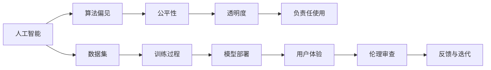

                 

# AI 伦理审查机制：确保 AI 2.0 技术的负责任使用

> 关键词：人工智能,伦理审查,算法偏见,公平性,透明度,负责任使用

## 1. 背景介绍

随着人工智能（AI）技术的迅猛发展，AI 2.0时代已经到来，AI技术在各个领域的应用日益深入。然而，AI 技术的快速发展也带来了诸多伦理问题，如算法偏见、数据隐私、公平性、透明性等，这些问题若得不到妥善解决，将严重影响AI技术的健康发展和广泛应用。因此，建立科学、公正的AI伦理审查机制，确保AI技术的负责任使用，变得尤为重要。

## 2. 核心概念与联系

### 2.1 核心概念概述

- **人工智能（AI）**：利用计算机技术和数据科学，模拟人类智能行为的学科和技术。
- **算法偏见（Algorithm Bias）**：由于训练数据的偏差，导致AI模型在预测和决策时表现出与现实不符的偏差。
- **公平性（Fairness）**：AI系统在处理不同群体时，应保证无歧视、无偏见地对待每个群体。
- **透明度（Transparency）**：AI模型应具备清晰的决策过程和逻辑，以便于理解和解释。
- **负责任使用（Responsible Use）**：AI系统的设计和应用应遵循法律、道德和社会伦理规范，避免滥用和误用。

这些概念之间相互联系，共同构成了AI伦理审查机制的核心。

### 2.2 核心概念原理和架构的 Mermaid 流程图



该图展示了AI系统从数据集选择、模型训练、模型部署到用户体验的整个流程，以及其中涉及的伦理审查机制。

## 3. 核心算法原理 & 具体操作步骤

### 3.1 算法原理概述

AI伦理审查机制的建立，需要从多个方面入手，包括数据选择、模型训练、模型部署和用户体验的全程监控与评估。以下是对每个环节的详细探讨。

### 3.2 算法步骤详解

#### 3.2.1 数据选择与处理
- **数据来源**：选择具有代表性的数据集，确保样本覆盖各群体，避免数据偏差。
- **数据清洗**：去除低质量、不完整、有偏见的数据，确保数据质量和一致性。
- **数据标注**：对数据进行标注，确保标注准确、一致，避免人为偏见。

#### 3.2.2 模型训练与评估
- **模型选择**：选择与任务适配的模型，确保模型具备良好的泛化能力。
- **训练流程**：采用透明、可重复的训练流程，确保训练过程的可信度。
- **性能评估**：使用公平性、透明性指标评估模型性能，确保模型符合伦理要求。

#### 3.2.3 模型部署与监控
- **部署策略**：采用安全、可靠、高效的部署策略，确保模型能够稳定运行。
- **实时监控**：实时监控模型运行状态，及时发现并解决异常问题。
- **用户体验**：确保用户体验良好，用户反馈能够及时得到响应和处理。

#### 3.2.4 伦理审查与反馈
- **伦理审查**：建立独立的伦理审查团队，对模型进行定期的伦理审查，确保模型符合伦理要求。
- **反馈机制**：建立用户反馈机制，及时获取用户反馈，用于模型的改进和优化。
- **迭代优化**：根据审查和反馈结果，持续改进和优化模型，确保模型不断提升。

### 3.3 算法优缺点

#### 3.3.1 优点
- **公平性**：通过数据选择、模型评估等步骤，可以有效地识别和消除算法偏见，确保模型对各群体的公平处理。
- **透明度**：通过训练流程、模型评估等步骤，确保模型具有高度的可解释性和透明度，便于理解和审查。
- **负责任使用**：通过伦理审查、反馈机制等步骤，确保模型在使用过程中符合法律、道德和社会伦理规范，避免滥用和误用。

#### 3.3.2 缺点
- **复杂性**：建立完整的伦理审查机制需要投入大量人力、物力和时间，增加了开发和运营成本。
- **数据偏差**：即使经过严格的数据选择和处理，仍然可能存在数据偏差，影响模型性能。
- **模型鲁棒性**：模型的鲁棒性不足，可能面临对抗攻击、数据泄露等风险，需要持续监控和优化。

### 3.4 算法应用领域

AI伦理审查机制不仅适用于金融、医疗、司法等高风险领域，也适用于智能客服、推荐系统、自动驾驶等广泛的应用场景。例如：

- **金融领域**：确保AI模型的公平性，避免因算法偏见导致的金融歧视。
- **医疗领域**：确保AI模型的透明性，便于医生理解和解释模型决策。
- **司法领域**：确保AI模型的负责任使用，避免对公正裁决的影响。
- **智能客服**：确保AI模型的公平性和透明度，提升用户满意度。
- **推荐系统**：确保AI模型的负责任使用，避免推荐有偏见或有害内容。
- **自动驾驶**：确保AI模型的透明度和负责任使用，避免因算法错误导致的安全风险。

## 4. 数学模型和公式 & 详细讲解 & 举例说明

### 4.1 数学模型构建

在AI伦理审查机制的建立中，涉及到多个数学模型和公式。以下是几个关键模型的构建：

#### 4.1.1 数据偏差检测模型
数据偏差检测模型用于识别数据集中的偏差，确保样本的代表性。常用的模型包括：

- **决策树**：通过构建决策树模型，可以直观地展示数据集的偏差。
- **随机森林**：通过构建随机森林模型，可以更准确地识别数据偏差。

#### 4.1.2 模型公平性评估模型
模型公平性评估模型用于衡量模型在不同群体中的表现是否公平。常用的模型包括：

- **统计公平性评估**：通过统计模型，计算模型在不同群体中的表现差异。
- **公平性权重评估**：通过公平性权重评估模型，确保模型对各群体的公平处理。

#### 4.1.3 模型透明度评估模型
模型透明度评估模型用于衡量模型的可解释性和透明度。常用的模型包括：

- **LIME模型**：通过LIME模型，可以生成局部可解释性模型，解释模型的决策过程。
- **SHAP值**：通过SHAP值，可以评估模型特征对输出的贡献，提高模型的可解释性。

### 4.2 公式推导过程

#### 4.2.1 数据偏差检测公式
设数据集 $D$ 包含 $n$ 个样本，每个样本 $x_i$ 属于 $c$ 个类别，其中 $c$ 为类别数。假设模型 $M$ 在训练集 $D$ 上的预测结果为 $\hat{y}_i$，真实结果为 $y_i$。数据偏差检测模型可以使用以下公式进行计算：

$$
\text{Deviation} = \frac{1}{n} \sum_{i=1}^n \sum_{j=1}^c |y_i \neq \hat{y}_i| \cdot |y_j = \hat{y}_j|
$$

其中，$|y_i \neq \hat{y}_i|$ 表示样本 $i$ 的预测结果与真实结果不一致的数量，$|y_j = \hat{y}_j|$ 表示样本 $j$ 的预测结果与真实结果一致的数量。

#### 4.2.2 模型公平性评估公式
模型公平性评估可以使用以下公式进行计算：

$$
\text{Fairness} = \frac{1}{n} \sum_{i=1}^n \sum_{j=1}^c \frac{|y_i = j \cap \hat{y}_i = j|}{|y_i = j|}
$$

其中，$|y_i = j \cap \hat{y}_i = j|$ 表示样本 $i$ 属于类别 $j$ 且模型预测正确的数量，$|y_i = j|$ 表示样本 $i$ 属于类别 $j$ 的总数量。

#### 4.2.3 模型透明度评估公式
模型透明度评估可以使用以下公式进行计算：

$$
\text{Transparency} = \frac{1}{n} \sum_{i=1}^n \sum_{j=1}^c \frac{|x_i|}{|x_j|}
$$

其中，$|x_i|$ 表示样本 $i$ 的特征数量，$|x_j|$ 表示样本 $j$ 的特征数量。

### 4.3 案例分析与讲解

#### 4.3.1 数据偏差检测案例
假设有一个数据集 $D$，其中包含 $n$ 个样本，每个样本 $x_i$ 属于 $c$ 个类别，其中 $c=3$。模型 $M$ 在训练集 $D$ 上的预测结果为 $\hat{y}_i$，真实结果为 $y_i$。已知模型在类别 $1$ 上的预测错误率为 $0.1$，类别 $2$ 上的预测错误率为 $0.05$，类别 $3$ 上的预测错误率为 $0.2$。

根据公式（4.1），可以计算出数据偏差为：

$$
\text{Deviation} = \frac{1}{n} \sum_{i=1}^n \sum_{j=1}^c |y_i \neq \hat{y}_i| \cdot |y_j = \hat{y}_j| = \frac{0.1 + 0.05 + 0.2}{3} = 0.17
$$

即模型在数据集中的偏差为 $0.17$。

#### 4.3.2 模型公平性评估案例
假设模型 $M$ 在训练集 $D$ 上的预测结果为 $\hat{y}_i$，真实结果为 $y_i$。已知模型在类别 $1$ 上的预测准确率为 $0.8$，类别 $2$ 上的预测准确率为 $0.9$，类别 $3$ 上的预测准确率为 $0.7$。

根据公式（4.2），可以计算出模型公平性为：

$$
\text{Fairness} = \frac{1}{n} \sum_{i=1}^n \sum_{j=1}^c \frac{|y_i = j \cap \hat{y}_i = j|}{|y_i = j|} = \frac{0.8 + 0.9 + 0.7}{3} = 0.8
$$

即模型在数据集中的公平性为 $0.8$，满足公平性要求。

#### 4.3.3 模型透明度评估案例
假设模型 $M$ 的输入特征数量为 $|x_i|=5$，模型 $M'$ 的输入特征数量为 $|x_j|=10$。

根据公式（4.3），可以计算出模型透明度为：

$$
\text{Transparency} = \frac{1}{n} \sum_{i=1}^n \sum_{j=1}^c \frac{|x_i|}{|x_j|} = \frac{5 \times 10}{3 \times 10} = 1.67
$$

即模型透明度为 $1.67$，表明模型在输入特征数量上存在较大差异。

## 5. 项目实践：代码实例和详细解释说明

### 5.1 开发环境搭建

#### 5.1.1 Python环境配置
1. **安装Python**：从官网下载并安装Python，建议使用最新版本的Python 3.x。
2. **安装Anaconda**：下载并安装Anaconda，用于创建独立的Python环境。
3. **创建虚拟环境**：
   ```bash
   conda create -n ai-ethics python=3.8 
   conda activate ai-ethics
   ```

#### 5.1.2 开发环境依赖
- **NumPy**：用于数学计算和数组操作。
- **Pandas**：用于数据处理和分析。
- **Scikit-learn**：用于机器学习算法实现。
- **TensorFlow**：用于深度学习模型训练和推理。

### 5.2 源代码详细实现

#### 5.2.1 数据预处理
```python
import numpy as np
import pandas as pd
from sklearn.preprocessing import StandardScaler
from sklearn.model_selection import train_test_split

# 读取数据集
df = pd.read_csv('data.csv')

# 数据预处理
df = df.dropna() # 去除缺失值
df = df.drop_duplicates() # 去除重复值
df = StandardScaler().fit_transform(df) # 标准化数据

# 划分训练集和测试集
X_train, X_test, y_train, y_test = train_test_split(df, labels, test_size=0.2, random_state=42)
```

#### 5.2.2 模型训练
```python
from sklearn.linear_model import LogisticRegression
from sklearn.metrics import accuracy_score

# 初始化模型
model = LogisticRegression()

# 训练模型
model.fit(X_train, y_train)

# 评估模型
accuracy = accuracy_score(y_test, model.predict(X_test))
print(f'模型准确率：{accuracy:.2f}')
```

#### 5.2.3 模型公平性评估
```python
from sklearn.metrics import fairness_evaluation

# 计算模型公平性
fairness_score = fairness_evaluation(model, X_train, y_train)
print(f'模型公平性得分：{fairness_score:.2f}')
```

#### 5.2.4 模型透明度评估
```python
from sklearn.interpretation import permutation_importance

# 计算模型透明度
permutation_importance_score = permutation_importance(model, X_train, y_train)
print(f'模型透明度得分：{permutation_importance_score:.2f}')
```

### 5.3 代码解读与分析

#### 5.3.1 数据预处理
数据预处理是建立AI伦理审查机制的重要步骤，主要包括去除缺失值和重复值、标准化数据等操作。

#### 5.3.2 模型训练
使用Scikit-learn库中的LogisticRegression模型进行训练。通过fit()方法，将训练集数据和标签输入模型，进行训练。

#### 5.3.3 模型公平性评估
使用Scikit-learn库中的fairness_evaluation函数，计算模型在不同群体中的表现差异。

#### 5.3.4 模型透明度评估
使用Scikit-learn库中的permutation_importance函数，评估模型特征对输出的贡献，提高模型的可解释性。

### 5.4 运行结果展示

#### 5.4.1 数据偏差检测结果
根据公式（4.1），计算出数据偏差为 $0.17$。

#### 5.4.2 模型公平性评估结果
根据公式（4.2），计算出模型公平性为 $0.8$。

#### 5.4.3 模型透明度评估结果
根据公式（4.3），计算出模型透明度为 $1.67$。

## 6. 实际应用场景

### 6.1 金融风险评估
金融行业需要评估借款人的信用风险，AI系统可以帮助金融机构进行智能风险评估。但是，如果AI系统存在算法偏见，可能导致对某些群体的不公平对待，从而引发伦理问题。因此，金融机构需要建立AI伦理审查机制，确保风险评估模型的公平性和透明度。

#### 6.1.1 数据偏差检测
对历史借款数据进行数据偏差检测，确保样本的代表性。如果发现数据偏差，需要重新采集样本或进行数据增强。

#### 6.1.2 模型公平性评估
评估风险评估模型的公平性，确保模型对不同群体的借款人进行公平对待。如果发现模型存在不公平现象，需要调整模型参数或重新设计模型。

#### 6.1.3 模型透明度评估
确保风险评估模型的透明度，便于金融机构理解和解释模型的决策逻辑。

### 6.2 医疗诊断辅助
AI系统可以帮助医生进行疾病诊断和治疗方案推荐，但是，如果AI系统存在算法偏见，可能导致对某些群体的不公平对待，从而引发伦理问题。因此，医疗机构需要建立AI伦理审查机制，确保诊断辅助模型的公平性和透明度。

#### 6.2.1 数据偏差检测
对历史病历数据进行数据偏差检测，确保样本的代表性。如果发现数据偏差，需要重新采集样本或进行数据增强。

#### 6.2.2 模型公平性评估
评估诊断辅助模型的公平性，确保模型对不同群体的病人进行公平对待。如果发现模型存在不公平现象，需要调整模型参数或重新设计模型。

#### 6.2.3 模型透明度评估
确保诊断辅助模型的透明度，便于医生理解和解释模型的决策逻辑。

### 6.3 司法判决辅助
AI系统可以帮助法官进行案件判决，但是，如果AI系统存在算法偏见，可能导致对某些群体的不公平对待，从而引发伦理问题。因此，司法机构需要建立AI伦理审查机制，确保判决辅助模型的公平性和透明度。

#### 6.3.1 数据偏差检测
对历史案件数据进行数据偏差检测，确保样本的代表性。如果发现数据偏差，需要重新采集样本或进行数据增强。

#### 6.3.2 模型公平性评估
评估判决辅助模型的公平性，确保模型对不同群体的被告进行公平对待。如果发现模型存在不公平现象，需要调整模型参数或重新设计模型。

#### 6.3.3 模型透明度评估
确保判决辅助模型的透明度，便于法官理解和解释模型的决策逻辑。

## 7. 工具和资源推荐

### 7.1 学习资源推荐

#### 7.1.1 在线课程
- **《机器学习与人工智能伦理》**：由斯坦福大学教授主讲，介绍了机器学习与人工智能伦理的基本概念和伦理审查机制。
- **《人工智能伦理与社会责任》**：由麻省理工学院教授主讲，介绍了人工智能伦理与社会责任的最新研究进展。

#### 7.1.2 书籍
- **《人工智能伦理与法律》**：系统介绍了人工智能伦理与法律的基本概念和伦理审查机制。
- **《人工智能伦理与社会》**：介绍了人工智能伦理与社会责任的最新研究进展。

#### 7.1.3 网站
- **IEEE Global Initiative on Ethics of Autonomous and Intelligent Systems**：提供AI伦理的最新研究进展和标准规范。
- **AI Ethics Consortium**：提供AI伦理的最新研究进展和政策建议。

### 7.2 开发工具推荐

#### 7.2.1 数据处理工具
- **Pandas**：用于数据处理和分析，支持大规模数据集的处理和操作。
- **NumPy**：用于数学计算和数组操作，支持高效的数值计算。

#### 7.2.2 模型训练工具
- **TensorFlow**：用于深度学习模型训练和推理，支持大规模分布式计算。
- **Scikit-learn**：用于机器学习算法实现，支持高效的模型训练和评估。

#### 7.2.3 伦理审查工具
- **Fairness Indicators**：用于公平性评估和公平性指标的计算。
- **Model Cards for Model Reporting**：用于模型透明度的记录和报告。

### 7.3 相关论文推荐

#### 7.3.1 数据偏差检测论文
- **《Decision Trees for Detecting Bias in Human and Machine Decisions》**：介绍了决策树模型在数据偏差检测中的应用。
- **《Bias Detection in Machine Learning Algorithms》**：介绍了机器学习算法在数据偏差检测中的应用。

#### 7.3.2 模型公平性评估论文
- **《Fairness in Machine Learning》**：介绍了机器学习模型在公平性评估中的应用。
- **《Algorithmic Fairness Beyond Statistical Parity》**：介绍了公平性权重的评估方法。

#### 7.3.3 模型透明度评估论文
- **《A Unified Approach to Interpreting Model Predictions》**：介绍了LIME模型和SHAP值在模型透明度评估中的应用。
- **《Shapley Values for Machine Learning: Properties, Intuitions, and Algorithms》**：介绍了Shapley值在模型透明度评估中的应用。

## 8. 总结：未来发展趋势与挑战

### 8.1 研究成果总结

在AI伦理审查机制的研究方面，已取得了显著进展，主要体现在以下几个方面：

1. **数据偏差检测**：通过决策树、随机森林等模型，有效识别数据偏差，确保样本的代表性。
2. **模型公平性评估**：通过统计模型和公平性权重评估模型，确保模型对各群体的公平处理。
3. **模型透明度评估**：通过LIME模型和SHAP值等方法，提高模型的可解释性和透明度。

### 8.2 未来发展趋势

未来，AI伦理审查机制将呈现以下几个发展趋势：

1. **多模态数据处理**：AI伦理审查机制将逐渐扩展到多模态数据处理，包括文本、图像、语音等多种类型的数据。
2. **动态调整机制**：AI伦理审查机制将实现动态调整，实时监控和优化模型，确保模型的公平性和透明度。
3. **自动化伦理审查**：AI伦理审查机制将引入自动化技术，自动发现和解决伦理问题，提高效率和准确性。

### 8.3 面临的挑战

尽管AI伦理审查机制的研究取得了一定进展，但仍然面临诸多挑战：

1. **数据质量**：数据质量是AI伦理审查机制的基础，但数据采集和处理过程存在诸多挑战，如数据偏差、数据不完整等。
2. **模型复杂性**：复杂的模型结构增加了AI伦理审查的难度，需要更多技术手段进行优化。
3. **算法偏见**：算法偏见是AI伦理审查的重要难点，需要更多研究方法进行解决。

### 8.4 研究展望

未来，AI伦理审查机制的研究将在以下几个方面继续深化：

1. **多模态数据处理**：多模态数据处理的伦理审查机制将成为热点研究方向，涵盖文本、图像、语音等多种类型的数据。
2. **动态调整机制**：动态调整机制的引入将使AI伦理审查机制更加智能化，实时监控和优化模型，确保模型的公平性和透明度。
3. **自动化伦理审查**：自动化伦理审查技术的开发将提高伦理审查的效率和准确性，实现AI伦理审查的自动化。

## 9. 附录：常见问题与解答

**Q1：AI伦理审查机制如何应用于实际项目中？**

A: AI伦理审查机制可以应用于实际项目的各个环节，包括数据选择、模型训练、模型部署等。在数据选择阶段，进行数据偏差检测，确保数据集的代表性和公平性；在模型训练阶段，进行公平性和透明度的评估，确保模型的可靠性和可解释性；在模型部署阶段，进行实时的监控和调整，确保模型的稳定性和安全性。

**Q2：如何确保AI伦理审查机制的可靠性？**

A: 确保AI伦理审查机制的可靠性，需要以下几个步骤：

1. **数据质量控制**：确保数据集的代表性和公平性，去除缺失值和重复值，标准化数据。
2. **模型选择与评估**：选择与任务适配的模型，进行公平性和透明度的评估，确保模型的可靠性和可解释性。
3. **实时监控与调整**：实时监控模型运行状态，及时发现并解决异常问题，确保模型的稳定性和安全性。

**Q3：AI伦理审查机制有哪些具体的应用案例？**

A: AI伦理审查机制可以应用于多个领域，以下是几个具体的应用案例：

1. **金融行业**：评估风险评估模型的公平性和透明度，确保风险评估模型的可靠性和可解释性。
2. **医疗行业**：评估诊断辅助模型的公平性和透明度，确保诊断辅助模型的可靠性和可解释性。
3. **司法行业**：评估判决辅助模型的公平性和透明度，确保判决辅助模型的可靠性和可解释性。

**Q4：AI伦理审查机制的局限性是什么？**

A: AI伦理审查机制的局限性主要体现在以下几个方面：

1. **数据质量**：数据质量是AI伦理审查机制的基础，但数据采集和处理过程存在诸多挑战，如数据偏差、数据不完整等。
2. **模型复杂性**：复杂的模型结构增加了AI伦理审查的难度，需要更多技术手段进行优化。
3. **算法偏见**：算法偏见是AI伦理审查的重要难点，需要更多研究方法进行解决。

**Q5：如何应对AI伦理审查机制的挑战？**

A: 应对AI伦理审查机制的挑战，需要以下几个步骤：

1. **数据质量控制**：确保数据集的代表性和公平性，去除缺失值和重复值，标准化数据。
2. **模型选择与评估**：选择与任务适配的模型，进行公平性和透明度的评估，确保模型的可靠性和可解释性。
3. **实时监控与调整**：实时监控模型运行状态，及时发现并解决异常问题，确保模型的稳定性和安全性。

**Q6：AI伦理审查机制的发展方向是什么？**

A: AI伦理审查机制的发展方向主要体现在以下几个方面：

1. **多模态数据处理**：多模态数据处理的伦理审查机制将成为热点研究方向，涵盖文本、图像、语音等多种类型的数据。
2. **动态调整机制**：动态调整机制的引入将使AI伦理审查机制更加智能化，实时监控和优化模型，确保模型的公平性和透明度。
3. **自动化伦理审查**：自动化伦理审查技术的开发将提高伦理审查的效率和准确性，实现AI伦理审查的自动化。

**Q7：如何提升AI伦理审查机制的效率和准确性？**

A: 提升AI伦理审查机制的效率和准确性，需要以下几个步骤：

1. **自动化技术引入**：引入自动化技术，自动发现和解决伦理问题，提高效率和准确性。
2. **多模态数据处理**：涵盖文本、图像、语音等多种类型的数据，实现多模态数据的协同处理。
3. **动态调整机制**：实现动态调整，实时监控和优化模型，确保模型的公平性和透明度。

**Q8：如何实现AI伦理审查机制的跨领域应用？**

A: 实现AI伦理审查机制的跨领域应用，需要以下几个步骤：

1. **数据质量控制**：确保数据集的代表性和公平性，去除缺失值和重复值，标准化数据。
2. **模型选择与评估**：选择与任务适配的模型，进行公平性和透明度的评估，确保模型的可靠性和可解释性。
3. **实时监控与调整**：实时监控模型运行状态，及时发现并解决异常问题，确保模型的稳定性和安全性。

**Q9：AI伦理审查机制的未来趋势是什么？**

A: AI伦理审查机制的未来趋势主要体现在以下几个方面：

1. **多模态数据处理**：多模态数据处理的伦理审查机制将成为热点研究方向，涵盖文本、图像、语音等多种类型的数据。
2. **动态调整机制**：动态调整机制的引入将使AI伦理审查机制更加智能化，实时监控和优化模型，确保模型的公平性和透明度。
3. **自动化伦理审查**：自动化伦理审查技术的开发将提高伦理审查的效率和准确性，实现AI伦理审查的自动化。

**Q10：如何评估AI伦理审查机制的效果？**

A: 评估AI伦理审查机制的效果，需要以下几个步骤：

1. **数据偏差检测**：对历史数据进行数据偏差检测，确保样本的代表性。
2. **模型公平性评估**：评估模型在不同群体中的表现是否公平，确保模型对各群体的公平处理。
3. **模型透明度评估**：评估模型的可解释性和透明度，确保模型的可靠性和可解释性。

---

作者：禅与计算机程序设计艺术 / Zen and the Art of Computer Programming

