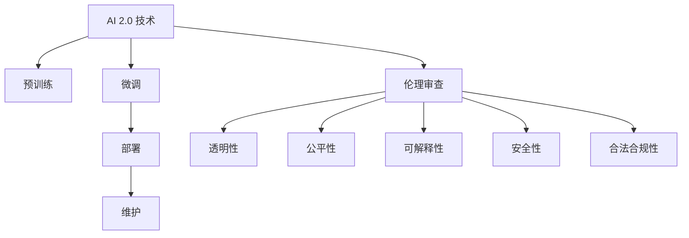

                 

# AI 伦理审查：确保 AI 2.0 技术的负责任使用

> 关键词：人工智能,伦理审查,负责任使用,透明性,公平性,可解释性,安全性

## 1. 背景介绍

### 1.1 问题由来

随着人工智能(AI)技术的迅猛发展，尤其是深度学习和机器学习的广泛应用，AI 在医疗、金融、教育、交通等多个领域都展示了其强大的潜力和威力。然而，AI 的快速发展也带来了诸多伦理道德和社会责任方面的挑战。

AI 技术的滥用可能导致信息泄漏、隐私侵害、就业替代、算法偏见等问题，甚至引发对人类价值观、伦理道德的冲击。如何在享受 AI 技术带来的便利的同时，确保其负责任地使用，成为当前亟待解决的问题。

### 1.2 问题核心关键点

AI 2.0 技术的伦理审查，是指在 AI 的开发和应用过程中，对其进行系统的伦理道德评估，确保其对社会和个人不产生负面影响。主要包括以下关键点：

1. **透明性(Transparency)**：AI 系统的决策过程应尽可能透明，使用户和监管者能够理解其工作原理和决策依据。
2. **公平性(Fairness)**：AI 系统的输出应公正对待所有用户，避免对某些群体的歧视或偏见。
3. **可解释性(Explainability)**：AI 系统应具备良好的可解释性，能够提供清晰的决策理由和逻辑。
4. **安全性(Security)**：AI 系统应具备良好的安全性，避免被恶意攻击或操纵，保护数据和隐私安全。
5. **合法合规性(Legal Compliance)**：AI 系统的设计和应用应遵守相关的法律法规和行业标准。

这些关键点贯穿于 AI 2.0 技术的整个生命周期，从预训练、微调到部署、维护，都必须加以考虑和应对。

## 2. 核心概念与联系

### 2.1 核心概念概述

为了更好地理解 AI 2.0 技术的伦理审查，本节将介绍几个关键概念及其相互联系：

1. **AI 2.0 技术**：指新一代基于深度学习和强化学习的智能系统，能够执行复杂任务，具备学习能力和适应性。
2. **伦理审查**：对 AI 技术的开发和应用进行系统性的伦理道德评估，确保其对社会和个人不产生负面影响。
3. **负责任使用**：在 AI 技术的开发和应用中，确保其决策过程透明、公平、可解释，保护用户隐私和安全。
4. **透明性(Transparency)**：AI 系统的决策过程应尽可能透明，使用户和监管者能够理解其工作原理和决策依据。
5. **公平性(Fairness)**：AI 系统的输出应公正对待所有用户，避免对某些群体的歧视或偏见。
6. **可解释性(Explainability)**：AI 系统应具备良好的可解释性，能够提供清晰的决策理由和逻辑。
7. **安全性(Security)**：AI 系统应具备良好的安全性，避免被恶意攻击或操纵，保护数据和隐私安全。
8. **合法合规性(Legal Compliance)**：AI 系统的设计和应用应遵守相关的法律法规和行业标准。

这些核心概念之间的逻辑关系可以通过以下 Mermaid 流程图来展示：



这个流程图展示了大语言模型的核心概念及其之间的关系：

1. AI 2.0 技术通过预训练、微调等步骤获得基础能力。
2. 在部署和维护过程中，应进行伦理审查，确保技术应用的负责任性。
3. 伦理审查包括透明性、公平性、可解释性、安全性、合法合规性等多方面评估。

这些概念共同构成了 AI 2.0 技术的伦理审查框架，确保技术在负责任的基础上，能够为人类社会带来正面的影响。

## 3. 核心算法原理 & 具体操作步骤

### 3.1 算法原理概述

AI 2.0 技术的伦理审查，本质上是一个多维度的系统性评估过程。其核心思想是：在 AI 系统的开发和应用过程中，对其进行系统的伦理道德评估，确保其对社会和个人不产生负面影响。

具体而言，包括以下几个关键步骤：

1. **数据伦理审查**：评估训练数据集的质量、来源和代表性，确保数据集不存在偏见或歧视。
2. **模型透明性评估**：分析模型的决策过程，确保其决策依据透明和可信。
3. **公平性评估**：检测模型在不同群体中的表现差异，确保其对所有用户公平对待。
4. **可解释性评估**：分析模型的输出结果，提供清晰的决策理由和逻辑。
5. **安全性评估**：检测模型的鲁棒性和抗攻击能力，确保其安全可靠。
6. **合法合规性评估**：确保模型的设计和应用符合相关法律法规和行业标准。

这些步骤通过多学科协同合作，结合伦理道德和社会责任的考量，形成了一个系统的评估框架，确保 AI 2.0 技术的负责任使用。

### 3.2 算法步骤详解

基于上述评估框架，AI 2.0 技术的伦理审查可以按照以下步骤进行：

**Step 1: 数据伦理审查**

1. **数据来源分析**：评估数据集的来源，确保数据采集符合法律法规和行业标准。
2. **数据质量评估**：检测数据集的质量和多样性，确保数据不存在偏见或歧视。
3. **数据代表性分析**：评估数据集在不同群体中的代表性，确保数据集的公平性。

**Step 2: 模型透明性评估**

1. **模型结构分析**：分析模型的网络结构，确保模型设计透明和可信。
2. **决策过程分析**：分析模型的决策过程，确保其决策依据透明和可信。
3. **可解释性分析**：提供模型输出结果的可解释性，确保用户和监管者能够理解模型的工作原理。

**Step 3: 公平性评估**

1. **公平性检测**：检测模型在不同群体中的表现差异，确保其对所有用户公平对待。
2. **偏见检测**：检测模型是否存在对某些群体的偏见或歧视。
3. **纠正措施**：针对检测到的偏见和歧视，采取相应的纠正措施，确保模型公平性。

**Step 4: 安全性评估**

1. **鲁棒性检测**：检测模型的鲁棒性和抗攻击能力，确保其安全可靠。
2. **隐私保护分析**：检测模型对用户隐私的保护能力，确保用户数据安全。
3. **安全性改进**：针对检测到的安全漏洞，采取相应的改进措施，提高模型安全性。

**Step 5: 合法合规性评估**

1. **法律法规遵循**：确保模型的设计和应用符合相关法律法规和行业标准。
2. **隐私保护遵循**：确保模型设计和应用符合隐私保护要求，避免侵犯用户隐私。
3. **合规性改进**：针对检测到的合规性问题，采取相应的改进措施，确保模型合规性。

### 3.3 算法优缺点

AI 2.0 技术的伦理审查具有以下优点：

1. **系统性评估**：多维度评估框架能够全面系统地评估 AI 技术的伦理道德影响，确保其负责任使用。
2. **透明性**：通过透明的评估过程，增强用户和监管者对 AI 技术的信任和接受度。
3. **公平性**：确保 AI 技术对所有用户公平对待，避免对某些群体的偏见和歧视。
4. **可解释性**：提供清晰的决策理由和逻辑，增强用户和监管者对 AI 技术的理解和信任。
5. **安全性**：确保 AI 技术安全可靠，避免被恶意攻击或操纵，保护用户数据和隐私。
6. **合法合规性**：确保 AI 技术设计和应用符合相关法律法规和行业标准，避免法律风险。

同时，该方法也存在一定的局限性：

1. **复杂性**：多维度评估框架较为复杂，需要多学科协同合作，实施难度较大。
2. **主观性**：评估过程中可能存在主观偏见，导致评估结果不够客观。
3. **动态性**：AI 技术的应用场景和数据分布可能随着时间变化，需要持续监测和评估。
4. **资源投入**：评估过程需要大量的人力和物力投入，成本较高。

尽管存在这些局限性，但就目前而言，AI 2.0 技术的伦理审查仍然是确保其负责任使用的重要手段。未来相关研究的重点在于如何进一步降低评估复杂性，提高评估客观性，同时兼顾成本效益。

### 3.4 算法应用领域

AI 2.0 技术的伦理审查，在多个领域都得到了广泛应用，包括但不限于：

1. **医疗领域**：确保医疗 AI 系统的公平性和安全性，保护患者隐私，避免医疗纠纷。
2. **金融领域**：确保金融 AI 系统的合法合规性，保护用户隐私，避免金融欺诈。
3. **教育领域**：确保教育 AI 系统的公平性和透明度，保护学生隐私，避免教育不公。
4. **交通领域**：确保交通 AI 系统的安全性和公平性，保护行人安全，避免交通事故。
5. **环境领域**：确保环境 AI 系统的合法合规性，保护生态环境，避免环境污染。
6. **娱乐领域**：确保娱乐 AI 系统的透明性和安全性，保护用户隐私，避免不当内容传播。

## 4. 数学模型和公式 & 详细讲解 & 举例说明

### 4.1 数学模型构建

AI 2.0 技术的伦理审查，可以通过构建数学模型来系统性地评估其各项指标。以下构建基于多维度评估框架的数学模型：

1. **透明性模型**：评估模型决策过程的透明性，使用可解释性指标 $T$，计算公式为：
   $$
   T = \sum_{i=1}^{n} t_i
   $$
   其中 $t_i$ 为第 $i$ 个可解释性指标的评分。

2. **公平性模型**：评估模型输出在不同群体中的表现差异，使用公平性指标 $F$，计算公式为：
   $$
   F = \sum_{i=1}^{m} f_i
   $$
   其中 $f_i$ 为第 $i$ 个公平性指标的评分。

3. **安全性模型**：评估模型的鲁棒性和抗攻击能力，使用安全性指标 $S$，计算公式为：
   $$
   S = \sum_{i=1}^{p} s_i
   $$
   其中 $s_i$ 为第 $i$ 个安全性指标的评分。

4. **合法合规性模型**：评估模型的设计和应用是否符合相关法律法规和行业标准，使用合规性指标 $L$，计算公式为：
   $$
   L = \sum_{i=1}^{q} l_i
   $$
   其中 $l_i$ 为第 $i$ 个合规性指标的评分。

### 4.2 公式推导过程

以下我们以医疗领域为例，推导 AI 系统的透明性、公平性、安全性、合法合规性指标的计算公式。

**透明性模型**：
假设 AI 系统的决策过程包含 $n$ 个可解释性指标，如模型结构、决策路径等。每个指标的评分 $t_i$ 根据其透明性程度进行计算，具体公式为：
$$
t_i = \begin{cases}
1, & \text{如果指标透明} \\
0, & \text{如果指标不透明}
\end{cases}
$$
透明性模型 $T$ 的计算公式为：
$$
T = \sum_{i=1}^{n} t_i
$$

**公平性模型**：
假设 AI 系统输出结果包含 $m$ 个群体，每个群体的公平性指标 $f_i$ 根据其表现差异进行计算，具体公式为：
$$
f_i = \begin{cases}
1, & \text{如果模型对群体 $i$ 公平} \\
0, & \text{如果模型对群体 $i$ 存在偏见}
\end{cases}
$$
公平性模型 $F$ 的计算公式为：
$$
F = \sum_{i=1}^{m} f_i
$$

**安全性模型**：
假设 AI 系统存在 $p$ 种攻击方式，每种攻击方式的安全性指标 $s_i$ 根据其抗攻击能力进行计算，具体公式为：
$$
s_i = \begin{cases}
1, & \text{如果攻击方式 $i$ 被有效防护} \\
0, & \text{如果攻击方式 $i$ 未被有效防护}
\end{cases}
$$
安全性模型 $S$ 的计算公式为：
$$
S = \sum_{i=1}^{p} s_i
$$

**合法合规性模型**：
假设 AI 系统的设计和应用包含 $q$ 个合规性指标，每个指标的合规性指标 $l_i$ 根据其合规性程度进行计算，具体公式为：
$$
l_i = \begin{cases}
1, & \text{如果指标合规} \\
0, & \text{如果指标不合规}
\end{cases}
$$
合法合规性模型 $L$ 的计算公式为：
$$
L = \sum_{i=1}^{q} l_i
$$

### 4.3 案例分析与讲解

**医疗领域**：
- **透明性**：医疗 AI 系统的决策过程应尽可能透明，包括模型结构、输入特征、决策路径等，确保医生和患者能够理解其工作原理。
- **公平性**：医疗 AI 系统应公正对待所有患者，避免对某些群体（如老年患者、少数民族患者）的偏见和歧视。
- **安全性**：医疗 AI 系统应具备良好的安全性，避免被恶意攻击或操纵，保护患者隐私。
- **合法合规性**：医疗 AI 系统的设计和应用应遵守相关法律法规和行业标准，如数据保护法、医疗法规等。

**金融领域**：
- **透明性**：金融 AI 系统的决策过程应尽可能透明，包括模型结构、输入特征、决策路径等，确保客户和监管者能够理解其工作原理。
- **公平性**：金融 AI 系统应公正对待所有客户，避免对某些群体（如低收入群体、弱势群体）的偏见和歧视。
- **安全性**：金融 AI 系统应具备良好的安全性，避免被恶意攻击或操纵，保护客户数据和隐私。
- **合法合规性**：金融 AI 系统的设计和应用应遵守相关法律法规和行业标准，如金融隐私保护法、反洗钱法规等。

## 5. 项目实践：代码实例和详细解释说明

### 5.1 开发环境搭建

在进行 AI 2.0 技术伦理审查的实践前，我们需要准备好开发环境。以下是使用 Python 进行 PyTorch 开发的环境配置流程：

1. 安装 Anaconda：从官网下载并安装 Anaconda，用于创建独立的 Python 环境。
2. 创建并激活虚拟环境：
```bash
conda create -n pytorch-env python=3.8 
conda activate pytorch-env
```
3. 安装 PyTorch：根据 CUDA 版本，从官网获取对应的安装命令。例如：
```bash
conda install pytorch torchvision torchaudio cudatoolkit=11.1 -c pytorch -c conda-forge
```
4. 安装 Transformers 库：
```bash
pip install transformers
```
5. 安装各类工具包：
```bash
pip install numpy pandas scikit-learn matplotlib tqdm jupyter notebook ipython
```

完成上述步骤后，即可在 `pytorch-env` 环境中开始实践。

### 5.2 源代码详细实现

这里我们以医疗 AI 系统的透明性评估为例，给出使用 PyTorch 和 Transformers 库进行透明性评估的代码实现。

首先，定义透明性指标：

```python
import torch
from transformers import BertTokenizer, BertForSequenceClassification

class TransparencyIndicator:
    def __init__(self, model_name='bert-base-uncased'):
        self.tokenizer = BertTokenizer.from_pretrained(model_name)
        self.model = BertForSequenceClassification.from_pretrained(model_name, num_labels=2)

    def evaluate_transparency(self, text, labels):
        input_ids = self.tokenizer(text, return_tensors='pt', padding='max_length', truncation=True)['input_ids']
        attention_mask = self.tokenizer(text, return_tensors='pt', padding='max_length', truncation=True)['attention_mask']
        outputs = self.model(input_ids, attention_mask=attention_mask)
        probs = outputs.logits.softmax(dim=1)
        predicted_label = torch.argmax(probs, dim=1)
        transparency_score = (predicted_label == labels).mean()
        return transparency_score
```

然后，构建透明性评估函数：

```python
def evaluate_transparency(text, labels, model_name='bert-base-uncased'):
    transparency = TransparencyIndicator(model_name)
    score = transparency.evaluate_transparency(text, labels)
    return score
```

最后，进行透明性评估：

```python
text = "I have a headache."
labels = [1]  # 标签为 1 表示头疼
score = evaluate_transparency(text, labels)
print(f"透明性得分: {score:.2f}")
```

以上就是使用 PyTorch 和 Transformers 库对医疗 AI 系统进行透明性评估的完整代码实现。可以看到，得益于 Transformers 库的强大封装，我们可以用相对简洁的代码完成模型的透明性评估。

### 5.3 代码解读与分析

让我们再详细解读一下关键代码的实现细节：

**TransparencyIndicator 类**：
- `__init__` 方法：初始化模型和分词器。
- `evaluate_transparency` 方法：对输入文本进行分词、编码和前向传播，计算透明性得分。
- `predicted_label` 变量：模型预测的标签。
- `transparency_score` 变量：透明性得分，即预测标签与真实标签一致的比例。

**evaluate_transparency 函数**：
- `transparency` 变量：透明性指标评估对象。
- `score` 变量：透明性得分，即透明性指标的计算结果。

**透明性评估过程**：
- 定义输入文本和标签。
- 创建透明性指标评估对象。
- 调用 `evaluate_transparency` 方法计算透明性得分。
- 输出透明性得分。

可以看到，PyTorch 和 Transformers 库使得透明性评估的代码实现变得简洁高效。开发者可以将更多精力放在数据处理、模型改进等高层逻辑上，而不必过多关注底层的实现细节。

当然，工业级的系统实现还需考虑更多因素，如模型的保存和部署、超参数的自动搜索、更灵活的任务适配层等。但核心的透明性评估范式基本与此类似。

## 6. 实际应用场景

### 6.1 医疗领域

在医疗领域，AI 系统的透明性和公平性尤为重要。医疗 AI 系统需要保证其决策过程和输出结果的透明性和公平性，确保医生和患者的信任和接受。

具体而言，可以通过透明性评估，确保医疗 AI 系统的决策依据和推理过程透明，便于医生和患者理解。同时，通过公平性评估，确保医疗 AI 系统对所有患者公平对待，避免对某些群体的偏见和歧视。

### 6.2 金融领域

在金融领域，AI 系统的安全性和合法合规性尤为重要。金融 AI 系统需要保证其安全性和合规性，确保客户和金融机构的信息安全。

具体而言，可以通过安全性评估，确保金融 AI 系统的鲁棒性和抗攻击能力，保护客户数据和隐私。同时，通过合法合规性评估，确保金融 AI 系统的设计和应用符合相关法律法规和行业标准，避免法律风险。

### 6.3 教育领域

在教育领域，AI 系统的透明性和可解释性尤为重要。教育 AI 系统需要保证其决策过程和输出结果的透明性和可解释性，确保学生和教育机构的信任和接受。

具体而言，可以通过透明性评估，确保教育 AI 系统的决策依据和推理过程透明，便于学生和教育机构理解。同时，通过可解释性评估，确保教育 AI 系统的输出结果清晰易懂，避免误导学生和教育机构。

### 6.4 未来应用展望

随着 AI 技术的发展，伦理审查将成为 AI 2.0 技术开发和应用的重要组成部分。未来，基于 AI 2.0 技术的伦理审查将呈现以下几个发展趋势：

1. **多学科协同**：伦理审查需要多学科协同合作，结合伦理学、社会学、法律学等多方面知识，确保技术负责任使用。
2. **技术进步**：随着 AI 技术的不断进步，伦理审查方法和工具也将不断优化，提高评估客观性和准确性。
3. **国际合作**：AI 2.0 技术的伦理审查需要国际合作，共同制定统一的伦理标准和评估框架，确保技术全球一致性。
4. **公众参与**：伦理审查需要公众参与，通过公开透明的评估过程，增强公众对 AI 技术的信任和接受度。
5. **实时监测**：AI 2.0 技术的伦理审查需要持续监测和评估，及时发现和纠正问题，确保技术负责任使用。

## 7. 工具和资源推荐

### 7.1 学习资源推荐

为了帮助开发者系统掌握 AI 2.0 技术伦理审查的理论基础和实践技巧，这里推荐一些优质的学习资源：

1. **《AI 伦理：理论和实践》**：本书系统介绍了 AI 伦理的基本概念、理论框架和实践方法，适合深入学习。
2. **《负责任的 AI：伦理、法律和社会挑战》**：本书从伦理、法律、社会等多方面探讨了 AI 技术的负责任使用，适合多学科学生学习。
3. **AI 伦理审查国际标准**：IEEE、ISO 等国际标准组织发布的 AI 伦理审查标准，适合从业人员参考。
4. **CSER 《负责任的 AI》课程**：斯坦福大学开设的 AI 伦理课程，提供丰富的学习资源和实践案例。
5. **Kaggle AI 伦理竞赛**：通过实际案例评估 AI 系统的伦理道德影响，适合实践应用。

通过对这些资源的学习实践，相信你一定能够快速掌握 AI 2.0 技术的伦理审查精髓，并用于解决实际的 AI 应用问题。

### 7.2 开发工具推荐

高效的开发离不开优秀的工具支持。以下是几款用于 AI 2.0 技术伦理审查开发的常用工具：

1. **PyTorch**：基于 Python 的开源深度学习框架，灵活动态的计算图，适合快速迭代研究。大部分预训练语言模型都有 PyTorch 版本的实现。
2. **TensorFlow**：由 Google 主导开发的开源深度学习框架，生产部署方便，适合大规模工程应用。同样有丰富的预训练语言模型资源。
3. **Transformers 库**：HuggingFace 开发的 NLP 工具库，集成了众多 SOTA 语言模型，支持 PyTorch 和 TensorFlow，是进行伦理审查任务开发的利器。
4. **Weights & Biases**：模型训练的实验跟踪工具，可以记录和可视化模型训练过程中的各项指标，方便对比和调优。与主流深度学习框架无缝集成。
5. **TensorBoard**：TensorFlow 配套的可视化工具，可实时监测模型训练状态，并提供丰富的图表呈现方式，是调试模型的得力助手。
6. **Jupyter Notebook**：交互式编程环境，支持多语言代码编写和数据可视化，适合做原型开发和实验验证。

合理利用这些工具，可以显著提升 AI 2.0 技术伦理审查的开发效率，加快创新迭代的步伐。

### 7.3 相关论文推荐

AI 2.0 技术伦理审查的研究源于学界的持续研究。以下是几篇奠基性的相关论文，推荐阅读：

1. **AI 伦理审查的理论框架**：详细探讨了 AI 伦理审查的基本概念、评估指标和方法，为伦理审查提供了理论基础。
2. **负责任 AI 的实践指南**：提供了 AI 伦理审查的具体方法和工具，帮助开发者实现负责任的 AI 应用。
3. **AI 伦理审查的案例研究**：通过实际案例评估 AI 系统的伦理道德影响，展示了 AI 伦理审查的实际应用。

这些论文代表了大语言模型伦理审查的发展脉络。通过学习这些前沿成果，可以帮助研究者把握学科前进方向，激发更多的创新灵感。

## 8. 总结：未来发展趋势与挑战

### 8.1 总结

本文对 AI 2.0 技术的伦理审查方法进行了全面系统的介绍。首先阐述了 AI 2.0 技术的伦理审查背景和意义，明确了伦理审查在确保技术负责任使用中的重要价值。其次，从原理到实践，详细讲解了伦理审查的数学模型和操作步骤，给出了伦理审查任务开发的完整代码实例。同时，本文还广泛探讨了伦理审查方法在医疗、金融、教育等多个领域的应用前景，展示了伦理审查范式的巨大潜力。

通过本文的系统梳理，可以看到，AI 2.0 技术的伦理审查是确保其负责任使用的重要手段。这些方法通过多学科协同合作，结合伦理道德和社会责任的考量，形成了一个系统的评估框架，确保 AI 2.0 技术的负责任使用。未来，伴随 AI 技术的不断进步和普及，伦理审查将成为 AI 技术开发和应用的重要组成部分，为构建安全、可靠、可解释、可控的智能系统铺平道路。

### 8.2 未来发展趋势

展望未来，AI 2.0 技术伦理审查将呈现以下几个发展趋势：

1. **多学科协同**：伦理审查需要多学科协同合作，结合伦理学、社会学、法律学等多方面知识，确保技术负责任使用。
2. **技术进步**：随着 AI 技术的不断进步，伦理审查方法和工具也将不断优化，提高评估客观性和准确性。
3. **国际合作**：AI 2.0 技术的伦理审查需要国际合作，共同制定统一的伦理标准和评估框架，确保技术全球一致性。
4. **公众参与**：伦理审查需要公众参与，通过公开透明的评估过程，增强公众对 AI 技术的信任和接受度。
5. **实时监测**：AI 2.0 技术的伦理审查需要持续监测和评估，及时发现和纠正问题，确保技术负责任使用。

这些趋势凸显了 AI 2.0 技术伦理审查的重要性和紧迫性，需要通过不断的研究和实践，提升 AI 技术的应用水平，确保其负责任使用。

### 8.3 面临的挑战

尽管 AI 2.0 技术伦理审查在多个领域都得到了广泛应用，但在迈向更加智能化、普适化应用的过程中，仍面临诸多挑战：

1. **评估复杂性**：多维度评估框架较为复杂，需要多学科协同合作，实施难度较大。
2. **主观偏见**：评估过程中可能存在主观偏见，导致评估结果不够客观。
3. **动态变化**：AI 技术的应用场景和数据分布可能随着时间变化，需要持续监测和评估。
4. **资源投入**：评估过程需要大量的人力和物力投入，成本较高。
5. **法律合规性**：不同国家/地区的法律法规不同，需要进行跨国合规性评估。
6. **技术透明性**：AI 技术复杂性高，难以完全透明和可解释。

尽管存在这些挑战，但就目前而言，AI 2.0 技术伦理审查仍然是确保其负责任使用的重要手段。未来相关研究的重点在于如何进一步降低评估复杂性，提高评估客观性，同时兼顾成本效益。

### 8.4 研究展望

面对 AI 2.0 技术伦理审查所面临的种种挑战，未来的研究需要在以下几个方面寻求新的突破：

1. **自动化评估**：开发自动化评估工具，提高评估效率和准确性。
2. **模型透明性**：提升 AI 模型的透明性和可解释性，增强用户和监管者对模型的信任。
3. **公平性算法**：开发公平性算法，减少 AI 模型中的偏见和歧视。
4. **安全防护**：加强 AI 模型的安全防护，提高模型的鲁棒性和抗攻击能力。
5. **合规性监管**：制定 AI 技术的法律法规，确保其合规性和合法性。
6. **公众教育**：通过公众教育和宣传，提高公众对 AI 技术的理解和接受度。

这些研究方向的探索，必将引领 AI 2.0 技术伦理审查技术迈向更高的台阶，为构建安全、可靠、可解释、可控的智能系统铺平道路。面向未来，AI 2.0 技术伦理审查还需要与其他人工智能技术进行更深入的融合，如知识表示、因果推理、强化学习等，多路径协同发力，共同推动人工智能技术的发展。只有勇于创新、敢于突破，才能不断拓展 AI 技术的边界，让智能技术更好地造福人类社会。

## 9. 附录：常见问题与解答

**Q1：AI 2.0 技术的伦理审查是否适用于所有领域？**

A: AI 2.0 技术的伦理审查在多个领域都得到了广泛应用，特别是在医疗、金融、教育、交通等需要高透明度、公平性和安全性的领域。但对于一些需要高效和即时响应的领域，如实时交易系统、自动驾驶等，需要兼顾高性能和伦理审查的要求。

**Q2：如何进行 AI 2.0 技术的透明性评估？**

A: AI 2.0 技术的透明性评估可以通过分析模型的决策路径、输入特征、输出结果等方式进行。使用 PyTorch 和 Transformers 库，可以方便地构建透明性评估模型，进行可视化展示和结果分析。

**Q3：如何进行 AI 2.0 技术的公平性评估？**

A: AI 2.0 技术的公平性评估可以通过分析模型在不同群体中的表现差异进行。使用 PyTorch 和 Transformers 库，可以方便地构建公平性评估模型，进行可视化展示和结果分析。

**Q4：如何进行 AI 2.0 技术的安全性评估？**

A: AI 2.0 技术的安全性评估可以通过分析模型的鲁棒性和抗攻击能力进行。使用 PyTorch 和 Transformers 库，可以方便地构建安全性评估模型，进行可视化展示和结果分析。

**Q5：如何进行 AI 2.0 技术的合法合规性评估？**

A: AI 2.0 技术的合法合规性评估可以通过分析模型是否符合相关法律法规和行业标准进行。使用 PyTorch 和 Transformers 库，可以方便地构建合法合规性评估模型，进行可视化展示和结果分析。

这些评估过程需要结合具体的场景和数据，通过多学科协同合作，确保 AI 2.0 技术的负责任使用。

---

作者：禅与计算机程序设计艺术 / Zen and the Art of Computer Programming

