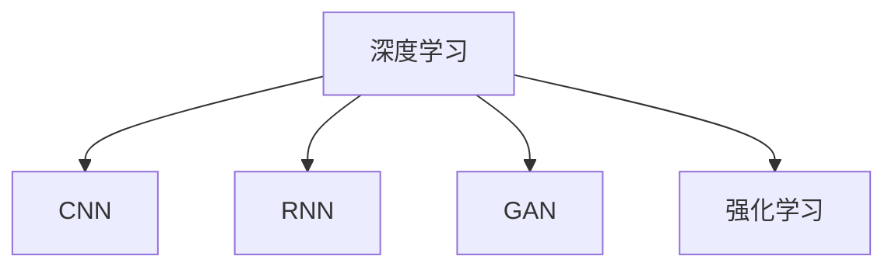
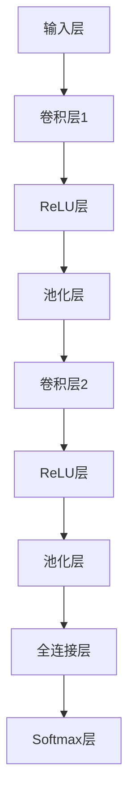

                 

# AI 原理与代码实例讲解

## 1. 背景介绍

### 1.1 问题由来

人工智能（AI）技术的迅猛发展，尤其是在深度学习领域的应用，已使得AI在多个行业取得了突破性进展。从语音识别、图像识别到自然语言处理（NLP），AI技术正在改变我们的生活方式。而这一切背后的驱动力，源于对数据、算法和计算资源的不断优化与创新。

### 1.2 问题核心关键点

理解AI的核心概念与原理，掌握关键技术，是走向AI开发道路的基础。本文将系统地介绍AI的基本原理，并通过代码实例，阐述其实际应用。从理论到实践，从算法到代码，全方位地解读AI的奥秘。

## 2. 核心概念与联系

### 2.1 核心概念概述

为了更好地理解AI的原理与应用，本节将介绍几个关键概念：

- 人工智能（AI）：研究如何让机器模拟人类智能行为的学科。
- 深度学习（Deep Learning）：一种基于神经网络模型的机器学习方法，广泛用于图像、语音、NLP等领域。
- 卷积神经网络（CNN）：一种专门用于图像处理任务的神经网络结构。
- 循环神经网络（RNN）：一种用于序列数据处理的任务，如语音识别、NLP中的文本生成。
- 生成对抗网络（GAN）：一种用于生成新数据样本的神经网络模型。
- 强化学习（Reinforcement Learning）：通过与环境的交互，使智能体学习最优策略的AI技术。

这些核心概念构成了AI技术的基石，是理解和应用AI的关键。通过理解这些概念，我们可以更好地把握AI的发展脉络和技术创新。

### 2.2 核心概念原理和架构的 Mermaid 流程图



这个流程图展示了深度学习与其他关键AI技术之间的联系。

## 3. 核心算法原理 & 具体操作步骤

### 3.1 算法原理概述

AI的核心算法原理基于数学模型和优化算法。通过构建模型、定义损失函数、优化参数，AI模型可以学习数据的规律，并进行预测或生成。

以深度学习为例，其基本框架是多层神经网络，通过反向传播算法，最小化损失函数，更新模型参数，从而实现对数据的拟合。而优化算法如随机梯度下降（SGD）、Adam等，则是寻找最优参数的策略。

### 3.2 算法步骤详解

深度学习的基本步骤如下：

1. 数据准备：收集、清洗、预处理数据。
2. 模型构建：设计神经网络模型结构，包括层数、激活函数、正则化等。
3. 参数初始化：初始化模型的权重和偏置。
4. 前向传播：将数据输入模型，计算输出。
5. 损失计算：计算模型输出与真实标签的差异。
6. 反向传播：通过链式法则，计算损失函数对模型参数的梯度。
7. 参数更新：使用优化算法，更新模型参数。
8. 模型评估：在验证集或测试集上评估模型性能。

这些步骤构成了一个完整的深度学习训练流程。

### 3.3 算法优缺点

深度学习具有以下优点：

- 自适应能力强：能自动学习特征，避免手工设计特征的繁琐。
- 性能优异：在图像、语音、NLP等任务上取得了优异表现。
- 可扩展性强：通过增加层数、节点数等方式，可以构建更复杂的模型。

然而，深度学习也存在一些缺点：

- 计算资源消耗大：需要大量的GPU计算资源。
- 模型可解释性差：复杂模型难以理解其内部工作机制。
- 过拟合风险高：易在训练数据上过拟合。
- 数据依赖性强：需要大量标注数据。

### 3.4 算法应用领域

深度学习广泛应用于多个领域：

- 计算机视觉：图像分类、目标检测、图像生成等。
- 自然语言处理：机器翻译、文本生成、情感分析等。
- 语音识别：语音合成、语音识别等。
- 强化学习：自动驾驶、游戏AI、机器人控制等。

## 4. 数学模型和公式 & 详细讲解 & 举例说明

### 4.1 数学模型构建

深度学习的数学模型通常基于以下公式：

$$
\begin{aligned}
L &= \frac{1}{N} \sum_{i=1}^N \| y_i - \hat{y}_i \|^2 \\
\hat{y}_i &= f(x_i; \theta)
\end{aligned}
$$

其中，$y_i$ 为真实标签，$\hat{y}_i$ 为模型预测，$x_i$ 为输入数据，$\theta$ 为模型参数。

### 4.2 公式推导过程

以线性回归为例，其目标是最小化预测值与真实值之间的均方误差：

$$
L = \frac{1}{2N} \sum_{i=1}^N (y_i - \hat{y}_i)^2
$$

其中，$\hat{y}_i = \theta^T x_i$，$\theta$ 为模型权重向量。

使用梯度下降算法更新参数 $\theta$：

$$
\theta_{t+1} = \theta_t - \eta \nabla_{\theta} L
$$

其中，$\eta$ 为学习率，$\nabla_{\theta} L$ 为损失函数对 $\theta$ 的梯度。

### 4.3 案例分析与讲解

以图像分类为例，CNN结构如图：



其中，卷积层和池化层用于提取特征，全连接层和Softmax层用于分类。

## 5. 项目实践：代码实例和详细解释说明

### 5.1 开发环境搭建

在开始项目实践之前，我们需要准备开发环境。以下是使用Python进行TensorFlow开发的环境配置流程：

1. 安装Anaconda：从官网下载并安装Anaconda，用于创建独立的Python环境。
2. 创建并激活虚拟环境：
```bash
conda create -n tf-env python=3.8 
conda activate tf-env
```
3. 安装TensorFlow：根据CUDA版本，从官网获取对应的安装命令。例如：
```bash
conda install tensorflow tensorflow-cpu -c conda-forge
```
4. 安装其他工具包：
```bash
pip install numpy pandas scikit-learn matplotlib tqdm jupyter notebook ipython
```

完成上述步骤后，即可在`tf-env`环境中开始TensorFlow项目开发。

### 5.2 源代码详细实现

下面我们以图像分类任务为例，给出使用TensorFlow进行CNN模型训练的代码实现。

```python
import tensorflow as tf
from tensorflow.keras import layers
from tensorflow.keras.datasets import mnist
from tensorflow.keras.utils import to_categorical

# 加载数据集
(x_train, y_train), (x_test, y_test) = mnist.load_data()

# 数据预处理
x_train = x_train / 255.0
x_test = x_test / 255.0
y_train = to_categorical(y_train)
y_test = to_categorical(y_test)

# 定义模型
model = tf.keras.Sequential([
    layers.Conv2D(32, (3, 3), activation='relu', input_shape=(28, 28, 1)),
    layers.MaxPooling2D((2, 2)),
    layers.Conv2D(64, (3, 3), activation='relu'),
    layers.MaxPooling2D((2, 2)),
    layers.Flatten(),
    layers.Dense(128, activation='relu'),
    layers.Dense(10, activation='softmax')
])

# 编译模型
model.compile(optimizer='adam', loss='categorical_crossentropy', metrics=['accuracy'])

# 训练模型
model.fit(x_train, y_train, epochs=10, batch_size=32, validation_data=(x_test, y_test))
```

以上代码实现了使用TensorFlow构建CNN模型，并在MNIST数据集上进行训练和验证。

### 5.3 代码解读与分析

**数据预处理**：

- `mnist.load_data()`：加载MNIST数据集。
- `x_train = x_train / 255.0`：将像素值归一化到0-1之间。
- `y_train = to_categorical(y_train)`：将标签转换为独热编码。

**模型定义**：

- `Sequential`：定义序列模型。
- `Conv2D`：定义卷积层。
- `MaxPooling2D`：定义池化层。
- `Flatten`：将特征图展平。
- `Dense`：定义全连接层。

**模型编译**：

- `compile`：定义优化器、损失函数和评估指标。

**模型训练**：

- `fit`：进行模型训练，指定训练数据、批次大小、迭代轮数等参数。

## 6. 实际应用场景

### 6.1 智能推荐系统

智能推荐系统广泛用于电商、新闻、音乐等领域，通过分析用户行为，推荐相关内容。深度学习在此类任务上表现优异，可以通过用户行为数据构建推荐模型。

### 6.2 自动驾驶

自动驾驶是强化学习在实际应用中的典型案例。通过在仿真环境中训练深度学习模型，使其学习最优驾驶策略，并在实际驾驶场景中不断优化，最终实现自动驾驶。

### 6.3 自然语言处理

NLP中的机器翻译、文本生成、情感分析等任务，均可以通过深度学习模型实现。例如，使用Transformer架构的机器翻译模型已经在多个语种翻译任务上取得了SOTA性能。

### 6.4 未来应用展望

未来，深度学习将在更多领域得到应用，推动AI技术的不断创新。以下是一些未来可能的发展方向：

- 多模态学习：结合视觉、听觉、语言等多种模态，构建更加全面、智能的AI系统。
- 自监督学习：通过无标签数据进行预训练，减少对标注数据的依赖。
- 对抗训练：引入对抗样本，提高模型的鲁棒性和泛化能力。
- 联邦学习：在分布式环境中训练模型，保护数据隐私。
- 可解释AI：构建可解释性强的模型，提高系统的透明度和可靠性。

## 7. 工具和资源推荐

### 7.1 学习资源推荐

为了帮助开发者系统掌握深度学习的原理与应用，这里推荐一些优质的学习资源：

1. 《深度学习》（Ian Goodfellow著）：深度学习领域的经典教材，详细介绍了深度学习的基本原理和应用。
2. 《动手学深度学习》（李沐等著）：面向实战的深度学习教材，通过代码实现帮助理解深度学习算法。
3. 深度学习课程（Coursera）：由斯坦福大学Andrew Ng教授主讲的深度学习课程，涵盖深度学习的基本概念和应用。
4. TensorFlow官方文档：TensorFlow的官方文档，提供了丰富的教程和示例代码，是学习TensorFlow的重要资源。
5. PyTorch官方文档：PyTorch的官方文档，提供了丰富的教程和示例代码，是学习PyTorch的重要资源。

通过对这些资源的学习实践，相信你一定能够快速掌握深度学习的精髓，并用于解决实际的AI问题。

### 7.2 开发工具推荐

高效的开发离不开优秀的工具支持。以下是几款用于深度学习开发的常用工具：

1. TensorFlow：由Google主导开发的深度学习框架，支持CPU、GPU、TPU等多种计算资源，适合大规模工程应用。
2. PyTorch：由Facebook主导开发的深度学习框架，灵活高效，适合快速迭代研究。
3. Keras：高层次的深度学习框架，易于上手，适合初学者快速构建模型。
4. Jupyter Notebook：开源的交互式编程环境，支持Python、R等多种语言，适合数据分析和机器学习研究。
5. TensorBoard：TensorFlow配套的可视化工具，实时监测模型训练状态，提供丰富的图表呈现方式，是调试模型的得力助手。

合理利用这些工具，可以显著提升深度学习的开发效率，加快创新迭代的步伐。

### 7.3 相关论文推荐

深度学习的发展离不开学界的持续研究。以下是几篇奠基性的相关论文，推荐阅读：

1. 《深度学习》（Goodfellow等著）：全面介绍了深度学习的基本原理和应用。
2. 《ImageNet大规模视觉识别挑战赛》（Alex Krizhevsky等著）：介绍了深度学习在图像识别任务上的突破性进展。
3. 《深度残差学习》（He等著）：提出了深度残差网络，极大地提高了深度神经网络的训练效率。
4. 《 Attention is All You Need》（Vaswani等著）：提出了Transformer架构，开启了自注意力机制在深度学习中的应用。
5. 《ImageNet大规模视觉识别挑战赛2021》（He等著）：介绍了深度学习在图像识别任务上的最新进展。

这些论文代表了大深度学习的发展脉络。通过学习这些前沿成果，可以帮助研究者把握学科前进方向，激发更多的创新灵感。

## 8. 总结：未来发展趋势与挑战

### 8.1 总结

本文对深度学习的核心概念与原理进行了全面系统的介绍。从数学模型到算法步骤，从理论推导到代码实例，系统地阐述了深度学习的全貌。通过实例讲解，展示了深度学习在实际应用中的强大能力。

通过本文的系统梳理，可以看到，深度学习正在成为AI开发的重要范式，极大地拓展了AI的应用边界，催生了更多的落地场景。深度学习在图像、语音、NLP等众多领域取得了突破性进展，深刻影响着我们的生活方式。

### 8.2 未来发展趋势

未来，深度学习将在更多领域得到应用，推动AI技术的不断创新。以下是一些未来可能的发展方向：

- 多模态学习：结合视觉、听觉、语言等多种模态，构建更加全面、智能的AI系统。
- 自监督学习：通过无标签数据进行预训练，减少对标注数据的依赖。
- 对抗训练：引入对抗样本，提高模型的鲁棒性和泛化能力。
- 联邦学习：在分布式环境中训练模型，保护数据隐私。
- 可解释AI：构建可解释性强的模型，提高系统的透明度和可靠性。

以上趋势凸显了深度学习技术的广阔前景。这些方向的探索发展，必将进一步提升AI系统的性能和应用范围，为人类社会带来深远影响。

### 8.3 面临的挑战

尽管深度学习已经取得了瞩目成就，但在迈向更加智能化、普适化应用的过程中，仍面临诸多挑战：

- 计算资源消耗大：深度学习模型往往需要大量的计算资源。
- 模型可解释性差：复杂模型难以理解其内部工作机制。
- 过拟合风险高：易在训练数据上过拟合。
- 数据依赖性强：需要大量标注数据。
- 安全性和隐私保护：深度学习模型可能引入偏见、隐私问题。

### 8.4 研究展望

面对深度学习面临的这些挑战，未来的研究需要在以下几个方面寻求新的突破：

- 探索高效计算方法：开发更加高效的深度学习算法，降低计算资源消耗。
- 提高模型可解释性：构建可解释性强的模型，提高系统的透明度和可靠性。
- 结合其他AI技术：与自然语言处理、强化学习、知识表示等AI技术结合，提升AI系统的综合能力。
- 确保数据隐私保护：在分布式环境中训练模型，保护数据隐私。

这些研究方向的探索，必将引领深度学习技术迈向更高的台阶，为构建安全、可靠、可解释、可控的AI系统铺平道路。面向未来，深度学习技术还需要与其他AI技术进行更深入的融合，多路径协同发力，共同推动AI技术的发展。

## 9. 附录：常见问题与解答

**Q1：深度学习是否适用于所有AI任务？**

A: 深度学习在图像、语音、NLP等任务上表现优异，但对于一些特定任务，如逻辑推理、决策制定等，深度学习可能无法取得最佳效果。此时，需要结合其他AI技术，如知识表示、因果推理等，进行综合应用。

**Q2：如何避免深度学习模型的过拟合？**

A: 过拟合是深度学习模型面临的主要挑战。避免过拟合的策略包括：
- 数据增强：通过数据扩充、变换等方式，增加训练集的多样性。
- 正则化：使用L1/L2正则、Dropout等技术，限制模型的复杂度。
- 早停法：在验证集上监测模型性能，一旦性能下降，立即停止训练。

**Q3：深度学习模型在实际应用中应注意哪些问题？**

A: 将深度学习模型转化为实际应用，还需要考虑以下问题：
- 模型裁剪：去除不必要的层和参数，减小模型尺寸。
- 量化加速：将浮点模型转为定点模型，压缩存储空间。
- 服务化封装：将模型封装为标准化服务接口，便于集成调用。
- 弹性伸缩：根据请求流量动态调整资源配置。

通过深入理解AI的核心概念与原理，掌握深度学习的算法步骤和代码实现，相信你一定能够在AI领域取得卓越的成果。AI技术的不断创新和发展，必将带来更加智能、高效、可靠的未来。

---

作者：禅与计算机程序设计艺术 / Zen and the Art of Computer Programming

