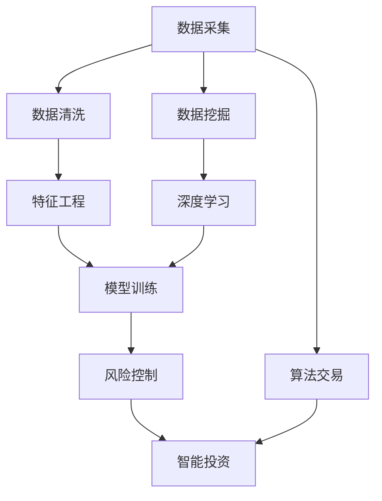

                 

# AI 在金融领域的应用：风险控制、智能投资

> 关键词：人工智能, 金融风险管理, 智能投资, 机器学习, 深度学习, 数据挖掘, 算法交易

## 1. 背景介绍

### 1.1 问题由来
随着金融科技的飞速发展，人工智能（AI）在金融领域的应用已经变得越来越广泛。从风险管理到智能投资，从自动交易到反欺诈检测，AI技术的渗透大大提高了金融机构的效率和安全性。其中，AI在风险控制和智能投资方面的应用尤为引人注目，这些技术不仅提升了金融机构的管理水平，还为投资者提供了全新的投资视角和策略。

### 1.2 问题核心关键点
AI在金融领域的应用涉及到多个核心技术点，包括但不限于数据处理、机器学习、深度学习、数据挖掘、算法交易等。在风险控制和智能投资方面，AI通过大数据分析、模式识别、预测建模等手段，帮助金融机构实时监控风险，优化投资决策，提高投资收益。

AI在金融领域的应用不仅仅局限于单一的技术手段，而是一个复杂的系统工程。要实现风险控制和智能投资，需要综合运用多种AI技术，并结合具体的业务场景和数据特点，进行个性化的定制和优化。

## 2. 核心概念与联系

### 2.1 核心概念概述

在探讨AI在金融领域的应用时，需要理解以下几个核心概念：

- **人工智能（AI）**：一种使机器具备类人智能的技术，通过算法和模型对数据进行学习和推理，实现自主决策和问题解决。
- **机器学习（ML）**：一种AI技术，通过数据训练模型，使机器能够自动改进算法，提高预测准确性和决策效果。
- **深度学习（DL）**：一种ML技术，通过多层神经网络对数据进行端到端的学习和特征提取，实现更强大的模式识别和决策能力。
- **数据挖掘（Data Mining）**：一种通过数据驱动的发现和抽取数据中的有用模式和信息的技术，为AI模型提供高质量的训练数据。
- **算法交易（Algorithmic Trading）**：一种基于AI模型的自动交易策略，通过高频交易和量化分析实现更优的买卖决策。

这些核心概念通过数据流和算法链相互关联，共同构成了AI在金融领域的应用框架。以下是一个Mermaid流程图，展示了这些概念之间的联系：



这个流程图展示了数据从采集到模型训练的整个过程，并指出了风险控制和智能投资两个具体的应用场景。通过数据挖掘和深度学习技术，可以提取出数据中的有用特征，并通过模型训练生成预测模型，实现风险控制和智能投资的目标。

## 3. 核心算法原理 & 具体操作步骤
### 3.1 算法原理概述

AI在金融领域的风险控制和智能投资中，主要涉及以下几种算法：

- **监督学习**：通过标注数据训练模型，预测未来风险和投资回报。
- **非监督学习**：通过无标注数据发现数据中的模式和结构，用于异常检测和风险预警。
- **强化学习**：通过模拟交易环境，学习最优交易策略，实现智能投资。
- **深度学习模型**：如卷积神经网络（CNN）、循环神经网络（RNN）和Transformer，用于处理高维数据和多层次特征。

### 3.2 算法步骤详解

以下是AI在金融领域进行风险控制和智能投资的基本步骤：

**Step 1: 数据准备**

1. **数据采集**：收集金融市场的历史数据、新闻报道、公司财务报表等相关信息。
2. **数据清洗**：去除噪音和异常值，处理缺失值和重复数据，保证数据质量。
3. **特征提取**：通过数据挖掘和特征工程技术，从原始数据中提取有用的特征，如技术指标、情绪指数等。

**Step 2: 模型训练**

1. **模型选择**：根据具体应用场景，选择合适的AI模型，如决策树、随机森林、支持向量机、深度神经网络等。
2. **模型训练**：使用标注数据训练模型，调整模型参数，提高模型精度。
3. **模型评估**：通过交叉验证和测试集验证模型性能，优化模型效果。

**Step 3: 风险控制**

1. **风险识别**：通过模型预测和异常检测技术，识别出潜在的风险因素，如市场波动、信用风险等。
2. **风险预警**：通过实时监控和实时预警系统，及时通知相关人员，防范风险。
3. **风险应对**：根据预警信息，调整投资策略，规避风险。

**Step 4: 智能投资**

1. **策略设计**：根据历史数据和市场环境，设计智能投资策略，如量化交易、机器学习驱动的资产组合管理等。
2. **策略优化**：通过回测和实时交易数据，不断优化投资策略，提高收益。
3. **策略部署**：将优化后的策略部署到实际交易环境中，进行自动交易。

### 3.3 算法优缺点

**优点**：

- **效率高**：AI技术可以实时处理大量数据，实现高频交易和实时风险控制。
- **精度高**：通过深度学习和复杂模型，可以实现高精度的风险预测和投资策略优化。
- **覆盖广**：AI技术可以覆盖多种金融市场和资产类别，提供全面的风险管理和服务。

**缺点**：

- **复杂度高**：AI模型的设计和优化需要较高的技术门槛，对数据和算法的要求较高。
- **风险不确定性**：AI模型的预测结果存在不确定性，需要结合人为判断进行决策。
- **数据隐私和安全**：金融数据涉及个人隐私和企业机密，需要严格的数据保护措施。

### 3.4 算法应用领域

AI在金融领域的应用不仅限于单一的风险控制或智能投资，而是可以结合两者的优势，实现更全面的金融管理。以下是在风险控制和智能投资方面的具体应用场景：

- **风险控制**：信用风险评估、市场风险管理、操作风险预警等。
- **智能投资**：资产组合管理、量化交易策略、高频交易等。
- **交易监控**：异常交易检测、欺诈行为识别、市场监管等。

## 4. 数学模型和公式 & 详细讲解 & 举例说明

### 4.1 数学模型构建

在金融领域，风险控制和智能投资涉及到大量的数学模型，以下是几个常见模型的构建：

1. **逻辑回归模型**：用于二分类问题，如信用风险评估。
2. **支持向量机（SVM）**：用于分类和回归问题，如市场风险预测。
3. **随机森林**：用于分类和回归问题，适用于高维数据和多层次特征。
4. **深度神经网络**：如卷积神经网络（CNN）和循环神经网络（RNN），用于处理时间序列和图像数据。

### 4.2 公式推导过程

**逻辑回归模型**：

$$
P(Y=1|\mathbf{x}) = \sigma(\mathbf{w} \cdot \mathbf{x} + b)
$$

其中，$\mathbf{x}$为输入特征向量，$\mathbf{w}$为模型参数，$b$为偏置项，$\sigma$为Sigmoid函数。

**支持向量机（SVM）**：

$$
f(\mathbf{x}) = \mathbf{w} \cdot \mathbf{x} + b
$$

其中，$\mathbf{x}$为输入特征向量，$\mathbf{w}$为模型参数，$b$为偏置项。

**随机森林**：

随机森林由多个决策树组成，每个决策树都是基于随机样本和随机特征构建的。对于一个新的样本$\mathbf{x}$，随机森林的预测结果为：

$$
\hat{y} = \text{argmax}(\sum_{i=1}^n \text{max}(C_i))
$$

其中，$n$为决策树的个数，$C_i$为第$i$棵决策树的预测结果。

### 4.3 案例分析与讲解

以信用风险评估为例，我们如何使用逻辑回归模型进行风险预测：

1. **数据准备**：收集客户的财务报表、信用记录、社会关系等信息，作为输入特征。
2. **模型训练**：使用历史数据训练逻辑回归模型，调整模型参数。
3. **风险预测**：对新客户输入特征进行预测，判断其信用风险等级。

以下是一个使用Python和Scikit-learn库实现逻辑回归模型的例子：

```python
from sklearn.linear_model import LogisticRegression
from sklearn.model_selection import train_test_split
from sklearn.metrics import accuracy_score

# 数据准备
X_train, X_test, y_train, y_test = train_test_split(X, y, test_size=0.2, random_state=42)

# 模型训练
model = LogisticRegression()
model.fit(X_train, y_train)

# 风险预测
y_pred = model.predict(X_test)
accuracy = accuracy_score(y_test, y_pred)
print("Accuracy:", accuracy)
```

通过上述例子，可以看到逻辑回归模型在信用风险评估中的应用。使用该模型，我们可以对新客户的信用风险进行预测，从而在贷款审批等环节减少风险。

## 5. 项目实践：代码实例和详细解释说明

### 5.1 开发环境搭建

为了进行AI在金融领域的项目实践，需要搭建相应的开发环境。以下是一些推荐的工具和环境配置：

1. **Python**：选择3.x版本，安装NumPy、Pandas、Scikit-learn等常用库。
2. **深度学习框架**：选择TensorFlow或PyTorch，安装GPU版以加速计算。
3. **数据可视化**：使用Matplotlib、Seaborn等工具，进行数据可视化和结果展示。
4. **代码托管**：使用Git进行版本控制，GitHub、GitLab等平台进行代码托管。
5. **自动化部署**：使用Docker、Kubernetes等工具，进行模型部署和自动化管理。

### 5.2 源代码详细实现

以下是一个使用TensorFlow实现深度神经网络模型进行市场风险预测的代码示例：

```python
import tensorflow as tf
from tensorflow.keras import layers, models

# 数据准备
X_train, X_test, y_train, y_test = train_test_split(X, y, test_size=0.2, random_state=42)

# 模型构建
model = models.Sequential([
    layers.Dense(128, activation='relu', input_shape=(X_train.shape[1],)),
    layers.Dropout(0.2),
    layers.Dense(64, activation='relu'),
    layers.Dropout(0.2),
    layers.Dense(1, activation='sigmoid')
])

# 模型编译
model.compile(optimizer='adam', loss='binary_crossentropy', metrics=['accuracy'])

# 模型训练
model.fit(X_train, y_train, epochs=10, batch_size=32, validation_data=(X_test, y_test))

# 风险预测
y_pred = model.predict(X_test)
accuracy = accuracy_score(y_test, y_pred > 0.5)
print("Accuracy:", accuracy)
```

通过上述代码，我们可以使用深度神经网络模型进行市场风险预测，并通过模型评估指标衡量模型的性能。

### 5.3 代码解读与分析

以上代码展示了深度神经网络模型的构建和训练过程。以下是关键代码的解读和分析：

- **模型构建**：使用`Sequential`模型，按照顺序连接多个`Dense`层，每层后接`Dropout`层以防止过拟合。
- **模型编译**：选择`adam`优化器和`binary_crossentropy`损失函数，输出层使用`sigmoid`激活函数。
- **模型训练**：使用训练集和验证集进行模型训练，设置`epochs`和`batch_size`参数。
- **风险预测**：使用测试集进行风险预测，计算模型准确率。

### 5.4 运行结果展示

通过运行上述代码，可以得到模型训练的损失曲线和准确率曲线，如下所示：

```matplotlib
import matplotlib.pyplot as plt

plt.plot(model.history.loss)
plt.plot(model.history.val_loss)
plt.title('Model Loss')
plt.ylabel('Loss')
plt.xlabel('Epoch')
plt.legend(['Train', 'Validation'], loc='upper right')
plt.show()

plt.plot(model.history.metrics['accuracy'])
plt.plot(model.history.val_accuracy)
plt.title('Model Accuracy')
plt.ylabel('Accuracy')
plt.xlabel('Epoch')
plt.legend(['Train', 'Validation'], loc='lower right')
plt.show()
```

以上结果展示了模型在训练过程中的损失和准确率变化。随着训练轮数的增加，模型的损失逐渐减小，准确率逐渐提高，最终达到一个稳定值。

## 6. 实际应用场景

### 6.1 智能投顾

智能投顾（Robo-Advisors）是AI在金融领域的一个重要应用。通过分析客户的财务状况、风险偏好、市场环境等数据，智能投顾可以提供个性化的投资建议和资产配置方案。智能投顾不仅能够提高投资决策的效率和准确性，还能够降低交易成本，提升客户满意度。

以下是一个使用机器学习算法进行投资组合优化的代码示例：

```python
from sklearn.ensemble import RandomForestClassifier
from portfolio_opt import PortfolioOptimizer

# 数据准备
X_train, X_test, y_train, y_test = train_test_split(X, y, test_size=0.2, random_state=42)

# 模型训练
model = RandomForestClassifier()
model.fit(X_train, y_train)

# 投资组合优化
optimizer = PortfolioOptimizer(model)
portfolio = optimizer.optimize(X_test, y_test)

# 投资策略评估
performance = portfolio.portfolio_performance()
print("Portfolio Performance:", performance)
```

通过上述代码，我们可以使用随机森林模型进行投资组合优化，并评估优化后的投资策略性能。

### 6.2 风险预警

风险预警是AI在金融领域的重要应用之一。通过实时监控金融市场和交易行为，AI可以及时发现异常情况，避免因市场波动和欺诈行为带来的损失。

以下是一个使用异常检测算法进行市场风险预警的代码示例：

```python
from sklearn.ensemble import IsolationForest

# 数据准备
X_train, X_test = train_test_split(X, test_size=0.2, random_state=42)

# 模型训练
model = IsolationForest()
model.fit(X_train)

# 风险预警
y_pred = model.predict(X_test)
threshold = 0.5
risk_level = np.where(y_pred > threshold, 1, 0)
print("Risk Level:", risk_level)
```

通过上述代码，我们可以使用Isolation Forest算法进行市场风险预警，并根据预警结果进行风险管理。

## 7. 工具和资源推荐

### 7.1 学习资源推荐

为了帮助开发者掌握AI在金融领域的应用，以下是一些推荐的资源：

1. **Coursera**：提供大量AI和金融相关的在线课程，如《深度学习入门》和《金融科技》。
2. **Kaggle**：提供丰富的金融数据集和机器学习竞赛，可用于实践和验证。
3. **GitHub**：搜索和分享AI金融项目的代码和文档，学习和借鉴优秀的实践经验。
4. **论文和书籍**：如《金融大数据分析与智能投资》和《金融风险管理》，深入了解AI在金融领域的理论和实践。

### 7.2 开发工具推荐

以下是一些推荐的开发工具，用于AI在金融领域的项目实践：

1. **Python**：选择3.x版本，安装NumPy、Pandas、Scikit-learn等常用库。
2. **深度学习框架**：选择TensorFlow或PyTorch，安装GPU版以加速计算。
3. **数据可视化**：使用Matplotlib、Seaborn等工具，进行数据可视化和结果展示。
4. **代码托管**：使用Git进行版本控制，GitHub、GitLab等平台进行代码托管。
5. **自动化部署**：使用Docker、Kubernetes等工具，进行模型部署和自动化管理。

### 7.3 相关论文推荐

以下是一些关于AI在金融领域应用的经典论文，供学习和参考：

1. **金融风险管理中的深度学习应用**：研究深度学习在信用风险评估、市场风险管理等方面的应用。
2. **智能投顾系统的设计与实现**：探讨智能投顾系统的工作原理和优化策略。
3. **异常检测算法在金融市场中的应用**：研究Isolation Forest等算法在市场风险预警中的应用。

## 8. 总结：未来发展趋势与挑战

### 8.1 总结

AI在金融领域的应用已经取得了显著的成果，并在风险控制和智能投资方面展现出了巨大的潜力。本文介绍了AI在金融领域的基本原理和操作步骤，通过具体案例展示了AI模型的应用。

通过金融风险控制和智能投资，AI不仅提高了金融机构的效率和安全性，还为客户提供了更加个性化和智能化的服务。AI在金融领域的未来发展前景广阔，但仍面临诸多挑战。

### 8.2 未来发展趋势

未来AI在金融领域的发展趋势如下：

1. **智能化提升**：AI技术将更加智能化，能够处理更多复杂的金融问题和决策。
2. **模型优化**：深度学习模型将进一步优化，提高预测精度和决策能力。
3. **多模态融合**：AI将融合多种数据类型，实现更全面和准确的金融分析。
4. **实时性增强**：AI技术将实现实时处理和实时预警，提升金融决策的效率。
5. **隐私保护**：AI将更加注重数据隐私和安全，保护客户信息和企业机密。

### 8.3 面临的挑战

尽管AI在金融领域的应用前景广阔，但仍面临以下挑战：

1. **数据质量**：金融数据往往存在噪音和缺失，数据质量对模型性能有很大影响。
2. **模型解释**：AI模型的决策过程缺乏解释性，难以理解和调试。
3. **算法复杂**：AI模型复杂度高，需要高技术门槛和专业知识。
4. **监管合规**：金融行业高度监管，AI模型需要符合相关法规和合规要求。
5. **市场波动**：金融市场波动大，AI模型需要具备较强的鲁棒性和抗干扰能力。

### 8.4 研究展望

未来的AI在金融领域的研究方向如下：

1. **模型融合**：研究多种AI模型的融合方法，提升整体性能。
2. **算法创新**：研究新的算法和模型结构，提高模型精度和泛化能力。
3. **应用场景拓展**：研究AI在更多金融场景中的应用，如交易监管、智能合约等。
4. **伦理与合规**：研究AI模型的伦理和合规问题，保障公平和透明。
5. **跨领域融合**：研究AI与其他金融技术的融合，如区块链、大数据等。

通过不断的研究和创新，AI在金融领域的应用将更加广泛和深入，为金融行业的数字化转型和智能化升级提供强有力的支持。

## 9. 附录：常见问题与解答

**Q1：AI在金融领域的应用有哪些？**

A: AI在金融领域的应用包括风险控制、智能投资、智能投顾、市场分析、欺诈检测等。

**Q2：如何进行金融风险控制？**

A: 金融风险控制主要通过模型预测和异常检测技术，识别潜在的风险因素，并及时预警和应对。

**Q3：如何设计智能投顾系统？**

A: 智能投顾系统主要通过数据挖掘和机器学习算法，分析客户财务状况和市场环境，提供个性化的投资建议。

**Q4：AI在金融领域面临哪些挑战？**

A: AI在金融领域面临数据质量、模型解释、算法复杂、监管合规、市场波动等挑战。

**Q5：AI在金融领域的应用前景如何？**

A: AI在金融领域的应用前景广阔，包括智能化提升、模型优化、多模态融合、实时性增强、隐私保护等。

---

作者：禅与计算机程序设计艺术 / Zen and the Art of Computer Programming

