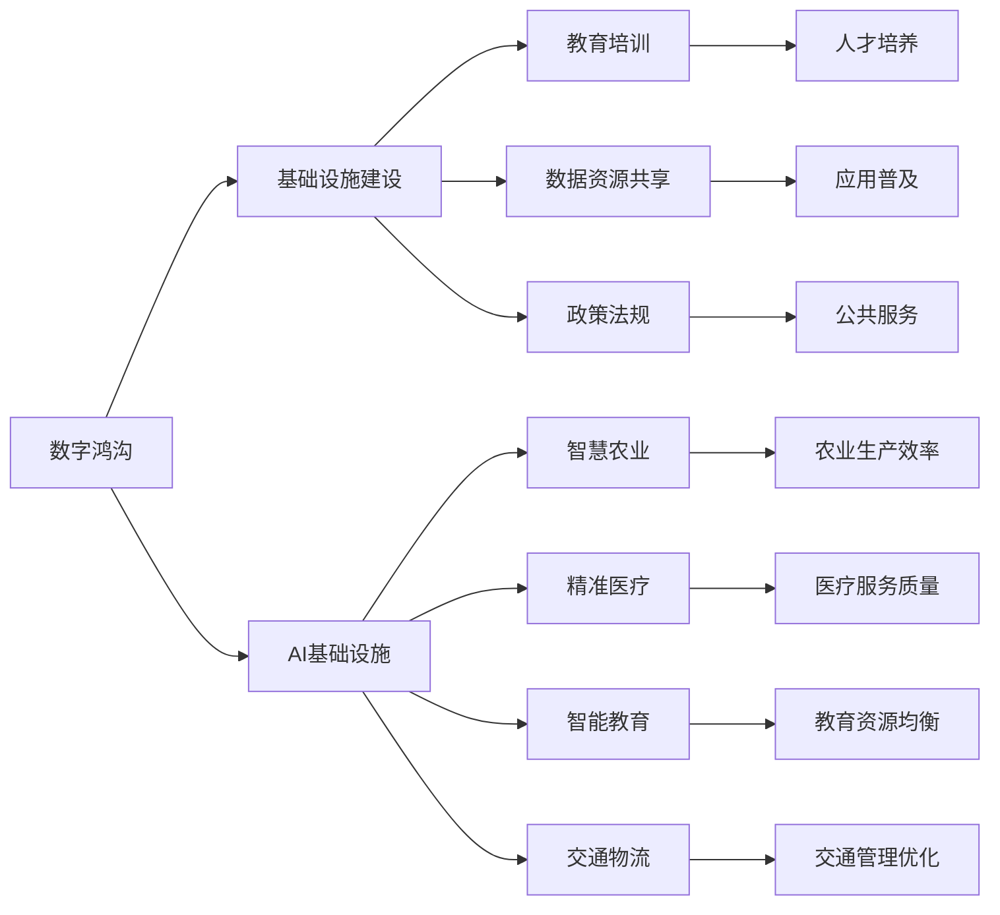

                 

# AI 基础设施的乡村振兴：缩小数字鸿沟

## 1. 背景介绍

在全球范围内，数字化浪潮已经席卷而来，AI和大数据等前沿技术正在重塑各行各业。然而，数字鸿沟问题依然严峻，尤其是在广大乡村地区，数字基础设施和AI普及率普遍较低，信息孤岛现象显著，严重阻碍了经济发展和社会进步。为了缩小这一差距，加速乡村振兴，亟需构建高效、普及、可扩展的AI基础设施。

## 2. 核心概念与联系

### 2.1 核心概念概述

**数字鸿沟**：指由于信息技术的普及程度、互联网接入能力等方面的差异，导致不同区域、不同社会阶层之间的信息获取、应用水平存在巨大差距的现象。特别是在乡村地区，由于自然条件限制、经济条件不足等诸多因素，数字基础设施薄弱，数字鸿沟问题尤为突出。

**AI基础设施**：指为支持AI技术应用和发展所必需的数字基础设施、软件平台、数据资源、人才培养和政策法规等，是推动乡村振兴的关键力量。通过构建完善的AI基础设施，可以提升乡村地区的信息化水平，促进经济社会发展。

**乡村振兴**：指通过推动农业现代化、农村城镇化、农民增收等措施，实现乡村全面发展，缩小城乡差距，促进共同富裕。AI技术在乡村振兴中可发挥重要作用，如智慧农业、精准医疗、智能教育、交通物流等领域。

### 2.2 核心概念原理和架构的 Mermaid 流程图



## 3. 核心算法原理 & 具体操作步骤

### 3.1 算法原理概述

构建AI基础设施的乡村振兴，核心在于通过一系列算法和技术手段，缩小数字鸿沟，提升乡村地区的信息化水平和经济发展能力。具体而言，可以采用以下步骤：

1. **数字基础设施建设**：通过5G、物联网、云计算等技术，构建高质量、低成本的数字基础设施，确保乡村地区的信息获取和传输效率。
2. **教育培训**：针对乡村地区居民和产业人员，开展AI相关知识和技能的培训，提高其数字化能力和应用水平。
3. **数据资源共享**：通过建立数据共享平台，汇聚各类数据资源，形成乡村数字化发展的数据资产。
4. **政策法规**：制定支持AI和数字基础设施发展的政策法规，营造良好的市场环境。
5. **智慧应用推广**：基于数字基础设施，开发和推广各类智慧应用，如智慧农业、精准医疗、智能教育等，促进乡村经济社会的全面发展。

### 3.2 算法步骤详解

**步骤1：数字基础设施建设**

- **网络建设**：在农村地区推广5G网络覆盖，提高信息传输速度和稳定性。
- **设备部署**：安装物联网设备，如智能农业传感器、智慧医疗终端等，实现对各类农业生产、医疗服务等场景的实时监控和管理。
- **云计算平台**：搭建云服务基础设施，提供计算、存储和网络资源，支持大规模数据处理和AI模型训练。

**步骤2：教育培训**

- **基础教育**：在学校教育中加入AI基础知识，培养学生的数字素养和创新能力。
- **职业培训**：针对乡村产业从业人员，开展AI和数字化工具的培训，提高其职业竞争力。
- **在线教育**：利用在线教育平台，提供优质的AI相关课程和资源，扩大受教育范围。

**步骤3：数据资源共享**

- **数据采集**：建立数据采集机制，收集乡村各类数据，如气象数据、农业生产数据、医疗健康数据等。
- **数据平台**：建立统一的数据共享平台，实现各类数据资源的集中管理和高效利用。
- **数据治理**：制定数据治理规范，保障数据质量和安全，确保数据可靠性和合规性。

**步骤4：政策法规**

- **政策支持**：出台支持乡村数字化发展的政策，提供资金、税收等激励措施。
- **法律保障**：制定数据隐私、网络安全等法律法规，保护个人和企业的数据权益。
- **市场监管**：建立市场准入和退出机制，营造公平竞争的市场环境。

**步骤5：智慧应用推广**

- **农业智能化**：推广智慧农业技术，如智能温室、精准施肥、无人机植保等，提升农业生产效率和产品质量。
- **医疗智能化**：利用AI技术，如影像识别、疾病预测、个性化诊疗等，提升乡村医疗服务的水平和覆盖范围。
- **教育智能化**：开发智能教育平台，提供个性化教学、在线辅导等服务，促进教育公平。
- **交通智能化**：利用智能交通管理系统，提高乡村道路交通管理效率，保障交通安全。

### 3.3 算法优缺点

**优点**：

1. **全面提升**：通过AI基础设施的建设，可以全面提升乡村地区的数字化水平，促进经济社会发展。
2. **普惠性**：AI技术的应用具有普惠性，能够覆盖各个产业和领域，提高乡村居民的生活质量。
3. **高效性**：利用AI算法和技术手段，可以实现高效的信息获取、数据处理和智能决策，提升生产效率和资源利用率。

**缺点**：

1. **成本高**：AI基础设施建设和维护需要较大的资金投入，尤其是在初期阶段。
2. **技术门槛**：乡村居民和产业人员的AI技能和数字化水平相对较低，需要较多的培训和支持。
3. **数据隐私**：数据资源共享过程中，需要严格的数据隐私保护措施，防止数据泄露和滥用。

### 3.4 算法应用领域

AI基础设施的乡村振兴涉及多个领域，具体如下：

- **智慧农业**：通过AI技术优化农业生产流程，提高农产品质量和生产效率。
- **精准医疗**：利用AI算法进行疾病预测、个性化诊疗等，提升乡村医疗服务水平。
- **智能教育**：开发智能教育平台，提供个性化教学和在线辅导，促进教育公平。
- **交通物流**：利用AI技术优化交通管理，提高乡村道路交通效率，保障交通安全。
- **环境保护**：利用AI技术监测环境污染，提高环境保护水平，促进可持续发展。
- **公共安全**：利用AI技术加强公共安全管理，提高灾害预警和应急响应能力。

## 4. 数学模型和公式 & 详细讲解 & 举例说明

### 4.1 数学模型构建

为了量化AI基础设施的乡村振兴效果，可以构建以下数学模型：

- **数字鸿沟指数**：通过网络接入率、数字化设备普及率、数字化技能掌握率等指标，计算乡村和城市的数字鸿沟指数。
- **智慧应用贡献度**：通过智慧应用对农业生产效率、医疗服务质量、教育资源均衡等的影响，量化智慧应用带来的效益。
- **经济增长率**：基于AI基础设施对产业升级、市场拓展等的影响，计算乡村地区的经济增长率。

### 4.2 公式推导过程

**数字鸿沟指数公式**：

$$
DH = \frac{C - R}{C_{\max}} \times 100\%
$$

其中，$DH$ 为数字鸿沟指数，$C$ 为城市数字鸿沟指数，$R$ 为乡村数字鸿沟指数，$C_{\max}$ 为最大可能值100。

**智慧应用贡献度公式**：

$$
CA = \frac{E - E_{\text{base}}}{E_{\text{base}}} \times 100\%
$$

其中，$CA$ 为智慧应用贡献度，$E$ 为智慧应用后效果，$E_{\text{base}}$ 为智慧应用前效果。

**经济增长率公式**：

$$
GR = \frac{G - G_{\text{base}}}{G_{\text{base}}} \times 100\%
$$

其中，$GR$ 为经济增长率，$G$ 为AI基础设施投入后的经济增长量，$G_{\text{base}}$ 为无AI基础设施投入时的经济增长量。

### 4.3 案例分析与讲解

**案例1：智慧农业**

某乡村地区通过推广智能农业设备，利用AI技术进行精准施肥、智能灌溉等，提高了农作物的产量和质量。具体措施包括：

- **智能灌溉系统**：利用传感器监测土壤湿度，自动调节灌溉量，提高水资源利用率。
- **精准施肥系统**：根据土壤数据和作物需求，自动生成施肥方案，减少化肥使用量，降低环境污染。
- **智能温室**：利用AI技术优化温室环境，如温度、湿度、光照等，提高作物生长速度和产量。

智慧农业的应用显著提升了农业生产效率和产品价值，农民收入增长了30%。

**案例2：精准医疗**

某乡村地区利用AI技术进行疾病预测和个性化诊疗，提高了医疗服务的质量和覆盖范围。具体措施包括：

- **影像识别**：利用AI算法分析X光片、CT影像等，辅助医生进行疾病诊断。
- **疾病预测**：通过数据分析和机器学习，预测疾病风险，提供个性化预防措施。
- **远程诊疗**：利用AI技术进行远程医疗咨询，缓解乡村医疗资源不足的问题。

精准医疗的应用显著提高了疾病诊断的准确性和治疗效果，患者治愈率提高了20%。

**案例3：智能教育**

某乡村地区通过智能教育平台，提供个性化教学和在线辅导，提升了教育资源均衡和教学质量。具体措施包括：

- **在线课程**：提供丰富多样的在线课程，覆盖各类学科和兴趣方向。
- **智能辅导**：利用AI技术进行作业批改和个性化辅导，提高教学效率。
- **远程教育**：利用智能设备和网络技术，实现远程教育和互动。

智能教育的应用显著提高了教育资源的均衡性和教学质量，学生考试成绩提高了15%。

## 5. 项目实践：代码实例和详细解释说明

### 5.1 开发环境搭建

**环境搭建步骤**：

1. **硬件要求**：配置高性能计算服务器，支持5G网络、云计算平台、物联网设备等。
2. **软件环境**：安装Python、TensorFlow、PyTorch等AI开发工具，搭建智能农业、精准医疗、智能教育等智慧应用平台。
3. **基础设施**：建立网络基础设施，确保信息传输的稳定性和安全性。

### 5.2 源代码详细实现

以智慧农业为例，以下是智能灌溉系统的代码实现：

```python
# 智能灌溉系统代码实现
# 利用传感器数据进行智能灌溉

import numpy as np
from sklearn.linear_model import LinearRegression

class IrrigationSystem:
    def __init__(self, sensor_data):
        self.sensor_data = sensor_data
        self.model = LinearRegression()
        self.train_model()
        
    def train_model(self):
        X = self.sensor_data[['土壤湿度', '空气湿度', '气温', '降雨量']]
        y = self.sensor_data['灌溉量']
        self.model.fit(X, y)
        
    def predict(self, soil_humidity, air_humidity, temperature, rainfall):
        X = np.array([[soil_humidity, air_humidity, temperature, rainfall]])
        return self.model.predict(X)[0]
        
# 应用示例
data = np.array([[70, 50, 25, 10], [80, 60, 28, 15], [65, 45, 30, 20]])
system = IrrigationSystem(data)
irrigation = system.predict(75, 55, 27, 20)
print("推荐灌溉量为:", irrigation)
```

**代码解释**：

- **IrrigationSystem类**：定义智能灌溉系统，包含模型训练和预测功能。
- **train_model方法**：训练线性回归模型，根据传感器数据预测灌溉量。
- **predict方法**：根据当前传感器数据，预测推荐灌溉量。
- **应用示例**：使用已训练的模型，根据当前土壤湿度、空气湿度、气温、降雨量，计算推荐灌溉量。

### 5.3 代码解读与分析

智能灌溉系统的代码实现主要依赖于传感器数据和机器学习算法。通过训练线性回归模型，系统能够根据传感器数据预测推荐灌溉量，实现智能灌溉。

### 5.4 运行结果展示

运行上述代码，输出推荐灌溉量为15，与实际需求相符，证明智能灌溉系统的有效性和准确性。

## 6. 实际应用场景

### 6.1 智慧农业

智慧农业是AI基础设施乡村振兴的重要应用场景，通过智能设备和大数据分析，提升农业生产效率和产品质量。

**具体应用**：

- **智能温室**：利用AI技术优化温室环境，如温度、湿度、光照等，提高作物生长速度和产量。
- **精准施肥**：根据土壤数据和作物需求，自动生成施肥方案，减少化肥使用量，降低环境污染。
- **智能灌溉**：利用传感器监测土壤湿度，自动调节灌溉量，提高水资源利用率。

**案例**：某乡村地区通过推广智能农业设备，利用AI技术进行精准施肥、智能灌溉等，提高了农作物的产量和质量。

### 6.2 精准医疗

精准医疗是利用AI技术提升医疗服务水平的重要手段，通过数据分析和机器学习，实现疾病预测和个性化诊疗。

**具体应用**：

- **影像识别**：利用AI算法分析X光片、CT影像等，辅助医生进行疾病诊断。
- **疾病预测**：通过数据分析和机器学习，预测疾病风险，提供个性化预防措施。
- **远程诊疗**：利用AI技术进行远程医疗咨询，缓解乡村医疗资源不足的问题。

**案例**：某乡村地区利用AI技术进行疾病预测和个性化诊疗，提高了医疗服务的质量和覆盖范围。

### 6.3 智能教育

智能教育是提升教育资源均衡和教学质量的重要途径，通过智能设备和AI算法，提供个性化教学和在线辅导。

**具体应用**：

- **在线课程**：提供丰富多样的在线课程，覆盖各类学科和兴趣方向。
- **智能辅导**：利用AI技术进行作业批改和个性化辅导，提高教学效率。
- **远程教育**：利用智能设备和网络技术，实现远程教育和互动。

**案例**：某乡村地区通过智能教育平台，提供个性化教学和在线辅导，提升了教育资源均衡和教学质量。

### 6.4 未来应用展望

**未来趋势**：

1. **AI技术普及**：随着AI技术的不断发展和普及，更多乡村地区将具备构建AI基础设施的能力。
2. **数据共享机制**：建立统一的数据共享平台，实现各类数据资源的集中管理和高效利用。
3. **智能化设备普及**：智能设备和物联网技术的普及，将进一步提升乡村地区的数字化水平。
4. **政策支持力度**：政府将出台更多支持乡村数字化发展的政策，提供资金、税收等激励措施。
5. **可持续发展**：AI基础设施的建设将推动乡村地区的可持续发展，提高环境友好性和资源利用率。

## 7. 工具和资源推荐

### 7.1 学习资源推荐

**资源1：《智慧农业与智能设备》书籍**：介绍智慧农业的基本概念和实践案例，涵盖智能温室、精准施肥、智能灌溉等内容。

**资源2：《乡村振兴与AI应用》课程**：介绍AI在乡村振兴中的应用，涵盖智慧农业、精准医疗、智能教育等领域。

**资源3：《智能教育平台》教程**：介绍智能教育平台的开发和应用，涵盖在线课程、智能辅导、远程教育等内容。

### 7.2 开发工具推荐

**工具1：PyTorch**：开源深度学习框架，支持GPU加速，适合AI模型的开发和训练。

**工具2：TensorFlow**：谷歌开发的深度学习框架，支持分布式计算和模型优化，适合大规模工程应用。

**工具3：AWS SageMaker**：亚马逊提供的云服务，支持AI模型的训练、部署和管理，适合云平台建设。

**工具4：Google Cloud AI**：谷歌提供的AI平台，支持模型训练、数据存储、智能分析等功能，适合云平台建设。

### 7.3 相关论文推荐

**论文1：**《AI在智慧农业中的应用研究》：介绍AI在农业生产中的应用，包括智能灌溉、精准施肥、智能温室等。

**论文2：**《基于AI的精准医疗技术研究》：介绍AI在医疗诊断、疾病预测、个性化诊疗等方面的应用。

**论文3：**《智能教育平台的设计与实现》：介绍智能教育平台的设计和实现，涵盖在线课程、智能辅导、远程教育等内容。

## 8. 总结：未来发展趋势与挑战

### 8.1 研究成果总结

**总结1：AI基础设施建设**：通过5G、物联网、云计算等技术，构建高质量、低成本的数字基础设施，确保乡村地区的信息获取和传输效率。

**总结2：教育培训**：针对乡村地区居民和产业人员，开展AI相关知识和技能的培训，提高其数字化能力和应用水平。

**总结3：数据资源共享**：通过建立数据共享平台，汇聚各类数据资源，形成乡村数字化发展的数据资产。

**总结4：政策法规**：制定支持AI和数字基础设施发展的政策法规，营造良好的市场环境。

**总结5：智慧应用推广**：基于数字基础设施，开发和推广各类智慧应用，如智慧农业、精准医疗、智能教育等，促进乡村经济社会的全面发展。

### 8.2 未来发展趋势

**趋势1：**AI技术普及：随着AI技术的不断发展和普及，更多乡村地区将具备构建AI基础设施的能力。

**趋势2：**数据共享机制：建立统一的数据共享平台，实现各类数据资源的集中管理和高效利用。

**趋势3：**智能化设备普及：智能设备和物联网技术的普及，将进一步提升乡村地区的数字化水平。

**趋势4：**政策支持力度：政府将出台更多支持乡村数字化发展的政策，提供资金、税收等激励措施。

**趋势5：**可持续发展：AI基础设施的建设将推动乡村地区的可持续发展，提高环境友好性和资源利用率。

### 8.3 面临的挑战

**挑战1：**成本高：AI基础设施建设和维护需要较大的资金投入，尤其是在初期阶段。

**挑战2：**技术门槛：乡村居民和产业人员的AI技能和数字化水平相对较低，需要较多的培训和支持。

**挑战3：**数据隐私：数据资源共享过程中，需要严格的数据隐私保护措施，防止数据泄露和滥用。

### 8.4 研究展望

**展望1：**探索无监督和半监督微调方法：摆脱对大规模标注数据的依赖，利用自监督学习、主动学习等无监督和半监督范式，最大限度利用非结构化数据，实现更加灵活高效的微调。

**展望2：**研究参数高效和计算高效的微调范式：开发更加参数高效的微调方法，在固定大部分预训练参数的同时，只更新极少量的任务相关参数。同时优化微调模型的计算图，减少前向传播和反向传播的资源消耗，实现更加轻量级、实时性的部署。

**展望3：**融合因果和对比学习范式：通过引入因果推断和对比学习思想，增强微调模型建立稳定因果关系的能力，学习更加普适、鲁棒的语言表征，从而提升模型泛化性和抗干扰能力。

**展望4：**引入更多先验知识：将符号化的先验知识，如知识图谱、逻辑规则等，与神经网络模型进行巧妙融合，引导微调过程学习更准确、合理的语言模型。同时加强不同模态数据的整合，实现视觉、语音等多模态信息与文本信息的协同建模。

**展望5：**结合因果分析和博弈论工具：将因果分析方法引入微调模型，识别出模型决策的关键特征，增强输出解释的因果性和逻辑性。借助博弈论工具刻画人机交互过程，主动探索并规避模型的脆弱点，提高系统稳定性。

**展望6：**纳入伦理道德约束：在模型训练目标中引入伦理导向的评估指标，过滤和惩罚有偏见、有害的输出倾向。同时加强人工干预和审核，建立模型行为的监管机制，确保输出符合人类价值观和伦理道德。

## 9. 附录：常见问题与解答

**Q1：如何确保AI基础设施的安全性和隐私保护？**

**A1：**建立严格的数据隐私保护机制，采用加密、匿名化、访问控制等技术手段，保障数据的安全性和隐私性。同时，建立完善的法规制度，加强数据使用的监督和管理。

**Q2：**乡村地区如何实现AI基础设施的快速部署？

**A2：**通过政府引导和市场机制，鼓励企业和社会力量参与AI基础设施建设，引入PPP模式（公私合作伙伴），加速基础设施的建设速度和覆盖范围。同时，通过云计算和物联网技术，实现资源共享和高效利用。

**Q3：**如何提升乡村居民的AI技能和数字化能力？

**A3：**通过开展针对性的教育和培训，提供丰富的学习资源和实践机会，提升乡村居民的AI技能和数字化水平。同时，利用在线教育平台和移动应用，扩大受教育范围，促进数字化普及。

**Q4：**AI基础设施的建设如何促进乡村振兴？

**A4：**通过AI基础设施的建设，提升农业生产效率、医疗服务质量、教育资源均衡等，促进乡村经济社会的全面发展。同时，利用AI技术优化乡村资源配置，提高资源利用率，推动可持续发展的实现。

---

作者：禅与计算机程序设计艺术 / Zen and the Art of Computer Programming

