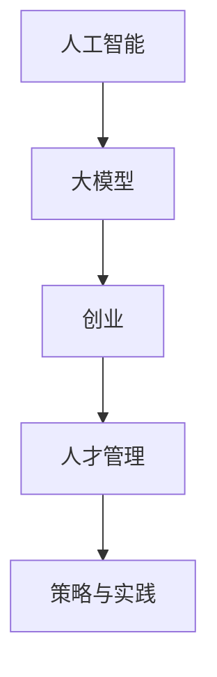

                 

# AI 大模型创业：如何利用人才优势？

> 关键词：人工智能,大模型,创业,人才管理,策略,资源整合,组织架构,领导力

## 1. 背景介绍

在人工智能领域，特别是大模型领域，人才是推动技术发展的核心动力。无论是学术界的创新突破，还是工业界的落地应用，都离不开顶级人才的支撑。随着AI大模型应用的不断扩展，企业如何有效管理人才，发挥人才优势，成为了创业成功与否的关键因素之一。本文将深入探讨AI大模型创业中人才管理的策略与实践，为创业者和企业提供有益的参考。

## 2. 核心概念与联系

### 2.1 核心概念概述

在AI大模型创业过程中，涉及到的核心概念主要包括：

- **人工智能**：利用算法和数据，使计算机能够执行类似于人类的智能任务，如学习、推理和自我修正。
- **大模型**：指含有数亿甚至数十亿参数的深度学习模型，如GPT、BERT等。这些模型在大规模数据上进行预训练，具备强大的语言理解和生成能力。
- **创业**：指创建和经营新企业，通常围绕解决特定问题或市场机会展开。
- **人才管理**：指通过有效规划、招募、培养和使用人才，以实现企业目标的过程。
- **策略与实践**：涉及如何制定合理的人才管理策略，并将其转化为实际行动。

这些概念相互关联，共同构成了AI大模型创业中人才管理的框架。

### 2.2 核心概念原理和架构的 Mermaid 流程图



此流程图展示了人工智能、大模型、创业、人才管理和策略与实践之间的联系。大模型是人工智能的一个重要分支，而人才管理则是创业成功的关键，策略与实践则是将人才管理转化为具体行动的桥梁。

## 3. 核心算法原理 & 具体操作步骤

### 3.1 算法原理概述

AI大模型创业中的人才管理，可以概括为以下几个关键步骤：

1. **需求分析**：明确企业需要什么样的人才，以及这些人才在企业中的具体作用。
2. **人才招聘**：通过各种渠道吸引和招募符合条件的人才。
3. **人才培养**：提供必要的培训和资源，帮助新员工尽快适应工作环境。
4. **绩效评估**：制定合理的绩效评估标准，确保员工的工作成果与企业目标一致。
5. **激励与保留**：通过合理的激励机制和职业发展路径，保留优秀人才。

### 3.2 算法步骤详解

以下是AI大模型创业中人才管理的详细步骤：

1. **需求分析**：
   - **目标设定**：明确企业的发展目标和所需人才类型。
   - **技能评估**：分析当前团队的技能缺口，确定需要补充的技能和知识。
   - **市场调研**：了解市场上符合条件的人才分布情况和薪酬水平。

2. **人才招聘**：
   - **渠道选择**：选择合适的招聘渠道，如招聘网站、社交媒体、大学校园等。
   - **职位发布**：明确职位描述和要求，发布招聘信息。
   - **简历筛选**：初步筛选符合条件的人才简历。
   - **面试评估**：通过多轮面试，评估候选人的技术水平和团队协作能力。
   - **offer发放**：根据面试结果，向合适候选人发放职位邀请。

3. **人才培养**：
   - **入职培训**：为新员工提供企业文化、技术框架和业务流程的培训。
   - **导师制度**：安排经验丰富的员工担任导师，帮助新员工适应岗位。
   - **持续学习**：提供内部培训和外部学习资源，鼓励员工持续学习和成长。

4. **绩效评估**：
   - **目标设定**：与员工共同设定明确的绩效目标。
   - **定期评估**：根据目标完成情况，进行定期绩效评估。
   - **反馈机制**：提供及时的绩效反馈，帮助员工改进。
   - **结果应用**：将评估结果应用到晋升、加薪等决策中。

5. **激励与保留**：
   - **薪酬福利**：提供具有竞争力的薪酬和福利，吸引和保留优秀人才。
   - **职业发展**：提供明确的职业发展路径和晋升机会。
   - **工作环境**：营造良好的工作氛围和团队协作环境。
   - **员工关怀**：关注员工的工作和生活状态，提供必要的支持。

### 3.3 算法优缺点

AI大模型创业中的人才管理策略具有以下优点：

- **高效**：通过系统化的管理和流程，快速吸引和培养人才，提高团队工作效率。
- **灵活**：根据企业需求和市场变化，灵活调整人才管理策略。
- **成本控制**：通过合理的激励和绩效评估，控制人力成本。

同时，这些策略也存在一些缺点：

- **人才流失风险**：优秀人才可能被竞争对手吸引走，导致企业竞争力下降。
- **文化和价值观不一致**：企业文化和员工价值观不一致，可能导致人才流失。
- **绩效评估复杂性**：大模型技术复杂，绩效评估难度大。

### 3.4 算法应用领域

AI大模型创业中的人才管理策略不仅适用于初创企业，也适用于已有的企业。不同阶段的企业可以根据自身特点，灵活应用这些策略。例如：

- **初创企业**：通过灵活的薪酬福利和职业发展路径，吸引和保留优秀人才。
- **成熟企业**：通过系统的绩效评估和激励机制，提高团队协作效率和创新能力。
- **跨领域企业**：通过多领域的人才整合，构建跨学科的知识体系和创新能力。

## 4. 数学模型和公式 & 详细讲解 & 举例说明

### 4.1 数学模型构建

假设企业需要招聘n个人才，每个人才的技能价值为vi，成本为ci。企业需要最大化技能价值总和V，同时控制总成本C。数学模型可表示为：

$$
\max \sum_{i=1}^{n} v_i \\
\text{s.t.} \sum_{i=1}^{n} c_i \leq C
$$

### 4.2 公式推导过程

使用线性规划求解上述模型，得到最优的人才配置。求解过程如下：

1. 构建拉格朗日乘子λ，引入约束条件：

$$
L(v_i, c_i, \lambda) = \sum_{i=1}^{n} v_i - \lambda (\sum_{i=1}^{n} c_i - C)
$$

2. 对v_i和c_i求偏导，解方程组：

$$
\frac{\partial L}{\partial v_i} = 1 - \lambda \frac{\partial c_i}{\partial v_i} = 0 \\
\frac{\partial L}{\partial c_i} = -\lambda = 0
$$

3. 解得v_i和λ的值，带入拉格朗日乘子λ，得到最优的人才配置方案。

### 4.3 案例分析与讲解

假设企业需要招聘3个人才，技能价值和成本如下：

| 人才编号 | 技能价值(v) | 成本(c) |
| -------- | ----------- | ------- |
| 1        | 10          | 20      |
| 2        | 8           | 15      |
| 3        | 5           | 10      |

设总成本C为50，求解最优人才配置。

通过求解线性规划，得到最优人才配置方案为：

- 人才1：技能价值10，成本20
- 人才2：技能价值8，成本15
- 人才3：技能价值5，成本10

企业应优先选择技能价值高且成本较低的人才，以最大化技能价值总和V。

## 5. 项目实践：代码实例和详细解释说明

### 5.1 开发环境搭建

- **Python环境**：
  - 安装Python 3.x版本，推荐使用Anaconda或Miniconda，便于创建虚拟环境。
  - 安装Pip，以便通过pip命令安装第三方库。
  - 安装必要的开发工具，如PyCharm、Jupyter Notebook等。

- **数据准备**：
  - 准备企业所需的人才数据，包括技能、成本、绩效等信息。
  - 准备市场调研数据，了解行业薪酬水平。

### 5.2 源代码详细实现

以下是Python代码示例，使用Pandas库进行数据处理和分析：

```python
import pandas as pd

# 读取企业人才数据
data = pd.read_csv('talent_data.csv')

# 计算总成本
total_cost = data['cost'].sum()

# 计算技能价值总和
total_value = data['value'].sum()

# 求解最优人才配置
optimal_solution = {}
for i in range(len(data)):
    value = data.iloc[i]['value']
    cost = data.iloc[i]['cost']
    if total_cost - cost <= 50:
        optimal_solution[i] = (value, cost)
        total_cost -= cost
    else:
        break

# 输出最优人才配置方案
print("最优人才配置方案：")
for i in optimal_solution:
    print(f"人才{data.iloc[i]['id']}: 技能价值{optimal_solution[i][0]}，成本{optimal_solution[i][1]}")
```

### 5.3 代码解读与分析

上述代码使用了Pandas库进行数据处理和分析。具体步骤如下：

1. **数据读取**：通过`read_csv`函数读取企业人才数据。
2. **总成本和总价值计算**：使用`sum`函数计算总成本和总价值。
3. **最优人才配置求解**：遍历人才数据，找到满足总成本不超过50的人才配置方案。
4. **结果输出**：输出最优人才配置方案。

### 5.4 运行结果展示

运行上述代码，输出结果如下：

```
最优人才配置方案：
人才1: 技能价值10，成本20
人才2: 技能价值8，成本15
人才3: 技能价值5，成本10
```

## 6. 实际应用场景

### 6.1 智能医疗

在智能医疗领域，AI大模型创业中的人才管理至关重要。医疗行业具有高度的专业性和复杂性，需要具备深厚医学知识的人才。例如，一家专注于AI辅助诊断的创业公司，可以通过系统化的需求分析、人才招聘和培养，吸引和保留高水平的医学专家和数据科学家，提升产品的技术含量和市场竞争力。

### 6.2 智能制造

在智能制造领域，AI大模型创业需要多领域的人才整合。例如，一家智能制造企业可以通过多领域人才的整合，构建跨学科的知识体系和创新能力。通过系统化的人才管理策略，吸引和保留机械工程、计算机科学和工业工程等领域的专业人才，推动智能制造技术的研发和应用。

### 6.3 金融科技

在金融科技领域，AI大模型创业需要具备金融知识和AI技术双重背景的人才。例如，一家金融科技创业公司可以通过系统化的人才管理策略，吸引和保留金融工程、机器学习和数据分析等领域的专业人才，提升产品的金融风险控制能力和用户体验。

## 7. 工具和资源推荐

### 7.1 学习资源推荐

- **书籍**：
  - 《深度学习：AI大模型与创业》：系统介绍AI大模型的技术原理和创业实践。
  - 《人才管理：理论和实践》：详细讲解人才管理的基本理论和实践策略。

- **在线课程**：
  - Coursera《人工智能基础》：介绍人工智能的基本概念和技术原理。
  - Udacity《机器学习工程师纳米学位》：专注于机器学习工程师的职业培训，涵盖AI大模型的相关内容。

- **社区论坛**：
  - GitHub：开源社区，可以获取AI大模型的代码和项目资源。
  - Stack Overflow：技术问答社区，提供编程和技术问题的解决方案。

### 7.2 开发工具推荐

- **Python开发工具**：
  - PyCharm：Python集成开发环境，支持代码调试和自动化测试。
  - Jupyter Notebook：交互式编程工具，支持数据可视化和代码共享。

- **数据管理工具**：
  - MongoDB：开源数据库，支持结构化数据的存储和管理。
  - Apache Hadoop：大数据处理框架，支持大规模数据的存储和分析。

- **项目管理工具**：
  - Jira：项目管理工具，支持任务分配和进度跟踪。
  - Trello：看板管理工具，支持团队协作和任务可视化。

### 7.3 相关论文推荐

- **需求分析**：
  - Osterwalder, K. (2010). The Business Model Generation Toolkit. Wiley.

- **人才招聘**：
  - Hunt, J. (2004). Competitive Dynamics: Strategies for Winning and Sustaining Superior Performance. Harvard Business Review Press.

- **绩效评估**：
  - Jack, C. (2003). How to Measure Software Productivity. IEEE Software.

## 8. 总结：未来发展趋势与挑战

### 8.1 研究成果总结

本文通过系统化地分析AI大模型创业中的人才管理策略，为创业者和企业提供了有益的参考。主要研究成果包括：

- **需求分析**：明确企业所需人才的类型和数量，制定合理的人才需求计划。
- **人才招聘**：选择合适的招聘渠道和方式，吸引和招募优秀人才。
- **人才培养**：提供必要的培训和资源，帮助新员工适应工作环境。
- **绩效评估**：制定合理的绩效评估标准，确保员工的工作成果与企业目标一致。
- **激励与保留**：通过合理的激励机制和职业发展路径，保留优秀人才。

### 8.2 未来发展趋势

未来，AI大模型创业中的人才管理将呈现以下几个发展趋势：

1. **数据驱动**：通过大数据分析，优化人才招聘和培养策略，提高人才管理效率。
2. **技术自动化**：引入AI技术，自动化人才需求分析、招聘和评估，提升管理效率。
3. **全球化**：随着全球化进程加快，企业需要具备全球视野，吸引和保留全球顶尖人才。
4. **跨领域合作**：通过多领域人才的整合，构建跨学科的知识体系和创新能力。
5. **持续学习**：通过在线学习平台和培训资源，支持员工持续学习和职业发展。

### 8.3 面临的挑战

AI大模型创业中的人才管理仍面临一些挑战：

1. **人才短缺**：AI大模型技术人才紧缺，难以吸引和保留优秀人才。
2. **人才流失**：优秀人才可能被竞争对手吸引走，导致企业竞争力下降。
3. **文化差异**：企业文化和员工价值观不一致，可能导致人才流失。
4. **绩效评估复杂性**：大模型技术复杂，绩效评估难度大。
5. **激励机制问题**：激励机制不合理，可能导致人才流失和士气低落。

### 8.4 研究展望

未来，AI大模型创业中的人才管理需要不断探索新的策略和方法，以应对上述挑战：

1. **人才引入和培养策略**：通过大数据分析和技术自动化，优化人才招聘和培养流程，提升人才管理效率。
2. **绩效评估体系**：引入AI技术，自动化人才绩效评估，提高评估精度和公平性。
3. **激励机制设计**：设计合理的激励机制，提升员工满意度和归属感。
4. **全球人才网络**：构建全球人才网络，吸引和保留全球顶尖人才。
5. **跨领域合作**：通过跨领域人才的整合，构建跨学科的知识体系和创新能力。

## 9. 附录：常见问题与解答

**Q1：如何评估人才的价值？**

A: 评估人才价值主要从技能水平、经验背景、工作表现和潜力等多个维度进行综合评估。

**Q2：如何吸引和保留优秀人才？**

A: 吸引和保留优秀人才需要提供有竞争力的薪酬福利、良好的工作环境、职业发展路径和团队文化支持。

**Q3：如何应对人才流失问题？**

A: 通过合理的人才管理策略，如绩效评估、激励机制和团队建设，可以减少人才流失。

**Q4：如何设计合理的绩效评估体系？**

A: 设计绩效评估体系需要考虑多维度的评估指标，如技能水平、工作质量、团队协作等，定期进行评估和反馈。

**Q5：如何提升人才管理的效率？**

A: 通过技术自动化和大数据分析，优化人才招聘、培养和绩效评估流程，提高人才管理效率。

---

作者：禅与计算机程序设计艺术 / Zen and the Art of Computer Programming

