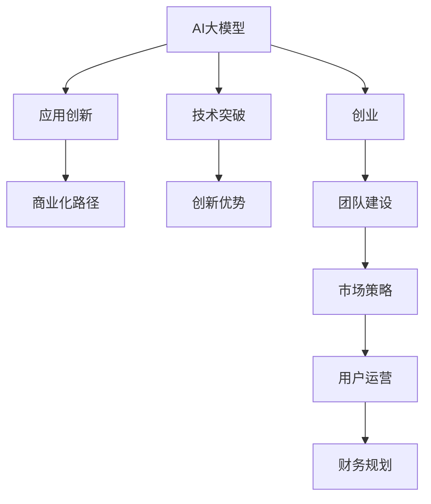

                 

# AI 大模型创业：如何利用创新优势？

> 关键词：AI大模型、创业、创新优势、技术突破、商业化路径

## 1. 背景介绍

### 1.1 问题由来

近年来，随着人工智能(AI)技术的飞速发展，大模型(AI大模型)在自然语言处理(NLP)、计算机视觉(CV)、语音识别(SR)等领域取得了显著进展。这些大模型如GPT-3、BERT、DALL-E等，具备强大的泛化能力和高精度的预测性能，能够处理大量复杂任务，并实现跨领域的应用。

大模型的成功也推动了一波新的创业热潮，从学术界到工业界，越来越多的公司和团队开始尝试基于大模型的技术创新和商业应用。然而，大模型技术的应用门槛高、开发周期长、市场竞争激烈，许多创业公司面临着能否持续创新的问题。

### 1.2 问题核心关键点

大模型创业的核心在于如何通过技术创新和应用创新，克服现有产品的局限性，赢得市场竞争。技术创新包括对大模型本身进行突破，如提升模型精度、加快推理速度、提高模型可解释性等。应用创新则体现在如何将大模型应用到新的场景和领域，提升用户体验、优化业务流程、创造新价值。

大模型创业的成功，需要团队具备扎实的技术基础、敏锐的市场洞察力、强大的资源整合能力，以及不断创新的决心和耐心。

### 1.3 问题研究意义

本文将系统介绍AI大模型创业的方法和策略，帮助创业者充分利用创新优势，加速产品开发和市场推广。通过梳理大模型创业的各个环节，本文将为读者提供全面的指导，从技术实现到市场应用，从资源整合到品牌建设，全方位剖析AI大模型的创业路径。

## 2. 核心概念与联系

### 2.1 核心概念概述

为更好地理解AI大模型创业的方法，本节将介绍几个密切相关的核心概念：

- **AI大模型**：指具有大规模参数量、广泛知识面、强大推理能力的神经网络模型。如GPT-3、BERT等。

- **创业**：指创业者通过创新技术、产品或模式，创造价值，实现商业化的过程。包括技术创新、市场应用、商业模式、团队建设等多个方面。

- **技术突破**：指在原有技术基础上，提出新的算法、模型、架构等创新，提升模型性能、降低成本、提高效率等。

- **应用创新**：指通过洞察市场需求，将技术应用到新的领域或场景，提供差异化的解决方案，创造新价值。

- **商业化路径**：指从技术研发到产品推广，再到市场获取的全过程，包括产品定位、市场策略、用户运营、财务规划等。

- **创新优势**：指利用先进技术、新颖应用、高效模式等，与竞争对手拉开差距，获取市场优势的能力。

这些概念之间的逻辑关系可以通过以下Mermaid流程图来展示：



这个流程图展示了大模型创业的关键环节：

1. 大模型作为技术基础，通过技术突破不断提升能力。
2. 利用技术能力进行应用创新，探索新的应用场景和模式。
3. 通过商业化路径，将技术转化为有竞争力的产品和服务。
4. 借助创新优势，在市场中赢得竞争。

## 3. 核心算法原理 & 具体操作步骤

### 3.1 算法原理概述

大模型创业的核心是技术创新和应用创新。技术创新聚焦于如何通过改进模型架构、优化算法设计，提升模型性能和效率。应用创新则在于如何洞察市场需求，将大模型应用于新的领域或场景，创造独特的用户价值。

### 3.2 算法步骤详解

#### 3.2.1 技术创新步骤

1. **需求分析**：收集市场反馈，了解用户痛点和需求，确定技术创新的方向。

2. **技术调研**：分析现有技术瓶颈和不足，了解最新的技术进展和突破。

3. **技术实现**：基于调研结果，设计新的模型架构、优化算法流程、改进推理引擎等，实现技术突破。

4. **性能评估**：通过实验和测试，评估新算法的性能指标，确保其优于现有技术。

5. **迭代优化**：根据反馈持续改进算法，确保其在实际应用中的高效稳定。

#### 3.2.2 应用创新步骤

1. **市场洞察**：分析目标市场，识别潜在的创新机会，确定应用创新的方向。

2. **需求映射**：将市场洞察转化为具体的用户需求，明确应用的场景和目标。

3. **功能设计**：设计满足用户需求的模型功能，定义算法流程和数据结构。

4. **原型开发**：搭建产品原型，进行初步的用户测试，收集反馈。

5. **功能迭代**：根据用户反馈迭代优化产品功能，确保用户体验。

### 3.3 算法优缺点

**优点**：

- **提升性能**：通过技术创新，能够大幅提升模型的预测精度、推理速度、可解释性等。
- **拓展应用**：应用创新能够将大模型应用到新的领域和场景，创造新的商业模式和用户价值。
- **竞争优势**：创新优势能够帮助创业公司与现有产品拉开差距，赢得市场竞争。

**缺点**：

- **高投入**：技术创新和应用创新往往需要大量的研发投入和时间周期，投入压力大。
- **风险高**：技术突破和应用创新的不确定性高，可能会面临失败的风险。
- **人才难求**：技术突破和应用创新需要多学科的复合人才，难以快速招募和培养。

### 3.4 算法应用领域

AI大模型创业涉及多个领域，包括但不限于：

- **NLP领域**：如文本生成、问答系统、情感分析、机器翻译等。
- **CV领域**：如图像分类、目标检测、人脸识别、3D建模等。
- **SR领域**：如语音识别、语音合成、语音翻译、情感语音生成等。
- **IoT领域**：如智能家居、智能制造、智慧城市等。
- **医疗健康领域**：如影像诊断、病历分析、基因组学等。

## 4. 数学模型和公式 & 详细讲解 & 举例说明

### 4.1 数学模型构建

AI大模型创业的数学模型构建，通常涉及以下几个方面：

1. **模型选择**：选择适合的神经网络模型架构，如卷积神经网络(CNN)、循环神经网络(RNN)、Transformer等。
2. **数据准备**：收集和预处理训练数据，确保数据的质量和多样性。
3. **模型训练**：使用优化算法训练模型，确保模型参数的收敛性。
4. **模型评估**：通过测试集评估模型性能，确保模型的泛化能力。

### 4.2 公式推导过程

以下以图像分类为例，推导CNN模型的训练过程。

**输入数据**：$x \in \mathbb{R}^{H \times W \times C}$，表示图像的高度、宽度和通道数。

**输出标签**：$y \in \{0, 1\}$，表示图像分类的标签。

**模型架构**：包含卷积层、池化层、全连接层等组件。

**损失函数**：通常使用交叉熵损失函数。

**优化算法**：如随机梯度下降(SGD)、Adam等。

训练过程包括前向传播、损失计算、反向传播和参数更新。训练算法如下：

1. **前向传播**：计算模型在输入$x$上的输出$\hat{y}$。
2. **损失计算**：计算预测输出$\hat{y}$和真实标签$y$之间的损失$l$。
3. **反向传播**：计算损失$l$对模型参数$w$的梯度$\nabla_w l$。
4. **参数更新**：使用优化算法更新模型参数$w$，减少损失$l$。

### 4.3 案例分析与讲解

以医疗影像分类为例，介绍如何构建和优化模型。

**需求分析**：医疗影像分类任务需要高精度的图像分类，以辅助医生诊断。

**技术调研**：现有的深度学习模型如CNN在图像分类任务上有较好的表现，但训练时间较长，推理速度较慢。

**技术实现**：引入卷积神经网络(CNN)，设计多尺度卷积、残差连接、Dropout等优化方法，提升模型精度和鲁棒性。

**性能评估**：在医疗影像数据集上进行训练和测试，评估模型在医学图像分类上的精度。

**迭代优化**：根据评估结果，调整模型超参数，进行多次迭代训练，最终得到一个高精度的医疗影像分类模型。

## 5. 项目实践：代码实例和详细解释说明

### 5.1 开发环境搭建

开发环境搭建是AI大模型创业的重要基础。以下是使用Python进行TensorFlow开发的环境配置流程：

1. 安装Anaconda：从官网下载并安装Anaconda，用于创建独立的Python环境。

2. 创建并激活虚拟环境：
```bash
conda create -n tf-env python=3.8
conda activate tf-env
```

3. 安装TensorFlow：根据CUDA版本，从官网获取对应的安装命令。例如：
```bash
conda install tensorflow -c pytorch -c conda-forge
```

4. 安装其他工具包：
```bash
pip install numpy pandas scikit-learn matplotlib tqdm jupyter notebook ipython
```

完成上述步骤后，即可在`tf-env`环境中开始大模型创业的实践。

### 5.2 源代码详细实现

这里我们以医疗影像分类为例，给出使用TensorFlow对卷积神经网络进行训练的PyTorch代码实现。

**数据准备**：
```python
import tensorflow as tf
from tensorflow.keras.datasets import mnist

(train_images, train_labels), (test_images, test_labels) = mnist.load_data()

train_images = train_images.reshape((60000, 28, 28, 1))
train_images = train_images / 255.0

test_images = test_images.reshape((10000, 28, 28, 1))
test_images = test_images / 255.0

train_labels = tf.keras.utils.to_categorical(train_labels, 10)
test_labels = tf.keras.utils.to_categorical(test_labels, 10)
```

**模型构建**：
```python
from tensorflow.keras.models import Sequential
from tensorflow.keras.layers import Conv2D, MaxPooling2D, Flatten, Dense, Dropout

model = Sequential([
    Conv2D(32, (3, 3), activation='relu', input_shape=(28, 28, 1)),
    MaxPooling2D((2, 2)),
    Dropout(0.25),
    Flatten(),
    Dense(128, activation='relu'),
    Dropout(0.5),
    Dense(10, activation='softmax')
])

model.compile(optimizer='adam', loss='categorical_crossentropy', metrics=['accuracy'])
```

**模型训练**：
```python
history = model.fit(train_images, train_labels, epochs=5, batch_size=64, validation_data=(test_images, test_labels))
```

**模型评估**：
```python
test_loss, test_acc = model.evaluate(test_images, test_labels)
print(f'Test accuracy: {test_acc:.2f}')
```

### 5.3 代码解读与分析

让我们再详细解读一下关键代码的实现细节：

**数据准备**：
- 使用TensorFlow自带的MNIST数据集，加载训练集和测试集。
- 将图像数据转换为浮点型，并进行归一化处理。
- 使用`to_categorical`函数将标签转换为one-hot编码。

**模型构建**：
- 定义模型结构，包含卷积层、池化层、全连接层和Dropout层。
- 使用`Sequential`模型将各层依次添加，使用`compile`方法指定优化器、损失函数和评估指标。

**模型训练**：
- 使用`fit`方法训练模型，设置训练轮数和批次大小。
- 使用`history`变量记录训练过程中的损失和准确率变化。

**模型评估**：
- 使用`evaluate`方法在测试集上评估模型性能。

## 6. 实际应用场景

### 6.1 智能医疗诊断

AI大模型在智能医疗诊断中的应用，能够大幅提升医生的诊断效率和准确性。如使用卷积神经网络对医疗影像进行分类，快速识别病变区域，辅助医生进行诊断和治疗。

**需求分析**：
- 医生面对海量医疗影像数据，需要快速高效地进行分类。
- 影像分类需要高精度，避免误诊和漏诊。

**技术实现**：
- 使用CNN对医疗影像进行训练和测试。
- 引入多尺度卷积和残差连接，提高模型的泛化能力。
- 使用Dropout和L2正则，防止过拟合。

**应用创新**：
- 将模型集成到医生工作流程中，辅助医生进行影像分类。
- 提供可视化工具，帮助医生理解模型的推理过程。
- 支持实时分类，快速响应医生的诊断需求。

### 6.2 智能金融风控

AI大模型在智能金融风控中的应用，能够实时监控用户行为，识别潜在的欺诈风险。如使用LSTM对用户交易数据进行分析，识别异常交易行为，进行风险预警。

**需求分析**：
- 金融平台需要实时监控用户行为，识别潜在的欺诈风险。
- 风险预警需要高精度，确保安全。

**技术实现**：
- 使用LSTM对用户交易数据进行训练和测试。
- 引入时间序列分析和特征提取，提升模型的鲁棒性。
- 使用Dropout和L2正则，防止过拟合。

**应用创新**：
- 将模型集成到金融平台的用户监控系统中，实时分析用户行为。
- 提供可视化工具，帮助用户理解模型预警的原因。
- 支持实时预警，快速响应潜在风险。

### 6.3 智能零售推荐

AI大模型在智能零售推荐中的应用，能够提升用户体验，提高销售转化率。如使用推荐系统对用户行为进行分析，推荐个性化的商品。

**需求分析**：
- 电商平台需要提升用户的购物体验，增加销售转化率。
- 个性化推荐需要高效精准。

**技术实现**：
- 使用协同过滤、深度学习等方法构建推荐模型。
- 引入用户画像和商品标签，提升推荐的相关性。
- 使用Dropout和L2正则，防止过拟合。

**应用创新**：
- 将模型集成到电商平台的推荐系统中，实时推荐个性化的商品。
- 提供可视化工具，帮助用户理解推荐依据。
- 支持实时推荐，快速响应用户需求。

### 6.4 未来应用展望

随着AI大模型的不断进步，未来将在更多领域得到应用，为各行各业带来变革性影响。

**医疗领域**：AI大模型在医疗影像、病历分析、基因组学等领域的应用，将提升医疗服务的智能化水平，辅助医生诊断和治疗，加速新药研发进程。

**金融领域**：智能金融风控系统，实时监控用户行为，识别潜在的欺诈风险，提高金融交易的安全性和可靠性。

**零售领域**：智能推荐系统，提升用户体验，提高销售转化率，助力零售企业的数字化转型。

此外，在智慧城市治理、智能制造、智慧农业等领域，AI大模型也将发挥重要作用，推动各行各业的发展和创新。

## 7. 工具和资源推荐

### 7.1 学习资源推荐

为了帮助创业者系统掌握AI大模型的创业方法，这里推荐一些优质的学习资源：

1. **TensorFlow官方文档**：全面介绍了TensorFlow的使用方法和API接口，提供了丰富的学习材料和案例。

2. **PyTorch官方文档**：介绍了PyTorch的原理和使用方法，提供了大量的学习资源和代码示例。

3. **自然语言处理综述**：提供了自然语言处理领域的全面综述，包括最新的研究进展和技术突破。

4. **深度学习应用实战**：介绍了深度学习在各个领域的应用案例，提供了实战经验和技术要点。

5. **创业指南**：提供了创业的各个环节的指导，包括市场调研、产品开发、团队建设、融资策略等。

通过对这些资源的学习实践，相信你一定能够快速掌握AI大模型的创业方法，并用于解决实际的AI问题。

### 7.2 开发工具推荐

高效的开发离不开优秀的工具支持。以下是几款用于AI大模型创业开发的常用工具：

1. **TensorFlow**：基于Python的开源深度学习框架，灵活动态的计算图，适合快速迭代研究。

2. **PyTorch**：基于Python的开源深度学习框架，动态计算图，适合研究和开发。

3. **Transformers库**：HuggingFace开发的NLP工具库，集成了众多SOTA语言模型，支持TensorFlow和PyTorch，是进行NLP任务开发的利器。

4. **Weights & Biases**：模型训练的实验跟踪工具，可以记录和可视化模型训练过程中的各项指标，方便对比和调优。

5. **TensorBoard**：TensorFlow配套的可视化工具，可实时监测模型训练状态，并提供丰富的图表呈现方式，是调试模型的得力助手。

6. **Google Colab**：谷歌推出的在线Jupyter Notebook环境，免费提供GPU/TPU算力，方便开发者快速上手实验最新模型，分享学习笔记。

合理利用这些工具，可以显著提升AI大模型创业的开发效率，加快创新迭代的步伐。

### 7.3 相关论文推荐

AI大模型和创业技术的发展源于学界的持续研究。以下是几篇奠基性的相关论文，推荐阅读：

1. **Transformer的原理与应用**：提出了Transformer结构，开启了NLP领域的预训练大模型时代。

2. **BERT：预训练的深度双向转换模型**：提出BERT模型，引入基于掩码的自监督预训练任务，刷新了多项NLP任务SOTA。

3. **LSTM：长短期记忆网络**：提出LSTM模型，解决了传统RNN在长序列上的梯度消失问题，提升了序列建模的精度。

4. **卷积神经网络：CNN**：介绍卷积神经网络，在图像识别、语音识别等领域取得了显著成功。

5. **深度学习：从模型到应用**：介绍了深度学习模型的原理和应用，提供了丰富的学习材料和代码示例。

这些论文代表了大模型和创业技术的发展脉络。通过学习这些前沿成果，可以帮助研究者把握学科前进方向，激发更多的创新灵感。

## 8. 总结：未来发展趋势与挑战

### 8.1 总结

本文对AI大模型创业的方法和策略进行了全面系统的介绍。首先阐述了AI大模型的技术基础和创业的优势，明确了创业过程中的关键环节。其次，从技术创新到应用创新，详细讲解了AI大模型的开发和优化过程。同时，本文还广泛探讨了AI大模型在各个领域的应用前景，展示了其巨大的市场潜力。

通过本文的系统梳理，可以看到，AI大模型创业需要在技术、市场、人才等多个方面进行全面布局，才能够获得成功。唯有从多个维度进行深入挖掘和创新，才能在大模型创业中赢得竞争，实现商业价值。

### 8.2 未来发展趋势

展望未来，AI大模型创业将呈现以下几个发展趋势：

1. **技术突破加速**：随着深度学习技术的不断进步，AI大模型的精度、效率、可解释性等将不断提升。

2. **应用领域拓展**：AI大模型将在更多领域得到应用，如医疗、金融、零售、智能制造等，创造更多的商业价值。

3. **商业模式创新**：AI大模型将催生新的商业模式，如SaaS、AI即服务、数据即服务等，提升用户体验和商业化效率。

4. **团队建设加强**：创业公司需要吸引和培养多学科复合人才，建立高效的团队协作机制，提高研发和创新能力。

5. **市场策略优化**：AI大模型需要根据市场变化，灵活调整产品定位和市场策略，提升市场竞争力和品牌影响力。

6. **用户运营深化**：AI大模型需要关注用户需求，不断优化产品功能和用户体验，提高用户满意度和忠诚度。

以上趋势凸显了AI大模型创业的广阔前景。这些方向的探索发展，必将进一步推动AI技术的落地应用，为各行各业带来深刻变革。

### 8.3 面临的挑战

尽管AI大模型创业具备诸多优势，但在迈向成功的道路上，也面临着诸多挑战：

1. **高投入风险**：AI大模型的研发投入高、周期长，投入压力大，失败风险高。

2. **技术瓶颈**：AI大模型在特定场景下可能存在性能瓶颈，需要持续优化和改进。

3. **市场竞争激烈**：AI大模型领域竞争激烈，需要不断创新才能保持竞争优势。

4. **用户需求多变**：AI大模型需要不断跟进用户需求变化，进行产品迭代。

5. **人才短缺**：AI大模型创业需要多学科复合人才，但市场上符合要求的人才稀缺。

6. **监管政策变化**：AI大模型涉及数据隐私、伦理安全等问题，政策法规变化对企业运营有重大影响。

7. **数据获取难度**：AI大模型需要大量高质量的数据，但数据获取难度大，成本高。

这些挑战需要创业公司从多个维度进行深入思考和应对，才能在激烈的市场竞争中脱颖而出。

### 8.4 研究展望

面对AI大模型创业所面临的种种挑战，未来的研究需要在以下几个方面寻求新的突破：

1. **技术创新**：开发更加高效、稳健的AI大模型，提升模型的精度、效率和可解释性。

2. **应用创新**：将AI大模型应用到新的领域和场景，探索新的商业模式和应用模式。

3. **市场策略**：灵活调整产品定位和市场策略，提升市场竞争力和品牌影响力。

4. **用户运营**：关注用户需求，不断优化产品功能和用户体验，提高用户满意度和忠诚度。

5. **人才建设**：吸引和培养多学科复合人才，建立高效的团队协作机制，提高研发和创新能力。

6. **政策合规**：关注政策法规变化，确保数据隐私和伦理安全，提高企业的合规性和透明度。

这些研究方向的探索，必将引领AI大模型创业走向更高的台阶，为技术创新和商业应用带来新的突破。面向未来，AI大模型创业需要从技术、市场、人才、政策等多个维度进行全面布局，才能够在激烈的市场竞争中脱颖而出，实现商业价值。

## 9. 附录：常见问题与解答

**Q1：AI大模型创业的优势有哪些？**

A: AI大模型创业的优势主要包括：

- **高精度**：AI大模型通过大规模预训练，具备高精度的预测能力，能够处理复杂的任务。
- **泛化能力强**：AI大模型在多种任务上表现优异，具备较强的泛化能力，能够在新的场景下快速适应。
- **模块化开发**：AI大模型通常具有模块化结构，便于开发和优化。
- **可扩展性强**：AI大模型可以通过微调、融合等方式进行升级和优化，提高性能。

**Q2：如何选择合适的AI大模型？**

A: 选择合适的AI大模型需要考虑以下因素：

- **任务适配性**：选择与任务相关的预训练模型，如NLP任务的BERT，CV任务的ResNet等。
- **模型规模**：根据任务需求和资源限制，选择规模合适的模型，如小规模任务可以选择参数较小的模型。
- **训练数据量**：确保模型训练数据量足够，提高模型的泛化能力。
- **性能评估**：通过实验和测试评估模型的性能，确保其满足实际需求。

**Q3：AI大模型创业的难点有哪些？**

A: AI大模型创业的难点包括：

- **研发投入高**：AI大模型的研发投入大，周期长，需要持续的资金支持。
- **技术瓶颈多**：AI大模型在特定场景下可能存在性能瓶颈，需要持续优化和改进。
- **市场竞争激烈**：AI大模型领域竞争激烈，需要不断创新才能保持竞争优势。
- **数据获取难度**：AI大模型需要大量高质量的数据，但数据获取难度大，成本高。
- **政策法规变化**：AI大模型涉及数据隐私、伦理安全等问题，政策法规变化对企业运营有重大影响。

**Q4：如何优化AI大模型的性能？**

A: 优化AI大模型性能的方法包括：

- **模型架构优化**：设计更高效的模型架构，如引入残差连接、卷积层等。
- **超参数调优**：通过实验调整模型超参数，如学习率、批大小等，提高模型性能。
- **数据增强**：通过数据增强技术，如数据扩增、回译等，提升模型的泛化能力。
- **知识融合**：将先验知识与AI大模型进行融合，提升模型的解释性和鲁棒性。
- **集成学习**：将多个AI大模型进行集成，提升模型的整体性能。

这些方法需要根据具体任务和模型特点进行灵活选择和优化，才能提高AI大模型的性能。

**Q5：如何确保AI大模型的安全性和可靠性？**

A: 确保AI大模型的安全性和可靠性需要考虑以下几个方面：

- **数据隐私保护**：对用户数据进行加密和匿名化处理，保护用户隐私。
- **模型公平性**：确保模型在训练数据中不引入偏见，避免歧视性输出。
- **可解释性**：提高模型的可解释性，让用户理解模型的决策依据。
- **鲁棒性测试**：对模型进行鲁棒性测试，确保其稳定性和可靠性。
- **持续监控**：对模型进行持续监控和更新，及时发现和修复漏洞。

通过多方面的措施，可以有效确保AI大模型的安全性和可靠性，提升用户信任度和市场竞争力。

---

作者：禅与计算机程序设计艺术 / Zen and the Art of Computer Programming

