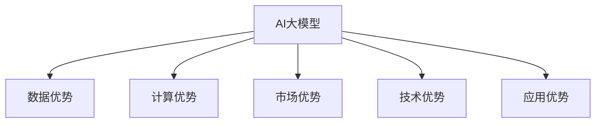

                 

# AI 大模型创业：如何利用市场优势？

在大数据、云计算和人工智能（AI）技术的推动下，AI大模型正迅速成为行业创业的新热点。从语言模型、视觉模型到通用模型，各大科技巨头纷纷推出自己的AI大模型，并不断优化升级。AI大模型之所以能够引起市场热潮，主要得益于其在多个领域的应用潜力。但对于初创公司而言，如何利用市场优势，在AI大模型领域获得一席之地，是值得深入探讨的问题。本文将从市场优势的角度，探讨AI大模型创业的策略。

## 1. 背景介绍

### 1.1 AI大模型的市场潜力

近年来，AI大模型的应用领域不断扩展，从计算机视觉、自然语言处理到语音识别、医疗健康等领域，大模型都展现出了强大的潜力。例如，GPT-4的发布，预示着自然语言处理技术的重大突破，可以生成高质量的文本内容，处理自然语言推理和生成对话等任务。OpenAI的DALL·E 2、Stable Diffusion等视觉生成模型，则能够从文字描述中生成高质量的图像和视频，推动创意和设计行业的发展。此外，大模型还能够在数据挖掘、自动化测试、金融风控等业务场景中发挥重要作用，成为推动数字经济转型升级的重要力量。

### 1.2 AI大模型的技术壁垒

尽管AI大模型的应用前景广阔，但其技术门槛却较高。需要大量的数据、计算资源和专业知识。这对初创公司而言是一大挑战。另外，AI大模型研发周期长，需要持续的技术投入，初创公司往往面临资金和人才不足的问题。

## 2. 核心概念与联系

### 2.1 核心概念概述

AI大模型创业的核心概念包括：

- AI大模型：指基于深度学习算法，通过大规模数据训练得到的通用模型，如BERT、GPT、DALL·E等。
- 数据优势：指利用大规模无标签数据进行预训练，获取强大的语言、视觉等通用知识。
- 计算优势：指利用强大的计算资源进行模型训练和优化，提升模型的精度和性能。
- 市场优势：指利用市场需求的爆发，快速获取用户和市场份额。
- 技术优势：指在模型架构、算法优化等方面进行创新，提升模型的竞争力。
- 应用优势：指将AI大模型应用于特定业务场景，实现业务价值的最大化。

这些概念之间的逻辑关系可以通过以下Mermaid流程图来展示：



这个流程图展示了大模型创业的各个关键概念及其之间的关系：

1. AI大模型作为核心，通过预训练获得基础能力。
2. 数据和计算优势是大模型高质量预训练和微调的前提。
3. 市场优势是大模型落地应用的基础，促进快速增长。
4. 技术优势是大模型优化和升级的保障，提升竞争力。
5. 应用优势是大模型实现商业价值的关键，驱动市场扩展。

## 3. 核心算法原理 & 具体操作步骤

### 3.1 算法原理概述

AI大模型创业的核心在于利用数据、计算和市场优势，在特定业务场景下开发出高效、高质量的AI大模型，并实现商业化应用。其核心算法原理包括以下几点：

1. **预训练-微调框架**：通过大规模无标签数据进行预训练，获得通用知识，然后在特定任务上进行微调，提升模型的业务适配能力。
2. **迁移学习**：将一个领域的知识迁移到另一个相关领域，减少新任务标注数据的依赖，提高模型性能。
3. **参数高效微调**：仅微调模型的部分参数，保留大部分预训练权重，提升模型的可扩展性和泛化能力。
4. **模型融合**：通过融合多个大模型，提升模型的鲁棒性和准确性。

### 3.2 算法步骤详解

AI大模型创业的具体操作步骤可以分为以下几个阶段：

1. **市场调研**：通过行业调研和用户需求分析，确定需要解决的具体业务问题，找到合适的AI大模型应用场景。
2. **模型选择和预训练**：根据业务需求，选择合适的预训练模型，并通过大规模无标签数据进行预训练，获得通用知识。
3. **微调和优化**：在特定任务上，使用少量标注数据进行微调，并优化模型性能，提升模型的业务适配能力。
4. **模型部署和应用**：将优化后的模型部署到业务系统中，提供高质量的AI服务，并不断收集用户反馈进行模型优化。
5. **市场推广和扩展**：通过市场推广，快速获取用户和市场份额，实现商业化运营。

### 3.3 算法优缺点

AI大模型创业的优势和劣势如下：

**优势**：

1. **技术领先**：通过预训练和微调技术，获得高质量的AI大模型，具备较强的技术竞争力。
2. **应用场景多样**：AI大模型可以应用于多个业务领域，推动数字化转型。
3. **市场前景广阔**：AI大模型的市场潜力巨大，多个行业亟需采用AI技术提升效率。
4. **投资回报率高**：相比于传统软件，AI大模型的投入产出比更高，能够快速实现商业化。

**劣势**：

1. **数据和计算资源需求高**：需要大量的数据和计算资源，初期投入较大。
2. **技术门槛高**：AI大模型研发需要专业知识，初创公司往往面临技术和人才不足的问题。
3. **市场竞争激烈**：AI大模型市场竞争激烈，需要持续的创新和优化。
4. **应用风险**：AI大模型在特定业务场景下的应用效果和风险不易评估，需要谨慎推广。

### 3.4 算法应用领域

AI大模型在多个领域都有广泛的应用，包括但不限于：

1. **自然语言处理（NLP）**：文本分类、情感分析、机器翻译、对话系统等。
2. **计算机视觉（CV）**：图像识别、图像生成、视频分析等。
3. **语音识别**：语音识别、语音合成、情感识别等。
4. **医疗健康**：疾病诊断、医疗影像分析、药物研发等。
5. **金融科技**：信用评估、风险管理、智能投顾等。
6. **智能制造**：质量检测、故障预测、智能调度等。

## 4. 数学模型和公式 & 详细讲解 & 举例说明

### 4.1 数学模型构建

AI大模型的数学模型通常包括预训练和微调两个阶段。预训练模型通常使用自回归或自编码模型，如BERT、GPT等。微调模型则是基于预训练模型的通用知识，在特定任务上进行进一步优化。以下是预训练和微调的数学模型构建过程：

1. **预训练模型**：假设预训练模型为$f_\theta$，其中$\theta$为预训练参数。预训练任务通常为自监督任务，如语言建模、掩码语言模型等。预训练目标为：

$$
\min_\theta \mathcal{L}_\text{pretrain}(f_\theta, D_\text{pretrain})
$$

其中，$D_\text{pretrain}$为预训练数据集，$\mathcal{L}_\text{pretrain}$为预训练损失函数，通常是交叉熵损失等。

2. **微调模型**：在特定任务上，使用标注数据$D_\text{task}$进行微调，目标为：

$$
\min_\theta \mathcal{L}_\text{task}(f_\theta, D_\text{task})
$$

其中，$D_\text{task}$为任务数据集，$\mathcal{L}_\text{task}$为任务损失函数。

### 4.2 公式推导过程

以BERT微调为例，推导微调的数学公式。假设微调任务为二分类任务，输入为$x$，输出为$y$。微调模型的目标为：

$$
\min_\theta \mathcal{L}_\text{task}(f_\theta, D_\text{task})
$$

其中，$f_\theta(x)$为微调模型在输入$x$上的输出。

假设$f_\theta(x)$的输出为$\hat{y} \in [0,1]$，表示样本属于正类的概率。真实标签$y \in \{0,1\}$。则二分类交叉熵损失函数定义为：

$$
\ell(f_\theta(x),y) = -[y\log \hat{y} + (1-y)\log (1-\hat{y})]
$$

将其代入经验风险公式，得：

$$
\mathcal{L}_\text{task}(\theta) = -\frac{1}{N}\sum_{i=1}^N [y_i\log f_\theta(x_i)+(1-y_i)\log(1-f_\theta(x_i))]
$$

其中$N$为训练样本数。

根据链式法则，损失函数对参数$\theta$的梯度为：

$$
\frac{\partial \mathcal{L}_\text{task}(\theta)}{\partial \theta_k} = -\frac{1}{N}\sum_{i=1}^N (\frac{y_i}{f_\theta(x_i)}-\frac{1-y_i}{1-f_\theta(x_i)}) \frac{\partial f_\theta(x_i)}{\partial \theta_k}
$$

其中，$\frac{\partial f_\theta(x_i)}{\partial \theta_k}$为微调模型在输入$x_i$上的输出对参数$\theta_k$的导数。

在得到损失函数的梯度后，即可带入参数更新公式，完成模型的迭代优化。重复上述过程直至收敛，最终得到适应特定任务的最优模型参数$\theta^*$。

### 4.3 案例分析与讲解

以视觉生成模型DALL·E 2为例，展示其微调过程。DALL·E 2模型能够从文字描述中生成高质量的图像。假设微调任务为文本描述图像生成。

1. **数据准备**：收集包含文本描述和对应图像的数据集$D_\text{task}$，其中$D_\text{task} = \{(x_i, y_i)\}_{i=1}^N$，$x_i$为文本描述，$y_i$为图像数据。
2. **模型选择**：选择DALL·E 2作为预训练模型$f_\theta$。
3. **微调优化**：使用少量标注数据进行微调，优化损失函数$\mathcal{L}_\text{task}$。假设优化器为AdamW，学习率为$10^{-4}$。

微调目标函数为：

$$
\min_\theta \mathcal{L}_\text{task}(f_\theta, D_\text{task})
$$

具体实现过程如下：

```python
import torch
import torch.nn as nn
import torch.optim as optim

# 加载DALL·E 2预训练模型
model = DALL_E_2()

# 定义微调目标函数
loss_fn = nn.CrossEntropyLoss()

# 选择AdamW优化器，设置学习率
optimizer = optim.AdamW(model.parameters(), lr=10**-4)

# 加载微调数据
x_train = ...
y_train = ...

# 训练过程
for epoch in range(num_epochs):
    model.train()
    for x, y in zip(x_train, y_train):
        optimizer.zero_grad()
        y_hat = model(x)
        loss = loss_fn(y_hat, y)
        loss.backward()
        optimizer.step()
```

## 5. 项目实践：代码实例和详细解释说明

### 5.1 开发环境搭建

AI大模型创业的开发环境搭建主要包括以下几个步骤：

1. **安装依赖**：使用Python安装所需的依赖库，如TensorFlow、PyTorch、Transformers等。
2. **配置环境**：配置虚拟环境和GPU资源，确保能够高效训练和部署模型。
3. **选择预训练模型**：根据业务需求，选择适合的预训练模型。
4. **数据准备**：准备预训练和微调所需的数据集，并进行预处理。

以下是具体的环境搭建步骤：

```bash
# 创建虚拟环境
conda create -n ai_model python=3.8

# 激活虚拟环境
conda activate ai_model

# 安装依赖库
pip install torch torchvision transformers numpy scikit-learn

# 配置GPU环境
# 设置GPU资源
# 安装CUDA和cuDNN库
# 设置环境变量
```

### 5.2 源代码详细实现

以下是一个简单的AI大模型创业项目实现示例，具体使用TensorFlow框架：

1. **模型定义**：定义预训练和微调模型，这里以BERT为例：

```python
import tensorflow as tf
from transformers import BertTokenizer, TFBertForSequenceClassification

# 加载BERT预训练模型和分词器
tokenizer = BertTokenizer.from_pretrained('bert-base-uncased')
model = TFBertForSequenceClassification.from_pretrained('bert-base-uncased', num_labels=2)

# 定义优化器
optimizer = tf.keras.optimizers.Adam(learning_rate=2e-5)
```

2. **数据准备**：准备微调所需的数据集，这里以二分类任务为例：

```python
# 加载微调数据集
train_data = ...
val_data = ...
test_data = ...

# 定义数据预处理函数
def preprocess_text(text):
    return tokenizer.encode_plus(text, return_tensors='tf')

# 预处理训练数据
train_texts = preprocess_text(train_data['texts'])
val_texts = preprocess_text(val_data['texts'])
test_texts = preprocess_text(test_data['texts'])

# 转换为TensorFlow张量
train_inputs = tf.convert_to_tensor(train_texts['input_ids'])
val_inputs = tf.convert_to_tensor(val_texts['input_ids'])
test_inputs = tf.convert_to_tensor(test_texts['input_ids'])
```

3. **模型微调**：使用优化器进行模型微调：

```python
# 定义微调目标函数
loss_fn = tf.keras.losses.SparseCategoricalCrossentropy(from_logits=True)

# 定义微调模型
model.compile(optimizer=optimizer, loss=loss_fn, metrics=['accuracy'])

# 训练过程
history = model.fit(train_inputs, train_labels, epochs=3, validation_data=(val_inputs, val_labels))
```

4. **模型评估**：在测试集上评估模型性能：

```python
# 加载测试数据
test_texts = preprocess_text(test_data['texts'])
test_inputs = tf.convert_to_tensor(test_texts['input_ids'])

# 评估模型性能
test_loss, test_acc = model.evaluate(test_inputs, test_labels)
print(f'Test Loss: {test_loss}, Test Accuracy: {test_acc}')
```

### 5.3 代码解读与分析

**模型定义**：

- `BertTokenizer`：用于分词和编码。
- `TFBertForSequenceClassification`：用于定义微调模型。
- `optimizer`：选择Adam优化器，设置学习率为$2 \times 10^{-5}$。

**数据预处理**：

- `preprocess_text`函数：用于将文本转换为Token IDs。
- `tf.convert_to_tensor`：将TensorFlow张量转换为Numpy数组。

**模型微调**：

- `loss_fn`：定义微调目标函数为稀疏分类交叉熵损失。
- `model.compile`：编译模型，设置优化器和损失函数。
- `model.fit`：训练模型，指定训练集和验证集。

**模型评估**：

- `test_loss`和`test_acc`：在测试集上评估模型性能，打印测试损失和准确率。

## 6. 实际应用场景

### 6.1 智能客服系统

AI大模型在智能客服系统的应用中，可以显著提升客户服务体验。智能客服系统通过语音识别、文本分类和生成对话等技术，能够理解用户意图，快速解答常见问题，提供高质量的客户服务。

以智能客服为例，以下是具体的微调过程：

1. **数据准备**：收集企业内部客服历史对话记录，标注用户意图和回答。
2. **模型选择**：选择适合的预训练语言模型，如BERT、GPT等。
3. **微调优化**：使用标注数据进行微调，优化模型在特定任务上的性能。
4. **模型部署**：将微调后的模型部署到客服系统中，提供自然语言处理服务。

### 6.2 金融舆情监测

金融行业需要实时监测市场舆情，预测市场动向，以便及时调整投资策略。AI大模型可以通过分析新闻、评论和社交媒体等公开数据，预测股票价格波动，降低投资风险。

以金融舆情监测为例，以下是具体的微调过程：

1. **数据准备**：收集金融领域相关的新闻、评论和社交媒体数据。
2. **模型选择**：选择适合的预训练语言模型，如BERT、GPT等。
3. **微调优化**：使用标注数据进行微调，优化模型在金融领域的应用效果。
4. **模型部署**：将微调后的模型部署到舆情监测系统中，提供金融数据处理和分析服务。

### 6.3 个性化推荐系统

个性化推荐系统通过分析用户行为和偏好，为用户推荐相关内容。AI大模型可以通过分析用户浏览、点击、评论等行为数据，推荐高质量的产品或内容，提升用户体验。

以个性化推荐系统为例，以下是具体的微调过程：

1. **数据准备**：收集用户行为数据，包括浏览记录、点击数据和评论数据。
2. **模型选择**：选择适合的预训练语言模型，如BERT、GPT等。
3. **微调优化**：使用标注数据进行微调，优化模型在推荐系统中的性能。
4. **模型部署**：将微调后的模型部署到推荐系统中，提供个性化推荐服务。

## 7. 工具和资源推荐

### 7.1 学习资源推荐

为了帮助开发者系统掌握AI大模型微调的理论基础和实践技巧，这里推荐一些优质的学习资源：

1. 《深度学习与人工智能》：介绍深度学习的基本原理和应用，包括TensorFlow和PyTorch等框架的使用。
2. 《自然语言处理与深度学习》：讲解NLP领域的基础知识和技术，包括BERT、GPT等预训练模型。
3. 《AI大模型开发实战》：提供详细的AI大模型开发实战案例，涵盖微调、部署和优化等环节。
4. HuggingFace官方文档：提供丰富的预训练模型和微调样例代码，是初学者和进阶者必备的学习资源。
5. Kaggle竞赛平台：提供大量NLP领域的竞赛项目，通过实战练习提升AI大模型开发能力。

### 7.2 开发工具推荐

以下是几款用于AI大模型微调开发的常用工具：

1. PyTorch：基于Python的开源深度学习框架，支持动态计算图，适合快速迭代研究。
2. TensorFlow：由Google主导开发的开源深度学习框架，生产部署方便，适合大规模工程应用。
3. HuggingFace Transformers：集成了多种预训练模型，支持PyTorch和TensorFlow，是微调任务开发的利器。
4. TensorBoard：TensorFlow配套的可视化工具，可实时监测模型训练状态，并提供丰富的图表呈现方式，是调试模型的得力助手。
5. Weights & Biases：模型训练的实验跟踪工具，可以记录和可视化模型训练过程中的各项指标，方便对比和调优。

### 7.3 相关论文推荐

以下是几篇奠基性的相关论文，推荐阅读：

1. Attention is All You Need：提出Transformer结构，开启了NLP领域的预训练大模型时代。
2. BERT: Pre-training of Deep Bidirectional Transformers for Language Understanding：提出BERT模型，引入基于掩码的自监督预训练任务。
3. Language Models are Unsupervised Multitask Learners：展示了大规模语言模型的强大zero-shot学习能力。
4. Parameter-Efficient Transfer Learning for NLP：提出Adapter等参数高效微调方法。
5. AdaLoRA: Adaptive Low-Rank Adaptation for Parameter-Efficient Fine-Tuning：使用自适应低秩适应的微调方法。

这些论文代表了大模型微调技术的发展脉络。通过学习这些前沿成果，可以帮助研究者把握学科前进方向，激发更多的创新灵感。

## 8. 总结：未来发展趋势与挑战

### 8.1 研究成果总结

AI大模型创业在近年来取得了显著的进展，推动了NLP、CV、推荐系统等多个领域的创新和发展。预训练-微调技术、迁移学习和参数高效微调方法等，在模型性能和应用效果上取得了显著的提升。然而，AI大模型创业也面临诸多挑战，如数据和计算资源需求高、技术门槛高等问题。

### 8.2 未来发展趋势

未来，AI大模型创业将呈现以下几个发展趋势：

1. **模型规模持续增大**：随着算力成本的下降和数据规模的扩张，AI大模型的参数量还将持续增长，预训练和微调的效果将进一步提升。
2. **微调方法日趋多样化**：未来将涌现更多参数高效和计算高效的微调方法，如LoRA、Prefix-Tuning等。
3. **多模态微调崛起**：AI大模型将进一步拓展到图像、视频、语音等多模态数据微调，实现视觉、语音等多模态信息与文本信息的协同建模。
4. **知识库整合能力增强**：AI大模型将更好地与外部知识库、规则库等专家知识结合，形成更加全面、准确的信息整合能力。
5. **模型通用性增强**：经过海量数据的预训练和多领域任务的微调，AI大模型将具备更强的常识推理和跨领域迁移能力。

### 8.3 面临的挑战

尽管AI大模型创业取得了显著进展，但仍面临诸多挑战：

1. **数据和计算资源瓶颈**：AI大模型需要大量的数据和计算资源，初期投入较大。
2. **技术门槛高**：AI大模型研发需要专业知识，初创公司往往面临技术和人才不足的问题。
3. **市场竞争激烈**：AI大模型市场竞争激烈，需要持续的创新和优化。
4. **应用风险**：AI大模型在特定业务场景下的应用效果和风险不易评估，需要谨慎推广。
5. **可解释性不足**：AI大模型通常缺乏可解释性，难以解释其内部工作机制和决策逻辑。

### 8.4 研究展望

未来，AI大模型创业需要在以下几个方面进行突破：

1. **探索无监督和半监督微调方法**：摆脱对大规模标注数据的依赖，利用自监督学习、主动学习等方法，最大限度利用非结构化数据，实现更加灵活高效的微调。
2. **开发更加参数高效和计算高效的微调范式**：开发更加参数高效的微调方法，如LoRA、Prefix-Tuning等，提升模型的可扩展性和泛化能力。
3. **引入更多先验知识**：将符号化的先验知识与神经网络模型结合，引导微调过程学习更准确、合理的语言模型，增强模型的可解释性和可控性。
4. **结合因果分析和博弈论工具**：将因果分析方法引入微调模型，识别出模型决策的关键特征，增强输出解释的因果性和逻辑性，提高系统稳定性。
5. **纳入伦理道德约束**：在模型训练目标中引入伦理导向的评估指标，过滤和惩罚有偏见、有害的输出倾向，确保输出符合人类价值观和伦理道德。

## 9. 附录：常见问题与解答

### Q1：AI大模型创业需要哪些关键资源？

A: AI大模型创业需要以下关键资源：

1. **数据资源**：需要大规模无标签数据进行预训练，获取强大的通用知识。
2. **计算资源**：需要强大的计算资源进行模型训练和优化，提升模型的精度和性能。
3. **技术资源**：需要专业知识进行模型架构设计和算法优化，提升模型的竞争力。
4. **市场资源**：需要市场推广和应用场景，快速获取用户和市场份额。

### Q2：AI大模型创业的难点在哪里？

A: AI大模型创业的难点主要在于：

1. **数据和计算资源需求高**：需要大量的数据和计算资源，初期投入较大。
2. **技术门槛高**：AI大模型研发需要专业知识，初创公司往往面临技术和人才不足的问题。
3. **市场竞争激烈**：AI大模型市场竞争激烈，需要持续的创新和优化。
4. **应用风险**：AI大模型在特定业务场景下的应用效果和风险不易评估，需要谨慎推广。

### Q3：AI大模型创业如何获取市场优势？

A: AI大模型创业获取市场优势的方法如下：

1. **定位明确**：明确业务定位，找到适合的市场机会，避免盲目跟风。
2. **技术领先**：在模型架构、算法优化等方面进行创新，提升模型的竞争力。
3. **快速迭代**：快速开发和部署AI大模型，快速获取用户反馈，持续优化模型。
4. **市场推广**：通过市场推广，快速获取用户和市场份额，实现商业化运营。

### Q4：AI大模型创业如何保障模型性能？

A: 保障AI大模型性能的方法如下：

1. **数据质量控制**：确保训练数据的标注质量和多样性，避免过拟合。
2. **模型优化**：使用优化器进行模型优化，提高模型的收敛速度和精度。
3. **超参数调优**：通过超参数调优，选择最优的模型参数。
4. **模型测试**：在测试集上评估模型性能，及时发现和解决模型问题。

### Q5：AI大模型创业如何实现持续创新？

A: AI大模型创业实现持续创新的方法如下：

1. **持续学习和知识更新**：关注最新技术和研究成果，不断学习新知识，更新现有模型。
2. **用户反馈和需求分析**：收集用户反馈和需求，根据实际应用场景进行模型优化和改进。
3. **跨领域合作**：与相关领域的专业人士进行合作，引入更多先验知识，提升模型性能。
4. **技术创新和知识产权保护**：不断进行技术创新，并申请专利保护知识产权。

---

作者：禅与计算机程序设计艺术 / Zen and the Art of Computer Programming

