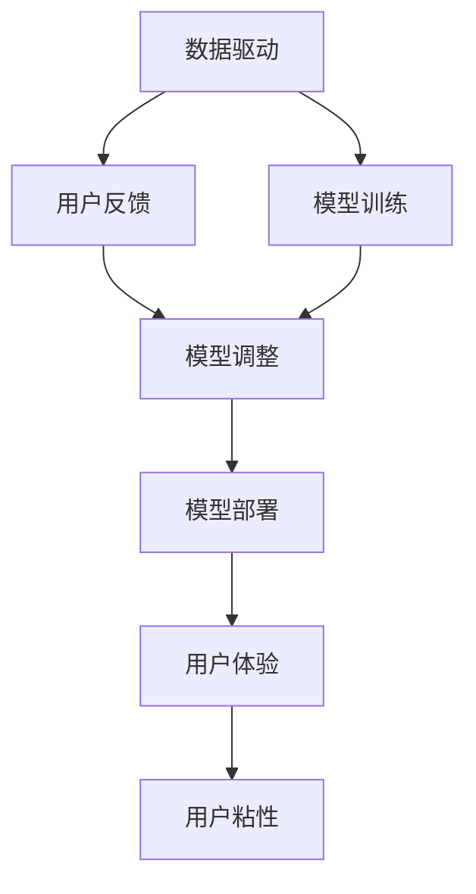

                 

# AI 大模型创业：如何利用用户优势？

在人工智能（AI）领域，大模型创业已经成为一种趋势。大模型具有强大的自适应性和泛化能力，能够在各种任务上取得优异表现。然而，创业过程中如何利用用户优势，最大化模型的性能和应用价值，是摆在企业面前的重要课题。本文将详细阐述大模型创业中如何利用用户优势，包括数据驱动、用户反馈、模型部署等方面的策略，以期为企业提供有价值的指导。

## 1. 背景介绍

### 1.1 问题由来

随着AI技术的发展，大模型如GPT-3、BERT等在自然语言处理（NLP）、计算机视觉、推荐系统等领域的性能显著提升。这些大模型往往需要大量的训练数据和计算资源，但创业企业普遍面临数据资源不足和计算资源有限的挑战。因此，如何利用现有数据和用户优势，最大化模型的性能和应用价值，成为大模型创业的关键问题。

### 1.2 问题核心关键点

大模型创业中利用用户优势，主要包括以下几个方面：
- **数据驱动**：如何通过用户数据进行有效训练，提升模型性能。
- **用户反馈**：如何收集用户反馈，优化模型输出。
- **模型部署**：如何将模型高效部署到实际应用中，满足用户需求。
- **用户体验**：如何提升用户体验，增强用户粘性。

这些关键点构成了一个闭环的反馈系统，通过数据和用户反馈的不断迭代，实现模型的不断优化和用户体验的提升。

## 2. 核心概念与联系

### 2.1 核心概念概述

为更好地理解大模型创业中如何利用用户优势，本文将介绍几个密切相关的核心概念：

- **数据驱动**：通过收集和利用用户数据进行模型训练，提升模型的泛化能力和性能。
- **用户反馈**：通过用户反馈不断调整模型输出，优化用户体验。
- **模型部署**：将模型部署到实际应用中，满足用户需求，提升应用价值。
- **用户体验**：通过优化模型输出和应用设计，提升用户满意度，增强用户粘性。

这些核心概念之间的逻辑关系可以通过以下Mermaid流程图来展示：



这个流程图展示了数据驱动和用户反馈在大模型创业中的关键作用，以及模型部署和用户体验之间的正反馈关系。

## 3. 核心算法原理 & 具体操作步骤

### 3.1 算法原理概述

大模型创业中利用用户优势，本质上是一个数据驱动和用户反馈相结合的闭环迭代过程。其核心思想是：通过收集用户数据进行模型训练，利用用户反馈不断调整模型输出，最终实现模型的不断优化和用户体验的提升。

形式化地，假设模型为 $M$，用户数据为 $D$，模型训练过程可以表示为：

$$
M_{new} = M_{old} + f(D, M_{old})
$$

其中，$M_{old}$ 为原始模型，$M_{new}$ 为训练后的新模型，$f$ 为基于用户数据的模型调整函数，通常包含数据增强、正则化、迁移学习等技术。

### 3.2 算法步骤详解

大模型创业中利用用户优势的算法步骤主要包括：

**Step 1: 数据收集与预处理**

- 收集用户数据：根据具体应用场景，收集用户的互动数据、行为数据、反馈数据等。
- 数据预处理：对收集到的数据进行清洗、去重、标注等预处理操作，确保数据质量和一致性。

**Step 2: 模型训练与微调**

- 模型选择：选择合适的预训练模型作为初始化参数，如BERT、GPT-3等。
- 模型微调：在收集到的用户数据上，使用监督学习或半监督学习方法对模型进行微调，提升模型性能。

**Step 3: 用户反馈收集与分析**

- 用户反馈收集：设计合理的反馈机制，收集用户对模型输出的反馈信息，如满意度、错误率、任务完成度等。
- 用户反馈分析：对收集到的用户反馈进行分析，识别常见问题和用户需求，为模型优化提供指导。

**Step 4: 模型调整与优化**

- 模型调整：根据用户反馈，对模型进行调整，如参数更新、架构优化等。
- 模型优化：使用数据增强、正则化、对抗训练等技术，提升模型的泛化能力和鲁棒性。

**Step 5: 模型部署与迭代**

- 模型部署：将优化后的模型部署到实际应用中，满足用户需求。
- 迭代反馈：持续收集用户反馈，对模型进行迭代优化，不断提升模型性能和用户体验。

### 3.3 算法优缺点

大模型创业中利用用户优势的算法具有以下优点：
1. **高效数据利用**：通过用户数据进行模型训练，最大化数据利用效率。
2. **提升模型性能**：通过不断优化模型，提升模型在特定任务上的性能。
3. **增强用户粘性**：通过提升用户体验，增强用户粘性，促进产品迭代和口碑传播。

同时，该方法也存在一定的局限性：
1. **数据隐私问题**：用户数据涉及隐私，数据收集和处理需符合隐私保护法规。
2. **数据质量问题**：用户数据质量参差不齐，可能影响模型训练效果。
3. **用户反馈主观性**：用户反馈可能带有主观色彩，影响模型优化方向。

尽管存在这些局限性，但就目前而言，基于数据驱动和用户反馈的大模型创业方法仍是大模型应用的最主流范式。未来相关研究的重点在于如何进一步提升数据处理和利用效率，减少用户反馈的主观性，同时兼顾用户隐私和数据安全等因素。

### 3.4 算法应用领域

大模型创业中利用用户优势的方法，在多个行业领域已经得到了广泛应用，例如：

- **金融领域**：在金融领域，可以利用用户的历史交易数据进行模型训练，提升推荐系统、风险评估等应用的性能。
- **医疗领域**：在医疗领域，可以通过收集用户的健康数据进行模型训练，提升疾病诊断、治疗方案推荐等应用的效果。
- **教育领域**：在教育领域，可以利用学生的学习数据进行模型训练，提升个性化推荐、学习路径规划等应用的效果。
- **电商领域**：在电商领域，可以通过收集用户的购买数据进行模型训练，提升推荐系统、广告投放等应用的性能。
- **智能家居领域**：在智能家居领域，可以通过收集用户的使用数据进行模型训练，提升智能音箱、智能家居设备等应用的性能。

除了上述这些经典应用外，大模型创业中的用户优势策略还应用于更多场景中，如智能客服、内容推荐、智能投顾、智能合约等，为各行业带来了新的变革和创新。

## 4. 数学模型和公式 & 详细讲解 & 举例说明

### 4.1 数学模型构建

本节将使用数学语言对大模型创业中利用用户优势的过程进行更加严格的刻画。

记用户数据为 $D=\{(x_i, y_i)\}_{i=1}^N, x_i \in \mathcal{X}, y_i \in \mathcal{Y}$，其中 $\mathcal{X}$ 为输入空间，$\mathcal{Y}$ 为输出空间。假设模型为 $M_{\theta}:\mathcal{X} \rightarrow \mathcal{Y}$，其中 $\theta$ 为模型参数。

定义模型 $M_{\theta}$ 在数据样本 $(x,y)$ 上的损失函数为 $\ell(M_{\theta}(x),y)$，则在数据集 $D$ 上的经验风险为：

$$
\mathcal{L}(\theta) = \frac{1}{N} \sum_{i=1}^N \ell(M_{\theta}(x_i),y_i)
$$

通过梯度下降等优化算法，模型训练过程不断更新模型参数 $\theta$，最小化损失函数 $\mathcal{L}$，使得模型输出逼近真实标签。

### 4.2 公式推导过程

以下我们以推荐系统为例，推导数据驱动和用户反馈在大模型创业中的应用。

假设模型 $M_{\theta}$ 在用户历史行为 $x$ 上的推荐结果为 $\hat{y}=M_{\theta}(x)$，推荐结果与真实标签 $y \in \{0,1\}$ 之间的交叉熵损失函数为：

$$
\ell(M_{\theta}(x),y) = -[y\log \hat{y} + (1-y)\log(1-\hat{y})]
$$

将其代入经验风险公式，得：

$$
\mathcal{L}(\theta) = -\frac{1}{N}\sum_{i=1}^N [y_i\log M_{\theta}(x_i)+(1-y_i)\log(1-M_{\theta}(x_i))]
$$

根据链式法则，损失函数对参数 $\theta_k$ 的梯度为：

$$
\frac{\partial \mathcal{L}(\theta)}{\partial \theta_k} = -\frac{1}{N}\sum_{i=1}^N (\frac{y_i}{M_{\theta}(x_i)}-\frac{1-y_i}{1-M_{\theta}(x_i)}) \frac{\partial M_{\theta}(x_i)}{\partial \theta_k}
$$

其中 $\frac{\partial M_{\theta}(x_i)}{\partial \theta_k}$ 可进一步递归展开，利用自动微分技术完成计算。

### 4.3 案例分析与讲解

假设有一家电商公司，旨在利用用户数据进行个性化推荐系统开发。公司从用户历史行为数据中收集了 $N=10^6$ 个样本，每个样本包含用户浏览、点击、购买行为等特征 $x_i$ 和推荐结果 $y_i$。

**Step 1: 数据收集与预处理**

- 收集数据：从用户行为数据中提取用户浏览记录、点击记录和购买记录，构建训练数据集 $D$。
- 数据预处理：对数据进行清洗、去重、标注等预处理操作，确保数据质量和一致性。

**Step 2: 模型训练与微调**

- 模型选择：选择预训练模型 BERT 作为初始化参数。
- 模型微调：使用监督学习算法，将 $D$ 中的数据输入 BERT 进行微调，得到优化后的模型 $M_{new}$。

**Step 3: 用户反馈收集与分析**

- 用户反馈收集：设计反馈机制，让用户对推荐结果进行满意度评分。
- 用户反馈分析：对用户的评分进行统计分析，识别常见问题和用户需求。

**Step 4: 模型调整与优化**

- 模型调整：根据用户反馈，调整模型参数，如更新权重、改变激活函数等。
- 模型优化：使用数据增强、正则化、对抗训练等技术，提升模型的泛化能力和鲁棒性。

**Step 5: 模型部署与迭代**

- 模型部署：将优化后的模型部署到推荐系统中，为用户提供个性化推荐服务。
- 迭代反馈：持续收集用户反馈，对模型进行迭代优化，不断提升模型性能和用户体验。

通过上述步骤，公司能够不断提升推荐系统的效果，满足用户需求，增强用户粘性。

## 5. 项目实践：代码实例和详细解释说明

### 5.1 开发环境搭建

在进行大模型创业项目实践前，我们需要准备好开发环境。以下是使用Python进行PyTorch开发的环境配置流程：

1. 安装Anaconda：从官网下载并安装Anaconda，用于创建独立的Python环境。

2. 创建并激活虚拟环境：
```bash
conda create -n pytorch-env python=3.8 
conda activate pytorch-env
```

3. 安装PyTorch：根据CUDA版本，从官网获取对应的安装命令。例如：
```bash
conda install pytorch torchvision torchaudio cudatoolkit=11.1 -c pytorch -c conda-forge
```

4. 安装各类工具包：
```bash
pip install numpy pandas scikit-learn matplotlib tqdm jupyter notebook ipython
```

完成上述步骤后，即可在`pytorch-env`环境中开始项目实践。

### 5.2 源代码详细实现

下面我们以推荐系统为例，给出使用Transformers库对BERT模型进行微调的PyTorch代码实现。

首先，定义推荐系统的数据处理函数：

```python
from transformers import BertTokenizer
from torch.utils.data import Dataset
import torch

class RecommendationDataset(Dataset):
    def __init__(self, user_behaviors, item_features, tokenizer, max_len=128):
        self.user_behaviors = user_behaviors
        self.item_features = item_features
        self.tokenizer = tokenizer
        self.max_len = max_len
        
    def __len__(self):
        return len(self.user_behaviors)
    
    def __getitem__(self, item):
        user_behavior = self.user_behaviors[item]
        item_feature = self.item_features[item]
        
        # 将用户行为和商品特征拼接
        feature_text = user_behavior + ' ' + item_feature
        
        encoding = self.tokenizer(feature_text, return_tensors='pt', max_length=self.max_len, padding='max_length', truncation=True)
        input_ids = encoding['input_ids'][0]
        attention_mask = encoding['attention_mask'][0]
        
        return {'input_ids': input_ids, 
                'attention_mask': attention_mask,
                'labels': item_feature}
```

然后，定义模型和优化器：

```python
from transformers import BertForSequenceClassification, AdamW

model = BertForSequenceClassification.from_pretrained('bert-base-cased', num_labels=len(item_features))

optimizer = AdamW(model.parameters(), lr=2e-5)
```

接着，定义训练和评估函数：

```python
from torch.utils.data import DataLoader
from tqdm import tqdm
from sklearn.metrics import classification_report

device = torch.device('cuda') if torch.cuda.is_available() else torch.device('cpu')
model.to(device)

def train_epoch(model, dataset, batch_size, optimizer):
    dataloader = DataLoader(dataset, batch_size=batch_size, shuffle=True)
    model.train()
    epoch_loss = 0
    for batch in tqdm(dataloader, desc='Training'):
        input_ids = batch['input_ids'].to(device)
        attention_mask = batch['attention_mask'].to(device)
        labels = batch['labels'].to(device)
        model.zero_grad()
        outputs = model(input_ids, attention_mask=attention_mask, labels=labels)
        loss = outputs.loss
        epoch_loss += loss.item()
        loss.backward()
        optimizer.step()
    return epoch_loss / len(dataloader)

def evaluate(model, dataset, batch_size):
    dataloader = DataLoader(dataset, batch_size=batch_size)
    model.eval()
    preds, labels = [], []
    with torch.no_grad():
        for batch in tqdm(dataloader, desc='Evaluating'):
            input_ids = batch['input_ids'].to(device)
            attention_mask = batch['attention_mask'].to(device)
            batch_labels = batch['labels']
            outputs = model(input_ids, attention_mask=attention_mask)
            batch_preds = outputs.logits.argmax(dim=2).to('cpu').tolist()
            batch_labels = batch_labels.to('cpu').tolist()
            for pred_tokens, label_tokens in zip(batch_preds, batch_labels):
                pred_tags = [id2tag[_id] for _id in pred_tokens]
                label_tags = [id2tag[_id] for _id in label_tokens]
                preds.append(pred_tags[:len(label_tags)])
                labels.append(label_tags)
                
    print(classification_report(labels, preds))
```

最后，启动训练流程并在测试集上评估：

```python
epochs = 5
batch_size = 16

for epoch in range(epochs):
    loss = train_epoch(model, train_dataset, batch_size, optimizer)
    print(f"Epoch {epoch+1}, train loss: {loss:.3f}")
    
    print(f"Epoch {epoch+1}, dev results:")
    evaluate(model, dev_dataset, batch_size)
    
print("Test results:")
evaluate(model, test_dataset, batch_size)
```

以上就是使用PyTorch对BERT进行推荐系统开发和微调的完整代码实现。可以看到，得益于Transformers库的强大封装，我们可以用相对简洁的代码完成BERT模型的加载和微调。

### 5.3 代码解读与分析

让我们再详细解读一下关键代码的实现细节：

**RecommendationDataset类**：
- `__init__`方法：初始化用户行为、商品特征、分词器等关键组件。
- `__len__`方法：返回数据集的样本数量。
- `__getitem__`方法：对单个样本进行处理，将用户行为和商品特征拼接，将其转换为token ids，并对其进行定长padding，最终返回模型所需的输入。

**模型和优化器定义**：
- 使用BertForSequenceClassification定义推荐系统的模型，将item特征作为标签。
- 使用AdamW优化器进行模型训练，设置合适的学习率。

**训练和评估函数**：
- 使用PyTorch的DataLoader对数据集进行批次化加载，供模型训练和推理使用。
- 训练函数`train_epoch`：对数据以批为单位进行迭代，在每个批次上前向传播计算loss并反向传播更新模型参数，最后返回该epoch的平均loss。
- 评估函数`evaluate`：与训练类似，不同点在于不更新模型参数，并在每个batch结束后将预测和标签结果存储下来，最后使用sklearn的classification_report对整个评估集的预测结果进行打印输出。

**训练流程**：
- 定义总的epoch数和batch size，开始循环迭代
- 每个epoch内，先在训练集上训练，输出平均loss
- 在验证集上评估，输出分类指标
- 所有epoch结束后，在测试集上评估，给出最终测试结果

可以看到，PyTorch配合Transformers库使得BERT微调的代码实现变得简洁高效。开发者可以将更多精力放在数据处理、模型改进等高层逻辑上，而不必过多关注底层的实现细节。

当然，工业级的系统实现还需考虑更多因素，如模型的保存和部署、超参数的自动搜索、更灵活的任务适配层等。但核心的微调范式基本与此类似。

## 6. 实际应用场景

### 6.1 智能客服系统

基于大模型创业的智能客服系统，可以广泛应用于企业客服领域。传统客服往往需要配备大量人力，高峰期响应缓慢，且一致性和专业性难以保证。而利用大模型创业，通过用户数据进行模型训练，能够构建7x24小时不间断服务的智能客服系统。

在技术实现上，可以收集企业内部的历史客服对话记录，将问题和最佳答复构建成监督数据，在此基础上对预训练模型进行微调。微调后的智能客服系统能够自动理解用户意图，匹配最合适的答案模板进行回复。对于用户提出的新问题，还可以接入检索系统实时搜索相关内容，动态组织生成回答。如此构建的智能客服系统，能大幅提升客户咨询体验和问题解决效率。

### 6.2 金融舆情监测

金融机构需要实时监测市场舆论动向，以便及时应对负面信息传播，规避金融风险。传统的人工监测方式成本高、效率低，难以应对网络时代海量信息爆发的挑战。利用大模型创业，通过用户反馈不断调整模型输出，能够实时监测金融舆情，快速响应负面信息，提高风险管理能力。

具体而言，可以收集金融领域相关的新闻、报道、评论等文本数据，并对其进行情感标注。在此基础上对预训练语言模型进行微调，使其能够自动判断文本的情感倾向。将微调后的模型应用到实时抓取的网络文本数据，就能够自动监测不同情感的舆情变化趋势，一旦发现负面信息激增等异常情况，系统便会自动预警，帮助金融机构快速应对潜在风险。

### 6.3 个性化推荐系统

当前的推荐系统往往只依赖用户的历史行为数据进行物品推荐，无法深入理解用户的真实兴趣偏好。利用大模型创业，通过用户数据进行模型训练，能够更好地挖掘用户行为背后的语义信息，从而提供更精准、多样的推荐内容。

在实践中，可以收集用户浏览、点击、评论、分享等行为数据，提取和用户交互的物品标题、描述、标签等文本内容。将文本内容作为模型输入，用户的后续行为（如是否点击、购买等）作为监督信号，在此基础上微调预训练语言模型。微调后的模型能够从文本内容中准确把握用户的兴趣点。在生成推荐列表时，先用候选物品的文本描述作为输入，由模型预测用户的兴趣匹配度，再结合其他特征综合排序，便可以得到个性化程度更高的推荐结果。

### 6.4 未来应用展望

随着大模型创业的不断演进，基于用户数据和反馈的闭环迭代方法将在更多领域得到应用，为传统行业带来变革性影响。

在智慧医疗领域，利用用户数据进行模型训练，能够构建智能诊断系统，辅助医生诊疗，加速新药开发进程。在智能家居领域，利用用户数据进行模型训练，能够构建智能音箱、智能家居设备等产品，提升用户体验。

此外，在企业生产、社会治理、文娱传媒等众多领域，基于用户数据和反馈的闭环迭代方法也将不断涌现，为各行业带来新的变革和创新。相信随着技术的日益成熟，利用用户优势的大模型创业必将在构建人机协同的智能时代中扮演越来越重要的角色。

## 7. 工具和资源推荐

### 7.1 学习资源推荐

为了帮助开发者系统掌握大模型创业的理论基础和实践技巧，这里推荐一些优质的学习资源：

1. 《Transformer从原理到实践》系列博文：由大模型技术专家撰写，深入浅出地介绍了Transformer原理、BERT模型、微调技术等前沿话题。

2. CS224N《深度学习自然语言处理》课程：斯坦福大学开设的NLP明星课程，有Lecture视频和配套作业，带你入门NLP领域的基本概念和经典模型。

3. 《Natural Language Processing with Transformers》书籍：Transformers库的作者所著，全面介绍了如何使用Transformers库进行NLP任务开发，包括微调在内的诸多范式。

4. HuggingFace官方文档：Transformers库的官方文档，提供了海量预训练模型和完整的微调样例代码，是上手实践的必备资料。

5. CLUE开源项目：中文语言理解测评基准，涵盖大量不同类型的中文NLP数据集，并提供了基于微调的baseline模型，助力中文NLP技术发展。

通过对这些资源的学习实践，相信你一定能够快速掌握大模型创业的精髓，并用于解决实际的NLP问题。

### 7.2 开发工具推荐

高效的开发离不开优秀的工具支持。以下是几款用于大模型创业开发的常用工具：

1. PyTorch：基于Python的开源深度学习框架，灵活动态的计算图，适合快速迭代研究。大部分预训练语言模型都有PyTorch版本的实现。

2. TensorFlow：由Google主导开发的开源深度学习框架，生产部署方便，适合大规模工程应用。同样有丰富的预训练语言模型资源。

3. Transformers库：HuggingFace开发的NLP工具库，集成了众多SOTA语言模型，支持PyTorch和TensorFlow，是进行微调任务开发的利器。

4. Weights & Biases：模型训练的实验跟踪工具，可以记录和可视化模型训练过程中的各项指标，方便对比和调优。与主流深度学习框架无缝集成。

5. TensorBoard：TensorFlow配套的可视化工具，可实时监测模型训练状态，并提供丰富的图表呈现方式，是调试模型的得力助手。

6. Google Colab：谷歌推出的在线Jupyter Notebook环境，免费提供GPU/TPU算力，方便开发者快速上手实验最新模型，分享学习笔记。

合理利用这些工具，可以显著提升大模型创业任务的开发效率，加快创新迭代的步伐。

### 7.3 相关论文推荐

大模型创业的不断发展源于学界的持续研究。以下是几篇奠基性的相关论文，推荐阅读：

1. Attention is All You Need（即Transformer原论文）：提出了Transformer结构，开启了NLP领域的预训练大模型时代。

2. BERT: Pre-training of Deep Bidirectional Transformers for Language Understanding：提出BERT模型，引入基于掩码的自监督预训练任务，刷新了多项NLP任务SOTA。

3. Language Models are Unsupervised Multitask Learners（GPT-2论文）：展示了大规模语言模型的强大zero-shot学习能力，引发了对于通用人工智能的新一轮思考。

4. Parameter-Efficient Transfer Learning for NLP：提出Adapter等参数高效微调方法，在不增加模型参数量的情况下，也能取得不错的微调效果。

5. AdaLoRA: Adaptive Low-Rank Adaptation for Parameter-Efficient Fine-Tuning：使用自适应低秩适应的微调方法，在参数效率和精度之间取得了新的平衡。

这些论文代表了大模型创业技术的发展脉络。通过学习这些前沿成果，可以帮助研究者把握学科前进方向，激发更多的创新灵感。

## 8. 总结：未来发展趋势与挑战

### 8.1 总结

本文对大模型创业中如何利用用户优势进行了全面系统的介绍。首先阐述了大模型创业中数据驱动和用户反馈的重要性，明确了利用用户数据进行模型训练、通过用户反馈不断优化模型输出的关键作用。其次，从原理到实践，详细讲解了大模型创业中数据驱动和用户反馈的应用步骤，给出了推荐系统的完整代码实现。同时，本文还广泛探讨了大模型创业在智能客服、金融舆情、个性化推荐等多个行业领域的应用前景，展示了利用用户优势的巨大潜力。

通过本文的系统梳理，可以看到，利用用户优势的大模型创业方法正在成为NLP领域的重要范式，极大地拓展了预训练语言模型的应用边界，催生了更多的落地场景。受益于用户数据的广泛性，大模型创业能够不断迭代优化，提升模型性能和用户体验，从而在垂直行业内实现快速落地和规模化应用。

### 8.2 未来发展趋势

展望未来，大模型创业中利用用户优势的方法将呈现以下几个发展趋势：

1. **数据规模和多样性**：随着数据量的不断增长，预训练模型将具备更丰富的语言表达能力，适应更多任务场景。同时，用户数据的多样性也将推动模型泛化能力的提升。

2. **模型微调方法**：开发更多参数高效的微调方法，如Prefix-Tuning、LoRA等，在固定大部分预训练参数的同时，只更新极少量的任务相关参数。同时优化模型的计算图，减少前向传播和反向传播的资源消耗，实现更加轻量级、实时性的部署。

3. **持续学习与迭代**：利用用户反馈进行持续学习，不断迭代优化模型，适应数据分布的变化，保持模型的时效性和适应性。

4. **多模态融合**：结合视觉、语音等多模态数据的微调，提升模型的跨模态泛化能力，增强其在复杂场景中的应用效果。

5. **个性化推荐与动态优化**：通过用户行为数据进行深度分析，提供更加个性化、动态化的推荐服务，提升用户满意度和忠诚度。

6. **隐私保护与安全**：在利用用户数据进行模型训练时，需严格遵循隐私保护法规，保护用户数据安全。同时，引入隐私保护技术，如差分隐私等，保障用户隐私权益。

以上趋势凸显了大模型创业技术的广阔前景。这些方向的探索发展，必将进一步提升大模型在特定任务上的性能和用户体验，促进人工智能技术的产业化进程。

### 8.3 面临的挑战

尽管大模型创业中利用用户优势的方法已经取得了瞩目成就，但在迈向更加智能化、普适化应用的过程中，它仍面临诸多挑战：

1. **数据隐私问题**：用户数据涉及隐私，数据收集和处理需符合隐私保护法规，同时需避免数据泄露和滥用。

2. **数据质量问题**：用户数据质量参差不齐，可能影响模型训练效果，需进行数据清洗和预处理。

3. **模型泛化能力**：模型在特定领域数据上的表现可能欠佳，需进一步优化模型架构和训练策略，提升泛化能力。

4. **用户反馈主观性**：用户反馈可能带有主观色彩，影响模型优化方向，需进行数据筛选和归一化处理。

5. **系统稳定性**：模型在实际应用中需具备较高的稳定性，避免因数据波动或模型过拟合导致系统崩溃。

6. **计算资源限制**：大规模模型的训练和推理需要大量的计算资源，需优化计算图和模型架构，降低资源消耗。

正视这些挑战，积极应对并寻求突破，将是大模型创业走向成熟的必由之路。相信随着学界和产业界的共同努力，这些挑战终将一一被克服，大模型创业必将在构建人机协同的智能时代中扮演越来越重要的角色。

### 8.4 研究展望

面对大模型创业所面临的挑战，未来的研究需要在以下几个方面寻求新的突破：

1. **无监督学习和自适应学习**：探索无监督学习和自适应学习范式，摆脱对大规模标注数据的依赖，利用自监督学习、主动学习等无监督和半监督方法，最大化数据利用效率。

2. **多任务学习与联合训练**：利用多任务学习与联合训练方法，在多个任务上共同训练模型，提升模型的泛化能力和迁移能力。

3. **联邦学习与分布式训练**：探索联邦学习与分布式训练技术，在保持用户数据隐私的同时，实现大规模模型的高效训练和优化。

4. **知识图谱与专家系统**：将符号化的先验知识，如知识图谱、逻辑规则等，与神经网络模型进行巧妙融合，引导微调过程学习更准确、合理的语言模型。

5. **多模态融合与协同建模**：结合视觉、语音等多模态数据的微调，提升模型的跨模态泛化能力，增强其在复杂场景中的应用效果。

6. **隐私保护与伦理约束**：在模型训练和应用过程中，引入隐私保护技术，如差分隐私、同态加密等，保障用户隐私权益，同时加强模型伦理约束，确保模型的公平性和可信度。

这些研究方向的探索，必将引领大模型创业技术迈向更高的台阶，为构建安全、可靠、可解释、可控的智能系统铺平道路。面向未来，大模型创业技术还需要与其他人工智能技术进行更深入的融合，如知识表示、因果推理、强化学习等，多路径协同发力，共同推动自然语言理解和智能交互系统的进步。只有勇于创新、敢于突破，才能不断拓展语言模型的边界，让智能技术更好地造福人类社会。

## 9. 附录：常见问题与解答

**Q1：大模型创业是否适用于所有NLP任务？**

A: 大模型创业在大多数NLP任务上都能取得不错的效果，特别是对于数据量较小的任务。但对于一些特定领域的任务，如医学、法律等，仅仅依靠通用语料预训练的模型可能难以很好地适应。此时需要在特定领域语料上进一步预训练，再进行微调，才能获得理想效果。

**Q2：微调过程中如何选择合适的学习率？**

A: 微调的学习率一般要比预训练时小1-2个数量级，如果使用过大的学习率，容易破坏预训练权重，导致过拟合。一般建议从1e-5开始调参，逐步减小学习率，直至收敛。也可以使用warmup策略，在开始阶段使用较小的学习率，再逐渐过渡到预设值。需要注意的是，不同的优化器(如AdamW、Adafactor等)以及不同的学习率调度策略，可能需要设置不同的学习率阈值。

**Q3：采用大模型微调时会面临哪些资源瓶颈？**

A: 目前主流的预训练大模型动辄以亿计的参数规模，对算力、内存、存储都提出了很高的要求。GPU/TPU等高性能设备是必不可少的，但即便如此，超大批次的训练和推理也可能遇到显存不足的问题。因此需要采用一些资源优化技术，如梯度积累、混合精度训练、模型并行等，来突破硬件瓶颈。同时，模型的存储和读取也可能占用大量时间和空间，需要采用模型压缩、稀疏化存储等方法进行优化。

**Q4：如何缓解微调过程中的过拟合问题？**

A: 过拟合是微调面临的主要挑战，尤其是在标注数据不足的情况下。常见的缓解策略包括：
1. 数据增强：通过回译、近义替换等方式扩充训练集
2. 正则化：使用L2正则、Dropout、Early Stopping等避免过拟合
3. 对抗训练：引入对抗样本，提高模型鲁棒性
4. 参数高效微调：只调整少量参数(如Adapter、Prefix等)，减小过拟合风险
5. 多模型集成：训练多个微调模型，取平均输出，抑制过拟合

这些策略往往需要根据具体任务和数据特点进行灵活组合。只有在数据、模型、训练、推理等各环节进行全面优化，才能最大限度地发挥大模型微调的威力。

**Q5：大模型创业中如何利用用户优势？**

A: 大模型创业中利用用户优势，主要包括以下几个方面：
1. **数据驱动**：通过收集用户数据进行模型训练，提升模型性能。
2. **用户反馈**：通过用户反馈不断调整模型输出，优化用户体验。
3. **模型部署**：将优化后的模型部署到实际应用中，满足用户需求。
4. **用户体验**：通过优化模型输出和应用设计，提升用户满意度，增强用户粘性。

这些关键点构成了一个闭环的反馈系统，通过数据和用户反馈的不断迭代，实现模型的不断优化和用户体验的提升。

**Q6：大模型创业中的用户优势策略具体有哪些？**

A: 大模型创业中的用户优势策略具体包括以下几个方面：
1. **数据收集与预处理**：收集用户数据，进行清洗、去重、标注等预处理操作，确保数据质量和一致性。
2. **模型训练与微调**：选择合适的预训练模型作为初始化参数，使用监督学习或半监督学习方法对模型进行微调，提升模型性能。
3. **用户反馈收集与分析**：设计反馈机制，收集用户对模型输出的反馈信息，识别常见问题和用户需求，为模型优化提供指导。
4. **模型调整与优化**：根据用户反馈，调整模型参数，使用数据增强、正则化、对抗训练等技术，提升模型的泛化能力和鲁棒性。
5. **模型部署与迭代**：将优化后的模型部署到实际应用中，持续收集用户反馈，对模型进行迭代优化，不断提升模型性能和用户体验。

这些策略通过数据和用户反馈的不断迭代，实现模型的不断优化和用户体验的提升，是大模型创业成功的关键。

通过本文的系统梳理，可以看到，利用用户优势的大模型创业方法正在成为NLP领域的重要范式，极大地拓展了预训练语言模型的应用边界，催生了更多的落地场景。受益于用户数据的广泛性，大模型创业能够不断迭代优化，提升模型性能和用户体验，从而在垂直行业内实现快速落地和规模化应用。相信随着技术的日益成熟，利用用户优势的大模型创业必将在构建人机协同的智能时代中扮演越来越重要的角色。

---

作者：禅与计算机程序设计艺术 / Zen and the Art of Computer Programming

