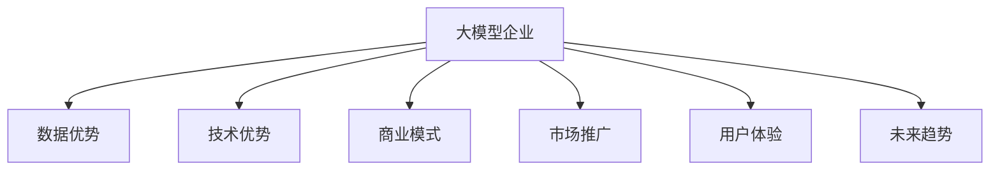

                 

# AI 大模型创业：如何利用竞争优势？

> 关键词：大模型创业、竞争优势、数据优势、技术优势、商业模式、未来趋势、挑战与应对

## 1. 背景介绍

### 1.1 问题由来

随着人工智能技术的快速发展，特别是深度学习、自然语言处理(NLP)、计算机视觉等领域的突破，AI大模型逐步成为推动行业发展的核心引擎。越来越多的初创企业基于AI大模型，试图在各个垂直领域打造新的业务模式，争夺市场份额。如何在众多竞争者中脱颖而出，是每一个大模型创业公司需要深思的问题。

大模型企业之间的竞争，不仅体现在技术实力的比拼，更在于商业模式、市场推广、用户体验等综合实力的较量。本文将从核心概念、算法原理、项目实践、实际应用、工具资源、总结展望等多个维度，深入探讨如何利用大模型的竞争优势，帮助企业建立行业领先地位。

### 1.2 问题核心关键点

在AI大模型创业中，以下几个关键点尤其值得关注：

1. **数据优势**：高质量、多源、标注详细的数据集，是大模型企业最核心的资产之一。有效的数据策略是提升模型性能、拓展应用场景的关键。
2. **技术优势**：包括模型架构、训练算法、优化策略等，技术创新是保持市场竞争力的重要驱动力。
3. **商业模式**：如何将技术优势转化为商业模式，如API服务、SaaS产品、订阅制等，是企业能否长期生存和发展的关键。
4. **市场推广**：如何有效推广产品，吸引更多客户，赢得市场份额，是企业成功的必要条件。
5. **用户体验**：提供稳定可靠、易于使用的产品和服务，是提高用户满意度和忠诚度的基础。
6. **未来趋势**：紧跟技术前沿，积极探索新的应用场景，保持持续创新能力，是企业未来发展的重要保障。

## 2. 核心概念与联系

### 2.1 核心概念概述

为更好地理解AI大模型创业的竞争优势，本节将介绍几个密切相关的核心概念：

- **大模型企业**：指拥有自主研发AI大模型，且以此为核心业务的企业，如OpenAI、Google AI、DeepMind等。
- **数据优势**：高质量、多源、标注详细的数据集，是大模型企业最核心的资产之一。
- **技术优势**：包括模型架构、训练算法、优化策略等，技术创新是保持市场竞争力的重要驱动力。
- **商业模式**：如何将技术优势转化为商业模式，如API服务、SaaS产品、订阅制等，是企业能否长期生存和发展的关键。
- **市场推广**：如何有效推广产品，吸引更多客户，赢得市场份额，是企业成功的必要条件。
- **用户体验**：提供稳定可靠、易于使用的产品和服务，是提高用户满意度和忠诚度的基础。
- **未来趋势**：紧跟技术前沿，积极探索新的应用场景，保持持续创新能力，是企业未来发展的重要保障。

这些核心概念之间的逻辑关系可以通过以下Mermaid流程图来展示：



这个流程图展示了大模型企业竞争优势的核心概念及其之间的关系：

1. 大模型企业通过数据优势和技术优势建立初步竞争优势。
2. 数据优势和技术优势通过商业模式、市场推广和用户体验转化为实际的市场竞争力。
3. 未来趋势进一步推动企业持续创新和战略调整，保持长期竞争优势。

## 3. 核心算法原理 & 具体操作步骤
### 3.1 算法原理概述

AI大模型创业的关键在于如何利用大模型的竞争优势，以下是几个核心算法原理：

1. **数据策略**：
   - **数据收集**：利用爬虫、API、公开数据集等手段，收集多源、高质量的数据。
   - **数据标注**：采用众包、半自动标注等方法，提升标注质量和效率。
   - **数据清洗**：去除噪声、重复数据，确保数据集的一致性和代表性。

2. **模型训练**：
   - **架构设计**：选择合适的模型架构，如Transformer、BERT等，并根据任务需求进行微调。
   - **算法选择**：使用自监督、半监督、监督学习等算法，提升模型泛化能力和表现。
   - **优化策略**：采用梯度下降、AdamW等优化算法，加快模型收敛速度。

3. **模型评估**：
   - **评估指标**：使用精确率、召回率、F1-score等指标，评估模型性能。
   - **交叉验证**：通过交叉验证方法，确保模型在不同数据集上的稳健性。

4. **模型部署**：
   - **模型压缩**：采用剪枝、量化、模型蒸馏等技术，减少模型大小，提高推理速度。
   - **服务封装**：将模型封装为RESTful API或SaaS产品，便于企业内部或外部使用。
   - **持续集成**：建立持续集成/持续部署(CI/CD)流程，确保模型版本管理。

### 3.2 算法步骤详解

AI大模型创业的算法步骤主要包括以下几个关键环节：

**Step 1: 数据收集与处理**
- 使用爬虫、API等手段，收集多源、高质量的数据。
- 采用众包、半自动标注等方法，对数据进行标注，确保数据集的质量和一致性。
- 去除噪声、重复数据，确保数据集的一致性和代表性。

**Step 2: 模型选择与训练**
- 选择合适的模型架构，如Transformer、BERT等，并根据任务需求进行微调。
- 使用自监督、半监督、监督学习等算法，提升模型泛化能力和表现。
- 采用梯度下降、AdamW等优化算法，加快模型收敛速度。

**Step 3: 模型评估与优化**
- 使用精确率、召回率、F1-score等指标，评估模型性能。
- 通过交叉验证方法，确保模型在不同数据集上的稳健性。
- 采用模型压缩、量化等技术，减少模型大小，提高推理速度。

**Step 4: 模型部署与服务封装**
- 将模型封装为RESTful API或SaaS产品，便于企业内部或外部使用。
- 建立持续集成/持续部署(CI/CD)流程，确保模型版本管理。
- 提供完善的文档和用户指南，提升用户体验。

**Step 5: 市场推广与用户反馈**
- 通过市场调研、客户访谈等方式，了解用户需求和市场趋势。
- 制定市场推广策略，吸引更多客户，赢得市场份额。
- 根据用户反馈，不断优化模型和产品，提升用户体验和满意度。

### 3.3 算法优缺点

AI大模型创业的算法具有以下优点：

1. **泛化能力强**：通过多源、高质量的数据和先进的模型架构，大模型具有良好的泛化能力，能够在各种应用场景中取得优异的表现。
2. **技术创新快**：AI大模型企业的技术团队通常拥有丰富的研发经验，可以快速响应市场变化，推出新的产品和服务。
3. **商业模式灵活**：大模型企业可以选择多种商业模式，如API服务、SaaS产品、订阅制等，满足不同客户的需求。
4. **市场响应快**：通过敏捷的开发流程和持续集成，大模型企业可以快速推出新产品，满足市场需求。

同时，大模型创业也存在一些局限性：

1. **数据隐私问题**：数据收集和处理过程中可能涉及用户隐私问题，需要严格遵守法律法规。
2. **计算资源需求高**：大模型的训练和推理需要大量的计算资源，对硬件配置要求高。
3. **市场竞争激烈**：大模型市场竞争激烈，需要不断创新和优化，才能保持竞争力。
4. **用户期望高**：用户对大模型的期望值高，需要在用户体验、服务质量等方面不断提升。

尽管存在这些局限性，但就目前而言，AI大模型创业的方法仍然是最为主流且有效的商业模式之一。未来相关研究的重点在于如何进一步降低计算资源需求，优化用户体验，同时兼顾数据隐私和安全等因素。

### 3.4 算法应用领域

AI大模型创业的算法广泛应用于以下几个领域：

1. **自然语言处理(NLP)**：如情感分析、机器翻译、问答系统等。
2. **计算机视觉(CV)**：如图像分类、目标检测、人脸识别等。
3. **推荐系统**：如电商推荐、新闻推荐等。
4. **医疗健康**：如疾病预测、药物研发等。
5. **金融风控**：如信用评估、欺诈检测等。
6. **智能制造**：如设备预测性维护、质量检测等。

以上领域只是冰山一角，AI大模型在更多场景中都有广阔的应用前景。随着技术的发展和市场的需求，大模型企业将继续在各个垂直领域创造更多价值。

## 4. 数学模型和公式 & 详细讲解  
### 4.1 数学模型构建

为更好地理解AI大模型创业的算法原理，本节将使用数学语言对算法过程进行严格描述。

记大模型为 $M_{\theta}$，其中 $\theta$ 为模型参数。假设数据集 $D=\{(x_i,y_i)\}_{i=1}^N, x_i \in \mathcal{X}, y_i \in \mathcal{Y}$。定义模型在数据集上的损失函数为 $\mathcal{L}(\theta)$，则模型训练的目标是最小化经验风险：

$$
\theta^* = \mathop{\arg\min}_{\theta} \mathcal{L}(\theta)
$$

其中 $\mathcal{L}$ 为针对任务设计的损失函数，用于衡量模型预测输出与真实标签之间的差异。常见的损失函数包括交叉熵损失、均方误差损失等。

具体到数据收集和处理阶段，可以定义一个函数 $\mathcal{F}(x)$ 用于数据预处理，确保数据的一致性和可用性。例如，对于NLP任务，可以使用BERT分词器对文本进行分词和向量表示。

在模型训练阶段，可以选择不同的优化算法和损失函数。例如，使用AdamW优化器，损失函数为交叉熵损失：

$$
\mathcal{L}(\theta) = -\frac{1}{N}\sum_{i=1}^N \log M_{\theta}(x_i)
$$

在模型评估阶段，可以使用精度、召回率、F1-score等指标，评估模型性能。例如：

$$
\text{Precision} = \frac{\text{TP}}{\text{TP}+\text{FP}}
$$

$$
\text{Recall} = \frac{\text{TP}}{\text{TP}+\text{FN}}
$$

$$
\text{F1-score} = 2 \times \frac{\text{Precision} \times \text{Recall}}{\text{Precision}+\text{Recall}}
$$

## 5. 项目实践：代码实例和详细解释说明
### 5.1 开发环境搭建

在进行AI大模型创业的实践前，我们需要准备好开发环境。以下是使用Python进行PyTorch开发的环境配置流程：

1. 安装Anaconda：从官网下载并安装Anaconda，用于创建独立的Python环境。

2. 创建并激活虚拟环境：
```bash
conda create -n pytorch-env python=3.8 
conda activate pytorch-env
```

3. 安装PyTorch：根据CUDA版本，从官网获取对应的安装命令。例如：
```bash
conda install pytorch torchvision torchaudio cudatoolkit=11.1 -c pytorch -c conda-forge
```

4. 安装Transformers库：
```bash
pip install transformers
```

5. 安装各类工具包：
```bash
pip install numpy pandas scikit-learn matplotlib tqdm jupyter notebook ipython
```

完成上述步骤后，即可在`pytorch-env`环境中开始AI大模型创业的实践。

### 5.2 源代码详细实现

下面我们以情感分析任务为例，给出使用Transformers库对BERT模型进行创业实践的PyTorch代码实现。

首先，定义情感分析任务的数据处理函数：

```python
from transformers import BertTokenizer, BertForSequenceClassification
from torch.utils.data import Dataset, DataLoader
import torch

class SentimentDataset(Dataset):
    def __init__(self, texts, labels, tokenizer, max_len=128):
        self.texts = texts
        self.labels = labels
        self.tokenizer = tokenizer
        self.max_len = max_len
        
    def __len__(self):
        return len(self.texts)
    
    def __getitem__(self, item):
        text = self.texts[item]
        label = self.labels[item]
        
        encoding = self.tokenizer(text, return_tensors='pt', max_length=self.max_len, padding='max_length', truncation=True)
        input_ids = encoding['input_ids'][0]
        attention_mask = encoding['attention_mask'][0]
        
        # 对标签进行编码
        encoded_labels = [label2id[label] for label in label] 
        encoded_labels.extend([label2id['negative']] * (self.max_len - len(encoded_labels)))
        labels = torch.tensor(encoded_labels, dtype=torch.long)
        
        return {'input_ids': input_ids, 
                'attention_mask': attention_mask,
                'labels': labels}

# 标签与id的映射
label2id = {'positive': 0, 'negative': 1}
id2label = {v: k for k, v in label2id.items()}

# 创建dataset
tokenizer = BertTokenizer.from_pretrained('bert-base-cased')

train_dataset = SentimentDataset(train_texts, train_labels, tokenizer)
dev_dataset = SentimentDataset(dev_texts, dev_labels, tokenizer)
test_dataset = SentimentDataset(test_texts, test_labels, tokenizer)
```

然后，定义模型和优化器：

```python
from transformers import AdamW

model = BertForSequenceClassification.from_pretrained('bert-base-cased', num_labels=len(label2id))

optimizer = AdamW(model.parameters(), lr=2e-5)
```

接着，定义训练和评估函数：

```python
from tqdm import tqdm
from sklearn.metrics import classification_report

device = torch.device('cuda') if torch.cuda.is_available() else torch.device('cpu')
model.to(device)

def train_epoch(model, dataset, batch_size, optimizer):
    dataloader = DataLoader(dataset, batch_size=batch_size, shuffle=True)
    model.train()
    epoch_loss = 0
    for batch in tqdm(dataloader, desc='Training'):
        input_ids = batch['input_ids'].to(device)
        attention_mask = batch['attention_mask'].to(device)
        labels = batch['labels'].to(device)
        model.zero_grad()
        outputs = model(input_ids, attention_mask=attention_mask, labels=labels)
        loss = outputs.loss
        epoch_loss += loss.item()
        loss.backward()
        optimizer.step()
    return epoch_loss / len(dataloader)

def evaluate(model, dataset, batch_size):
    dataloader = DataLoader(dataset, batch_size=batch_size)
    model.eval()
    preds, labels = [], []
    with torch.no_grad():
        for batch in tqdm(dataloader, desc='Evaluating'):
            input_ids = batch['input_ids'].to(device)
            attention_mask = batch['attention_mask'].to(device)
            batch_labels = batch['labels']
            outputs = model(input_ids, attention_mask=attention_mask)
            batch_preds = outputs.logits.argmax(dim=2).to('cpu').tolist()
            batch_labels = batch_labels.to('cpu').tolist()
            for pred, label in zip(batch_preds, batch_labels):
                preds.append(pred)
                labels.append(label)
                
    print(classification_report(labels, preds))
```

最后，启动训练流程并在测试集上评估：

```python
epochs = 5
batch_size = 16

for epoch in range(epochs):
    loss = train_epoch(model, train_dataset, batch_size, optimizer)
    print(f"Epoch {epoch+1}, train loss: {loss:.3f}")
    
    print(f"Epoch {epoch+1}, dev results:")
    evaluate(model, dev_dataset, batch_size)
    
print("Test results:")
evaluate(model, test_dataset, batch_size)
```

以上就是使用PyTorch对BERT进行情感分析任务创业实践的完整代码实现。可以看到，得益于Transformers库的强大封装，我们可以用相对简洁的代码完成BERT模型的加载和创业实践。

### 5.3 代码解读与分析

让我们再详细解读一下关键代码的实现细节：

**SentimentDataset类**：
- `__init__`方法：初始化文本、标签、分词器等关键组件。
- `__len__`方法：返回数据集的样本数量。
- `__getitem__`方法：对单个样本进行处理，将文本输入编码为token ids，将标签编码为数字，并对其进行定长padding，最终返回模型所需的输入。

**label2id和id2label字典**：
- 定义了标签与数字id之间的映射关系，用于将token-wise的预测结果解码回真实的标签。

**训练和评估函数**：
- 使用PyTorch的DataLoader对数据集进行批次化加载，供模型训练和推理使用。
- 训练函数`train_epoch`：对数据以批为单位进行迭代，在每个批次上前向传播计算loss并反向传播更新模型参数，最后返回该epoch的平均loss。
- 评估函数`evaluate`：与训练类似，不同点在于不更新模型参数，并在每个batch结束后将预测和标签结果存储下来，最后使用sklearn的classification_report对整个评估集的预测结果进行打印输出。

**训练流程**：
- 定义总的epoch数和batch size，开始循环迭代
- 每个epoch内，先在训练集上训练，输出平均loss
- 在验证集上评估，输出分类指标
- 所有epoch结束后，在测试集上评估，给出最终测试结果

可以看到，PyTorch配合Transformers库使得BERT创业实践的代码实现变得简洁高效。开发者可以将更多精力放在数据处理、模型改进等高层逻辑上，而不必过多关注底层的实现细节。

当然，工业级的系统实现还需考虑更多因素，如模型的保存和部署、超参数的自动搜索、更灵活的任务适配层等。但核心的创业实践流程基本与此类似。

## 6. 实际应用场景
### 6.1 智能客服系统

AI大模型创业在智能客服系统的构建上有着巨大的应用潜力。传统客服往往需要配备大量人力，高峰期响应缓慢，且一致性和专业性难以保证。而使用创业实践的大模型微调模型，可以7x24小时不间断服务，快速响应客户咨询，用自然流畅的语言解答各类常见问题。

在技术实现上，可以收集企业内部的历史客服对话记录，将问题和最佳答复构建成监督数据，在此基础上对预训练对话模型进行微调。微调后的对话模型能够自动理解用户意图，匹配最合适的答案模板进行回复。对于客户提出的新问题，还可以接入检索系统实时搜索相关内容，动态组织生成回答。如此构建的智能客服系统，能大幅提升客户咨询体验和问题解决效率。

### 6.2 金融舆情监测

金融机构需要实时监测市场舆论动向，以便及时应对负面信息传播，规避金融风险。传统的人工监测方式成本高、效率低，难以应对网络时代海量信息爆发的挑战。基于AI大模型创业实践的文本分类和情感分析技术，为金融舆情监测提供了新的解决方案。

具体而言，可以收集金融领域相关的新闻、报道、评论等文本数据，并对其进行主题标注和情感标注。在此基础上对创业实践的预训练语言模型进行微调，使其能够自动判断文本属于何种主题，情感倾向是正面、中性还是负面。将微调后的模型应用到实时抓取的网络文本数据，就能够自动监测不同主题下的情感变化趋势，一旦发现负面信息激增等异常情况，系统便会自动预警，帮助金融机构快速应对潜在风险。

### 6.3 个性化推荐系统

当前的推荐系统往往只依赖用户的历史行为数据进行物品推荐，无法深入理解用户的真实兴趣偏好。基于AI大模型创业实践的推荐系统可以更好地挖掘用户行为背后的语义信息，从而提供更精准、多样的推荐内容。

在实践中，可以收集用户浏览、点击、评论、分享等行为数据，提取和用户交互的物品标题、描述、标签等文本内容。将文本内容作为模型输入，用户的后续行为（如是否点击、购买等）作为监督信号，在此基础上对创业实践的预训练语言模型进行微调。微调后的模型能够从文本内容中准确把握用户的兴趣点。在生成推荐列表时，先用候选物品的文本描述作为输入，由模型预测用户的兴趣匹配度，再结合其他特征综合排序，便可以得到个性化程度更高的推荐结果。

### 6.4 未来应用展望

随着AI大模型创业实践的不断发展，基于微调的方法将在更多领域得到应用，为NLP技术带来全新的突破。

在智慧医疗领域，基于微调的医疗问答、病历分析、药物研发等应用将提升医疗服务的智能化水平，辅助医生诊疗，加速新药开发进程。

在智能教育领域，创业实践的微调技术可应用于作业批改、学情分析、知识推荐等方面，因材施教，促进教育公平，提高教学质量。

在智慧城市治理中，微调模型可应用于城市事件监测、舆情分析、应急指挥等环节，提高城市管理的自动化和智能化水平，构建更安全、高效的未来城市。

此外，在企业生产、社会治理、文娱传媒等众多领域，基于大模型创业实践的人工智能应用也将不断涌现，为经济社会发展注入新的动力。相信随着技术的日益成熟，创业实践的微调方法将成为人工智能落地应用的重要范式，推动人工智能技术在垂直行业的规模化落地。总之，创业实践的微调技术需要开发者根据具体任务，不断迭代和优化模型、数据和算法，方能得到理想的效果。

## 7. 工具和资源推荐
### 7.1 学习资源推荐

为了帮助开发者系统掌握AI大模型创业实践的理论基础和实践技巧，这里推荐一些优质的学习资源：

1. 《Transformer从原理到实践》系列博文：由大模型技术专家撰写，深入浅出地介绍了Transformer原理、BERT模型、创业实践等前沿话题。

2. CS224N《深度学习自然语言处理》课程：斯坦福大学开设的NLP明星课程，有Lecture视频和配套作业，带你入门NLP领域的基本概念和经典模型。

3. 《Natural Language Processing with Transformers》书籍：Transformers库的作者所著，全面介绍了如何使用Transformers库进行NLP任务开发，包括创业实践在内的诸多范式。

4. HuggingFace官方文档：Transformers库的官方文档，提供了海量预训练模型和完整的创业实践样例代码，是上手实践的必备资料。

5. CLUE开源项目：中文语言理解测评基准，涵盖大量不同类型的中文NLP数据集，并提供了基于创业实践的baseline模型，助力中文NLP技术发展。

通过对这些资源的学习实践，相信你一定能够快速掌握AI大模型创业实践的精髓，并用于解决实际的NLP问题。
###  7.2 开发工具推荐

高效的开发离不开优秀的工具支持。以下是几款用于AI大模型创业实践开发的常用工具：

1. PyTorch：基于Python的开源深度学习框架，灵活动态的计算图，适合快速迭代研究。大部分预训练语言模型都有PyTorch版本的实现。

2. TensorFlow：由Google主导开发的开源深度学习框架，生产部署方便，适合大规模工程应用。同样有丰富的预训练语言模型资源。

3. Transformers库：HuggingFace开发的NLP工具库，集成了众多SOTA语言模型，支持PyTorch和TensorFlow，是进行创业实践开发的利器。

4. Weights & Biases：模型训练的实验跟踪工具，可以记录和可视化模型训练过程中的各项指标，方便对比和调优。与主流深度学习框架无缝集成。

5. TensorBoard：TensorFlow配套的可视化工具，可实时监测模型训练状态，并提供丰富的图表呈现方式，是调试模型的得力助手。

6. Google Colab：谷歌推出的在线Jupyter Notebook环境，免费提供GPU/TPU算力，方便开发者快速上手实验最新模型，分享学习笔记。

合理利用这些工具，可以显著提升AI大模型创业实践的开发效率，加快创新迭代的步伐。

### 7.3 相关论文推荐

AI大模型创业实践的发展源于学界的持续研究。以下是几篇奠基性的相关论文，推荐阅读：

1. Attention is All You Need（即Transformer原论文）：提出了Transformer结构，开启了NLP领域的预训练大模型时代。

2. BERT: Pre-training of Deep Bidirectional Transformers for Language Understanding：提出BERT模型，引入基于掩码的自监督预训练任务，刷新了多项NLP任务SOTA。

3. Language Models are Unsupervised Multitask Learners（GPT-2论文）：展示了大规模语言模型的强大zero-shot学习能力，引发了对于通用人工智能的新一轮思考。

4. Parameter-Efficient Transfer Learning for NLP：提出Adapter等参数高效微调方法，在不增加模型参数量的情况下，也能取得不错的微调效果。

5. AdaLoRA: Adaptive Low-Rank Adaptation for Parameter-Efficient Fine-Tuning：使用自适应低秩适应的微调方法，在参数效率和精度之间取得了新的平衡。

这些论文代表了大模型创业实践的发展脉络。通过学习这些前沿成果，可以帮助研究者把握学科前进方向，激发更多的创新灵感。

## 8. 总结：未来发展趋势与挑战

### 8.1 总结

本文对AI大模型创业实践的竞争优势进行了全面系统的介绍。首先阐述了AI大模型创业的背景和意义，明确了创业实践在提升模型性能、拓展应用场景方面的独特价值。其次，从原理到实践，详细讲解了创业实践的数学原理和关键步骤，给出了创业实践任务开发的完整代码实例。同时，本文还广泛探讨了创业实践在智能客服、金融舆情、个性化推荐等多个行业领域的应用前景，展示了创业实践的巨大潜力。此外，本文精选了创业实践的学习资源，力求为读者提供全方位的技术指引。

通过本文的系统梳理，可以看到，AI大模型创业实践在大规模预训练语言模型的基础上，通过微调、优化、部署等环节，能够迅速构建高效、灵活、智能的AI系统。其竞争优势不仅体现在模型本身的性能提升，更在于能够快速适应多变的市场需求，提供稳定的服务保障。未来，伴随技术的发展和市场的需求，AI大模型创业实践必将在更多领域发挥重要作用，推动人工智能技术的产业化进程。

### 8.2 未来发展趋势

展望未来，AI大模型创业实践的发展趋势将包括以下几个方面：

1. **数据驱动**：随着数据收集和处理技术的进步，大数据、多源数据、实时数据将进一步提升模型的性能和泛化能力。
2. **技术创新**：AI大模型创业实践将继续引领技术前沿，包括新的模型架构、训练算法、优化策略等，推动行业技术进步。
3. **应用拓展**：AI大模型创业实践将不断拓展到更多领域，如智慧医疗、智能教育、智慧城市等，推动各行各业数字化转型。
4. **平台化建设**：构建开放、易用的AI平台，降低企业使用门槛，推动AI技术在企业中的应用普及。
5. **商业模式多样化**：除了API服务、SaaS产品、订阅制等传统模式，还将涌现更多创新的商业模式，满足不同客户需求。
6. **生态系统完善**：建立完善的生态系统，包括数据提供商、技术供应商、应用开发者等，共同推动AI技术的发展和落地。

以上趋势凸显了AI大模型创业实践的广阔前景。这些方向的探索发展，必将进一步提升AI系统的性能和应用范围，为人类认知智能的进化带来深远影响。

### 8.3 面临的挑战

尽管AI大模型创业实践已经取得了瞩目成就，但在迈向更加智能化、普适化应用的过程中，它仍面临诸多挑战：

1. **数据隐私问题**：数据收集和处理过程中可能涉及用户隐私问题，需要严格遵守法律法规。
2. **计算资源需求高**：大模型的训练和推理需要大量的计算资源，对硬件配置要求高。
3. **市场竞争激烈**：大模型市场竞争激烈，需要不断创新和优化，才能保持竞争力。
4. **用户体验问题**：模型需要快速响应用户需求，并提供稳定可靠的服务，提升用户体验和满意度。
5. **伦理和安全性**：模型需要避免有害信息输出，遵守伦理道德规范，确保使用的安全性。

尽管存在这些挑战，但就目前而言，AI大模型创业实践的方法仍然是最为主流且有效的商业模式之一。未来相关研究的重点在于如何进一步降低计算资源需求，优化用户体验，同时兼顾数据隐私和安全等因素。

### 8.4 研究展望

面对AI大模型创业实践所面临的种种挑战，未来的研究需要在以下几个方面寻求新的突破：

1. **数据隐私保护**：开发更高效的数据隐私保护技术，确保数据收集和使用过程中用户的隐私权益。
2. **资源优化**：进一步优化模型的计算图和推理过程，降低计算资源需求，提升计算效率。
3. **模型解释性**：研究模型解释性技术，提升模型的透明度和可信度，满足用户和监管的需求。
4. **跨领域迁移**：研究模型跨领域迁移技术，提升模型在多领域的泛化能力和适用性。
5. **伦理和安全**：研究模型伦理和安全机制，确保模型在应用中的行为符合人类价值观和伦理道德。

这些研究方向的探索，必将引领AI大模型创业实践技术的不断进步，推动AI技术在更多领域的落地应用。

## 9. 附录：常见问题与解答

**Q1：AI大模型创业的竞争优势主要体现在哪些方面？**

A: AI大模型创业的竞争优势主要体现在以下几个方面：

1. **数据优势**：高质量、多源、标注详细的数据集，是大模型企业最核心的资产之一。有效的数据策略是提升模型性能、拓展应用场景的关键。
2. **技术优势**：包括模型架构、训练算法、优化策略等，技术创新是保持市场竞争力的重要驱动力。
3. **商业模式优势**：如何利用技术优势转化为商业模式，如API服务、SaaS产品、订阅制等，是企业能否长期生存和发展的关键。

这些竞争优势共同构成了AI大模型创业的核心竞争力，使企业在激烈的市场竞争中能够脱颖而出。

**Q2：AI大模型创业面临的主要挑战是什么？**

A: AI大模型创业面临的主要挑战包括：

1. **数据隐私问题**：数据收集和处理过程中可能涉及用户隐私问题，需要严格遵守法律法规。
2. **计算资源需求高**：大模型的训练和推理需要大量的计算资源，对硬件配置要求高。
3. **市场竞争激烈**：大模型市场竞争激烈，需要不断创新和优化，才能保持竞争力。
4. **用户体验问题**：模型需要快速响应用户需求，并提供稳定可靠的服务，提升用户体验和满意度。
5. **伦理和安全性**：模型需要避免有害信息输出，遵守伦理道德规范，确保使用的安全性。

这些挑战需要企业在技术、业务、法律、伦理等多个维度进行全面应对，才能确保创业实践的成功。

**Q3：如何提升AI大模型的泛化能力和泛化性能？**

A: 提升AI大模型的泛化能力和泛化性能主要可以从以下几个方面入手：

1. **数据收集与处理**：收集高质量、多源、标注详细的数据集，确保数据的一致性和代表性。
2. **模型选择与设计**：选择适合任务的模型架构，并根据任务需求进行微调。
3. **优化策略**：采用自监督、半监督、监督学习等算法，提升模型泛化能力和表现。
4. **模型评估与优化**：使用精度、召回率、F1-score等指标，评估模型性能，并进行持续优化。
5. **数据增强**：通过回译、近义替换等方式扩充训练集，提升模型泛化能力。

这些措施可以帮助模型更好地泛化到未见过的数据，提升整体性能和应用效果。

**Q4：AI大模型创业的商业模式主要有哪些？**

A: AI大模型创业的商业模式主要包括以下几种：

1. **API服务**：通过开放API接口，允许外部开发者调用模型进行预测、推理等操作。
2. **SaaS产品**：提供基于云的服务，用户可以通过Web界面或API接口使用模型功能。
3. **订阅制**：用户按月或按年订阅服务，享受持续的技术支持和更新。
4. **定制开发**：根据客户需求，提供定制化的模型开发和集成服务。
5. **数据服务**：提供数据收集、标注、清洗等增值服务，帮助客户快速构建自己的AI模型。

这些商业模式各有优劣，企业需要根据自身情况选择最适合的策略。

**Q5：AI大模型创业的持续创新策略有哪些？**

A: AI大模型创业的持续创新策略主要包括以下几点：

1. **技术跟踪**：密切关注AI领域的最新研究进展，及时引入前沿技术。
2. **用户反馈**：收集用户反馈，了解实际应用中的痛点和需求，持续改进模型和产品。
3. **跨领域合作**：与其他领域的技术供应商和客户合作，拓展应用场景，提升模型性能。
4. **持续优化**：定期对模型和算法进行优化，提升模型性能和应用效果。
5. **人才培养**：吸引和培养优秀的技术人才，确保技术团队的持续创新能力。

这些策略可以帮助企业保持持续创新，不断提高市场竞争力。

---

作者：禅与计算机程序设计艺术 / Zen and the Art of Computer Programming

