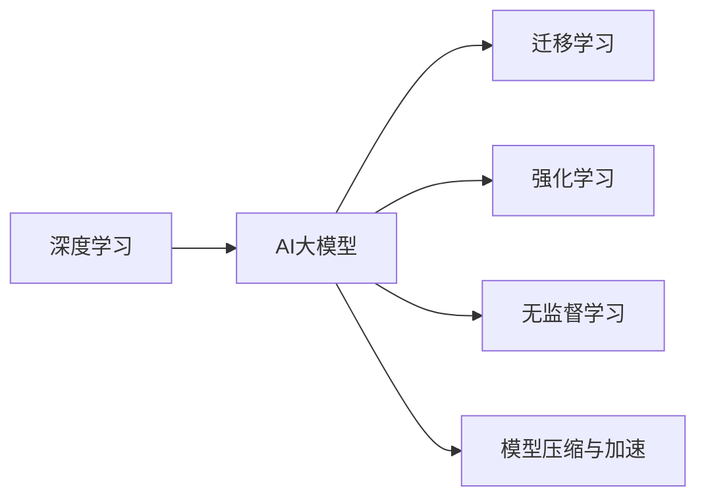

                 

# AI 大模型创业：如何利用管理优势？

在当下这个数据驱动的时代，人工智能大模型成为创业公司的核心竞争力。利用好这些先进的技术，同时强化管理优势，是实现持续发展和创新的关键。本文将从大模型技术的核心概念、实际应用、管理优势以及未来发展趋势四个方面进行全面探讨，希望能为AI大模型创业者提供一些有益的参考。

## 1. 背景介绍

随着人工智能技术的迅猛发展，AI大模型在各个领域的应用场景越来越广泛。从自然语言处理、计算机视觉到语音识别、图像处理，大模型都在不断刷新技术上限。然而，技术只是成功的一部分，好的管理同样不可忽视。

大模型技术虽然发展迅速，但研发、部署和维护的成本相对较高。企业需要建立起有效的管理体系，才能真正将技术优势转化为商业价值。本文将从技术原理和管理优势两个维度，深入探讨大模型创业的核心要素。

## 2. 核心概念与联系

### 2.1 核心概念概述

**AI大模型**：基于大规模数据训练的神经网络模型，具有极高的通用性和泛化能力，能够在各种任务上表现优异。

**深度学习**：一种机器学习方法，通过多层神经网络对数据进行学习和特征提取，实现复杂任务的自动化。

**迁移学习**：将一个领域学到的知识，迁移应用到另一个相关领域的学习过程。

**强化学习**：通过与环境交互，智能体学习如何最大化奖励的方法。

**无监督学习**：使用未标注的数据，通过自动编码器、聚类等方法进行特征学习。

**模型压缩与加速**：通过剪枝、量化、蒸馏等技术，减少模型参数，提升模型推理效率。

这些概念构成了AI大模型的基础框架，通过合理的管理手段，可以有效提升技术开发和应用的效率。

### 2.2 核心概念联系

上述概念之间有着紧密的联系。例如，深度学习和大模型都是利用神经网络进行特征提取，迁移学习可以加速大模型的泛化能力，强化学习可以提升模型的决策能力，无监督学习可以用于数据预处理和特征提取，模型压缩与加速可以提升模型的推理效率。

如下图所示，这些概念通过管理手段整合，形成了一个有机的整体，为AI大模型的创业提供了坚实的基础。



## 3. 核心算法原理 & 具体操作步骤

### 3.1 算法原理概述

AI大模型一般采用深度学习框架进行训练，利用反向传播算法进行模型参数优化。其核心算法包括：

- **前向传播**：将输入数据传递到神经网络中，计算输出结果。
- **损失函数**：衡量模型输出与真实标签之间的差异，常用的有交叉熵、均方误差等。
- **反向传播**：计算模型输出与损失函数之间的梯度，更新模型参数。
- **优化器**：如SGD、Adam等，用于控制模型参数的更新。
- **正则化**：如L2正则、Dropout等，防止模型过拟合。

通过这些算法，AI大模型能够从大规模数据中学习到复杂的特征表示，实现高精度的预测和决策。

### 3.2 算法步骤详解

以自然语言处理（NLP）任务为例，AI大模型的训练流程大致如下：

1. **数据预处理**：清洗和标准化数据，分词、词向量化等。
2. **模型训练**：利用前向传播和反向传播算法，最小化损失函数，更新模型参数。
3. **评估与调优**：使用验证集评估模型性能，根据结果调整模型架构和超参数。
4. **模型部署**：将训练好的模型部署到生产环境，进行实时推理。
5. **监控与迭代**：持续监控模型性能，根据新数据和新需求进行模型迭代和优化。

### 3.3 算法优缺点

**优点**：
- **高泛化能力**：大模型能够从大规模数据中学习到丰富的知识，具有较强的泛化能力。
- **自动特征提取**：无需手动设计特征，自动提取数据中的高级特征。
- **可扩展性强**：随着数据的增加和技术的进步，模型可以不断进行迭代优化。

**缺点**：
- **训练时间长**：大规模模型需要大量的计算资源和时间进行训练。
- **数据依赖性强**：模型性能高度依赖于训练数据的数量和质量。
- **内存占用大**：模型参数量大，推理时需要较大的内存空间。

### 3.4 算法应用领域

AI大模型在多个领域都有广泛应用，包括但不限于：

- **自然语言处理**：机器翻译、文本分类、情感分析等。
- **计算机视觉**：图像识别、目标检测、图像生成等。
- **语音识别**：语音转文本、语音合成等。
- **推荐系统**：个性化推荐、广告投放等。
- **智能机器人**：语音交互、图像识别、路径规划等。

## 4. 数学模型和公式 & 详细讲解 & 举例说明

### 4.1 数学模型构建

以线性回归模型为例，其数学模型可以表示为：

$$
y = \beta_0 + \beta_1 x_1 + \beta_2 x_2 + ... + \beta_n x_n + \epsilon
$$

其中 $y$ 为目标变量，$x_i$ 为特征变量，$\beta_i$ 为模型参数，$\epsilon$ 为误差项。

### 4.2 公式推导过程

线性回归模型的最小二乘法损失函数为：

$$
L(\theta) = \frac{1}{2N} \sum_{i=1}^N (y_i - \hat{y}_i)^2
$$

其中 $\theta$ 为模型参数，$\hat{y}_i$ 为模型预测值。

通过梯度下降算法，求解损失函数的最小值，即可得到模型参数：

$$
\theta = \mathop{\arg\min}_{\theta} L(\theta)
$$

### 4.3 案例分析与讲解

假设有一个电商网站，需要预测用户的购买概率。使用大模型进行训练，可以将其转化为二分类任务。使用sigmoid函数将模型输出转换为概率值：

$$
p(y=1|x) = \sigma(z)
$$

其中 $z = \beta_0 + \beta_1 x_1 + \beta_2 x_2 + ... + \beta_n x_n$。

将训练数据分为训练集、验证集和测试集，使用交叉验证法进行模型调优。最终，将训练好的模型部署到生产环境，实时预测用户的购买概率。

## 5. 项目实践：代码实例和详细解释说明

### 5.1 开发环境搭建

为了快速搭建开发环境，可以采用Docker容器技术。通过以下命令，可以创建Docker镜像：

```bash
docker build -t ai_model .
```

### 5.2 源代码详细实现

假设使用TensorFlow框架，代码示例如下：

```python
import tensorflow as tf
from tensorflow.keras import layers

# 构建模型
model = tf.keras.Sequential()
model.add(layers.Dense(64, activation='relu', input_shape=(100,)))
model.add(layers.Dense(1, activation='sigmoid'))

# 编译模型
model.compile(optimizer=tf.keras.optimizers.Adam(0.001), loss='binary_crossentropy', metrics=['accuracy'])

# 训练模型
model.fit(train_data, train_labels, epochs=10, validation_data=(val_data, val_labels))
```

### 5.3 代码解读与分析

上述代码构建了一个包含两个全连接层的神经网络模型，使用Adam优化器进行训练，交叉熵作为损失函数。在训练过程中，使用交叉验证法进行调优，最终得到预测模型。

## 6. 实际应用场景

### 6.1 智能客服系统

利用AI大模型，可以实现智能客服系统的自动化。通过收集历史客服数据，训练出具有语音识别、自然语言理解能力的模型，客户可以与系统进行自然对话。

### 6.2 金融风控

金融机构可以利用AI大模型，对贷款申请、交易行为等进行风险评估。通过训练模型，预测借款人的违约概率，从而优化贷款审批流程，降低风险。

### 6.3 推荐系统

AI大模型可以用于个性化推荐系统，分析用户行为数据，推荐相关商品或服务。通过实时学习用户的喜好，提升用户体验，增加销售额。

### 6.4 未来应用展望

随着AI大模型的不断发展，未来的应用场景将更加广泛。例如，在医疗领域，AI大模型可以用于疾病诊断、药物研发等；在教育领域，AI大模型可以用于智能辅导、作业批改等。

## 7. 工具和资源推荐

### 7.1 学习资源推荐

- TensorFlow官方文档：提供丰富的教程和示例代码。
- PyTorch官方文档：提供简洁易懂的API和文档。
- Coursera《深度学习专项课程》：由Andrew Ng主讲，系统介绍深度学习基础和实践。
- arXiv预印本库：最新研究论文和代码，保持技术前沿。

### 7.2 开发工具推荐

- Docker：用于快速搭建开发环境，提供容器化技术。
- TensorBoard：可视化模型训练过程，帮助调优模型。
- Weights & Biases：监控模型训练过程，提供实验跟踪功能。

### 7.3 相关论文推荐

- "Deep Learning" by Ian Goodfellow、Yoshua Bengio和Aaron Courville。
- "Neural Networks and Deep Learning" by Michael Nielsen。
- "Programming, Computer and Information Science" by P. L. Knuth。

## 8. 总结：未来发展趋势与挑战

### 8.1 研究成果总结

AI大模型已经成为人工智能领域的重要技术之一，具有高度的通用性和泛化能力。通过合理的管理手段，可以显著提升技术开发和应用的效率。

### 8.2 未来发展趋势

1. **多模态融合**：未来的AI大模型将具备视觉、语音等多模态数据的处理能力。
2. **自适应学习**：模型能够根据环境变化进行自适应学习，提升模型的泛化能力。
3. **边缘计算**：将AI大模型部署在边缘设备上，提升实时推理能力。
4. **自动化调优**：利用自动化工具，优化模型架构和超参数。
5. **联邦学习**：多设备协同学习，提升数据隐私和安全。

### 8.3 面临的挑战

1. **计算资源**：大规模模型需要大量的计算资源进行训练和推理。
2. **数据隐私**：大规模数据处理和存储需要考虑数据隐私和安全问题。
3. **模型可解释性**：AI大模型通常缺乏可解释性，难以理解其内部工作机制。
4. **模型鲁棒性**：模型容易受到噪声数据和对抗样本的影响，需要提升鲁棒性。
5. **管理复杂度**：模型的开发和维护需要复杂的项目管理手段。

### 8.4 研究展望

未来的研究将重点关注以下几个方面：

1. **模型压缩与加速**：通过剪枝、量化、蒸馏等技术，提升模型的推理效率。
2. **模型自动化调优**：利用自动化工具，优化模型架构和超参数。
3. **多设备协同学习**：利用联邦学习、边缘计算等技术，提升数据隐私和安全。
4. **模型可解释性**：引入因果分析、可解释AI等方法，提升模型的可解释性。
5. **跨领域迁移学习**：研究模型在不同领域之间的迁移学习，提升模型的泛化能力。

## 9. 附录：常见问题与解答

**Q1: 什么是AI大模型？**

A: AI大模型是基于大规模数据训练的神经网络模型，具有极高的通用性和泛化能力，能够在各种任务上表现优异。

**Q2: 如何优化AI大模型的训练过程？**

A: 优化AI大模型的训练过程，可以从数据预处理、模型架构设计、超参数调优等方面入手。

**Q3: 如何提升AI大模型的推理效率？**

A: 提升AI大模型的推理效率，可以采用模型压缩、剪枝、量化等技术，减少模型参数和计算量。

**Q4: 如何确保AI大模型的数据隐私和安全？**

A: 确保AI大模型的数据隐私和安全，可以通过数据脱敏、联邦学习、边缘计算等技术，保护用户数据。

**Q5: 如何提升AI大模型的可解释性？**

A: 提升AI大模型的可解释性，可以引入因果分析、可解释AI等方法，提供模型输出解释。

---
作者：禅与计算机程序设计艺术 / Zen and the Art of Computer Programming

