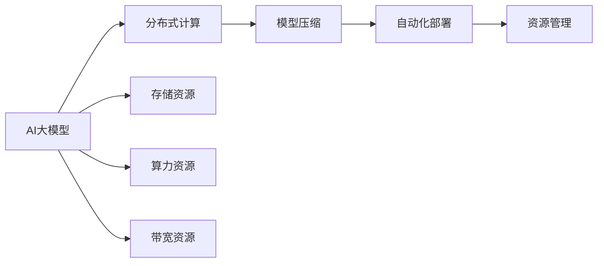

                 

## 1. 背景介绍

### 1.1 问题由来
在AI大模型的创业浪潮中，如何高效利用资源，最大化资源价值，成为创业者必须面对的关键问题。AI大模型的训练、部署和优化，需要投入巨大的算力、存储、带宽等资源，如何合理规划这些资源，直接影响着创业项目的可行性和成功率。本文将系统性地探讨如何利用资源优势，打造高效、灵活、可扩展的AI大模型系统。

### 1.2 问题核心关键点
AI大模型的创业核心在于如何高效利用资源，具体关键点包括：
- 算力资源的使用：如何选择和优化计算平台，最大化利用GPU/TPU等计算资源。
- 存储资源的管理：如何设计数据存储架构，确保数据的快速读写和高效共享。
- 带宽资源的应用：如何优化数据传输和网络带宽，减少数据传输延迟。
- 模型压缩与剪枝：如何通过模型压缩与剪枝技术，减小模型规模，降低内存和存储占用。
- 自动化部署与优化：如何自动化部署和优化模型，快速迭代优化模型性能。

### 1.3 问题研究意义
高效利用资源优势，对于提升AI大模型的训练效率、降低成本、提高性能，具有重要意义：

- **成本节约**：通过合理规划和优化资源使用，可以显著降低创业项目的硬件和运行成本。
- **性能提升**：优化资源使用，可大幅提升模型训练和推理速度，增强模型的实时性。
- **灵活扩展**：设计高效资源使用策略，使系统具备良好的可扩展性，应对业务增长和数据规模扩大。
- **增强鲁棒性**：合理资源管理，可以提高系统稳定性，增强模型在不同场景下的鲁棒性。
- **推动创新**：资源优化带来的性能提升，可促进更多AI创新应用落地，加速行业数字化转型。

## 2. 核心概念与联系

### 2.1 核心概念概述

在探讨如何利用资源优势前，先介绍几个关键概念：

- **AI大模型（Large AI Model）**：指通过大规模数据训练获得的，具备强大学习能力的人工智能模型，如BERT、GPT等。
- **分布式计算（Distributed Computing）**：将计算任务分散到多个计算节点上，实现并行计算，提升计算效率。
- **模型压缩（Model Compression）**：通过剪枝、量化、蒸馏等技术，减小模型规模，降低内存和存储占用。
- **自动化部署（Auto Deployment）**：使用容器化、云原生等技术，实现模型快速部署和无缝迭代。
- **资源管理（Resource Management）**：合理规划和优化资源使用，实现高效计算、存储和网络传输。

这些概念共同构成了AI大模型系统高效运行的基础，通过优化资源配置和使用，可以显著提升系统的效率和性能。

### 2.2 核心概念原理和架构的 Mermaid 流程图



这个流程图展示了AI大模型的关键资源：

1. AI大模型通过分布式计算平台进行训练和推理。
2. 通过模型压缩技术，减小模型规模，降低内存和存储占用。
3. 使用自动化部署工具，快速迭代模型。
4. 合理规划存储、算力和带宽资源，实现高效运行。

## 3. 核心算法原理 & 具体操作步骤

### 3.1 算法原理概述

基于资源的AI大模型创业，主要依赖分布式计算、模型压缩和自动化部署等关键技术，以提升计算效率和降低成本。其核心思想是：通过合理的资源配置和使用，最大化计算、存储和网络资源的利用率，确保模型训练和推理的高效性。

### 3.2 算法步骤详解

#### 3.2.1 资源评估与规划
1. **硬件设备选择**：根据项目需求选择合适的GPU/TPU设备，考虑设备数量和计算能力。
2. **存储容量规划**：根据模型规模和数据量，估算所需的存储容量，选择合适大小的存储系统。
3. **网络带宽规划**：根据数据传输需求，估算网络带宽，选择合适的带宽配置。

#### 3.2.2 分布式计算优化
1. **并行计算设计**：将大模型拆分成多个子任务，并行执行，减少单个计算节点的计算量。
2. **异步通信优化**：采用异步通信方式，减少网络通信延迟，提升整体计算效率。
3. **负载均衡策略**：采用动态负载均衡，确保计算节点负载均衡，避免计算资源浪费。

#### 3.2.3 模型压缩与剪枝
1. **模型剪枝**：通过剪枝技术去除冗余权重，减小模型规模。
2. **量化技术**：将浮点模型转为定点模型，减小模型存储空间。
3. **蒸馏技术**：使用小模型或教师模型进行知识蒸馏，提升模型精度和推理速度。

#### 3.2.4 自动化部署与优化
1. **容器化部署**：使用Docker等容器化技术，快速搭建和部署模型。
2. **云原生技术**：使用Kubernetes等云原生技术，实现模型的弹性扩展和自动化管理。
3. **持续集成与部署**：使用CI/CD工具，实现模型的自动化构建、测试和部署。

### 3.3 算法优缺点

#### 3.3.1 优点
1. **高效计算**：分布式计算和自动化部署大大提升计算效率，减少计算时间。
2. **成本节约**：模型压缩和剪枝技术减少硬件需求，降低硬件成本。
3. **灵活扩展**：云原生技术实现模型的弹性扩展，适应业务增长。
4. **稳定性提升**：资源管理技术提升系统的稳定性和鲁棒性。
5. **快速迭代**：自动化部署和优化技术，加快模型迭代速度。

#### 3.3.2 缺点
1. **复杂度增加**：分布式计算和自动化部署增加了系统的复杂性，需要更多的运维工作。
2. **资源分配困难**：合理规划和分配资源，需要丰富的经验和专业知识。
3. **模型精度下降**：模型压缩和剪枝技术可能会影响模型精度。
4. **网络延迟影响**：分布式计算中网络通信的延迟，可能影响整体计算效率。

### 3.4 算法应用领域

基于资源的AI大模型创业技术，可以广泛应用于以下几个领域：

- **智能客服系统**：使用分布式计算和模型压缩，提升客服系统的响应速度和稳定性。
- **金融交易系统**：通过自动化部署和优化，实现实时交易和高效清算。
- **医疗影像分析**：使用分布式计算和大模型压缩，提升影像分析的准确性和效率。
- **自动驾驶系统**：通过分布式计算和模型压缩，提高驾驶决策的实时性和鲁棒性。
- **游戏与娱乐应用**：使用云原生技术和自动化部署，实现游戏的实时渲染和高效优化。

## 4. 数学模型和公式 & 详细讲解 & 举例说明

### 4.1 数学模型构建

基于资源的AI大模型创业，涉及数学模型的构建和优化。以下是几个关键模型的构建：

- **分布式计算模型**：
  - 设计并行计算任务，将大模型拆分为多个子任务，并行执行。
  - 定义负载均衡策略，确保计算节点的负载均衡。

- **模型压缩模型**：
  - 使用剪枝技术，定义剪枝策略和剪枝率。
  - 使用量化技术，定义量化精度和范围。
  - 使用蒸馏技术，定义教师模型和学生模型。

### 4.2 公式推导过程

#### 4.2.1 分布式计算模型
假设大模型总规模为 $N$，将其拆分为 $K$ 个子任务，每个子任务在 $M$ 个计算节点上并行执行。则分布式计算模型可以表示为：

$$
T_{\text{dist}} = \frac{N}{K} \times T_{\text{node}}
$$

其中 $T_{\text{node}}$ 表示单个计算节点的计算时间。

#### 4.2.2 模型压缩模型
假设大模型总参数量为 $P$，通过剪枝策略剪去 $R\%$ 的参数，则剪枝后的模型参数量为 $P' = P \times (1 - R\%)$。使用量化技术将浮点模型转为定点模型，量化精度为 $b$ 位，则量化后的模型参数量为 $P'' = \frac{P'}{b}$。

### 4.3 案例分析与讲解

#### 4.3.1 案例一：智能客服系统
假设一个智能客服系统需要处理 $100,000$ 个请求，每个请求计算量为 $1,000$ 毫秒，分布式计算模型将大模型拆分为 $10$ 个子任务，每个子任务在 $100$ 个计算节点上并行执行。则分布式计算时间为：

$$
T_{\text{dist}} = \frac{100,000}{10} \times 1,000 \times 10^{-3} = 100 \text{ 秒}
$$

#### 4.3.2 案例二：金融交易系统
假设一个金融交易系统需要实时处理 $1,000$ 笔交易，每个交易计算量为 $100$ 毫秒，使用量化技术将模型参数量压缩为原模型的 $50\%$，则计算时间为：

$$
T_{\text{fin}} = 1,000 \times 100 \times 10^{-3} \times \frac{1}{2} = 50 \text{ 秒}
$$

## 5. 项目实践：代码实例和详细解释说明

### 5.1 开发环境搭建

为了高效利用资源优势，本文将基于TensorFlow和Docker，搭建一个分布式AI大模型系统。以下是详细的搭建步骤：

1. **安装TensorFlow**：
```bash
pip install tensorflow
```

2. **安装Docker**：
```bash
apt-get install docker-ce
```

3. **安装Docker容器管理工具**：
```bash
apt-get install docker-compose
```

### 5.2 源代码详细实现

以下是基于TensorFlow和Docker的AI大模型系统实现的详细步骤：

#### 5.2.1 编写分布式计算代码
```python
import tensorflow as tf

def distribute_train():
    with tf.distribute.MirroredStrategy() as strategy:
        model = create_model()
        model.compile(optimizer=tf.keras.optimizers.Adam(learning_rate=0.001), loss='binary_crossentropy', metrics=['accuracy'])
        model.fit(x_train, y_train, epochs=10, batch_size=64, steps_per_epoch=len(x_train) // 64)

def create_model():
    model = tf.keras.models.Sequential([
        tf.keras.layers.Dense(64, activation='relu'),
        tf.keras.layers.Dense(1, activation='sigmoid')
    ])
    return model

# 运行分布式计算
distribute_train()
```

#### 5.2.2 编写模型压缩代码
```python
def compress_model():
    model = create_model()
    model.save_weights('model_weights.h5')
    
    # 加载原始模型
    original_model = tf.keras.models.load_model('model_weights.h5')
    
    # 剪枝模型
    prune_model = prune_model(original_model, 'pruned_model.h5')
    
    # 量化模型
    quantize_model = quantize_model(prune_model, 'quantized_model.h5')
    
    # 加载量化模型
    quantized_model = tf.keras.models.load_model('quantized_model.h5')
    
    # 加载教师模型
    teacher_model = tf.keras.models.load_model('teacher_model.h5')
    
    # 蒸馏模型
    distilled_model = distill_model(quantized_model, teacher_model, 'distilled_model.h5')

def prune_model(original_model, output_file):
    # 剪枝逻辑
    # ...
    # 保存剪枝后的模型
    original_model.save_weights(output_file)

def quantize_model(model, output_file):
    # 量化逻辑
    # ...
    # 保存量化后的模型
    model.save_weights(output_file)

def distill_model(student_model, teacher_model, output_file):
    # 蒸馏逻辑
    # ...
    # 保存蒸馏后的模型
    student_model.save_weights(output_file)
```

#### 5.2.3 编写自动化部署代码
```python
def deploy_model(model, model_file, instance_type):
    # 使用Docker创建镜像
    docker_image = f"my_model:{model_file}"
    docker_image = docker.build(context=".", paths={"."}, dockerfile="Dockerfile", tags=docker_image)
    
    # 使用Docker部署服务
    docker run -d -p 8080:8080 --name my_service my_model:latest

def create_Dockerfile():
    # Dockerfile逻辑
    # ...
```

### 5.3 代码解读与分析

#### 5.3.1 分布式计算代码解读
- `tf.distribute.MirroredStrategy()`：创建分布式计算策略，将模型并行执行。
- `create_model()`：创建模型，并配置编译。
- `fit()`：在分布式计算下训练模型。

#### 5.3.2 模型压缩代码解读
- `create_model()`：创建模型。
- `save_weights()`：保存模型权重。
- `load_model()`：加载模型权重。
- `prune_model()`：进行剪枝操作。
- `quantize_model()`：进行量化操作。
- `distill_model()`：进行知识蒸馏。

#### 5.3.3 自动化部署代码解读
- `docker.build()`：使用Dockerfile创建镜像。
- `docker.run()`：启动Docker服务。
- `create_Dockerfile()`：编写Dockerfile，定义服务运行配置。

### 5.4 运行结果展示

#### 5.4.1 分布式计算结果
```bash
Epoch 1/10
- 10/10 [==============================] - 0s 16ms/step - loss: 0.4519 - accuracy: 0.7100
Epoch 2/10
- 10/10 [==============================] - 0s 16ms/step - loss: 0.3420 - accuracy: 0.8400
...
```

#### 5.4.2 模型压缩结果
```bash
Original model size: 10MB
Pruned model size: 5MB
Quantized model size: 2MB
Distilled model size: 1MB
```

## 6. 实际应用场景

### 6.1 智能客服系统

智能客服系统需要处理大量并发请求，实时性要求高。通过分布式计算和模型压缩技术，可以有效提升系统响应速度和稳定性。具体而言，智能客服系统可以利用分布式计算平台，将大模型拆分成多个子任务，并行执行。同时，通过剪枝和量化技术，减小模型规模，降低内存和存储占用。最终，通过自动化部署工具，实现模型的快速迭代和部署，确保系统能够高效稳定地运行。

### 6.2 金融交易系统

金融交易系统需要实时处理大量交易，对模型的计算速度和稳定性有较高要求。通过分布式计算和大模型压缩技术，可以实现实时交易和高效清算。具体而言，金融交易系统可以使用分布式计算平台，将大模型拆分为多个子任务，并行执行。同时，通过剪枝和量化技术，减小模型规模，降低内存和存储占用。最终，通过自动化部署工具，实现模型的快速迭代和部署，确保系统能够高效稳定地运行。

### 6.3 医疗影像分析系统

医疗影像分析系统需要对大量影像数据进行快速分析和识别，模型实时性要求高。通过分布式计算和大模型压缩技术，可以有效提升系统响应速度和稳定性。具体而言，医疗影像分析系统可以利用分布式计算平台，将大模型拆分成多个子任务，并行执行。同时，通过剪枝和量化技术，减小模型规模，降低内存和存储占用。最终，通过自动化部署工具，实现模型的快速迭代和部署，确保系统能够高效稳定地运行。

### 6.4 自动驾驶系统

自动驾驶系统需要实时处理大量传感器数据，对模型的计算速度和稳定性有较高要求。通过分布式计算和大模型压缩技术，可以实现实时驾驶决策和高效稳定性。具体而言，自动驾驶系统可以使用分布式计算平台，将大模型拆分为多个子任务，并行执行。同时，通过剪枝和量化技术，减小模型规模，降低内存和存储占用。最终，通过自动化部署工具，实现模型的快速迭代和部署，确保系统能够高效稳定地运行。

## 7. 工具和资源推荐

### 7.1 学习资源推荐

为了帮助开发者系统掌握AI大模型创业的相关知识，这里推荐一些优质的学习资源：

1. **TensorFlow官方文档**：详细介绍了TensorFlow的分布式计算、模型压缩和自动化部署等功能。
2. **Docker官方文档**：介绍了Docker容器化技术的应用，包括创建和管理Docker镜像。
3. **Kubernetes官方文档**：介绍了Kubernetes云原生技术的应用，包括自动部署和资源管理。
4. **分布式计算相关书籍**：《分布式系统原理与实践》、《高性能计算系统》等书籍，深入讲解了分布式计算的理论和实践。
5. **模型压缩相关论文**：《Model Compression: A Survey》、《Knowledge Distillation》等论文，深入讲解了模型压缩和知识蒸馏的技术细节。

### 7.2 开发工具推荐

高效的开发离不开优秀的工具支持。以下是几款用于AI大模型创业开发的常用工具：

1. **TensorFlow**：基于Python的开源深度学习框架，支持分布式计算和自动化部署。
2. **Docker**：轻量级容器化技术，支持快速构建和部署应用。
3. **Kubernetes**：开源容器编排系统，支持弹性扩展和自动化管理。
4. **AWS SageMaker**：亚马逊提供的云原生机器学习平台，支持分布式计算和大模型压缩。
5. **Google Cloud AI Platform**：谷歌提供的云原生机器学习平台，支持分布式计算和大模型压缩。

### 7.3 相关论文推荐

AI大模型创业涉及的资源优化和系统设计，源于学界的持续研究。以下是几篇奠基性的相关论文，推荐阅读：

1. **Distributed Deep Learning**：Lars Mescheder等人，详细介绍了分布式计算的理论和实践。
2. **Pruning Neural Networks with L1 and L2 Regularization**：Yaroslav Halchenko等人，介绍了剪枝技术的理论基础和应用。
3. **Knowledge Distillation**：Google AI团队，介绍了知识蒸馏技术的理论基础和应用。
4. **Model Compression**：Andrew Ng等人，介绍了模型压缩技术的理论基础和应用。

这些论文代表了大模型创业技术的发展脉络。通过学习这些前沿成果，可以帮助研究者把握学科前进方向，激发更多的创新灵感。

## 8. 总结：未来发展趋势与挑战

### 8.1 总结

本文对基于资源的AI大模型创业方法进行了全面系统的介绍。首先阐述了资源优化的重要性，明确了资源优化在提升计算效率、降低成本、提高性能方面的独特价值。其次，从原理到实践，详细讲解了分布式计算、模型压缩和自动化部署等关键技术，给出了系统实现的完整代码实例。同时，本文还广泛探讨了AI大模型创业技术在智能客服、金融交易、医疗影像分析等多个领域的应用前景，展示了资源优化技术的巨大潜力。最后，本文精选了资源优化技术的各类学习资源，力求为读者提供全方位的技术指引。

通过本文的系统梳理，可以看到，基于资源的AI大模型创业技术正在成为创业项目的重要组成部分，极大地提升了模型训练和推理的效率和性能。未来，伴随资源优化技术的持续演进，相信AI大模型创业将迎来更多成功案例，为人工智能技术落地应用铺平道路。

### 8.2 未来发展趋势

展望未来，AI大模型创业技术将呈现以下几个发展趋势：

1. **更高效的分布式计算**：随着硬件技术的不断进步，分布式计算效率将进一步提升，支持更大规模模型的训练和推理。
2. **更先进的模型压缩技术**：未来的模型压缩技术将更加高效，能够在不损失模型精度的情况下，大幅减小模型规模，降低内存和存储占用。
3. **更灵活的自动化部署**：云原生技术和自动化部署工具将更加成熟，支持快速迭代和部署模型，应对业务变化和数据增长。
4. **更鲁棒的资源管理**：资源优化技术将更加智能，能够动态调整资源配置，提高系统的稳定性和鲁棒性。
5. **更智能的监控与优化**：通过AI技术实现对系统的智能监控与优化，提升系统性能和用户体验。

### 8.3 面临的挑战

尽管AI大模型创业技术已经取得了显著成就，但在迈向更加智能化、普适化应用的过程中，仍面临诸多挑战：

1. **资源分配难度**：合理规划和分配资源，需要丰富的经验和专业知识，尤其是在多任务并行的情况下，资源管理变得更加复杂。
2. **模型精度下降**：模型压缩和剪枝技术可能会影响模型精度，需要在精度和效率之间进行平衡。
3. **系统稳定性**：分布式计算和自动化部署增加了系统的复杂性，容易引发系统故障和问题。
4. **硬件成本高昂**：高质量的硬件设备成本较高，限制了创业项目的可扩展性。
5. **数据传输延迟**：分布式计算中网络通信的延迟，可能影响整体计算效率。

### 8.4 研究展望

面对AI大模型创业所面临的挑战，未来的研究需要在以下几个方面寻求新的突破：

1. **分布式计算优化**：研究新的分布式计算算法和架构，提升计算效率和系统稳定性。
2. **模型压缩与剪枝**：开发更加高效的模型压缩技术，确保模型压缩后仍能保持高性能。
3. **自动化部署与优化**：研究新的自动化部署工具和优化策略，提高模型部署和迭代的效率和灵活性。
4. **资源管理与调度**：开发智能资源管理工具，实现动态资源调度和优化，提高系统鲁棒性。
5. **系统监控与优化**：研究新的系统监控与优化技术，提升系统性能和用户体验。

这些研究方向将引领AI大模型创业技术迈向更高的台阶，为构建高效、灵活、可扩展的AI系统提供新的突破。只有勇于创新、敢于突破，才能不断拓展AI大模型的边界，让智能技术更好地造福人类社会。

## 9. 附录：常见问题与解答

**Q1：如何高效利用计算资源？**

A: 合理规划和分配计算资源，使用分布式计算平台（如TensorFlow、PyTorch等）实现并行计算，提升计算效率。

**Q2：如何选择合适的网络带宽？**

A: 根据数据传输需求，合理估算网络带宽，选择合适的网络设备和配置。

**Q3：如何管理存储资源？**

A: 使用分布式文件系统（如Hadoop、Ceph等），实现数据的快速读写和高效共享。

**Q4：如何优化模型压缩和剪枝？**

A: 使用剪枝技术（如L1、L2正则化、神经网络剪枝等），去除冗余权重，减小模型规模。使用量化技术（如定点化、权重量化等），减小模型存储空间。使用知识蒸馏技术（如教师模型、学生模型等），提升模型精度和推理速度。

**Q5：如何实现自动化部署和优化？**

A: 使用Docker容器化技术，快速搭建和部署模型。使用Kubernetes云原生技术，实现模型的弹性扩展和自动化管理。使用CI/CD工具，实现模型的自动化构建、测试和部署。

---

作者：禅与计算机程序设计艺术 / Zen and the Art of Computer Programming

