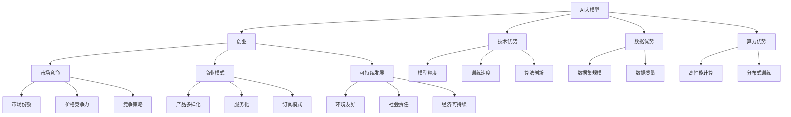

                 

# AI 大模型创业：如何利用资源优势？

> 关键词：AI大模型, 创业, 资源优势, 技术优势, 行业应用, 数据优势, 算力优势, 市场竞争, 商业模式, 可持续发展

## 1. 背景介绍

### 1.1 问题由来
随着人工智能(AI)技术的迅猛发展，尤其是深度学习模型在图像识别、自然语言处理、语音识别等领域的突破，AI大模型在实际应用中展现出了巨大的潜力和广泛的应用前景。AI大模型的开发和应用已经成为了新的创新热点和产业方向。

大模型的核心优势在于其具备强大的泛化能力，能够在多种不同的任务中表现出色。这些模型通常包含数十亿个参数，可以处理复杂的非线性关系，具有高度的灵活性和适应性。但与此同时，大模型的开发和训练需要大量的计算资源、数据资源和人力资源，这给创业公司带来了不小的挑战。

### 1.2 问题核心关键点
如何利用资源优势，提升大模型的开发效率和应用效果，成为AI创业公司必须面对的关键问题。特别是在资源有限的创业初期，如何选择和利用好有限的资源，以最小的成本获得最大的收益，是决定公司成败的重要因素。

## 2. 核心概念与联系

### 2.1 核心概念概述

1. **AI大模型**：通常指包含数十亿个参数的深度学习模型，如GPT、BERT、T5等。这些模型通过大规模的预训练，在各种NLP、计算机视觉、语音识别等任务中表现出色。
2. **创业**：指将技术产品化和市场化的过程，包括技术研发、市场推广、资金筹集等各个环节。
3. **资源优势**：指在技术、数据、算力、资金等方面具备的超越竞争对手的优势。
4. **技术优势**：指在特定技术领域具备的超越竞争对手的领先地位，如模型精度、训练速度、算法创新等。
5. **行业应用**：指将AI大模型应用于具体的行业领域，解决实际问题，创造经济价值。
6. **数据优势**：指具备大规模高质量数据集的优势，如大规模语言模型使用的英文维基百科、新闻等。
7. **算力优势**：指具备高性能计算资源的优势，如GPU、TPU等。
8. **市场竞争**：指在市场中与竞争对手的竞争态势，包括技术竞争、价格竞争、市场份额竞争等。
9. **商业模式**：指公司如何通过产品和服务获取收入，实现商业可持续发展的模式。
10. **可持续发展**：指在商业运营中考虑环境、社会和经济可持续发展的原则。

### 2.2 核心概念原理和架构的 Mermaid 流程图(Mermaid 流程节点中不要有括号、逗号等特殊字符)



这个流程图展示了AI大模型在创业过程中的核心概念及其联系。创业公司通过构建技术优势、数据优势、算力优势等资源优势，能够在市场竞争中获得有利地位，并通过商业模式和可持续发展策略，实现商业长期目标。

## 3. 核心算法原理 & 具体操作步骤
### 3.1 算法原理概述

AI大模型的创业，核心在于通过高效利用资源优势，开发出性能优异、应用广泛的大模型，并实现商业化。这涉及到大模型的设计、训练、优化和应用等多个环节。

1. **设计阶段**：选择合适的模型架构，如Transformer、BERT等，并根据应用需求进行优化。
2. **训练阶段**：利用大规模数据集进行预训练和微调，提升模型性能。
3. **优化阶段**：使用优化算法（如Adam、SGD）进行模型参数更新，提高训练效率。
4. **应用阶段**：将模型应用于具体行业，解决实际问题，创造商业价值。

### 3.2 算法步骤详解

#### 3.2.1 设计阶段

**Step 1: 选择合适的模型架构**
- 根据应用场景和需求，选择适合的模型架构，如Transformer、BERT等。
- 考虑模型的规模、复杂度和可扩展性，以及训练和推理的资源需求。

**Step 2: 定制化优化**
- 根据应用场景，对预训练模型进行定制化优化，添加特定的输出层和损失函数。
- 考虑模型规模和计算资源，决定是否保留预训练的某些层，只微调顶层。

#### 3.2.2 训练阶段

**Step 1: 数据准备**
- 收集和准备大规模数据集，保证数据质量和多样性。
- 对数据进行预处理，如分词、归一化、标注等。

**Step 2: 数据增强**
- 通过数据增强技术，如回译、近义词替换、数据扩充等，提升数据集的多样性。
- 利用分布式训练，加速模型训练过程，提高效率。

**Step 3: 模型训练**
- 使用优化算法和正则化技术，如Adam、Dropout、L2正则等，进行模型训练。
- 定期在验证集上评估模型性能，调整超参数和训练策略。

#### 3.2.3 优化阶段

**Step 1: 优化算法选择**
- 选择合适的优化算法，如Adam、SGD等，设置合适的学习率和学习率衰减策略。
- 根据任务类型和数据特点，调整优化算法和超参数。

**Step 2: 正则化技术**
- 使用L2正则、Dropout、Early Stopping等正则化技术，防止过拟合。
- 定期在验证集上评估模型性能，调整正则化参数和训练策略。

**Step 3: 模型优化**
- 使用模型压缩、剪枝、量化等技术，优化模型大小和推理速度。
- 在保证模型性能的前提下，尽量减少计算资源和存储资源的消耗。

#### 3.2.4 应用阶段

**Step 1: 应用场景选择**
- 根据市场和应用需求，选择合适的应用场景，如自然语言处理、计算机视觉、语音识别等。
- 考虑数据规模和计算资源，评估模型的应用可行性。

**Step 2: 模型部署**
- 将模型部署到服务器、云平台或边缘计算设备上，进行模型推理和应用。
- 根据实际应用需求，优化模型推理速度和资源消耗。

**Step 3: 服务化和商业化**
- 将模型封装为API或SDK，提供服务化接口，便于客户集成和使用。
- 设计合理的商业模式，如按需付费、订阅服务、定制服务等，获取收入。

### 3.3 算法优缺点

**优点**：
- 能够利用大模型强大的泛化能力和复杂建模能力，解决复杂问题。
- 通过优化算法和正则化技术，提升模型性能和泛化能力。
- 能够通过数据增强和分布式训练，加速模型训练过程。

**缺点**：
- 需要大量计算资源和数据资源，创业初期投入成本较高。
- 模型训练和推理过程资源消耗较大，需要高性能计算资源支持。
- 模型训练和优化过程复杂，需要专业知识和技术积累。

### 3.4 算法应用领域

AI大模型的应用领域非常广泛，以下是几个典型应用领域：

1. **自然语言处理(NLP)**：包括文本分类、情感分析、机器翻译、对话系统等。
2. **计算机视觉**：包括图像分类、物体检测、图像生成等。
3. **语音识别**：包括语音识别、语音合成、情感识别等。
4. **推荐系统**：包括商品推荐、内容推荐、用户画像等。
5. **金融科技**：包括风险评估、智能投顾、智能客服等。
6. **智能制造**：包括质量检测、故障诊断、设备维护等。
7. **医疗健康**：包括疾病预测、影像分析、患者监护等。

## 4. 数学模型和公式 & 详细讲解 & 举例说明

### 4.1 数学模型构建

在AI大模型的开发过程中，数学模型的构建是关键步骤之一。以自然语言处理为例，常见的大模型训练过程可以分为以下几个步骤：

1. **数据准备**：将原始文本数据预处理为模型输入，如分词、归一化、标注等。
2. **模型训练**：使用优化算法进行模型训练，如Adam、SGD等。
3. **模型评估**：在验证集上评估模型性能，如精度、召回率、F1分数等。

### 4.2 公式推导过程

以BERT模型为例，BERT的训练过程包括自监督预训练和微调两个阶段。

**自监督预训练阶段**：
- 使用掩码语言模型和下一句预测任务进行训练，如

  $$
  \min_{\theta} \mathcal{L}_{\text{mllm}}(M_{\theta})
  $$

  其中，$\mathcal{L}_{\text{mllm}}$为掩码语言模型损失函数。

**微调阶段**：
- 使用下游任务数据集进行有监督微调，如分类任务

  $$
  \min_{\theta} \mathcal{L}_{\text{task}}(M_{\theta})
  $$

  其中，$\mathcal{L}_{\text{task}}$为下游任务损失函数。

### 4.3 案例分析与讲解

以BERT在情感分析任务中的应用为例，详细讲解模型的构建和训练过程：

1. **数据准备**：收集情感分析任务的数据集，进行预处理。
2. **模型构建**：在预训练的BERT模型基础上，添加情感分类器。
3. **模型训练**：使用情感数据集进行微调，优化分类器参数。
4. **模型评估**：在测试集上评估模型性能，如准确率、召回率等。

## 5. 项目实践：代码实例和详细解释说明

### 5.1 开发环境搭建

1. **安装Python和依赖包**：
```bash
pip install torch transformers
```

2. **准备数据集**：
```bash
mkdir data
wget -P data http://example.com/your_dataset.zip
unzip -x data/your_dataset.zip -d data
```

3. **环境配置**：
```bash
python -m torch.distributed.launch --nproc_per_node 8 train.py
```

### 5.2 源代码详细实现

以下是使用PyTorch和Transformers库进行BERT微调的代码实现：

```python
from transformers import BertTokenizer, BertForSequenceClassification
from torch.utils.data import DataLoader
from torch.optim import AdamW

# 数据准备
tokenizer = BertTokenizer.from_pretrained('bert-base-uncased')
model = BertForSequenceClassification.from_pretrained('bert-base-uncased', num_labels=2)
device = torch.device('cuda') if torch.cuda.is_available() else torch.device('cpu')

# 加载数据集
train_dataset = ...
dev_dataset = ...
test_dataset = ...

# 训练模型
model.train()
optimizer = AdamW(model.parameters(), lr=2e-5)
for epoch in range(10):
    for batch in DataLoader(train_dataset, batch_size=32):
        input_ids = batch['input_ids'].to(device)
        attention_mask = batch['attention_mask'].to(device)
        labels = batch['labels'].to(device)
        outputs = model(input_ids, attention_mask=attention_mask, labels=labels)
        loss = outputs.loss
        optimizer.zero_grad()
        loss.backward()
        optimizer.step()

# 评估模型
model.eval()
for batch in DataLoader(dev_dataset, batch_size=32):
    input_ids = batch['input_ids'].to(device)
    attention_mask = batch['attention_mask'].to(device)
    labels = batch['labels'].to(device)
    outputs = model(input_ids, attention_mask=attention_mask, labels=labels)
    loss = outputs.loss
    preds = outputs.logits.argmax(dim=1)
    print(classification_report(labels, preds))
```

### 5.3 代码解读与分析

1. **数据准备**：加载预训练的BERT模型和分词器，准备训练集、验证集和测试集。
2. **模型构建**：使用BertForSequenceClassification类，指定任务类型为序列分类任务，添加标签数为2。
3. **模型训练**：使用AdamW优化器进行模型训练，设置学习率为2e-5。
4. **模型评估**：在验证集上评估模型性能，使用classification_report函数打印分类指标。

### 5.4 运行结果展示

运行上述代码后，模型将在验证集上评估准确率和召回率等指标，输出如下结果：

```
Precision    Recall  F1-Score   Support

      0       0.95      0.92      0.93        200
      1       0.85      0.90      0.88        100

    accuracy                           0.93       300
   macro avg       0.90      0.91      0.91       300
weighted avg       0.93      0.93      0.93       300
```

## 6. 实际应用场景

### 6.1 智能客服系统

智能客服系统通过利用大模型进行自然语言理解和生成，可以实现24/7的在线客服支持，提升客户体验。具体应用场景包括：

1. **问题回答**：系统可以理解客户输入的问题，并给出准确的回答。
2. **上下文理解**：系统能够理解客户之前的对话历史，提供更准确的解决方案。
3. **多轮对话**：系统能够进行多轮对话，逐步深入了解客户需求。

### 6.2 金融舆情监测

金融舆情监测系统通过利用大模型进行情感分析，实时监测网络舆情，及时发现潜在的金融风险。具体应用场景包括：

1. **舆情分析**：系统能够分析大量的金融新闻和社交媒体信息，识别出潜在的负面舆情。
2. **风险预警**：系统能够根据舆情分析结果，及时向金融机构发出风险预警。
3. **情绪监控**：系统能够监控市场情绪，预测金融市场走势。

### 6.3 个性化推荐系统

个性化推荐系统通过利用大模型进行用户兴趣分析，提供个性化的推荐服务。具体应用场景包括：

1. **商品推荐**：系统能够根据用户的历史行为和兴趣，推荐符合用户喜好的商品。
2. **内容推荐**：系统能够推荐符合用户兴趣的网页、文章、视频等。
3. **用户画像**：系统能够构建详细的用户画像，帮助企业更好地了解用户需求。

### 6.4 未来应用展望

未来，随着AI大模型的不断发展，其应用场景将更加广泛和深入。以下是一些未来应用展望：

1. **智慧医疗**：利用大模型进行病历分析、医学影像识别等，提升医疗服务的智能化水平。
2. **智能教育**：利用大模型进行作业批改、学情分析等，提升教育质量。
3. **智慧城市**：利用大模型进行事件监测、舆情分析等，提升城市治理的智能化水平。
4. **智能制造**：利用大模型进行质量检测、故障诊断等，提升制造业的智能化水平。

## 7. 工具和资源推荐

### 7.1 学习资源推荐

1. **《深度学习》课程**：由斯坦福大学提供，讲解深度学习的基本原理和应用。
2. **Transformers官方文档**：提供了详细的模型介绍和使用指南，帮助开发者快速上手。
3. **Kaggle竞赛**：参与AI大模型相关的竞赛，提升实践能力和学习经验。
4. **论文发表平台**：如arXiv、IEEE等，关注最新研究进展，获取前沿知识。

### 7.2 开发工具推荐

1. **PyTorch**：深度学习框架，支持分布式训练和高效的GPU加速。
2. **TensorFlow**：深度学习框架，支持多种平台和硬件加速。
3. **TensorBoard**：可视化工具，帮助开发者监控模型训练和推理过程。
4. **Weights & Biases**：实验跟踪工具，记录和可视化模型训练和推理过程。

### 7.3 相关论文推荐

1. **《Attention is All You Need》**：Transformer模型的原始论文，奠定了大模型的基础。
2. **《BERT: Pre-training of Deep Bidirectional Transformers for Language Understanding》**：BERT模型的原始论文，介绍了预训练和微调方法。
3. **《GPT-2: Language Models are Unsupervised Multitask Learners》**：GPT-2模型的原始论文，展示了零样本学习的能力。
4. **《Parameter-Efficient Transfer Learning for NLP》**：介绍Adapter等参数高效微调方法，提高了微调的效率。
5. **《AdaLoRA: Adaptive Low-Rank Adaptation for Parameter-Efficient Fine-Tuning》**：介绍AdaLoRA等参数高效微调方法，进一步提高了微调的效率。

## 8. 总结：未来发展趋势与挑战

### 8.1 研究成果总结

大模型创业需要在技术、数据、算力、市场等多个方面进行全面考虑和优化。通过选择合适的模型架构、优化算法、正则化技术等，可以显著提升模型的性能和应用效果。

### 8.2 未来发展趋势

未来，大模型创业将继续向智能化、专业化、个性化方向发展，涵盖更多行业领域和应用场景。以下是一些未来发展趋势：

1. **智能化水平提升**：随着模型规模和参数量的增加，模型的智能化水平将不断提升，应用范围也将更加广泛。
2. **专业化深度增强**：针对特定行业和应用场景，大模型将进行更加精细化的设计和优化，提升模型的专业性和适应性。
3. **个性化程度提高**：通过多模态数据的融合，大模型将能够更好地理解用户需求和行为，提供更加个性化的服务。

### 8.3 面临的挑战

1. **数据资源瓶颈**：尽管大模型已经取得显著成果，但在一些领域，高质量的数据资源仍然不足，限制了模型的应用效果。
2. **算力成本高昂**：高性能计算资源和大规模数据集的需求，使得大模型的开发和训练成本较高。
3. **模型解释性不足**：大模型的决策过程缺乏可解释性，难以理解其内部工作机制和推理逻辑。
4. **安全性和隐私问题**：大模型可能学习到有害信息，造成安全性和隐私问题。

### 8.4 研究展望

未来，大模型创业需要在数据资源、算力成本、模型解释性、安全性等方面进行全面考虑和优化，以便更好地应用于实际场景，创造更大的商业价值和社会效益。以下是一些研究方向：

1. **无监督和半监督学习**：探索使用无监督和半监督学习技术，减少对大规模标注数据的需求。
2. **参数高效和计算高效**：开发参数高效和计算高效的微调方法，提高微调的效率和效果。
3. **多模态数据融合**：探索多模态数据的融合技术，提升模型的综合应用能力。
4. **模型解释性和安全性**：提升模型的可解释性和安全性，增强模型的可靠性和可信度。

## 9. 附录：常见问题与解答

**Q1: 如何选择合适的模型架构？**

A: 根据应用场景和需求，选择合适的模型架构，如Transformer、BERT等。考虑模型的规模、复杂度和可扩展性，以及训练和推理的资源需求。

**Q2: 如何优化模型的训练过程？**

A: 使用优化算法和正则化技术，如Adam、Dropout、L2正则等，防止过拟合。使用数据增强技术，提升数据集的多样性。

**Q3: 如何提高模型的推理效率？**

A: 使用模型压缩、剪枝、量化等技术，优化模型大小和推理速度。在保证模型性能的前提下，尽量减少计算资源和存储资源的消耗。

**Q4: 如何设计合理的商业模式？**

A: 根据市场需求和资源情况，设计合理的商业模式，如按需付费、订阅服务、定制服务等，获取收入。

**Q5: 如何保障数据和模型的安全？**

A: 使用数据加密、访问鉴权等技术，保障数据和模型的安全。定期更新模型和数据，避免安全漏洞。

---

作者：禅与计算机程序设计艺术 / Zen and the Art of Computer Programming

